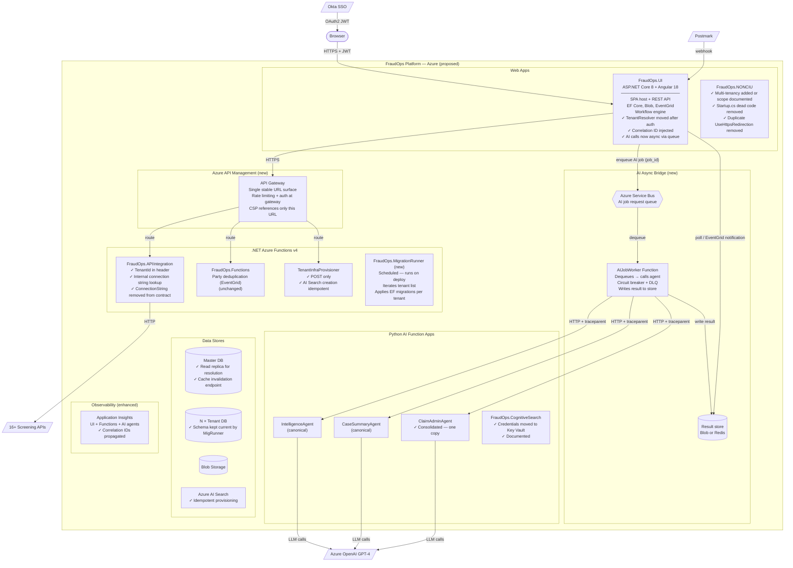
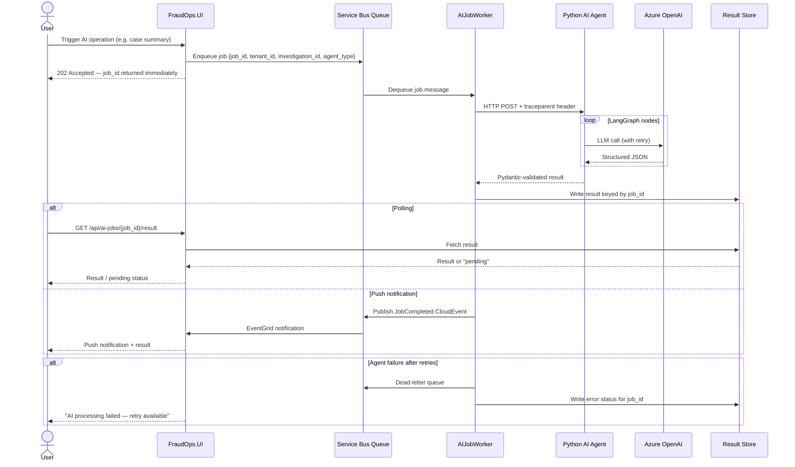

# Architecture Review: FraudOps

> **Date:** 2026-05-22
> **Reviewer:** Claude Code (Architecture Skill)
> **Based on:** ARCHITECTURE.md v1.1, MULTI-TENANCY.md v1.1, CLAUDE.md + **direct codebase inspection** (76 file reads across all components)
> **Review type:** Proactive — documentation validated against actual source code

---

## ⚠ Critical Findings — Act Before Reading the Rest

Two issues require immediate action independent of the broader architecture review:

### CRITICAL-1: Production credentials hardcoded in source code

**Files:**
- `FraudOps.CognitiveSearch/Program.cs` — hardcoded dev, test, and **production** Azure AI Search API keys and SQL Server passwords
- `FraudOpsIntelReIndex/FraudOpsReIndex.cs` — same pattern; dev, test, and **production** credentials for a second set of search and SQL resources

These are committed to source control. Production SQL passwords and admin API keys for `ai-searchservice-prod` and `sqlserverinstance-zodiac-prod` are visible in the repository. Neither file is mentioned anywhere in ARCHITECTURE.md.

**Immediate actions required:**
1. Rotate all credentials visible in these files (prod, UAT, dev) before this repository is accessed by anyone outside the current team.
2. Move credentials to Azure Key Vault (already in use elsewhere in the platform — the pattern exists).
3. Audit git history to determine how long these have been committed.

### CRITICAL-2: Broken Docker build — Node 10.x installed for Angular 18

**Files:** `Dockerfile.CIU` line 13, `Dockerfile.NONCIU` line 13
```
wget -qO- https://deb.nodesource.com/setup_10.x | bash -
```
Angular 18 requires Node ≥ 18. Node 10 reached end-of-life in April 2021. This build stage will fail at Angular compilation. If CI is currently succeeding, it means Angular is being built outside the container (the `build.yml` GitHub Actions step) and the Dockerfile is not actually used for Angular compilation — but it should still be fixed to avoid silent build environment divergence.

---

## Table of Contents

1. [Documentation vs. Reality — Deviation Map](#1-documentation-vs-reality--deviation-map)
2. [Current Architecture (As-Is, Code-Validated)](#2-current-architecture-as-is-code-validated)
3. [Root Cause Analysis](#3-root-cause-analysis)
4. [Quality Attribute Assessment](#4-quality-attribute-assessment)
5. [Proposed Architecture (To-Be)](#5-proposed-architecture-to-be)
6. [What Changes — Delta](#6-what-changes--delta)
7. [Migration Path](#7-migration-path)
8. [Architecture Decision Records](#8-architecture-decision-records)
9. [Risks and Mitigations](#9-risks-and-mitigations)
10. [Summary](#10-summary)

---

## 1. Documentation vs. Reality — Deviation Map

This section documents every confirmed discrepancy between ARCHITECTURE.md / CLAUDE.md and the actual source code. All findings are evidence-based with specific file paths.

| # | Documented claim | Reality (from code) | Severity | File evidence |
|---|---|---|---|---|
| D1 | `FraudOps.CognitiveSearch` — not mentioned | Console app in FraudOps.sln; provisioning tool for AI Search indexes; **hardcoded prod credentials** | **Critical** | `FraudOps.CognitiveSearch/Program.cs` lines 63, 139, 214 |
| D2 | `FraudOpsIntelReIndex` — "should be renamed" only | Old Azure Functions v1 re-indexer app; **hardcoded prod credentials**; `FraudOpsReIndex.cs.cs` double-extension rename error; `IntelReIndex.cs` is empty; server names reference "zodiac" not "fraudops" | **Critical** | `FraudOpsIntelReIndex/FraudOpsReIndex.cs` |
| D3 | Dockerfiles — silent on Node version | Both `Dockerfile.CIU` and `Dockerfile.NONCIU` install `setup_10.x` — Node 10, which cannot run Angular 18 | **High** | `Dockerfile.CIU:13`, `Dockerfile.NONCIU:13` |
| D4 | `FraudOps.Functions` — "hosts a workflow engine with pluggable node executors (ApiCallNodeExecutor, ConditionNodeExecutor). Workflows triggered via Azure Queue messages." | Functions contains **only** `DuplicatePartySearch.cs` (one EventGrid-triggered function). No Queue triggers. No workflow executors. The workflow engine (`IWorkflowService`, `ApiCallNodeExecutor`, `ConditionNodeExecutor`) is registered and runs in **`FraudOps.UI/Startup.cs`** lines 168–175. | **High** | `FraudOps.Functions/Functions/DuplicateParties/DuplicatePartySearch.cs`; `FraudOps.UI/Startup.cs:168-175` |
| D5 | TenantResolver at "position 10" in middleware pipeline | TenantResolver is at **position 5** in `Startup.Configure()` — after static files, before routing, CORS, and authentication. Unauthenticated requests reach the tenant lookup. | **High** | `FraudOps.UI/Startup.cs:267-301` |
| D6 | `FraudOps.NONCIU` — "ASP.NET Core 8 + Angular 18 underwriting variant (reduced module set)" | NONCIU has **no `TenantResolver`**, no `PermissionPolicyProvider`, no `ValidateIntegrationFilter`/`RateLimitFilter`/`ClientAuthFilter`, single JWT scheme (not three), no `ITenantResolverService`, minimal service set. Its `Startup.cs` contains a fully commented-out legacy implementation (lines 1–106). `UseHttpsRedirection()` is called **twice** (lines 274 and 293). Effectively a different application that happens to share the solution. | **High** | `FraudOps.NONCIU/Startup.cs` |
| D7 | `FraudOps.APIIntegration` — "SELECT API key from IntegrationList" — ConnectionStringRequest described as routing to DB key lookup | `ConnectionStringRequest` model contains a `ConnectionString` property (raw SQL connection string). Callers (FraudOps.UI) populate this field and send it over HTTP. Raw connection strings cross the service boundary in the request body. | **High** | `FraudOps.APIIntegration/Models/ThirdPartyAPIModel.cs` |
| D8 | `FraudOps.AIAgents` — not mentioned anywhere | A **4th Python Function app** at the solution root exposing `POST /generate_key_evidence`, `POST /generate_objective`, `POST /smart_prob` — the same three endpoints as `FraudOps.AI/FraudOps.IntelligenceAgent`. Different implementation (no `graph.py`/`state.py` pattern). `requirements.txt` specifies `langchain==1.2.10` — an invalid version number (LangChain has not reached 1.2.x). Has its own `host.json`, `requirements.txt`, `shared/llm_client.py`, `shared/tracing.py`. | **High** | `FraudOps.AIAgents/function_app.py`, `FraudOps.AIAgents/requirements.txt` |
| D9 | Shared Python code duplicated in two places: `FraudOps.AI/FraudOps.IntelligenceAgent/src/shared/` and `FraudOps.ClaimAdminAgent/shared/` | `llm_client.py` is **absent** from `FraudOps.AI/FraudOps.IntelligenceAgent/src/shared/` (only `tracing.py` and `__init__.py` there). A **third copy** of `llm_client.py` and `tracing.py` exists in `FraudOps.AIAgents/shared/` (undocumented). `tracing.py` is duplicated in two confirmed locations; `llm_client.py` in at least two. | **Medium** | `FraudOps.AI/FraudOps.IntelligenceAgent/src/shared/`, `FraudOps.ClaimAdminAgent/shared/`, `FraudOps.AIAgents/shared/` |
| D10 | DbContext `OnConfiguring` described as conditional override | Implementation confirmed, but `UseSqlServer()` is called twice: once at DI registration (`Startup.cs:86-93` with `DefaultConnection`) and once in `OnConfiguring` when tenant context is resolved. The second call result is discarded with `_`. May generate EF Core warnings. | **Low** | `FraudOps.Models/Data/FraudOps_DBContext.cs:1265-1286` |
| D11 | Three JWT authentication schemes | Confirmed accurate | Correct | `FraudOps.UI/Extensions/AuthenticationExtensions.cs:86-146` |
| D12 | Party deduplication EventGrid flow | Confirmed accurate | Correct | `FraudOps.Functions/Functions/DuplicateParties/DuplicatePartySearch.cs` |

---

## 2. Current Architecture (As-Is, Code-Validated)

### 2.1 Component Inventory (Corrected)

| Component | Type | Technology | In sln? | In ARCHITECTURE.md? | Active? |
|---|---|---|---|---|---|
| `FraudOps.UI` | Web App | ASP.NET Core 8 + Angular 18 | Yes | Yes | Yes |
| `FraudOps.NONCIU` | Web App | ASP.NET Core 8 + Angular 18 (minimal, no multi-tenancy) | Yes | Yes (underdescribed) | Yes |
| `FraudOps.Core` | Shared Library | .NET 8 | Yes | Yes | Yes |
| `FraudOps.Models` | Shared Library | .NET 8 + EF Core | Yes | Yes | Yes |
| `FraudOps.Functions` | Function App | Azure Functions v4 .NET — party dedup **only** | Yes | Yes (overclaimed) | Yes |
| `FraudOps.APIIntegration` | Function App | Azure Functions v4 .NET | Yes | Yes | Yes |
| `FraudOps.TenantInfraProvisioner` | Function App | Azure Functions v4 .NET | Yes | Yes | Yes |
| `FraudOps.AI/FraudOps.IntelligenceAgent` | Function App | Python + LangGraph | No (.py) | Yes | Yes |
| `FraudOps.AI/FraudOps.CaseSummaryAgent` | Function App | Python + LangGraph | No (.py) | Yes | Yes |
| `FraudOps.AI/FraudOps.ClaimAdminAgent` | Function App | Python (incomplete migration) | No (.py) | Yes (as incomplete) | Partial |
| `FraudOps.ClaimAdminAgent` (root) | Function App | Python + LangGraph (canonical) | No (.py) | Yes (as canonical) | Yes |
| `FraudOps.AIAgents` | Function App | Python (older/alt implementation) | No (.py) | **No — undocumented** | Unknown |
| `FraudOps.CognitiveSearch` | Console App | .NET 8 — AI Search provisioning | Yes | **No — undocumented** | One-time tool |
| `FraudOpsIntelReIndex` | Function App | Azure Functions v1 (.NET) — re-indexer | Yes | **No — undocumented** | Unknown |
| `FraudOps.DB` | SSDT | SQL Server schema | Yes | Yes | Yes |
| `FraudOpsIntelModels.DB` | SSDT | SQL Server schema | Yes | Yes | Yes |
| `FraudOpsLibrary/z-lib` | NPM Package | Angular 18 | — | Yes | Yes |

**Workflow engine location (corrected):** The workflow engine (`IWorkflowService`, `ApiCallNodeExecutor`, `ConditionNodeExecutor`) lives inside **`FraudOps.UI`**, registered in `Startup.cs`. It is not in `FraudOps.Functions`. Functions contains only the EventGrid-triggered party deduplication handler.

### 2.2 Context Diagram (Code-Validated As-Is)

```mermaid
flowchart TB
    Browser(["Browser / Angular 18 SPA"])
    Okta[/Okta SSO — OAuth2/]
    ThirdPartyAPIs[/"16+ Screening APIs\nAVA, DVLA, LexisNexis, CreditSafe…"/]
    Postmark[/Postmark — Email/]
    AzureOAI[/Azure OpenAI — GPT-4/]

    subgraph FraudOps["FraudOps Platform — Azure"]

        subgraph WebApps["Web Apps — Azure Web Apps on Docker"]
            UI["FraudOps.UI\nASP.NET Core 8 + Angular 18\n────────────────────\nSPA host + REST API\nEF Core direct DB access\nBlob storage I/O\nEventGrid publisher\nSync HTTP caller to AI agents\nWorkflow engine (IWorkflowService)\n⚠ TenantResolver runs before auth"]
            NONCIU["FraudOps.NONCIU\nASP.NET Core 8 + Angular 18\n⚠ No multi-tenancy\n⚠ Single JWT scheme\n⚠ Dead code in Startup.cs\n⚠ Double UseHttpsRedirection"]
        end

        subgraph FuncApps[".NET Azure Functions"]
            APIInt["FraudOps.APIIntegration\nAzure Functions v4\n16 provider wrappers\n⚠ Raw ConnectionString in request body"]
            Funcs["FraudOps.Functions\nAzure Functions v4\nParty deduplication ONLY\n(EventGrid trigger)"]
            Prov["TenantInfraProvisioner\nAzure Functions v4\nAzure resource provisioning\n⚠ GET+POST both accepted"]
            IntelReIndex["FraudOpsIntelReIndex\nAzure Functions v1 (old)\n⚠ Hardcoded credentials\n⚠ Undocumented"]
        end

        subgraph AILayer["Python AI Function Apps"]
            Intel["FraudOps.AI/IntelligenceAgent\nLangGraph — evidence,\nobjectives, smart probability"]
            Summary["FraudOps.AI/CaseSummaryAgent\nLangGraph — case summarisation"]
            ClaimRoot["ClaimAdminAgent (root)\nLangGraph — canonical copy\n⚠ duplicated at FraudOps.AI/"]
            AIAgentsNew["FraudOps.AIAgents\n⚠ Undocumented 4th agent\nSame 3 endpoints as IntelligenceAgent\n⚠ Invalid langchain==1.2.10"]
        end

        subgraph DataStores["Data Stores"]
            MasterDB[("Master DB\nTenantDBContext\n⚠ SPOF for all tenant routing")]
            TenantDBs[("N × Tenant DB\nFraudOps_DBContext\nsqldbintelhubdevContext")]
            BlobStorage[("Blob Storage\nN × 3 containers")]
            AISearch["Azure AI Search\nN × 5 indexes per tenant\n⚠ Non-idempotent provisioning"]
        end

        subgraph PlatformSvcs["Platform Services"]
            EventGrid{{"Azure EventGrid"}}
            KeyVault["Azure Key Vault\nSecrets + encryption keys"]
            AppInsights["Application Insights\n(Functions only — UI not covered)"]
            CogSearch["FraudOps.CognitiveSearch\n⚠ Undocumented\n⚠ Hardcoded prod credentials"]
        end
    end

    Browser -->|"HTTPS TLS 1.2/1.3 + JWT"| UI
    Browser -->|"HTTPS + JWT"| NONCIU
    Okta -->|OAuth2 JWT| Browser
    Postmark -->|"webhook — Basic auth"| UI

    UI -->|"HTTP sync — raw ConnectionString in body"| APIInt
    UI -->|"HTTP sync — 2-retry, no circuit breaker"| Intel
    UI -->|"HTTP sync — 2-retry, no circuit breaker"| Summary
    UI -->|"HTTP sync — 2-retry, no circuit breaker"| ClaimRoot
    UI -->|"CloudEvent publish"| EventGrid
    UI -->|"EF Core (tenant-resolved)"| TenantDBs
    UI -->|"EF Core"| MasterDB
    UI -->|"Block blobs + SAS tokens"| BlobStorage

    EventGrid -->|trigger| Funcs
    Funcs -->|"sp_getDuplicatesOptimized"| TenantDBs
    Funcs -->|"TenantConnectionService (correct)"| MasterDB

    APIInt -->|"⚠ uses ConnectionString from request body"| TenantDBs
    APIInt -->|HTTP| ThirdPartyAPIs

    Intel & Summary & ClaimRoot -->|"LLM calls"| AzureOAI

    Prov -->|"ARM — create resources"| TenantDBs & BlobStorage & AISearch
    Prov -->|"read secrets"| KeyVault
```



### 2.3 Middleware Pipeline (Actual Order)

The actual middleware order in `FraudOps.UI/Startup.cs Configure()` method:

| Position | Middleware | Documented position |
|---|---|---|
| 1 | `UseExceptionHandler` / `UseDeveloperExceptionPage` | 1 ✓ |
| 2 | `UseHttpsRedirection` | 2 ✓ |
| 3 | `UseStaticFiles` | 3 ✓ |
| 4 | `UseSpaStaticFiles` (non-dev) | — |
| **5** | **`UseMiddleware<TenantResolver>`** | **Documented as 10 ✗** |
| 6 | `UseRouting` | 5 (doc) ✗ |
| 7 | `UseCors("CorsPolicy")` | 6 (doc) ✓ |
| 8 | `UseAuthentication` | 7 (doc) ✗ — tenant resolution runs before auth |
| 9 | `UseAuthorization` | 8 (doc) ✗ |
| 10 | `UseAppRequestContext` | 9 (doc) ✗ |
| 0 (Program.cs) | CSP nonce middleware | 4 (doc) ✓ (relative order correct) |

**Architectural consequence:** TenantResolver runs before authentication. An unauthenticated request reaches the tenant lookup and can receive a `400 Bad Request` before auth middleware rejects it. This exposes tenant existence information to unauthenticated callers — an information disclosure concern.

### 2.4 NONCIU Actual State

NONCIU is far more diverged from FraudOps.UI than documented:

| Capability | FraudOps.UI | FraudOps.NONCIU (actual) |
|---|---|---|
| Multi-tenancy (`TenantResolver`) | Yes | **No** |
| JWT schemes | 3 (Default, Okta, Temporary) | **1 (custom symmetric key)** |
| RBAC (`PermissionPolicyProvider`) | Yes | **No** |
| Action filters (RateLimit, ClientAuth, etc.) | Yes | **No** |
| Workflow engine | Yes | **No** |
| `ITenantResolverService` | Yes | **No** |
| Active Startup.cs implementation | Clean | **Partially commented-out legacy** |
| `UseHttpsRedirection` | Once | **Twice (defect)** |
| Okta integration | Active | **Imported but commented out** |

---

## 3. Root Cause Analysis

### 3.1 Critical Findings

| # | Finding | Specific evidence |
|---|---|---|
| **C1** | Production SQL passwords and AI Search admin keys committed to source in two files | `FraudOps.CognitiveSearch/Program.cs:63,139,214`; `FraudOpsIntelReIndex/FraudOpsReIndex.cs` |
| **C2** | Docker build stage installs Node 10.x — Angular 18 build will fail inside container | `Dockerfile.CIU:13`; `Dockerfile.NONCIU:13` |

### 3.2 High-Severity Findings

| # | Finding | Root cause |
|---|---|---|
| H1 | AI agent calls block user requests (10–30s for GPT-4 with no circuit breaker) | Synchronous HTTP from UI with only 2-retry / 1-second sleep; no queue, no timeout enforcement |
| H2 | Raw SQL connection strings transmitted in HTTP request bodies to APIIntegration | `ConnectionStringRequest.ConnectionString` field populated by UI and sent over HTTP; `FraudOps.Functions` solves this correctly via `TenantConnectionService` — the pattern exists but is not followed |
| H3 | No cross-tenant schema migration strategy after initial provisioning | `TenantInfraProvisioner` applies migrations once at tenant creation; no mechanism for subsequent migrations across N tenant databases |
| H4 | Master DB is SPOF for all tenant resolution | Every cache-miss HTTP request queries the master DB; cache expiry + restarts cause thundering-herd; master DB outage locks all tenants |
| H5 | `FraudOps.AIAgents` is a 4th AI project: undocumented, exposes same 3 endpoints as IntelligenceAgent, has invalid `langchain==1.2.10` dependency | Discovered in codebase scan; `requirements.txt` will fail `pip install`; unclear if deployed or in use |
| H6 | TenantResolver runs before authentication — exposes tenant existence to unauthenticated callers | `Startup.cs` middleware ordering (position 5, before `UseAuthentication` at position 8) |
| H7 | Workflow engine lives in FraudOps.UI, not FraudOps.Functions as documented | Architecture doc overclaims Functions' role; workflow executors registered in UI's `Startup.cs:168-175` |

### 3.3 Medium-Severity Findings

| # | Finding | Root cause |
|---|---|---|
| M1 | Tenant config changes take up to 1 hour to propagate | 1-hour sliding cache in `IMemoryCache` with no invalidation on config save |
| M2 | NONCIU lacks multi-tenancy, RBAC, and has structural defects | Diverged from UI without a documented boundary; `UseHttpsRedirection` called twice; partially commented Startup |
| M3 | No distributed tracing across service boundaries | No correlation ID generated or propagated; `traceparent` not used |
| M4 | Function app URLs hardcoded in Angular CSP; no API gateway | CSP middleware enumerates individual Function URLs |
| M5 | AI Search provisioning is not idempotent | Documented gap — no existence check before index creation |
| M6 | `FraudOpsIntelReIndex` is Azure Functions **v1** (old WebJobs SDK), not v4 | `[FunctionName]` attribute (v1 style) vs `[Function]` (v4) — version mismatch with rest of platform |

### 3.4 Low-Severity / Structural Findings

| # | Finding |
|---|---|
| L1 | Two copies of `FraudOps.ClaimAdminAgent` (confirmed) |
| L2 | `tracing.py` duplicated in 2 confirmed locations; `llm_client.py` in 2 locations; 3rd copy in undocumented `FraudOps.AIAgents/shared/` |
| L3 | `FraudOps.UI/Models/` ↔ `FraudOps.Core/Models/` boundary blurred (tracked) |
| L4 | `FraudOpsIntelReIndex` naming and double `.cs.cs` file extension |
| L5 | `OnConfiguring` calls `UseSqlServer` twice; result discarded with `_` |
| L6 | Missing Tier 1 LLDs for ClaimAdminAgent, Functions, APIIntegration, TenantInfraProvisioner |
| L7 | TenantInfraProvisioner accepts GET for resource creation (HTTP semantics violation) |
| L8 | `FraudOps.AIAgents/requirements.txt` specifies `langchain==1.2.10` — invalid version, `pip install` will fail |

---

## 4. Quality Attribute Assessment

| Attribute | Current State | Target | Gap |
|---|---|---|---|
| **Security** | Mixed: strong foundation (Key Vault, AES, HSTS, client certs) undermined by raw connection strings in HTTP bodies and hardcoded production credentials in source | Must be highest priority | **Critical** |
| **Auditability / Compliance** | Strong: `EntityFrameworkCore.AuditTrail`, `AgentAudits`, `IntegrationAudits` | Maintain | None identified |
| **Availability** | Unknown: no documented SLA; master DB SPOF; TenantResolver before auth adds a dependency before requests can even be authenticated | 99.9%+ business hours | Medium–High |
| **Correctness** | Good for the documented path; NONCIU's structural state (no multi-tenancy, double HTTPS redirect) introduces risk of incorrect behaviour for underwriting users | Maintain | Medium (NONCIU) |
| **Latency** | Degraded for AI-heavy workflows: synchronous GPT-4 calls 10–30s per operation | P95 < 3s for UI interactions | High (AI paths) |
| **Observability** | Weak: console-only Serilog for UI; no correlation IDs; no cross-service trace | Full distributed trace + alerting | High |
| **Deployability** | Big-bang: FraudOps.UI is one deployable for SPA, all APIs, workflow engine | Independent deploys | Medium |
| **Maintainability** | Structural debt (duplicate agents, shared code, NONCIU divergence) accumulating; documentation significantly wrong in several areas | Reduce debt; fix docs | Medium–High |

---

## 5. Proposed Architecture (To-Be)

### 5.1 Container Diagram (To-Be)



### 5.2 Key Flow: AI Agent Invocation (To-Be)



---

## 6. What Changes — Delta

| Component | Current state (code-validated) | Proposed state | Why |
|---|---|---|---|
| **`FraudOps.CognitiveSearch`** | Hardcoded prod credentials in source | Move all credentials to Key Vault; parameterise at runtime | Critical: production secrets in source |
| **`FraudOpsIntelReIndex`** | Hardcoded prod credentials; Azure Functions v1; double `.cs.cs` | Credentials to Key Vault; upgrade to Functions v4 or replace with idempotent index management in provisioner; fix filename | Critical: secrets + outdated runtime |
| **`Dockerfile.CIU` / `Dockerfile.NONCIU`** | `setup_10.x` (Node 10, EOL) | `setup_20.x` (Node 20 LTS) | Dockerfile build stage must support Angular 18 |
| **`FraudOps.APIIntegration`** request contract | `ConnectionStringRequest.ConnectionString` sent over HTTP from UI | Remove `ConnectionString` field from `ConnectionStringRequest`; function looks up connection string via `TenantConnectionService` using `TenantId` (same as `FraudOps.Functions`) | Raw SQL connection strings must not cross service boundaries |
| **`FraudOps.NONCIU`** | No multi-tenancy, single JWT, `UseHttpsRedirection` ×2, commented Startup | Option A: Add `TenantResolver` + 3 JWT schemes to match UI. Option B: Document deliberately-reduced scope and apply to correct tenant set. Either way: remove dead code, fix double redirect | Undefined scope + structural defects |
| **TenantResolver middleware position** | Position 5 (before routing, before auth) | Move to after `UseAuthentication` and `UseAuthorization` | Prevents unauthenticated callers from probing tenant existence via 400 responses |
| **`FraudOps.AIAgents`** | Undocumented; same 3 endpoints as IntelligenceAgent; older pattern; `langchain==1.2.10` invalid | Triage: if active, document + align with IntelligenceAgent pattern + fix requirements. If superseded, delete | Invalid dependency will fail `pip install`; cannot deploy |
| **Workflow engine location** | Registered in `FraudOps.UI/Startup.cs` — architecture doc said it was in Functions | Correct the architecture documentation | Documentation is wrong; no code change needed |
| **AI agent invocation** | Synchronous HTTP from UI, 2-retry, no circuit breaker, no timeout | Async via Service Bus queue + AIJobWorker + result store | GPT-4 latency decoupled from user request |
| **Cross-tenant migrations** | No mechanism post-provisioning | `FraudOps.MigrationRunner` — scheduled Function runs on deploy, applies EF migrations per tenant | Prevents schema drift |
| **Tenant config cache** | 1-hour sliding, no invalidation | `ITenantCacheInvalidationService.InvalidateAsync(tenantId)` called on config save | Config changes take effect immediately |
| **AI Search provisioning** | Not idempotent (documented gap) | Add existence check before index creation | Safe to re-run provisioner |
| **TenantInfraProvisioner route** | `GET + POST /resources/{tenantId}` | `POST` only | GET must not have side effects |
| **`FraudOps.ClaimAdminAgent`** | 2 copies | Consolidate to `FraudOps.AI/`; delete root copy | Eliminate ambiguity |
| **Shared Python code** | `tracing.py` in 2 locations; `llm_client.py` in 2 locations; 3rd copy in AIAgents | Single `FraudOps.AI/shared/` package | One source of truth |
| **Distributed tracing** | None — no correlation IDs | `X-Correlation-Id` injected at UI middleware; propagated as `traceparent` to all downstream calls | End-to-end request traceability |
| **Azure API Management** | No gateway; Function URLs in CSP | APIM routes all Function calls; CSP references single APIM URL | URL stability; central policy |
| **ARCHITECTURE.md** | Multiple inaccuracies (workflow engine location, TenantResolver position, missing components) | Update to reflect code-validated reality | Documentation must match code |

---

## 7. Migration Path

Ordered by risk severity. Every step is independently shippable.

### Step 0 — Rotate compromised credentials (IMMEDIATE — before anything else)

**What:** Rotate every credential visible in `FraudOps.CognitiveSearch/Program.cs` and `FraudOpsIntelReIndex/FraudOpsReIndex.cs`:
- Azure AI Search admin API keys (dev, UAT, prod)
- SQL Server passwords (dev, UAT, prod) — both the "zodiac" and "fraudops" instances

**Then:** Move all credentials to Azure Key Vault using the same pattern already in place (`KeyVault` section in appsettings). Parameterise both programs to read from Key Vault at runtime.

**Audit:** Run `git log -S "Password=" -- "*.cs"` to check how long these have been committed and whether they appear in other files.

**State after:** No credentials in source control.

---

### Step 1 — Fix Dockerfiles: Node 10.x → Node 20 LTS (1 day)

**What:** In both `Dockerfile.CIU` and `Dockerfile.NONCIU`, change line 13:
```
# Before
wget -qO- https://deb.nodesource.com/setup_10.x | bash -
# After
wget -qO- https://deb.nodesource.com/setup_20.x | bash -
```

**Also:** Confirm whether Angular compilation actually runs inside the container or only in the GitHub Actions `build.yml` step. If it runs only in CI (which is likely given the build artifact upload), document this explicitly and remove the Node installation from the Dockerfile if it is unused.

**State after:** Dockerfile build stage is consistent with Angular 18 requirements.

---

### Step 2 — Fix `ConnectionStringRequest` antipattern (1 week)

**What:** Remove the `ConnectionString` property from `ConnectionStringRequest`. Update all `FraudOps.APIIntegration` HTTP trigger handlers to call `TenantConnectionService.GetConnectionStringByTenantIdAsync(request.TenantId)` internally. `FraudOps.Functions` already uses this pattern correctly — follow it.

**State after:** Raw SQL connection strings no longer cross service boundaries over HTTP.

**Rollback:** Revert model + handler changes.

---

### Step 3 — Fix TenantResolver middleware order (2 days)

**What:** In `FraudOps.UI/Startup.cs Configure()`, move `UseMiddleware<TenantResolver>()` from its current position (5 — before routing and auth) to after `UseAuthorization` (current position 9). Verify that all tenanted endpoints still resolve correctly. Confirm that the currently exempt endpoints (`/api/tenant/createtenant`, `/postmark/inbound`, webhook callbacks) remain functional with the new ordering.

**State after:** Unauthenticated requests are rejected by auth middleware before reaching the tenant lookup. Tenant existence is no longer inferable from 400 responses to unauthenticated requests.

**Rollback:** Revert the `Configure()` method to original order.

---

### Step 4 — Fix NONCIU structural defects (3 days)

**What:**
- Remove the duplicate `UseHttpsRedirection()` call (line 293 in `Startup.cs` — keep line 274).
- Remove the commented-out legacy implementation block (lines 1–106).
- Make an explicit architectural decision: **Option A** — add `TenantResolver` and 3 JWT schemes to align with UI. **Option B** — document NONCIU's deliberately reduced scope (which tenants use it, what they cannot do), leave it as a separate auth model.
- Either way: document the chosen approach in ARCHITECTURE.md.

**State after:** NONCIU compiles cleanly, has no dead code, and its relationship to UI is documented.

---

### Step 5 — Triage `FraudOps.AIAgents` (1 week)

**What:**
- Determine if `FraudOps.AIAgents` is deployed to any environment by checking Azure Function App deployments and CI/CD workflow files for references to this project.
- Fix `requirements.txt`: change `langchain==1.2.10` to a valid published version (e.g., `langchain==0.3.x` or `langchain>=0.3,<0.4` per the project's actual dependency).
- **If active:** Document in ARCHITECTURE.md, write LLD.md, align with the `graph.py`/`nodes.py`/`state.py` pattern.
- **If superseded by IntelligenceAgent:** Delete the project and remove from any deployment configs.

**State after:** No deployable in the repo has an invalid dependency. The 4th Python project is either documented or removed.

---

### Step 6 — Correct ARCHITECTURE.md (2 days)

**What:** Update ARCHITECTURE.md to reflect the code-validated reality:
- Section 10.5 Workflow Engine: move description from Functions to FraudOps.UI; correct trigger mechanism.
- Section 3.1 Standard API Request: correct TenantResolver to position 5 (before routing and auth) or to the new position after Step 3 is complete.
- Component Inventory: add `FraudOps.CognitiveSearch` and `FraudOpsIntelReIndex` with accurate descriptions.
- NONCIU section: describe actual capability set.

**State after:** Architecture documentation matches the codebase.

---

### Step 7 — Tenant cache invalidation (3 days)

**What:** Add `ITenantCacheInvalidationService.InvalidateAsync(string domain)` that removes the `tenant:{domain}` key from `IMemoryCache`. Call it from the admin tenant config save endpoint. Optionally expose `POST /api/tenant/refresh-cache/{tenantId}` for manual ops use.

**State after:** Feature flag and config changes take effect immediately on the next request.

---

### Step 8 — Idempotent provisioner + GET removal (3 days)

**What:**
- Add existence check in `SearchIndexService.CreateAISearchServiceAsync` before creating each index (same pattern as the existing SQL Server existence check).
- Remove the GET method attribute from `TenantInfraProvisioner` — POST only.

**State after:** Re-running the provisioner for an existing tenant is fully safe.

---

### Step 9 — Cross-tenant migration runner (2 weeks)

**What:** Create `FraudOps.MigrationRunner` — a new Azure Functions app or console app run as a deployment step. It reads the tenant list from `TenantDBContext`, decrypts each connection string, and calls `Database.MigrateAsync()` for `FraudOps_DBContext` and `sqldbintelhubdevContext` per tenant. Add to the GitHub Actions CD pipeline to run after Docker push and before `az webapp restart`. Pipeline gates on runner success (non-zero exit = no restart).

**State after:** Every schema change is applied across all tenant databases on deploy. Multi-tenant schema drift is eliminated.

---

### Step 10 — Distributed tracing (1 week)

**What:** Inject `X-Correlation-Id` (UUID v4) at the UI middleware layer. Propagate as `traceparent` on all outbound HTTP calls (to Functions and AI agents). Log `correlationId` in Serilog enrichers. Extract in Python agents and include in Application Insights telemetry. Configure FraudOps.UI to send telemetry to the same Application Insights resource as Functions.

**State after:** End-to-end request trace: browser → UI → Function/Agent → LLM call, all correlated by a single ID.

---

### Step 11 — Async AI agent invocation via Service Bus (3–4 weeks)

**What:**
1. Create Azure Service Bus namespace and queue (`ai-job-requests`).
2. Create `FraudOps.AIJobWorker` Azure Function (Service Bus trigger): dequeues, calls agent, writes result to Blob/Redis keyed by `job_id`, publishes `JobCompleted` event.
3. In FraudOps.UI: replace synchronous AI calls with `ServiceBusClient.SendMessageAsync(job)` returning a `job_id`. Add `GET /api/ai-jobs/{job_id}/result` for polling. Gate behind `AIAsyncMode` feature flag.
4. Add DLQ monitoring and alerting.

**State after:** GPT-4 latency is decoupled from the HTTP request path. Failed AI jobs are durable. Natural backpressure under OpenAI throttling.

---

### Step 12 — Azure API Management gateway (4–6 weeks)

**What:** Provision Azure API Management (Consumption tier). Import Function app definitions. Route all FraudOps.UI → Function calls through APIM. Update Angular CSP to the single APIM URL. Migrate per-endpoint `RateLimitFilter` logic to APIM policies.

**State after:** Single stable URL surface. Adding or changing Function apps no longer requires a frontend CSP update.

---

### Step 13 — Consolidate ClaimAdminAgent + shared Python code (2 weeks)

**What:**
1. Bring `FraudOps.AI/FraudOps.ClaimAdminAgent/` to parity with root-level canonical copy.
2. Write LLD.md for it.
3. Delete `FraudOps.ClaimAdminAgent/` (root).
4. Create `FraudOps.AI/shared/` package with `llm_client.py` and `tracing.py`.
5. Update all three documented agents to import from the shared package.
6. Update ARCHITECTURE.md and CLAUDE.md.

**State after:** Zero duplicate components. Single shared Python utility package.

---

## 8. Architecture Decision Records

### ADR-001: Retain database-per-tenant isolation model

**Status:** Accepted
**Date:** 2026-05-22

**Context:** FraudOps serves financial services customers with strict data isolation requirements. The database-per-tenant model provides hard isolation — a query bug cannot expose cross-tenant data. The operational cost is N databases to manage, migrate, and monitor.

**Decision:** Retain database-per-tenant. Address the migration gap (Step 9) rather than changing the isolation model.

**Alternatives considered:**
- **Row-level security (shared schema):** Simpler operationally. Rejected — a missing `WHERE tenant_id = @id` predicate exposes cross-tenant data. The risk is unacceptable for a fraud investigation platform handling regulated financial data.

**Consequences — Positive:** Hard data isolation; clear per-tenant backup/restore; strong regulatory compliance posture.
**Consequences — Negative:** Migration orchestration tooling required (Step 9). N databases to monitor.
**Neutral / to monitor:** At >100 tenants, SQL Server instance proliferation becomes a cost concern. Revisit then.

---

### ADR-002: Move TenantResolver to after authentication

**Status:** Proposed (Step 3)
**Date:** 2026-05-22

**Context:** The current middleware order places `TenantResolver` at position 5, before `UseAuthentication` at position 8. This means unauthenticated requests trigger a tenant lookup in the master DB. A 400 response leaks tenant existence information to unauthenticated callers.

**Decision:** Move `TenantResolver` to after `UseAuthorization`. Ensure exempt endpoints (tenant creation, Postmark webhook, SMS/ClearSpeed callbacks) remain correctly exempt.

**Consequences — Positive:** Unauthenticated requests never reach the tenant lookup. Reduces information disclosure surface.
**Consequences — Negative:** Requires verifying all endpoint exemptions remain correct with the new ordering.

---

### ADR-003: Introduce Service Bus for AI agent invocation

**Status:** Proposed (Step 11)
**Date:** 2026-05-22

**Context:** Synchronous AI calls create a hard dependency between Azure OpenAI latency/availability and user-facing response times. GPT-4 calls take 10–30 seconds. The 2-retry / 1-second sleep pattern is insufficient for production resilience.

**Decision:** Queue AI job requests via Azure Service Bus. UI returns `202 Accepted` with a `job_id` immediately. `AIJobWorker` Function dequeues and calls agents.

**Alternatives considered:**
- **Circuit breaker only (Polly):** Reduces cascading failures but does not solve latency. Rejected as insufficient.
- **Azure Durable Functions:** Suitable for complex orchestration but over-engineered for a simple fan-out. Rejected.

**Consequences — Positive:** GPT-4 latency removed from request path. Failed jobs durable (DLQ). Natural backpressure.
**Consequences — Negative:** Angular UI must handle job lifecycle (pending/completed/failed). New infrastructure component.

---

### ADR-004: Remove ConnectionString from APIIntegration request contract

**Status:** Proposed (Step 2)
**Date:** 2026-05-22

**Context:** `FraudOps.APIIntegration` accepts a `ConnectionStringRequest` model that includes a raw `ConnectionString` field. FraudOps.UI populates this field and sends it over HTTP. `FraudOps.Functions` already solves this correctly using `TenantConnectionService` — the right pattern exists in the same codebase.

**Decision:** Remove `ConnectionString` from `ConnectionStringRequest`. APIIntegration uses `TenantConnectionService.GetConnectionStringByTenantIdAsync(TenantId)` internally.

**Consequences — Positive:** Raw connection strings are never in HTTP request bodies.
**Consequences — Negative:** APIIntegration gains a master DB dependency (same as Functions — acceptable).

---

## 9. Risks and Mitigations

| Risk | Likelihood | Impact | Mitigation |
|---|---|---|---|
| Rotated credentials (Step 0) break active deployments if existing secrets are in config files | High | High | Test each environment after rotation before closing out. Update Azure App Settings for all Function apps and Web Apps that reference the rotated values. |
| Migration runner (Step 9) fails mid-run, leaving some tenant DBs on old schema | Medium | High | Per-tenant logging with rollup exit code. Use expand-contract migrations. Gate deployment on success. |
| Moving TenantResolver after auth (Step 3) breaks an exempt endpoint that is currently passing because tenant resolution happens before auth rejection | Medium | Medium | Audit all endpoints in the exempt list. Test each in a branch deployment before merging. |
| `FraudOps.AIAgents` is actively called by tenants and deleting it causes outage | Low | High | Search all CI/CD workflow files and Azure Function App deployment slots for `FraudOps.AIAgents` before deletion. Check Azure Application Insights for active invocations. |
| Service Bus async bridge (Step 11) introduces stale AI results shown to users | Low | Medium | Version results with a `generated_at` timestamp. UI shows "as of {time}" with a manual refresh option. |
| NONCIU multi-tenancy gap (no TenantResolver) means underwriting users are currently isolated by a different mechanism or there is a data leakage risk | Unknown | High | **Immediate audit required** — determine how NONCIU currently identifies tenant context for DB operations. If no mechanism exists, this is a data access control gap. |

---

## 10. Summary

### What is sound (do not change)

- **Database-per-tenant isolation** is the right model for regulated financial services data.
- **AES-encrypted connection strings in Key Vault** — correct pattern. The issue is not the pattern but a single implementation in APIIntegration that bypasses it.
- **LangGraph agent architecture** (`graph.py` / `nodes.py` / `state.py`, `lru_cache`, Pydantic validation) — well-designed; follow it for every new agent.
- **LLD documentation convention** — excellent; the gaps (missing LLDs) should be filled, but the convention itself is right.
- **`EntityFrameworkCore.AuditTrail`** — good auditability with no per-entity effort.
- **Three-environment CI/CD pipeline** (DEV → UAT → PROD via tags) — clean and well-structured.
- **`TenantConnectionService` pattern in `FraudOps.Functions`** — correct approach that APIIntegration should follow.

### Prioritised action list

| Priority | Finding | Step | Effort |
|---|---|---|---|
| **P0** | Production credentials in source code | Step 0 | **IMMEDIATE** |
| **P0** | NONCIU has no multi-tenancy — audit data access | — | **IMMEDIATE audit** |
| 1 | Docker Node 10.x — broken build stage | Step 1 | 1 day |
| 2 | Connection strings in HTTP request bodies | Step 2 | 1 week |
| 3 | TenantResolver runs before authentication | Step 3 | 2 days |
| 4 | NONCIU structural defects | Step 4 | 3 days |
| 5 | `FraudOps.AIAgents` — undocumented, invalid dependency | Step 5 | 1 week |
| 6 | ARCHITECTURE.md incorrect in 5 areas | Step 6 | 2 days |
| 7 | Tenant config changes take up to 1 hour | Step 7 | 3 days |
| 8 | Non-idempotent provisioner / GET for resource creation | Step 8 | 3 days |
| 9 | No cross-tenant migration strategy | Step 9 | 2 weeks |
| 10 | No distributed tracing | Step 10 | 1 week |
| 11 | AI agents called synchronously, no resilience | Step 11 | 3–4 weeks |
| 12 | No API gateway — CSP hardcodes Function URLs | Step 12 | 4–6 weeks |
| 13 | Duplicate ClaimAdminAgent + shared Python code | Step 13 | 2 weeks |

**Total estimated effort:** ~18–22 weeks. Steps 0–8 address all critical/high severity findings and can be completed in ~4–5 weeks. The remaining steps address medium-severity and structural improvements.

The architecture has a sound core — the multi-tenancy model, Azure infrastructure choices, and AI agent patterns are all well-conceived. The critical issues (hardcoded credentials, connection strings in HTTP bodies) are antipatterns against an otherwise reasonable security posture, not systemic failures. The structural and documentation gaps reflect growth without corresponding upkeep — addressable with focused effort.

---

*Report generated by Claude Code using the Architecture skill. Based on ARCHITECTURE.md v1.1, MULTI-TENANCY.md v1.1, CLAUDE.md, and direct inspection of source files across all 13 components on 2026-05-22. All findings include specific file and line number evidence.*
