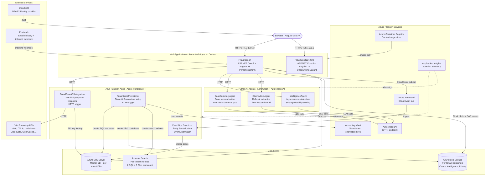
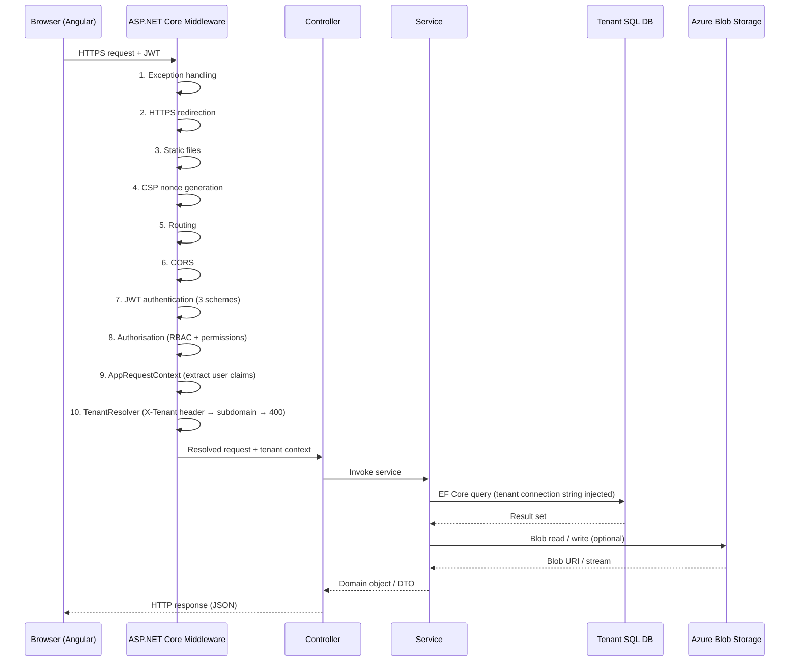
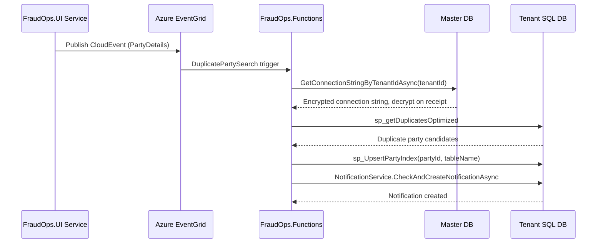
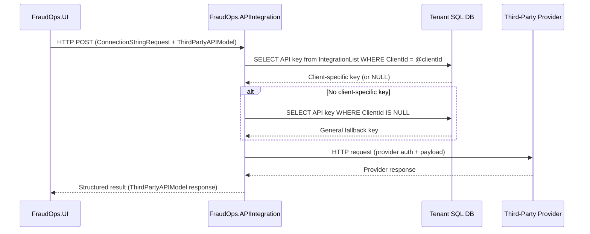
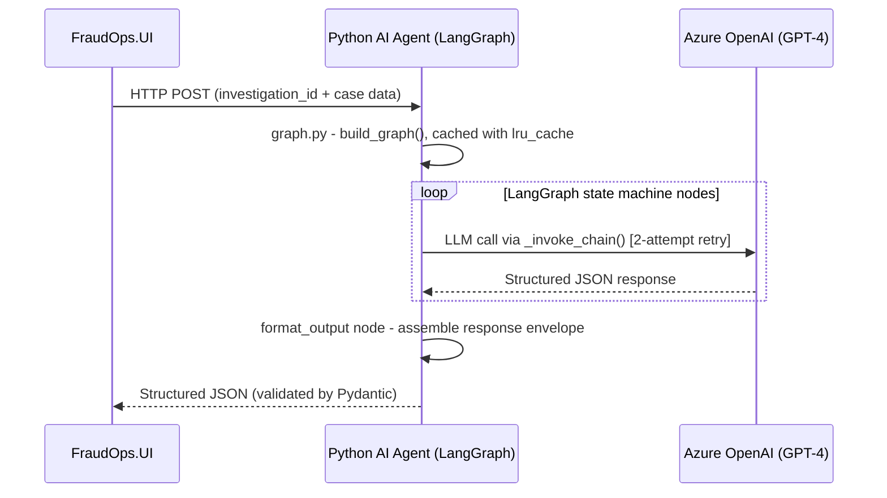
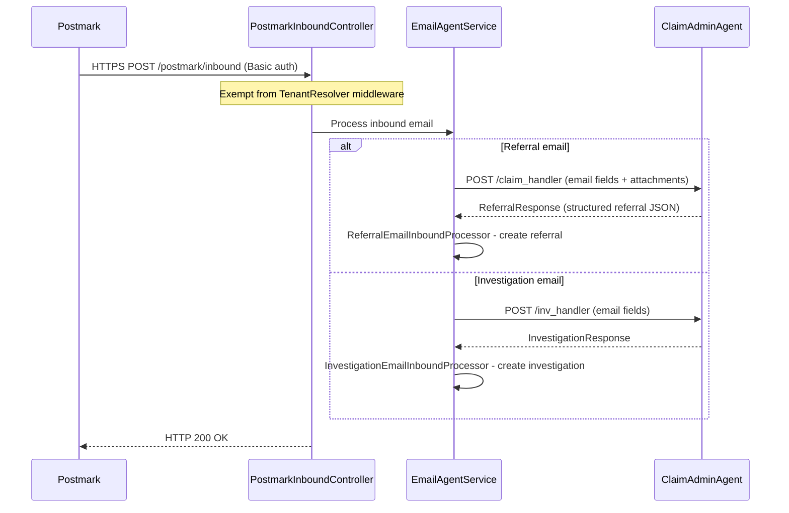
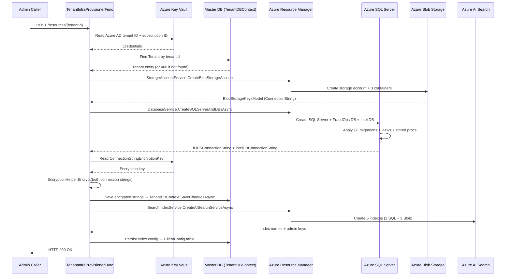
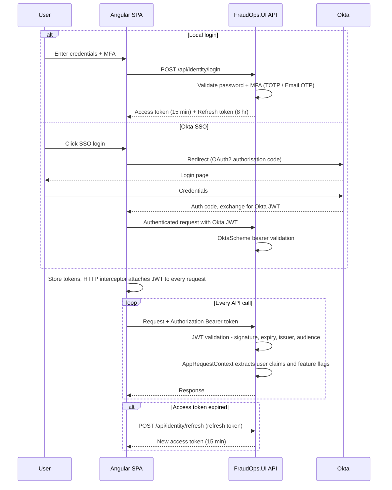
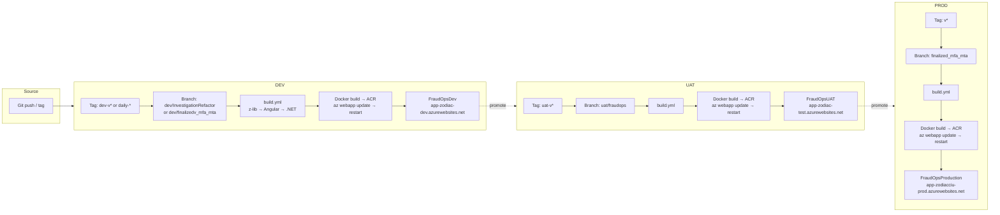

# FraudOps — Architecture

> **Version:** 1.1 | **Last updated:** 2026-05-21

## Table of Contents

1. [System Overview](#1-system-overview)
2. [Component Inventory](#2-component-inventory)
3. [End-to-End Request Flows](#3-end-to-end-request-flows)
4. [Angular SPA Module Map](#4-angular-spa-module-map)
5. [Azure Infrastructure](#5-azure-infrastructure)
6. [Authentication & Authorisation](#6-authentication--authorisation)
7. [Logging & Observability](#7-logging--observability)
8. [External Dependencies](#8-external-dependencies)
9. [CI/CD Pipeline](#9-cicd-pipeline)
10. [Cross-cutting Concerns](#10-cross-cutting-concerns)

---

## 1. System Overview

FraudOps is a multi-tenant, cloud-native fraud detection and claims investigation platform. The system is composed of:

- An Angular 18 SPA served from an ASP.NET Core 8 host (`FraudOps.UI`)
- A secondary underwriting-focused web application (`FraudOps.NONCIU`)
- Azure Functions apps for async processing, third-party API orchestration, and tenant provisioning
- Three Python Azure Functions apps implementing LangGraph-based AI agents
- A shared SQL Server schema project and a shared Angular component library

All components are containerised via Docker, deployed to Azure Web Apps via Azure Container Registry (ACR), and promoted through DEV → UAT → PROD environments via GitHub Actions.

### System Context Diagram



---

## 2. Component Inventory

| Component | Type | Technology | Role |
| --------- | ---- | ---------- | ---- |
| `FraudOps.UI` | Web App | ASP.NET Core 8 + Angular 18 | Primary SPA host + REST API for all fraud/investigation operations |
| `FraudOps.NONCIU` | Web App | ASP.NET Core 8 + Angular 18 | Insurance underwriting variant (reduced module set) |
| `FraudOps.Core` | Shared Library | .NET 8 (no DI, no EF) | Shared middleware, helpers, extensions, base service contracts |
| `FraudOps.Models` | Shared Library | .NET 8 + EF Core | Entity models, `DbContext`s, EF migrations, Fluent API configs |
| `FraudOps.Functions` | Function App | Azure Functions v4 (.NET) | Async party deduplication via Azure EventGrid |
| `FraudOps.APIIntegration` | Function App | Azure Functions v4 (.NET) | HTTP-triggered wrappers for 16+ third-party screening/intelligence APIs |
| `FraudOps.TenantInfraProvisioner` | Function App | Azure Functions v4 (.NET) | HTTP-triggered tenant infrastructure provisioning (SQL, Blob, AI Search) |
| `FraudOps.AI/FraudOps.IntelligenceAgent` | Function App | Python + LangGraph + Azure OpenAI | Key evidence extraction, investigation objectives, smart probability scoring |
| `FraudOps.AI/FraudOps.CaseSummaryAgent` | Function App | Python + LangGraph + Azure OpenAI | LangGraph 7-node case summarisation with LoB rubric-driven output |
| `FraudOps.AI/FraudOps.ClaimAdminAgent` | Function App | Python + LangGraph + Azure OpenAI | LangGraph referral extraction from inbound emails (in `FraudOps.AI/`) |
| `FraudOps.ClaimAdminAgent` (root) | Function App | Python + LangGraph + Azure OpenAI | More mature copy with `workflows/`, `observability/`, `helper/` — canonical until consolidated (see [Known Structural Issues](#known-structural-issues)) |
| `FraudOps.DB` | SSDT Project | SQL Server | Main application database schema |
| `FraudOpsIntelModels.DB` | SSDT Project | SQL Server | Intelligence hub database schema |
| `FraudOpsLibrary` | NPM Package | Angular 18 | Shared Angular component library (`z-lib`), bundled as a local `.tgz` |

### DbContext Ownership

| DbContext | Owned by | Purpose |
| --------- | -------- | ------- |
| `FraudOps_DBContext` | `FraudOps.Models` | Per-tenant application data (investigations, referrals, parties, screening, workflow) |
| `sqldbintelhubdevContext` | `FraudOps.Models` | Per-tenant intelligence hub data |
| `TenantDBContext` | `FraudOps.Models` | Central tenant registry; shared across all tenants |

**Model ownership rule:** Entity models + EF configs belong in `FraudOps.Models`. Business logic belongs in `FraudOps.Core`. `FraudOps.UI/Models/` is for UI-specific DTOs only — never add shared types there.

---

## 3. End-to-End Request Flows

### 3.1 Standard API Request



### 3.2 Async Processing — Party Deduplication



### 3.3 Third-Party API Screening



### 3.4 AI Agent Calls



### 3.5 Inbound Email → Auto-Create Referral



### 3.6 Tenant Provisioning



---

## 4. Angular SPA Module Map

| Module | Route area | Purpose |
| ------ | ---------- | ------- |
| `referrals` | `/referrals` | Intake and triage of new cases |
| `investigations` | `/investigations` | Core case management and investigator workflow |
| `screening` | `/screening` | Automated third-party data check orchestration |
| `intelligence-referral` | `/intelligence-referral` | Referrals generated from intelligence findings |
| `network-strategy` | `/network-strategy` | Network-based fraud detection and graph visualisation |
| `documents` | `/documents` | Document upload, preview, and management |
| `reports` | `/reports` | Reporting and analytics |
| `my-tasks` | `/my-tasks` | Per-user task management |
| `auto-create` | `/auto-create` | AI-powered automatic case creation from documents |
| `api-integrations` | `/api-integrations` | Third-party API integration management |
| `notifications` | `/notifications` | User notification centre |
| `greetings` | `/greetings` | Onboarding and welcome flows |
| `auth` | `/auth` | Login, MFA, password reset |
| `search` | `/search` | Cross-entity search (powered by Azure Cognitive Search) |

Shared standalone components (navbar, sidebar, footer) live in `ClientApp/src/app/components/`. Auth guards, HTTP interceptors (JWT injection), and token refresh logic live in `ClientApp/src/app/core/`.

---

## 5. Azure Infrastructure

### 5.1 Services Used

| Azure Service | Usage |
| ------------- | ----- |
| **Azure Web Apps** | Hosts FraudOps.UI and FraudOps.NONCIU Docker containers |
| **Azure Container Registry (ACR)** | Stores Docker images pushed by CI/CD |
| **Azure SQL Server** | Per-tenant FraudOps DB and Intel DB; shared master Tenant DB |
| **Azure Blob Storage** | Document storage (cases, intelligence, library containers per tenant) |
| **Azure EventGrid** | Triggers `FraudOps.Functions` party deduplication (CloudEvent format) |
| **Azure AI Search** | Full-text and SQL-indexed search (2 SQL indexes + 3 Blob indexes per tenant) |
| **Azure OpenAI** | GPT-4 (`openai-fraudops-dev.cognitiveservices.azure.com`) for all AI agents |
| **Azure Key Vault** | Secrets: Azure AD tenant ID, subscription ID, connection string encryption key |
| **Azure Functions** | Hosts Functions, APIIntegration, TenantInfraProvisioner, and Python AI agents |
| **Azure Application Insights** | Function app telemetry and sampling |

### 5.2 Known Named Resources (by environment)

| Resource | DEV | UAT | PROD |
| -------- | --- | --- | ---- |
| Web App (CIU) | `app-zodiac-dev.azurewebsites.net` | `app-zodiac-test.azurewebsites.net` | `app-zodiacciu-prod.azurewebsites.net` |
| Web App (NONCIU) | `app-zodiacnonciu-dev.azurewebsites.net` | `app-zodiacnonciu-test.azurewebsites.net` | `app-zodiac-nonciu-prod.azurewebsites.net` |
| SQL Server | `sqlserver-zodiac-dev.database.windows.net` | `sqlserver-zodiac-test.database.windows.net` | `sqlserverinstance-zodiac-prod.database.windows.net` |
| AI Search | `ai-search-service-dev.search.windows.net` | `ai-searchservice-test.search.windows.net` | `ai-searchservice-prod.search.windows.net` |
| Storage | `stzodiacfilestoragedev` | `stzodiacfilestoragetest` | `stzodiacprod` |
| Azure OpenAI | `openai-fraudops-dev.cognitiveservices.azure.com` | — | — |
| EventGrid | `fraudops-eventgrid.uksouth-1.eventgrid.azure.net` | — | — |

### 5.3 Blob Container Naming

Each tenant gets three Blob containers, provisioned at onboarding:

- `{CasesContainerName}` — case documents and attachments
- `{IntelligenceContainerName}` — intelligence documents
- `{LibraryContainerName}` — library/template documents

Container names are stored on the `Tenant` entity after provisioning.

---

## 6. Authentication & Authorisation

### 6.1 JWT Schemes

Three JWT bearer schemes are registered in `AddJwtAuthentication()`:

| Scheme | Issuer / Authority | Audience | Token lifetime | Purpose |
| ------ | ------------------ | -------- | -------------- | ------- |
| **Default (JwtBearer)** | `urn:fraudops:issuer` | `urn:fraudops:api` | 15 minutes | Primary application access token |
| **OktaScheme** | `https://integrator-3697631.okta.com/oauth2/ausxkepr1xrWDOs1r697` | `api://myspa` | Okta-controlled | Okta SSO users |
| **TemporaryScheme** | `urn:fraudops:issuer` | `urn:fraudops:api` | 5 minutes | Short-lived tokens (e.g. MFA handshake) |

Refresh tokens last 8 hours. The Angular HTTP interceptor attaches the bearer token to every API request.

### 6.2 Authentication Flow



### 6.3 Authorisation Model

Permission policies are implemented via a custom `PermissionPolicyProvider`. Policies follow the syntax:

```text
authorize:{role1,role2}:{permission1,permission2}
```

Access is granted if the user matches **any** role in the list **or** holds **any** listed permission. Permissions are stored as JWT claims in the format `{Feature}.{Action}` (e.g. `Investigation.Edit`).

Angular route guards enforce the same RBAC model on the frontend.

### 6.4 Postmark Webhook Auth

The `/postmark/inbound` endpoint uses HTTP Basic authentication (`SimpleBasicAuthHandler`) validated against `Postmark:Username` and `Postmark:Password` from configuration.

### 6.5 Identity Defaults

- Password: minimum 8 characters, must contain uppercase, lowercase, digit, and non-alphanumeric character
- Account lockout: 5 failed attempts → locked for 5 minutes
- Email confirmation required; unique email enforced

### 6.6 Transport Security

- Minimum TLS 1.2 (Kestrel enforces both 1.2 and 1.3)
- Client certificates required in non-Development environments (with revocation checking)
- HSTS: 365 days, `includeSubDomains`, `preload`
- Max request body: 50 MB

---

## 7. Logging & Observability

### 7.1 Serilog (FraudOps.UI)

| Sink | Level | Notes |
| ---- | ----- | ----- |
| Console | Information | Structured JSON |

Enrichers: `FormLogContext`, `WithMachineName`, `WithProcessId`, `WithThreadId`.

Minimum levels: `Information` (default), `Warning` for `Microsoft.*` and `System.*` namespaces.

> **Note:** SQL Server, Seq, and email sinks are referenced in the CLAUDE.md conventions but not present in the base `appsettings.json` — they may be configured in environment-specific settings or as optional sinks.

### 7.2 Audit Trail

All entity saves in `FraudOps_DBContext` are automatically logged via `AspNetCoreHero.EntityFrameworkCore.AuditTrail`. No additional instrumentation required per entity.

### 7.3 Azure Functions

Application Insights is enabled for all Function apps (via `host.json` `extensionBundle` + sampling configuration).

---

## 8. External Dependencies

### 8.1 Third-Party Screening & Intelligence APIs

Managed by `FraudOps.APIIntegration`. All providers are HTTP-triggered Azure Functions. API keys are stored per-tenant in the `IntegrationList` table with client-specific key fallback.

| Category | Providers |
| -------- | --------- |
| Vehicle | AVA (Advanced Vehicle Application), DVLA, MOT History |
| Company | Companies House, CreditSafe, Experian |
| People / Identity | Lexis Nexis (IDU, PeopleSearch, EmailAge, ReverseSearch), T2A, PIPL |
| Phone | Telesign (Live, Phone, Score), TextMagic (SMS dispatch + webhooks) |
| Email | Debounce, DisposableEmail |
| Financial | VAT registry |
| Interview | ClearSpeed (participant management, questionnaire, results) |
| Fraud signal | HeadsUp |

Full details (auth method, endpoints, data mapping, rate limits) → `FraudOps.APIIntegration/API-INTEGRATIONS.md`.

### 8.2 Email Providers

| Provider | Used for | Config section |
| -------- | -------- | -------------- |
| **Postmark** | Primary transactional email; inbound email webhook | `PostEmailSettings` |
| **Brevo (Sendinblue)** | Secondary email provider | `EmailSettings` (SMTP via Office 365) |

Active provider is selected via `EmailProvider` configuration value.

### 8.3 Map & Address Services

- **Google Maps** — referenced in CSP header (directions, maps embed)
- **ideal-postcodes** — UK postcode lookup (referenced in CSP)

---

## 9. CI/CD Pipeline

### 9.1 Environment Promotion



### 9.2 Build Steps (reusable `build.yml`)

1. Install Node 18 + .NET SDK 8
2. Build and package `FraudOpsLibrary/z-lib` → copy into `ClientApp/src/assets/library`
3. `npm run build:prod` (Angular, `FraudOps.UI/ClientApp`)
4. `dotnet build FraudOps.UI.csproj`
5. Upload artifact `fraudopsdev-build` (1-day retention)

### 9.3 Deploy Steps (reusable `deploy.yml`)

1. Download build artifact
2. Login to Azure via service principal (`AZURE_CREDENTIALS` secret)
3. Build Docker image (`Dockerfile.CIU` or `Dockerfile.NONCIU`) with `ENVIRONMENT` build arg
4. Push to ACR: `$ACR/$image_name:$DEPLOYMENT_TAG`
5. `az webapp sitecontainers update` (sidecar pattern, target port 80)
6. `az webapp restart`

### 9.4 Docker Base Images

Both Dockerfiles use a two-stage build:

- **Build stage:** `mcr.microsoft.com/dotnet/sdk:8.0` (installs Node 10.x for Angular build inside container)
- **Runtime stage:** `mcr.microsoft.com/dotnet/aspnet:8.0`
- Exposed ports: 80, 443

---

## 10. Cross-cutting Concerns

### 10.1 Multi-tenancy

Every HTTP request is resolved to a tenant by `TenantResolver` middleware (position 10 in the middleware pipeline). The resolved tenant's decrypted connection strings are injected into `FraudOps_DBContext` and `sqldbintelhubdevContext` via `ITenantResolverService`. Tenant provisioning is a separate HTTP-triggered operation handled by `FraudOps.TenantInfraProvisioner`.

See [MULTI-TENANCY.md](MULTI-TENANCY.md) for the complete end-to-end description.

### 10.2 Content Security Policy

A custom middleware generates a cryptographic nonce on every request and injects it into the CSP response header and Razor layouts. The policy allows connections to:

- `https://integrator-3697631.okta.com` (Okta authentication)
- Google Maps APIs
- `ideal-postcodes` (postcode lookup)
- Azure Function URLs (API integration calls)
- Tenant blob storage domains

Additional security headers set by the same middleware:

- `X-Frame-Options: SAMEORIGIN`
- `X-Content-Type-Options: nosniff`
- `Strict-Transport-Security: max-age=31536000; includeSubDomains`
- `Cache-Control: no-store, no-cache, must-revalidate`

### 10.3 Action Filters

Applied at controller/action level (not globally):

| Filter | Purpose |
| ------ | ------- |
| `ValidateIntegrationFilter` | Validates integration configuration before API calls |
| `ClientAuthFilter` | Client-level authentication for external integrations |
| `RateLimitFilter` | Per-client rate limiting |
| `OperationWindowFilter` | Restricts operations to configured time windows |

### 10.4 Document Storage

Documents are stored as block blobs in Azure Blob Storage. Only blob URIs and metadata are persisted in SQL Server — blob content is never stored in the database. SAS tokens are generated per-request for secure client-side access.

### 10.5 Workflow Engine

`FraudOps.Functions` hosts a JSON-configured workflow engine with pluggable node executors. Two node types are currently implemented:

- `ApiCallNodeExecutor` — calls an external HTTP endpoint
- `ConditionNodeExecutor` — evaluates a condition to branch workflow

Workflows are triggered via Azure Queue messages. Configuration is stored in the `Workflow` and `WorkflowNodes` tables.

### 10.6 MFA

TOTP-based MFA is supported. The issuer name is "FraudOps" with 6-digit codes (standard `otpauth://totp` URI scheme). Email-based MFA is the default preferred provider; Authenticator app and "None" are also supported per-tenant.

---

## Known Structural Issues

Tracked as active tech debt — do not add further duplication.

1. **Duplicate `FraudOps.ClaimAdminAgent`:** Exists at both `FraudOps.ClaimAdminAgent/` (root, more mature) and `FraudOps.AI/FraudOps.ClaimAdminAgent/` (incomplete migration). Treat root copy as canonical until consolidated.
2. **Shared Python code duplicated:** `shared/llm_client.py` and `shared/tracing.py` exist in both `FraudOps.AI/FraudOps.IntelligenceAgent/src/shared/` and `FraudOps.ClaimAdminAgent/shared/`. Target: a shared package under `FraudOps.AI/shared/`.
3. **`FraudOps.UI/Models/` vs `FraudOps.Core/Models/` overlap:** Both contain `DTO/`, `Enum/`, `Shared/`, `Referral/`. Rule: UI-specific → `FraudOps.UI/Models/`; shared → `FraudOps.Core/Models/`.
4. **`FraudOpsIntelReIndex` naming:** Breaks the `FraudOps.<Name>` convention. Should be `FraudOps.IntelReIndex`.
