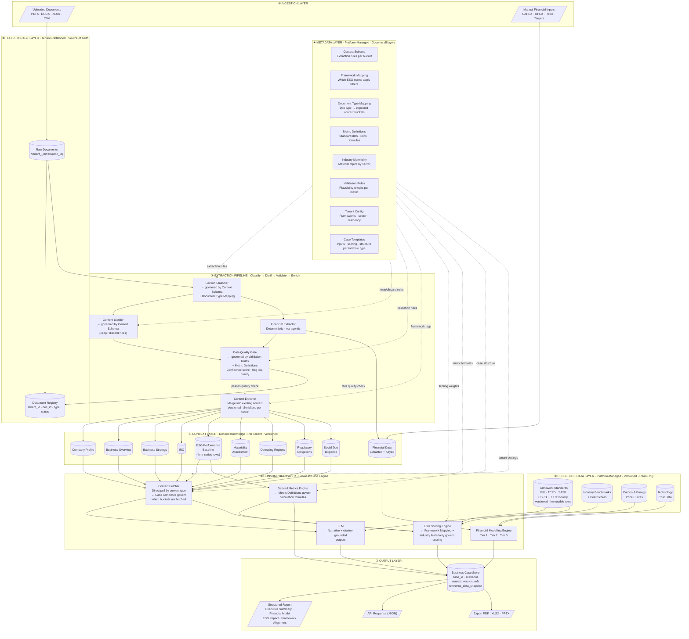
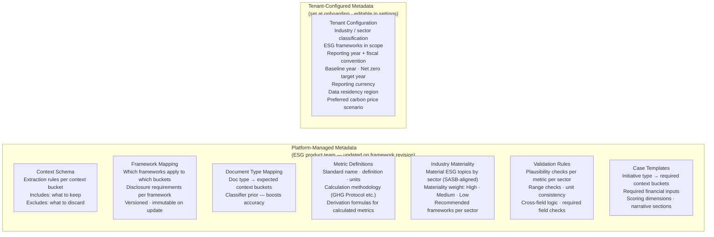
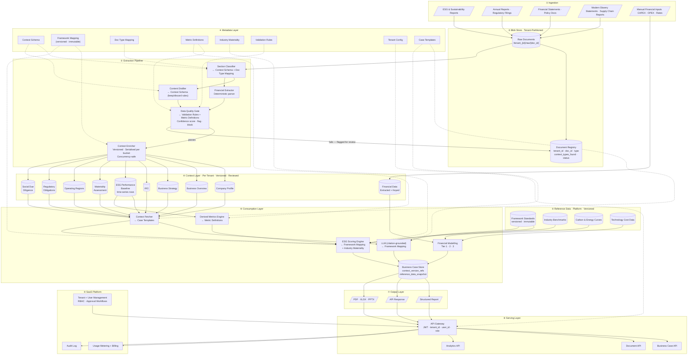
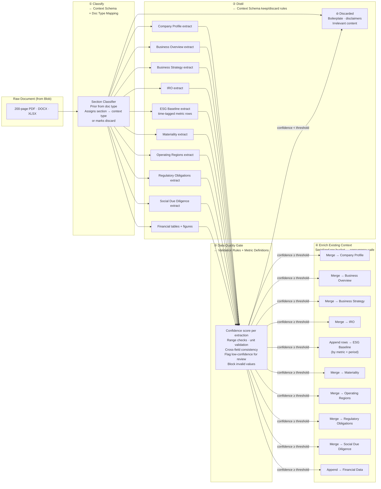
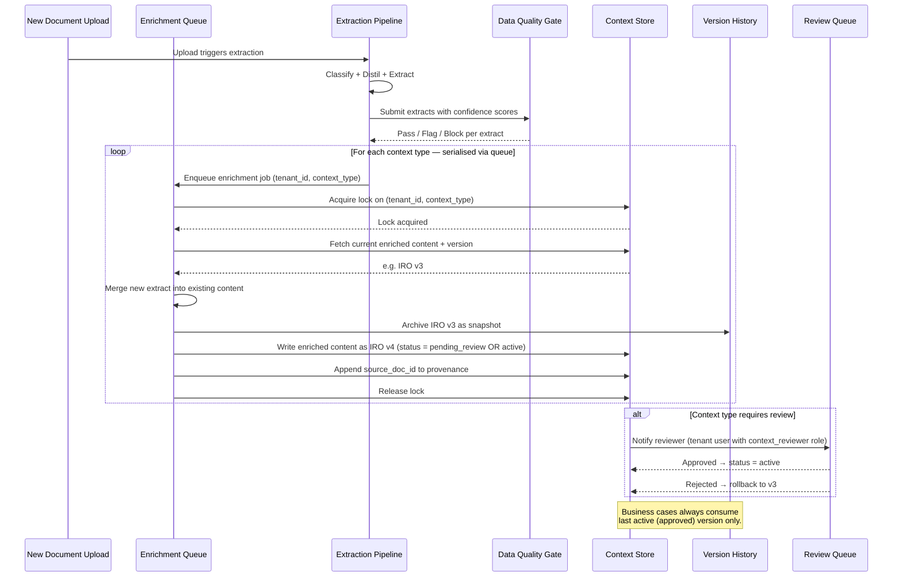
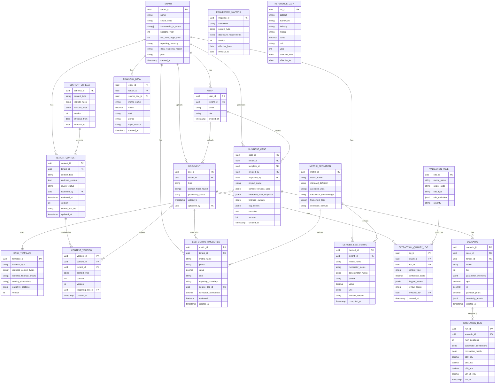

# ESG Custodian — Data Architecture

> A document-first, multi-tenant **SaaS** platform for building ESG business cases.  
> Documents are uploaded into blob storage, distilled into focused context buckets per client, enriched incrementally with each new upload, and consumed directly by the business case engine — no vector search, no context dilution.  
> A Metadata Layer governs every stage of the pipeline — from extraction rules to ESG framework mappings to validation logic — making the platform configurable without code changes.

---

## Table of Contents

- [Data Layer Overview](#data-layer-overview)
- [Metadata Layer](#metadata-layer)
- [Full Architecture](#full-architecture)
- [Context Layer — Distilled Knowledge](#context-layer--distilled-knowledge)
- [Context Extraction Pipeline](#context-extraction-pipeline)
- [Context Enrichment Flow](#context-enrichment-flow)
- [Reference Data Layer](#reference-data-layer)
- [Financial Modelling Tiers](#financial-modelling-tiers)
- [Core Data Model](#core-data-model)
- [Tenant Isolation Strategy](#tenant-isolation-strategy)
- [Architectural Decisions](#architectural-decisions)
- [Technology Stack](#technology-stack)

---

## Data Layer Overview

Seven data layers from raw document to delivered business case, governed at every stage by the Metadata Layer.

---

## Metadata Layer

The Metadata Layer is the **intelligence and configuration brain** of the platform. It makes every layer governable without code changes — when ESG frameworks update, you update metadata, not software.

### Metadata Types

### What Each Metadata Type Governs

| Metadata | Governs | Without it |
|---|---|---|
| **Context Schema** | Section Classifier (what to extract), Content Distiller (what to keep/discard) | Classifier guesses; irrelevant content enters context store |
| **Framework Mapping** | Context tagging during enrichment, ESG Scoring Engine gap analysis | Scoring is generic; framework alignment is unmeasurable |
| **Document Type Mapping** | Classifier prior — expected buckets per doc type | Every doc treated identically; accuracy drops on standard doc types |
| **Metric Definitions** | Derived Metrics Engine formulas, Data Quality Gate unit checks | Scope 2 location-based vs market-based are indistinguishable; benchmarks can't be compared |
| **Industry Materiality** | ESG Scoring Engine weighting, extraction prioritisation per sector | A bank and a mining company scored identically; materiality is invisible |
| **Validation Rules** | Data Quality Gate — catches bad extractions before context store write | Mis-OCR'd numbers enter context silently; financial models are corrupted |
| **Case Templates** | Context Fetcher (which buckets to pull), LLM prompt structure, scoring dimensions | All business cases structured identically regardless of initiative type |
| **Tenant Configuration** | Blob routing (data residency), LLM endpoint selection, benchmark selection, carbon price default | EU tenant data routes to US; wrong industry benchmarks applied; wrong frameworks scored |

---

## Full Architecture

---

## Context Layer — Distilled Knowledge

Nine typed context buckets per tenant. Each bucket is the living, enriched, reviewed knowledge the platform has built from all uploaded documents.

| # | Context Bucket | What it Contains | Primary Source Documents | Review Required |
|---|---|---|---|---|
| 1 | **Company Profile** | Legal name, sector, size, ownership, subsidiaries, stock listing | Annual Report, Corporate Profile | Optional |
| 2 | **Business Overview** | Products/services, value chain, customers, geographies, business model | Annual Report, Investor Presentation | Optional |
| 3 | **Business Strategy** | Strategic priorities, growth agenda, transformation, ESG commitments | Annual Report (strategy), Board Report | Optional |
| 4 | **IRO** | Climate risks (physical + transition), social risks, governance risks, opportunities, likelihood/impact ratings | TCFD Report, Risk Register | Recommended |
| 5 | **ESG Performance Baseline** | Scope 1/2/3 by year, energy/water/waste metrics, D&I data, targets, baselines — stored as **time-series rows**, not text | Sustainability Report, ESG Disclosure | **Required** |
| 6 | **Materiality Assessment** | Material ESG topics, stakeholder input, double materiality (CSRD), prioritisation matrix | Materiality Report, Sustainability Report | **Required** |
| 7 | **Operating Regions** | Countries/regions of operation, key sites, supply chain geographies, high-risk territories | Annual Report, Supply Chain Report | Optional |
| 8 | **Regulatory Obligations** | Applicable frameworks, compliance deadlines, specific disclosure requirements, jurisdiction rules | Regulatory filings, Sustainability Report | **Required** |
| 9 | **Social Due Diligence** | Modern Slavery Act statements, supplier audit coverage/findings/remediation, human rights policy, CSDDD/UNGPs alignment, grievance mechanisms | MSA Statement, Supply Chain Audit Reports, Human Rights Policy | **Required** |
| — | **Financial Data** | CAPEX/OPEX baseline, energy bills, ESG investment spend + manually keyed initiative inputs | Financial Statements + User Input | **Required** |

---

## Context Extraction Pipeline

---

## Context Enrichment Flow

Enrichment is serialised per `(tenant_id, context_type)` to prevent race conditions. Every prior version is archived. Context is only promoted to `active` after passing the review gate (where required).

---

## Reference Data Layer

Platform-managed, shared across all tenants, read-only from tenant context. Rows are **immutable** — updates insert new versioned rows with `effective_from` / `effective_to`, so business cases can be reproduced against the framework version that existed when they were generated.

| Reference Dataset | Contents | Used By | Update Cadence |
|---|---|---|---|
| **Framework Standards** | GRI topic standards, TCFD, SASB industry standards, CSRD/ESRS, EU Taxonomy screening criteria, UN SDG mappings — versioned, immutable | ESG Scoring Engine, LLM prompt builder | On framework revision — new rows inserted, old rows closed |
| **Industry Benchmarks** | Sector-average emissions intensity, energy per unit revenue, D&I ratios, ESG scores by GICS/NACE | ESG Scoring Engine (peer gap) | Quarterly |
| **Carbon & Energy Price Curves** | Current + forward carbon price (ETS + voluntary), electricity/gas price by region | Financial Modelling Engine | Monthly |
| **Technology Cost Data** | Benchmark CAPEX/OPEX for solar, EV fleet, LED, heat pumps, CCUS | Financial Modelling Engine (Tier 2/3 defaults) | Quarterly |

---

## Financial Modelling Tiers

```mermaid
flowchart LR
    subgraph T1["Tier 1 — Deterministic  (always run)"]
        T1A["NPV · IRR"]
        T1B["Payback Period"]
        T1C["TCO · ROI"]
        T1D["Carbon Avoidance Cost\ntonne CO₂e avoided per £ spent"]
    end

    subgraph T2["Tier 2 — Scenario Analysis  (on request)"]
        T2A["Base · Bull · Bear Comparison"]
        T2B["Single-variable Sensitivity Sweep"]
        T2C["Break-even Analysis\ncarbon price · energy cost"]
        T2D["Tornado Chart  ranked variable impact"]
    end

    subgraph T3["Tier 3 — Stochastic  (on request)"]
        T3A["Monte Carlo  10 000 iterations"]
        T3B["Outcome Probability Distribution\nNPV · IRR"]
        T3C["Value at Risk — VaR 95%"]
        T3D["Multi-period DCF  stochastic rate path"]
    end

    T1 -->|"+ parameter ranges"| T2
    T2 -->|"+ probability distributions\n+ correlation matrix"| T3
```

---

## Core Data Model

---

## Tenant Isolation Strategy

| Layer | Isolation Mechanism |
|---|---|
| **Blob Store** | Key prefix `/tenant_{id}/` — IAM policy enforces prefix-scoped access. Routed to region-specific bucket per `data_residency_region` |
| **Document Registry** | `tenant_id` on every row; every query appends `WHERE tenant_id = :tid` |
| **Context Store** | PostgreSQL Row-Level Security (RLS) on `tenant_id`; service account has no `BYPASSRLS` |
| **ESG Metrics Time-series** | Same RLS; partitioned by `tenant_id` for query performance |
| **Financial Data** | Same RLS; `source_doc_id` validated against tenant before insert |
| **Business Case Store** | Same RLS; `context_versions_used` and `reference_data_snapshot` reference only tenant's own versions |
| **Metadata Layer** | Platform-managed schemas are read-only to all tenant service accounts; Tenant Config rows are scoped to `tenant_id` |
| **Reference Data** | Separate read-only DB role; no tenant writes; shared safely because it contains no tenant data |
| **LLM API Routing** | `data_residency_region` on Tenant Config routes inference calls to region-appropriate LLM endpoints |
| **API Gateway** | JWT `tenant_id` + `user_id` + `role` claims injected server-side; action-level RBAC enforced per role |

---

## Architectural Decisions

| Concern | Decision | Rationale |
|---|---|---|
| **No vector store / RAG** | Direct fetch by context type | Predefined buckets make retrieval deterministic — no dilution from loosely related chunks |
| **Metadata Layer as config brain** | Platform Config DB, governs every pipeline stage | Framework changes, new sectors, new ESG norms = metadata update, not a code release |
| **ESG baseline as time-series rows** | `ESG_METRIC_TIMESERIES` with `period` field | Trend analysis, trajectory-to-target, and year-on-year comparison are impossible on a flat blob |
| **Serialised enrichment per bucket** | Queue + lock per `(tenant_id, context_type)` | Concurrent uploads without locking cause silent data loss via lost-update race condition |
| **Data Quality Gate** | Confidence scoring + validation rules before context store write | Bad extractions must be blocked or flagged before they corrupt context; silent bad data is the highest-risk failure mode |
| **Derived Metrics Engine** | Separate deterministic calculation layer using Metric Definitions | Emission intensity, water intensity etc. are *calculated*, not extracted — they need a defined, auditable formula path |
| **Reference data immutable + versioned** | `effective_from / effective_to` — updates insert new rows | Business cases can be reproduced against the framework version that existed at generation time |
| **`reference_data_snapshot` on business case** | Snapshot of reference versions used at generation | Decouples case output from future reference data updates alongside context version refs |
| **RBAC within tenant** | `USER` + `role` + approval states on context and cases | ESG business cases are cross-functional; CFO, sustainability, procurement, legal need different permissions |
| **Review gates on context** | Required for high-stakes buckets (ESG Baseline, Materiality, IRO, Regulatory Obligations, Social Due Diligence) | Extraction errors in high-stakes buckets corrupt business cases and regulatory outputs silently |
| **Data residency routing** | `data_residency_region` on Tenant drives blob region + LLM endpoint | EU enterprise clients under CSRD require data to remain in EU; LLM inference of tenant data must not transit to non-compliant regions |

---

## Technology Stack

| Layer | Options |
|---|---|
| **Blob Store** | AWS S3 · Azure Blob Storage — region-pinned per tenant |
| **Document Registry + Context Store + Metadata** | PostgreSQL with Row-Level Security + partitioning |
| **ESG Metrics Time-series** | PostgreSQL (TimescaleDB extension) · InfluxDB for high-volume |
| **Enrichment Queue** | AWS SQS FIFO · Azure Service Bus — FIFO per `(tenant_id, context_type)` |
| **Section Classifier + Distiller** | LLM (Claude / GPT-4o) with structured output — governed by Context Schema metadata |
| **Financial Extractor** | Azure Document Intelligence · AWS Textract · `pdfplumber` |
| **Data Quality Gate** | Python rules engine consuming Validation Rules metadata |
| **Context Enricher** | LLM (Claude) — merge prompt governed by Framework Mapping metadata |
| **Derived Metrics Engine** | Python — deterministic formula execution from Metric Definitions |
| **LLM — Business Case Generation** | Claude (Anthropic) — citation-grounded via structured output schema |
| **Financial Modelling Engine** | NumPy / SciPy (Python) — server-side arithmetic, not LLM |
| **Report / Export Generation** | Puppeteer (PDF) · `openpyxl` (XLSX) · `python-pptx` (PPTX) |
| **API Gateway** | AWS API Gateway · Azure APIM · Kong — RBAC enforced at action level |
| **Auth** | Auth0 · AWS Cognito · Azure Entra ID |
| **Billing** | Stripe (metered) · Chargebee |
| **Observability** | Datadog · Grafana + Prometheus — per-tenant dashboards |
| **Audit Log** | Append-only immutable store — AWS CloudTrail · Azure Monitor |

---

> **Open question**  
> **ESG frameworks in scope for v1** — GRI + TCFD only, or also SASB, CSRD, EU Taxonomy?  
> This determines the initial seed content for the Metadata Layer: Context Schema rules, Framework Mapping entries, Metric Definitions, and Validation Rules will all be written per framework.
