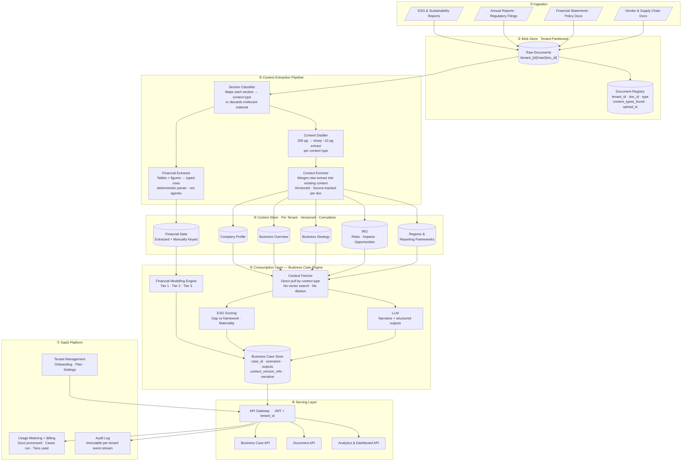
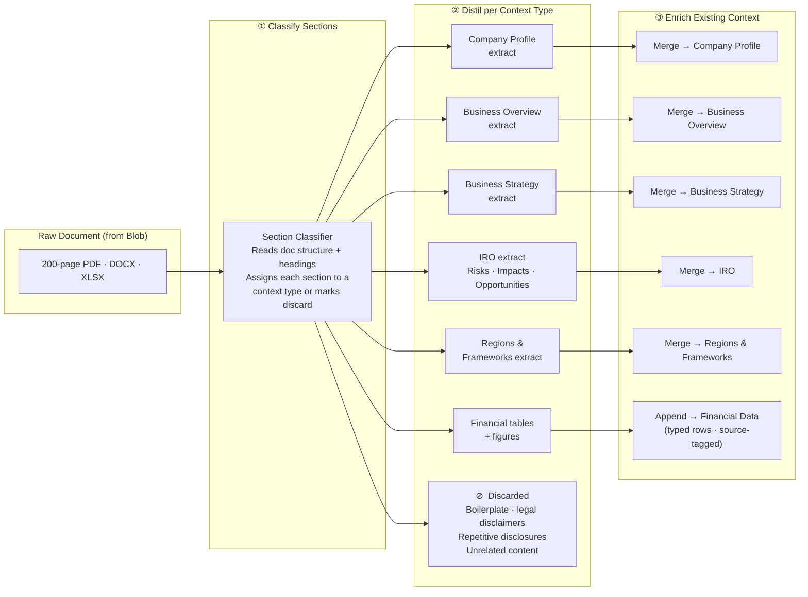
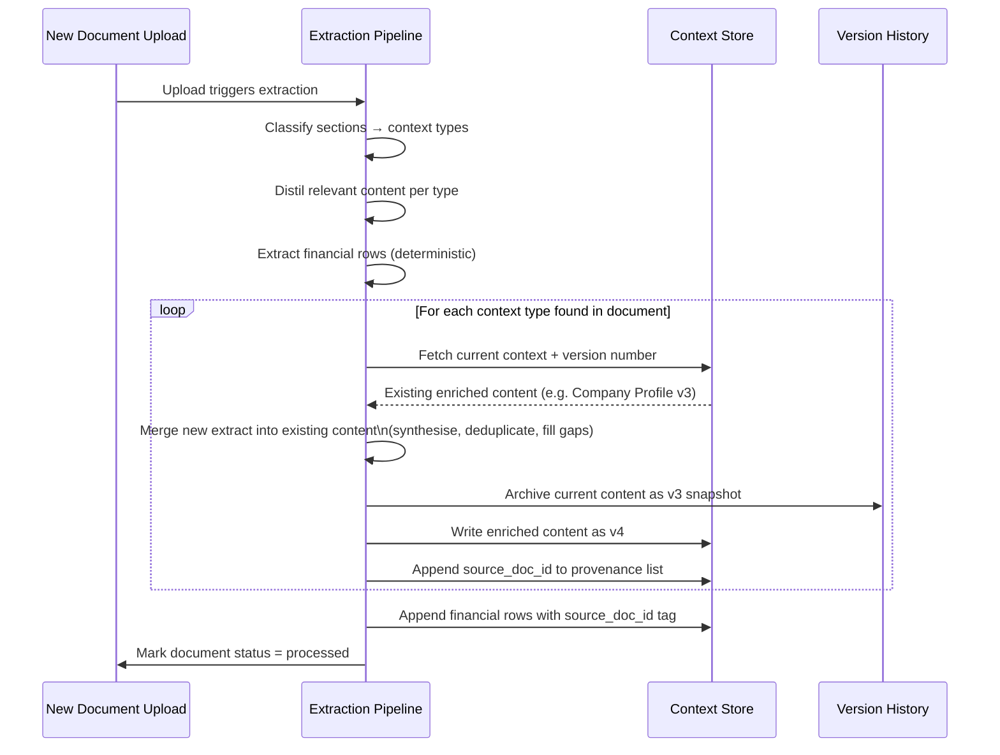
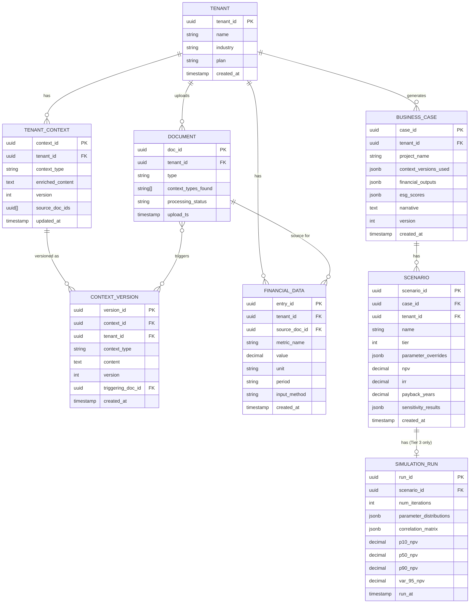

# ESG Custodian — Data Architecture

> A document-first, multi-tenant **SaaS** platform for building ESG business cases.  
> Documents are uploaded into blob storage, distilled into focused context buckets per client, and enriched incrementally with each new upload. The consumption layer pulls directly from typed context — no vector search, no context dilution.

---

## Table of Contents

- [Architecture Overview](#architecture-overview)
- [Context Extraction Pipeline](#context-extraction-pipeline)
- [Context Enrichment Flow](#context-enrichment-flow)
- [Financial Modelling Tiers](#financial-modelling-tiers)
- [Core Data Model](#core-data-model)
- [Tenant Isolation Strategy](#tenant-isolation-strategy)
- [Architectural Decisions](#architectural-decisions)
- [Technology Stack](#technology-stack)

---

## Architecture Overview

---

## Context Extraction Pipeline

Each document upload triggers the same pipeline. Material irrelevant to any context type is discarded — this is the primary mechanism against context dilution.

---

## Context Enrichment Flow

Context grows richer with every upload. Each version is preserved for audit and reproducibility — a business case always records which context version it was generated from.

> **Context version reference on business cases**  
> Every generated business case records the exact version of each context bucket used (e.g. `company_profile_v4`, `iro_v2`). Re-running the same case months later — after more documents have been uploaded — will use newer context and produce a fresh output. The prior output is preserved with its version snapshot.

---

## Financial Modelling Tiers

Financial numbers flow from the Financial Data store. They may be extracted from documents or manually keyed by the user. The modelling engine treats both identically once in the store.

```mermaid
flowchart LR
    subgraph T1["Tier 1 — Deterministic  (always run)"]
        T1A["NPV · IRR"]
        T1B["Payback Period"]
        T1C["TCO · ROI"]
        T1D["Carbon Avoidance Cost\ntonne CO₂e avoided per £ spent"]
    end

    subgraph T2["Tier 2 — Scenario Analysis  (on request)"]
        T2A["Base · Bull · Bear\nScenario Comparison"]
        T2B["Single-variable Sensitivity Sweep"]
        T2C["Break-even Analysis\ncarbon price · energy cost"]
        T2D["Tornado Chart Data\nranked variable impact"]
    end

    subgraph T3["Tier 3 — Stochastic  (on request)"]
        T3A["Monte Carlo Simulation\n10 000 iterations"]
        T3B["Outcome Probability Distribution\nNPV · IRR"]
        T3C["Value at Risk — VaR 95%\non ESG investment"]
        T3D["Multi-period DCF\nwith stochastic rate path"]
    end

    T1 -->|"+ parameter ranges"| T2
    T2 -->|"+ probability distributions\n+ correlation matrix"| T3
```

### Financial Input Sources

| Input | Source |
|---|---|
| CAPEX · OPEX · Revenue impact | Extracted from financial statements **or** manually keyed |
| Carbon price · Energy cost | Extracted from reports, keyed, or pulled from Reference Data (market curves) |
| Discount rate · Horizon years | Manually keyed (business case–specific) |
| Sensitivity ranges (Tier 2) | Manually keyed per scenario |
| Probability distributions (Tier 3) | Manually defined or inferred from historical variance in extracted data |

---

## Core Data Model

---

## Tenant Isolation Strategy

| Layer | Isolation Mechanism |
|---|---|
| **Blob Store** | Key prefix `/tenant_{id}/` — IAM policy enforces prefix-scoped access |
| **Document Registry** | `tenant_id` column; every query appends `WHERE tenant_id = :tid` |
| **Context Store** | Row-Level Security (RLS) on `tenant_id`; service account has no `BYPASSRLS` |
| **Context Versions** | Same RLS; version history is always scoped to tenant |
| **Financial Data** | Same RLS; `source_doc_id` validated against tenant before insert |
| **Business Case Store** | Same RLS; `context_versions_used` references only tenant's own versions |
| **API Gateway** | JWT `tenant_id` claim injected server-side; clients cannot supply or override it |

---

## Architectural Decisions

| Concern | Decision | Rationale |
|---|---|---|
| **No vector store / RAG** | Direct fetch by context type | Context types are predefined — retrieval is deterministic, not probabilistic. Eliminates dilution from loosely related chunks |
| **Distillation at ingest** | 200pg → ~10pg sharp extract per context type | Irrelevant material stripped before it ever enters the context store, keeping LLM prompts tight |
| **Enrichment not append** | New extract merged into existing unified context | Avoids redundancy and contradiction between extracts; produces a single coherent view per context type |
| **Version history** | Every context state archived before overwrite | Business case reproducibility — each case records which context version it used; prior outputs stay valid |
| **Deterministic financial extraction** | Rule-based table parser, not LLM agent | Financial figures feed into arithmetic modelling — extraction must be reliable and auditable |
| **Manual financial keying as fallback** | Accepted alongside extracted data | Handles cases where no document exists; both sources write to the same typed store |
| **Progressive modelling tiers** | Tier 1 always runs; Tier 2 and 3 on request | Keeps simple cases fast and cheap; stochastic compute only when needed |
| **`context_versions_used` on business case** | Snapshot of version refs at generation time | Decouples business case output from future context enrichment; a case reflects the knowledge at the time it was built |

---

## Technology Stack

| Layer | Options |
|---|---|
| **Blob Store** | AWS S3 · Azure Blob Storage |
| **Document Registry & Context Store** | PostgreSQL with Row-Level Security |
| **Financial Data Store** | PostgreSQL (same instance, separate schema) |
| **Section Classifier + Distiller** | LLM (Claude / GPT-4o) with structured output schema |
| **Financial Extractor** | Azure Document Intelligence · AWS Textract · `pdfplumber` (open source) |
| **Context Enricher** | LLM (Claude) — merge prompt with old context + new extract |
| **LLM (Business Case generation)** | Claude (Anthropic) · Azure OpenAI GPT-4o |
| **Financial Modelling Engine** | NumPy / SciPy (Python) — server-side, not LLM |
| **API Gateway** | AWS API Gateway · Azure APIM · Kong |
| **Auth** | Auth0 · AWS Cognito · Azure Entra ID |
| **Billing** | Stripe (metered) · Chargebee |
| **Observability** | Datadog · Grafana + Prometheus |
| **Audit Log** | Append-only store — AWS CloudTrail · Azure Monitor |

---

> **Open question**  
> **ESG frameworks in scope for v1** — GRI + TCFD only, or also SASB, CSRD, EU Taxonomy?  
> This determines the `context_types_found` vocabulary, the Section Classifier's training targets, and the ESG Scoring Engine's gap-analysis logic.
