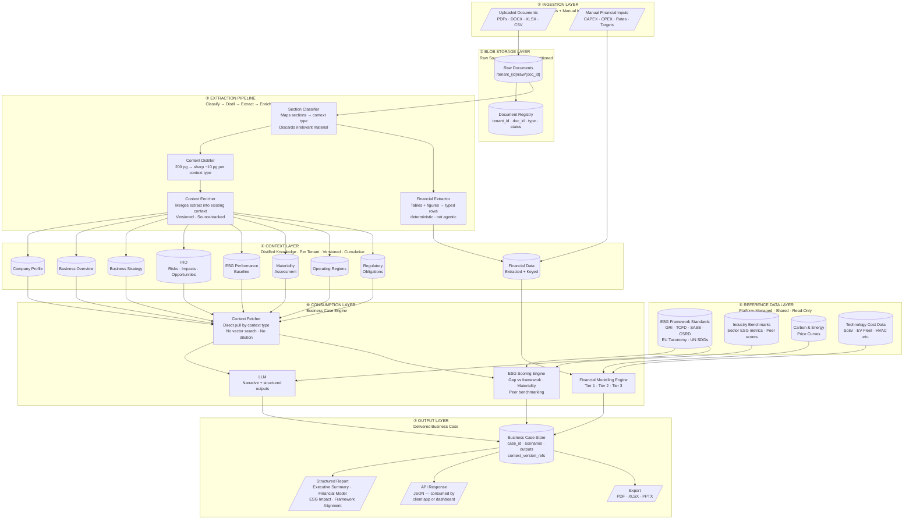
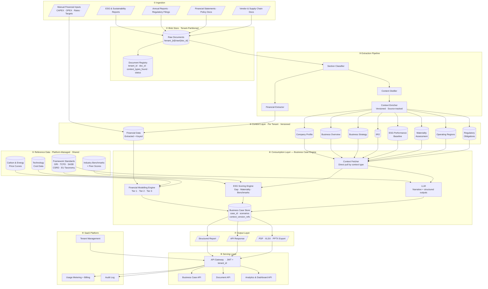
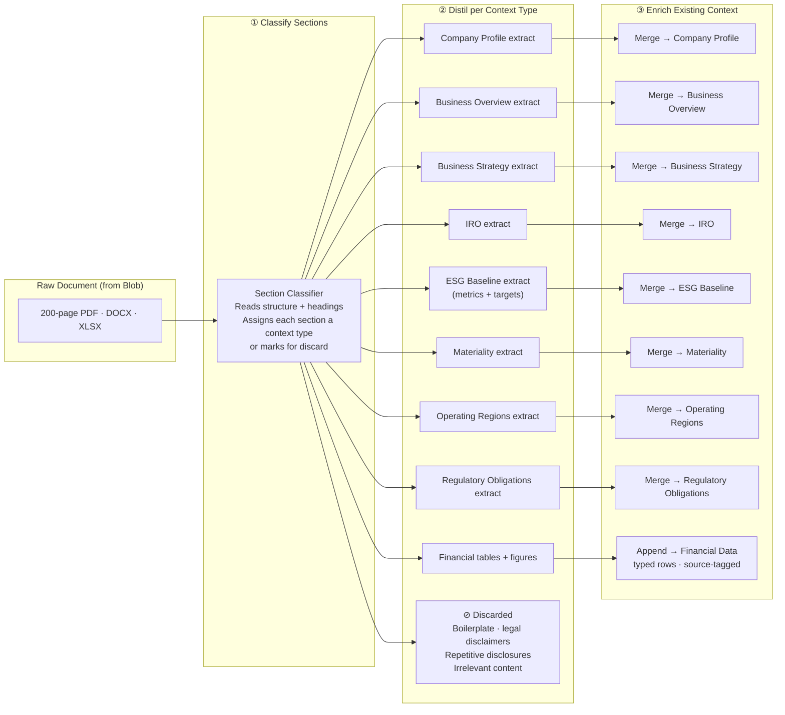
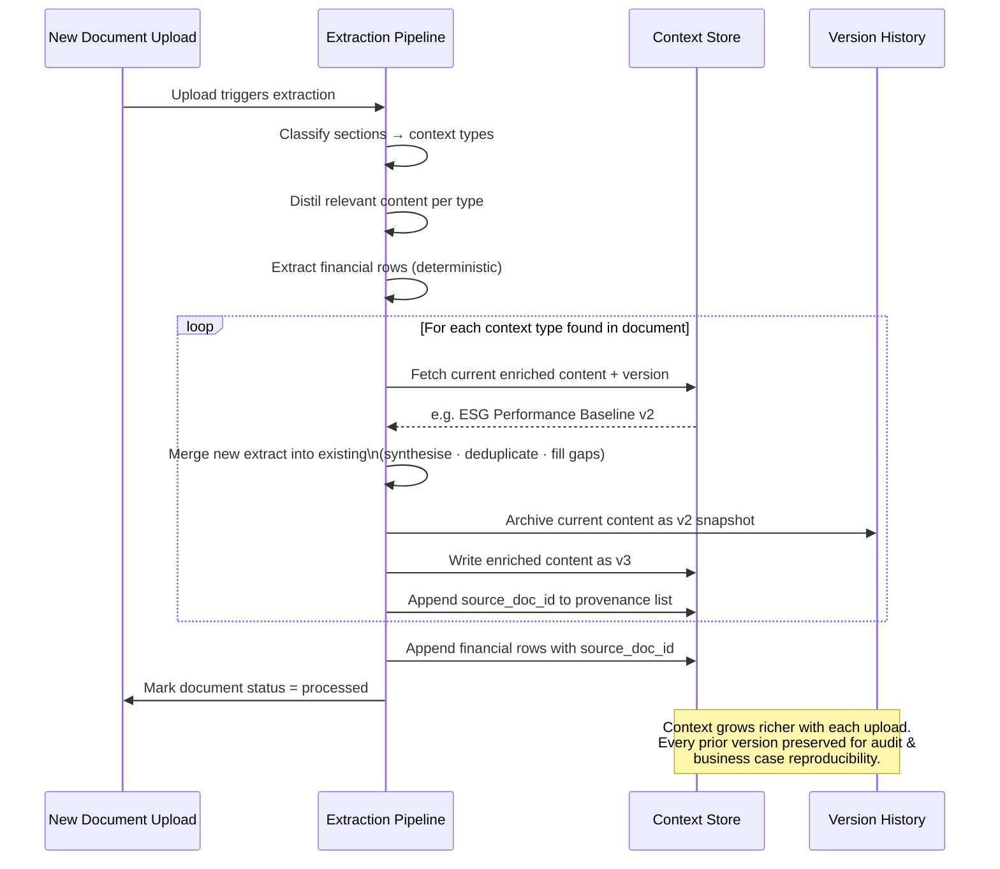
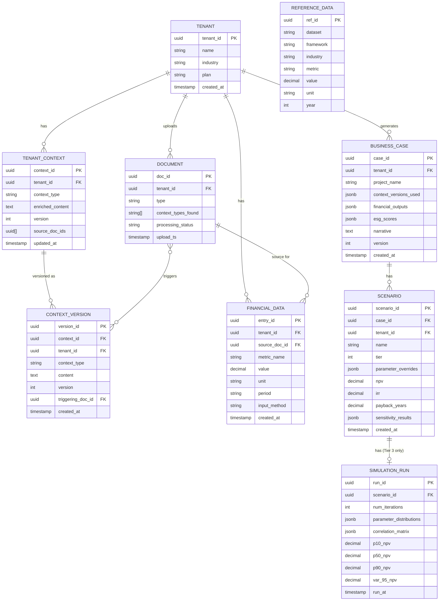

# ESG Custodian — Data Architecture

> A document-first, multi-tenant **SaaS** platform for building ESG business cases.  
> Documents are uploaded into blob storage, distilled into focused context buckets per client, enriched incrementally with each new upload, and consumed directly by the business case engine — no vector search, no context dilution.

---

## Table of Contents

- [Data Layer Overview](#data-layer-overview)
- [Full Architecture](#full-architecture)
- [Context Layer — Distilled Knowledge](#context-layer--distilled-knowledge)
- [Context Extraction Pipeline](#context-extraction-pipeline)
- [Context Enrichment Flow](#context-enrichment-flow)
- [Reference Data Layer](#reference-data-layer)
- [Financial Modelling Tiers](#financial-modelling-tiers)
- [Core Data Model](#core-data-model)
- [Tenant Isolation Strategy](#tenant-isolation-strategy)
- [Architectural Decisions](#architectural-decisions)
- [Technology Stack](#technology-stack)

---

## Data Layer Overview

Six data layers from raw document to delivered business case. Each layer has a single responsibility and a clear data contract with the next.

---

## Full Architecture

The complete platform including the SaaS and operational layers.

---

## Context Layer — Distilled Knowledge

Eight typed context buckets per tenant. Each bucket is the living, enriched knowledge the platform has built from all documents uploaded so far.

| Context Bucket | What it Contains | Primary Source Documents |
|---|---|---|
| **Company Profile** | Legal name, sector, size, ownership, subsidiaries, stock listing | Annual Report, Corporate Profile, About Us |
| **Business Overview** | Products/services, value chain, customers, geographies served, business model | Annual Report, Investor Presentation, Integrated Report |
| **Business Strategy** | Strategic priorities, growth agenda, transformation programmes, ESG commitments | Annual Report (strategy section), Board Report, Investor Day docs |
| **IRO** | Material climate risks (physical + transition), social risks, governance risks, opportunities | TCFD Report, Risk Register, Integrated Report |
| **ESG Performance Baseline** | Scope 1/2/3 emissions, energy/water/waste metrics, D&I data, existing targets, historical trend | Sustainability Report, ESG Disclosure, TCFD Report |
| **Materiality Assessment** | Material ESG topics, stakeholder input, double materiality (CSRD), prioritisation matrix | Materiality Report, Sustainability Report (materiality section) |
| **Operating Regions** | Countries/regions of operation, key sites, supply chain geographies, local regulatory contexts | Annual Report, Supply Chain Report, Operational Review |
| **Regulatory Obligations** | Applicable reporting frameworks, compliance deadlines, specific disclosure requirements, jurisdiction rules | Regulatory filings, Sustainability Report (framework section), Legal disclosures |
| **Financial Data** | CAPEX/OPEX baseline, revenue, cost structure, energy bills, existing ESG investment spend + manually keyed initiative inputs | Financial Statements, Utility Reports + User Input |

---

## Context Extraction Pipeline

---

## Context Enrichment Flow

Every upload enriches — not replaces — the existing context. Prior versions are archived so every business case output remains reproducible.

---

## Reference Data Layer

Platform-managed, shared across all tenants, read-only from tenant context. This layer provides the external yardsticks that make ESG scoring and financial modelling meaningful.

| Reference Dataset | Contents | Used By | Update Cadence |
|---|---|---|---|
| **ESG Framework Standards** | GRI topic standards, TCFD recommendations, SASB industry standards, CSRD requirements, EU Taxonomy technical screening criteria, UN SDG mapping | ESG Scoring Engine, LLM (framework alignment prompts) | On framework revision |
| **Industry Benchmarks** | Sector-average emissions intensity, energy per unit revenue, D&I ratios, ESG scores by SIC/NACE code | ESG Scoring Engine (peer gap analysis) | Quarterly |
| **Carbon & Energy Price Curves** | Current + forward carbon price (ETS + voluntary), electricity/gas price curves by region | Financial Modelling Engine (NPV, carbon avoidance cost) | Monthly |
| **Technology Cost Data** | Benchmark CAPEX/OPEX for solar, EV fleet, LED, heat pumps, CCUS, etc. | Financial Modelling Engine (Tier 2/3 scenario defaults) | Quarterly |

---

## Financial Modelling Tiers

```mermaid
flowchart LR
    subgraph T1["Tier 1 — Deterministic  (always run)"]
        T1A["NPV · IRR"]
        T1B["Payback Period"]
        T1C["TCO · ROI"]
        T1D["Carbon Avoidance Cost\ntonne CO₂e avoided per £ spent"]
    end

    subgraph T2["Tier 2 — Scenario Analysis  (on request)"]
        T2A["Base · Bull · Bear Comparison"]
        T2B["Single-variable Sensitivity Sweep"]
        T2C["Break-even Analysis\ncarbon price · energy cost"]
        T2D["Tornado Chart Data\nranked variable impact"]
    end

    subgraph T3["Tier 3 — Stochastic  (on request)"]
        T3A["Monte Carlo Simulation\n10 000 iterations"]
        T3B["Outcome Probability Distribution\nNPV · IRR"]
        T3C["Value at Risk — VaR 95%"]
        T3D["Multi-period DCF\nstochastic rate path"]
    end

    T1 -->|"+ parameter ranges"| T2
    T2 -->|"+ probability distributions\n+ correlation matrix"| T3
```

---

## Core Data Model

---

## Tenant Isolation Strategy

| Layer | Isolation Mechanism |
|---|---|
| **Blob Store** | Key prefix `/tenant_{id}/` — IAM policy enforces prefix-scoped access |
| **Document Registry** | `tenant_id` on every row; every query appends `WHERE tenant_id = :tid` |
| **Context Store** | PostgreSQL Row-Level Security (RLS) on `tenant_id` |
| **Context Versions** | Same RLS; version history always scoped to tenant |
| **Financial Data** | Same RLS; `source_doc_id` validated against tenant before insert |
| **Business Case Store** | Same RLS; `context_versions_used` references only the tenant's own versions |
| **Reference Data** | Separate read-only schema and DB role; no tenant writes permitted |
| **API Gateway** | JWT `tenant_id` claim injected server-side; clients cannot supply or override it |

---

## Architectural Decisions

| Concern | Decision | Rationale |
|---|---|---|
| **No vector store / RAG** | Direct fetch by context type | Context buckets are predefined — retrieval is deterministic. Eliminates prompt dilution from loosely related chunks |
| **Distillation at ingest** | 200 pg → ~10 pg sharp extract per context type | Irrelevant material stripped before entering the context store — the LLM prompt stays tight |
| **Enrichment not append** | New extract synthesised into unified existing context | Prevents redundancy and contradiction across documents; one coherent view per bucket |
| **Version history** | Every context state archived before overwrite | Business case reproducibility — each case records which context version it used |
| **Reference Data as separate layer** | Platform-managed, shared, read-only | Benchmarks and framework standards are non-sensitive, cross-tenant, and have their own update cadence — they don't belong in tenant context |
| **Deterministic financial extraction** | Rule-based parser, not LLM agent | Financial figures feed arithmetic modelling — extraction must be reliable and auditable |
| **Manual financial input as peer of extracted** | Both write to same `financial_data` typed store | Handles absence of documents; downstream modelling engine treats both identically |
| **`context_versions_used` on business case** | Snapshot of version refs at generation time | Decouples case output from future enrichment; a case reflects knowledge at the time it was built |
| **Output Layer as explicit layer** | Report, API response, and export as distinct outputs | Business case outputs are consumed in three different ways — structured report, live API, and downloadable artefact |

---

## Technology Stack

| Layer | Options |
|---|---|
| **Blob Store** | AWS S3 · Azure Blob Storage |
| **Document Registry & Context Store** | PostgreSQL with Row-Level Security |
| **Financial Data Store** | PostgreSQL (same instance, separate schema) |
| **Section Classifier + Distiller** | LLM (Claude / GPT-4o) with structured output schema |
| **Financial Extractor** | Azure Document Intelligence · AWS Textract · `pdfplumber` |
| **Context Enricher** | LLM (Claude) — merge prompt with old context + new extract |
| **Reference Data Store** | PostgreSQL read-only schema · seeded from Bloomberg ESG, CDP, MSCI |
| **LLM — Business Case Generation** | Claude (Anthropic) · Azure OpenAI GPT-4o |
| **Financial Modelling Engine** | NumPy / SciPy (Python) — server-side, not LLM |
| **Report / Export Generation** | Puppeteer (PDF) · `openpyxl` (XLSX) · `python-pptx` (PPTX) |
| **API Gateway** | AWS API Gateway · Azure APIM · Kong |
| **Auth** | Auth0 · AWS Cognito · Azure Entra ID |
| **Billing** | Stripe (metered) · Chargebee |
| **Observability** | Datadog · Grafana + Prometheus |
| **Audit Log** | Append-only — AWS CloudTrail · Azure Monitor |

---

> **Open question**
> **ESG frameworks in scope for v1** — GRI + TCFD only, or also SASB, CSRD, EU Taxonomy?  
> This determines the Section Classifier's training targets, the Reference Data seed content, and the ESG Scoring Engine's gap-analysis logic.
