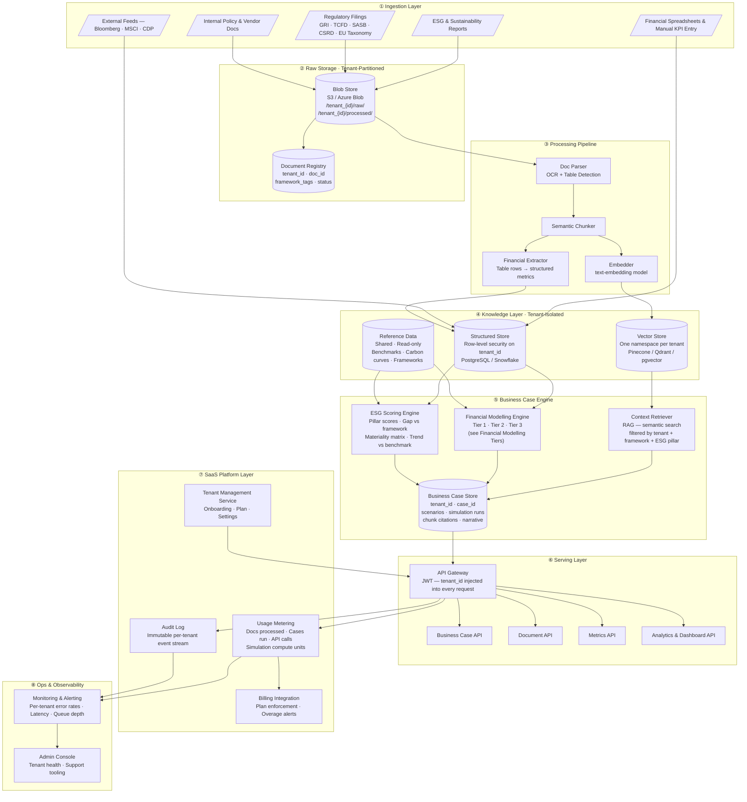
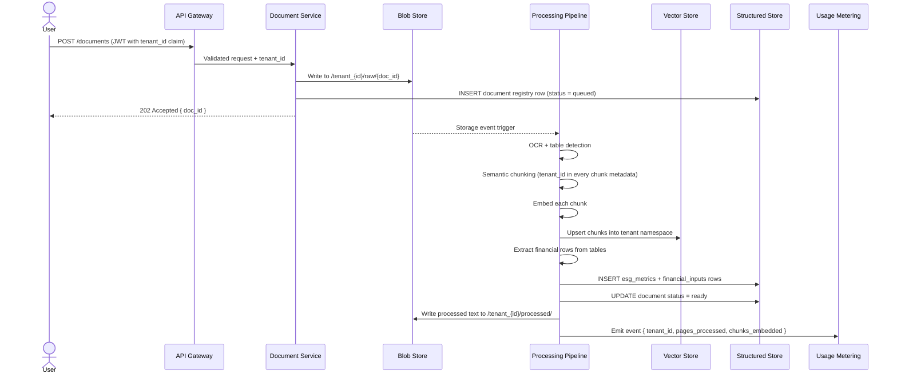
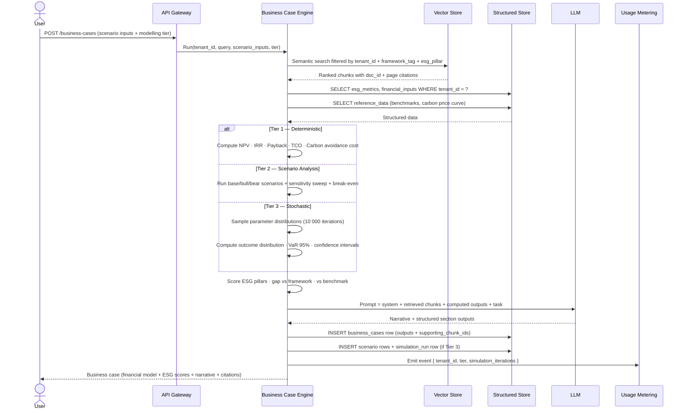
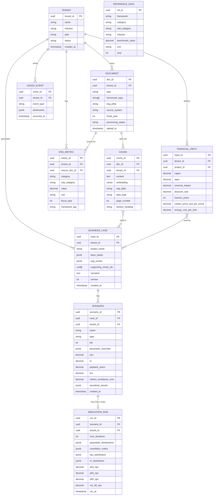
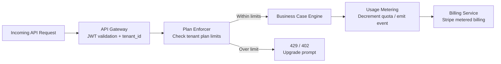

# ESG Custodian — Data Architecture

> A document-first, multi-tenant **SaaS** platform for building ESG business cases.  
> Combines unstructured document retrieval (RAG) with a tiered financial modelling engine — from deterministic NPV/IRR through to Monte Carlo stochastic simulation.

---

## Table of Contents

- [Architecture Overview](#architecture-overview)
- [Financial Modelling Tiers](#financial-modelling-tiers)
- [Data Flow — Document Ingestion](#data-flow--document-ingestion)
- [Data Flow — Business Case Creation](#data-flow--business-case-creation)
- [Core Data Model](#core-data-model)
- [Tenant Isolation Strategy](#tenant-isolation-strategy)
- [Architectural Decisions](#architectural-decisions)
- [Technology Stack](#technology-stack)

---

## Architecture Overview

Eight layers across the SaaS platform. The tenant boundary is enforced at every layer — storage, query, and API.

---

## Financial Modelling Tiers

The engine supports three tiers invoked progressively — a business case always has at least one Tier 1 scenario; Tiers 2 and 3 are additive.

```mermaid
flowchart LR
    subgraph T1["Tier 1 — Deterministic  (always run)"]
        T1A["NPV · IRR"]
        T1B["Payback Period"]
        T1C["TCO · ROI"]
        T1D["Carbon Avoidance Cost\n(tonne CO₂e avoided / $ spent)"]
    end

    subgraph T2["Tier 2 — Scenario Analysis  (on request)"]
        T2A["Base · Bull · Bear\nScenario Comparison"]
        T2B["Single-variable\nSensitivity Sweep"]
        T2C["Break-even Analysis\n(carbon price / energy cost)"]
        T2D["Tornado Chart Data\nranked variable impact"]
    end

    subgraph T3["Tier 3 — Stochastic  (on request)"]
        T3A["Monte Carlo Simulation\n10 000 iterations"]
        T3B["Outcome Probability\nDistribution (NPV · IRR)"]
        T3C["Value at Risk — VaR 95%\non ESG investment"]
        T3D["Multi-period DCF\nwith stochastic rate path"]
    end

    T1 -->|"scenario_inputs\n+ parameter ranges"| T2
    T2 -->|"parameter distributions\n+ correlation matrix"| T3
```

### Input Parameters per Tier

| Parameter | Tier 1 | Tier 2 | Tier 3 |
|---|:---:|:---:|:---:|
| CAPEX / OPEX (point estimate) | ✓ | ✓ | ✓ |
| Revenue / cost impact | ✓ | ✓ | ✓ |
| Discount rate | ✓ | ✓ | ✓ |
| Carbon price | ✓ | ✓ | ✓ |
| Named scenario overrides (base / bull / bear) | | ✓ | ✓ |
| Variable sweep range + step | | ✓ | ✓ |
| Probability distributions per variable | | | ✓ |
| Correlation matrix across variables | | | ✓ |
| Number of Monte Carlo iterations | | | ✓ |

---

## Data Flow — Document Ingestion

---

## Data Flow — Business Case Creation

---

## Core Data Model

---

## Tenant Isolation Strategy

Isolation is applied at every layer — a breach at one layer cannot expose another tenant's data.

| Layer | Isolation Mechanism |
|---|---|
| **Blob Store** | Key prefix `/tenant_{id}/` — IAM policies enforce prefix-scoped access per tenant service account |
| **Document Registry** | `tenant_id` column; application always appends `WHERE tenant_id = :tid`; no cross-tenant joins permitted |
| **Vector Store** | Dedicated namespace per tenant; every query includes namespace + metadata filter on `tenant_id` |
| **Structured Store** | PostgreSQL Row-Level Security (RLS) on `tenant_id`; service account has no `BYPASSRLS` privilege |
| **Business Case Store** | Same RLS policy; `supporting_chunk_ids` validated against tenant namespace before persistence |
| **API Gateway** | JWT `tenant_id` claim injected server-side; clients cannot supply or override it |
| **Usage & Audit** | `USAGE_EVENT` rows partitioned by `tenant_id`; billing aggregation runs within partition boundary |
| **Reference Data** | Shared read-only schema in a separate DB role; no tenant writes permitted |

### SaaS Plan Enforcement

| Limit | Starter | Professional | Enterprise |
|---|:---:|:---:|:---:|
| Documents / month | 50 | 500 | Unlimited |
| Business cases / month | 10 | 100 | Unlimited |
| Financial modelling tier | Tier 1 only | Tier 1 + 2 | Tier 1 + 2 + 3 |
| Monte Carlo iterations | — | — | Up to 100 000 |
| Data retention | 1 year | 3 years | Configurable |

---

## Architectural Decisions

| Concern | Decision | Rationale |
|---|---|---|
| **Document retrieval** | RAG (chunk → embed → vector search) | Documents too large and varied for full-context prompts; semantic retrieval scales across hundreds of reports per tenant |
| **Financial data** | Separate relational store, not vector | Financial modelling requires exact arithmetic and aggregation — SQL is deterministic, LLMs are not |
| **Modelling tiers** | Progressive enrichment (T1 → T2 → T3) on same input set | Avoids recomputing base outputs; Tier 3 runs use Tier 2 scenarios as seed inputs |
| **Simulation storage** | `SIMULATION_RUN` with distribution snapshots, not raw iteration rows | 10 000 rows per run × many cases per tenant is prohibitive; store percentiles + full distribution as JSONB |
| **Citation trail** | `supporting_chunk_ids[]` on every business case | Regulatory-grade auditability; any claim in the narrative traces back to source doc + page |
| **Tenant namespace per vector store** | One namespace per tenant, not one collection | Balances isolation cost with operational overhead; metadata filter adds defence-in-depth |
| **Framework tagging at ingest** | Tags on chunk metadata (GRI, TCFD, SASB…) | Enables filtered retrieval by regulatory context without re-embedding |
| **Usage metering async** | Events emitted post-response, processed by metering service | Keeps API latency unaffected by billing logic; quota enforcement uses cached counter |
| **Plan enforcement at gateway** | Checked before engine invocation | Prevents compute spend on requests that will be denied |

---

## Technology Stack

| Layer | Options |
|---|---|
| **Blob Store** | AWS S3 · Azure Blob Storage |
| **Structured Store** | PostgreSQL (primary) · Snowflake (analytics workloads) |
| **Vector Store** | Pinecone · Qdrant · pgvector (simpler stack, co-located with Postgres) |
| **Processing Pipeline** | AWS Lambda · Azure Functions · Apache Airflow (batch reprocessing) |
| **Doc Parser / OCR** | Azure Document Intelligence · AWS Textract · `pdfplumber` (open source) |
| **Embedder** | OpenAI `text-embedding-3-large` · Azure OpenAI · `sentence-transformers` (self-hosted) |
| **LLM** | Claude (Anthropic) · Azure OpenAI GPT-4o |
| **Monte Carlo Engine** | NumPy / SciPy (Python) · server-side compute, not LLM |
| **API Gateway** | AWS API Gateway · Azure APIM · Kong |
| **Auth** | Auth0 · AWS Cognito · Azure Entra ID |
| **Billing** | Stripe (metered billing) · Chargebee |
| **Observability** | Datadog · Grafana + Prometheus · AWS CloudWatch |
| **Audit Log** | Immutable append-only store — AWS CloudTrail · Azure Monitor · Kafka + S3 |

---

> **Open question before schema design**
> - **ESG frameworks in scope for v1** — GRI + TCFD only, or also SASB, CSRD, EU Taxonomy?  
>   This determines the set of `framework_tags`, the `REFERENCE_DATA` seed content, and which metadata filters are exposed in the retrieval API.
