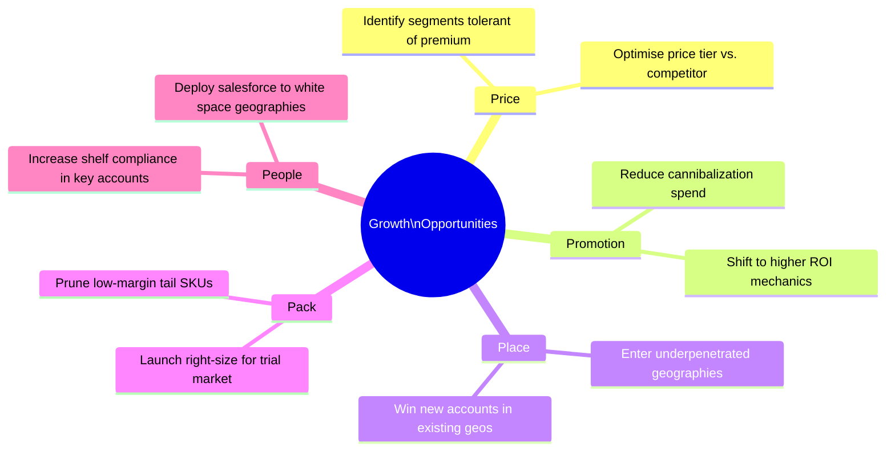

# Day 6 — The 5Ps Framework: Mapping Business Levers to MMM Coefficients

> **Today's one idea:** Price, Promotion, Place, Pack, and People are the five levers a Unilever brand controls — each becomes a distinct MMM coefficient with its own data source, transformation, and identification challenge.
> **Reading time:** ~35 min · **Prereqs:** Days 1–5
> **Primary source for today:** Charan, A. *The Marketing Analytics Practitioner's Guide* — the marketing mix levers chapters
> **Before you start:** Recall Day 5's load-bearing idea — one sentence: what does the Hill function do to adstock-transformed spend, and what does $K$ represent?

---

## The Hook

An MMM is not just a media model. Media (TV, digital, OOH) gets all the attention because it is the most expensive line item on the marketing P&L. But in a typical Unilever FMCG category, media drives 15–25% of sales. The rest is driven by the four other Ps — Price, Promotion, Place, and Pack — plus the often-overlooked fifth: People (trade execution and consumer segmentation).

Understanding the 5Ps framework before building the model is not academic tidiness. It determines:
- Which variables to include (omitting a P creates omitted variable bias)
- Which transformations to apply (each P has a different functional form)
- Which identification strategy to use (each P has a different endogeneity risk)
- Which business question each coefficient answers

Today is a taxonomy day. We are not going deep on any one P — that comes in Days 7–11. We are building the map so that every subsequent page adds detail to a location you already know.

---

## Building the Intuition

### The 5Ps as levers on a mixing desk

Think of a brand manager as a sound engineer at a mixing desk. There are five faders:

```
┌──────────────────────────────────────────────────────────────────────┐
│                     UNILEVER BRAND MIX DESK                          │
│                                                                      │
│  PRICE    PROMOTION   PLACE      PACK       PEOPLE                   │
│    │          │         │          │           │                     │
│    ▼          ▼         ▼          ▼           ▼                     │
│  [▐▌▌]     [▐▌▌]     [▐▌▌]     [▐▌▌]       [▐▌▌]                   │
│                                                                      │
│  How much  How much   Where       Which       Who
│  to charge to discount available  sizes      executes               │
└──────────────────────────────────────────────────────────────────────┘
```

Each fader affects sales differently. Price and Promotion directly affect the value equation consumers see at the shelf. Place and Pack affect whether the right product is findable in the right format. People affect the quality of execution that makes the other four Ps effective.

Crucially, the five faders are *not independent*. Moving one affects the others:
- A price increase that is not matched by a promotional reduction will drive volume down
- A distribution gain (Place) means more consumers can find the product, amplifying the effect of Price and Promotion
- A pack size change (Pack) changes effective price-per-use, which interacts with Price elasticity
- Poor shelf execution (People) nullifies the effect of a distribution gain

This interdependence is the source of many MMM modelling challenges — and the reason the causal arc (Module 3) matters so much.

### The 5Ps: what each is, what it measures, and how it enters the model

| P | What it is | MMM variable | Transformation | Key identification risk |
|---|-----------|-------------|----------------|------------------------|
| **Price** | The price consumers pay (ASP from Nielsen) | Log(ASP) or relative price index | None (or log) | Endogenous — price is set in response to demand |
| **Promotion** | Trade promotional depth and mechanic | % discount depth; promo flag | None or indicator | Endogenous — promotions are timed to slow periods |
| **Place** | Distribution: how widely stocked | Numeric distribution % or weighted distribution % | None or log | Partially endogenous — distribution expanded in strong markets |
| **Pack** | Pack size and SKU portfolio | Pack size dummy or price-per-unit-of-use | None or ratio | Low endogeneity but high multicollinearity with Price |
| **People** | Trade execution quality + consumer segment reach | Shelf compliance %, salesforce call rate, or segmentation index | None | Hard to measure; often omitted (omitted variable bias) |

Plus the **media channels** (TV, digital, OOH, print) which we have already covered — these undergo adstock + Hill transformation and are the "Media" layer above the 5Ps.

### The critical distinction: levers you pull vs. levers that respond

This framework reveals a structural asymmetry that most MMM courses miss:

**Levers the brand controls actively:**
- Promotional depth and timing (you set the mechanic)
- Media spend (you set the budget)
- Pack portfolio (you decide which SKUs to launch/delist)
- People (you decide salesforce deployment and trade investment)

**Levers the brand controls but incompletely:**
- Price — you set the list price, but Nielsen ASP is the price consumers pay (which is also affected by retailer markdown, competitor pricing, and trade negotiation)
- Place — you target distribution, but whether a retailer stocks you is partly their decision

**This asymmetry matters for the MMM because:**
1. Variables the brand controls *in response to market conditions* (price, sometimes distribution) are endogenous — their coefficients are biased in a naïve model
2. Variables the brand controls more freely (promo depth, media spend) are still potentially endogenous if spending is higher in high-demand periods

Every P has an endogeneity risk. Every P requires a validation strategy. This is the table you will return to repeatedly in Module 3.

### The 5Ps in the MMM equation

The full MMM equation, now with the 5Ps taxonomy made explicit:

```math
\text{Sales}_t = \underbrace{\alpha + \beta_{\text{trend}} \cdot t + \beta_{\text{season}} \cdot s_t}_{\text{Base}} 
+ \underbrace{\beta_{\text{TV}} \cdot h(A^{TV}_t) + \beta_{\text{Digital}} \cdot h(A^{D}_t) + \cdots}_{\text{Media (above-the-line)}}
+ \underbrace{\beta_{\text{Price}} \cdot \ln(\text{ASP}_t)}_{\text{Price (P1)}}
+ \underbrace{\beta_{\text{Promo}} \cdot d_t^{\text{promo}}}_{\text{Promotion (P2)}}
+ \underbrace{\beta_{\text{ND}} \cdot \text{ND}_t}_{\text{Place (P3)}}
+ \underbrace{\beta_{\text{Pack}} \cdot \text{PackIndex}_t}_{\text{Pack (P4)}}
+ \underbrace{\beta_{\text{Compliance}} \cdot c_t}_{\text{People (P5)}}
+ \epsilon_t
```

Note that Price, Promotion, and Place do not get adstock or Hill transformations in most implementations — they are entered as levels or logs, not as cumulative decayed sums. There are exceptions (distribution gains do have some carryover — see Day 9), but the default is to treat non-media Ps as contemporaneous effects.

---

## The Formal Picture

### Identifying which Ps are actually driving your brand's performance

Before building the model, run this diagnostic: plot each P against sales (raw, not adjusted) and ask whether the relationship is:

1. **Positive contemporaneous** (P moves up, sales move up in same week) → contemporaneous driver, include as level
2. **Lagged** (P moves up, sales respond 1–4 weeks later) → apply adstock-like transformation
3. **Negative contemporaneous** (P moves up — e.g., price — sales move down) → verify sign makes business sense; be suspicious if positive
4. **Seasonal** (P and sales both peak in Q4) → separate P's effect from seasonality carefully; they will be correlated

For a mature Unilever brand like Dove Body Wash in the UK, a typical diagnostic read:

| P | Expected sign | Dominant dynamic |
|---|--------------|-----------------|
| Price | Negative (higher price = lower volume) | Contemporaneous |
| Promotion depth | Positive (discount = volume spike) | Contemporaneous + 1-week post-dip |
| Numeric distribution | Positive (more stores = more sales) | Contemporaneous + 3–4 week build |
| TV adstock | Positive | Lagged 1–3 weeks |
| Pack size change | Ambiguous (depends on direction) | Step-change with adjustment period |
| Shelf compliance | Positive | Contemporaneous |

Any coefficient that contradicts these expected signs is a red flag — it does not automatically mean the model is wrong, but it means you need an explanation. Common culprits: multicollinearity between Ps, omitted confounders, or measurement error.

### The 5Ps and white space: a preview

The full power of the 5Ps framework is not in fitting the model — it is in using the estimated coefficients to ask where growth is available. Each P suggests a different type of opportunity:



This map becomes the white space analysis on Day 23. The 5Ps framework is what makes that analysis structured rather than speculative.

---

## Where It Breaks / What It Is Not

**"5Ps = 5 independent levers."** They are deeply correlated in practice. A promotion (P2) is almost always also a temporary price change (P1). A new distribution gain (P3) is typically supported by a trade deal that includes promotional activity (P2) and often a new pack size (P4). Multicollinearity between the Ps is the primary reason many MMM coefficients are imprecisely estimated — the model cannot separate their individual effects.

**"You must include all 5 Ps in every model."** Include only what you can measure reliably. A noisy People proxy (e.g., a poor shelf compliance estimate) will add noise to the model without improving it. The principle: only include a P if the data quality is sufficient to estimate its coefficient with reasonable precision.

**"The 5Ps framework is universal."** This framework is specific to FMCG branded consumer goods. In service industries (telecoms, banking), the Ps are different — price elasticity behaves differently when switching costs are high, and "place" means digital channel presence, not physical distribution. Know your category.

**"The model will separate all 5 Ps cleanly."** In practice, MMM can typically estimate 3–4 of the 5 Ps reliably. People (trade execution) is the hardest — it is rarely measured at the right granularity. Omitting it creates bias in the coefficients of the Ps that correlate with it (typically Place and Promotion).

---

## Try It Yourself

> Close the page now before attempting Exercise 1.

**Exercise 1 — Retrieval.** Without looking: name all 5 Ps, the primary MMM variable for each, and the key identification risk for each. No looking — write from memory, then check.

<details>
<summary>Reference answer</summary>

| P | Primary variable | Key risk |
|---|-----------------|----------|
| Price | Nielsen ASP (log) | Endogenous — set in response to demand |
| Promotion | Discount depth or promo flag | Endogenous — timed to slow periods |
| Place | Numeric or weighted distribution | Partially endogenous — expanded in strong markets |
| Pack | Pack size dummy / price-per-use | Multicollinearity with Price |
| People | Shelf compliance / salesforce call rate | Hard to measure; omitted variable bias |
</details>

---

**Exercise 2 — Direct application.** You are building an MMM for Surf Excel in Pakistan. The marketing team says they have price, promotional depth, distribution, and media data — but no shelf compliance or salesforce data (People). They ask whether to proceed without it.

Write a two-sentence answer: (1) what omitting People will do to the other coefficients, and (2) what proxy variable you could construct from available data to partially address this.

<details>
<summary>Reference answer</summary>

(1) Omitting People introduces omitted variable bias in all Ps that correlate with execution quality — particularly Place (distribution gain is only valuable if shelved correctly) and Promotion (promotional compliance determines whether the promoted price actually reaches consumers). The coefficients of Place and Promotion will absorb some of the People effect, inflating their estimates.

(2) A reasonable proxy: the **ratio of weighted distribution to numeric distribution** (WD/ND). If this ratio is high (weighted >> numeric), the brand is stocked in big, well-executed stores. If low, it is in small stores with lower compliance. This ratio is available from Nielsen data and captures something of the execution quality signal without requiring direct compliance measurement.
</details>

---

**Exercise 3 — Stretch (callback to Day 1).** A client presents an MMM result and says: "We have all 5 Ps in the model, plus media — this is the most complete model anyone has built for this brand." Using Day 1's honest inventory and today's framework, list two reasons why "completeness" of inputs does not guarantee "correctness" of outputs.

<details>
<summary>Reference answer</summary>

1. **Endogeneity (Day 1 / today):** Having all 5 Ps in the model does not fix the endogeneity of Price and Promotion. If these Ps are set in response to demand conditions, their coefficients are biased regardless of how many other variables are controlled for. A complete input list does not produce an identified estimate.

2. **Multicollinearity (today):** When the 5 Ps are correlated with each other (which they always are in practice), the model cannot separately estimate their effects — even with enough data. The coefficients will be imprecise and potentially have the wrong signs. Completeness of inputs worsens multicollinearity, not relieves it.
</details>

---

**Transfer — apply it:**

> Map your current project or domain to the 5Ps framework — or the closest analogue to it. Write one sentence for each: what is the "Price" equivalent, the "Place" equivalent, etc.? Which of the five is hardest to measure in your context?

---

## Connect It Back

The foundations module is complete. You now have:
- The epistemological frame (Day 1): attribution ≠ causation
- The data architecture (Day 2): what each source measures
- The primary output structure (Day 3): base vs. incremental
- The two media transformations (Days 4–5): adstock + Hill function
- The full driver taxonomy (Day 6): the 5Ps framework

Starting tomorrow, Module 2 examines each P in depth — starting with the one most central to the CMO deck you will eventually produce: Price.

**Sharp question to carry forward:** Which of the 5 Ps is most likely to produce a biased coefficient in a naïve MMM, and what is the direction of that bias?

*(Price — because it is set high when demand is already high, so naïve regression sees high price co-varying with high sales and may estimate a positive elasticity. Day 13 formalises this.)*

---

## Suggested Readings for Today

**Required if you have 15 extra minutes:** Charan, A. *The Marketing Analytics Practitioner's Guide* — the marketing mix chapter. Compare Charan's practitioner framing of each lever to the modelling variables laid out today. Note where they agree and where the measurement challenges diverge.

**If you want the deep version:**
- Angrist & Pischke (2009), *Mostly Harmless Econometrics*, Chapter 3, Section 3.1 — "Omitted Variables Bias." The formal treatment of what happens when you omit People from the model (any correlated variable, in their framework). The omitted variable bias formula quantifies exactly how much the included Ps will be distorted.
- Robyn documentation — the "variables and transformations" section. Robyn distinguishes between "paid media" (adstock + Hill) and "organic" variables (no transformation). Map this to the 5Ps taxonomy to see which Ps each category covers.

---

## Navigation

← **Previous:** [Day 5 — Saturation: The Hill Function](./day-05-saturation-hill-function.md)
→ **Next:** [Day 7 — Price: Elasticity in MMM](../../02-five-ps-as-drivers/days/day-07-price-elasticity.md)
