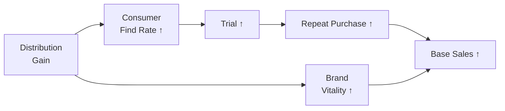

# Day 9 — Place: Distribution as a Measurable Growth Driver (Knorr Soups)

> **Today's one idea:** Distribution has three measurable dimensions — width (ND: stores stocking), depth (WD: volume-weighted store reach), and speed (Rate of Sale: velocity within stocked stores) — and volume is the product of depth × speed; an MMM without all three cannot distinguish "expand distribution" from "fix in-store performance."
> **Reading time:** ~35 min · **Prereqs:** Days 3, 6
> **Primary source for today:** Charan, A. *The Marketing Analytics Practitioner's Guide* — the distribution and channel chapters
> **Before you start:** Recall Day 8's load-bearing idea — one sentence: what is "borrowed demand" in the context of promotions, and how does it affect reported promotional ROI?

---

## The Hook

Knorr Chicken Soups has been investing heavily in above-the-line advertising in Northern England — TV, digital, OOH. The MMM shows modest media contributions. The brand team is frustrated. The media agency defends the spend.

A distributor quietly tells the regional sales manager: "We picked up 140 new convenience stores in Yorkshire in Q2." No press release, no campaign. Just feet on the ground.

The following quarter's MMM shows a step-change increase in base sales in the North — no change in media spend. The media team claims it was "brand equity building from the Q1 campaign." The sales team claims it was the distribution gain.

Who's right? Almost certainly the sales team. But the MMM, if it does not include distribution as an explicit driver, will attribute that step-change to the trend or to residual media carryover — whichever fits the data. You will never know unless distribution is in the model.

This is why Place is the most undermodelled of the 5 Ps. It is hard to measure, unglamorous compared to media, and often omitted from MMMs built by media agencies who have no incentive to find a non-media driver. But for most FMCG brands, distribution is a larger value driver than any single media channel.

---

## Building the Intuition

### The two faces of distribution

**Numeric Distribution (ND):** The percentage of stores (by count) that stock your product.
```
ND = (stores stocking Knorr Soups) / (total relevant stores) × 100
```

**Weighted Distribution (WD):** The percentage of category volume (or value) represented by stores that stock your product.
```
WD = (category volume in stores stocking Knorr) / (total category volume) × 100
```

The gap between WD and ND tells you the *quality* of your distribution:

| Scenario | WD vs ND | Implication |
|----------|---------|-------------|
| WD >> ND | Stocked in large, high-volume stores | Good quality placement; small stores missing |
| WD ≈ ND | Evenly distributed across store sizes | Typical for mature brands |
| WD < ND | Stocked in small, low-volume stores | Poor quality; big stores missing — serious problem |

For Knorr Soups entering a new UK grocery format (say, convenience), ND may increase rapidly (many small stores) while WD increases slowly (small stores represent little category volume). A CMO who tracks only ND will overestimate the volume impact of the distribution gain.

### Rate of Sale: the speed dimension

ND and WD tell you *where* the product is stocked. They say nothing about how fast it sells once it is on the shelf. The third distribution metric is **Rate of Sale (RoS)** — also called velocity or Sales Per Point of Distribution (SPPD):

```
RoS = Total weekly volume / WD
    (units sold per WD point per week)

SPPD = Total weekly volume / (ND × number of stores in universe)
     (units sold per stocking store per week)
```

RoS is the in-store performance index. It answers: "Once a consumer walks past the shelf and Knorr is there, how often does it end up in the basket?"

**The three-way decomposition of volume:**

```
Total Volume = WD × RoS
            = (Distribution width × weighted by store volume) × (Speed of sale within those stores)
```

This decomposition is the most important diagnostic in distribution analytics. Any change in volume can be attributed to one of three sources:

```
ΔVolume ≈ ΔWD × RoS_baseline          (distribution gained/lost)
         + WD_baseline × ΔRoS          (velocity improved/declined within existing stores)
         + ΔWD × ΔRoS                  (interaction — usually small)
```

**Why this matters for strategy — four quadrants:**

| | High RoS | Low RoS |
|--|---------|---------|
| **High WD** | Brand is healthy; optimise pack/price | Listed everywhere but not selling — fix execution, shelf position, pricing |
| **Low WD** | Expand distribution urgently — you perform well where listed | Fundamental brand problem; fix the product/price before expanding |

A brand with WD = 45% and RoS 35% above the category average is a clear expansion candidate — it wins where it competes. A brand with WD = 80% and RoS 20% below the category average has an in-store performance problem — adding more stores makes the problem larger, not smaller. The MMM alone cannot distinguish these two cases without both metrics.

**In Python — computing the distribution scorecard:**

```python
def distribution_scorecard(
    volume: pd.Series,
    wd: pd.Series,
    nd: pd.Series,
    total_stores: int
) -> pd.DataFrame:
    """
    Returns weekly distribution health metrics.
    volume: weekly brand volume (units)
    wd: weighted distribution (0–100)
    nd: numeric distribution (0–100)
    total_stores: total stores in the universe
    """
    ros = volume / wd.replace(0, float('nan'))           # units per WD point
    sppd = volume / (nd / 100 * total_stores)            # units per stocking store
    wd_nd_gap = wd - nd                                   # quality of distribution

    return pd.DataFrame({
        'volume': volume,
        'wd': wd,
        'nd': nd,
        'rate_of_sale': ros,
        'sppd': sppd,
        'wd_nd_gap': wd_nd_gap,
        'ros_index': ros / ros.median() * 100            # indexed to period median
    })
```

**RoS as an input to MMM.** In most MMM implementations, volume is modelled directly with ND and WD as drivers. But for diagnosis and scenario planning, it is often more useful to run two models:

1. **Volume model:** ND/WD → Volume (what drives total output)
2. **Velocity model:** Pricing vs. category, promotional support, shelf compliance, pack size → RoS (what drives in-store performance)

The velocity model links the People P (Day 11) and Pack P (Day 10) to distribution efficiency — a brand can gain WD while simultaneously losing RoS if the wrong pack enters the wrong channel. The net effect on volume may be close to zero despite the distribution investment.

### Why distribution drives base sales, not incremental

Distribution affects **base sales** because it determines whether consumers can find the product at all. A consumer who reaches the soup aisle and finds Knorr is not there will buy Heinz, Batchelors, or a private label — and may habituate to the substitute. No TV campaign can recover a sale that was lost because the shelf was empty.

The mechanism:



This path is entirely independent of media. A consumer who walks into a newly stocked convenience store and picks up a Knorr soup was not triggered by a TV ad — they were triggered by availability. Media amplifies the effect of distribution (reaching consumers who now have access), but cannot substitute for it.

### Distribution has carryover (recall Day 4)

Unlike media, where adstock reflects memory and attention, distribution carryover reflects the *operational lag* between gaining distribution and that distribution generating sales:

1. Week 1: New distribution in 140 Yorkshire convenience stores
2. Weeks 2–4: Store managers receive stock, planogram is set, shelf space is established
3. Week 5+: Consumers discover the product; trial begins; repeat builds

This means distribution gains do not show up as a sharp spike in Week 1 — they build over 3–6 weeks. A naive MMM that treats distribution as a contemporaneous variable will attribute the lagged sales build to media carryover or "unexplained variation."

A reasonable distribution specification includes a **build lag**:

```python
def distribution_with_build(nd_series: pd.Series, build_weeks: int = 4) -> pd.Series:
    """
    Apply a simple build function to distribution gains.
    Distribution gains are phased in over build_weeks.
    """
    nd_gain = nd_series.diff().clip(lower=0)  # only gains, not losses
    
    # Rolling weighted sum: week 1 gain at 25% effectiveness,
    # week 2 at 50%, week 3 at 75%, week 4 at 100%
    weights = [i/build_weeks for i in range(1, build_weeks + 1)]
    effective_nd = nd_series.copy()
    
    for i, w in enumerate(weights):
        effective_nd += nd_gain.shift(i) * (1 - w)
    
    return effective_nd
```

---

## The Formal Picture

### The full distribution framework in the MMM

Before specifying the regression, map out all three distribution dimensions and their roles:

| Metric | What it measures | MMM role | Data source |
|--------|-----------------|----------|-------------|
| Numeric Distribution (ND) | % of stores stocking the SKU — **width** | Volume driver; white space diagnostic | Nielsen store audit |
| Weighted Distribution (WD) | % of category value in stocking stores — **depth** | Primary volume predictor; quality-of-listing measure | Nielsen store audit |
| Rate of Sale (RoS = Volume/WD) | Units sold per WD point per week — **speed** | In-store performance index; efficiency benchmark | Derived from Nielsen |

The three metrics together decompose brand volume performance:

```math
\text{Volume}_t = \text{WD}_t \times \text{RoS}_t
```

An MMM that includes only ND or WD without RoS cannot distinguish two brands with identical WD but very different in-store execution. That distinction matters for the decision: "should we expand distribution or fix our in-store performance first?"

### Distribution variables in the MMM equation

The standard specification adds distribution to the model as a level variable (no adstock, but possibly with a build lag):

```math
\text{Sales}_t = \ldots + \beta_{\text{ND}} \cdot \text{ND}_t + \beta_{\text{WD}} \cdot \text{WD}_t + \ldots
```

**Interpreting the coefficient:**

If $\hat{\beta}_{\text{ND}} = 420$ (units per distribution point), this means:
- Gaining 1 additional percentage point of numeric distribution → +420 units per week
- This is *marginal* — the 70th distribution point is worth less than the 30th (diminishing returns apply here too, though most models assume linearity for simplicity)

**Numeric vs. weighted — which to use?**

| Situation | Preferred variable | Reason |
|-----------|------------------|--------|
| Understanding volume impact | Weighted distribution | WD captures volume-weighted reach |
| Understanding growth strategy | Numeric distribution | ND shows where you are physically absent |
| Both available | Include both | But expect collinearity — they move together |

In practice, WD is the better predictor of volume; ND is the better indicator of where to grow. For the MMM, use WD as the primary driver and ND as a secondary diagnostic.

### Distribution elasticity

For comparability with price elasticity, calculate distribution elasticity at the mean:

```math
\eta_{\text{ND}} = \hat{\beta}_{\text{ND}} \cdot \frac{\overline{\text{ND}}}{\bar{y}}
```

For Knorr Soups UK (illustrative): if $\hat{\beta}_{\text{ND}} = 420$, mean ND = 65%, mean weekly volume = 38,000 units:

```math
\eta_{\text{ND}} = 420 \times \frac{65}{38,000} = 0.72
```

A 1% increase in ND → 0.72% increase in volume. Compare to own-price elasticity of −1.8 for the same brand — distribution is roughly half as responsive per unit change, but distribution can be grown much more sustainably than price can be cut.

### The distribution ceiling and diminishing returns

Distribution cannot exceed 100%. For a brand at ND = 85%, the remaining 15% of stores may be:
- Very small stores where soup category is minimal (low WD per store)
- Specialist formats where Knorr is not the right fit
- Geographically isolated stores with high service cost

The *marginal value of the last distribution points is typically much lower than the first*. An MMM that treats distribution as linear will overestimate the value of the final distribution points. For a planning decision (should we push from 85% to 90% ND?), the distribution response curve matters as much as the advertising saturation curve.

---

## Where It Breaks / What It Is Not

**"Higher distribution is always better."** Forced distribution into stores where Knorr has no consumer demand creates out-of-stocks and returns. Distribution without consumer pull destroys retailer relationships. The right distribution target is the overlap between category demand and your brand's consumer profile — Day 23 (White Space) maps this.

**"Distribution gains are permanent."** If Knorr wins distribution in a new account and does not support it with promotional activity, the retailer may delist within 12–24 months if velocity is insufficient. Distribution gains have a conditional permanence — they persist as long as the brand delivers velocity above the retailer's hurdle rate.

**Partial identification warning.** Distribution is sometimes expanded in geographies that are growing for other reasons (e.g., Knorr gets into a new retailer precisely because that retailer is expanding in a fast-growing urban area). This creates a confound: distribution gains co-occur with underlying demand growth, and the MMM may over-attribute the growth to distribution. This is a partial endogeneity problem — less severe than price endogeneity, but worth flagging. Day 15 formalises when this matters.

**"Nielsen distribution = actual distribution."** Nielsen numeric distribution is based on store audit sampling. For small-format channels (convenience, forecourt), Nielsen sampling may be thin and the distribution estimate noisy. Always cross-check against internal trade data (number of active accounts) before trusting the Nielsen ND series.

---

## Try It Yourself

> Close the page now before attempting Exercise 1.

**Exercise 1 — Retrieval.** Without looking: (a) define numeric distribution and weighted distribution in one sentence each; (b) explain why distribution gains affect *base* sales rather than *incremental* sales; (c) what operational mechanism explains why distribution gains show a lag before appearing in scan data?

<details>
<summary>Reference answer</summary>

(a) **ND:** % of stores (by count) stocking the product. **WD:** % of category volume (or value) accounted for by stores that stock the product.

(b) Distribution drives base because it determines whether consumers can physically find the product — a pre-condition for any purchase, independent of advertising or promotion. Without the product on the shelf, no marketing can generate a sale.

(c) Operational lag: new stores need time to receive and shelve stock (planogram setting), and consumers need time to discover the product in a new location. This 3–6 week build lag means distribution gains appear in scan data gradually, not as an immediate spike.
</details>

---

**Exercise 2 — Direct application.** Knorr Soups UK MMM returns:
- $\hat{\beta}_{\text{WD}} = 510$ units per WD point per week
- Current WD: 72%
- Annual base volume: 1.8M units
- Target WD: 80%
- Distribution cost: £180,000 per additional WD point per year

(a) Estimated annual volume gain from 72% → 80% WD
(b) Gross revenue value at ASP of £1.20/unit
(c) Distribution investment required
(d) Distribution ROI — should Knorr invest?

<details>
<summary>Reference answer</summary>

(a) Volume gain = (80 − 72) × 510 units/week × 52 weeks = 8 × 510 × 52 = **212,160 units/year**

(b) Gross revenue = 212,160 × £1.20 = **£254,592**

(c) Distribution investment = 8 WD points × £180,000 = **£1,440,000**

(d) Distribution ROI = £254,592 / £1,440,000 = 0.18× — clearly negative on gross revenue alone. However, this calculation uses revenue, not profit. At a 35% gross margin, gross profit contribution = £254,592 × 0.35 = £89,107 — still far below £1.44M cost.

Conclusion: at these numbers the distribution investment is loss-making in Year 1. However, distribution ROI is a multi-year calculation — the volume gain persists as long as distribution is maintained. A 5-year NPV calculation at a 10% discount rate would show whether the investment recovers. This long-term framing is essential for distribution decisions and is one of the things standard MMM cannot provide alone.
</details>

---

**Exercise 3 — Rate of Sale decomposition.** Two Knorr SKUs have the following distribution profiles in the same quarter:

| SKU | Total Volume (units/wk) | WD | RoS (units/WD pt/wk) | Category RoS benchmark |
|-----|------------------------|----|-----------------------|----------------------|
| Knorr Chicken Soup 400g | 38,000 | 72% | 528 | 480 |
| Knorr Tomato Soup 400g | 14,000 | 68% | 206 | 480 |

(a) For each SKU, state whether the primary opportunity is distribution expansion or in-store performance improvement.
(b) Volume grew for Knorr Chicken Soup from the prior quarter (35,000 → 38,000). WD was 69% then and 72% now. RoS was 507 then. Decompose the +3,000 volume gain into distribution effect, velocity effect, and interaction.
(c) The Tomato Soup brand manager wants to expand WD from 68% to 75%. Based on current RoS, what would you advise before approving the investment?

<details>
<summary>Reference answer</summary>

(a) **Chicken Soup:** RoS = 528 vs benchmark 480 → performing 10% above category. Primary opportunity: **expand distribution** — you sell well where listed, so more listings = more volume. **Tomato Soup:** RoS = 206 vs benchmark 480 → performing 57% below category. Primary opportunity: **fix in-store performance** — expanding distribution at this velocity will disappoint retailers and likely result in delisting. Something is wrong: pricing, pack size, shelf position, or lack of promotional support.

(b) Decomposition:
- Distribution effect: ΔWD × RoS_prior = (72 − 69) × 507 = 3 × 507 = **+1,521 units/wk**
- Velocity effect: WD_prior × ΔRoS = 69 × (528 − 507) = 69 × 21 = **+1,449 units/wk**
- Interaction: ΔWD × ΔRoS = 3 × 21 = **+63 units/wk**
- Total decomposed: 1,521 + 1,449 + 63 = **+3,033 ≈ +3,000** ✓

Both distribution gain and velocity improvement contributed roughly equally to the growth — a healthy picture. Neither was the sole driver.

(c) Advise against immediate expansion. At RoS = 206 vs category benchmark of 480, every new store that stocks Tomato Soup sells at less than half the category rate. Retailers measure turn-rate (sales per unit of shelf space) — at this velocity, Tomato Soup will fail retailer hurdle rates and face delisting within 2–4 quarters. Investment should be directed first at understanding and fixing the velocity gap: Is the pack size wrong for convenience format? Is the price-per-serving uncompetitive? Is there a shelf placement problem? Only after RoS approaches 400+ would distribution expansion make commercial sense.
</details>

---

**Exercise 4 — Stretch (callback to Day 4).** A Knorr MMM is fit with WD as a contemporaneous variable (no lag). A separate model is fit with a 4-week build lag on WD gains. The contemporaneous model assigns 12% of sales to distribution; the lagged model assigns 9%.

What explains the difference? Which model is more likely to be correctly specified, and what is the consequence of using the wrong one for a distribution expansion decision?

> *Note: Exercise 3 above introduced Rate of Sale and velocity decomposition. Exercise 4 revisits a related question through the adstock lens — both deal with the timing properties of distribution effects.*

<details>
<summary>Reference answer</summary>

The contemporaneous model attributes to distribution some of the media carryover that happens to coincide with distribution builds (because distribution was gained in the same period as an advertising campaign). The lagged model correctly separates the immediate media effect from the gradual distribution build — reducing distribution's apparent share.

The lagged model is more likely correctly specified for a storable grocery product with a 3–6 week operational build.

Consequence of using the wrong model: if the contemporaneous model's 12% figure is used, the estimated ROI of distribution investment will be inflated. The brand may over-invest in distribution and under-invest in media. More dangerously, the distribution coefficient absorbs media carryover — so the media ROI will appear lower than it truly is, potentially leading to media budget cuts.
</details>

---

**Transfer — apply it:**

> In your domain, what is the "distribution" equivalent — the variable that determines whether your product or service is *findable* by the customer, independent of all promotional or advertising activity? Is this variable measured and included in your models?

---

## Connect It Back

Place is the invisible lever — unglamorous, hard to measure, and often the most powerful. Tomorrow we examine Pack: the lever that determines *what format* consumers find when they do locate the product. Together, Place and Pack define the accessibility and affordability architecture of the brand.

**Sharp question to carry forward:** Knorr gains 8 WD points in Northern England by entering a new discount grocery chain. Would you expect the distribution coefficient from the MMM to be the same in this new chain as in the existing grocery estate? Why or why not?

*(No — discount chains have different shopper profiles, purchase frequency, and basket sizes. The distribution-to-volume relationship is heterogeneous across channel types. Day 28 addresses this when building the geo-expansion model.)*

---

## Suggested Readings for Today

**Required if you have 15 extra minutes:** Charan, A. *The Marketing Analytics Practitioner's Guide* — the distribution analytics chapter. Charan's discussion of the distribution-to-volume relationship in emerging markets is directly relevant to the Knorr geo-expansion example.

**If you want the deep version:**
- Nielsen IQ methodology documentation — the "distribution metrics" section explaining how numeric and weighted distribution are calculated from store audit data. Understanding the sampling methodology prevents overconfidence in the ND/WD series.

---

## Navigation

← **Previous:** [Day 8 — Promotion: Trade Mechanics & Borrowed Demand](./day-08-promotion-mechanics.md)
→ **Next:** [Day 10 — Pack: Size Elasticity & the Trial-Loyalty Tradeoff](./day-10-pack-size-elasticity.md)
