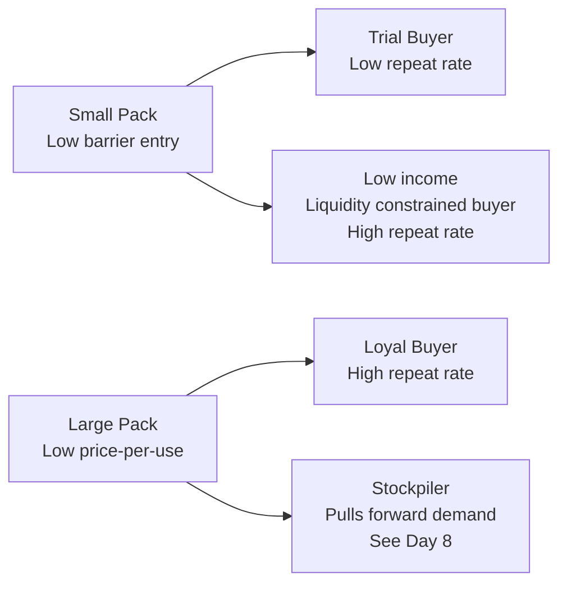

# Day 10 — Pack: Size Elasticity and the Trial-Loyalty Tradeoff (Surf Excel)

> **Today's one idea:** Pack size governs price-per-use and recruits fundamentally different consumer behaviours; assortment analysis then asks whether each additional SKU is incremental to the brand (new buyers/occasions) or merely cannibalising existing volume — and the decision requires both MMM cross-SKU regression and Kantar duplication data to answer correctly.
> **Reading time:** ~35 min · **Prereqs:** Days 6–8
> **Primary source for today:** Charan, A. *The Marketing Analytics Practitioner's Guide* — the pack and portfolio chapters
> **Before you start:** Recall Day 9's load-bearing idea — one sentence: what is weighted distribution, and why does it affect base sales rather than incremental sales?

---

## The Hook

Surf Excel launches a 200g trial sachet in Pakistan at PKR 40. The brand manager calls it a "trial strategy." The finance director calls it "margin dilution." The MMM team adds a pack dummy and calls it a day.

Six months later, the trial sachet represents 23% of volume but only 9% of net revenue. The MMM shows a positive pack coefficient. The brand team celebrates penetration growth. But Kantar data shows that sachet buyers have a 12% repeat rate — compared to 68% for 1kg pack buyers.

The sachet brought in consumers who were not retained. The pack created trial but not loyalty. The two outcomes have opposite implications for brand equity investment, pricing strategy, and long-term revenue. And the MMM treated them as one variable.

This is the Pack problem: not just "which sizes do we sell" but "what behaviour does each size recruit, and what is the long-term value of that behaviour?"

---

## Building the Intuition

### Price-per-use: the consumer's real price signal

Consumers do not primarily evaluate FMCG products on absolute price — they evaluate them on price-per-use. This reframes the Pack decision entirely:

| Surf Excel Pack | Price (PKR) | Uses per pack | Price per use |
|----------------|-------------|--------------|---------------|
| 200g sachet | 40 | 4 | 10.0 |
| 500g box | 90 | 10 | 9.0 |
| 1kg box | 170 | 20 | 8.5 |
| 2kg box | 310 | 40 | 7.75 |
| 5kg bulk | 720 | 100 | 7.20 |

Larger packs have lower price-per-use. This is the classic **"economy of scale" incentive for loyal buyers** — if you are committed to the brand, buy bigger and save.

Smaller packs have higher price-per-use but lower **price-per-occasion** — the absolute cash outlay is small enough that a consumer who is uncertain about the brand can trial it without a large financial risk.

**This means pack size simultaneously affects two different consumer segments:**



The distinction between "trial buyer" and "liquidity-constrained loyal buyer" in the small pack segment is critical. In Pakistan, a large proportion of 200g sachet buyers are *loyal but cash-constrained* — they buy the sachet every week because they cannot afford to buy the 1kg box even though the price-per-use is higher. These buyers have high repeat rates and are structurally different from "curious trial" buyers.

Your MMM cannot distinguish these segments from a single pack dummy. This is where Kantar Worldpanel data (repeat purchase rates by pack size) and consumer segmentation research become essential complements to the MMM.

### Pack mix shift vs. pack price change

Two very different things look similar in Nielsen ASP data:

1. **Pack mix shift:** The proportion of volume in each pack size changes — e.g., more consumers shift to 1kg boxes from 500g. Average ASP per unit falls (because you are selling fewer high-price-per-unit small packs). The price per use does not change for any individual consumer.

2. **Pack price change:** The price of a specific pack is raised or lowered. Every consumer buying that pack pays more or less.

A naïve MMM will interpret both as "a change in ASP" and attribute both to price elasticity. This is wrong — a pack mix shift should be modelled as a **pack index change**, not a price change.

### The pack index variable

A clean way to capture pack mix dynamics is a **pack index**:

```python
def pack_index(df, packs, weights):
    """
    Weighted index of pack size mix.
    packs:   list of pack size columns (share of total volume)
    weights: price-per-use value for each pack (index: 1kg = 1.0)
    """
    # Example weights for Surf Excel (price-per-use indexed to 1kg = 1.0)
    # 200g: 1.18, 500g: 1.06, 1kg: 1.00, 2kg: 0.91, 5kg: 0.85
    index = sum(df[pack] * weight for pack, weight in zip(packs, weights))
    return index

# High pack index = more volume in small packs (high price-per-use)
# Low pack index = more volume in large packs (low price-per-use)
```

This index captures the net effect of pack mix on effective price without conflating it with actual price changes.

### Assortment incrementality: does a new SKU grow or cannibalise?

Adding a SKU to the range is not free. Every new SKU competes for:
- **Shelf space** — retailers allocate finite facings; a new SKU may displace an existing one
- **Consumer attention** — a wider range can confuse or overwhelm (the "paradox of choice" at shelf)
- **Production and logistics capacity** — additional SKUs multiply complexity

The central question in assortment analysis is: **is the new SKU's volume incremental to the total brand, or does it merely redistribute volume from existing SKUs?**

Three evidence sources answer this:

**1. Duplication of Purchase (Kantar):**
What percentage of new SKU buyers *also* buy the existing SKU in the same period?

```
Duplication rate = (buyers of SKU A who also buy SKU B) / (total buyers of SKU B)
```

- High duplication (>60%): the new SKU is attracting the same consumers as the existing range — primarily cannibalising, not recruiting new buyers
- Low duplication (<25%): the new SKU is reaching a distinct consumer segment — primarily incremental

For Surf Excel, if the 200g sachet buyers overlap 70% with 500g pack buyers, the sachet is not recruiting new consumers — it is offering the same consumers a smaller purchase on some occasions.

**2. Category Development Index vs. Brand Development Index:**

```
CDI = (brand's % of category volume in region) / (region's % of national population) × 100
BDI = (brand's % of national volume in region) / (region's % of national brand volume) × 100
```

A new SKU that raises BDI without raising CDI is growing brand share at the expense of competitors — net incremental to the category. A SKU that raises BDI by stealing from other brand SKUs has zero category CDI effect — it is merely reorganising the brand's internal volume.

**3. The MMM cannibalization test (cross-SKU regression):**

If data exists at SKU or pack level, fit a system of equations where each pack's volume is explained by the other packs' distribution:

```python
import statsmodels.formula.api as smf

# Does listing the sachet reduce 500g volume?
model_500g = smf.ols(
    'volume_500g ~ volume_sachet + wd_500g + wd_sachet + price_pu_500g + seasonality',
    data=df
).fit()

# If coeff on volume_sachet is significantly negative:
#   sachet cannibalises 500g — not fully incremental
# If not significant or positive:
#   sachet is incremental to the 500g pack
print(f"Sachet → 500g cannibalization: {model_500g.params['volume_sachet']:.3f}")
```

The **net incrementality** of the sachet to total brand volume is:

```
Net incremental volume = Sachet volume × (1 − cannibalization rate)
```

Where cannibalization rate = proportion of sachet volume sourced from existing pack sizes rather than from new buyers or new occasions.

**The portfolio price architecture test:**

A well-designed range should have SKUs spaced at *different price-per-use tiers* to serve distinct consumer segments without mutual substitution:

```
Entry tier (access):    Sachet — high price-per-use, low cash outlay
Core tier (value):      500g / 1kg — benchmark price-per-use, breadwinner SKU
Premium tier (economy): 2kg+ — lowest price-per-use, loyalty reward

Rule: if two SKUs are within 8% of each other on price-per-use,
      they will cannibalise — one should be rationalised or repriced.
```

---

## The Formal Picture

### Pack in the MMM equation

Pack enters the model in one of three ways, depending on data availability:

**Option 1 — Pack dummy (most common, least informative):**
```math
\text{Sales}_t = \ldots + \beta_{\text{sachet}} \cdot \mathbb{1}[\text{sachet listed}_t] + \beta_{\text{bulk}} \cdot \mathbb{1}[\text{bulk listed}_t] + \ldots
```
This captures the level effect of listing/delisting a pack. Coefficient $\beta_{\text{sachet}}$ tells you the average sales change when the sachet is in the range.

**Option 2 — Pack index (preferred for portfolio management):**
```math
\text{Sales}_t = \ldots + \beta_{\text{PackIdx}} \cdot \text{PackIndex}_t + \ldots
```
Captures the continuous effect of pack mix shifts on effective price.

**Option 3 — Separate pack-level models:**
Build one MMM per pack size, then aggregate. Most accurate, but requires sufficient volume data at pack level (typically only viable for large-volume SKUs).

### What the pack coefficient tells you for portfolio decisions

The pack coefficient in the aggregate model answers: "What is the net volume effect of the current pack portfolio structure?"

A positive $\hat{\beta}_{\text{sachet}}$ says: "Listing the sachet adds volume to the total brand, above what would be expected from the price-per-use difference alone." This could mean:
- The sachet recruits new buyers who would not buy any other Surf Excel pack
- The sachet drives incremental category consumption occasions

A non-significant $\hat{\beta}_{\text{sachet}}$ says: "The sachet's volume is largely substituting for other packs — not growing the brand."

### The long-run value problem (what MMM cannot answer)

The pack coefficient tells you about contemporaneous volume effects. It cannot tell you:

- Whether sachet trial buyers eventually trade up to larger packs (long-run value positive)
- Whether sachet trial buyers attrite without converting (long-run value negative)
- Whether eliminating the sachet would lose its buyers permanently or redirect them to the 500g pack

**For these questions, you need Kantar repeat purchase data combined with the MMM.** This is a limitation to state explicitly in any CMO deck that includes pack decisions (Day 29).

| What MMM tells you about Pack | What Kantar tells you about Pack |
|------------------------------|----------------------------------|
| Volume uplift from listing/delisting | Repeat rate by pack size |
| Pack mix effect on effective price | Trade-up rate (sachet → 500g over time) |
| Revenue impact at current period | Long-run CLV by pack entry point |

The complete Pack decision requires both.

### Formalising the assortment incrementality decision

Before any SKU add or delist, compute the **net revenue test**:

```math
\Delta \text{Brand Revenue} = \underbrace{\text{SKU}_B \text{ volume} \times \text{ASP}_B}_{\text{Gross gain}} 
- \underbrace{\delta \times \text{Volume}_A \times \text{ASP}_A}_{\text{Cannibalisation loss}}
```

where $\delta$ is the cannibalization rate estimated from the cross-SKU regression or from Kantar duplication analysis.

**Decision rule:**
- $\Delta \text{Brand Revenue} > \text{Portfolio complexity cost}$ → list the SKU
- $\Delta \text{Brand Revenue} < \text{Portfolio complexity cost}$ → do not list (or delist if already in range)

Portfolio complexity cost includes: production setup, distribution incremental cost, and the opportunity cost of shelf space displaced from the core SKU.

For a **delist decision**, the formula inverts: the question is whether removing the SKU's volume loss is more than offset by the recovery of cannibalised volume to remaining SKUs plus the complexity saving.

```python
def net_incrementality(
    sku_b_volume: float,
    sku_b_asp: float,
    cannibalization_rate: float,
    sku_a_volume: float,
    sku_a_asp: float,
    complexity_cost: float
) -> dict:
    gross_gain = sku_b_volume * sku_b_asp
    cannibalization_loss = cannibalization_rate * sku_a_volume * sku_a_asp
    net_revenue = gross_gain - cannibalization_loss
    decision = "LIST" if net_revenue > complexity_cost else "DO NOT LIST"
    return {
        "gross_revenue_gain": gross_gain,
        "cannibalization_loss": cannibalization_loss,
        "net_revenue": net_revenue,
        "complexity_cost": complexity_cost,
        "decision": decision
    }
```

---

## Where It Breaks / What It Is Not

**"A positive pack coefficient means the pack is profitable."** Volume ≠ profit. The sachet may drive volume but at a margin below the brand's average (promotional support required, smaller absolute margins, higher unit cost of production and distribution per consumer use). Always convert the volume coefficient to a margin contribution before recommending a pack action.

**"Pack elasticity is stable."** Pack mix shifts over the brand lifecycle. At launch, small packs drive trial. At maturity, large packs dominate because the consumer base is loyal. A coefficient estimated on historical data may not hold if the brand is in a different lifecycle phase.

**"All geographies have the same pack response."** In Pakistan's urban markets, 1kg packs dominate. In rural Pakistan, 200g sachets dominate (cash constraint and storage limitation). A single-market MMM with no geographic segmentation will average these responses and produce a coefficient that is correct nowhere. Day 28 (Place & People decisions) and Day 29 (Pack decisions) address this with geo-specific models.

**Multicollinearity with Price.** Pack size is mechanically linked to ASP — a shift toward smaller packs raises ASP per unit and a shift toward larger packs lowers it. This creates collinearity between the pack index and the price variable. Resolve by using price-per-use (not price-per-unit) as the price variable when pack mix variation is significant in your data.

---

## Try It Yourself

> Close the page now before attempting Exercise 1.

**Exercise 1 — Retrieval.** Without looking: (a) explain the difference between price-per-unit and price-per-use, and why the latter is the consumer's real price signal; (b) name the two fundamentally different consumer behaviours that small packs can recruit.

<details>
<summary>Reference answer</summary>

(a) **Price-per-unit:** the shelf price of the pack. **Price-per-use:** cost to perform one usage occasion (e.g., one wash load). Price-per-use is the real signal because consumers buy detergent for wash loads, not for kilograms. A 200g sachet is more expensive per wash than a 1kg box, but cheaper to acquire as a single purchase — these are different decisions.

(b) Two behaviours small packs recruit: (1) **trial buyers** — uncertain, low-repeat, brand-new consumers who won't risk a large purchase; (2) **liquidity-constrained loyal buyers** — existing brand loyalists who can only afford small purchases at a time. These two segments have opposite implications for repeat rate and long-run value.
</details>

---

**Exercise 2 — Direct application.** A Surf Excel MMM for Pakistan returns the following coefficients (all statistically significant):

- Log relative price: −1.8
- Sachet dummy: +0.14 (14% volume uplift when sachet is listed)
- 5kg bulk dummy: +0.09 (9% volume uplift when bulk is listed)

The brand is considering delisting the 200g sachet to simplify the portfolio and reduce production complexity. The finance team estimates the sachet accounts for 22% of total volume.

Using the MMM alone, estimate the net volume impact of delisting. Then identify one question the MMM cannot answer that would change this recommendation.

<details>
<summary>Reference answer</summary>

**From MMM alone:** Delisting the sachet removes +0.14 (14%) volume uplift. But the sachet also accounts for 22% of total volume directly. If all 22% sachet volume is lost, total volume falls by 22%. If some converts to other packs, the net loss is 22% × (1 − conversion rate). The MMM coefficient of +0.14 suggests the sachet adds 14% *above* what would be expected without it — so net loss from delisting ≈ 14% of total brand volume (lower bound), up to 22% (upper bound if zero conversion).

**What the MMM cannot answer:** Whether sachet buyers trade up to 500g packs or leave the brand entirely. Kantar repeat purchase data showing whether sachet-entry buyers transition to larger packs over 6–12 months is essential. If 60% convert, the 14–22% range collapses to 6–9%. If 10% convert, the full 20%+ loss materialises.
</details>

---

**Exercise 3 — Stretch (callback to Day 5).** The saturation curve from Day 5 showed that the Hill function applies to any driver with diminishing returns. Sketch what the pack size elasticity function might look like if plotted as "volume uplift vs. number of pack sizes in the range." Why would a 5th pack size add less volume than a 2nd?

<details>
<summary>Reference answer</summary>

The curve would be concave (like the Hill function with $\alpha < 1$): the 2nd pack size adds significant volume (now the brand serves two distinct consumer needs — trial and loyalty). The 3rd adds less (fills a gap, but many consumers are already covered). The 4th and 5th add little incremental volume while adding distribution complexity, production cost, and shelf space competition with the core range.

The mechanism: each additional pack size serves a progressively smaller consumer segment with unmet needs. At some point, additional SKUs cannibalise each other more than they grow the total brand — the retail equivalent of the saturation curve.

This is the "portfolio complexity has a hidden distribution cost" insight referenced in the Day 29 pack decision module.
</details>

---

**Exercise 4 — Assortment incrementality.** Surf Excel Pakistan is considering adding a 100g ultra-sachet at PKR 22. The brand team forecasts 8,000 units/week. Kantar duplication analysis shows 65% of expected ultra-sachet buyers also buy the 200g sachet in the same month. Cross-SKU regression estimates that each ultra-sachet unit cannibalises 0.4 units of the 200g sachet.

| SKU | Volume (units/wk) | ASP (PKR) |
|-----|-------------------|-----------|
| 100g ultra-sachet (new) | 8,000 | 22 |
| 200g sachet (existing) | 18,000 | 38 |

Portfolio complexity cost estimate: PKR 45,000/week (production line changeover, distribution incremental).

(a) Calculate the gross revenue gain from the ultra-sachet.
(b) Calculate the cannibalization loss to the 200g sachet.
(c) Calculate net revenue and make a list/do not list recommendation.
(d) The Kantar duplication rate is 65%. Does this independently support or contradict the MMM-derived cannibalization rate of 0.4? What does the duplication rate tell you that the cross-SKU coefficient doesn't?

<details>
<summary>Reference answer</summary>

(a) Gross revenue gain = 8,000 × PKR 22 = **PKR 176,000/week**

(b) Cannibalization loss = 0.4 × 8,000 (cannibalised 200g units) × PKR 38 = 3,200 × 38 = **PKR 121,600/week**

(c) Net revenue = 176,000 − 121,600 = **PKR 54,400/week**
Complexity cost = PKR 45,000/week
Net after complexity = 54,400 − 45,000 = **PKR 9,400/week — marginally positive**
Recommendation: **Do not list** — the margin of £9,400 is too thin to absorb any forecast risk (volume miss of even 10% flips to negative). The ultra-sachet should only be listed if volume forecasts are robust and if the complexity cost can be reduced.

(d) The duplication rate (65%) tells you about *who* is buying — it is a buyer-level measure. It says most expected ultra-sachet buyers are the *same people* as current 200g sachet buyers, buying on a different occasion or at a smaller cash outlay. The cross-SKU coefficient (0.4 units cannibalised per unit sold) tells you about *volume displacement* — it is a volume-level measure. Together: high duplication + moderate volume cannibalization suggests the ultra-sachet is mostly splitting existing 200g sachet occasions rather than recruiting new buyers. The duplication rate is the early warning; the cannibalization coefficient is the financial quantification.
</details>

---

**Transfer — apply it:**

> In your domain, is there a "pack size" equivalent — a format, tier, or variant of your product or service that attracts fundamentally different users with different long-term value? Write one sentence identifying it and one sentence on whether your current modelling distinguishes between the two user types.

---

## Connect It Back

Pack is the lever that sits at the intersection of Price (price-per-use), Place (distribution complexity), and Promotion (sachet promotions behave differently from large pack promotions). Tomorrow we close the 5Ps with People — the least glamorous and hardest-to-measure lever, and the one that most often causes the other four to over-perform or under-perform relative to their estimated coefficients.

**Sharp question to carry forward:** If the Surf Excel team launches the 200g sachet specifically in rural areas with limited distribution, what would you expect to happen to the relationship between the sachet coefficient in a national model vs. a rural-only model?

*(The national model will average the strong rural effect across the weak urban effect, underestimating the sachet's value in the context where it was strategically designed to work. This is a geographic heterogeneity problem — Day 28 addresses it.)*

---

## Suggested Readings for Today

**Required if you have 15 extra minutes:** Charan, A. *The Marketing Analytics Practitioner's Guide* — the pack and portfolio analytics chapter. Focus on how Charan frames the trade-off between range breadth and distribution efficiency.

**If you want the deep version:**
- Kantar Worldpanel methodology documentation (kantar.com) — the "shopper behaviour metrics" section. Understanding how Kantar measures repeat purchase rate by SKU is essential for the Kantar-MMM integration described today.

---

## Navigation

← **Previous:** [Day 9 — Place: Distribution as a Growth Driver](./day-09-place-distribution.md)
→ **Next:** [Day 11 — People: Trade Execution & Consumer Segments](./day-11-people-trade-execution.md)
