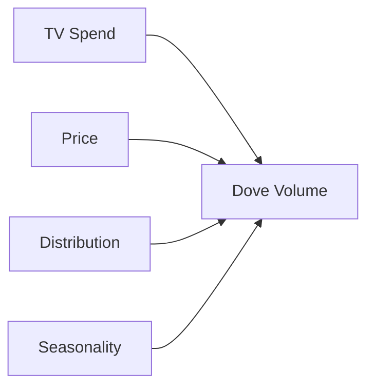
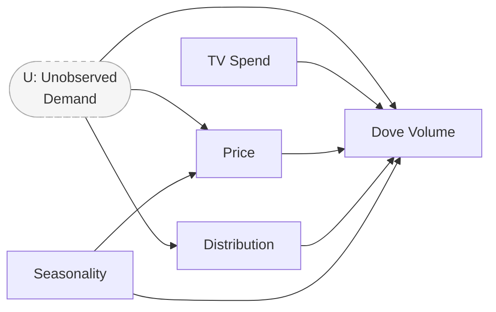
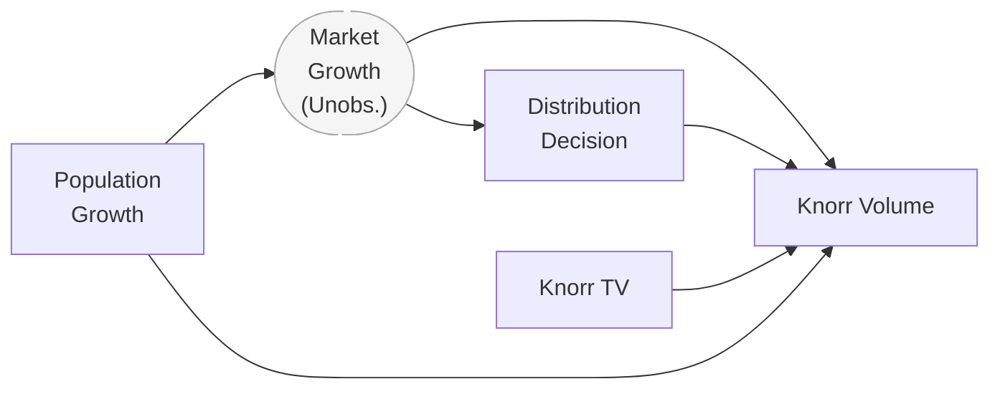

# Day 14 — DAGs for MMM: Drawing What Causes What Before Fitting Anything

> **Today's one idea:** A Directed Acyclic Graph makes every causal assumption in the MMM explicit before any model is fit — and drawing it forces you to find the backdoor paths that bias your coefficients.
> **Reading time:** ~35 min · **Prereqs:** Day 13
> **Primary source for today:** Huntington-Klein (2021), *The Effect*, Chapter 6 — "Causal Diagrams"
> **Before you start:** Recall Day 13's load-bearing idea — one sentence: what is endogeneity, and how does it bias the price coefficient in a naïve Surf Excel MMM?

---

## The Hook

Two Unilever analysts are arguing about whether to include "competitor TV spend" in the Dove MMM.

Analyst A: "Of course include it — Nivea's TV spend affects Dove's volume."
Analyst B: "But Nivea's spend is correlated with Dove's own TV spend because both brands increase spend in Q4. Including it will create multicollinearity."
Analyst A: "That's fine — we can handle multicollinearity."
Analyst B: "But then are we estimating the *direct* effect of Dove TV, or the *total* effect including the competitive response?"

Both analysts are right about something. The argument is unresolvable until they draw the causal graph and agree on which question they are actually trying to answer.

This is what a DAG does: it forces the question to become precise. Once you have the graph, the analysis almost writes itself. Without the graph, you are making implicit assumptions you cannot examine or defend.

---

## Building the Intuition

### Nodes, arrows, and what they mean

A DAG has two elements:
- **Nodes** (circles or boxes): variables — things that can take different values
- **Directed edges** (arrows): causal relationships — $A \to B$ means "A causes B (directly)"

Three rules:
1. **Directed:** arrows point in one direction only
2. **Acyclic:** no variable can cause itself, even through a chain (no loops)
3. **Markov property:** once you know a variable's direct parents (causes), it is independent of all non-descendants

The absence of an arrow is as meaningful as its presence: $A \not\to B$ means "A does not directly cause B." This is an assumption, and it should be defended.

### The simplest MMM DAG

The naïve MMM assumes:



This graph says: TV, Price, Distribution, and Seasonality all directly cause Volume, and nothing causes any of them (except the brand and nature, which are outside the system). This is an assumption — and it is wrong for Price and Distribution, as Day 13 established.

### Adding the confounder: the correct Dove DAG

The correct graph includes the unobserved demand factor $U$ (seasonal demand conditions, economic environment, category trends):



Now the graph reveals two **backdoor paths** from Price → Volume that were invisible before:

1. Price ← U → Volume (via unobserved demand)
2. Price ← Seasonality → Volume (via observed seasonality)

Backdoor path 2 is blockable: if we control for Seasonality in the regression, we close this path. Backdoor path 1 is not directly blockable because U is unobserved — this is the endogeneity problem Day 13 described.

### The four node structures you must recognise

Every DAG is built from four elementary structures. Recognising them is the skill that makes causal reasoning fast.

```
CHAIN (mediation):          FORK (common cause):
A → B → C                   A ← B → C
  B mediates A→C             B confounds A and C
  Condition on B?            Condition on B to deconfound

COLLIDER:                   DIRECT EFFECT:
A → B ← C                   A → C  (no B)
  B is caused by both        Simple — nothing to do
  DO NOT condition on B
  (opens a spurious A-C path)
```

**The collider warning.** Conditioning on a collider is the most dangerous mistake in causal analysis, because it *creates* a spurious association rather than removing one.

Example: In the Dove model, suppose we include "retailer promotional support" as a control variable. Retailer support is caused by *both* high Dove media investment (which triggers joint promotional funding) *and* strong category performance (which retailers want to support). "Retailer support" is a collider: Dove media → Retailer support ← Category performance.

If we condition on retailer support, we open a spurious backdoor path between Dove media spend and category performance — making TV look less effective or more effective than it truly is.

---

## The Formal Picture

### The Backdoor Criterion (Pearl, 1993)

The causal effect of $X$ on $Y$ is identified by the adjustment formula if we can find a set of variables $\mathbf{Z}$ such that:

1. **No descendant of $X$ is in $\mathbf{Z}$** — we don't control for variables caused by what we are trying to measure
2. **$\mathbf{Z}$ blocks every backdoor path from $X$ to $Y$** — all non-causal pathways between $X$ and $Y$ are closed

If such a $\mathbf{Z}$ exists and all variables in it are observed, the effect is identified by conditioning (including them as controls in the regression).

Applied to Surf Excel price:

| Backdoor path | Blockable? | How |
|--------------|-----------|-----|
| Price ← Seasonality → Volume | Yes | Include seasonality dummy |
| Price ← Unobserved Demand → Volume | No | U is unobserved — need an instrument |
| Price ← Competitor Pricing → Volume | Yes | Include Ariel ASP as control |

This table is the output of the DAG analysis. It tells you what controls to include (blockable paths) and where you need an instrument or experiment (unblockable paths).

### Drawing the Knorr distribution DAG

The Day 13 discussion of distribution endogeneity in Knorr becomes a DAG:



Backdoor path: Distribution ← Market Growth → Volume. Market Growth is partially observed (through population data, category value trends) — so this path is partially blockable by including category trend controls. Including category volume trend as a control goes a significant way toward deconfounding the distribution coefficient.

### The practical DAG workflow for an MMM project

```
Step 1: List all variables you intend to include
Step 2: For each pair (X, Y), ask: "Does X directly cause Y?"
Step 3: Draw the arrow (or confirm its absence)
Step 4: For each driver X you care about (Price, Promo, Dist):
         - Find all backdoor paths from X to Volume
         - Classify each path: blockable (observable Z) or unblockable (U unobserved)
Step 5: For blockable paths → add Z to the regression
        For unblockable paths → design an instrument (Day 17) or a geo-test (Day 16)
Step 6: Check for colliders among your planned control variables
Step 7: Document the DAG in your analysis — it is your explicit causal claim
```

This workflow takes 30–60 minutes for a typical MMM. It is time you spend once and it protects every downstream inference.

---

## Where It Breaks / What It Is Not

**"Drawing the DAG is subjective."** The DAG is not meant to be objectively true — it is meant to make your assumptions explicit and checkable. Two analysts with different DAGs will reach different conclusions; that disagreement is now visible and arguable. An implicit assumption cannot be argued with.

**"A bigger DAG is better."** The goal is the minimal graph that captures the confounding relevant to your question. Adding 20 nodes when the question concerns Price elasticity adds visual complexity without analytical value. Draw the variables relevant to the effect you are estimating.

**"The DAG must include every possible cause."** No — it must include every variable that creates a backdoor path between your regressor and your outcome. If a variable affects Volume but is unrelated to Price, it does not create a backdoor path and can be omitted from the DAG (though it may still belong in the regression as a precision control).

**"I don't know all the causal relationships."** Neither does anyone. The DAG is not ground truth — it is your best current model of the causal structure. Document it, present it to domain experts for critique, and update it when you learn more. A defended, uncertain DAG is better than an unexamined one.

---

## Try It Yourself

> Close the page now before attempting Exercise 1.

**Exercise 1 — Retrieval.** Without looking: draw the four elementary node structures (chain, fork, collider, direct effect). For each, state whether conditioning on the middle node opens or closes the path between the two end nodes.

<details>
<summary>Reference answer</summary>

| Structure | Form | Condition on middle node? |
|-----------|------|--------------------------|
| Chain | A → B → C | Closes the A→C path (blocks mediation) |
| Fork | A ← B → C | Closes the A–C spurious association (deconfounds) |
| Collider | A → B ← C | **Opens** a spurious A–C path (DO NOT condition on collider) |
| Direct | A → C | No middle node — nothing to condition on |

The collider rule is the most dangerous: conditioning on a collider creates a spurious association. The fork rule is the most used: conditioning on a common cause removes confounding.
</details>

---

**Exercise 2 — Direct application.** Draw the DAG for the following Surf Excel MMM scenario (nodes and arrows — you can write this in text as "A → B" pairs):

Variables: Price, Volume, Competitor Price (Ariel), Unobserved Category Demand, Promotional Activity, Seasonality.

Assumptions:
- Category Demand is caused by Seasonality and is unobserved
- Both Surf Excel Price and Ariel Price are influenced by Category Demand
- Surf Excel Price and Ariel Price are correlated (Ariel reacts to Surf Excel moves)
- Promotions are run when Surf Excel volume is expected to be low (timing endogeneity)
- All of Price, Competitor Price, Promotions directly cause Volume

Then identify: (a) all backdoor paths from Price to Volume; (b) which are blockable; (c) which require an instrument.

<details>
<summary>Reference answer</summary>

DAG edges:
- Seasonality → Demand
- Demand → Price (Surf Excel sets price based on demand)
- Demand → Volume (demand directly drives volume)
- Demand → Ariel Price (Ariel also prices on demand)
- Ariel Price → Price (Ariel price influences Surf Excel price)
- Ariel Price → Volume (cross-price elasticity)
- Price → Volume (own-price effect — what we want to estimate)
- Promotions → Volume
- Volume(expected) → Promotions (timing endogeneity — promotions run in weak periods)

*Note: "expected volume" → Promotions is a simplified way of encoding timing endogeneity; formally this is a feedback loop which DAGs handle via time-indexing.*

Backdoor paths from Price to Volume:
1. Price ← Demand → Volume (via unobserved demand) — **unblockable** (need IV)
2. Price ← Seasonality ← Demand → Volume (via seasonality) — **blockable** (control for seasonality)
3. Price ← Ariel Price → Volume (via cross-price) — **blockable** (control for Ariel ASP)

Instrument needed for: path 1 (unobserved demand endogeneity). Day 17 identifies what makes a valid instrument.
</details>

---

**Exercise 3 — Stretch (callback to Day 11).** In the Day 11 Dove example, shelf compliance (People) was a driver that, when omitted, biased the Promotion coefficient. Using today's DAG language: draw the path structure that explains why omitting shelf compliance creates bias in the Promotion coefficient. What type of structure (chain, fork, collider, direct) does shelf compliance form with Promotion and Volume?

<details>
<summary>Reference answer</summary>

Shelf Compliance is a **fork** (common cause):

```
Promotion ← High-execution accounts → Shelf Compliance → Volume
```

More precisely: High-execution accounts (Tesco, Sainsbury's) both have more promotions (because they have JBPs with dedicated Unilever resource) AND higher compliance → higher volume response.

If Shelf Compliance is omitted, the Promotion coefficient absorbs the compliance effect. The path Promotion ← High-execution → Compliance → Volume is a backdoor path from Promotion to Volume (through the unobserved "high-execution account" factor).

Blocking this path requires including a Shelf Compliance proxy as a control variable — which is exactly what Day 11's WD/ND ratio or call frequency variable does. Without it, Promotion is endogenous in the sense that the "high execution account" selection creates a spurious positive association between promotional activity and volume beyond the causal promotional effect.
</details>

---

**Transfer — apply it:**

> For the most important causal claim in your current or recent work, draw a three-node DAG: the cause you care about (X), the outcome (Y), and the most plausible confounder (Z). Write one sentence describing what type of structure Z forms — and whether it is observable.

---

## Connect It Back

The DAG is your causal claim, made explicit. Tomorrow we ask the harder question: even if you have drawn the DAG correctly, can you estimate the effect you care about? Some effects are identified (blockable backdoor paths, observable controls) and some are not — and Day 15 tells you precisely which is which.

**Sharp question to carry forward:** In the Surf Excel DAG from Exercise 2, backdoor path 1 (via unobserved demand) is not blockable by adding control variables. What feature of a new variable would have to be true for it to *instrument* for Price — blocking this path through a different mechanism?

*(Answer: it must affect Price but have no direct effect on Volume, and no path to Volume except through Price. This is the IV exclusion restriction — tomorrow and Day 17 formalise it.)*

---

## Suggested Readings for Today

**Required if you have 15 extra minutes:** Huntington-Klein (2021), *The Effect*, Chapter 6 — "Causal Diagrams." The most readable treatment of DAGs for practitioners. Focus on the four node structures and the backdoor criterion — exactly the content of today's page, in a complementary style.

**If you want the deep version:**
- Neal, B. (2020), *Introduction to Causal Inference*, Lecture 3 — "The do-calculus and graphical criteria." Lecture is free at bradyneal.com/causal-inference-course. The graphical identification criteria are derived rigorously; watch this after the page has settled.
- Pearl & Mackenzie (2018), *The Book of Why*, Chapter 7 — "Beyond Adjustment: The Miracle of Interventions." Pearl's account of why the DAG + do-calculus is a more general identification tool than the backdoor criterion alone.

---

## Navigation

← **Previous:** [Day 13 — The Confounding Problem](./day-13-confounding-problem.md)
→ **Next:** [Day 15 — Identification: What You Can and Cannot Estimate](./day-15-identification-limits.md)
