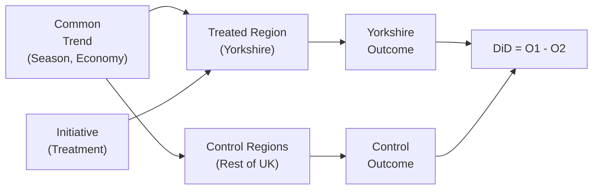

# Day 16 — Difference-in-Differences: Geo-Tests as Causal Ground Truth (Knorr)

> **Today's one idea:** When a marketing action rolls out to some geographies but not others, DiD gives a causal estimate of its effect by comparing the change in treated geographies to the change in control geographies over the same period.
> **Reading time:** ~35 min · **Prereqs:** Days 14–15
> **Primary source for today:** Angrist & Pischke (2009), *Mostly Harmless Econometrics*, Chapter 5 — "Differences-in-Differences"
> **Before you start:** Recall Day 15's load-bearing idea — one sentence: what does "identified" mean for a causal effect, and what is the difference between a Level 2 and Level 3 identification failure?

---

## The Hook

Knorr is testing a new distribution initiative: deploying a dedicated salesforce in Yorkshire to improve shelf compliance and gain distribution in convenience stores. The initiative runs for 6 months in Yorkshire. No other region changes.

The brand manager wants to know: did it work? She has weekly Nielsen sell-through data for all UK regions.

The naïve approach: look at Yorkshire sales before and after. They went up 12%. Conclude: the initiative worked, it added 12%.

The problem: Yorkshire sales were already growing 8% YoY before the initiative (strong population growth, foodservice expansion). Nationally, all regions grew 5% over the same period. The initiative may have added only $12\% - (8\% - 5\%) = 9\%$ — or maybe less, depending on whether Yorkshire was on a different trajectory.

Difference-in-Differences (DiD) gives the right answer. It uses the national trend (observed in untreated regions) as the counterfactual for what Yorkshire would have done without the initiative.

---

## Building the Intuition

### The two differences

DiD computes exactly two differences:

**Difference 1** (within treated group): How much did Yorkshire change from before to after?
**Difference 2** (within control group): How much did the rest of the UK change from before to after?

**DiD estimate** = Difference 1 − Difference 2

```
                  Before      After      Change
─────────────────────────────────────────────────
Yorkshire         100         112         +12%     ← Difference 1
Rest of UK        100         107         +7%      ← Difference 2
─────────────────────────────────────────────────
DiD estimate:     +12% − +7% = +5%                 ← Causal effect
```

Without DiD, you would have claimed +12%. With DiD, you claim +5%. The other +7% was the national trend that would have happened regardless.

### Why DiD identifies the causal effect

The key insight: subtracting the control group's change removes the common trend. After this subtraction, what remains is the variation unique to the treated group — which, under the parallel-trends assumption, is the causal effect of the treatment.



The common trend affects both Yorkshire and Rest of UK equally. When you subtract, it cancels. What remains is only the initiative's effect.

### The parallel trends assumption — the one thing you must defend

DiD identifies the causal effect *under the parallel trends assumption*:

> In the absence of the treatment, the treated group would have followed the same trend as the control group.

This assumption is:
- **Untestable in the post-treatment period** (you only observe what happened, not what would have happened)
- **Testable in the pre-treatment period** — if treated and control groups followed parallel trends *before* the initiative, there is no evidence against the assumption

A **pre-trend test** plots the Yorkshire vs. Rest of UK trends for 12–24 months before the initiative. If they are parallel (difference between them is flat), the parallel-trends assumption is plausible. If Yorkshire was already diverging from the national trend before the initiative, the DiD estimate will be biased.

```
Pre-treatment test (12 months before initiative):

Sales │
Index │   ── Rest of UK
      │  /
      │ /── Yorkshire (good: parallel, no pre-trend divergence)
      │
      └────────────────── Time
                │
           Initiative starts (Week 0)

Sales │
Index │         /── Yorkshire (bad: diverging BEFORE initiative — 
      │        /              DiD will overstate the effect)
      │  ── Rest of UK
      │
      └────────────────── Time
```

### Designing a geo-test for MMM validation

DiD is not just used to evaluate interventions — it is used to **validate MMM coefficients**. After fitting the MMM, a DiD estimate from a geo-test provides an independent causal benchmark.

If the MMM says: "Distribution drives +620 units per WD point" — and a geo-test shows "the Yorkshire distribution initiative added 5% volume (≈ 3,800 units/week) for a WD gain of 6 points = 633 units/WD point" — the two estimates agree within error, and the MMM coefficient is validated.

If they disagree materially, the MMM coefficient is suspect and requires investigation (confounded by some uncontrolled variable).

---

## The Formal Picture

### The DiD regression

The standard implementation of DiD is an OLS regression with interaction term:

```math
y_{it} = \alpha + \beta_1 \cdot \text{Treat}_i + \beta_2 \cdot \text{Post}_t + \delta \cdot (\text{Treat}_i \times \text{Post}_t) + \epsilon_{it}
```

where:
- $i$ = geographic unit (Nielsen region or ITV region)
- $t$ = time period (week)
- $\text{Treat}_i = 1$ if region $i$ received the initiative
- $\text{Post}_t = 1$ if time $t$ is after the initiative launch
- $\delta$ = the DiD estimator — the causal effect of the initiative

In Python:

```python
import statsmodels.formula.api as smf
import pandas as pd

# df: panel dataset with columns:
#   region, week, volume, treat (0/1), post (0/1)
df['treat_post'] = df['treat'] * df['post']

model = smf.ols(
    'log_volume ~ treat + post + treat_post + C(region) + C(week)',
    data=df
).fit()

print(model.summary())
# The coefficient on treat_post is the DiD estimate
# Include region and week fixed effects for the two-way FE version
```

The **two-way fixed effects (TWFE) version** — which includes both region fixed effects ($\alpha_i$) and time fixed effects ($\gamma_t$) — is the gold standard:

```math
y_{it} = \alpha_i + \gamma_t + \delta \cdot (\text{Treat}_i \times \text{Post}_t) + \epsilon_{it}
```

Region fixed effects control for any time-invariant regional differences. Time fixed effects control for any common shocks (national trends, seasonality). $\delta$ is then identified purely from the differential change in treated vs. control regions.

### What DiD cannot do

DiD cannot estimate price elasticity — because price typically changes everywhere simultaneously (national price), not just in some geographies. DiD requires *variation in treatment status across units*, not variation in the outcome of a universal change. This is why Day 17 (IV) is needed for price: there is typically no control group that faced a different price.

### Using CausalImpact as an alternative

When a clean control group is unavailable (e.g., Knorr has no geographies unaffected by the initiative), Brodersen et al.'s CausalImpact methodology can be used. It builds a Bayesian structural time-series model using pre-treatment data and control series (e.g., Knorr's own non-food categories, or category-level volume) to construct a synthetic counterfactual.

The key difference from DiD: CausalImpact doesn't require a parallel control group — it constructs a synthetic one from predictive covariates. But it requires a rich set of covariates that were unaffected by the treatment.

---

## Where It Breaks / What It Is Not

**"Any geographic variation is a good geo-test."** The control regions must genuinely be unaffected by the treatment. If Knorr's Yorkshire initiative spills over into adjacent regions (salesforce covers the border, consumers shop cross-region), the control group is contaminated — SUTVA (Stable Unit Treatment Value Assumption) is violated.

**"DiD gives the Average Treatment Effect."** DiD estimates the Average Treatment Effect on the Treated (ATT) — the effect for Yorkshire specifically. Whether this generalises to other regions depends on whether Yorkshire is representative. If Knorr always tests in its strongest region first, the ATT will overstate the expected effect of a national rollout.

**"A significant pre-trend test failure means DiD is wrong."** It means the parallel-trends assumption is violated *for a linear trend difference*. If the divergence follows a predictable pattern (e.g., Yorkshire always grows 1.5× the national rate), a regression-adjusted DiD that controls for this differential trend can still be valid. The pre-trend test is a warning, not a verdict.

**"DiD gives the ROI."** DiD gives the volume effect. To get ROI, you need volume × price → revenue → gross profit, compared to the cost of the initiative. This is straightforward arithmetic once DiD gives you the volume, but be careful about which "price" to use (ASP from Nielsen, not list price).

---

## Try It Yourself

> Close the page now before attempting Exercise 1.

**Exercise 1 — Retrieval.** Without looking: write the DiD formula. What are the two differences being subtracted? What assumption must hold for DiD to estimate a causal effect? How is this assumption tested?

<details>
<summary>Reference answer</summary>

DiD = (Treated post − Treated pre) − (Control post − Control pre)

The two differences: (1) the change in the treated group from before to after; (2) the change in the control group from before to after.

Parallel trends assumption: in the absence of treatment, the treated group would have followed the same trend as the control group.

Test: plot both groups' trends in the pre-treatment period. If they are parallel (no diverging trend before the initiative), the assumption is plausible. Formally, run a regression with leads (future treatment indicators) — if leads are insignificant, the pre-trends are parallel.
</details>

---

**Exercise 2 — Direct application.** Knorr runs a 12-week distribution initiative in Yorkshire and the North East. Weekly Nielsen volume data (indexed to 100 = pre-period average):

| Period | Yorkshire + NE | Rest of UK |
|--------|---------------|-----------|
| Pre (weeks −12 to 0): avg | 100 | 100 |
| Post (weeks 1 to 12): avg | 118 | 109 |

(a) Calculate the DiD estimate.
(b) Knorr's brand manager is excited: "We grew 18%!" Why is 18% the wrong number to report?
(c) The pre-trend test shows Yorkshire + NE was growing at exactly the same rate as Rest of UK for 24 months before the initiative. What does this tell you about the parallel-trends assumption?

<details>
<summary>Reference answer</summary>

(a) DiD = (118 − 100) − (109 − 100) = 18 − 9 = **+9 percentage points** causal effect

(b) 18% is wrong because it includes the 9% national trend growth that would have happened regardless of the initiative. The initiative added 9%, not 18%. Reporting 18% overestimates the initiative's ROI by 2×.

(c) The pre-trend test shows parallel trends for 24 months — this is strong evidence that the parallel-trends assumption holds. The initiative was not launched at a time of unusual Yorkshire growth. The DiD estimate of +9% is credible.
</details>

---

**Exercise 3 — Stretch (callback to Day 3).** The Knorr DiD estimate of +9% volume growth from the distribution initiative translates to approximately 6 WD points gained. Compare this to the MMM coefficient of $\hat\beta_{\text{WD}} = 620$ units per WD point (from Day 9's exercises).

The pre-initiative weekly volume was 38,000 units. The DiD shows +9% growth = 3,420 units/week over 6 WD points = 570 units/WD point.

Does this validate the MMM coefficient? What would you conclude if the DiD had returned 280 units/WD point instead?

<details>
<summary>Reference answer</summary>

**At 570 units/WD (DiD) vs 620 (MMM):** These agree within about 8% — well within the confidence intervals of both estimates. This validates the MMM coefficient. The distribution effect in the MMM is approximately causally identified for this brand and geography.

**If DiD returned 280 units/WD:** The MMM coefficient (620) would be more than double the causal estimate (280). This indicates upward bias in the MMM — likely due to the selection endogeneity discussed in Days 13–14 (distribution was expanded in already-growing markets, and the MMM attributes the market growth to the distribution). The brand should use the DiD-calibrated value (280) for distribution investment decisions, not the MMM value (620). Without the geo-test, the brand would have expected double the volume return from distribution investment and been disappointed.
</details>

---

**Transfer — apply it:**

> In your domain, is there a natural experiment or staggered rollout that could give you a DiD estimate for a key driver? Write one sentence describing what the "treatment" would be, what the "control group" would be, and whether the parallel-trends assumption is plausible.

---

## Connect It Back

DiD handles the geography problem — it gives causal estimates when treatment varies across geographies and time. But it cannot help with price endogeneity, because price typically doesn't vary geographically (Unilever sets one national price). For price, you need an instrument. That is tomorrow.

**Sharp question to carry forward:** For IV to work on price endogeneity, you need a variable that (1) shifts price and (2) has no direct effect on volume except through price. Why can't you use "promotion flag" as an instrument for price? What IV assumption does it violate?

*(Exclusion restriction violation: promotions directly affect volume through mechanisms beyond price — display, consumer psychology, stockpiling behaviour. The promotion flag affects volume through channels other than price alone.)*

---

## Suggested Readings for Today

**Required if you have 15 extra minutes:** Angrist & Pischke (2009), Chapter 5, Section 5.1 — "Differences-in-Differences." The canonical treatment of DiD with the Card & Krueger minimum wage example. Read it to see how the parallel-trends assumption is defended in practice.

**If you want the deep version:**
- Brodersen et al. (2015), "Inferring causal impact using Bayesian structural time-series models," *Annals of Applied Statistics* — the first 5 pages describe the problem CausalImpact solves. Useful for cases where a clean geographic control is unavailable.
- Cunningham (2021), *Causal Inference: The Mixtape*, Chapter 9 (DiD) — free at mixtape.scunning.com. Covers the two-way fixed effects estimator and the recent "heterogeneous treatment effect" literature that reveals when TWFE can give wrong answers.

---

## Navigation

← **Previous:** [Day 15 — Identification Limits](./day-15-identification-limits.md)
→ **Next:** [Day 17 — Instrumental Variables: Solving Price Endogeneity](./day-17-instrumental-variables.md)
