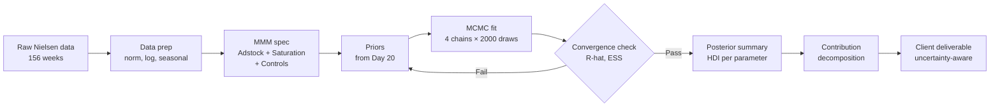

# Day 21 - Building the MMM Pipeline in Python (PyMC-Marketing)

> **Today's one idea:** PyMC-Marketing encodes the full MMM equation as a generative probabilistic model — fit it with MCMC and you get a posterior distribution over every parameter, which means every downstream decision inherits the model uncertainty rather than treating point estimates as truth.
> **Reading time:** ~35 min · **Prereqs:** Day 20, Day 4, Day 17
> **Primary source for today:** PyMC-Marketing documentation, pymc-marketing.io MMM section; Abril-Pla et al. (2023) "PyMC: A Modern and Comprehensive Probabilistic Programming Framework," *PeerJ Computer Science*.
> **Before you start:** Recall Day 20's load-bearing idea — one sentence on what a prior predictive check tests and why it matters before fitting. Write it down without looking.

---

## The Hook (2-4 min)

You have 156 weeks of Surf Excel Pakistan Nielsen data. You have set your priors (Day 20). You understand the causal structure of price, promotion, distribution, and media (Module 3). Everything up to this point has been preparation.

Now build the actual model.

By the end of today you will have a posterior distribution over 14 parameters, a weekly contribution decomposition showing what drove every week of volume, and an uncertainty band around every output. This is what you hand the client — not an Excel spreadsheet with point estimates, not a single-number ROI, but a full probabilistic account of what happened and how confident you are.

The gap between "I ran a regression" and "I built a Bayesian MMM" is not technical sophistication for its own sake. It is the difference between a model that tells you TV ROI is 2.5x and a model that tells you TV ROI is between 1.8x and 3.3x with 94% probability. The second answer is honest. The first answer is a false precision that will get you in trouble the moment someone asks "how sure are you?"

---

## Building the Intuition (10-15 min)

### The generative story

MCMC does something conceptually simple: it proposes thousands of parameter sets — (lambda=0.72, K=0.65, price_elasticity=−1.9, ...) — and keeps the ones that are consistent with both the data and the priors. The posterior is the collection of surviving hypotheses, weighted by how well each one explains the data given what you believed before seeing it.

Think of it as a filter. Before seeing data you allow a wide range of plausible worlds (the prior). After seeing 156 weeks of Surf Excel volume, most of those worlds are ruled out. The ones that remain — the posterior — are the only hypotheses you should be making decisions from.

```
Prior beliefs          Data                  Posterior
(Day 20 priors)   ×   (156 weeks)   →   (distribution over params)

lambda ~ Beta(3,1)     tv_spend[t]           lambda ~ peaked near 0.7
elasticity ~ N(-1,0.5) volume[t]             elasticity ~ peaked near -1.4
```

### Why MCMC, not OLS

OLS finds one parameter set — the one that minimises squared errors. MCMC finds the distribution of parameter sets consistent with data and priors. For a point estimate the two are close (under flat priors, the posterior mode equals the OLS estimate). But for decision-making under uncertainty, the distribution is more valuable.

| Question | OLS answer | Bayesian answer |
|---|---|---|
| What is TV ROI? | 2.5x | 94% HDI: [1.8x, 3.3x] |
| Should we increase TV budget? | "Yes, ROI > 1" | "Yes — 89% probability ROI exceeds 2x threshold" |
| Are TV and digital synergistic? | Collinearity makes this unreliable | Posterior correlation of their betas tells you directly |

### Convergence: the R-hat statistic

MCMC runs multiple independent chains from different starting points. If the chains all end up sampling from the same distribution, they have *converged* — they have all found the same posterior. R-hat measures this:

```
        Variance between chains
R-hat = ─────────────────────────
        Variance within chains
```

- R-hat = 1.00 → perfect convergence (chains are identical)
- R-hat < 1.01 → acceptable
- R-hat > 1.05 → investigate
- R-hat > 1.1 → the posterior is unreliable; do not report results

When R-hat is large, it usually means one of two things: (1) the chains started in different places and have not had enough iterations to explore the posterior fully, or (2) the posterior has multiple modes and the chains are stuck in different basins. The fix for (1) is more draws. The fix for (2) is better priors or model reparameterisation.

### What the pipeline produces



---

## The Formal Picture (10-15 min)

The MMM generative model for log-volume at week $t$:

```math
\log V_t = \alpha + \sum_m \beta_m \cdot h\!\left(A_m(t)\right) + \sum_k \gamma_k x_{k,t} + \varepsilon_t
```

where:

- $\alpha$ — baseline intercept (log-volume with no marketing activity)
- $A_m(t)$ — adstocked media spend for channel $m$ at week $t$ (geometric adstock from Day 4)
- $h(\cdot)$ — Hill/logistic saturation function (Day 4); maps adstocked spend to a [0,1] response
- $\beta_m$ — media channel coefficient; posterior over this is the key uncertainty
- $x_{k,t}$ — control variables: log price, promotion depth, weighted distribution, seasonality
- $\gamma_k$ — control coefficients
- $\varepsilon_t \sim \mathcal{N}(0, \sigma)$ — observation noise

Every Greek letter above is a random variable with a prior and a posterior. MCMC gives you the full posterior joint distribution — not just marginals, but correlations between parameters.

---

### Step 1 — Data preparation

```python
import pandas as pd
import numpy as np

df = pd.read_csv("surf_excel_pakistan_weekly.csv", parse_dates=["week"])
df = df.sort_values("week").reset_index(drop=True)

# Normalise media spend to [0, 1] — required for Hill saturation stability
for col in ["tv_spend", "digital_spend"]:
    df[f"{col}_norm"] = df[col] / df[col].max()

# Log-transform volume and price index
df["log_volume"] = np.log(df["volume"])
df["log_price"] = np.log(df["price_index"])

# Annual seasonality regressor (one sine cycle per 52 weeks)
df["seasonality"] = np.sin(2 * np.pi * df.index / 52)
```

**Why normalise media?** The Hill saturation parameter $K$ (the half-saturation point) lives on the same scale as the input. Normalising to [0,1] means $K \in (0, 1)$ and a $\text{Beta}$ prior is natural. Without normalisation $K$ could be in millions of rupees and priors become hard to set.

**Why log-volume?** It converts a multiplicative model (elasticities) to an additive one, stabilises variance, and gives coefficients a direct log-log elasticity interpretation for price.

---

### Step 2 — Model specification

```python
import pymc as pm
import pymc_marketing as pmm
from pymc_marketing.mmm import MMM, GeometricAdstock, LogisticSaturation

mmm = MMM(
    adstock=GeometricAdstock(l_max=8),        # max 8-week carryover window
    saturation=LogisticSaturation(),
    date_column="week",
    channel_columns=["tv_spend_norm", "digital_spend_norm"],
    control_columns=["log_price", "promotion_depth", "wd", "seasonality"],
)

X = df[["tv_spend_norm", "digital_spend_norm",
        "log_price", "promotion_depth", "wd", "seasonality"]]
y = df["log_volume"]
```

`l_max=8` means the adstock window is truncated at 8 weeks. Beyond 8 weeks the contribution is negligible for most FMCG categories. For durables or pharma you would extend this.

`LogisticSaturation` is the Hill function with $\alpha=1$ (the logistic special case). If you want the full Hill flexibility, use `HillSaturation` and the alpha exponent becomes an additional parameter to estimate.

---

### Step 3 — Fit

```python
idata = mmm.fit(
    X=X,
    y=y,
    target_accept=0.9,   # NUTS step-size tuning; 0.9 is appropriate for complex models
    draws=2000,           # posterior samples per chain
    chains=4,             # independent chains for R-hat computation
    random_seed=42,
)
```

`target_accept=0.9` tells the NUTS sampler to accept 90% of proposals during tuning. Higher values mean smaller step sizes and slower but more careful exploration. For MMM models with correlated adstock and saturation parameters, values below 0.85 often produce divergences.

The fit will take 5–20 minutes depending on hardware. You will see a progress bar per chain. Divergences reported during sampling (not tuning) are a warning sign — more than 1% divergences means the geometry is problematic.

---

### Step 4 — Convergence check

```python
import arviz as az

rhat = az.rhat(idata)
ess  = az.ess(idata)

max_rhat = float(rhat.to_array().max())
min_ess  = float(ess.to_array().min())

print(f"Max R-hat : {max_rhat:.3f}  (target: < 1.01)")
print(f"Min ESS   : {min_ess:.0f}   (target: > 400)")

# Identify which parameters are problematic
rhat_df = rhat.to_dataframe().reset_index()
print(rhat_df[rhat_df["values"] > 1.01])
```

**ESS** (Effective Sample Size) accounts for autocorrelation within chains. 4 chains × 2000 draws = 8000 raw samples, but if chains are autocorrelated, the effective count is lower. ESS < 400 means your uncertainty estimates on that parameter are unreliable.

---

### Step 5 — Posterior summary

```python
summary = az.summary(
    idata,
    var_names=["beta_channel", "lam", "intercept", "sigma"],
    hdi_prob=0.94,   # 94% HDI is conventional in Bayesian MMM; avoids false precision of 95%
)
print(summary[["mean", "sd", "hdi_3%", "hdi_97%", "r_hat"]])
```

For skewed posteriors — common for positive-only parameters like ROI or adstock decay — report the **median** and HDI rather than the mean. The mean is pulled by the tail and overstates central tendency.

Example output interpretation:

```
                   mean    sd  hdi_3%  hdi_97%  r_hat
beta_channel[tv]   0.18  0.04    0.11     0.26   1.003
beta_channel[dgt]  0.09  0.03    0.04     0.15   1.001
lam[tv]            0.71  0.09    0.54     0.88   1.007
intercept         10.42  0.12   10.19    10.65   1.000
sigma              0.08  0.01    0.06     0.10   1.002
```

TV beta of 0.18 (HDI: 0.11–0.26) means a 1-unit increase in normalised TV adstock raises log-volume by 0.11 to 0.26 — a 12–30% volume lift — with 94% probability.

---

### Step 6 — Contribution decomposition

```python
contributions = mmm.get_mean_contributions_over_time(original_scale=True)
# Returns: DataFrame of shape (156, n_components)
# Columns: base, tv_spend_norm, digital_spend_norm, log_price, promotion_depth, wd, seasonality

import matplotlib.pyplot as plt

contributions.plot.area(
    stacked=True,
    figsize=(14, 5),
    colormap="Set2",
    alpha=0.85,
)
plt.title("Surf Excel Pakistan — Weekly Volume Decomposition")
plt.ylabel("Volume (units)")
plt.xlabel("Week")
plt.tight_layout()
plt.savefig("surf_excel_decomposition.png", dpi=150)
```

This chart is the primary client deliverable. Every week's volume is attributed to its drivers. The base (intercept + long-run equity) is usually 60–75% for established FMCG brands. Media typically contributes 10–20%. Price and promotion make up the remainder.

To add uncertainty bands to the decomposition:

```python
# Posterior predictive samples for total volume
ppc = mmm.sample_posterior_predictive(X=X, extend_idata=True)

# 94% HDI band on total predicted volume
hdi_bounds = az.hdi(ppc, hdi_prob=0.94)["obs_var"]  # shape: (156, 2)
```

---

## Where It Breaks / What It Is Not (3-5 min)

**"draws=2000 is always enough."**
For models with many correlated parameters — especially when adstock lambda and saturation K are both being estimated for the same channel — 2000 draws may give ESS < 400 for those parameters. Always check ESS after fitting. If ESS is low, increase draws or consider fixing one parameter (e.g., fix lambda from a prior elicitation study and estimate only K).

**"PyMC-Marketing solves endogeneity."**
PyMC-Marketing handles priors, uncertainty propagation, and the generative model. It does not solve the endogeneity problem from Days 13–17. A model that has converged beautifully (R-hat=1.000, ESS=6000) but has endogenous price will give you a precisely wrong price elasticity. Bayesian inference is not a substitute for causal identification — it is a complement to it.

**"Report the posterior mean."**
For symmetric, roughly Gaussian posteriors (intercept, sigma) the mean is fine. For skewed posteriors — adstock decay lambda near 0 or 1, saturation parameters, ROI — report the median. The PyMC-Marketing `summary` function gives you both; use `hdi_prob=0.94` and report median + HDI as a triple: `0.71 [0.54, 0.88]`.

**"I can add as many control variables as I want."**
Each control variable consumes degrees of freedom and may correlate with media variables, inflating posterior uncertainty on betas. For 156 weeks of data, 6–8 regressors plus 2 media channels is near the practical limit before posteriors become very wide. Prioritise controls that are causally justified (from your DAG, Day 13).

---

## Try It Yourself (5-10 min)

**Exercise 1 — Retrieval**

Close the page. Answer cold:

1. What does the R-hat statistic measure?
2. What value indicates convergence failure, and what are two likely causes?
3. Why is ESS lower than the raw sample count?

<details><summary>Reference answer</summary>

R-hat measures the ratio of between-chain variance to within-chain variance across 4 (or more) MCMC chains. A value of 1.00 means chains are sampling identically. R-hat > 1.01 is worth investigating; R-hat > 1.1 indicates convergence failure — the posterior estimate is unreliable.

Two likely causes of high R-hat:
1. **Insufficient iterations** — chains started in different regions and have not had enough draws to explore and mix. Fix: increase `draws` or `tune`.
2. **Multimodal posterior** — chains are stuck in different modes (e.g., two plausible adstock decay rates that both fit the data). Fix: tighten priors, reparameterise, or use initialisation closer to the true mode.

ESS is lower than raw sample count because consecutive MCMC draws are autocorrelated — each draw partially depends on the previous one, so they carry less independent information than truly independent samples would.

</details>

---

**Exercise 2 — Application**

The TV adstock posterior is: mean = 0.71, sd = 0.09, HDI = [0.54, 0.88].

(a) Write a one-sentence business statement about TV carryover duration, suitable for a client slide, using the HDI.

(b) The mean lag of geometric adstock is $\bar{L} = \lambda / (1 - \lambda)$. Calculate the mean lag at the posterior mean.

(c) Calculate the mean lag at the HDI lower bound (lambda = 0.54). What does this range tell you about planning horizon uncertainty?

<details><summary>Reference answer</summary>

**(a)** "TV advertising for Surf Excel Pakistan carries over into subsequent weeks with a decay rate of 0.71 on average — meaning 71% of the prior week's effect persists — though the data are consistent with rates anywhere from 0.54 to 0.88 (94% probability), indicating meaningful uncertainty about how long TV effects last."

**(b)** At lambda = 0.71: $\bar{L} = 0.71 / (1 - 0.71) = 0.71 / 0.29 \approx 2.45$ weeks. Roughly 2.5 weeks average carryover.

**(c)** At lambda = 0.54: $\bar{L} = 0.54 / (1 - 0.54) = 0.54 / 0.46 \approx 1.17$ weeks.

The mean lag ranges from 1.2 to 7.3 weeks across the 94% HDI (upper: $0.88 / 0.12 = 7.3$). This is a sixfold range. For media planning this matters enormously — if lambda is truly 0.88, you need to plan campaigns 7+ weeks before peak demand; if 0.54, 1–2 weeks is sufficient. The posterior tells you to hedge your planning horizon, not commit to a single number.

</details>

---

**Exercise 3 — Stretch (Days 4 and 17)**

The price posterior from your PyMC-Marketing model has mean = −1.2, HDI = [−1.8, −0.6]. The IV estimate from Day 17 (using palm oil as an instrument for Surf Excel price) was −2.1.

(a) What does the gap between −1.2 and −2.1 tell you about the OLS/Bayesian estimate?

(b) Should you adjust the price prior before refitting? If so, to what centre and width?

(c) What is the risk of simply accepting the Bayesian posterior of −1.2 and reporting it to the client?

<details><summary>Reference answer</summary>

**(a)** The gap is consistent with upward bias in the Bayesian estimate (recall Day 17: endogenous price causes OLS-family estimators to underestimate the magnitude of price elasticity). When volume falls, brands often cut price to stimulate demand — this negative correlation between price and the error term pushes the estimated elasticity toward zero. A posterior of −1.2 when the IV says −2.1 suggests the Bayesian model is absorbing some of that simultaneity bias despite good priors.

**(b)** Yes, adjust. Use the IV estimate as the centre of a tighter prior: `elasticity_price ~ Normal(mu=-2.1, sigma=0.4)`. The width of 0.4 is chosen to encompass the IV confidence interval while being narrower than the default; this regularises the estimate toward the causally identified value. Do not set sigma=0.1 (too dogmatic — ignores model uncertainty) or sigma=1.5 (too wide — barely different from the original prior).

**(c)** The risk is reporting a price elasticity that is biased toward zero, which will: (1) understate the volume response to price increases, making price rises look safer than they are; (2) understate break-even price changes (Day 5 formula), leading to suboptimal pricing recommendations; (3) give the client false confidence in a number that has not been causally identified. The correct approach is to use the IV estimate to set a stronger prior or to run the IV correction directly (2SLS with log-price instrumented) before fitting the Bayesian MMM.

</details>

> **Transfer:** In your FMCG category, which channel's posterior — TV, digital, or in-store promotions — do you expect will have the widest HDI, and why? Write one concrete sentence connecting posterior width to a data feature of that channel.

---

## Connect It Back

Yesterday (Day 20) you learned that prior predictive checks test whether your generative model can produce data that looks like real data *before* seeing it — catching absurd parameter combinations early and saving you from fitting a misspecified model. Today you saw that investment pay off: the priors you set yesterday are the priors that guided MCMC sampling today, narrowing the posterior toward realistic regions and improving mixing.

Tomorrow (Day 22) you will validate the fitted model — checking whether it actually explains held-out data, whether the residuals are well-behaved, and whether the contribution decomposition passes a smell test against brand team intuition.

**Sharp question you can now answer:** You run the pipeline and get R-hat = 1.23 for the TV adstock lambda parameter. Name the two most likely causes and describe one diagnostic step you would take to determine which cause it is.

---

## Suggested Readings for Today

**Required (15 min):**
PyMC-Marketing MMM quickstart, pymc-marketing.io/en/stable/notebooks/mmm/mmm_example.html — walk through the example notebook focusing on the `fit()` call, convergence diagnostics, and `get_mean_contributions_over_time()`. Ignore the budget optimisation section (Day 25).

**Deep version:**

1. Abril-Pla et al. (2023), Section 3 "Inference" and Section 5 "Case Studies" — explains NUTS (the sampler underlying PyMC), R-hat computation, and ESS in the context of real probabilistic models; directly applicable to understanding what `mmm.fit()` is doing under the hood.

2. Vehtari et al. (2021) "Rank-normalization, folding, and localization: An improved R-hat" — *Bayesian Analysis* 16(2). The R-hat formula in today's formal section is the classic version; this paper introduces the improved rank-based R-hat that PyMC uses by default. Read the abstract and Section 2 to understand why the rank-based version catches pathological chains that the classic version misses.

3. Jin et al. (2017) "Bayesian Methods for Media Mix Modeling with Carryover and Shape Effects" — Google whitepaper available on arXiv. This is the intellectual precursor to PyMC-Marketing's MMM module. Section 3 (geometric adstock) and Section 4 (Hill saturation) map directly to `GeometricAdstock` and `LogisticSaturation` classes you used today.

---

## Navigation

← Previous: [Day 20 - Bayesian Priors for MMM](./day-20-bayesian-priors.md)

→ Next: [Day 22 - Model Validation](./day-22-model-validation.md)
