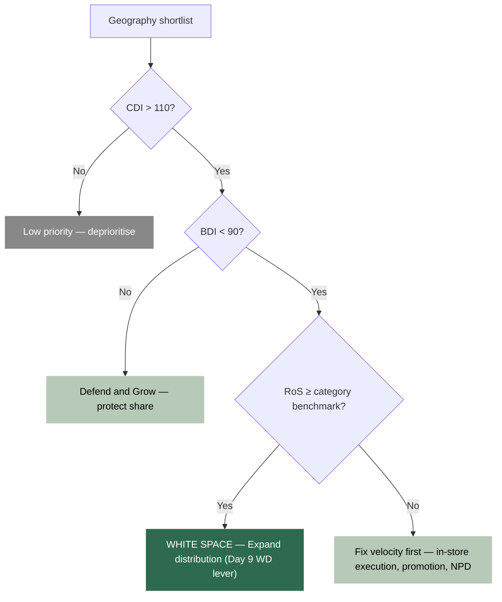

# Day 23 — Competitor Analysis, Portfolio Cross-Elasticity and White Space

> **Today's one idea:** Cross-price elasticity extends the MMM in two directions simultaneously — outward to competitors (how Ariel's price moves Surf Excel demand) and inward to your own portfolio (how the sachet cannibalises the 1 kg box) — and white space analysis combines CDI/BDI with RoS benchmarking to produce a ranked list of investable growth opportunities.
> **Reading time:** ~35 min · **Prereqs:** Day 7 (price elasticity), Day 9 (distribution / RoS / CDI), Day 10 (pack / portfolio price architecture), Day 17 (IV for price endogeneity)
> **Primary source for today:** Charan, A. *The Marketing Analytics Practitioner's Guide* — "Competitive and Portfolio Analytics" chapters.
> **Before you start:** Recall Day 22's load-bearing idea — in one sentence, what is the difference between statistical fit and causal validity in MMM validation, and why can a model score well on one while failing the other?

---

## The Hook (2–4 min)

Surf Excel Pakistan volume share is up 1.2 points. The brand manager is celebrating. The category manager is worried: total laundry category volume is flat this quarter.

The brand grew — but entirely at Ariel's expense. Zero new consumers entered the laundry category. Zero incremental volume was created for the trade. For the brand manager it is a win. For the category P&L it is neutral. For Unilever it depends entirely on which brand they would rather win the zero-sum share battle.

Now add a second scenario: Surf Excel's sachet distribution has expanded aggressively. Sachet volume is up 18%. But the 1 kg box — the highest-margin SKU — is down 11%. Net revenue is flat. Net margin is slightly negative.

Both of these scenarios involve identical MMM data — the same price, volume, and distribution series — but they ask fundamentally different questions. The first question is *competitive*: what is the elasticity relationship between my brand and the competitor? The second is *portfolio*: am I growing the right SKUs, or am I financing cannibalisation with trade spend?

The third question is the one that makes both of these actionable: *where* should you invest to avoid both traps? That is the white space question.

Today you learn to answer all three.

---

## Building the Intuition (10–15 min)

### Three lenses, one framework

Think of your brand's volume as determined by three prices simultaneously:

```
Your brand volume
    ↑
    ├── Your own price (own-price elasticity — Day 7)
    ├── Competitor's price (cross-price elasticity — TODAY, outward)
    └── Your own other SKU's price (cross-price elasticity — TODAY, inward)
```

The first you already estimated. Today you add the other two.

### 1. Competitor cross-price elasticity — the substitution question

When Ariel raises its shelf price by 10%, some Ariel buyers defect. Where do they go? If laundry is a functional category with low brand lock-in, they switch to the cheapest acceptable substitute. If Surf Excel is that substitute, Surf Excel gains volume. The cross-price elasticity quantifies exactly how much.

```math
\eta_{\text{Surf, Ariel}} = \frac{\partial \ln V_{\text{Surf}}}{\partial \ln P_{\text{Ariel}}}
```

- **Positive cross-price elasticity** → substitutes. Ariel price up = Surf Excel volume up.
- **Near-zero** → the brands serve different segments or occasions. Ariel's price moves don't reach Surf Excel buyers.
- **Negative** → complements (rare in laundry; common in categories like coffee + creamer).

The insight is that *competitive pricing is a lever you can model*, not just something that shows up as unexplained residual. Adding `log_price_ariel` to the MMM equation lets you estimate the elasticity and decompose volume changes cleanly.

### 2. Own-portfolio cross-price elasticity — the cannibalisation question

The same logic applies within your own SKU lineup. If the sachet and the 1 kg box compete for the same consumer on the same occasion (weekly family wash), they are substitutes. Reducing the sachet price will pull volume from the box, not grow total category volume.

The substitution matrix organises all the within-portfolio elasticities in one place:

| | Sachet price ↑ | 500g price ↑ | 1 kg price ↑ |
|---|---|---|---|
| **Sachet volume** | own (−) | cross | cross |
| **500g volume** | cross | own (−) | cross |
| **1 kg volume** | cross | cross | own (−) |

Diagonal = own-price elasticity (always negative for normal goods).
Off-diagonal = cross-price elasticities. Positive entries are cannibalisation candidates.

**Critical distinction:** positive cross-price elasticity is not always harmful.

- Sachet and 1 kg competing on the *same weekly-shop occasion* → cannibalisation. Bad.
- Sachet used for travel/gym, 1 kg used at home → different occasions, different consumers, low actual overlap. A positive cross-elasticity estimate here may simply reflect a shared price trend in the data, not a real substitution mechanism. [Recall Day 15: correlation in the data does not imply the structural causal path you think it does.]

Validate which regime you are in with Kantar occasion data before acting on the matrix.

### 3. White space — the geography question

Picture a map of Pakistan's cities. Colour each city by two variables:

- **CDI (Category Development Index):** how over- or under-indexed that city is for total laundry category spending, relative to its population share. CDI > 100 means laundry buyers are proportionally more active there than the national average.
- **BDI (Brand Development Index):** same calculation, but for Surf Excel specifically.

```
CDI > 110, BDI > 110  →  Defend and Grow   (your stronghold)
CDI > 110, BDI < 90   →  WHITE SPACE        (category demand exists; you are absent)
CDI < 90,  BDI > 110  →  Brand strength in weak category (watch efficiency)
CDI < 90,  BDI < 90   →  Low priority
```

White space is the highest-quality expansion opportunity *in principle* because the demand already exists — category buyers are active, but they are buying Ariel, Persil, or local brands. You do not need to create the habit. You need to intercept an existing one.

But white space is only investable if your in-store execution can convert the opportunity. That is where RoS re-enters. [Day 9: Rate of Sale = volume sold per SKU per store per week.] A white-space geography with RoS well below the category benchmark means your product is listed but dying on the shelf. Expanding distribution there before fixing velocity is burning trade investment for share-of-nothing.

The decision rule:

```
White space + RoS ≥ category benchmark  →  Expand distribution now
White space + RoS < category benchmark  →  Fix velocity first, then expand
```

---

## The Formal Picture (10–15 min)

### Extending the MMM equation

The full log-linear specification with competitor and portfolio cross-elasticities:

```math
\ln V_{A,t} = \alpha
  + \beta_{\text{own}} \ln P_{A,t}
  + \beta_{\text{cross,comp}} \ln P_{B,t}
  + \beta_{\text{cross,sku}} \ln P_{A2,t}
  + \beta_{\text{adstock}} \text{TV\_adstock}_{A,t}
  + \beta_{\text{promo}} \text{Promo}_{A,t}
  + \beta_{\text{wd}} \ln \text{WD}_{A,t}
  + \gamma_t + \varepsilon_t
```

Where:
- $V_{A,t}$: Surf Excel volume at time $t$
- $P_{A,t}$: Surf Excel average selling price
- $P_{B,t}$: Ariel average selling price (competitor)
- $P_{A2,t}$: Surf Excel sachet average selling price (own-portfolio sibling)
- $\gamma_t$: seasonality controls
- All $\beta$ parameters are elasticities in log-log form

### Python: competitor cross-price elasticity

```python
import statsmodels.formula.api as smf

model_competitor = smf.ols(
    "log_volume_surf ~ log_price_surf + log_price_ariel + "
    "tv_adstock_surf + promotion_surf + log_wd_surf + seasonality",
    data=df
).fit()

own_elast = model_competitor.params["log_price_surf"]
cross_elast = model_competitor.params["log_price_ariel"]

print(f"Own-price elasticity:                    {own_elast:.2f}")
print(f"Cross-price elasticity (Ariel → Surf):   {cross_elast:.2f}")
# Expected: own_elast negative, cross_elast positive for substitutes
```

**Identification caveat — multicollinearity.** Ariel and Surf Excel prices often co-move: shared input costs (surfactants, palm oil), retailer promotional calendars that affect all laundry brands simultaneously, and currency shocks all create correlated price series. Check the VIF:

```python
from statsmodels.stats.outliers_influence import variance_inflation_factor
import pandas as pd

X = df[["log_price_surf", "log_price_ariel", "tv_adstock_surf",
        "promotion_surf", "log_wd_surf", "seasonality"]]
X_const = sm.add_constant(X)

vif_df = pd.DataFrame({
    "feature": X.columns,
    "VIF": [variance_inflation_factor(X_const.values, i+1) for i in range(X.shape[1])]
})
print(vif_df)
# VIF > 10 on log_price_ariel → use IV
```

If VIF on `log_price_ariel` exceeds 10, instrument it. The palm oil cost index (Day 17's instrument for Surf Excel's own price) is a valid instrument for Ariel's price too — both brands share input costs but serve different consumer segments, so the instrument affects Ariel price through cost but does not affect Surf Excel demand through any other path.

```python
from linearmodels.iv import IV2SLS

iv_model = IV2SLS.from_formula(
    "log_volume_surf ~ 1 + log_price_surf + tv_adstock_surf + "
    "promotion_surf + log_wd_surf + seasonality + "
    "[log_price_ariel ~ palm_oil_index_ariel_cost]",
    data=df
).fit(cov_type="robust")

print(iv_model.summary)
```

### Python: own-portfolio substitution matrix

```python
skus = ["surf_sachet", "surf_500g", "surf_1kg"]
matrix = {}

for target_sku in skus:
    other_skus = [s for s in skus if s != target_sku]
    formula = (
        f"log_vol_{target_sku} ~ log_price_{target_sku} + "
        + " + ".join(f"log_price_{s}" for s in other_skus)
        + " + log_wd + seasonality"
    )
    m = smf.ols(formula, data=df).fit()
    matrix[target_sku] = {
        s: round(m.params.get(f"log_price_{s}", 0), 3)
        for s in other_skus
    }

import pandas as pd
sub_matrix = pd.DataFrame(matrix)
print("Own-portfolio cross-price elasticity matrix:")
print(sub_matrix)
# Positive off-diagonal entries = potential cannibalisation
# Validate with Kantar occasion data before acting
```

**Portfolio price-per-use audit.** [Day 10 rule: SKUs within 8% of each other on price-per-use will cannibalise.] Surface the conflicts:

```python
def ppu_audit(sku_df: pd.DataFrame) -> pd.DataFrame:
    """
    sku_df columns: sku (str), ppu (float, price per use in local currency)
    Returns pairs of SKUs with PPU gap < 8% — rationalisation candidates.
    """
    flags = []
    for i, a in sku_df.iterrows():
        for j, b in sku_df.iterrows():
            if i >= j:
                continue
            gap = abs(a["ppu"] - b["ppu"]) / a["ppu"]
            if gap < 0.08:
                flags.append({
                    "sku_a": a["sku"],
                    "sku_b": b["sku"],
                    "ppu_gap_pct": round(gap * 100, 1),
                    "action": "RATIONALISE or REPRICE",
                })
    return pd.DataFrame(flags)
```

### Python: CDI/BDI white space grid

```python
def white_space_analysis(
    df: pd.DataFrame,
    brand_col: str,   # Surf Excel volume by geography
    category_col: str,  # total laundry volume by geography
    pop_col: str,       # population by geography
) -> pd.DataFrame:
    """
    Returns df sorted by CDI descending, with opportunity quadrant labels.
    """
    df = df.copy()
    df["bdi"] = (
        (df[brand_col] / df[brand_col].sum())
        / (df[pop_col] / df[pop_col].sum())
        * 100
    )
    df["cdi"] = (
        (df[category_col] / df[category_col].sum())
        / (df[pop_col] / df[pop_col].sum())
        * 100
    )

    df["opportunity"] = "Watch"
    df.loc[(df["cdi"] > 110) & (df["bdi"] < 90), "opportunity"] = "WHITE SPACE"
    df.loc[(df["cdi"] > 110) & (df["bdi"] > 110), "opportunity"] = "Defend and Grow"
    df.loc[(df["cdi"] < 90)  & (df["bdi"] > 110), "opportunity"] = "Brand strength, weak category"

    return df.sort_values("cdi", ascending=False)
```

**Linking white space to RoS.** After running `white_space_analysis`, merge in the RoS benchmark from Day 9 to add the decision tier:

```python
# ros_df: columns = [geo, ros_surf, ros_category_benchmark]
result = white_space_analysis(geo_df, "surf_vol", "category_vol", "population")
result = result.merge(ros_df, on="geo")

result["decision"] = "Low priority"
result.loc[
    (result["opportunity"] == "WHITE SPACE") &
    (result["ros_surf"] >= result["ros_category_benchmark"]),
    "decision"
] = "Expand distribution NOW"
result.loc[
    (result["opportunity"] == "WHITE SPACE") &
    (result["ros_surf"] < result["ros_category_benchmark"]),
    "decision"
] = "Fix velocity first"

print(result[["geo", "cdi", "bdi", "ros_surf", "opportunity", "decision"]]
      .head(10))
```

### The full decision flow



---

## Where It Breaks / What It Is Not (3–5 min)

**1. "Any positive own-portfolio cross-elasticity means cannibalisation."**
Not necessarily. A positive cross-price elasticity between the sachet and the 1 kg box could reflect a genuine substitution mechanism — or it could reflect a shared pricing trend in the data (both prices fell during Ramadan promotions, and both volumes rose because of seasonality). Validate using Kantar occasion-level data: if the sachet is used predominantly for travel and the 1 kg box for the weekly home wash, the cross-elasticity is noise, not cannibalisation. [Day 15: identifying causal structure requires more than a statistically significant coefficient.]

**2. "White space geographies are automatically the best places to invest."**
Only if your in-store execution can convert. High CDI, low BDI, and low RoS means consumers are buying detergent — but not yours, and when your product is stocked it doesn't sell. Adding more distribution here accelerates losses in the trade, damages retailer relationships, and burns A&P budget. The RoS gate must clear before distribution expansion is funded.

**3. "The substitution matrix can be estimated with standard OLS across all SKUs simultaneously."**
The OLS approach runs separate equations per SKU. This ignores the cross-equation error correlation — Seemingly Unrelated Regression (SUR) would be more efficient because the disturbances from the sachet equation and the 1 kg equation share common shocks (a bad batch, a supply chain disruption, a category-wide promotion). In practice, OLS per equation is acceptable for getting the elasticity signs and rough magnitudes; use SUR if you need tight standard errors for investment sizing.

**4. "A positive competitor cross-price elasticity means you should wait for Ariel to raise prices."**
The cross-price elasticity tells you what happens when Ariel moves — it says nothing about whether you can influence Ariel's price. You cannot. It is an uncontrollable variable in your MMM. Its value is in scenario planning ("if input cost inflation forces a category-wide price rise, Surf Excel gains X units") and in not misattributing volume changes to your own actions when they were actually caused by competitor moves.

---

## Try It Yourself (5–10 min)

**Exercise 1 — Retrieval**

Close this page. Write down, from memory, the three analyses covered today. For each one, state: (a) what it measures, (b) the expected sign of the key parameter, and (c) one identification or action caveat. Do not open the page until you have written all three.

<details>
<summary>Reference answer</summary>

**Competitor cross-price elasticity:** measures how Surf Excel volume responds to Ariel's price change. Expected sign: positive (substitutes — Ariel price up, Surf Excel volume up). Caveat: Ariel and Surf Excel prices co-move due to shared input costs; check VIF > 10 and use IV (palm oil cost index) if needed.

**Own-portfolio cross-price elasticity:** measures how one Surf Excel SKU's volume responds to a sibling SKU's price change. Expected sign: positive if substitutes (cannibalisation), near-zero if different occasions. Caveat: a statistically significant positive cross-elasticity may be a shared pricing trend, not structural substitution — validate with Kantar occasion data before acting.

**White space analysis (CDI/BDI):** identifies geographies where category demand is high (CDI > 110) but brand presence is low (BDI < 90). Expected output: ranked opportunity list. Caveat: white space is only investable if RoS meets the category benchmark; if not, fix velocity before expanding distribution.

</details>

---

**Exercise 2 — Direct application**

Surf Excel's cross-price elasticity with Ariel is estimated at +0.42. Current Surf Excel volume: 420,000 units per week. Ariel announces a 8% shelf price increase, effective next month.

1. Estimate the expected Surf Excel volume gain in units per week.
2. Is this gain category-incremental (new consumers entering laundry) or zero-sum (Ariel consumers switching)?
3. What one data source would you use to confirm which it is?

<details>
<summary>Reference answer</summary>

**1. Volume gain estimate:**

```math
\Delta \ln V_{\text{Surf}} = \eta_{\text{Surf, Ariel}} \times \Delta \ln P_{\text{Ariel}}
= 0.42 \times \ln(1.08)
= 0.42 \times 0.0770
= 0.0323
```

```math
\Delta V_{\text{Surf}} \approx 420{,}000 \times 0.0323 = \mathbf{13{,}565 \text{ units/week}}
```

**2. Zero-sum vs. incremental:** This is almost certainly zero-sum. A positive cross-price elasticity between two laundry detergent brands means consumers are substituting between brands within an existing laundry habit — not creating new laundry occasions or new category entrants. If the category volume is flat while Surf Excel gains ~14k units, those units came from Ariel.

**3. Confirmation data source:** Nielsen Category Tracking — compare total laundry category volume before and after the Ariel price increase. If category volume is unchanged and Surf Excel gains, it is zero-sum. Additionally, Kantar Brand Health panel data can show whether Surf Excel's new buyers are lapsed Surf Excel users returning (brand switching) or genuinely new-to-category.

</details>

---

**Exercise 3 — Stretch (callbacks: Day 9, Day 10)**

White space analysis for Lahore returns: CDI = 128, Surf Excel BDI = 71. Surf Excel RoS in Lahore = 175 units/store/week. Category RoS benchmark for laundry in Lahore = 340 units/store/week.

The portfolio substitution matrix shows that Surf Excel 500g has a cross-price elasticity of +0.31 with the sachet in Lahore — the only geography where this is positive and significant.

1. Based on the white space + RoS framework, what is the correct first action: expand distribution or fix velocity?
2. The cross-price elasticity on the 500g in Lahore is suspicious. Name two alternative explanations besides genuine cannibalisation, drawing on Day 9 and Day 10 concepts.
3. Write the two-sentence decision memo you would give to the Lahore regional team.

<details>
<summary>Reference answer</summary>

**1. Fix velocity first.** Lahore is white space (CDI 128, BDI 71 — category strong, Surf Excel under-indexed). But RoS is 175 vs. benchmark 340 — Surf Excel is present in stores but converting at roughly half the expected rate. Expanding distribution before the velocity problem is diagnosed means funding shelf presence that isn't selling. The Day 9 decision rule is clear: white space + RoS < benchmark = fix in-store performance first.

**2. Alternative explanations for the +0.31 cross-elasticity in Lahore:**

- **Shared promotional calendar (Day 9 / trade promotion):** if sachets and 500g packs are both promoted heavily during Eid in Lahore but not in other geographies, both price series drop together and both volumes rise together. The OLS estimator picks up a spurious positive relationship from the co-movement, not a real substitution mechanism.
- **Pack architecture overlap (Day 10 PPU rule):** if the sachet PPU in Lahore (where sachet pack sizes differ from national average) is within 8% of the 500g PPU, the two SKUs are occupying the same price-per-use tier in this market. Consumers are genuinely indifferent between them — which looks like cannibalisation in the data but is actually a portfolio design problem, not a demand-side substitution.

**3. Decision memo:** "Lahore represents a genuine distribution opportunity (CDI 128, BDI 71), but current in-store velocity is at 51% of category benchmark — expanding SKU count before resolving this will dilute retailer confidence and waste trade investment. Recommend: (a) diagnose the velocity gap via RoS decomposition by retailer and SKU format; (b) run a velocity improvement pilot (shelf placement, POS activation, in-store promotion) for 8 weeks; (c) reassess distribution expansion only after Lahore RoS reaches ≥ 85% of the category benchmark."

</details>

---

> **Transfer — apply it:** In your domain, identify one situation where you have two competing products or channels serving the same customer segment — write one sentence stating what the cross-price elasticity sign would be, what data you would need to estimate it, and what the positive result would force you to do differently.

---

## Connect It Back

Day 22 established the difference between a model that fits the data and a model that captures causal structure — and the arsenal of tests (Shapley decomposition, posterior predictive checks, elasticity sense checks, hold-out validation) for distinguishing between them. Today's three analyses are precisely the kind of structural extensions that either pass or fail those sense checks: a positive competitor cross-price elasticity for a substitute brand should show up consistently across geographies and time periods; an implausible negative sign is a red flag that something is wrong with identification. The white space analysis lands on top of the distribution work from Day 9 and the portfolio architecture work from Day 10, converting those measurements into a ranked action list.

Tomorrow is Day 24 — the drill day for decision translation. You have now built all the analytical components of a complete MMM: causal structure, five-P decomposition, validation, competitive intelligence, and white space prioritisation. The drill takes everything from Days 20–23 and forces you to produce the actual business output: a slide-ready recommendation with a defensible ranked investment case.

**Sharp question you can now answer that you couldn't yesterday:** Your white space map flags 8 geographies. You have budget for 3 pilots. Write the ranking criteria you would use — and explain why RoS enters the ranking before CDI does.

---

## Suggested Readings for Today

**Required (15 min):** Charan, A. *The Marketing Analytics Practitioner's Guide* — "Competitive Analytics" chapter. Focus on the section on cross-elasticity estimation in scanner data contexts; the discussion of identification under correlated competitive pricing is directly relevant to today's IV section.

**Deep version:**

1. Farris, P., Bendle, N., Pfeifer, P., and Reibstein, D. *Marketing Metrics: The Manager's Guide to Measuring Marketing Performance*, 3rd ed. (Pearson, 2015) — Chapter 2, "Share of Hearts, Minds, and Markets." The CDI/BDI framework is defined precisely here, with worked retail examples. The textbook treatment makes the white space quadrant operationally precise in a way that most MMM primers omit.

2. Bell, D. R., Chiang, J., and Padmanabhan, V. "The Decomposition of Promotional Response: An Empirical Generalization." *Marketing Science*, 18(4), 504–526, 1999. Covers the decomposition of brand-level promotional volume into own-brand switching, competitive switching, and category expansion — the formal analogue of the zero-sum vs. incremental distinction in Exercise 2.

3. Zellner, A. "An Efficient Method of Estimating Seemingly Unrelated Regressions and Tests for Aggregation Bias." *Journal of the American Statistical Association*, 57(298), 348–368, 1962. The foundational SUR paper — relevant if you decide to estimate the portfolio substitution matrix jointly rather than equation by equation. Skip the proofs; read the setup section to understand when SUR efficiency gains over OLS are largest (high cross-equation error correlation, similar regressors).

---

## Navigation

← **Previous:** [Day 22 — Model Validation](./day-22-model-validation.md)
→ **Next:** [Day 24 — Drill: Decision Translation](./day-24-drill-decision-translation.md)
