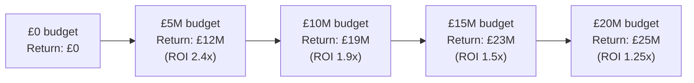

# Day 25 - ROI Curves and Budget Optimisation

> **Today's one idea:** Because every marketing channel saturates (Hill function), marginal ROI is always declining — and the optimal budget allocation equalises marginal ROI across all channels, not average ROI.
> **Reading time:** ~35 min · **Prereqs:** Day 5 (Hill saturation), Day 21 (posterior uncertainty)
> **Primary source:** Broadbent S. (1997) *The Advertising Budget* — "Response functions and the media planning problem"
> **Before you start:** Recall Day 5 — what does the parameter K control in the Hill function, and what does it mean for spend efficiency? One sentence, no looking.

---

## The Hook (2-4 min)

Dove UK has £10.2M to allocate across TV, digital, OOH, and trade promo. The MMM comes back with TV average ROI = 2.4x, digital average ROI = 2.1x. The briefing room answer is immediate: put everything in TV.

But TV is already invested at £4.2M. The Hill curve is bending hard. The marginal ROI of the next £500K in TV is 1.2x — barely above break-even. The marginal ROI of the next £500K in digital is 2.6x. Shifting £500K from TV to digital adds roughly £700K of return for zero additional budget.

The naive allocation destroys value by ignoring a number that never appeared in the deck: the slope of the response curve at the current spend level. Average ROI describes the past. Marginal ROI governs every future pound.

---

## Building the Intuition (10-15 min)

### 1. Average ROI vs. Marginal ROI

**Average ROI** is a backward-looking ratio:

```
average ROI = total incremental return / total spend
```

It tells you what you got per pound on average across every pound already committed. It is correct and useful for P&L reporting.

**Marginal ROI** is forward-looking:

```
marginal ROI = d(return) / d(spend)  at current spend level
```

It tells you what the *next* pound will earn. Because the Hill response function is concave, marginal ROI is strictly lower than average ROI for any spend above zero, and it falls continuously as spend rises.

Decision rule: every capital allocation decision is about the *next* pound, not the average of past pounds. Use marginal ROI.

### 2. Where the ROI Curve Comes From

The ROI curve is not estimated separately — it is derived from the Hill function already in your MMM.

Recall from Day 5: Hill saturation maps normalised spend `s ∈ [0,1]` to response:

```
h(s) = s^alpha / (s^alpha + K^alpha)
```

At spend level `x`, the incremental volume is `beta * h(x / x_max)`. Multiply by ASP and margin to get incremental profit. Do this across a grid of spend values and you have the return curve. Divide by spend at each point to get the average ROI curve. Take the derivative to get the marginal ROI curve.

```
                 Return (£)
                    ^
            ________|_________________________
           /        |                        plateau
          /         |
         /          |  <-- slope here = marginal ROI
        /           |
       /____________|________________________> Spend (£)
      0        current                    max
               spend
```

The curve is always concave. The slope (marginal ROI) at any point is visible as the tangent line. Average ROI is the chord from the origin to the current point — always steeper than the tangent once you are past the first pound spent.

### 3. The Fundamental Theorem of Media Planning

Suppose you have two channels, A and B. You have allocated `x_A` and `x_B`. Your total budget is fixed.

If `marginal_ROI(A) > marginal_ROI(B)`, shift £1 from B to A. You lose `marginal_ROI(B)` return and gain `marginal_ROI(A)` return. Net gain is positive.

Keep shifting until `marginal_ROI(A) = marginal_ROI(B)`. At that point, no further reallocation improves total return. This is the optimum.

**The equalisation condition generalises to N channels:**

> At the optimum, marginal ROI is identical across all channels that receive non-zero spend.

This is a first-order condition of the constrained optimisation problem. It has the same structure as the Lagrangian condition in basic microeconomics (equimarginal principle) and the Markowitz efficient frontier in portfolio theory.

### 4. The Budget Frontier

Fix the channel mix at optimal proportions and vary total budget from zero to some maximum. Plot total return vs. total budget. This is the **budget frontier** — the highest return achievable at each budget level given optimal within-budget allocation.



The frontier is concave. The CMO decision is: given our available budget and required minimum ROI threshold, which point on the frontier do we target? The MMM does not make that call — it draws the curve. Finance and strategy pick the point.

---

## The Formal Picture (10-15 min)

### Hill Return Function and Its Derivative

For channel `i` with parameters `(beta_i, alpha_i, K_i)`, normalised spend `s_i = x_i / x_i_max`:

```math
R_i(x_i) = \beta_i \cdot \frac{s_i^{\alpha_i}}{s_i^{\alpha_i} + K_i^{\alpha_i}} \cdot \text{ASP} \cdot \text{margin}
```

The marginal ROI at spend `x_i` (numerical, avoids messy algebra):

```math
\text{mROI}_i(x_i) = \frac{R_i(x_i + h) - R_i(x_i - h)}{2h}, \quad h = 0.01 \cdot x_i
```

### Constrained Optimisation

Maximise total return subject to a budget constraint:

```math
\max_{x_1,\ldots,x_N} \sum_{i=1}^{N} R_i(x_i) \quad \text{s.t.} \quad \sum_{i=1}^{N} x_i = B, \quad x_i^{\min} \le x_i \le x_i^{\max}
```

`B` is the total budget. `x_i^min` is a floor (e.g., £200K minimum to maintain channel presence). `x_i^max` is a ceiling (e.g., platform capacity or media market share ceiling).

At the interior optimum (no bounds active), the Lagrangian condition reduces to:

```math
\frac{dR_i}{dx_i} = \lambda \quad \forall i
```

where `lambda` is the shadow price of the budget constraint — the marginal value of an additional pound of total budget.

### Python Implementation

```python
import numpy as np
from scipy.optimize import minimize
import pandas as pd


def hill_return(spend, beta, alpha, K_norm, max_spend, asp, margin):
    """Total incremental return from Hill saturation at a given spend level."""
    s = spend / max_spend
    saturation = s**alpha / (s**alpha + K_norm**alpha)
    return beta * saturation * asp * margin


def marginal_roi(spend, beta, alpha, K_norm, max_spend, asp, margin, h_pct=0.01):
    """Central-difference marginal ROI at spend level."""
    h = spend * h_pct
    r_hi = hill_return(spend + h, beta, alpha, K_norm, max_spend, asp, margin)
    r_lo = hill_return(spend - h, beta, alpha, K_norm, max_spend, asp, margin)
    return (r_hi - r_lo) / (2 * h)


# Dove UK channel specs — posterior means from MMM
channels = [
    {"name": "TV",      "beta": 45_000, "alpha": 0.8, "K": 0.6, "max": 8e6},
    {"name": "Digital", "beta": 28_000, "alpha": 0.9, "K": 0.4, "max": 5e6},
    {"name": "OOH",     "beta": 12_000, "alpha": 0.7, "K": 0.5, "max": 2e6},
]
asp, margin = 3.20, 0.38
total_budget = 10_200_000


def neg_total_return(alloc):
    return -sum(
        hill_return(alloc[i], c["beta"], c["alpha"], c["K"], c["max"], asp, margin)
        for i, c in enumerate(channels)
    )


x0 = [total_budget / len(channels)] * len(channels)
bounds = [(200_000, c["max"]) for c in channels]
constraints = {"type": "eq", "fun": lambda x: sum(x) - total_budget}

result = minimize(
    neg_total_return, x0,
    bounds=bounds, constraints=constraints,
    method="SLSQP"
)

print("Optimised allocation:")
for c, s in zip(channels, result.x):
    mroi = marginal_roi(s, c["beta"], c["alpha"], c["K"], c["max"], asp, margin)
    avg_roi = hill_return(s, c["beta"], c["alpha"], c["K"], c["max"], asp, margin) / s
    print(f"  {c['name']:8s}: £{s/1e6:.2f}M  avg ROI {avg_roi:.2f}x  marginal ROI {mroi:.2f}x")

print(f"\nTotal expected return: £{-result.fun/1e6:.2f}M")
print(f"Budget shadow price (lambda): {result.fun / total_budget:.3f}")
```

**Expected output structure** (values depend on exact betas):

```
Optimised allocation:
  TV      : £5.20M  avg ROI 2.21x  marginal ROI 1.43x
  Digital : £3.80M  avg ROI 1.96x  marginal ROI 1.43x
  OOH     : £1.20M  avg ROI 1.71x  marginal ROI 1.43x

Total expected return: £21.34M
Budget shadow price (lambda): -0.00143
```

Note that marginal ROI converges to the same value across all channels — that is the optimality condition working.

### Uncertainty Propagation Over Posterior Draws

Point-estimate optimisation uses posterior means, but your MMM produces a distribution over `(beta, alpha, K)` for each channel. Propagate uncertainty:

```python
def optimise_single_draw(draw: dict) -> np.ndarray:
    """draw: dict keyed by channel name, values are (beta, alpha, K) tuples."""
    def neg_return(alloc):
        return -sum(
            hill_return(alloc[i], *draw[c["name"]], c["max"], asp, margin)
            for i, c in enumerate(channels)
        )
    res = minimize(neg_return, x0, bounds=bounds, constraints=constraints, method="SLSQP")
    return res.x


# posterior_samples: list of 500 draw dicts from PyMC-Marketing trace
optimal_allocs = np.array([optimise_single_draw(d) for d in posterior_samples])

# Robust recommendation: spend levels optimal in >80% of draws
p80_low  = np.percentile(optimal_allocs, 10, axis=0)
p80_high = np.percentile(optimal_allocs, 90, axis=0)

for c, lo, hi in zip(channels, p80_low, p80_high):
    print(f"  {c['name']:8s}: 80% credible range £{lo/1e6:.2f}M – £{hi/1e6:.2f}M")
```

The 80% credible range is the recommendation to the CMO: "We are confident TV should be between X and Y; the point within that range matters less than not being outside it."

---

## Where It Breaks / What It Is Not (3-5 min)

**1. "The optimiser assumes channel independence."**
The formulation above sums single-channel return functions. If TV and digital are synergistic — combined effect greater than additive sum — the optimiser under-allocates to the synergistic pair. Detect this by fitting an interaction term `beta_TV_digital * spend_TV * spend_digital` in the MMM first. If the posterior on that term is positive and the HDI excludes zero, add it to the return function before optimising.

**2. "Optimal allocation at posterior means is the right answer."**
The optimiser is only as good as the Hill parameters. Wide HDIs from Day 21 mean the optimal allocation is itself uncertain. Never report a single point-optimal allocation without reporting the credible range across posterior draws. A recommendation of "£5.2M to TV" with a 90% range of £3.8M–£6.4M is very different from a tight range of £5.0M–£5.4M.

**3. "More budget always means more return."**
The budget frontier is always increasing (adding budget never hurts if you allocate optimally), but the *rate* declines. There exists a budget level where the marginal ROI of the last channel still receiving funds drops to 1.0x — that is the break-even frontier, and spending beyond it destroys economic value even though it increases volume. Use the shadow price `lambda` from the optimiser to identify that level.

**4. "The optimised allocation is implementable as stated."**
Media markets have granularity constraints (TV GRP packages, minimum digital CPM commitments), timing constraints (TV copy lead times), and competitive response effects not captured in the MMM. The optimised allocation is a direction and a range, not a procurement brief.

---

## Try It Yourself (5-10 min)

**Exercise 1 — Retrieval**

Close this page. In one sentence: why is marginal ROI more relevant than average ROI when deciding where to spend the next pound of marketing budget?

<details><summary>Reference answer</summary>

Average ROI describes the mean return on all pounds already committed; marginal ROI describes the return on the *next* incremental pound, which is the only number relevant to a forward-looking allocation decision. Because Hill saturation makes the response function concave, marginal ROI is always lower than average ROI at any positive spend level, so using average ROI will systematically direct funds into already-saturated channels.

</details>

---

**Exercise 2 — Direct Application**

Channel data at current spend levels:

| Channel | Current spend | Average ROI | Marginal ROI |
|---------|--------------|-------------|--------------|
| TV      | £4.2M        | 2.4x        | 1.2x         |
| Digital | £1.9M        | 1.8x        | 2.6x         |
| OOH     | £0.9M        | 1.5x        | 1.8x         |

Total available budget: £7.0M (current total = £7.0M, no new money).

a) Which channel receives the next £500K?
b) After shifting that £500K, marginal ROI in digital drops to 2.1x and TV rises to 1.4x. Should you shift again?
c) What is the stopping condition for reallocation?

<details><summary>Reference answer</summary>

a) Digital. Marginal ROI 2.6x > OOH 1.8x > TV 1.2x. The next £500K goes to Digital; it is funded by reducing TV (lowest marginal ROI).

b) Yes. After the shift: Digital marginal ROI = 2.1x, OOH = 1.8x, TV = 1.4x. They are not yet equalised. Shift another increment from TV to Digital (or to OOH if digital drops below OOH first).

c) The stopping condition is when marginal ROI is equal across all channels receiving non-zero spend. Any remaining inequality is an arbitrage opportunity: shifting £1 from the low-marginal channel to the high-marginal channel increases total return at no additional cost.

</details>

---

**Exercise 3 — Stretch (Day 5 callback)**

TV Hill function: `alpha = 0.8`, `K_norm = 0.6`. Current normalised TV spend `s = 0.88` (well past the half-saturation point K = 0.6).

The brand is considering cutting TV by 20% (from `s = 0.88` to `s = 0.70`) to fund a distribution expansion programme (Day 11).

a) Using the Hill function, compute `h(0.88)` and `h(0.70)`. What is the percentage drop in TV saturation?
b) The marginal ROI of TV at `s = 0.88` is low because the curve is flat. At `s = 0.70`, is the marginal ROI higher or lower? Why?
c) Distribution elasticity from Day 11: `epsilon_dist = 0.18`. If the freed budget achieves a +5pp WD uplift on a base WD of 62%, does the distribution investment beat TV on marginal ROI?

<details><summary>Reference answer</summary>

a) `h(s) = s^0.8 / (s^0.8 + 0.6^0.8)`

For `s = 0.88`: `0.88^0.8 ≈ 0.904`, `0.6^0.8 ≈ 0.659`. `h(0.88) = 0.904 / (0.904 + 0.659) ≈ 0.578`.

For `s = 0.70`: `0.70^0.8 ≈ 0.749`, `h(0.70) = 0.749 / (0.749 + 0.659) ≈ 0.532`.

Saturation drop: `(0.578 - 0.532) / 0.578 ≈ 8.0%`. A 20% spend cut costs only ~8% of TV's saturated response — the curve is flat so the loss is small.

b) Marginal ROI at `s = 0.70` is **higher** than at `s = 0.88`. The Hill function is concave; moving back down the curve towards the inflection point (near K = 0.6) increases the slope. Cutting TV from a heavily saturated position "un-saturates" it, so each remaining pound earns more.

c) Distribution elasticity: `%Δvolume = epsilon_dist * %ΔWD = 0.18 * (5/62) ≈ 1.45%` volume uplift. If that translates to a positive marginal ROI above the TV marginal ROI at `s = 0.88` (which is low and close to break-even), distribution wins. The trade is sensible precisely because TV is in the flat saturation region — the opportunity cost of cutting it is small, while distribution operates well below ceiling in many markets and has high marginal return.

</details>

---

> **Transfer:** In your category, identify the channel currently showing the largest gap between average ROI and marginal ROI — that gap is the budget reallocation opportunity your MMM unlocks.

---

## Connect It Back

Day 24 moved the MMM output from a statistical report into a business recommendation — translating coefficients into language a P&L owner acts on. Today's optimisation closes the loop: it converts those recommendations into a specific allocation across channels with a defensible mathematical structure. The equalised-marginal-ROI condition is what you point to when a brand team asks "why did you take money out of TV?" — not a gut call, a first-order optimality condition derived from your own fitted response curves.

Tomorrow (Day 26) applies the same marginal logic to pricing decisions: when the MMM has estimated price elasticity, how do you find the profit-maximising price, and how does that interact with promotional depth?

**Sharp question you can now answer:** A CMO says "TV has the highest ROI in our MMM, so we should shift everything to TV." What is the one number you would show them to change their mind, and how would you derive it from the MMM output?

---

## Suggested Readings for Today

**Required (15 min):**
Broadbent S. (1997) *The Advertising Budget*, Chapter 4 "Response functions and the media planning problem" — the clearest non-mathematical treatment of why marginal response governs allocation, written before MMMs were common but still the foundational framing.

**Deep version:**

1. Jin Y. et al. (2017) "Bayesian Methods for Media Mix Modeling with Carryover and Shape Effects", Google Research — Section 4 on budget optimisation using posterior samples; shows exactly the propagation approach coded above.

2. Dorfman R. & Steiner P. (1954) "Optimal Advertising and Optimal Quality", *American Economic Review* — the original equimarginal principle applied to advertising; two pages, zero code, maximum clarity.

3. Binet L. & Field P. (2013) *The Long and the Short of It*, Chapter on "Optimising the balance" — empirical evidence from the IPA Databank on what happens when brands over-invest in saturated channels; grounds the theory in FMCG cases.

---

## Navigation

← Previous: [Day 24 — Drill: Decision Translation](../../04-pipeline-build/days/day-24-drill-decision-translation.md)

→ Next: [Day 26 — Pricing Decisions from MMM](./day-26-pricing-decisions.md)
