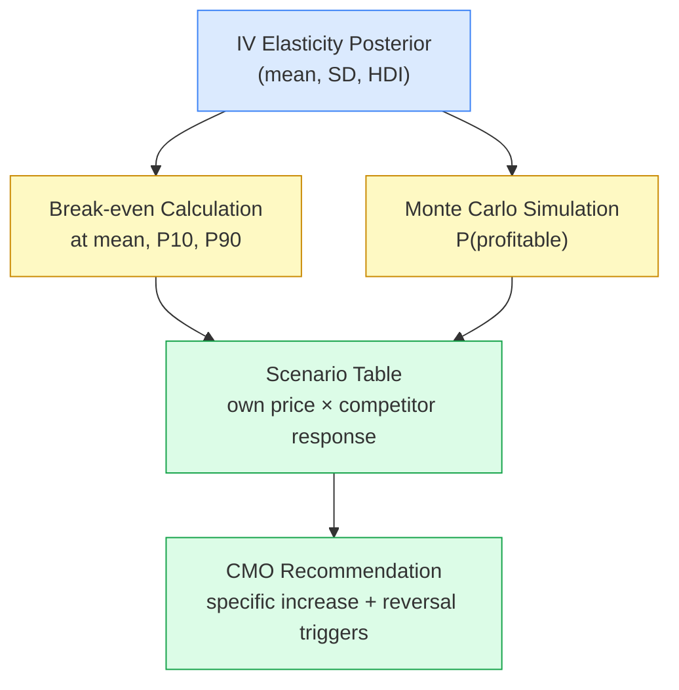

# Day 26 — Pricing Decisions Under Uncertainty: Building the CMO Deck

> **Today's one idea:** A pricing recommendation requires a probability distribution over outcomes, not a point estimate — the decision-maker needs P(profitable) and a conditional scenario table, not just "we expect 8% volume loss."
> **Reading time:** ~35 min · **Prereqs:** Day 17 (IV estimation), Day 23 (cross-price elasticity), Day 25 (ROI curves and budget)
> **Primary source for today:** Angrist, J. D. & Pischke, J.-S. (2009). *Mostly Harmless Econometrics: An Empiricist's Companion*, Chapter 4 "Instrumental Variables in Action." Princeton University Press.
> **Before you start:** Recall Day 17's load-bearing idea — in one sentence, why is the IV elasticity for Surf Excel more negative than the OLS estimate, and what does that imply about the direction of pricing risk? No looking.

---

## The Hook (2–4 min)

A Unilever South Asia CFO walks into a pricing review. The question on the table: "Can we raise Surf Excel price by 7%?"

The MMM analyst pulls up the model. Price elasticity: −1.4. Break-even volume loss: 14.9%. Expected volume loss at −1.4: 9.8%. Green light.

Two months after the increase, volume falls 17%. The analyst did not lie. The model ran correctly. But the analyst reported a point estimate from a model with known endogeneity bias — they knew OLS overstates the elasticity toward zero (recall Day 17: the instrument corrects upward, toward more negative values). The IV estimate was −2.1. At −2.1, a 7% increase implies 14.7% volume loss — right at break-even. Any Ariel competitive response pushes it over.

The CFO made a confident decision on a number the analyst should have been uncertain about.

This is not a modelling failure. It is a communication failure. The analyst had the IV posterior. They just did not use it to build the decision brief.

Today you learn how.

---

## Building the Intuition (10–15 min)

### The difference between a forecast and a decision brief

A forecast answers: *what will happen?*
A decision brief answers: *should we act, given what might happen?*

These require different outputs. A forecast can be a point estimate with a confidence interval tucked in a footnote. A decision brief must put the uncertainty front and centre — because the asymmetry of outcomes matters. A 7% price increase that works adds roughly 2.7 percentage points to margin on affected revenue. A 7% price increase that destroys volume by 17% can take months to recover. The downside is worse than the upside is good. That asymmetry demands a distribution.

### Four components every pricing brief needs



**Component 1 — IV posterior, not a point.** You have a distribution over the elasticity parameter from Day 17. Use it. The mean and standard deviation of that posterior are inputs to everything downstream.

**Component 2 — Break-even at every quantile.** The break-even formula (Day 12):

```math
\text{break-even volume loss} = \frac{\Delta p\%}{\Delta p\% + \text{margin}\%}
```

is deterministic given the price increase and gross margin. What is not deterministic is whether the *actual* volume loss will exceed it — that depends on the elasticity draw. Compute the break-even once, then ask: at what elasticity does the decision flip from profitable to unprofitable?

**Component 3 — Monte Carlo.** Sample ten thousand elasticity draws from the posterior. For each draw, compute the implied volume change. Count what fraction implies a volume loss exceeding break-even. That fraction is P(unprofitable). Its complement is P(profitable). This is the headline number in slide 7 of the CMO deck.

**Component 4 — Scenario table.** Volume loss is not just your own price move. It is your price move *plus* competitor response (Day 23 cross-price elasticity). The scenario table crosses your price increases against plausible Ariel responses. Each cell shows expected net volume change and whether it clears break-even.

### What the CMO is actually deciding

The CMO is not choosing an elasticity. They are choosing an action under uncertainty, with real financial consequences. Your job is to give them:

1. The central estimate and the honest uncertainty band around it.
2. The conditions under which the decision is profitable.
3. The conditions under which it is not.
4. A specific recommendation — not "it depends."

---

## The Formal Picture (10–15 min)

### Monte Carlo over the IV elasticity posterior

```python
import numpy as np

np.random.seed(42)
n_sim = 10_000

# IV elasticity posterior from Day 17: Normal approximation
# mean = -2.1, sd = 0.28 (from 2SLS standard error)
elasticity_draws = np.random.normal(loc=-2.1, scale=0.28, size=n_sim)

price_increase = 0.07   # 7% price increase
gross_margin   = 0.38   # 38% gross margin

# Volume change for each elasticity draw (negative = volume loss)
vol_change = elasticity_draws * price_increase

# Break-even volume loss (deterministic)
breakeven = price_increase / (price_increase + gross_margin)
print(f"Break-even volume loss: {breakeven:.1%}")
# Break-even volume loss: 15.6%

# P(profitable) = P(|vol_change| < break-even)
prob_profitable = (np.abs(vol_change) < breakeven).mean()
print(f"Expected volume change: {vol_change.mean():.1%}")
print(f"P(profitable at 7% increase): {prob_profitable:.1%}")
print(f"P(volume loss > 15%): {(np.abs(vol_change) > 0.15).mean():.1%}")
```

The output surfaces three numbers the CMO needs:
- What volume loss do we expect on average?
- What is the probability the move is profitable?
- What is the probability of a severe outcome (loss > 15%)?

Note: `breakeven` here uses the formula from Day 12. At 7% price increase and 38% margin, break-even is 15.6% volume loss — not 14.9%. Always re-derive from your specific numbers; do not paste a prior day's output.

### Scenario table: own price × competitor response

```python
import pandas as pd

cross_elast  = 0.42   # Ariel-to-Surf-Excel cross-price elasticity (Day 23)
own_elast    = -2.1   # IV point estimate (posterior mean)
gross_margin = 0.38

scenarios = []
for price_inc in [0.03, 0.05, 0.07, 0.10]:
    for ariel_move, ariel_label in [
        ( 0.00, "Ariel holds price"),
        (-0.03, "Ariel cuts 3%"),
        ( 0.02, "Ariel raises 2%"),
    ]:
        own_vol        = own_elast * price_inc
        competitor_vol = cross_elast * ariel_move   # positive ariel cut → we lose more share
        net_vol        = own_vol + competitor_vol
        be             = price_inc / (price_inc + gross_margin)
        profitable     = net_vol > -be
        scenarios.append({
            "Price increase":     f"+{price_inc:.0%}",
            "Ariel response":     ariel_label,
            "Expected vol Δ":     f"{net_vol:.1%}",
            "Break-even":         f"{-be:.1%}",
            "Profitable":         "Yes" if profitable else "No",
        })

df = pd.DataFrame(scenarios)
print(df.to_string(index=False))
```

The scenario table uses the *posterior mean* for the own-price elasticity and a fixed cross-price estimate. It does not capture uncertainty over the cross-price elasticity — that is a known limitation to name in slide 9 of the deck (see below).

### The 10-slide CMO pricing deck

| Slide | Content | What it earns |
|-------|---------|---------------|
| 1 | The decision: which price change, which markets, which SKUs, by when | Scope clarity |
| 2 | Data foundation: Nielsen ASP history, IV instrument, time period | Credibility |
| 3 | Causal identification: OLS vs. IV, first-stage F-statistic, exclusion restriction argument (Day 15) | Honest methodology |
| 4 | The elasticity estimate: posterior distribution, HDI, OLS comparison with bias direction | The number and its honest uncertainty |
| 5 | Break-even analysis: at posterior mean, 10th percentile (pessimistic), 90th percentile | What we need to be true |
| 6 | Scenario table: price × competitor response grid | Competitive framing |
| 7 | Monte Carlo histogram: P(profitable) as the headline | The decision number |
| 8 | Recommendation: specific price increase, implementation conditions, reversal triggers | The ask |
| 9 | What we are betting on: explicit causal claims vs. assumptions (Day 15 identification language) | Intellectual honesty |
| 10 | Validation plan: post-implementation data that will confirm or refute the decision | Accountability |

Slide 9 is the one analysts most often omit. It forces you to name what has to be true for the recommendation to hold — the exclusion restriction, the LATE interpretation, the assumption that the competitor cross-elasticity is stationary. If any of those fail, the recommendation fails. The CMO should know that before deciding.

---

## Where It Breaks / What It Is Not (3–5 min)

**"A 64% probability of profitability is good enough."**
Context determines the threshold. For a £50M revenue decision, a 36% chance of a margin-destroying outcome may warrant a geo-test first (Day 18 DiD framework) rather than a full national rollout. P(profitable) is an input to the decision, not the decision itself.

**"Price elasticity is constant across the price range."**
The IV posterior captures uncertainty over the historical average elasticity. But demand curves are not linear at all prices. Near the upper end of the historical price range, the curve often steepens — consumers who are price-tolerant at +3% are not price-tolerant at +10%. Flag in the deck when the proposed price exceeds the historical maximum in the training data. Outside that range, extrapolation risk is real and unquantified.

**"The IV elasticity is the true causal parameter."**
IV estimates the Local Average Treatment Effect (LATE) — the elasticity for *compliers*, the consumers who changed purchasing behaviour specifically in response to the cost-driven price variation captured by the palm oil instrument (Day 17). If Surf Excel wants to raise price broadly, including for loyal-segment households who barely responded to cost-driven price changes historically, the LATE may underestimate their price sensitivity. The deck should name this explicitly.

**"OLS is safer because it is less negative — the optimistic case."**
This is the most dangerous misconception. OLS is biased toward zero due to simultaneity (Day 17). Using it is not being conservative — it is being wrong in a direction that systematically overstates the probability of profitability. The IV estimate is harder to sell but it is the honest number.

---

## Try It Yourself (5–10 min)

**Exercise 1 — Retrieval**

Close this page. Write down from memory:
1. The break-even volume loss formula, with every symbol defined.
2. What "break-even" means in the context of a price increase decision — one sentence in plain English that you could say to the CFO.

<details>
<summary>Reference answer</summary>

**Formula:**

```math
\text{break-even volume loss} = \frac{\Delta p\%}{\Delta p\% + m\%}
```

where $\Delta p\%$ is the percentage price increase and $m\%$ is the gross margin percentage.

**Plain English:** Break-even is the volume loss at which the revenue gain from the higher price exactly offsets the revenue lost from fewer units sold, leaving gross profit unchanged. Any volume loss smaller than this threshold makes the price increase profitable; any larger loss makes it unprofitable.

</details>

---

**Exercise 2 — Direct application**

You are building a pricing brief for Dove Body Wash in the UK.

- IV elasticity posterior: mean = −1.9, SD = 0.3
- Gross margin: 41%
- Proposed price increase: 6%

Calculate:
(a) The break-even volume loss.
(b) The expected volume loss at the posterior mean.
(c) The volume loss at mean minus 1.5 SD (a plausible pessimistic draw).

Then write a one-paragraph recommendation: should Dove raise price 6%? State the specific P(profitable) direction and what condition would reverse your recommendation.

<details>
<summary>Reference answer</summary>

**(a) Break-even:**

```math
\frac{0.06}{0.06 + 0.41} = \frac{0.06}{0.47} \approx 12.8\%
```

**(b) Expected volume loss at mean:**

$-1.9 \times 0.06 = -11.4\%$

Expected volume loss is 11.4%, which is below the 12.8% break-even. At the posterior mean, the move is profitable.

**(c) Volume loss at mean − 1.5 SD:**

Elasticity at mean − 1.5 SD = $-1.9 - (1.5 \times 0.3) = -2.35$

Volume loss = $-2.35 \times 0.06 = -14.1\%$

At this elasticity draw, volume loss of 14.1% exceeds break-even of 12.8%. The move is unprofitable.

**Recommendation (sample):** At the posterior mean, a 6% increase is profitable, with expected volume loss (11.4%) below break-even (12.8%). However, the distribution has meaningful mass in loss-making territory: at 1.5 standard deviations below the mean, the move flips unprofitable. I recommend running a Monte Carlo to compute P(profitable) precisely — if below ~70%, a geo-test in two markets before national rollout is warranted. The recommendation reverses if a competitor cuts price simultaneously; that scenario should be modelled explicitly in the scenario table before the CMO decision.

</details>

---

**Exercise 3 — Stretch (callback to Day 15)**

The CFO pushes back: "Since we cannot perfectly measure elasticity, let us just use the OLS estimate of −1.4 — it is less risky to be optimistic."

Using Day 15's identification levels and the Monte Carlo logic from today, write one paragraph explaining why this argument is backwards. Be specific: what is the direction of the OLS bias, what does it imply for P(profitable), and what does the IV posterior add that the OLS point estimate cannot?

<details>
<summary>Reference answer</summary>

The CFO's argument confuses *model uncertainty* with *being conservative*. Day 15 established that OLS without causal identification produces a biased estimate when the endogeneity condition holds — here, because Surf Excel's price and volume are simultaneously determined (high demand periods attract higher prices), OLS underestimates the magnitude of the causal elasticity, yielding a number closer to zero than the true effect. Using −1.4 instead of the IV estimate of −2.1 is not optimism; it is a systematic error in a direction that inflates P(profitable). The IV posterior at mean −2.1 produces an expected volume loss of 14.7% — essentially at break-even for a 7% increase — while OLS produces 9.8%, which looks safely profitable. The Monte Carlo built on the IV posterior honestly reflects the probability that the true causal effect puts volume loss above break-even; the OLS point estimate has no uncertainty band that accounts for identification failure, only sampling noise. Substituting the OLS number does not reduce risk — it hides the risk that already exists in the data.

</details>

---

> **Transfer — apply it:** In your current project, identify one decision where you are currently reporting a point estimate to a stakeholder: name the input variable, the model output, and write one sentence describing what a P(outcome exceeds threshold) calculation would add to that communication.

---

## Connect It Back

Day 25 gave you the ROI curve — the tool for deciding *how much* to spend on any given lever. Today's page takes the harder case: a lever (price) where the causal estimate is uncertain, the downside is asymmetric, and the decision-maker needs more than a number — they need a probability and a scenario map. The IV posterior from Day 17, the cross-price elasticity from Day 23, and the break-even formula from Day 12 all converge here into a single communication artefact: the CMO deck. Tomorrow, Day 27 applies the same logic to promotion decisions, where the uncertainty compounds further because promotional lifts are short-lived, cannibalise future demand, and interact with trade margins in ways that OLS MMM routinely misattributes.

**Sharp question:** If a competitor cuts price by 3% simultaneously with your 7% increase, and the cross-price elasticity is 0.42, at what own-price elasticity does the combined move become unprofitable given a 38% gross margin?

---

## Suggested Readings for Today

**Required (15 min):** Angrist & Pischke (2009), *Mostly Harmless Econometrics*, Chapter 4 §4.1 "The IV Estimator with a Single Endogenous Regressor" — specifically the discussion of LATE and the complier population (pp. 153–160). After today's page, this section grounds exactly why the IV elasticity is a local estimate and what population it applies to.

**Deep version:**

1. Angrist, J. D. & Pischke, J.-S. (2009). *Mostly Harmless Econometrics*, Chapter 4 §4.4 "IV with Heterogeneous Potential Outcomes" (pp. 168–175). Explains why LATE ≠ ATE and when the gap between them matters — directly relevant to the "IV is not the true causal parameter" caveat in today's page.

2. Gelman, A. & Hill, J. (2007). *Data Analysis Using Regression and Multilevel/Hierarchical Models*, Chapter 9 "Causal Inference Using Regression on the Treatment Variable," §9.3 "Instrumental variables" (pp. 216–222). Cambridge University Press. Alternative framing of IV that connects more naturally to Bayesian posterior thinking — useful if the PyMC-Marketing posterior from Day 17 is your primary output.

3. van Heerde, H. J., Leeflang, P. S. H., & Wittink, D. R. (2004). "Decomposing the Sales Promotion Bump with Store Data." *Marketing Science*, 23(3), 317–334. DOI: 10.1287/mksc.1040.0061. The benchmark paper on promotional decomposition — introduces the framing of net vs. gross volume effect that you will need on Day 27.

---

## Navigation

← **Previous:** [Day 25 — ROI Curves and Budget Allocation](./day-25-roi-curves-budget.md)
→ **Next:** [Day 27 — Promotion Decisions](./day-27-promotion-decisions.md)
