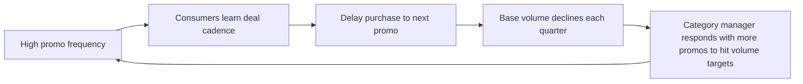

# Day 27 — Promotion Decisions: Net ROI and the Base Erosion Trap

> **Today's one idea:** Gross promotional ROI (measured only during the promotion window) almost always overstates true ROI because it ignores the post-promo volume dip; and high promotional frequency erodes base sales by training consumers to buy only on deal — making the brand a price-driven commodity.
> **Reading time:** ~35 min · **Prereqs:** Day 8 (promotional volume decomposition), Day 26 (pricing decisions)
> **Primary source for today:** Blattberg, R., Briesch, R., & Fox, E. (1995). "How Promotions Work." *Marketing Science*, 14(3), G122–G132.
> **Before you start:** Recall Day 8's load-bearing idea — one sentence on borrowed demand and how it affects reported promotional ROI when post-promo lags are missing.

---

## The Hook (2–4 min)

OMO Bangladesh runs 8 trade promotions per year. Each shows a 2.4× volume uplift during the promotional week. Gross ROI is positive. The category manager celebrates.

Two years later, base volume is down 18%. Forty percent of the consumer base now buys only on promotion. They have learned to wait.

The "positive ROI" promotions destroyed base sales one event at a time. The MMM that lacked post-promo lags confirmed the positive ROI and never saw the dip — or the erosion. This is the most common missed diagnosis in FMCG analytics.

---

## Building the Intuition (10–15 min)

### 1. The three-part promotional volume decomposition (Day 8 recap)

Every promotional spike is composed of three things:

```
Promotional uplift = True incremental
                   + Category expansion
                   + Pull-forward (stockpiling)
```

- **True incremental:** consumption occasions that would not have happened at all — a consumer washes more laundry, uses more product per wash.
- **Category expansion:** consumers who would have bought a competitor brand switch to OMO because of the deal. Revenue now; they may switch back later.
- **Pull-forward:** existing loyal OMO consumers buy 3 packs instead of 1 because the price is low. They are stocked up. They will not buy again for 3–5 weeks.

Only the first two generate genuinely new volume. Pull-forward is borrowed demand from future weeks.

### 2. Why the post-promo dip is invisible in standard reporting

```
Volume (units/week)
│
│         ████
│      ████  ██
│   ████      ██████   ← dip: stockpiled consumers not buying
│ ██                ████████████  ← base resumes
│
└─────────────────────────────────────── weeks
   pre   promo   dip     recovery
```

If you measure ROI only during the promo week, you count the spike. You do not count the dip. Gross ROI = positive. Net ROI = materially lower.

### 3. Base erosion: the cumulative frequency effect

A single promotion does not erode the base. Eight promotions per year does.

The mechanism: consumers are rational. If OMO is on deal every 6–7 weeks, the optimal consumer strategy is to buy only when it is on deal. Over 12–18 months, the segment of consumers who wait for a deal grows. Each one of them reduces non-promoted base volume by their weekly purchase rate.



This is a reinforcing loop. Each promo event that appears ROI-positive accelerates the erosion of the base that makes future promos necessary.

### 4. The net ROI test

Net ROI captures both the dip and the investment:

```
Net ROI = (promo margin − dip margin lost) / promotional investment
```

The dip margin lost equals the units borrowed from the future (pull-forward units) × full-price margin, because those units that were bought early at the discounted price will not be purchased again at full price.

---

## The Formal Picture (10–15 min)

### Gross vs net promotional ROI

```python
def net_promo_roi(
    promo_uplift_units: float,
    promo_depth_pct: float,
    base_price: float,
    margin: float,
    pull_forward_rate: float,
) -> dict:
    """
    Calculate gross and net promotional ROI.

    Parameters
    ----------
    promo_uplift_units : total units sold above baseline during promo week
    promo_depth_pct    : fractional price reduction (e.g. 0.18 = 18% off)
    base_price         : full shelf price per unit
    margin             : gross margin at full price (fraction)
    pull_forward_rate  : fraction of uplift that is borrowed future demand
    """
    promo_price = base_price * (1 - promo_depth_pct)
    variable_cost = base_price * (1 - margin)

    # Revenue uplift at reduced price, less variable cost
    gross_promo_margin = promo_uplift_units * (promo_price - variable_cost)
    # Investment = margin forgone on discount across all units sold during promo
    investment = promo_uplift_units * base_price * promo_depth_pct
    gross_roi = gross_promo_margin / investment

    # Dip: borrowed units will not be purchased again at full price
    borrowed_units = promo_uplift_units * pull_forward_rate
    dip_margin_lost = borrowed_units * base_price * margin  # lost at full margin

    net_roi = (gross_promo_margin - dip_margin_lost) / investment

    return {
        "gross_roi": round(gross_roi, 3),
        "net_roi": round(net_roi, 3),
        "borrowed_units": round(borrowed_units, 0),
        "dip_margin_lost": round(dip_margin_lost, 2),
    }


# OMO Bangladesh worked example
result = net_promo_roi(
    promo_uplift_units=45_000,
    promo_depth_pct=0.18,
    base_price=2.40,
    margin=0.36,
    pull_forward_rate=0.45,
)
print(result)
# {'gross_roi': 1.778, 'net_roi': 0.778, 'borrowed_units': 20250.0, 'dip_margin_lost': 17496.0}
```

Symbol annotations:

| Symbol | Meaning |
|---|---|
| `promo_depth_pct` | The discount percentage — this is the investment per unit |
| `margin` | Gross margin at full price; cost structure assumed fixed |
| `pull_forward_rate` | Estimated from post-promo dip weeks in the MMM (Day 8) |
| `dip_margin_lost` | The true cost of borrowed demand — full-price margin on units that will not be re-bought |

Gross ROI of 1.78 looks attractive. Net ROI of 0.78 is below 1.0 — this promotion destroys value once the dip is accounted for.

### Base erosion projection

```python
import numpy as np
import pandas as pd


def base_erosion_projection(
    base_volume: float,
    erosion_rate_per_event: float,
    n_events_range: range,
    margin: float,
    asp: float,
    weeks: int = 52,
) -> pd.DataFrame:
    """
    Project annual brand profit as a function of promotional frequency.

    erosion_rate_per_event : permanent fraction of base volume lost per promo event
                             (estimated from MMM long-run base decomposition)
    """
    records = []
    for n in n_events_range:
        # Compound erosion: each event erodes (1 - erosion_rate) of remaining base
        cumulative_erosion = 1 - (1 - erosion_rate_per_event) ** n
        effective_base = base_volume * (1 - cumulative_erosion)
        annual_base_profit = effective_base * asp * margin * weeks
        records.append(
            {
                "n_promos": n,
                "pct_base_remaining": round((1 - cumulative_erosion) * 100, 1),
                "effective_base_units_pw": round(effective_base, 0),
                "annual_base_profit": round(annual_base_profit, 0),
            }
        )
    return pd.DataFrame(records)


# OMO Bangladesh: starting base 300k units/week, erosion 2.5% per event, ASP £2.40, margin 36%
df = base_erosion_projection(
    base_volume=300_000,
    erosion_rate_per_event=0.025,
    n_events_range=range(1, 13),
    margin=0.36,
    asp=2.40,
)
print(df.to_string(index=False))
```

**Optimal frequency** is not zero promotions (promotions generate genuine incremental). It is the event count that maximises:

```
Total profit = base_profit(n) + sum(net_promo_profit per event)
```

For most storable FMCG brands, the optimum is **3–5 events per year**, not 8–12. Above 5–6, base erosion outpaces incremental promo profit.

### Pull-forward rates by category

| Category type | Typical pull-forward rate | Post-promo dip duration |
|---|---|---|
| Detergent (storable bulk) | 40–60% | 3–5 weeks |
| Canned / ambient soups | 25–40% | 2–4 weeks |
| Personal care (moderate storage) | 20–35% | 2–3 weeks |
| Yogurt / chilled (perishable) | 5–15% | 1 week |

Storability drives pull-forward. Perishable categories cannot be stockpiled so pull-forward is structurally low — promotions are more efficient there.

### Estimating pull-forward rate from the MMM

In your MMM specification, include post-promo lag variables (Day 8):

```python
# In your statsmodels OLS or PyMC-Marketing model, add lag dummies:
# promo_t    = 1 in promo week
# promo_lag1 = 1 in week t+1 after promo
# promo_lag2 = 1 in week t+2 after promo
# promo_lag3 = 1 in week t+3 after promo

# Pull-forward rate ≈ |sum(lag coefficients)| / promo_coefficient
pull_forward_rate = abs(beta_lag1 + beta_lag2 + beta_lag3) / beta_promo
```

This is an approximation. Kantar occasion-level panel data (Days 11–12) is more precise because it separates individual stockpilers from new buyers.

---

## Where It Breaks / What It Is Not (3–5 min)

**1. "Pull-forward rate is directly observable from scanner data."**
Partially. You can see the dip in scanner volume after the promotion. But separating true incremental buyers from stockpilers requires occasion-level Kantar data — scanner data collapses all consumer types into one volume figure.

**2. "Base erosion is always caused by promotion frequency."**
Correlation is not causation. Base can decline from competitor launches, distribution loss (lost WD from a retailer), category decline, or pack rationalisation. Before attributing erosion to promos, run the Day 3 base decomposition and include competitor promotional intensity, weighted distribution, and category growth as controls.

**3. "A below-1.0 net ROI means never promote."**
No. Promotions serve multiple strategic functions: defending shelf space with retailers (who require promotional support), blocking competitor trial, and activating lapsed buyers. A promotion with net ROI < 1.0 may still be mandatory to maintain retailer relationships. The analysis tells you the economic cost of that choice — it does not make the choice for you.

**4. "The erosion_rate_per_event parameter is known."**
It is estimated, not known. You derive it from the slope of base volume versus cumulative promotional frequency over 3–5 years of MMM data. If the brand has not had sufficient variation in promotional frequency, you cannot identify it from brand data alone — use cross-brand estimates from the category portfolio (Surf Excel and OMO together provide more variation than either brand alone).

---

## Try It Yourself (5–10 min)

**Exercise 1 — Retrieval**
Close this page. Define pull-forward demand and the post-promo dip in two sentences each. Explain why gross promotional ROI overstates true ROI for a storable product, without looking.

<details>
<summary>Reference answer</summary>

**Pull-forward demand:** Units purchased during a promotion that would have been purchased in a future period anyway — the consumer stockpiles. These are not new consumption occasions.

**Post-promo dip:** The reduction in sales volume in the weeks immediately following a promotion, caused by stockpiled consumers who do not need to repurchase. Duration is proportional to the storage horizon of the category.

**Why gross ROI overstates:** Gross ROI counts the volume uplift during the promo week at the discounted price. It does not count the equal-and-opposite margin loss in the dip weeks, where consumers who stockpiled do not buy at full price. The net effect for pull-forward units is always negative: you sold them early at a discount, and you lost the full-price sale you would have received later.

</details>

---

**Exercise 2 — Direct application**
OMO UK promotion: uplift 38,000 units, discount 20%, ASP £2.20, gross margin 34%, pull-forward rate 42%.

1. Calculate gross ROI.
2. Calculate net ROI.
3. Is this promotion value-creating net of the dip? Show your working.

<details>
<summary>Reference answer</summary>

```
promo_price         = 2.20 × (1 - 0.20)       = £1.76
variable_cost       = 2.20 × (1 - 0.34)       = £1.452

gross_promo_margin  = 38,000 × (1.76 - 1.452)  = 38,000 × 0.308 = £11,704
investment          = 38,000 × 2.20 × 0.20     = £16,720

gross_roi           = 11,704 / 16,720          ≈ 0.70

borrowed_units      = 38,000 × 0.42            = 15,960 units
dip_margin_lost     = 15,960 × 2.20 × 0.34     = £11,930

net_roi             = (11,704 - 11,930) / 16,720 ≈ -0.01
```

The promotion is marginally value-destroying on a net basis: gross ROI was already below 1.0, and the dip pushes net ROI to approximately −0.01. This promotion should be redesigned (shallower discount, shorter promotional window) or justified only on retailer relationship grounds, not profitability.

</details>

---

**Exercise 3 — Stretch (connects Day 3 and Day 8)**
OMO Bangladesh base volume has declined from 280,000 to 240,000 units per week over 3 years while promotional frequency increased from 4 to 10 events per year. The category also experienced two new competitor SKU launches during this period.

1. What regression would you specify to isolate base erosion attributable to promotional frequency from competitor activity and distribution changes?
2. What data sources would you need beyond the MMM dataset?
3. What would the coefficient of `cumulative_promo_events` tell you, and what is its unit of measurement?

<details>
<summary>Reference answer</summary>

**1. Regression specification**

Use quarterly observations over the 3-year window (12 data points — marginal; use monthly if available for n=36):

```
log(base_volume_t) = α
                   + β₁ × cumulative_promo_events_t
                   + β₂ × log(competitor_WD_t)        # competitor distribution
                   + β₃ × log(OMO_WD_t)               # own distribution
                   + β₄ × competitor_promo_intensity_t # competitor promo frequency
                   + β₅ × category_volume_index_t      # category growth/decline
                   + ε_t
```

`base_volume_t` is the MMM-estimated base (strip out promo and media coefficients from the decomposition). `cumulative_promo_events_t` is the running total of promo events since the start of the observation window — this is the base erosion driver hypothesis.

**2. Data sources needed**

- **Nielsen WD** for OMO and leading competitors (already in MMM dataset per Day 4)
- **Nielsen promotional data** for competitors — number of promo weeks per competitor brand per quarter
- **Kantar TGI / BrandZ** — deal-proneness index over time: what fraction of OMO buyers report "I wait for promotions"? This is the direct behavioural measure of erosion
- **Internal finance** — actuals on base volume from the MMM decomposition output (Day 3)

**3. Interpretation of β₁**

β₁ is the elasticity of log(base_volume) with respect to cumulative promo events. If β₁ = −0.025, then each additional cumulative promo event reduces the base by approximately 2.5%. This is the `erosion_rate_per_event` parameter used in the base erosion projection model above. Its unit is log-points per event, which approximates percent per event for small values.

**Caveat (Day 3):** with only 12–36 observations and collinear regressors (promo frequency tends to increase when distribution declines and competitors launch), you will have wide standard errors. You cannot confidently attribute all of the 14% base decline to promotions. Report the coefficient with its confidence interval and be explicit about the collinearity concern to the CMO.

</details>

---

> **Transfer:** In your brand portfolio, identify one brand where promotional frequency exceeds 6 events per year and check whether the MMM base trend is declining — if it is, the erosion loop may already be active.

---

## Connect It Back

Yesterday (Day 26) you built a pricing decision framework around probability distributions — P(profitable) rather than point estimates. Today the same logic applies to promotion: a gross ROI of 1.78 is a point estimate that hides the distribution of outcomes once pull-forward and base erosion are included. The full distribution is asymmetric and left-skewed for high-frequency, storable-category promotions: most outcomes cluster around the net ROI, but the tail risk is an accelerating base erosion loop that takes 2–3 years to surface and is expensive to reverse.

Tomorrow (Day 28) you apply the same decision framework to Place (distribution) and People (media), completing the 5P business decision module.

**A question you can now answer:** Your CMO says every one of OMO's 10 annual promotions has positive gross ROI — why should we run fewer? Walk through the net ROI calculation and the base erosion projection to make the case in two minutes.

---

## Suggested Readings for Today

**Required (15 min):**
Blattberg, R., Briesch, R., & Fox, E. (1995). "How Promotions Work." *Marketing Science*, 14(3), G122–G132. — Read Sections 2 and 3 (empirical generalisations on pull-forward and post-promo dip). The paper establishes the factual base behind every formula in today's session.

**Deep version:**

1. Blattberg, R. C., & Neslin, S. A. (1990). *Sales Promotion: Concepts, Methods, and Strategies*. Prentice Hall. Chapter 4 "Consumer Response to Promotions" — the stockpiling and deal-proneness mechanism in full detail.
2. Nijs, V. R., Dekimpe, M. G., Steenkamp, J.-B. E. M., & Hanssens, D. M. (2001). "The Category-Demand Effects of Price Promotions." *Marketing Science*, 20(1), 1–22. — Separates category expansion from pull-forward at the category level using VAR models; directly relevant to OMO's detergent category context.
3. Srinivasan, S., Pauwels, K., Hanssens, D. M., & Dekimpe, M. G. (2004). "Do Promotions Benefit Manufacturers, Retailers, or Both?" *Management Science*, 50(5), 617–629. — Covers the retailer incentive structure that drives high promotional frequency even when it destroys brand value; explains the OMO Bangladesh scenario structurally.

---

## Navigation

← Previous: [Day 26 — Pricing Decisions Under Uncertainty](./day-26-pricing-decisions.md)
→ Next: [Day 28 — Place and People Decisions](./day-28-place-people-decisions.md)
