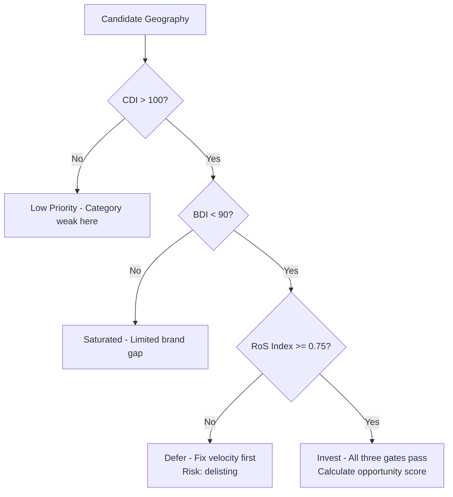
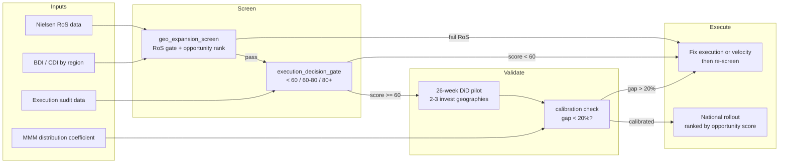

# Day 28 - Place and People Decisions: Distribution Expansion and Execution Quality

> **Today's one idea:** Distribution investment only creates sustainable value when Rate of Sale clears the retailer hurdle rate AND a DiD-validated distribution coefficient exists — expanding into geographies where RoS is below threshold accelerates delisting, not growth.
>
> **Reading time:** ~35 min · **Prereqs:** Day 9, Day 16, Day 27
>
> **Primary source for today:** Charan A. *The Marketing Analytics Practitioner's Guide* — distribution decision chapters.
>
> **Before you start:** Recall Day 9's load-bearing idea — one sentence on the three distribution dimensions (ND, WD, Rate of Sale) and how volume equals the product of depth and speed. No looking.

---

## The Hook (2-4 min)

The Knorr Soups UK brand team has budget for geo-expansion into 8 new regions. The MMM shows a distribution elasticity of 650 units per WD point. Numbers check out. Confidence is high. The team wants to proceed immediately.

The category manager pauses the meeting and opens the Nielsen RoS report.

In 3 of the 8 proposed regions, Knorr's Rate of Sale is 42% below the Tesco benchmark velocity for ambient soups. Forty-two percent. That means for every facing Knorr gains in those stores, the product turns over at less than half the speed of what Tesco expects a soup SKU to deliver.

Here is what happens next if Knorr ignores that number: Tesco lists Knorr in those 3 regions. For 6 months, the volume looks like growth in the MMM — WD up, revenue up. Then the Range Review hits. Tesco's buyer looks at sales per facing per week. Knorr is below the rangecut threshold. Facings get reduced. Within 18 months: delisted. The distribution investment has not just failed to return — it has actively damaged the relationship with the retailer and burned the trade budget.

The 8-region expansion becomes a 5-region expansion. The other 3 go on a watch list: fix the velocity problem first, then revisit distribution.

The MMM correctly identified the distribution opportunity. The RoS data correctly gated the implementation. Both are necessary. Neither is sufficient alone.

---

## Building the Intuition (10-15 min)

### 1. The Retailer Hurdle Rate

Every major grocery retailer operates a ranging model. At its core: each SKU must justify its shelf space by generating enough revenue per facing per week. If a product falls below the category floor — usually expressed as a minimum RoS index relative to the category average — the buyer reduces facings at the next review, then lists a competitor, then delists.

This means distribution is not a binary asset. It is a conditional asset. The condition is velocity. A listing in 20 stores where you turn over product fast is worth more than a listing in 50 stores where you rot on shelf.

Think of it as a landlord analogy. A retailer's shelf is commercial real estate. You pay rent in the form of margins and trade investment. Your rent is justified if the sales per square foot (sales per facing) exceed the landlord's minimum threshold. Below that threshold, the landlord replaces you with a tenant who pays better.

### 2. The Geo-Priority Matrix

Before committing distribution budget, rank geographies on three factors simultaneously:

**CDI — Category Development Index**
How strong is the category in this region relative to population? A CDI above 100 means the category over-indexes here. These are good markets to enter because the customer appetite exists.

```
CDI = (region category vol share / region pop share) × 100
```

**BDI — Brand Development Index**
How strong is your brand in this region relative to population? A BDI below 90 signals an untapped opportunity — your brand is under-represented where the category is already developed.

```
BDI = (region brand vol share / region pop share) × 100
```

**RoS Index**
How does your brand's Rate of Sale in this region compare to the category benchmark velocity? This is the gate. If you cannot turn stock fast enough, the retailer will not keep you ranged.

```
RoS Index = brand RoS / category RoS benchmark
```

The decision logic:

```
High CDI + Low BDI + RoS Index >= 0.75 → INVEST (opportunity exists and you can execute)
High CDI + Low BDI + RoS Index < 0.75 → DEFER (fix velocity first)
Low CDI → LOW PRIORITY regardless of BDI (category doesn't travel here)
```

Visually:



The **opportunity score** combines all three factors into a single ranking metric:

```
opportunity_score = CDI × (1 - BDI/100) × RoS Index
```

Interpretation: high CDI means the category is strong here, `(1 - BDI/100)` represents the brand gap (larger gap = bigger upside), and the RoS index weights down geographies where execution is weak.

### 3. DiD Validation Before National Scale

You have a distribution coefficient from the MMM. You trust it — but should you bet the national budget on it without a pilot?

The correct sequence:

1. Pick 2-3 geographies that pass the geo-priority screen
2. Run a 26-week pilot (the build lag from Day 9 means you need at least 6 months to see the full velocity effect)
3. Apply the DiD framework from Day 16 — pilot regions as treated, matched regions as control
4. Compare the DiD estimate against the MMM coefficient
5. If the gap is within 20%: the model is calibrated, scale nationally
6. If the gap exceeds 20%: investigate before scaling (model may be confounded, or execution quality is dampening the effect)

This sequence prevents a single-model failure from propagating to a £5M national rollout.

### 4. People: Trade Execution Quality Multiplies the Distribution Effect

The MMM estimates what a WD point is worth in an average store. But stores are not average. A WD gain in a poorly-executed store — wrong shelf position, below-target facings, promotional material missing — will underperform the model prediction. A WD gain in a perfectly-executed store can outperform it.

This means the People dimension (trade field force, execution standards) is a multiplier on the Place effect. You cannot fully realise the distribution ROI without the execution to back it up.

Three components of execution quality:
- **Shelf compliance** — is the product in the correct shelf location per planogram?
- **Facings vs. target** — does the product have the agreed number of facings?
- **Promotional compliance** — when a promotion is running, is it visible and correctly priced in-store?

The composite **execution index** (0–100) weights these three components. A 10-point improvement in the execution index in FMCG typically delivers a +5% to +8% uplift in RoS at a given WD level — the range reflects category and market variation (Unilever Perfect Store internal benchmarks).

---

## The Formal Picture (10-15 min)

### Geo-Priority Screening Function

```python
import pandas as pd

def geo_expansion_screen(geo_df: pd.DataFrame, ros_hurdle_pct: float = 0.75):
    """
    Screen geographies for distribution investment readiness.

    Parameters
    ----------
    geo_df : DataFrame with columns:
        region            - geography label
        brand_ros         - brand Rate of Sale (units/store/week)
        category_ros_benchmark - category benchmark RoS for the same retailer
        brand_vol_share   - brand volume share in the region (0-1)
        category_vol_share - category volume share in the region (0-1)
        pop_share         - region share of national population (0-1)
    ros_hurdle_pct : minimum RoS index to pass the gate (default 0.75)

    Returns
    -------
    invest : geographies cleared for investment, ranked by opportunity score
    defer  : geographies below the RoS threshold
    """
    geo_df = geo_df.copy()
    geo_df["ros_index"] = geo_df["brand_ros"] / geo_df["category_ros_benchmark"]
    geo_df["bdi"] = geo_df["brand_vol_share"] / geo_df["pop_share"] * 100
    geo_df["cdi"] = geo_df["category_vol_share"] / geo_df["pop_share"] * 100

    geo_df["pass_ros"] = geo_df["ros_index"] >= ros_hurdle_pct

    # Opportunity score: category strength × brand gap × velocity health
    geo_df["opportunity_score"] = (
        geo_df["cdi"]
        * (1 - geo_df["bdi"] / 100)
        * geo_df["ros_index"]
    )

    invest = geo_df[geo_df["pass_ros"]].sort_values("opportunity_score", ascending=False)
    defer = geo_df[~geo_df["pass_ros"]]
    return invest, defer


# --- Example usage ---
invest_geos, defer_geos = geo_expansion_screen(geo_data)

print("Ready for investment:")
print(invest_geos[["region", "cdi", "bdi", "ros_index", "opportunity_score"]].head(5))

print("\nDeferred - fix RoS first:")
print(defer_geos[["region", "ros_index"]])
```

Symbol annotations:
- `ros_index` — dimensionless ratio; 1.0 means brand RoS exactly matches the category benchmark; <0.75 triggers the deferral gate
- `bdi` — values below 100 indicate brand under-development relative to population; values below 90 signal investable opportunity
- `cdi` — values above 100 indicate the category over-indexes in this region; the necessary precondition for distribution ROI
- `opportunity_score` — higher is better; geographies at the top of the `invest` list get first call on the distribution budget

### DiD Pilot Before National Rollout

This is the Day 16 TWFE estimator applied to a pre-scale distribution pilot.

```python
import statsmodels.formula.api as smf
import numpy as np

# Assumptions for the pilot design:
# - pilot_regions:   3 geographies passing the geo screen, selected for investment
# - control_regions: 3 matched geographies with similar CDI/BDI, no investment
# - Minimum measurement window: 26 weeks post-launch
#   (covers the full WD build lag identified in Day 9)
# - pilot_df columns: region, week, log_volume, treat (0/1), post (0/1),
#   treat_post (interaction), treated (boolean)

def validate_distribution_pilot(pilot_df: pd.DataFrame, mmm_prediction: float,
                                  calibration_tolerance: float = 0.20):
    """
    Run DiD on pilot data and compare against MMM coefficient.

    mmm_prediction : expected % volume change from the MMM for the WD gain achieved
    calibration_tolerance : max acceptable fractional gap (default 20%)
    """
    model = smf.ols(
        "log_volume ~ treat + post + treat_post + C(region) + C(week)",
        data=pilot_df
    ).fit(cov_type="HC3")

    did_estimate = model.params["treat_post"]
    gap = abs(did_estimate - mmm_prediction) / abs(mmm_prediction)

    print(f"DiD estimate   : {did_estimate:.3f} ({did_estimate*100:.1f}% volume)")
    print(f"MMM prediction : {mmm_prediction:.3f} ({mmm_prediction*100:.1f}% volume)")
    print(f"Calibration gap: {gap:.0%}")

    if gap <= calibration_tolerance:
        print("DECISION: Calibrated — proceed to national rollout")
    else:
        direction = "over" if did_estimate > mmm_prediction else "under"
        print(f"DECISION: MMM {direction}predicted by >{calibration_tolerance:.0%} — investigate before scaling")
        print("  Check: execution quality index in pilot stores")
        print("  Check: parallel trends assumption (pre-period trends)")
        print("  Check: spillover into control regions")

    return did_estimate, gap, model

# Example:
# MMM implied +9.7% volume for +6 WD points
# DiD observed +8.2% — gap is 15%, within tolerance
did_est, gap, pilot_model = validate_distribution_pilot(
    pilot_df, mmm_prediction=0.097
)
```

### Trade Execution Quality Index

```python
def execution_index(shelf_compliance_pct: float,
                    facings_vs_target_pct: float,
                    promo_compliance_pct: float,
                    weights: tuple = (0.40, 0.35, 0.25)) -> float:
    """
    Composite 0-100 index of in-store execution quality.

    Parameters
    ----------
    shelf_compliance_pct  : % stores where product is in correct shelf location
    facings_vs_target_pct : % of target facings achieved across audited stores
    promo_compliance_pct  : % stores where active promotions are correctly executed
    weights               : (shelf, facings, promo) — must sum to 1.0

    Returns
    -------
    Weighted composite score 0-100.
    FMCG execution elasticity on RoS: approx 0.5-0.8
    A 10-point improvement implies +5% to +8% RoS improvement at constant WD.
    """
    assert abs(sum(weights) - 1.0) < 1e-6, "Weights must sum to 1.0"
    return (shelf_compliance_pct * weights[0]
            + facings_vs_target_pct * weights[1]
            + promo_compliance_pct * weights[2])


def execution_decision_gate(score: float) -> str:
    if score < 60:
        return ("BLOCK distribution expansion. "
                "Execution quality will cause new WD points to underperform "
                "and risk delisting. Fix execution first.")
    elif score < 80:
        return ("PROCEED with distribution but monitor execution in parallel. "
                "Expect 10-20% underperformance vs MMM prediction until score reaches 80+.")
    else:
        return ("PROCEED. Distribution ROI will be fully realised. "
                "Execution quality is not a constraint.")
```

Symbol annotations for execution index:
- `shelf_compliance_pct` — sourced from field audit data or third-party mystery shopping; the highest-weighted component because location drives visibility
- `facings_vs_target_pct` — from planogram compliance audits; directly correlates with share of shelf and RoS
- `promo_compliance_pct` — binary per-store compliance; low weight because it only applies during promotional windows
- The 0.5–0.8 execution elasticity range is the FMCG industry benchmark; it means execution quality is roughly half as elastic as a media variable but twice as controllable

### The Full Decision Architecture



---

## Where It Breaks / What It Is Not (3-5 min)

**1. "Distribution is a universal growth lever."**
Not when the base is eroding from over-promotion (Day 27). Distribution amplifies the current demand signal — if that signal is weak because of long-term brand equity erosion or margin damage from deep discounting, getting listed in more stores accelerates the problem. More stores witness weak RoS, more delisting risk accumulates. Fix the demand problem before expanding supply.

**2. "High CDI always means invest."**
CDI tells you the category is strong. It says nothing about why your brand specifically is under-developed there. High CDI with very low BDI can mean the brand has tried and failed in that geography — a prior failed launch, a consumer preference for a competitor, or a price positioning mismatch. Investigate the reason for the low BDI before assuming it is a pure distribution gap.

**3. "The DiD pilot validates the MMM permanently."**
A calibration check at 26 weeks is a snapshot. If a competitor significantly changes distribution strategy, if a macro event shifts category behaviour, or if the retailer changes ranging criteria, the relationship between WD and volume can shift. Recalibrate the distribution coefficient annually, or after any major market structure change.

**4. "Execution quality is a soft input — it doesn't belong in a quantitative model."**
The execution index is quantitative, auditable, and causally upstream of RoS. Ignoring it produces a model where two stores with the same WD deliver systematically different volumes — unexplained variance that the MMM will incorrectly attribute to noise or to other variables (often media, which is correlated with execution investment timing). Including an execution quality variable in the MMM is the correct specification; leaving it out creates omitted variable bias (Day 15).

---

## Try It Yourself (5-10 min)

**Exercise 1 — Retrieval**

Close the page. Name the two tests a geography must pass before distribution investment is approved. What happens if it passes the CDI/BDI opportunity test but fails the RoS threshold?

<details>
<summary>Reference answer</summary>

The two tests: (1) CDI/BDI opportunity screen — high category development, meaningful brand gap. (2) RoS index threshold — brand velocity must reach at least 75% of the category benchmark.

If a geography passes the opportunity screen but fails the RoS threshold, investment is deferred. Entering that geography at sub-threshold velocity puts the product at risk of delisting within 12–24 months. The velocity problem must be addressed first — through promotional mechanics, pack size optimisation, consumer communication, or distribution in the right channel format — before listing in new accounts.

</details>

---

**Exercise 2 — Direct Application**

Knorr runs a pilot in Yorkshire and East Midlands.

- Pre-initiative weekly volume (both regions combined): 38,000 units
- WD gain achieved in pilot regions: +6 points
- DiD estimate after 26 weeks: +8.2% volume
- MMM coefficient implies: +9.7% volume for +6 WD points
- Execution index in pilot stores at week 26: 74

Answer:

(a) Is the MMM calibrated for national rollout?

(b) Should Knorr scale to 8 additional regions immediately?

(c) What one piece of additional data would most change your answer to (b)?

<details>
<summary>Reference answer</summary>

**(a) Calibration check:**

Gap = |0.082 - 0.097| / 0.097 = 15.5%

15.5% is below the 20% threshold. The MMM is calibrated. The slight under-performance is consistent with the execution index being in the 60–80 range (execution elasticity implies some drag at 74 vs. a fully-compliant 80+).

**(b) Scale decision:**

The model is calibrated, so the national rollout is supported by the pilot evidence. However: apply `geo_expansion_screen` to the remaining 8 regions before committing. Some may fail the RoS threshold. The 8-region expansion is not automatically approved — each region must pass the screen independently.

**(c) Most change-inducing additional data:**

The RoS index for each of the 8 candidate regions. If 3 or more fall below 0.75, the rollout scope shrinks materially and the budget must be reforecast. The execution index for those stores would be second priority — at 74 now, if some regions have stores scoring below 60, the distribution ROI will be structurally impaired regardless of calibration.

</details>

---

**Exercise 3 — Stretch (Day 14 callback)**

Draw the causal DAG for: `trade execution quality → RoS → volume`.

Identify one confounder in the execution-quality-to-RoS path and explain how you would control for it in a regression that estimates the execution coefficient.

<details>
<summary>Reference answer</summary>

**DAG:**

```
Store Format ──────────────────────────────► Volume
      │                                         ▲
      ▼                                         │
Trade Execution Quality ──► RoS ───────────────┘
      ▲                      ▲
      │                      │
Category Spend ─────────────┘
      │
      └────────────────────────────────────────► Volume
```

**Confounder: store format / tier**

High-tier flagship stores (e.g. Tesco Extra, large Sainsbury's) receive both higher execution investment from the trade field force (more visits, more facing audits) AND inherently generate higher RoS because of their footfall. A naive regression of `RoS ~ execution_index` will over-estimate the execution coefficient because both are driven upward by store format.

**Control strategy:**

Include store-format fixed effects (`C(store_format)`) in the regression. This estimates the execution-to-RoS relationship within store format groups — comparing high-execution stores to low-execution stores of the same format tier, removing the store-format confound.

```python
import statsmodels.formula.api as smf

execution_model = smf.ols(
    "log_ros ~ execution_index + C(store_format) + C(retailer) + C(region)",
    data=store_audit_df
).fit(cov_type="HC3")

print(execution_model.params["execution_index"])
# Interpretation: % change in RoS per 1-point increase in execution index,
# within store format and retailer, controlling for region
```

Callback to Day 14 (DAGs and backdoor criterion): `store_format` opens a backdoor path from `execution_quality` to `RoS`. Conditioning on `store_format` blocks that backdoor. The identification is valid if there are no unobserved store-level variables that are both correlated with execution investment decisions and with RoS — a reasonable assumption if the audit data is granular enough to include visit frequency and planogram version.

</details>

---

> **Transfer:** In your domain, where does today's concept apply? If you work outside FMCG — think about any capacity or distribution investment where the utilisation rate at the point of delivery determines whether the investment is sustainable or self-defeating.

---

## Connect It Back

Yesterday (Day 27) established that promotional ROI degrades when frequency is too high — the price anchor erodes, the brand equity tax accumulates, and the apparent short-term lift masks long-term volume loss. Today's lesson is structurally parallel for Place: the distribution investment metric (WD points gained) can look good in the MMM while concealing a dynamic — sub-threshold RoS — that will reverse the gain within 18 months. In both cases, the MMM correctly measures what it can see (the short-run volume response), and the practitioner's job is to layer on the structural constraint that determines whether that response is durable.

Tomorrow (Day 29) moves to the Pack dimension: how pack size and format choices affect price perception, penetration, and frequency, and how to model portfolio mix effects when a brand has 4 SKUs in the same category competing for the same shelf space.

**Sharp question you can now answer:** Your Knorr MMM shows a distribution coefficient of 580 units per WD point. The finance team asks: "If we buy 12 more WD points nationally, how much volume do we get?" What is the correct answer to that question, and why is "12 × 580 = 6,960 units" incomplete?

---

## Suggested Readings for Today

**Required (15 min):**
Charan A. *The Marketing Analytics Practitioner's Guide*, distribution decision chapters — focus on the RoS gating logic and how shelf metrics translate into ranging decisions. One-line note: the clearest practitioner treatment of the retailer-hurdle mechanism that the MMM cannot see internally.

**Deep version:**

1. Nielsen *Breakthrough Innovation Report* (any recent year), section on distribution build curves — specific data on how RoS evolves over the first 52 weeks after a new listing, by category. Annotation: calibrates your prior on how long the build lag really is and when to measure the DiD.

2. Farris P., Bendle N., Pfeifer P., Reibstein D. *Marketing Metrics* (3rd ed.), Chapter 5 (Distribution) — formal definitions of ND, WD, ACV, RoS and the algebra connecting them. Annotation: the reference for any ambiguity about what Nielsen is actually reporting in the distribution columns.

3. Angrist J., Pischke J-S. *Mostly Harmless Econometrics*, Chapter 5 (Differences-in-Differences) — re-read the parallel trends section with the pilot design in mind. Annotation: the theoretical grounding for why the 26-week window matters and what pre-period trend testing should look like before you declare the DiD valid.

---

## Navigation

← Previous: [Day 27 - Promotion Decisions](./day-27-promotion-decisions.md)

→ Next: [Day 29 - Pack and Portfolio Decisions](./day-29-pack-portfolio-decisions.md)
