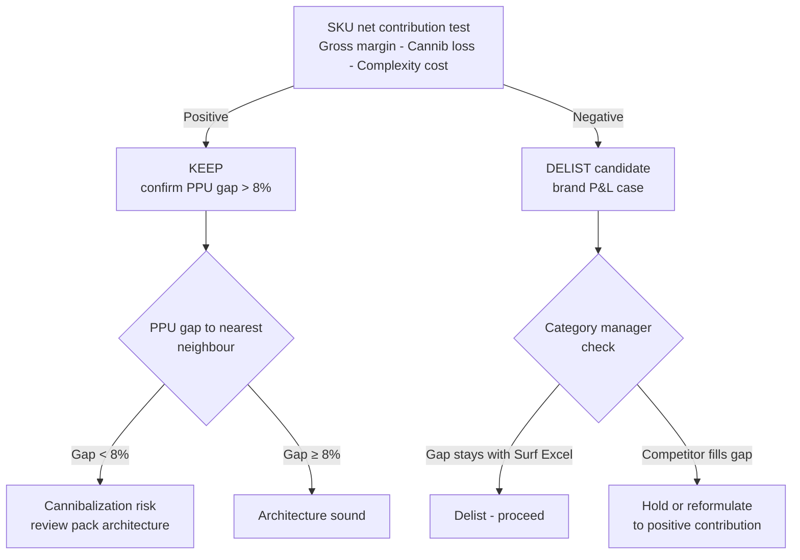

# Day 29 - Pack and Portfolio Decisions: Assortment Rationalization

> **Today's one idea:** A SKU earns its range position only when net incremental revenue — gross revenue minus cannibalization loss minus portfolio complexity cost — is positive; answering this requires both MMM cross-SKU elasticity and Kantar buyer duplication analysis.
> **Reading time:** ~35 min · **Prereqs:** Day 10 (incrementality), Day 23 (retailer/category manager dynamics)
> **Primary source for today:** Charan, A. *The Marketing Analytics Practitioner's Guide* — pack and portfolio chapters.
> **Before you start:** Recall Day 10's load-bearing idea: what is the incrementality test, and what is the difference between a volume-building SKU and a range-filling one? Write one sentence cold before reading on.

---

## The Hook (2–4 min)

Surf Excel South Asia runs 7 active SKUs. Eighteen months ago the team added a 750g pack "to fill the gap between 500g and 1kg." Today the 750g accounts for 8% of total brand volume. The MMM coefficient for the 750g is not statistically significant (p = 0.34). Kantar buyer duplication shows that 71% of households buying the 750g also bought the 1kg in the same month.

The 750g is not growing the brand. It is reorganising existing volume — moving it from the 1kg SKU to a smaller, lower-margin pack. Meanwhile it consumes a production slot, occupies shelf facings, requires separate trade terms, and fragments distributor attention.

The obvious decision is to delist it. But no one does. Why?

Because the 750g is generating revenue. Delist it and the volume appears to disappear from the P&L — even though much of it would simply migrate back to the 1kg. The brand team sees a €X revenue line going to zero. The trade team sees a delisting negotiation. Finance sees volume decline in the next reporting period before the migration completes.

This is the **portfolio inertia trap**: SKUs that have negative net contribution persist because their gross revenue is visible and their costs are hidden or shared.

Breaking out of that trap is today's job.

---

## Building the Intuition (10–15 min)

### Four mechanisms that create portfolio inertia

**1. Complexity costs are pooled, not attributed.**

Every SKU in a range shares production scheduling, distributor briefings, shelf-space allocation, trade promotional planning, and the brand manager's attention. These costs do not appear on any individual SKU's P&L line — they sit in overhead. When you evaluate the 750g in isolation, it looks profitable. When you allocate its share of those overhead costs, it frequently is not.

The opportunity cost framing is cleaner: every facing given to the 750g is a facing taken from the 1kg. The 1kg's Rate of Sale (RoS) falls. That is a real, measurable cost — even if it does not appear as a line item.

**2. Cannibalization loss is asymmetric and directional.**

[Recall Day 10](../../../03-causal-structure/days/day-10-incrementality.md): cross-SKU cannibalization means a volume increase in one SKU reduces volume in another. But the direction matters. The 750g cannibalizes the 1kg (consumers trade down to smaller, cheaper packs). The 1kg does not cannibalize the 750g in the same magnitude — the 1kg buyer is already committed to a larger purchase. The MMM cross-elasticity matrix captures this asymmetry.

**3. Portfolio price architecture: gaps must be large enough to justify separate SKUs.**

A price-per-use (PPU) architecture with gaps smaller than roughly 8–10% between adjacent SKUs gives consumers no meaningful reason to choose differently. They pick by habit, by what fits their pocket today, or by what the retailer pushes. Two SKUs at similar PPU are competing with each other, not with the competitor's range.

The tier logic for a detergent range:
- **Entry tier:** smallest cash outlay, highest PPU. Target: price-sensitive, low-income, trial-occasion consumers.
- **Core tier:** best value-per-wash. Target: the main household purchase.
- **Premium tier:** lowest PPU (bulk economy), convenience format, or product upgrade. Target: loyal, high-frequency buyers.

A 750g sitting between a 500g and 1kg at a PPU gap of less than 8% to either neighbour is in no man's land — it does not reinforce the tier structure.

**4. Brand manager vs. category manager objectives diverge.**

The brand manager's decision rule: delist any SKU where net contribution (gross margin minus cannibalization loss minus complexity cost) is negative. Clean range, higher margin on core SKUs.

The category manager's decision rule is different: if the 750g is delisted and Ariel launches a 750g in that gap, Ariel takes a high-RoS position on shelf with a format that suits a segment of shoppers. The category loses volume from Surf Excel's premium buyers switching. The category manager may prefer to hold the gap with a low-contribution SKU rather than surrender shelf position to a competitor.

Neither rule is wrong. They are answering different questions. The portfolio decision requires both inputs.



---

## The Formal Picture (10–15 min)

### Net incrementality formula for a single non-core SKU

```math
\text{NetContrib}_j = \underbrace{V_j \cdot P_j \cdot m_j}_{\text{gross margin}} - \underbrace{\sum_{k \neq j} V_j \cdot \varepsilon_{jk} \cdot P_k \cdot m_k}_{\text{cannibalization loss}} - \underbrace{C_j}_{\text{complexity cost}}
```

Where:
- $V_j$ = weekly volume of SKU $j$ (units)
- $P_j$ = average selling price of SKU $j$
- $m_j$ = margin rate of SKU $j$ (0–1)
- $\varepsilon_{jk}$ = cross-SKU elasticity: % change in volume of SKU $k$ per 1% change in volume of SKU $j$, estimated from the MMM cross-SKU regression
- $C_j$ = weekly complexity cost attributed to SKU $j$ (production slot opportunity cost + distributor attention + shelf facing loss converted to core RoS impact)

The cannibalization loss term says: for each unit of volume that SKU $j$ generates, how much margin does it destroy elsewhere in the range? If $\varepsilon_{jk} > 0$, SKU $j$'s volume growth comes partly at the expense of SKU $k$.

### Where the inputs come from

| Input | Source |
|---|---|
| $V_j$, $P_j$, $m_j$ | Internal finance / Nielsen ASP |
| $\varepsilon_{jk}$ | MMM cross-SKU regression (add both SKUs as regressors; the off-diagonal coefficient is $\varepsilon_{jk}$) |
| Buyer duplication (qualitative validation) | Kantar panel — % of SKU $j$ buyers also buying SKU $k$ in same period |
| $C_j$ | Finance allocation of shared overhead, or facing-share model: (facings lost by core) × (core RoS impact per facing) × (core margin) |

### Python implementation

```python
import pandas as pd
import numpy as np


def portfolio_rationalization(sku_data: pd.DataFrame,
                               cross_elast_matrix: pd.DataFrame,
                               complexity_costs: dict) -> pd.DataFrame:
    """
    Score every non-core SKU for net incremental contribution.

    Parameters
    ----------
    sku_data : DataFrame
        Columns: sku, volume_wk, asp, margin, ppu
    cross_elast_matrix : DataFrame
        Index = source SKU (the one whose volume changes),
        columns = target SKU (the one that loses volume).
        Values = cross-elasticity epsilon_{source, target}.
        Positive value = source cannibalizes target.
    complexity_costs : dict
        sku -> weekly complexity cost (same currency as asp * volume)

    Returns
    -------
    DataFrame with gross_margin_wk, cannib_loss, net_contrib_wk, rec columns.
    """
    core_sku = sku_data.loc[sku_data["volume_wk"].idxmax(), "sku"]
    results = []

    for _, row in sku_data.iterrows():
        if row.sku == core_sku:
            results.append({
                **row.to_dict(),
                "gross_margin_wk": np.inf,
                "cannib_loss": 0,
                "net_contrib_wk": np.inf,
                "rec": "CORE - protect"
            })
            continue

        gross = row.volume_wk * row.asp * row.margin

        # Sum cannibalization loss across all other SKUs
        cannib = 0.0
        if row.sku in cross_elast_matrix.index:
            for _, other in sku_data.iterrows():
                if other.sku == row.sku:
                    continue
                if other.sku not in cross_elast_matrix.columns:
                    continue
                eps = cross_elast_matrix.loc[row.sku, other.sku]
                if eps > 0:
                    # Volume of SKU j * cross-elasticity * other SKU's margin-per-unit
                    cannib += row.volume_wk * eps * other.asp * other.margin

        comp = complexity_costs.get(row.sku, 0)
        net = gross - cannib - comp

        rec = "KEEP" if net > 0 else "DELIST candidate"

        # PPU architecture check: flag if gap to nearest neighbour < 8%
        other_ppus = sku_data.loc[sku_data.sku != row.sku, "ppu"].values
        if len(other_ppus) > 0:
            min_gap_pct = np.min(np.abs(other_ppus - row.ppu) / row.ppu) * 100
            if min_gap_pct < 8.0:
                rec += f" (PPU gap {min_gap_pct:.1f}% < 8% — cannibalization risk)"

        results.append({
            **row.to_dict(),
            "gross_margin_wk": gross,
            "cannib_loss": cannib,
            "net_contrib_wk": net,
            "rec": rec
        })

    return (pd.DataFrame(results)
              .sort_values("net_contrib_wk", ascending=False)
              .reset_index(drop=True))
```

### PPU architecture audit for Surf Excel South Asia

```python
skus = pd.DataFrame({
    "sku":       ["100g", "200g", "500g", "750g", "1kg",  "2kg",  "5kg"],
    "price_pkr": [22,     38,     85,     118,    165,    305,    700],
    "uses":      [2,      4,      10,     15,     20,     40,     100],
})
skus["ppu"] = skus["price_pkr"] / skus["uses"]
# Gap to the next larger SKU (positive = higher PPU on smaller pack, as expected)
skus["ppu_gap_next_pct"] = skus["ppu"].diff(-1).abs() / skus["ppu"] * 100

print(skus[["sku", "price_pkr", "uses", "ppu", "ppu_gap_next_pct"]].to_string(index=False))

# Flag SKUs with insufficient gap
tight = skus[skus["ppu_gap_next_pct"] < 8.0]
if not tight.empty:
    print(f"\nPPU gap < 8% — cannibalization risk: {tight['sku'].tolist()}")
```

### CMO communication template for a pack rationalization slide

A portfolio recommendation to a CMO has three sections:

```
WHAT MMM TELLS US
- 750g coefficient: not significant (p = 0.34); no incremental volume contribution detectable.
- Kantar buyer duplication: 71% of 750g buyers also purchased 1kg in the same month.

WHAT WE ARE BETTING ON
- Delisting 750g recovers 60% of its volume to 1kg (Kantar transition-rate assumption).
- Annual complexity saving: PKR 8.5M (production slot + trade terms overhead).

WHAT WE CANNOT CLAIM FROM CURRENT DATA
- Long-run trial rate: whether the 750g acts as an entry-point for new households
  (no Kantar longitudinal cohort data available).
- Retailer response: some accounts may reduce total Surf Excel facings if the range narrows.
  Category manager alignment required before implementation.
```

The three-section structure forces intellectual honesty: it distinguishes evidence from assumption, and surfaces the residual risks that need resolution before the decision is final.

---

## Where It Breaks / What It Is Not (3–5 min)

**1. "Negative net contribution always means delist."**
If the SKU is the range's entry point — the smallest cash-outlay pack, the one that gets a first-time buyer into the brand — delisting it may cause households to exit the category rather than trade up. The right test is not just net contribution but also Consumer Decision Index (CDI) impact: does this SKU acquire buyers who eventually migrate to higher-margin packs? If Kantar longitudinal data shows a staircase migration path (100g → 500g → 1kg), the 100g has option value that the static net contribution formula misses.

**2. "Portfolio optimisation is purely a brand decision."**
Any delist changes the category range. Retailers plan planograms months in advance. A unilateral delist can trigger range-review penalties, reduced total facings for the brand, or a competitor being invited to fill the space. The category manager must be aligned — and the brand manager needs a transition plan for affected retailers.

**3. "MMM cross-elasticity captures all cannibalization."**
MMM cross-elasticity measures volume cannibalization visible in aggregate sales data. It does not capture shopper-level switching (a household buying 750g instead of 1kg in a given week may not register as cannibalization in weekly sales if both SKUs are purchased). Kantar duplication analysis is the complementary check — it catches within-household portfolio behaviour that aggregate MMM misses.

**4. "A significant MMM coefficient means the SKU is incremental."**
A significant coefficient means the SKU's volume is not random noise. It does not mean the volume is incremental to the brand — it could be 100% cannibalization of another SKU that happens to be correlated in a different dimension (geography, season) the model does not fully control. Always triangulate with Kantar duplication before making the incremental claim.

---

## Try It Yourself (5–10 min)

**Exercise 1 — Retrieval**

Close the page. On paper, write down:
(a) The three components of the net incremental contribution formula, and which data source each comes from.
(b) Why Kantar duplication is a necessary complement to MMM cross-elasticity — not a replacement.

Open the page only after you have written your answer.

<details>
<summary>Reference answer</summary>

(a) **Gross margin** (internal finance / Nielsen ASP × volume × margin rate); **cannibalization loss** (MMM cross-SKU elasticity coefficient × volume × other SKU's margin per unit, summed across all other SKUs in range); **complexity cost** (finance overhead allocation or facing-share model).

(b) MMM cross-elasticity measures aggregate volume cannibalization visible in weekly sales time series. Kantar duplication measures within-household switching — a shopper buying both SKUs in the same month, or substituting one for the other at a micro level that does not always surface as a detectable signal in aggregate weekly data. A SKU can have near-zero MMM cross-elasticity (no aggregate time-series signal) yet 70%+ Kantar duplication (heavy within-household substitution). Both signals are needed because they measure different things.
</details>

---

**Exercise 2 — Direct application**

Surf Excel 750g: weekly volume 12,000 units, ASP PKR 118, margin 33%. MMM cross-SKU elasticity with the 1kg pack: $\varepsilon_{750g \to 1kg} = 0.38$. The 1kg has ASP PKR 165, margin 36%, weekly volume 85,000 units. Weekly complexity cost attributed to 750g: PKR 22,000.

Calculate:
1. Gross margin of the 750g per week (PKR).
2. Cannibalization loss per week (PKR) — the margin the 750g destroys in the 1kg.
3. Net contribution per week (PKR).
4. Recommendation: keep or delist?

<details>
<summary>Reference answer</summary>

1. **Gross margin:** 12,000 × 118 × 0.33 = **PKR 467,280/week**

2. **Cannibalization loss:**
   The cross-elasticity $\varepsilon_{750g \to 1kg} = 0.38$ means a 1% increase in 750g volume causes a 0.38% decrease in 1kg volume.

   Volume impact on 1kg = 12,000 × 0.38 = 4,560 units/week lost from 1kg.

   Margin lost on 1kg = 4,560 × 165 × 0.36 = **PKR 270,864/week**

3. **Net contribution:** 467,280 − 270,864 − 22,000 = **PKR 174,416/week**

4. **Recommendation: KEEP** — net contribution is positive. However, the PPU gap check and the Kantar CDI analysis (is 750g an entry-point SKU?) should be completed before closing the case. The 71% Kantar duplication figure from the hook is a strong flag even when net contribution is positive: it suggests most 750g volume is recycled, not incremental.

**Note on interpretation:** Net contribution positive does not end the analysis. It means the 750g covers its own cannibalization and complexity costs. The harder question — whether the shelf facing and production slot are better deployed on the 1kg — requires the opportunity cost framing: what would net contribution look like if the 750g's facing allocation went to the 1kg and raised its RoS?
</details>

---

**Exercise 3 — Stretch (callback to [Day 23](../../../04-advanced-methods/days/day-23-retailer-category-dynamics.md))**

You have completed the net contribution analysis and confirmed the 750g is a delist candidate (net contribution negative in a scenario where complexity costs are higher than Exercise 2). You present the recommendation to the Tesco category manager. The category manager responds: "If you delist the 750g, Ariel will launch a 750g in that gap within 90 days and pick up your loyal 750g buyers plus some of your 1kg buyers who want more pack choice."

(a) Does this argument change your delist recommendation? Under what condition does it override the negative net contribution finding?
(b) What specific data would you request to resolve the disagreement — and from which source?
(c) From Day 23: what is the category manager's structural incentive here, and why might it diverge from what is best for the Surf Excel brand?

<details>
<summary>Reference answer</summary>

(a) The argument changes the recommendation if and only if the margin lost from Ariel filling the gap and winning Surf Excel 1kg switchers exceeds the net contribution improvement from delisting the 750g. The override condition is:

```
(Ariel 750g predicted volume × switching rate to 1kg equivalent × Surf Excel 1kg margin per unit)
> |Net contribution deficit of keeping 750g|
```

If the competitive displacement loss exceeds the rationalization gain, the right decision may be to hold the 750g until a reformulation makes it contribution-positive (e.g., reducing the pack size to lower material cost and improve margin rate, or reducing trade promotional depth to improve net ASP).

(b) Data needed:
- **Kantar competitive duplication:** what share of Surf Excel 750g buyers also buy Ariel in any format — this is the at-risk population for competitive switching.
- **Ariel launch probability and timing:** Ariel's current SKU portfolio in this market (Nielsen) and any trade intelligence on planned launches.
- **Shelf elasticity model from Day 23:** the relationship between total Surf Excel facings and Surf Excel RoS — quantifying what Surf Excel loses if Ariel takes the 750g shelf position.
- **Historical precedent:** any past Surf Excel delists where a competitor filled the space — this is the best base-rate evidence.

(c) From Day 23: the category manager is incentivised to maximise category value (total category revenue and margin per linear metre of shelf). A competitive 750g launch by Ariel may *increase* category value if it brings incremental category volume (new buyers who prefer a 750g format) and increases shelf productivity. The category manager's concern is not Surf Excel's brand health — it is total category health. The category manager's argument may be entirely sincere and still be orthogonal to what is best for Surf Excel. Aligning on a shared metric (e.g., category value per facing versus brand value per facing) is the only way to resolve the structural divergence.
</details>

---

> **Transfer — apply it:** In your current project or domain, identify one SKU, product line, or model variant that is generating revenue but whose net incremental contribution has never been formally tested against cross-product cannibalization and complexity cost. Write one sentence naming it, what the cannibalization mechanism would be, and what data you would need to run the test.

---

## Connect It Back

Day 28 established how Place and People decisions are evaluated through distribution elasticity and the sales force allocation model — both require MMM coefficients anchored to observational data with explicit causal assumptions. Today's pack and portfolio decision follows the same structure: the MMM cross-SKU coefficient is the load-bearing input, but it cannot be read in isolation. Kantar duplication provides the within-household evidence that aggregate time-series models miss, and complexity costs require a finance model that sits outside the MMM entirely. The three-source triangulation pattern — MMM for aggregate effect, Kantar for buyer behaviour, internal finance for cost structure — is the method that makes a portfolio recommendation defensible.

Tomorrow is the capstone. You will bring all five Ps together in a single integrated decision: a brand that must simultaneously address a price gap, a distribution expansion opportunity, a pack rationalization question, and a media budget reallocation. The question you should be able to answer now that you could not yesterday: given a SKU with positive gross margin, what are the two conditions under which you would still recommend delisting it?

---

## Suggested Readings for Today

**Required if you have 15 extra minutes:** Charan, A. *The Marketing Analytics Practitioner's Guide* — pack architecture chapter. Read the section on price-per-use gap analysis and the incrementality decision tree. One-line note: provides the practitioner decision framework that formalises the three-source triangulation approach used in today's page.

**If you want the deep version:**

- Sharp, B. *How Brands Grow* (Oxford University Press, 2010), Chapter 6 — "How buyers are gained and lost." Sharp's analysis of buyer duplication as a law-like regularity (the Duplication of Purchase Law) gives the theoretical foundation for why Kantar duplication numbers are predictable and what deviations from the expected pattern mean diagnostically.
- Nielsen IQ. *Category Management Handbook* (Nielsen, 2019) — Section 4, "Range and Assortment." The practitioner reference for planogram optimisation, facing allocation models, and the trade terms implications of range rationalization. Useful for the category manager perspective built into Exercise 3.
- Leszczyc, P. T. L., & Rao, A. G. (1990). "An Empirical Analysis of National and Local Advertising Effect on Price Elasticity." *Marketing Letters*, 1(2), 149–160. [VERIFY DOI] — Background on cross-SKU price effects as estimated from scanner data; the methodological ancestor of the MMM cross-elasticity matrix approach.

---

## Navigation

← **Previous:** [Day 28 — Place and People Decisions](./day-28-place-people-decisions.md)
→ **Next:** [Day 30 — Capstone: Integrated Five-P Decision](./day-30-capstone.md)
