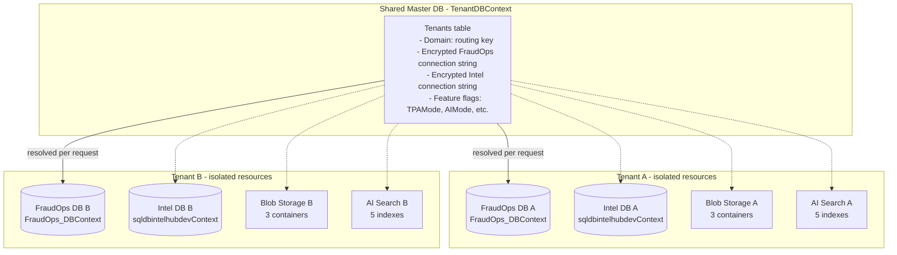
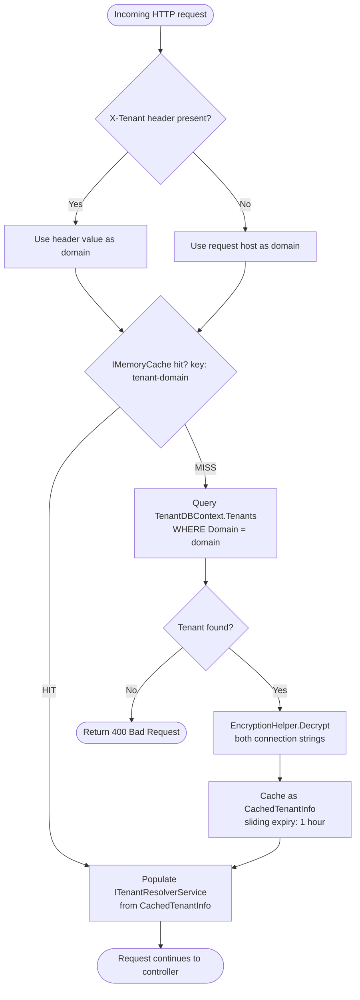
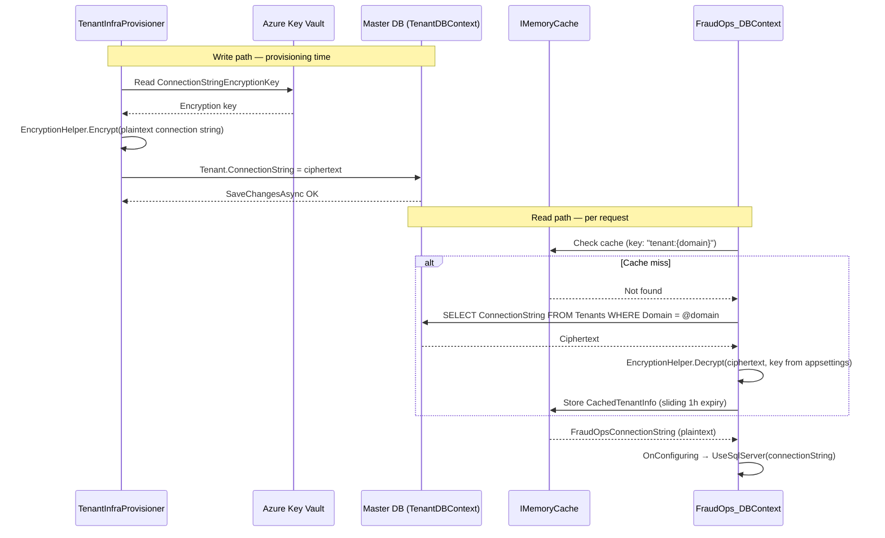
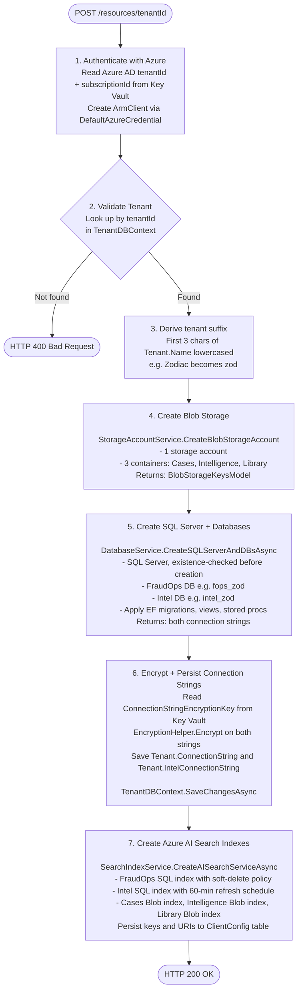
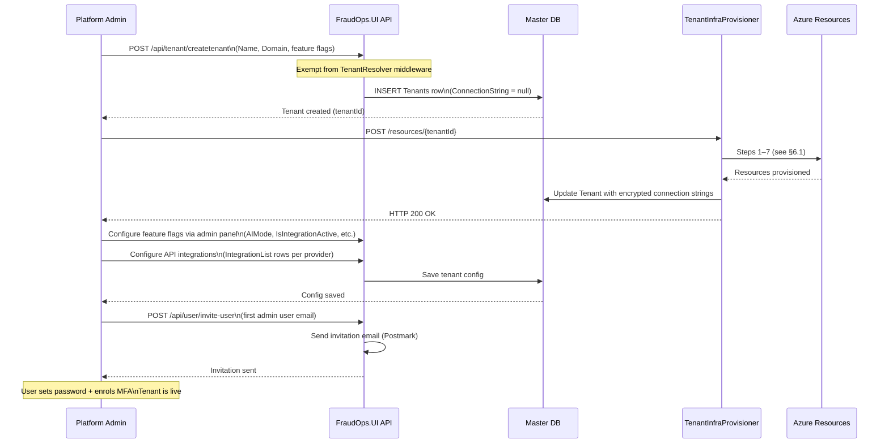

# FraudOps — Multi-Tenancy

> **Version:** 1.1 | **Last updated:** 2026-05-21

## Table of Contents

1. [Overview](#1-overview)
2. [Tenant Resolution](#2-tenant-resolution)
3. [Connection String Lifecycle](#3-connection-string-lifecycle)
4. [Database Isolation](#4-database-isolation)
5. [Per-Tenant Feature Flags](#5-per-tenant-feature-flags)
6. [Tenant Infrastructure Provisioning](#6-tenant-infrastructure-provisioning)
7. [Tenant Onboarding Sequence](#7-tenant-onboarding-sequence)
8. [Endpoints Exempt from Tenant Resolution](#8-endpoints-exempt-from-tenant-resolution)

---

## 1. Overview

FraudOps uses a **database-per-tenant** isolation model. Each tenant has:

- An isolated **FraudOps SQL Server database** (application data: investigations, referrals, parties, screening, workflow)
- An isolated **Intel SQL Server database** (intelligence hub data)
- Isolated **Azure Blob Storage containers** (cases, intelligence, library)
- Dedicated **Azure AI Search indexes** (SQL + Blob)

A shared **master database** (`TenantDBContext`) holds tenant metadata and encrypted connection strings. A shared **Azure Key Vault** holds the encryption key and Azure credentials used during provisioning.



---

## 2. Tenant Resolution

### 2.1 Middleware

**Class:** `TenantResolver` (`FraudOps.UI/Middleware/TenantResolver.cs`)
**Position in pipeline:** After authentication/authorisation, before endpoint execution.

```csharp
public async Task InvokeAsync(HttpContext context, ITenantResolverService tenantResolverService)
```

### 2.2 Resolution Priority

The middleware resolves the tenant identifier from the incoming request in this order:

1. **`X-Tenant` request header** — explicit tenant override (used by integrations and internal tooling)
2. **Request host / subdomain** — `context.Request.Host.Host` (e.g. `acme.fraudops.ai`)
3. **400 Bad Request** — returned if neither yields a tenant identifier

### 2.3 Resolution Flow



### 2.4 Cached Tenant Info

`CachedTenantInfo` (stored in `IMemoryCache`, key `tenant:{domain}`) contains:

```csharp
string FraudOpsConnectionString
string IntelConnectionString
Guid   TenantId
bool   TPAMode
bool   AIMode
string TenantName
bool   EnableCaseNotesSharing
```

Sliding expiration is configured via `ConnectionStringsManagement:CacheDurationHours` (default: 1 hour). Invalidation is not event-driven — tenant config changes take up to 1 hour to propagate without a restart.

---

## 3. Connection String Lifecycle

### 3.1 Storage

Connection strings are stored **encrypted** in the `Tenant` entity columns:

- `Tenant.ConnectionString` — FraudOps database
- `Tenant.IntelConnectionString` — Intel database

Encryption uses AES (via `EncryptionHelper`) with the key sourced from Azure Key Vault secret `ConnectionStringEncryptionKey`.

### 3.2 Write Path (Provisioning) and Read Path (Runtime)



### 3.3 DbContext Injection

`FraudOps_DBContext` and `sqldbintelhubdevContext` are registered as scoped DbContexts. Their `OnConfiguring` override dynamically selects the connection string at query time:

```csharp
protected override void OnConfiguring(DbContextOptionsBuilder optionsBuilder)
{
    // Explicit connection string (e.g. migrations, provisioner)
    if (!optionsBuilder.IsConfigured && !string.IsNullOrEmpty(_connectionString))
        optionsBuilder.UseSqlServer(_connectionString);

    // Tenant-resolved connection string (normal request path)
    if (_tenantResolverService != null &&
        !string.IsNullOrEmpty(_tenantResolverService.ConnectionString))
        optionsBuilder.UseSqlServer(_tenantResolverService.ConnectionString);
}
```

`ITenantResolverService` is scoped, so every request gets its own resolver instance with the correct tenant's connection string. No explicit routing or sharding logic is needed in service or repository code.

### 3.4 Azure Functions (FraudOps.Functions)

Functions do not participate in the HTTP middleware pipeline. `TenantConnectionService` performs direct decryption:

```csharp
Task<string?> GetConnectionStringByTenantIdAsync(Guid tenantId)
// SELECT ConnectionString FROM Tenants WHERE Id = @Id AND IsActive = 1 AND IsDeleted = 0
// → EncryptionHelper.Decrypt(result, _encryptionKey)
```

---

## 4. Database Isolation

### 4.1 Data Segregation

| Scope | Database | DbContext | Isolation level |
| ----- | -------- | --------- | --------------- |
| Cross-tenant (master) | Tenant registry DB | `TenantDBContext` | Shared — one instance, all tenants |
| Per-tenant (application) | FraudOps DB | `FraudOps_DBContext` | Fully isolated — separate SQL Server database per tenant |
| Per-tenant (intelligence) | Intel Hub DB | `sqldbintelhubdevContext` | Fully isolated — separate database per tenant |

### 4.2 What Lives in the Master DB (TenantDBContext)

```text
Tenants                  — tenant registry (name, domain, connection strings, feature flags)
DataProtectionKeys       — ASP.NET Core data protection keys
Integrations             — tenant-level API integration config
IntegrationGroups        — grouping of integrations
TenantSubscriptions      — subscription associations
IntegrationAudits        — audit log for integration calls
Plans                    — subscription plan definitions
Agents                   — AI agent registrations
AgentAudits              — AI agent call audit log
TenantInbounds           — inbound email/message tracking
Subscriptions            — subscription details
MasterDataTables         — shared reference/lookup data
```

### 4.3 What Lives in Each Tenant DB (FraudOps_DBContext)

All application data is fully isolated per-tenant:

- **Identity & access:** `RefreshTokens`, `UserSessions`, `Features`, `Privileges`
- **Core workflow:** `ClaimsReferral`, `Referrals`, `Investigation`, `InvestigationStatus`, `InvestigationParty`, `InvestigationAttachments`
- **Parties:** `InsuredPersonal`, `InsuredCommercial`, `ThirdPartyPersonal`, `ThirdPartyCommercial` and related address/contact tables
- **Intelligence:** `IntelligenceReferral`, `IntelligenceOutcome`, `IntelligenceReport`
- **Screening:** screening result tables
- **Configuration:** `ClientConfig`, `Config`, `TaskType`, `FormFieldConfig`, `ApiConfig`, `IntegrationList` (API keys per provider)
- **Workflow engine:** `Workflow`, `WorkflowNodes`, `WorkflowExecution`, `NodeExecutionLogs`
- **Audit:** `AuditLogs` (automatic via `AspNetCoreHero.EntityFrameworkCore.AuditTrail`)

---

## 5. Per-Tenant Feature Flags

Feature flags are stored on the `Tenant` entity in the master DB and propagated into `ITenantResolverService` and into JWT claims at login:

| Flag | Type | Default | Effect |
| ---- | ---- | ------- | ------ |
| `TPAMode` | bool | `false` | Third-party account mode — alters investigation and referral workflows |
| `AIMode` | bool | `false` | Enables AI agent features (key evidence, objectives, case summary, smart probability) |
| `IsIntegrationActive` | bool | `false` | Enables third-party screening API integrations |
| `EnableCaseNotesSharing` | bool | `true` | Allows case notes to be shared across users within the tenant |
| `IsScreeningEnabled` | bool | — | Controls access to the screening module |
| `IsQuickInvestigation` | bool | — | Enables the quick investigation workflow |
| `IsTrigageSetup` | bool | `false` | Whether triage workflow is configured |
| `ModeOfReceivingReferral` | string | `"MANUAL"` | How the tenant receives referrals (`"MANUAL"` or email-based auto-create) |
| `PreferredMfaProvider` | string | `"Email"` | MFA method: `"Email"`, `"Authenticator"`, or `"None"` |

Flags are injected into JWT claims at token issue time so Angular guards and .NET permission checks can read them without an additional DB call per request.

---

## 6. Tenant Infrastructure Provisioning

Provisioning is handled by `FraudOps.TenantInfraProvisioner` — an HTTP-triggered Azure Function that orchestrates all Azure resource creation for a new tenant.

**Trigger:** `GET / POST /resources/{tenantId:Guid}`

### 6.1 Provisioning Sequence



### 6.2 Idempotency Notes

- SQL Server creation is guarded with an existence check before creation.
- EF migrations are applied via migration runner — applying the same migration twice is safe.
- AI Search index creation is **not** currently idempotent — re-running provisioning for an existing tenant will attempt to recreate indexes. This is a known gap.

### 6.3 State Model

```csharp
CreateSearchIndexesModel
{
    string TenantSuffix              // e.g. "zod"
    string FOpsSqlConnectionString   // plaintext (used within provisioner only)
    string IntelDBSqlConnectionString
    string AzureStorageConnectionString
    Tenant TenantData
}
```

---

## 7. Tenant Onboarding Sequence



---

## 8. Endpoints Exempt from Tenant Resolution

The following endpoints bypass `TenantResolver` because they operate at the platform level or handle callbacks from external systems that cannot provide tenant context:

| Endpoint | Reason |
| -------- | ------ |
| `/api/tenant/createtenant` | Creates the tenant record before any tenant identity exists |
| `/api/tenant/tenantsubscriptions` | Platform-level subscription management |
| `/api/Investigation/ProcessSmsCallback` | SMS provider webhook — no tenant header available |
| `/api/Investigation/CLWebhookResponse` | ClearSpeed webhook callback — no tenant header available |
| `/postmark/inbound` | Postmark inbound email webhook — tenant resolved from email address within the handler |
