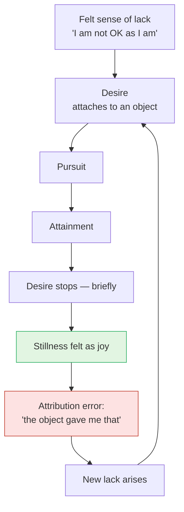

# Day 1 — The Itch Objects Can't Scratch

> **Today's one idea:** Every desire is a disguised desire for fullness (*pūrṇatva*) — and no finite object can permanently supply it.
> **Reading time:** ~35 min · **Prereqs:** none
> **Primary source for today:** Chāndogya Upaniṣad 7.1–7.2 and 7.23–7.24, with Shankara's commentary — Swami Gambhirananda (trans.), *Chāndogya Upaniṣad*, Advaita Ashrama, 1983.

---

## The hook (3 min)

A man walks up to a teacher and recites his qualifications. He has mastered the four Vedas, history and legend, grammar, mathematics, logic, ethics, etymology, astronomy, the science of war, the fine arts. He is, by any standard, the most accomplished person in the room.

Then he says: *"Sir, I am only a knower of texts, not a knower of the Self. I have heard from people like you that one who knows the Self crosses over sorrow. I am in sorrow. Please take me across."*

This is Nārada approaching Sanatkumāra in the seventh chapter of the Chāndogya Upaniṣad (7.1.2–3). The phrase he quotes — तरति शोकमात्मवित्, "the knower of the Self crosses sorrow" — is the whole promise of Vedānta in four words.

Notice what is strange here. Nārada does not lack anything the world can offer. He has knowledge, status, skill. And he is still sorrowful. The Upaniṣad is making a point by choosing *him* rather than a beggar: **the problem is not that he hasn't got enough. The problem survives getting enough.**

You know this from the inside. Today we find out why.

---

## Building the intuition (12 min)

### Thought experiment 1 — the tenth chocolate

You are hungry and someone hands you a square of good chocolate. The first bite is wonderful. Take another. And another. By the tenth square, the same chocolate is neutral; by the twentieth, unpleasant.

The object didn't change. Its sugar, fat and cocoa are identical in square 1 and square 20. Yet the happiness changed completely. So **the happiness was not sitting inside the chocolate** waiting to be extracted. If it were, every square would deliver the same amount.

Now hand the same square to someone who dislikes chocolate. Same object, no happiness. Second confirmation.

### Thought experiment 2 — the delayed train

You are on a platform; the train is twenty minutes late; you are anxious about a meeting. The train arrives. *Relief.* For a moment, everything is fine.

Freeze that moment. What, precisely, is present? Not the meeting (that hasn't happened). Not some new pleasure delivered by the train (it's just a train). What's present is that **the wanting has stopped.** For a few seconds, there is nothing you need to be different. That stillness *is* the happiness.

Then, ten seconds later: "I hope I get a seat." A new want, and the stillness is gone.

### Putting them together

Two observations fall out of the diagram:

1. **The joy coincides with the *absence of wanting*, not with the *presence of the object*.** Square 1 and square 20 differ in how much wanting was satisfied, not in the chocolate.
2. **The loop never closes**, because the thing that started it — the felt sense of lack in "I" — was never touched. The object addressed a symptom; the "I" that feels incomplete walks away unchanged and finds the next object.

So what is it that every desire is *really* after? Run any desire through a chain of "and why do I want that?":

> I want the promotion → to earn more → to feel secure → so I can stop worrying → so I can be at peace with myself.

The chain doesn't end in an object. It ends in a condition of *myself*: being at peace, being complete, being OK as I am. Vedānta's name for that condition is **fullness** — *pūrṇatva*. Every desire is a disguised desire for it.

---

## The formal picture (12 min)

### The four human goals (*puruṣārthas*)

The tradition sorts everything humans pursue into four ends:

| Goal | What it is | Gained by | Limitation |
| --- | --- | --- | --- |
| *Artha* | Security — money, shelter, status, relationships | Action | Finite; can be lost; never "enough" |
| *Kāma* | Pleasure — sensory, aesthetic, intellectual | Action | Diminishes with repetition (the tenth chocolate) |
| *Dharma* | Right living — the order that governs the first two | Action | Its results (merit, a better future) are still finite |
| *Mokṣa* | Freedom — from the sense of lack itself | ? | — |

The first three are all *produced by action*, and the tradition states a blunt rule about anything produced: यत्कृतकं तदनित्यम् — "whatever is made, ends." That's not pessimism; it's bookkeeping. A result that begins in time ends in time.

*Mokṣa* is different in kind, not degree. It is not one more object at the top of the list. It is freedom from the **lack** that drives the whole list. The "?" in the table is deliberate: how *mokṣa* is gained — and whether "gained" is even the right word — is the subject of Days 2 and 4.

### Sanatkumāra's answer: *bhūmā*

After a long ladder of teachings (name, speech, mind, will, … each "greater" than the last), Sanatkumāra gives Nārada the principle (Chāndogya 7.23.1):

> यो वै भूमा तत्सुखम्, नाल्पे सुखमस्ति, भूमैव सुखम्
> "That which is infinite (*bhūmā*) is happiness. There is no happiness in the small (*alpa*). The infinite alone is happiness."

And he defines the infinite (7.24.1):

> "Where one sees nothing else, hears nothing else, knows nothing else — that is the infinite. Where one sees something else, hears something else, knows something else — that is the small. The infinite is immortal; the small is mortal."

Map this back onto the train platform:

- **"Where one sees something else"** = the condition of desire: there is *me* here and the *thing I need* over there. Two. A gap.
- **"Where one sees nothing else"** = the moment the wanting stops: no "other" that I need. The gap closes — and joy appears.

Sanatkumāra's claim, stated precisely: **happiness is what the absence of the gap feels like.** Finite objects close the gap *temporarily* by satisfying one desire; but the small (*alpa*) is always "mortal" — the gap reopens.

### The radical hypothesis — stated, not yet earned

Here is where Vedānta goes further than any psychology of desire. The Bṛhadāraṇyaka (4.3.32) says of the Self's own bliss: *"on a particle of this bliss, other beings live."* Vidyāraṇya develops this in Pañcadaśī ch. 15 (*Viṣayānanda*, "the bliss of objects"): the joy you feel when a desire is satisfied is not manufactured by the object; it is **your own nature showing through a mind that has, for a moment, stopped agitating.**

If that's true, then the gap between "me as I am" and "me as full" is not a real gap. It's a misjudgment about what "me" is. Fixing it would require not more objects, but *knowledge*.

You are not asked to believe that today. You are asked only to see that it is the hypothesis the next 38 days will test — and that today's evidence (the chocolate, the train, Nārada) is at least *consistent* with it.

> **Convergence — Sufi & Bhakti voices**
>
> Rūmī opens his *Masnavī* with a reed flute: "Listen to this reed how it complains: it is telling a tale of separations" (*Masnavī* I.1, Nicholson trans.). Cut from its reed-bed, it laments; and, in paraphrase of the lines that follow, whoever is left far from his source longs for the time of union (I.4). Read through today's lens, the reed's cry is Sanatkumāra's "where one sees something else" — the gap — and the longing itself is evidence of a wholeness felt as lost: [*pūrṇatva*](../../../glossary.md), sought under another name.
>
> Bhakti calls this ache *viraha* (love-in-separation). In songs attributed to Mīrābāī she is, in paraphrase, mad with a pain no one else understands, wandering until her dark Lord comes as the only physician who can cure it.
>
> *Where they differ:* for Rūmī and Mīrā the longing is for a Beloved — God, or Mīrā's Kṛṣṇa — to be met in union, whereas today's diagnosis says the longing is at root for one's own fullness, which Advaita will identify with the seeker's own nature ([Day 4](./day-04-the-tenth-man.md)).

---

## Where it breaks / what it is not (4 min)

**"So desire is bad and I should renounce everything."** No. The Gītā has Kṛṣṇa say *"I am desire that is not opposed to dharma"* (7.11). The diagnosis is not that desire is sinful; it's that desire is *misdirected* — it asks a finite thing to deliver an infinite result. Enjoy the chocolate. Just stop asking it to complete you.

**"Objects give no pleasure at all."** Also no. Objects genuinely *occasion* joy — the way a key occasions the opening of a door. The claim is about where the joy comes from, not whether it occurs.

**"This is just hedonic adaptation."** Psychology does document the pattern (the classic Brickman, Coates & Janoff-Bulman 1978 study of lottery winners returning to baseline). But psychology stops at the *pattern*. Vedānta makes a further claim about the *source* of the joy (your own nature) and therefore about the *remedy* (knowledge). Those claims must be earned — they are not implied by the pattern.

**False friend from Buddhism.** You'll recognise *taṇhā* (craving) leading to *dukkha* (unsatisfactoriness). The *diagnosis* largely converges. The *conclusion* diverges: Buddhism typically concludes there is no fixed self that could be "full"; Advaita concludes the Self *is* the fullness that was sought. Hold that difference lightly for now — it resurfaces in the capstone as an objection you'll answer.

**"Then I'll just stop wanting."** The wish to stop wanting is itself a wanting. Suppression keeps the loop running with a new object (desirelessness). The route this course takes is understanding, not suppression.

---

## Try it yourself (8 min)

### 1. Retrieval first

Close this page. In one or two sentences, from memory: *What is every desire actually after, and why can no object deliver it permanently?* Write it down before opening the page again.

Hint

Think of the train platform. What was present in the moment of relief?

Model answer

Every desire is ultimately after fullness — being OK/complete as I am. Objects can only bring that briefly, by temporarily stopping one particular wanting; the joy felt is the stillness of not-wanting, not something inside the object. And because the "I" that feels incomplete is never addressed, a new lack arises and the loop continues. (If you also mentioned "finite things end" — यत्कृतकं तदनित्यम् — good.)

### 2. Direct application — your own desire audit

Pick **three desires you actually have this week** (not hypothetical ones — something you're working toward, waiting for, or worrying about). For each, write a "why chain": *I want X → because → because → …* until it stops. Then answer: at the end of each chain, is there an object, or a condition of yourself?

Hint

Be honest at each step; stop only when a further "why?" feels absurd ("Why do you want to be at peace?" "…I just do").

What to look for

Almost every chain terminates in a condition of the self — security, ease, being loved, being enough, peace. Typical example: 
<em>Finish the project → so the client is happy → so my reputation is safe → so I don't have to worry → so I can relax and feel OK.</em> 
Two things to notice: (a) the terminal point is the same across very different desires — that sameness is <em>pūrṇatva</em> wearing different costumes; (b) in each case the object is a <em>route</em> to the condition, chosen because you believe it will produce it. If one of your chains genuinely ended in an object ("I want the chocolate because I want the chocolate"), ask: what is the experience you are anticipating? You'll usually find it is a brief cessation of craving.

### 3. Stretch — the puzzle of deep sleep

Everyone looks forward to deep, dreamless sleep, and on waking says "I slept happily." Yet in deep sleep there are no objects at all — no chocolate, no promotion, no train. Using today's model and Chāndogya 7.24.1, explain why deep sleep is enjoyed. What does this suggest about where happiness comes from?

Hint

Re-read Sanatkumāra's definition: "where one sees nothing else…". In deep sleep, is there any "other" you need?

Worked answer

In deep sleep there is no "second thing" — no object over there that I need — so there is no gap and no wanting. On the model, joy = absence of the gap, so deep sleep should be pleasant even with zero objects, and it is. This is strong evidence that happiness does not originate in objects: the experience richest in happiness-without-agitation contains no objects at all. (Caution — don't over-extend: deep sleep is not liberation, because the ignorance that produces the gap returns on waking. You'll see exactly why on Day 8.)

**Transfer — apply it:**

> Name one situation in your work or daily life this week where you're expecting an outcome to "finally" make things OK — a launch, a review, a purchase, a conversation. Write one concrete sentence: *the input* (the outcome you're waiting for), *what today's idea does to it* (identifies the condition of self you actually want from it), and *the output* (what you would do differently if you stopped asking the outcome to complete you). If nothing comes to mind in 60 seconds, re-read the hook and try again.

---

## Connect it back

There is no yesterday on Day 1 — so connect it to your own history instead: every major thing you have wanted and gained left you, after an interval, in the same place. Today gave that pattern a mechanism (the gap and its brief closing) and a name for what you were really after (*pūrṇatva*). Tomorrow, the Kaṭha Upaniṣad puts a teenager in front of Death and offers him every finite good there is — and shows what it looks like to choose knowingly.

**Sharp question:** *If the joy of a satisfied desire is the stillness of not-wanting, what exactly is the object contributing?*

---

## Suggested readings for today

**Required if you have 15 extra minutes:** Chāndogya Upaniṣad **7.1.1–7.1.3** (Nārada's confession) and **7.23.1–7.24.1** (*bhūmā*) in Gambhirananda's translation — read the verses and Shankara's short comments on them. You'll see how Shankara insists the "infinite" is not a large object but the absence of division.

**If you want the deep version:**
- Swami Swahananda (trans.), *Pañcadaśī*, **chapter 15 (Viṣayānanda)** — Vidyāraṇya's argument that the joy from objects is a reflection of the Self's bliss in a quieted mind. The first dozen verses are enough today.
- Swami Dayananda Saraswati, *Introduction to Vedanta* (Vision Books, 1989), **the opening chapters** on "the fundamental problem" — the clearest modern statement of the human problem as a sense of limitation that no achievement removes.
- Swami Vivekananda, *Jnana Yoga* (Complete Works, Vol. 2), lecture **"The Real Nature of Man"** — a rhetorical, inspiring version of the same diagnosis for a Western audience.
- Jalāl al-Dīn Rūmī, *The Masnavi, Book One*, trans. Jawid Mojaddedi (Oxford World's Classics, 2004), **the prologue ("The Song of the Reed")** — the reed's lament in a careful verse translation; read it as a phenomenology of longing, then ask what exactly the reed-bed stands for.

---

## Navigation

← **Back to course overview:** [README](../../../README.md)
→ **Next:** [Day 2 — Nachiketa's Choice](./day-02-nachiketas-choice.md)
