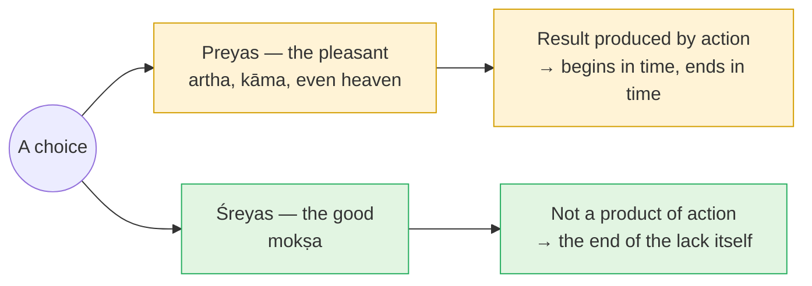

# Day 2 — Nachiketa's Choice: *Preyas* vs *Śreyas*

> **Today's one idea:** The pleasant (*preyas*) and the good (*śreyas*) diverge — and maturity is choosing the good *knowingly*, because whatever action produces, ends.
> **Reading time:** ~35 min · **Prereqs:** [Day 1](./day-01-the-itch-objects-cant-scratch.md)
> **Primary source for today:** Kaṭha Upaniṣad 1.1–1.2, with Shankara's commentary — Swami Gambhirananda (trans.), *Eight Upaniṣads*, Vol. 1, Advaita Ashrama, 1957.
> **Before you start:** Without looking — *what is every desire actually after, and what was the joy on the train platform made of?*

---

## The hook (3 min)

A father is performing a great sacrifice in which he is supposed to give away everything he owns. His son, Nachiketas, watches the gifts go out: old cows that have "drunk their last water, eaten their last grass, given their last milk." The father is keeping the good stuff and giving away the useless — a fake renunciation.

The boy, troubled, asks: *"Father, to whom will you give me?"* Ignored, he asks again, and again. Finally the father snaps: *"To Death I give you!"*

So Nachiketas goes to the house of Yama, the lord of death. Yama is away. The boy waits at the door for three nights without food. When Yama returns, ashamed at having neglected a guest, he offers three boons — one for each night (Kaṭha 1.1.1–9).

The first two boons are reasonable: that his father be at peace with him; and the knowledge of a fire-ritual that leads to heaven. Yama grants both easily.

The third: *"When a person dies, some say 'he is', others say 'he is not'. Teach me this."*

Yama flinches. *Ask for anything else.* And then he makes the most generous offer in all of literature.

---

## Building the intuition (12 min)

### The offer

Yama's counter-offer (Kaṭha 1.1.23–25), paraphrased:

> Ask for sons and grandsons who live a hundred years. Cattle, elephants, gold, horses. Land as wide as you want, and as many years of life as you wish. Wealth and long life together. Rule over the whole earth. Women of heaven with chariots and music, such as no mortal can have — enjoy them all. **But don't ask me about death.**

Put yourself in the boy's place with the Day 1 lens on. Every item on that list is *artha* or *kāma* — security and pleasure — scaled to the maximum. Yama is offering the entire right-hand side of the Day 1 loop, infinitely refilled.

### The reply

Nachiketas answers (1.1.26–27):

> *"These last till tomorrow (śvobhāvāḥ), O Death, and they wear out the vigour of the senses. Even the longest life is short. Keep your horses, your dances and songs. **No human being is ever satisfied by wealth** (na vittena tarpaṇīyo manuṣyaḥ)."*

That last line is Day 1 in seven words. The boy has seen the loop. He has seen that the *quantity* of objects doesn't change its *structure* — the tenth chocolate is the tenth chocolate whether you have ten or ten million.

### The two paths

Yama, now delighted — the offer was a test — begins the teaching (1.2.1–2):

> *"The good (śreyas) is one thing; the pleasant (preyas) is another. Both, with different aims, bind a person. Of the two, it is well for him who takes the good; he who chooses the pleasant misses the goal.*
> *Both the good and the pleasant approach a person. The wise one (dhīra), having examined them thoroughly, distinguishes them. The wise chooses the good over the pleasant; the dull chooses the pleasant for the sake of getting and keeping (yoga-kṣema)."*

Picture a fork in a path, with two guides standing at it. Both are friendly. Both are *always* there — "both approach a person" — at every choice, large or small. One offers what feels good now; the other offers what *is* good finally. Most of the time they point the same way and there's no drama. The drama is the moments when they split.

---

## The formal picture (12 min)

### Defining the terms

- ***Preyas*** — whatever pleases the person *as they currently take themselves to be*: wealth, pleasure, status, and — this is the surprise — **heaven itself**. The second boon, the heaven-ritual, is *preyas* too. Shankara is explicit that every result of action, however exalted, belongs on this side.
- ***Śreyas*** — the ultimate good: *mokṣa*, freedom from the sense of lack.
- ***Dhīra*** — the wise person who examines (*samparītya*) the two and chooses *śreyas*.
- ***Yoga-kṣema*** — "acquiring and preserving": the life-project of getting what you lack and keeping what you've got. The dull person's whole orientation.

### Why the line falls exactly there — the logic of the uncreated

Why must heaven sit on the *preyas* side? The Muṇḍaka Upaniṣad (1.2.12) supplies the principle:

> *parīkṣya lokān karmacitān brāhmaṇo nirvedam āyān, nāsty akṛtaḥ kṛtena*
> "Having examined the worlds gained by action, let the seeker arrive at dispassion: **the uncreated is not gained by the created.**"

Lay it out as an argument:

1. Everything gained by action is produced (*kṛta*). — *definition*
2. Whatever is produced begins in time, therefore ends in time (*yat kṛtakaṃ tad anityam*). — *Day 1's bookkeeping rule*
3. What every desire seeks is a fullness that does not end (otherwise the lack returns — Day 1's loop). — *Day 1*
4. ∴ No action, however great, can produce what desire is really seeking.
5. ∴ If that fullness can be had at all, it must be something *uncreated* (*akṛta*) — not produced but in some sense already there.

Step 5 is the hinge of the entire course. It is why the Kaṭha's teaching, after this chapter, turns from *getting* to *knowing*: it goes on to describe the Self that "is not born, nor does it die" (1.2.18). Day 4 will make precise what it means to "gain" something already present.

### Why "knowingly" matters

The verse doesn't say the wise person *suppresses* the pleasant. It says the wise person **examines** (*samparītya*) both and **distinguishes** (*vivinakti*) them. The choice is downstream of seeing. A person who renounces the pleasant without having *seen* that it can't deliver will be pulled back the moment the right object appears. A person who has seen clearly doesn't need willpower in the same way — the pleasant simply stops being mistaken for the good.

That is why Yama tested the boy rather than simply teaching him: an offer refused *with understanding* is evidence of readiness. Tomorrow, this "seeing that discriminates" gets its technical name: *viveka*.

---

## Where it breaks / what it is not (4 min)

**"*Preyas* is bad."** No — it's *finite*. The pleasant isn't evil; it is mis-sold when you expect it to complete you. Nachiketas even accepts the first two boons. A householder seeking security and pleasure within dharma is living rightly; they've just not yet asked the third question.

**"Choosing *śreyas* means a life of grim denial."** The Gītā's version of this (2.42–44) criticises those who are "full of desires, intent on heaven", not those who eat lunch. *Śreyas* is a re-ordering of priorities: the deepest want is identified correctly, and everything else takes its proper — finite — place.

**"*Śreyas* is just a bigger, better *preyas*."** This is the most important confusion to avoid. If *mokṣa* were a supreme pleasure *produced* by spiritual effort, step 2 of the argument would apply to it: it would end. *Śreyas* differs in *kind*. Keep this in mind whenever any teacher (ancient or modern) describes liberation as an experience you attain — Day 23 and Day 30 return to it.

**"Heaven is on the *preyas* side? That's a strange religion."** Exactly the point. The Upaniṣads are unusually honest: their own ritual sections promise heaven, and the Upaniṣads themselves say this is still the small (*alpa*, Day 1). Advaita's critique of finite goods includes religious ones.

---

## Try it yourself (8 min)

### 1. Retrieval first

Close the page. From memory, write: (a) the difference between *preyas* and *śreyas* in one sentence each; (b) the one-line principle from the Muṇḍaka that explains why heaven is *preyas*.

Hint

"The uncreated is not gained by…"

Model answer

(a) <em>Preyas</em> is what pleases the finite person — every result of action, including heaven; <em>śreyas</em> is the ultimate good, freedom from the lack itself (<em>mokṣa</em>). (b) "The uncreated is not gained by the created" (Muṇḍaka 1.2.12) — whatever action produces begins and ends in time, so it cannot be the unending fullness desire seeks.

### 2. Direct application — find your fork

Recall a **real decision from the last month** where the pleasant and the good pointed in different directions (a reaction you indulged or held back, an evening spent one way rather than another, a conversation you avoided or had). Write: what was the *preyas* option, what was the *śreyas* option, which did you choose, and — the important part — **did you choose after seeing clearly (*samparītya*), or by reflex?**

Hint

Small decisions count. The fork is "always approaching" — it's not reserved for life-changing moments.

What a good answer looks like

<em>"Preyas: firing back a sharp reply to a colleague's email — satisfying. Śreyas: waiting an hour and replying calmly — better for the work and for my own peace. I chose preyas, by reflex; I only 'saw' the fork afterwards."</em> 
The diagnostic value is in the last clause. If most of your choices of <em>śreyas</em> came from willpower rather than clear seeing, the Kaṭha predicts they'll be fragile. Tomorrow's page names the capacities that make clear seeing more frequent.

### 3. Stretch — Yama's test, reversed

Yama offers everything finite to see if Nachiketas will trade the question for it. Suppose instead Yama had offered: *"I'll give you a permanent, blissful meditative state — no thoughts, no suffering, lasting ten thousand years. Just don't ask about the Self."* Using today's argument, should the boy accept? Why or why not?

Hint

Apply steps 1–2 of the argument. Is a "state lasting ten thousand years" created or uncreated?

Worked answer

He should refuse. A state that begins at some time and lasts ten thousand years is produced, so by step 2 it ends — it is <em>preyas</em>, however refined. The question about the Self is a question about something that "is not born and does not die" (1.2.18) — the uncreated. No amount of created bliss substitutes for knowing that. This is precisely the confusion the course will keep guarding against: a long or deep meditative experience is valuable preparation (Day 23), but it is still on the <em>preyas</em> side of the fork if taken as the goal.

**Transfer — apply it:**

> Name one recurring "fork" in your own week — a work habit, a use of evenings, a reaction pattern with someone close. Write one sentence: *the input* (the situation as it arises), *what today's idea does to it* (separates the pleasant from the good and asks you to examine before choosing), and *the output* (the specific choice you'd make if you saw it clearly). If nothing comes to mind in 60 seconds, re-read the hook and try again.

---

## Connect it back

Yesterday showed *why* no object can complete you: the joy is the stillness of not-wanting, and the lack returns. Today turned that diagnosis into a choice and gave the choice a principle — *the uncreated is not gained by the created* — which forces the radical conclusion that whatever fullness is possible must already, somehow, be there. Tomorrow asks what capacities a person needs so that this choice is made by clear seeing rather than by gritted teeth.

**Sharp question:** *If the goal is uncreated, what exactly is the role of all spiritual effort?*

---

## Suggested readings for today

**Required if you have 15 extra minutes:** Kaṭha Upaniṣad **1.1.20–1.2.6** in Gambhirananda's *Eight Upaniṣads*, Vol. 1 — the third boon, Yama's temptations, Nachiketas's refusal, and the opening of the *śreyas/preyas* teaching. Read Shankara's comment on 1.2.2, where he unpacks *samparītya* ("having examined thoroughly").

**If you want the deep version:**
- Muṇḍaka Upaniṣad **1.2.7–1.2.13** (Gambhirananda, *Eight Upaniṣads*, Vol. 2) — "frail rafts are these sacrifices" — the Upaniṣad's own critique of ritual results, culminating in 1.2.12 and the instruction to approach a teacher.
- Bhagavad Gītā **2.42–2.46** with Shankara's commentary (Gambhirananda, *Bhagavad Gītā*, 1984) — Kṛṣṇa's critique of heaven-seeking, in the same spirit as Kaṭha 1.2.

---

## Navigation

← **Previous:** [Day 1 — The Itch Objects Can't Scratch](./day-01-the-itch-objects-cant-scratch.md)
→ **Next:** [Day 3 — The Four Qualifications](./day-03-the-four-qualifications.md)
