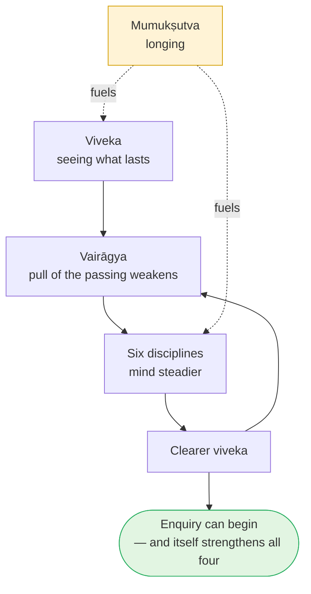

# Day 3 — The Four Qualifications (*Sādhana Catuṣṭaya*)

> **Today's one idea:** The teaching lands only in a prepared mind — and the preparation is four capacities (discrimination, dispassion, six disciplines, longing) that tune the instrument of knowing, not earn the goal.
> **Reading time:** ~35 min · **Prereqs:** [Day 1](./day-01-the-itch-objects-cant-scratch.md), [Day 2](./day-02-nachiketas-choice.md)
> **Primary source for today:** Shankara, *Brahma-Sūtra-Bhāṣya* 1.1.1 — Swami Gambhirananda (trans.), Advaita Ashrama, 1965.
> **Before you start:** Without looking — *why must heaven sit on the preyas side of Nachiketa's fork? State the Muṇḍaka principle in your own words.*

---

## The hook (3 min)

Two people sit in the same lecture hall. The teacher says a single sentence: *"You are not the body; you are the awareness in which the body appears."*

The first person writes it down, nods, and checks their phone. The second person goes very still. Something in them recognises it — they will think about that sentence for a week.

Same words. Same speaker. Same day. Wildly different results.

Yesterday, Yama didn't teach Nachiketas until he had *tested* him. And the verse right after yesterday's Muṇḍaka principle (1.2.13) says the teacher should give this knowledge *"to one who has approached properly, whose mind is calm, who is self-controlled."* The tradition is insisting on something we don't usually believe about knowledge: **whether a true sentence works depends on the listener as much as on the sentence.** Why would that be?

---

## Building the intuition (12 min)

### The telescope

Imagine trying to see a faint star. The star is there — always has been, didn't have to be created (recall Day 2: *the uncreated*). You don't need to *make* the star. But you do need four things from your telescope:

| Telescope needs to… | Because otherwise… | Name in the tradition |
| --- | --- | --- |
| Be pointed at the right patch of sky | You'll stare at a streetlight and think it's the star | **Viveka** — discrimination |
| Not keep swinging off toward brighter, closer things | The moment you find the star, a passing plane pulls you away | **Vairāgya** — dispassion |
| Sit on a steady mount | Every tremor blurs the image | **Śamādi-ṣaṭka-sampatti** — the six disciplines |
| Be used by someone who actually wants to see | Nobody spends a cold night at an eyepiece for something they don't care about | **Mumukṣutva** — longing for freedom |

Notice what this analogy *does* and *doesn't* claim:

- It **doesn't** say the four qualities create the star. They create nothing. They remove the conditions under which you'd fail to see what is already there.
- It **does** say that knowledge — even of something always present — needs a fit instrument. A shaky, misaimed, distracted telescope fails to see a star that is shining right there.

The instrument here is your mind. And the "star" — as Day 4 and Day 5 will make precise — is not even far away.

### The two listeners again

Re-read the hook. The first listener's telescope was aimed elsewhere (no *viveka* about what matters), kept swinging toward the phone (no *vairāgya*), was jittery (no *śama*), and they didn't particularly want to see (no *mumukṣutva*). The sentence was true; the instrument couldn't receive it.

---

## The formal picture (12 min)

### Where the list comes from

The Brahma Sūtras begin: *athāto brahma-jijñāsā* — "**Now, therefore**, the enquiry into Brahman." Shankara asks: "now" — *after what?* The rival school (Pūrva Mīmāṃsā) said: after completing the study of Vedic ritual. Shankara disagrees. Enquiry into Brahman can begin, he says (BSBh 1.1.1), after a person has acquired four things:

1. ***Nitya-anitya-vastu-viveka*** — discrimination between the eternal and the non-eternal. *Day 1–2 as a capacity:* the clear seeing that all produced things end and that the fullness you seek is not among them.
2. ***Iha-amutra-artha-bhoga-virāga*** — dispassion toward enjoying results here (*iha*) and hereafter (*amutra*). *Day 2 as a capacity:* the pleasant, including heaven, no longer pulls as if it were the good.
3. ***Śama-dama-ādi-sādhana-sampat*** — the wealth of the six disciplines, starting with *śama* and *dama* (listed below).
4. ***Mumukṣutva*** — desire for liberation.

### The six disciplines (*ṣaṭka-sampatti*)

The later manuals (*Tattva Bodha*, *Vivekacūḍāmaṇi*) unpack item 3:

| Discipline | Plain meaning | What it does to the "telescope" |
| --- | --- | --- |
| ***Śama*** | Mastery of the mind's reactions | Stops internal shaking |
| ***Dama*** | Restraint of the senses | Stops the eye being dragged outward |
| ***Uparati*** | Withdrawal / settledness in one's own duty | Stops looking for distraction; does what's in front of it |
| ***Titikṣā*** | Forbearance of opposites (heat/cold, praise/blame) | Steady under external bumps |
| ***Śraddhā*** | Provisional trust in teacher and teaching | Keeps pointing where told long enough to verify |
| ***Samādhāna*** | Focus on the goal | Holds the target |

(On *uparati* the texts differ: *Tattva Bodha* defines it as doing one's own duty (*svadharma*); *Vivekacūḍāmaṇi* as not depending on external objects. They converge: both describe a mind that has stopped hunting.)

### How the four feed each other

They are not four separate exams. They are one system with feedback:

Two points about this loop:

- **Viveka comes first logically** — dispassion that isn't based on seeing is just suppression, and it rebounds (Day 2: "*knowingly*").
- **Mumukṣutva is the fuel.** *Shubheccha*, this module's stage, is essentially *mumukṣutva* becoming the dominant desire, supported by enough *viveka* and *vairāgya* that the longing is for the right thing.

### A note on the text

*Vivekacūḍāmaṇi*, which you have probably read, gives the most famous treatment of these four. It is traditionally attributed to Shankara, but most modern scholars (following criteria developed by Paul Hacker and Sengaku Mayeda) doubt that he wrote it. This course still uses it — the content on the four qualifications is fully consistent with Shankara's undisputed BSBh 1.1.1 — but cites BSBh as the primary source. That is the convention we'll follow throughout: when a text's authorship is disputed, we anchor on the undisputed source and use the popular one as a commentary.

---

## Where it breaks / what it is not (4 min)

**"I must perfect all four before I'm allowed to start."** No one would ever start. The tradition calls them prerequisites, but in practice they're graded and they grow *with* enquiry — the loop's last arrow. The real test is whether *mumukṣutva* is strong enough that you keep showing up. You are doing this course; that's evidence.

**"*Vairāgya* means disliking the world."** Aversion (*dveṣa*) is attachment in reverse — it still says the object has power over you. Dispassion is the object losing its *claim to complete you*, not becoming hateful. A dispassionate person can still enjoy a meal; they just don't need it to be anything more than a meal.

**"*Śraddhā* means blind faith."** It means *provisional* trust: pointing the telescope where the experienced observer says, long enough to check for yourself. It is a method of investigation, not a substitute for it. Faith that forbids verification would contradict the whole project, which ends in *knowing*.

**"*Mumukṣutva* is the one desire that's safe to cultivate."** It is the right desire to cultivate *now*. But note: it is still a desire, assuming "I am bound and must become free." Later texts (Day 34's Aṣṭāvakra) will point out that this assumption is itself part of the misunderstanding. A ladder you'll eventually not need is still the right ladder today.

**"These are ethical rules."** They overlap with ethics, but their rationale is epistemic: they are conditions for *seeing*, as a steady mount is a condition for astronomy.

---

## Try it yourself (8 min)

### 1. Retrieval first

Close the page. From memory, list the four qualifications and the six disciplines. Then, in one sentence: *what do they do, and what do they not do?*

Hint

Telescope. And: does the telescope make the star?

Model answer

Four: <em>viveka</em> (discrimination of lasting/passing), <em>vairāgya</em> (dispassion toward results here and hereafter), <em>śamādi-ṣaṭka-sampatti</em> (the six: <em>śama</em>, <em>dama</em>, <em>uparati</em>, <em>titikṣā</em>, <em>śraddhā</em>, <em>samādhāna</em>), <em>mumukṣutva</em> (longing for freedom). They prepare the mind as an instrument so the teaching can be received; they do not produce the goal, which is already present (uncreated, Day 2).

### 2. Direct application — calibrate your telescope

Rate yourself 0–5 on each of the four (and, if you like, each of the six). **For every rating, write one concrete piece of evidence from the past two weeks** — a specific moment, not a general impression. Then name the *single weakest* capacity and one small, specific practice to strengthen it over the next 10 days.

Hint

"Evidence" means something like: "Tuesday I spent 40 minutes on my phone instead of my practice" — not "I'm sometimes distracted".

What a good answer looks like

<em>Viveka 3 — I saw clearly on Sunday that wanting the new laptop was the Day 1 loop, and dropped it. Vairāgya 2 — but I spent two evenings browsing for it anyway. Titikṣā 2 — snapped at my partner when tired on Thursday. Śraddhā 4 — I keep returning to the texts even when they don't make sense yet. Mumukṣutva 4 — I'm doing this course daily.</em> 
<strong>Weakest:</strong> <em>titikṣā</em>. <strong>Practice:</strong> when I notice irritation, name it silently ("irritation") and wait one breath before responding. 
The aim isn't a high score — it's an honest map. Keep this; you'll revisit it on Day 24 when the "thinning" practices arrive.

### 3. Stretch — the apparent contradiction

A sceptic says: *"Advaita claims you are already free and full. Then it demands four qualifications before you can know it. If I'm already free, why do I need qualifications? Either I'm free or I'm not."* Answer using the telescope analogy *and* Day 2's distinction between the created and the uncreated.

Hint

Separate two things: the <em>fact</em> and the <em>knowing of the fact</em>. Which one do the qualifications affect?

Worked answer

The sceptic merges two things. The <em>fact</em> — that you are already full — is uncreated and needs nothing (the star doesn't need the telescope). The <em>knowledge</em> of the fact happens in a mind, and a mind that's misaimed, restless and uninterested fails to know even what is present (the telescope fails to show a star that is shining). The qualifications act only on the instrument, never on the fact. So there is no contradiction: "you are free" is a claim about the fact; "you need qualifications" is a claim about the knowing. Tomorrow's page sharpens this: the problem is ignorance, and only knowledge — received by a fit mind — removes ignorance.

**Transfer — apply it:**

> Name one area of your work or life where you've received a true piece of advice or feedback many times but it "didn't land" until you were ready. Write one sentence: *the input* (the advice), *what today's idea does to it* (identifies which of the four capacities was missing in you at the time), and *the output* (what changed that finally let it land). If nothing comes to mind in 60 seconds, re-read the hook and try again.

---

## Connect it back

Day 1 gave the diagnosis (every desire seeks fullness); Day 2 gave the choice (the good over the pleasant, made knowingly) and the principle that the goal is uncreated. Today named the capacities that let that choice be made by seeing rather than by willpower — and clarified that they work on the *knower*, not on the goal. Tomorrow tells the story that the whole tradition uses to explain what kind of "gain" liberation actually is: the Tenth Man.

**Sharp question:** *If the qualifications only tune the instrument, what is the thing that, received by a tuned instrument, actually removes the problem?*

---

## Suggested readings for today

**Required if you have 15 extra minutes:** Shankara's *Brahma-Sūtra-Bhāṣya* on **sūtra 1.1.1** (Gambhirananda trans.) — read the passage where he explains *atha* ("now") and lists the four qualifications. Notice his argument against making ritual study the prerequisite: it is Day 2's logic applied to the sequence of spiritual life.

**If you want the deep version:**
- *Vivekacūḍāmaṇi*, the verses defining the four qualifications and six disciplines (**verses 19–27** in Madhavananda's numbering: v. 19 lists the four, vv. 20–27 define each — *dama* and *uparati* share v. 23) — the most detailed classical definitions; compare its *uparati* with *Tattva Bodha*'s.
- Swami Paramarthananda, **Tattva Bodha lectures** (opening talks, on *sādhana-catuṣṭaya*) — a patient, practical unpacking of each discipline with modern examples.
- Sengaku Mayeda, *A Thousand Teachings*, **Introduction** (the section on Shankara's authentic works) — how scholars decide what Shankara wrote, and why *Vivekacūḍāmaṇi* is doubted.

---

## Navigation

← **Previous:** [Day 2 — Nachiketa's Choice](./day-02-nachiketas-choice.md)
→ **Next:** [Day 4 — The Tenth Man](./day-04-the-tenth-man.md)
