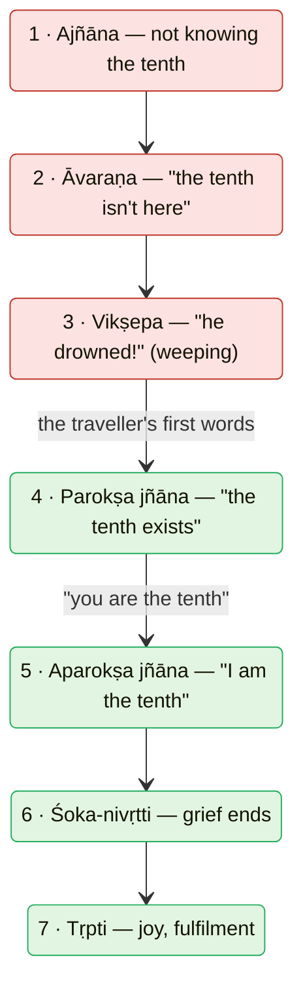

# Day 4 — The Tenth Man

> **Today's one idea:** Liberation gains nothing new — it ends ignorance of what is already present, and only a *means of knowledge* (*pramāṇa*) can do that.
> **Reading time:** ~38 min · **Prereqs:** [Day 3](./day-03-the-four-qualifications.md)
> **Primary source for today:** Vidyāraṇya, *Pañcadaśī*, ch. 7 (*Tṛpti-dīpa*) — Swami Swahananda (trans.), Sri Ramakrishna Math, 1967.
> **Before you start:** Without looking — *name the four qualifications, and explain in one sentence why needing them does not contradict "you are already free".*

---

## The hook (3 min)

Ten students set out on a pilgrimage. They ford a fast river, and on the far bank their leader, anxious, counts heads to make sure no one was swept away.

*One, two, three … nine.*

He counts again. Nine. Another man counts. Nine. Each of them, in turn, counts the other nine — and forgets to count himself. They are now certain: one of them has drowned. They sit on the bank and weep.

A traveller walks by and asks what's wrong. "We were ten; now we are nine. Our friend is drowned." The traveller looks at them and says: *"No — the tenth is here."* They stop weeping, half-hopeful: he seems trustworthy, but where?

Then he turns to the leader. *"Count again."* The leader counts nine. The traveller taps him on the chest: *"Daśamas tvam asi — **you** are the tenth."*

And in that instant, it's over. No one went into the river. No one was found. Nothing was gained. And yet the grief has ended completely.

This story is the course's spine. Every remaining day is, in one way or another, a lesson in counting correctly.

---

## Building the intuition (12 min)

### What did the traveller actually give them?

Go through the story slowly and ask what changed at each moment:

- Was a tenth man **produced**? No — he existed the whole time.
- Was he **reached**, brought back from somewhere? No — he was never anywhere else.
- Was he **changed** or **improved**? No — the leader after the tap is the same man as before.
- Was something **removed from** him? No.

The *only* thing that changed was a piece of knowledge. Before: "the tenth is missing." After: "I am the tenth." And yet that change was enough to end the grief entirely.

Now notice the other strange thing: **no amount of action would have helped.** Diving into the river to search — useless, he's not there. Praying for the tenth man's return — useless, he never left. Meditating to calm the grief — helpful for the nerves, but when they stopped meditating the count would still be nine. The problem was made of ignorance, and *only knowledge* touches ignorance. Darkness isn't removed by pushing it out with a broom; it's removed by switching on a light.

### Why did the leader need a traveller at all?

Here's the subtle part. The leader *had* everything he needed: eyes, the ability to count, and himself, fully present. Why couldn't he just see it?

Because the very instrument he was using — counting what he could see in front of him — was structurally unable to include the one doing the counting. His eyes pointed outward. The counter is never among the counted.

He needed **a different kind of instrument**: words from someone outside his blind spot, pointing back at him. *"You are the tenth"* didn't tell him about a new object; it redirected his attention to the subject he was overlooking. Day 1's Nārada was in exactly this position: master of every outward-pointing science, still in sorrow.

---

## The formal picture (14 min)

### The seven stages of the tenth man

Vidyāraṇya uses this story in Pañcadaśī ch. 7 to lay out seven stages that every seeker passes through (the story at Pañcadaśī 7.23–27; the seven stages named in 7.28 — there stage 6 is *śokāpagama*, "departure of grief" — and assigned to the reflected self, *cidābhāsa*, in 7.33–34):

Map each stage onto the seeker:

| Stage | In the story | In you |
| --- | --- | --- |
| 1. *Ajñāna* (ignorance) | Doesn't know he's the tenth | Doesn't know his own nature |
| 2. *Āvaraṇa* (concealment) | "There's no tenth here" | "There's no fullness here, in me" |
| 3. *Vikṣepa* (projection) | "He drowned" — a false story, and weeping | "I am this limited, wanting person" — Day 1's loop |
| 4. *Parokṣa jñāna* (indirect knowledge) | "The tenth exists — somewhere" | "Brahman exists" (from the teaching, taken on *śraddhā*) |
| 5. *Aparokṣa jñāna* (direct knowledge) | "**I** am the tenth" | "I am Brahman" |
| 6. *Śoka-nivṛtti* (end of grief) | Stops weeping | *Tarati śokam ātmavit* — Nārada's promise, Day 1 |
| 7. *Tṛpti* (fulfilment) | Joy | *Pūrṇatva* — the fullness every desire sought |

Two features matter enormously:

- **Stages 1–3 are all forms of one ignorance.** Concealment ("not here") and projection ("drowned") are what not-knowing *does*.
- **Stage 4 is real knowledge but not yet enough.** "The tenth exists" stops the panic a little but leaves the search going. Most spiritual seekers live at stage 4: convinced that Brahman/awareness/the Self exists, still treating it as somewhere else, some *other* — a future attainment. The jump to stage 5 is not more information about the tenth man. It is the same information with its pointer turned around: *you*.

### Why only knowledge — the four results of action

Shankara makes the "no action can do it" point rigorous (BSBh 1.1.4). Every action produces exactly one of four kinds of result:

| Result of action | Example | Could liberation be this? |
| --- | --- | --- |
| *Utpatti* — producing something | Baking bread | No — the Self isn't made; whatever is made ends (Day 2) |
| *Āpti* — reaching something | Travelling to a city | No — you can't reach what you already are |
| *Vikāra* — modifying something | Turning milk to curd | No — a modified Self would be a changed, impermanent thing |
| *Saṃskāra* — purifying/refining something | Polishing a mirror | Not for the Self — but yes for the *mind*: that's Day 3's qualifications |

Liberation is none of the four. Therefore it is not a result of action at all — which leaves only knowledge. (The last row is the precise sense in which preparation matters: it polishes the *instrument*, not the goal.)

### Why this kind of knowledge needs words

A *pramāṇa* is a means of valid knowledge, and each one has its own domain: eyes for colour, ears for sound, inference for what follows from what's perceived. A means of knowledge can't trespass: you can't hear a colour.

Now apply this to the Self:

- **Perception** points outward; the perceiver is never among the perceived (the leader counting).
- **Inference** needs a perceived mark to reason from (smoke → fire), and the perceiver is never such a mark.
- So the tradition holds that the Self is revealed by ***śabda-pramāṇa***, the word of the teaching (the Upaniṣad, in a teacher's mouth) — functioning exactly like the traveller's sentence. Anantanand Rambachan's *Accomplishing the Accomplished* is a book-length argument that this is precisely Shankara's view.

And here is why words can give *direct* (*aparokṣa*) knowledge, not merely second-hand belief: whether knowledge is direct depends on whether its **object** is immediately present. "There's a tenth man in Delhi" can only ever be indirect. "*You* are the tenth" — said to the tenth man — gives direct knowledge, because the object is the listener himself, present right there. The Self is the most immediate thing there is. Words pointing at it can produce knowledge as immediate as the tap on the chest.

---

## Where it breaks / what it is not (4 min)

**"So I just need to read enough books."** Books give stage 4 at most, unless the qualifications are in place (Day 3) and the pointer is actually turned around on oneself. The ten men all *heard* the traveller's first sentence; only counting again with the tap produced stage 5. On Day 20 you'll meet the classical three-step method that does this turning.

**"Liberation will be a big experience when it comes."** The tenth man had no new experience of himself. He'd been himself the whole time. What ended was an error. If you are waiting for a spectacular event to certify that you've "got it", you are looking for the tenth man in the river. (Experiences may happen. They are not the knowledge — Day 23 and Day 30 return to this.)

**"If words can do it, why haven't they done it for me yet?"** Three honest reasons, each with a later day: the instrument isn't steady enough (Day 3, Module 3); there is doubt that hasn't been resolved by reasoning (Day 20, *manana*); or there are old habits of the "I am the nine-counter" variety that keep reasserting themselves (Day 20, Day 33). None of these means the method is wrong.

**"Śabda-pramāṇa means believe the scripture."** No. Belief is stage 4. A *pramāṇa* produces *knowledge*, which you then own — just as the leader didn't believe he was the tenth on the traveller's authority; he *saw* it, once pointed.

---

## Try it yourself (9 min)

### 1. Retrieval first

Close the page. From memory: (a) name as many of the seven stages as you can, in order; (b) state in one sentence why no action could find the tenth man.

Hint

Three red stages (ignorance and what it does), then two kinds of knowledge, then two results.

Model answer

(a) Ignorance (<em>ajñāna</em>) → concealment (<em>āvaraṇa</em>, "not here") → projection (<em>vikṣepa</em>, "he drowned", weeping) → indirect knowledge (<em>parokṣa</em>, "the tenth exists") → direct knowledge (<em>aparokṣa</em>, "I am the tenth") → end of grief (<em>śoka-nivṛtti</em>) → fulfilment (<em>tṛpti</em>). (b) Action can only produce, reach, modify or purify; the tenth man needed none of these — he was already present and unchanged — so only knowledge could remove the problem, which was made of ignorance.

### 2. Direct application — explain it cold

A friend who meditates says to you: *"Enlightenment is a special state you reach after years of practice. When it happens, you'll know."* Without looking at this page, write **five sentences** explaining to them, using the tenth man, why Advaita disagrees — and what role it still gives to practice. Then compare with the model.

Hint

Use the four results of action, and the last row of that table.

Model answer

1. In the tenth man story, nobody was produced, found, changed or purified — the man who "drowned" was the one counting, all along. 2. What ended the grief was a piece of knowledge, "you are the tenth", not an event. 3. Advaita says liberation is like that: you already are what you seek, so it can't be a state you reach — anything reached begins and ends. 4. Practice is still essential, but it works on the instrument — it makes the mind calm and clear enough to receive the knowledge — not on the goal. 5. So instead of waiting for a special state, the question is: have I clearly understood who is doing the counting? 
Check: did you avoid saying practice is useless? Did you avoid making liberation sound like a belief? Both are common slips.

### 3. Stretch — where are you?

Locate yourself honestly on the seven stages *with respect to the claim "I am Brahman"*. Then answer: what exactly is the difference, in your own case, between stage 4 and stage 5? Describe what would have to change — not in your experience, but in your *understanding* — for you to be at stage 5.

Hint

Ask: when I think "Brahman exists", where do I implicitly locate it — here, as me, or somewhere else, later, deeper?

What to look for

Most readers with your background will find themselves at stage 4: firmly convinced that awareness/Brahman is real (good!), but with an implicit "somewhere" attached — deeper in meditation, after more purification, behind the thoughts. That "somewhere" is the signature of indirect knowledge. Stage 5 would require the pointer to turn: not "Brahman is there to be found" but "what I call 'I' — right now, the one reading — is what the word Brahman points to." You are not expected to be at stage 5 on Day 4. You <em>are</em> expected to see clearly what the gap is made of: not missing experience, but a mislocated "where". The rest of the course closes that gap.

### 4. Spaced callback — Day 1

On [Day 1](./day-01-the-itch-objects-cant-scratch.md) you learned that the joy of a satisfied desire is the stillness of not-wanting. Use that model to explain why stage 7 (*tṛpti*, joy) follows stage 5 in the tenth man story — and why that joy, unlike the train-platform relief, doesn't fade.

Hint

What was the "lack" in the tenth man story? Does it return after stage 5?

Worked answer

The grief was a felt lack — "one of us is missing". When the lack ends, the wanting stops, and (Day 1) the stillness of not-wanting is felt as joy. On the platform the relief fades because the "I" that felt lacking was untouched, so a new lack arose ("I hope I get a seat"). In the tenth man story, the lack was <em>about the counter himself</em> and it was removed by knowledge — he will never again think the tenth is missing. A lack removed by knowledge doesn't regrow the way a lack satisfied by an object does. That is Advaita's promise in miniature: fullness not as a refilled tank but as the end of a mistaken sense of emptiness.

**Transfer — apply it:**

> Name a situation from your work where a team searched hard for something that turned out to be "already there" — a bug in the code you were sure was fine, a skill a teammate already had, a solution sitting in an old document. Write one sentence: *the input* (what was being searched for), *what today's idea does to it* (identifies that the problem was ignorance, not absence — so more searching-by-action wouldn't help), and *the output* (what kind of "pointer" finally revealed it). If nothing comes to mind in 60 seconds, re-read the hook and try again.

---

## Connect it back

Day 3 established that preparation tunes the instrument rather than producing the goal. Today showed why that must be so: the goal is like the tenth man — already present, never lost — so the only thing that can deliver it is knowledge, and the only instrument that can give knowledge of the knower is a word that points back at the listener. Tomorrow you'll do what the traveller asked: count again, and this time notice who is counting.

**Sharp question:** *If perception always points outward, what — in your experience right now — is doing the pointing?*

---

## Suggested readings for today

**Required if you have 15 extra minutes:** *Pañcadaśī* **ch. 7 (Tṛpti-dīpa)**, **vv. 23–34** — the tenth man (vv. 23–27) and the seven stages (v. 28 onward) (Swahananda trans.). Notice how Vidyāraṇya insists that stage 5 comes from the *same words* as stage 4 — only the listener's understanding changes.

**If you want the deep version:**
- Shankara, *Brahma-Sūtra-Bhāṣya* **1.1.4** (Gambhirananda trans.) — the passage arguing that liberation is not something to be produced, reached, modified or purified. Dense but decisive.
- Anantanand Rambachan, *Accomplishing the Accomplished* (University of Hawaii Press, 1991), **the opening chapters** — why the Upaniṣad is a *pramāṇa* and not a record of mystical experience; the scholarly backbone for today's page.
- Michael Comans, *The Method of Early Advaita Vedānta* (2000) — the discussion of *śabda* as the means of knowledge in Shankara; read the section relevant to *parokṣa* vs *aparokṣa* knowledge.

---

## Navigation

← **Previous:** [Day 3 — The Four Qualifications](./day-03-the-four-qualifications.md)
→ **Next:** [Day 5 — Who Is Asking? The Lamp and the Room](./day-05-who-is-asking.md)
