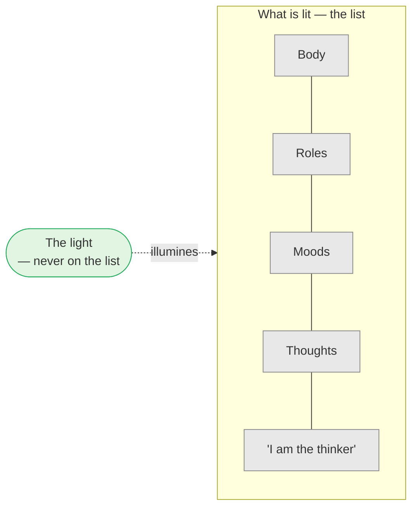

# Day 5 — Who Is Asking? The Lamp and the Room

> **Today's one idea:** The one thing you have never examined is the examiner — whatever is lit up is not the light that lights it.
> **Reading time:** ~35 min · **Prereqs:** [Day 4](./day-04-the-tenth-man.md)
> **Primary source for today:** Bṛhadāraṇyaka Upaniṣad 4.3.1–7 (Janaka and Yājñavalkya) and Kena Upaniṣad 1.2–1.8 — Swami Madhavananda (trans.), *Bṛhadāraṇyaka Upaniṣad*, 1934; Swami Gambhirananda (trans.), *Eight Upaniṣads*, Vol. 1, 1957.
> **Before you start:** Without looking — *in the tenth man story, why couldn't the leader find the tenth by counting harder, and what kind of knowledge did "you are the tenth" give him?*

---

## The hook (3 min)

King Janaka asks the sage Yājñavalkya a question that sounds like small talk (Bṛhadāraṇyaka 4.3.2–6):

*"What is the light of a person — by what does he see, go out, work and return?"*
"The sun, Your Majesty."
*"And when the sun has set?"*
"The moon."
*"And when the moon has set too?"*
"Fire."
*"And when the fire has gone out?"*
"Speech — in pitch dark you can't see your own hand, but when someone speaks, you go toward the voice."
*"And when the sun has set, the moon has set, the fire is out, and speech is silent — what then is the light of a person?"*

Yājñavalkya: *"Then the Self is his light. By the light of the Self he sits, goes out, works and returns."*

Janaka keeps removing lights, and something keeps lighting. Today we find out what that is — not by belief, but by looking in exactly the place yesterday's tenth man forgot to look.

---

## Building the intuition (14 min)

### The list

Try this now, with a pen. Write the heading **"What am I?"** and list ten things, quickly, whatever comes:

> *A body. A man/woman. An engineer. Someone who's tired today. A parent. A mind that worries too much. A meditator. Someone who likes music. The thinker of my thoughts. A person who is reading this.*

Done? Now look at the list — not at the items, but at this fact: **every single item on it is something you observed.** You noticed the body, knew the role, felt the tiredness, saw the worry.

Now ask: *who made the list?* Whatever made it is not on it. You can add "the list-maker" as item 11 — but notice that you just *observed* that too, and so whatever noticed item 11 is still off the page.

That's the tenth man again. You counted nine — ten — eleven — and the counter slipped out of the count every time.

### The lamp and the room

Imagine a dark room with a single lamp. You see the chairs, the table, the books — all by the lamp's light. Three things to notice:

1. **The lamp is not one of the things it lights up** in the same way the chairs are. The chairs are *lit*; the lamp is *lighting*.
2. **You don't need a second lamp to see the first one.** The lamp shows itself by being what it is. If every lamp needed another lamp, nothing would ever be seen.
3. **Take the chairs away and the lamp is still shining.** Empty room, same light — it just has nothing to fall on.

Now map it to the list:

| In the room | In you |
| --- | --- |
| Chairs, table, books | Body, roles, moods, thoughts — everything on the list |
| Being lit | Being known, noticed, experienced |
| The lamp | Whatever is doing the knowing |
| No second lamp needed | You don't need to *know* the knower as an object in order for it to be present — it's what knowing *is* |
| Empty room, same light | Fewer thoughts (quiet meditation, deep sleep) — and something still "shines" |

The third point about the lamp — empty room, same light — is exactly Janaka's sequence. He removes the sun, the moon, fire, speech — the outer lamps and the chairs they light — and something is still lighting. Yājñavalkya names it: *the Self is his light.*

### The Kena's version

The Kena Upaniṣad opens with a student asking: *"Directed by whom does the mind go toward its objects? Impelled by whom does speech go out? What power directs the eye and ear?"* The teacher replies that it is the **"ear of the ear, the mind of the mind, the speech of speech, the eye of the eye"** (Kena 1.2). And then, in a sequence of verses (1.5–1.8):

> *That which speech does not reveal, but by which speech is revealed …*
> *That which the mind does not think, but by which, they say, the mind is thought …*
> *That which the eye does not see, but by which the eyes are seen …*
> *— know that alone to be Brahman, not this which people worship here.*

Every verse has the same shape: **X does not reach it; it is what reaches X.** That is the lamp: never among the lit, always the lighting.

---

## The formal picture (10 min)

Today we name what we've found, carefully and provisionally. The rigorous rule — with its proof — is tomorrow's job.

### Three names

- ***Sākṣī*** — "the witness". That which is present to, and illumines, the body, senses, mind and its contents, without itself being one of them. (The word suggests a witness in court: present, seeing, not a party to the dispute.)
- ***Svayaṃ-prakāśa*** — "self-luminous". Known not as an object, by some further light, but by being what it is — the lamp needing no second lamp. Yājñavalkya returns to this in the dream passage: in dream, with no sun and no lamps, "the person becomes self-luminous" (*svayaṃ-jyotiḥ*, Bṛh. 4.3.9, 4.3.14).
- ***Ātman*** — "the Self". The tradition's name for what "I" refers to when all the items on the list are set aside. Kena's conclusion — "know *that* to be Brahman" — is the first time in this course you've seen the two words equated. It's not yet earned; it's being *announced*.

### Two features you can already check

Without any doctrine, from the list exercise and the lamp, you can verify two features of the *sākṣī*:

1. **It is never an item on the list.** Whatever you can point at, describe or notice is lit; the noticing is not one more thing noticed.
2. **It is present whenever anything is known.** You've never had an experience in which knowing was absent. Contents changed constantly — this item, then that — but "being known" was never missing.

Notice what's *not* claimed yet: that the witness is eternal, that it's the same in everyone, that it's Brahman. Those are Days 6–16. Today makes one move only: **turn around and look at the looker** — which is the traveller's "count again".

---

## Where it breaks / what it is not (4 min)

**"So there's a little observer sitting inside my head."** That's the homunculus picture — and it fails, because a little observer would itself be something you could picture and point at: an item on the list. The witness isn't a tiny person; it's what the "lighting" in all experience consists of. And the lamp analogy shows why there's no infinite regress ("who watches the watcher?"): the lamp doesn't need a lamp.

**"The witness is my thinking mind."** The thinking mind is item 6 on most people's lists. You *notice* thoughts — their speed, their tone, when they stop. So the thinker is lit, not the light. This is the most common slip, and Day 6 will make it impossible.

**"I should adopt a detached 'witness attitude'."** A popular misreading. A *posture* of detachment ("I'm just watching…") is itself a mental state — you can notice yourself adopting it. So it's on the list. The witness isn't an attitude you put on; it's what is already aware of whatever attitude you have.

**"This is just a claim about the brain."** Today's page makes a claim about the *structure of experience* — that the knower never shows up as one of the known. Whether and how that relates to neurons is a separate (and real) question. The capstone will ask you to answer a physicalist. For now, don't let the question pull you off the looking.

**Buddhist false friend.** You may hear "Buddhism says there is no observer". Look closely: what Buddhist analysis denies is a self that can be found *among* the aggregates — a self on the list. Advaita agrees there is none on the list. Where the two diverge is what they say about the lighting itself. Note the convergence first; we'll weigh the divergence later.

---

## Try it yourself (8 min)

### 1. Retrieval first

Close the page. From memory, write (a) the sequence of lights Janaka removes, and what is left; (b) the two features of the *sākṣī* you can check without doctrine.

Hint

Sun, … , and then? And for the features: is it on the list? Is it ever absent when something is known?

Model answer

(a) Sun → moon → fire → speech → the Self, "by whose light he sits, goes out, works and returns." (b) The witness is never an item on the list (never an object among the known); and it is present whenever anything is known (knowing is never absent from experience).

### 2. Direct application — the five-minute count

Sit for five minutes. Every time anything appears — a sound, an itch, a thought, a feeling of boredom — silently label it "lit" and let it go. Don't try to find the light. Just keep labelling. At the end, write two or three sentences: (a) Was there anything that appeared which *wasn't* lit? (b) Did you at any point try to make "the light" into an object? What happened?

Hint

If you notice yourself "looking for the watcher", label that looking "lit" too.

What to look for

(a) Everything that appeared was lit — including the labelling itself and any sense of "me sitting here". That's the first feature, verified. (b) Almost everyone tries, at some point, to "see" the witness — and finds either a blank, a subtle sense of presence, or a sensation behind the eyes. Each of those is something <em>appearing</em>, so it's lit. That's the important discovery: the light can't be found as an object, yet nothing was ever unlit. If you felt mildly frustrated, good — that is the exact spot the course's bottleneck skill lives. Tomorrow gives you the rule that makes the frustration productive.

### 3. Stretch — the dream lamp

In a dream, there is no physical sun or lamp, your eyes are closed, the room is dark — and yet you see vivid, lit scenes. Using Janaka's sequence and the lamp analogy, explain what is lighting the dream. What does this suggest about whether the "light" depends on the outer lights at all?

Hint

Yājñavalkya explicitly takes up dreams a few verses later (Bṛh. 4.3.9, 4.3.14).

Worked answer

In dream every outer light is gone, and the "chairs" (dream objects) are made by the mind — but they are still seen. So something must be lighting them that isn't the sun, moon, fire or a lamp. Yājñavalkya says exactly this: in dream "the person becomes self-luminous." The suggestion: the light of awareness never depended on outer lights; outer lights only illuminate physical objects <em>for</em> it. You'll extend this to deep sleep on Day 8 — the state where even the dream objects vanish — and ask whether the light vanishes too.

### 4. Spaced callback — Day 2

On [Day 2](./day-02-nachiketas-choice.md), Nachiketas asked Yama: *"When a person dies, some say 'he is', others say 'he is not'."* Using today's page, what kind of thing would have to be the answer to that question — an item on the list, or the light? Why couldn't any item on the list be the answer?

Hint

What happens to the items on the list (body, roles, thoughts) at death?

Worked answer

Every item on the list — body, roles, moods, thoughts — is a changing, produced thing (Day 2: whatever is made, ends); all of them clearly end or change at death. So if the question "does the person remain?" has a "yes" answer, it can't be about any item on the list. It must be about the light — that which was never one of the lit items. That is why Yama goes on to teach about the Self that "is not born, nor does it die" (Kaṭha 1.2.18): he is pointing at the light, not at a surviving object. The answer to Nachiketas is not "something on the list survives" but "you were never on the list".

**Transfer — apply it:**

> Name one recurring situation in your work or home life where you get completely absorbed in content — a stressful meeting, an argument, a deadline. Write one sentence: *the input* (the situation as it usually grabs you), *what today's idea does to it* (notices that every element of it, including "me, stressed", is lit), and *the output* (what changes, even slightly, when you notice that). If nothing comes to mind in 60 seconds, re-read the hook and try again.

---

## Connect it back

Day 4 established that the problem is ignorance of something already present, and that the cure is a pointer that turns attention back on the one doing the counting. Today you counted again: every item you could list was lit, and the lighting was never on the list. Janaka's sequence and the Kena's "eye of the eye" said the same thing some two and a half thousand years ago. Tomorrow you get the rule itself, in one line from the *Dṛg-Dṛśya-Viveka* — the rule that the whole of Module 2 is built on.

**Sharp question:** *If you can notice your thoughts, your mood and your sense of being a person, what are you — strictly — not?*

---

## Suggested readings for today

**Required if you have 15 extra minutes:** Bṛhadāraṇyaka Upaniṣad **4.3.1–4.3.7** with Shankara's commentary (Madhavananda trans.). Shankara uses Janaka's sequence to argue, step by step, that the light by which we act must be distinct from the body and senses it illumines. You'll see the whole of Day 6 being prepared.

**If you want the deep version:**
- Kena Upaniṣad **1.1–1.8** with Shankara's commentary (Gambhirananda, *Eight Upaniṣads*, Vol. 1) — the "ear of the ear, mind of the mind" teaching; Shankara's comment on why "that" cannot be an object of the mind.
- Bṛhadāraṇyaka Upaniṣad **4.3.9–4.3.14** — the same dialogue continues into dream, where "the person becomes self-luminous". Prepares Day 8.
- Swami Sarvapriyananda, ***Drg Drsya Viveka*** lecture series (Vedanta Society of New York; YouTube playlist and podcast, listed at vedantany.org/drg-drisya-viveka) — the opening talk sets up the seer/seen distinction with the same everyday examples used today.

---

## Navigation

← **Previous:** [Day 4 — The Tenth Man](./day-04-the-tenth-man.md)
→ **Next:** [Day 6 — Seer and Seen](../../02-vicharana/days/day-06-seer-and-seen.md)
