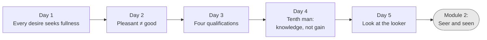

# Module 1 — Shubheccha: The Longing (Days 1–5)

Back to [README](../../README.md)

**What this module earns you:** a clear, first-person diagnosis of *why* anyone would want this teaching, and a precise statement of what kind of thing the teaching can and cannot deliver.

*Shubheccha* ("auspicious wish") is the first bhūmikā: the longing for truth that arises when a person sees that the passing cannot satisfy. You probably have it already — so this module doesn't try to create it. It sharpens it into three convictions:

1. **What I actually want is fullness**, not this or that object (Day 1).
2. **Fullness cannot be produced by action**, so the good and the pleasant diverge (Days 2–3).
3. **If fullness is already my nature, the only thing to remove is ignorance** — which calls for a means of *knowledge*, and the examiner, not the examined, is where to look (Days 4–5).

No doctrine is asked on faith here. Everything is checked against your own experience.

| Day | Page |
| --- | --- |
| 1 | [The Itch Objects Can't Scratch](days/day-01-the-itch-objects-cant-scratch.md) |
| 2 | [Nachiketa's Choice](days/day-02-nachiketas-choice.md) |
| 3 | [The Four Qualifications](days/day-03-the-four-qualifications.md) |
| 4 | [The Tenth Man](days/day-04-the-tenth-man.md) |
| 5 | [Who Is Asking?](days/day-05-who-is-asking.md) |

Next module: [Vicāraṇā](../02-vicharana/overview.md)
