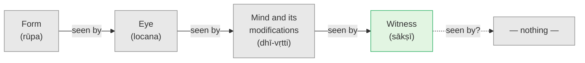

# Day 6 — Seer and Seen (*Dṛg-Dṛśya-Viveka*)

> **Today's one idea:** Whatever is an object of awareness cannot be that awareness — the seen (*dṛśya*) is never the seer (*dṛk*).
> **Reading time:** ~40 min · **Prereqs:** [Day 5](../../01-shubheccha/days/day-05-who-is-asking.md)
> **Primary source for today:** *Dṛg-Dṛśya-Viveka*, verses 1–5 — Swami Nikhilananda (trans.), *Dṛg-Dṛśya-Viveka: An Inquiry into the Nature of the 'Seer' and the 'Seen'*, Sri Ramakrishna Ashrama, 1931.
> **Before you start:** Without looking — *in Janaka's conversation with Yājñavalkya, what is left as "the light of a person" when sun, moon, fire and speech have all gone out? And what was yesterday's one-line intuition about whatever is lit?*

---

## The hook (3 min)

You are looking at a photograph of a room. Everything is in it: the table, the window, the cat on the sofa, even a mirror on the far wall. You examine it closely. One thing is missing from every photograph ever taken — not hidden, not cropped, but *structurally* absent.

The camera.

Not because the photographer was careless. A photograph *is* what the camera sees; the camera is where the seeing happens *from*. You could photograph the camera with a second camera — but then the second one is missing. However many you add, the last one in the chain never appears in its own picture.

Yesterday ended with an intuition: *whatever is lit is not the light*, and the examiner is the one thing never examined. Today the tradition turns that intuition into a rule you can apply to anything — sharp enough to cut with.

---

## Building the intuition (12 min)

### Thought experiment 1 — the ladder of seers

Look at something red in front of you. Now notice three facts, slowly:

1. **The red thing is seen; your eyes see it.** The eyes are on the "seeing" side; the red is on the "seen" side.
2. **But your eyes are also seen.** You know when they are tired, blurry, strained, or closed. Something registers the *state* of the eyes. That something is the mind. Relative to the mind, the eyes have switched sides: they are now *seen*.
3. **And the mind is seen.** You know when the mind is restless, calm, confused, curious. You know "I was distracted a moment ago." Whatever registers the mind's states is not one of those states. Relative to it, the whole mind has switched sides.

Then the obvious question: is there a step 4? Is the thing that registers the mind *also* seen by something further? Try to find it. Try to turn round and see the seer of the mind as you just saw the mind.

Notice what happens when you try. Whatever you find — a sense of presence, a feeling of "me", a blankness — is *found*. It has just appeared, on the seen side. The seer has, once again, not shown up in its own photograph.

### Thought experiment 2 — the torch in the dark room

Walk into a dark room with a torch. The beam lands on a chair, a shelf, a coat. Each lit object varies — different shapes, colours, distances. The light on each is the same light. And one more thing is true: you never need a second torch to see whether your torch is on. Its being on is what makes everything else visible. It doesn't wait to be shown; it shows.

These two pictures give us three properties we'll formalise in a moment:

- The camera / torch is **one**; what it captures is **many**.
- The camera / torch is **steady** while the scenes **change**.
- The camera / torch is **never in the picture** — it is not an object among objects.

---

## The formal picture (14 min)

### The verse

The *Dṛg-Dṛśya-Viveka* ("Discrimination of the Seer and the Seen"), a short Advaita primer variously attributed to Shankara, Bhāratī Tīrtha or Vidyāraṇya, opens with the whole of today in one line (v. 1):

> *rūpaṃ dṛśyaṃ locanaṃ dṛk, tad dṛśyaṃ dṛk tu mānasam*
> *dṛśyā dhī-vṛttayaḥ sākṣī, dṛg eva na tu dṛśyate*
>
> "Form is seen, the eye is the seer. That (eye) is seen, the mind is the seer. The modifications of the mind are seen; the witness is the seer — and it is never seen."

Two technical words:

- ***Dṛk*** — the seer, the knower, that which is aware.
- ***Dṛśya*** — the seen, the known, anything that is an object of awareness.

And one more you'll need: ***vṛtti*** — a "modification" of the mind: any single thought, perception, feeling, memory or mood. *Dhī-vṛttayaḥ* = the mind's modifications.

### The rule

> **Dṛg-dṛśya-viveka:** whatever is known is other than the knower. If you can be aware of X, X is not what you are as awareness.

The verses that follow (vv. 2–5) give the rule its working properties — the same three you found with the camera and the torch:

| Property | Seer (*dṛk*) | Seen (*dṛśya*) | Verse |
| --- | --- | --- | --- |
| Number | **One** — the eye, remaining one, sees blue, yellow, gross, subtle, short, long | **Many** — endlessly various | v. 2 |
| Change | **Constant** — the mind registers the eye's blindness, dullness or sharpness, itself unchanged by them; the witness registers desire, doubt, trust, fear, resolve | **Changing** — arises, varies, passes | vv. 3–4 |
| Objecthood | **Never an object** — it "neither rises nor sets, neither grows nor decays"; it shines by itself and lights up the rest without needing an instrument | **Always an object** — lit, never lighting itself | v. 5 |

Notice the chain is *relative* until its last link. The eye is a seer with respect to colours but seen with respect to the mind. The mind is a seer with respect to the eye but seen with respect to the witness. Only the last term is seer *without* being seen by anything further. That is why it is called *sākṣī*, "witness" — the term you met provisionally yesterday now has a precise definition: **the seer that is never itself seen.**

### The same rule in the Upaniṣads

The primer is compressing what the Bṛhadāraṇyaka says in several places:

- Yājñavalkya to Uṣasta (3.4.2): *"You cannot see the seer of seeing; you cannot hear the hearer of hearing; you cannot think the thinker of thinking; you cannot know the knower of knowing. This is your Self, which is within all."*
- Yājñavalkya to Maitreyī (2.4.14): *"By what would one know the knower?"*

Neither statement says the seer is unknowable *in principle* — it is your own Self, after all; nothing is more present. They say it is unknowable *as an object*. You don't see it; you are it. The camera "knows" itself not by appearing in its photographs but by being what every photograph is taken from.

### Why this rule is load-bearing

Everything you have ever taken yourself to be — a body, a personality, a history, a set of opinions, a mood — you know. Apply the rule, and the list of candidates for "what I am" starts shrinking. Days 7 and 8 run this rule systematically across the layers of the person and across the three states of experience. Day 9 makes you do it live. Every later concept in the course — *adhyāsa* (Day 12), *mithyā* (Day 13), *neti neti* (Day 17) — is built on this one line.

---

## Where it breaks / what it is not (5 min)

**"But I can be aware of being aware. So awareness *can* be an object."** This is the objection everyone raises, and it is worth taking slowly. When you "become aware of being aware", what actually appears? Usually one of three things: a *thought* ("I am aware"), a *feeling* of spaciousness or clarity, or a subtle *sense of presence*. Each of these is a modification of the mind — it arises, it has a quality, it passes. Each is therefore on the seen side. Who is aware of the thought "I am aware"? Not the thought. The rule hasn't been broken; you've just added one more photograph to the pile. What *is* true — and Days 10–11 develop it — is that awareness is self-evident (*svayaṃ-prakāśa*, "self-shining", v. 5's "it shines by itself"): it doesn't need to become an object to be known, any more than the torch needs a second torch. "Aware of being aware" is best heard as *awareness not missing itself*, not as awareness looking at itself.

**"So the witness is a little observer behind my eyes."** No. Anything with a location, a perspective, a feeling of "here" — a little observer — is something you can notice. So it is seen. The witness is not an inner homunculus watching a screen; that picture would need another witness to watch the homunculus. The rule *forbids* you to picture the seer, because a picture is seen.

**"This is just the ordinary subject–object split, which modern philosophy has been criticising for centuries."** The ordinary split puts *me-the-body-mind* on one side and *the world* on the other. The rule cuts in a completely different place: the body-mind falls on the *seen* side, along with the world. The line runs between *all content* and *that which is aware of content*. That is a much more radical cut, and it doesn't produce two things in the same sense — only one of the two is ever an object.

**"If the seer is never seen, it might not exist — maybe it's a theoretical posit."** Ask: is the seeing of this page happening? Can you doubt that experience is being *known* right now? You can doubt every *content* (dream? illusion?), but not that something is evident. The seer is the least inferred thing there is; it is what every inference happens in. What it isn't is *findable as a thing* — which is a different matter.

**Buddhist friction (and convergence).** You may hear Buddhist teachers say "there is no observer — look for it and you won't find it." Advaita agrees completely with the *finding*: look for the seer as an object and you will not find one. The two traditions draw different conclusions from the same non-finding (Buddhism: no self; Advaita: the self is the non-objectifiable seer). For now, notice the shared step — you've just done it in thought experiment 1.

---

## Try it yourself (10 min)

### 1. Retrieval first

Close the page. From memory: (a) reconstruct the four-link chain of the *Dṛg-Dṛśya-Viveka*'s first verse (what is seen by what, and what is not seen); (b) state the three properties that distinguish the seer from the seen.

Hint

Form → … → … → … ; then: number, change, objecthood.

Model answer

(a) Form is seen by the eye; the eye is seen by the mind; the mind's modifications are seen by the witness (<em>sākṣī</em>); the witness is seen by nothing. (b) The seer is <strong>one</strong> while the seen is many; the seer is <strong>constant</strong> while the seen changes; the seer is <strong>never an object</strong> while the seen is always an object. If you also noted that every link but the last is a seer only <em>relatively</em> (seen from the next link up), you have the structure exactly.

### 2. Direct application — the five-minute ladder (contemplative)

Sit for five minutes with eyes open. Do this in order, spending about a minute on each step, and **say the label silently each time**:

1. Pick one sound or colour. Label: *"seen."*
2. Notice the state of the sense organ itself — ears ringing, eyes slightly tired, the pressure of the glasses. Label: *"also seen."*
3. Notice the current mood or mental tone — restless, sleepy, interested. Label: *"also seen."*
4. Notice the thought "I am doing an exercise." Label: *"also seen."*
5. Now ask, without answering in words: *"To what are all of these appearing?"* Rest in the question for a minute. Whenever an answer shows up (an image, a feeling, a word), label it: *"also seen."*

Then write two lines: what kept appearing at step 5, and what was it like to keep labelling it "seen"?

Hint

Step 5 is not a test you pass by producing an experience. If nothing special happens, that is fine — the instruction is to notice that whatever appears is on the seen side.

What to look for

Common reports at step 5: a sense of spaciousness; a feeling of "me" located behind the eyes; blankness; a slight vertigo; the thought "nothing is here." Every one of these is correctly labelled "seen" — and that is the lesson. The exercise succeeds if you notice that the labelling never runs out of content and never catches the labeller. A frequent mistake: treating the spacious feeling as "the witness at last." It has a quality (spacious), it came and it will go — <em>seen</em>. The witness is not a better experience; it is what any experience, including that one, is appearing to. If you felt mild frustration at not "getting" it, good: you are pressing on the exact place the tradition says cannot be grasped as an object.

### 3. Stretch — explain it to a sceptical friend

A friend who works in neuroscience says: *"The 'witness' is just the brain's self-model. The brain models the world and also models itself as an observer. That's all your 'seer' is."* Using today's rule, write a short reply (4–6 sentences) that is fair to the friend and does not overclaim.

Hint

Is a "self-model" seen or the seer? Can the friend know their self-model? And: what does the rule claim and not claim about brains?

Worked answer

"I think you're right that the brain builds a self-model, and in experience it shows up as the feeling of being a located observer. But notice that you can <em>know</em> that model — you can describe it, it varies with mood and fatigue, it disappears in some states. By the rule I'm using, anything that can be known that way is on the seen side. So the self-model is a very good account of the <em>little observer</em> I'm told not to confuse with the witness. What the rule points to is whatever the self-model, along with everything else, is appearing to. I'm not claiming today that this awareness is independent of the brain — that's a further question the course handles later. I'm only claiming that whatever is an object of awareness, including the self-model, isn't the awareness." 
Two things to check in your answer: (a) you agreed with what the friend actually got right (the self-model is real as content); (b) you didn't slip in a metaphysical claim the rule doesn't support today.

### 4. Spaced callback — Day 1's gap, seen

On [Day 1](../../01-shubheccha/days/day-01-the-itch-objects-cant-scratch.md) you traced every desire to a felt sense of lack — the "gap" between me-here and the thing-I-need-there — and the joy of its brief closing. Using today's rule: is that felt sense of lack seer or seen? What follows for the claim "I am incomplete"?

Hint

Can you notice the lack? Does it come and go? Recall Day 1's train platform — the lack vanished for a few seconds.

Worked answer

The felt lack is <em>seen</em>: you can notice it, it has a quality (restless, hungry, anxious), and it comes and goes — it vanished on the train platform and returned with "I hope I get a seat." By the rule, then, the lack belongs to the seen side; it is not a property of the seer. "I am incomplete" turns out to be a sentence in which a seen feeling is reported as a fact about the seer. That doesn't yet prove the seer is full (that is Days 10–11's work), but it does show the lack has no right to the word "I." This is the first concrete link between Day 1's problem and today's tool: the tool is aimed exactly at the place the problem lives.

**Transfer — apply it:**

> Pick one recurring inner state that tends to define your day — "I'm anxious", "I'm behind", "I'm not good enough at this". Write one sentence: *the input* (the state as you usually report it, "I am X"), *what today's idea does to it* (moves X from the seer side to the seen side: "X is appearing"), and *the output* (what changes in how you respond when you treat X as something seen rather than as what you are). If nothing comes to mind in 60 seconds, re-read the hook and try again.

---

## Connect it back

Yesterday Janaka's question stripped away sun, moon, fire and speech to leave "the Self is his light", and Kena pointed to that by which mind and speech are revealed. Today that intuition became a rule with three working properties — the seer is one, constant and never an object — and you saw that "aware of being aware" doesn't break it. Tomorrow you apply the rule layer by layer to everything you might call yourself, using the Taittirīya Upaniṣad's five sheaths.

**Sharp question:** *If every candidate for "me" that I can find is on the seen side, what exactly is doing the finding?*

---

## Suggested readings for today

**Required if you have 15 extra minutes:** *Dṛg-Dṛśya-Viveka* **verses 1–5** with Nikhilananda's notes. Read v. 1 aloud three times; then notice how vv. 2–5 each supply one property (one/many, constant/changing, self-shining).

**If you want the deep version:**
- Bṛhadāraṇyaka Upaniṣad **3.4.1–3.4.2** (Uṣasta's questioning) with Shankara's commentary — Swami Madhavananda (trans.), Advaita Ashrama, 1934. Uṣasta demands the Self be shown "like a cow or a horse"; the reply is today's rule in its sharpest form.
- Swami Sarvapriyananda, ***Drg Drsya Viveka*** lecture series (Vedanta Society of New York; YouTube playlist and podcast, listed at vedantany.org/drg-drisya-viveka) — the opening talk works through verse 1 with the "aware of being aware" objection handled at length.

---

## Navigation

← **Previous:** [Day 5 — Who Is Asking?](../../01-shubheccha/days/day-05-who-is-asking.md)
→ **Next:** [Day 7 — The Five Sheaths](./day-07-the-five-sheaths.md)
