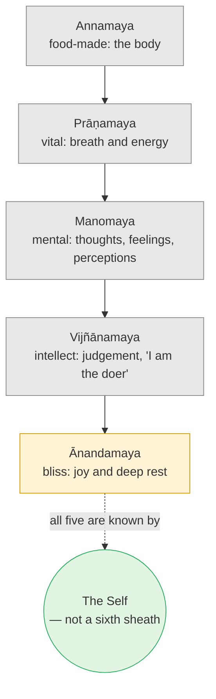

# Day 7 — The Five Sheaths (*Pañca-Kośa*)

> **Today's one idea:** Body, vitality, mind, intellect and bliss are all *known* — so none of them is the knower. They are sheaths around the Self, not layers of it.
> **Reading time:** ~40 min · **Prereqs:** [Day 6](./day-06-seer-and-seen.md)
> **Primary source for today:** Taittirīya Upaniṣad 2.1–2.5 (*Brahmānanda Vallī*), with Shankara's commentary — Swami Gambhirananda (trans.), *Eight Upaniṣads*, Vol. 1, Advaita Ashrama, 1957; and Vidyāraṇya, *Pañcadaśī* ch. 3 (*Pañcakośa-viveka*) — Swami Swahananda (trans.), Sri Ramakrishna Math, 1967.
> **Before you start:** Without looking — *recite the four links of the Dṛg-Dṛśya-Viveka's first verse, and name the three properties that separate the seer from the seen. Then: why doesn't "I can be aware of being aware" break the rule?*

---

## The hook (3 min)

A warrior comes home after a battle. He unbuckles the scabbard from his belt and lays it on the table: leather, worn at the edges, the shape of a blade pressed into it. Anyone looking at it knows exactly what kind of sword it holds — its length, its curve, its width. The scabbard has taken the sword's shape so completely that you could mistake one for the other.

But nobody ever cut anything with a scabbard.

Now imagine the sword had forgotten it was a sword, and believed it was the scabbard. Every scuff on the leather would feel like a wound. Every time the scabbard was put away in a cupboard, the sword would feel shut away. The sword would never once have been touched — and would suffer anyway, by identification.

The Sanskrit word *kośa* means exactly this: a sheath, a scabbard, a covering that takes the shape of what it covers. The Taittirīya Upaniṣad says you are wearing five of them.

---

## Building the intuition (12 min)

### Running yesterday's rule on yourself

Yesterday's rule was simple: *whatever is known is not the knower.* Today you apply it not to a red cup but to the things you most naturally call "me". Do it slowly — read each paragraph, then check it in your own experience before moving on.

**The body.** You know your body: its weight, its warmth, its hunger, the ache in the shoulder. It changed completely between age five and now — almost no feature is the same. Yet something has been aware of the body throughout. *Known; changing; therefore seen.*

**The breath and vitality.** You know when you're energetic or drained, breathing fast or slow, wired or sluggish. You can even watch the breath without controlling it. *Known; changing; seen.*

**The mind — the stream of thoughts, feelings, perceptions.** You know when the mind is busy or quiet, anxious or calm. Yesterday's ladder already put it on the seen side.

**The intellect — the part that decides, judges, says "I understand" or "I am the doer".** This is subtler. It feels like the one in charge. But you know when your judgment is sharp or foggy; you know that you changed your mind on something important last year; you can notice the very thought "I decided." *Known; changing; seen.*

**The bliss — the deepest, most private layer: moments of quiet joy, the contentment of deep rest.** This feels like the most "me" of all. But you know when it is there and when it isn't. It comes and goes. *Known; changing; seen.*

Five candidates, five failures. Each one takes the *shape* of the self — each one feels like "me" while you're identified with it — and each one turns out, on examination, to be something you are aware *of*.

### Why "sheath", not "layer"

Here is the most common misreading, so let's kill it early. People often picture the five kośas like an onion, or like Russian dolls: five layers of *you*, with the innermost being the "real" you.

The Taittirīya's word doesn't say that. A sheath is not a layer of the sword. The sword isn't partly leather on the outside and partly steel within. All five sheaths are *other than* what they enclose. The innermost sheath is just as much a sheath as the outermost — subtler, closer-fitting, harder to distinguish, but still covering, not covered.

The diagram's dotted line is the point of the whole teaching: the Self is not the next item on the list. It is what the list is *known by*.

---

## The formal picture (14 min)

### The Taittirīya's sequence

The second chapter of the Taittirīya Upaniṣad opens with a definition — *satyaṃ jñānam anantaṃ brahma*, "Brahman is existence, knowledge, limitlessness" (2.1) — and says that whoever knows Brahman "hidden in the cave (*guhā*)" of the heart attains all desires. Then it tells you how to find what's in the cave: by going inward through five selves, each described as "made of" (*-maya*) something (2.1–2.5):

| Sheath (*kośa*) | Made of | Plain meaning | How you know it's seen |
| --- | --- | --- | --- |
| *Annamaya* | food (*anna*) | The physical body | It is born, grows, ages; you perceive it |
| *Prāṇamaya* | vital air (*prāṇa*) | Breath, energy, the physiological functions | It speeds up, slows down; you notice its state |
| *Manomaya* | mind (*manas*) | The flow of thought, emotion and sense-perception | It is restless or calm; you notice its moods |
| *Vijñānamaya* | intellect (*vijñāna*) | The deciding, judging, owning faculty — the sense of being the doer and knower | Its judgments change; you notice "I decided" |
| *Ānandamaya* | bliss (*ānanda*) | Pleasure and joy; most purely, the contentment of deep sleep | It comes and goes; you know when it is present |

Each time, the text repeats a formula: *"Different from this, and within it, is another self made of … ; by that this one is filled. It too has the shape of a person"* (2.2–2.5). That repeated "it too has the shape of a person" is the scabbard taking the sword's shape: each sheath is *puruṣa-vidha*, person-shaped, and so each is easy to mistake for who you are.

### The bird with a tail

The Upaniṣad pictures each sheath as a bird with a head, two wings, a trunk and a *tail* that supports it. For the bliss sheath (2.5) the parts are: pleasure (*priya*) as head, enjoyment (*moda*) and great enjoyment (*pramoda*) as the wings, bliss (*ānanda*) as the trunk — and then:

> *brahma pucchaṃ pratiṣṭhā* — "Brahman is the tail, the support."

Shankara reads this carefully. The *ānandamaya* is still a sheath: it is "made of" bliss, which means it is a *modification* — something with degrees (priya, moda, pramoda), something that comes and goes. What is *not* a sheath is the support (*pratiṣṭhā*) on which the whole bird rests: Brahman. The "tail" image is only a way of placing Brahman inside the list without making it one more item. (Shankara also discusses this passage in his Brahma-Sūtra commentary, where he ultimately reads the *ānandamaya* as a sheath and the "tail" as Brahman — BSBh 1.1.12–19, the *ānandamaya* section, where the closing comment reverses the reading given in the body of the section.)

### How Vidyāraṇya uses it

Pañcadaśī ch. 3 turns the Upaniṣad's list into a practice. Its opening verse says that Brahman, "hidden in the cave", can be known *by discriminating the five sheaths* — *pañca-kośa-viveka*. The method is exactly yesterday's rule, applied layer by layer: each sheath is known, changing and many-featured; the Self is the one, unchanging knower of all five. Elsewhere (Pañcadaśī 1.42) Vidyāraṇya borrows the Kaṭha's image (2.3.17) of drawing out the Self from the body "as one draws the inner stalk from the *muñja* grass" — patiently, without tearing — and applies it to separating the Self from the three bodies, i.e. the five sheaths.

### The obvious objection, and Vidyāraṇya's answer

A student says: *"I've negated all five. Body, breath, mind, intellect, bliss — none of them is me. But beyond them I find nothing at all. So there is no Self — only a void."* (Pañcadaśī 3.11; the reply runs through vv. 12–22 and is restated at vv. 31–33.)

The answer is the cleanest application of yesterday's rule: **who knows the void?** "Nothing is found" is itself a finding. The absence of objects is known — and that by which it is known cannot be one of the absent objects. The witness of the nothing is precisely what you are. You looked for the Self as a sixth thing, didn't find a sixth thing, and concluded there was no Self. But you were never going to find the seer among the seen (Day 6). The non-finding is exactly what the rule predicts.

---

## Where it breaks / what it is not (5 min)

**"So I'm not my body — I should neglect it."** The scabbard is useful; it protects the sword and lets it be carried. The sheaths are your instruments for living and for learning this very teaching. The point is to stop *identifying* with them, not to stop caring for them. A neglected body and a starved mind make poor telescopes ([Day 3](../../01-shubheccha/days/day-03-the-four-qualifications.md)).

**"The innermost sheath is the real me."** The single most important misreading. The *ānandamaya* is still a sheath — closer-fitting, but a sheath. If you made deep bliss your identity, you'd be the sword believing it is the innermost lining of the scabbard. Bliss that comes and goes cannot be what witnesses its coming and going.

**"The five kośas are a theory of anatomy."** They're a teaching device (an *upāya*), not a physiology. Later texts map them onto three "bodies" (gross, subtle, causal) and other schemes; the lists differ in detail but converge on the one function: *give the seer-seen rule five concrete places to land.*

**"Negating the sheaths is a mental exercise of saying 'not this'."** Repetition of words does nothing. The discrimination works only when, in each case, you actually notice that the thing in question is being *known* — that it is appearing, changing, observed. The verbal "not this" is a label for a seeing, not a substitute for it.

**"After negating everything, I'll experience the Self as a special state."** Any experience you have afterwards — stillness, light, expansion — is on the seen side, in one of the sheaths (usually the *ānandamaya* or *manomaya*). This is why Vidyāraṇya's "void" objection matters: the Self is not what remains as a *found* thing; it is the finder.

---

## Try it yourself (10 min)

### 1. Retrieval first

Close the page. From memory: (a) list the five sheaths in order, outermost first, with a plain-English gloss of each; (b) explain in one sentence why *kośa* means "sheath" and not "layer of me"; (c) what is the "tail, the support" of the bliss sheath?

Hint

Food → breath → … → … → bliss. And: does a scabbard contain any steel?

Model answer

(a) <em>Annamaya</em> (body), <em>prāṇamaya</em> (vitality/breath), <em>manomaya</em> (mind: thoughts, emotions, perceptions), <em>vijñānamaya</em> (intellect: judging, the sense of doership), <em>ānandamaya</em> (bliss: joy and deep rest). (b) A sheath takes the shape of what it covers but is other than it — none of the five is any part of the Self; all are known, hence seen. (c) Brahman — <em>brahma pucchaṃ pratiṣṭhā</em> (Taittirīya 2.5), the support on which even the bliss sheath rests, not itself a sheath.

### 2. Direct application — the sheath scan (contemplative, 8 minutes)

Sit comfortably. Spend about ninety seconds on each sheath, in order. For each one: (i) find it in present experience — something concrete (a sensation in the hands; the rhythm of breath; the current thought; the current opinion or decision; any trace of contentment); (ii) notice one feature of it that is *changing*; (iii) say silently, *"known — not the knower."* At the end, sit for one minute asking: *"What has been present through all five?"* — and label anything that appears in answer.

Write three lines afterwards: which sheath felt hardest to see as "seen"? What appeared at the end? How did you label it?

Hint

For the vijñānamaya, try to catch the feeling of "I am the one doing this exercise." For the ānandamaya, notice even a faint ease or comfort — or its absence.

What to look for

Most people find the <em>vijñānamaya</em> hardest — the sense of being the one who is doing, deciding, understanding feels like the subject, not an object. Catch it the way you caught the eye in yesterday's ladder: it has qualities (confident, uncertain, effortful), and it comes and goes (it vanishes when you're absorbed in a film). Known, therefore seen. 
At the end, the usual candidates appear: a sense of spacious presence, a quiet ease, a feeling of "I". If you labelled them "seen", you did it right. If you said "<em>that</em>'s it, finally", check: did it have a quality? Did it arrive? Then it is in a sheath (likely <em>ānandamaya</em>). The point of the minute isn't to find a sixth thing; it's to notice that all five were appearing <em>to</em> something that did not itself appear.

### 3. Stretch — answer the void objection in your own words

A friend from a Buddhist meditation background tries the sheath scan and says: *"I did it. Body, breath, mind, intellect, bliss — gone. What's left is nothing. That's emptiness. Your 'Self' is just a name for the nothing."* Reply in 4–6 sentences, using today's material and the rule from Day 6. Be fair to the friend's actual experience.

Hint

Vidyāraṇya's question: who knows the nothing? But also — what is right in the friend's report?

Worked answer

"I think your experience is exactly right: when the sheaths are seen through, nothing <em>objective</em> remains — no sixth thing to find. Advaita fully agrees with that non-finding. Where I'd push is on one word: you say 'what's left is nothing', but that nothing was <em>known</em> — you're reporting it. The knowing of the absence isn't itself absent. That's all 'the Self' is meant to point to — not a hidden object, but the knowing that was present through the sheaths and through their absence. Whether we call it emptiness or Self is a further debate; what we share is that it can't be found as a thing." 
Check: you honoured the shared step (no object found — the same convergence noted on Day 6), and you didn't claim the Self is a subtle object that the friend missed.

### 4. Spaced callback — the subtlest *preyas*

On [Day 2](../../01-shubheccha/days/day-02-nachiketas-choice.md), Nachiketas refused everything pleasant (*preyas*) for the good (*śreyas*), and the stretch exercise asked whether he should accept a blissful meditative state lasting ten thousand years. Using today's five sheaths: in which sheath would that blissful state belong, and why is mistaking it for the Self a refined version of choosing *preyas*?

Hint

Look at the bird of the bliss sheath — priya, moda, pramoda. Do those come in degrees? Do they come and go?

Worked answer

It belongs to the <em>ānandamaya kośa</em>. That sheath is "made of" bliss in degrees — <em>priya</em>, <em>moda</em>, <em>pramoda</em> — which means it varies, begins and ends: it is produced, seen, finite. Day 2's principle, "the uncreated is not gained by the created", applies directly: a bliss-state is created, so it is <em>preyas</em> no matter how exalted. Mistaking it for the Self is the dull person's choice in its subtlest form — choosing the pleasant over the good, where the pleasant is now a spiritual experience. The Self is <em>brahma puccham pratiṣṭhā</em>, the support of the bliss sheath, not the bliss sheath itself. This is why the tradition warns that the last attachment to drop is often attachment to peaceful states.

**Transfer — apply it:**

> Choose one moment this week when you said "I am …" about a sheath — "I'm exhausted" (prāṇamaya), "I'm confused" (manomaya), "I'm sure I'm right" (vijñānamaya), "I'm at peace" (ānandamaya). Write one sentence: *the input* (the "I am" statement), *what today's idea does to it* (names the sheath it belongs to and moves it to the seen side), and *the output* (how your response to the situation would change if the sword stopped taking the scabbard's scuffs personally). If nothing comes to mind in 60 seconds, re-read the hook and try again.

---

## Connect it back

Yesterday gave you the rule: whatever is known is not the knower. Today you ran it through every layer of the person the Taittirīya names — body, vitality, mind, intellect, bliss — and found each one known, changing and therefore a sheath, not a self; even the deepest bliss rests on a support that is not a sheath. Tomorrow you run the same rule not through layers but through *time*: waking, dreaming and deep sleep come and go — what doesn't?

**Sharp question:** *If even the bliss sheath is seen, what is the support on which it rests — and could that support ever be found the way the sheaths were found?*

---

## Suggested readings for today

**Required if you have 15 extra minutes:** Taittirīya Upaniṣad **2.1–2.5** in Gambhirananda's *Eight Upaniṣads*, Vol. 1 — read the five "different from this, within it, is another self" passages in a row, then Shankara's comment on **2.5** (*brahma pucchaṃ pratiṣṭhā*), where he explains why the bliss sheath is not Brahman.

**If you want the deep version:**
- Vidyāraṇya, *Pañcadaśī*, **chapter 3 (Pañcakośa-viveka)** in Swahananda's translation — the whole chapter is short; the "void" objection and its answer are the heart of it.
- Swami Paramarthananda, **Tattva Bodha lectures** (the sessions on *pañca-kośa*) — a patient, practical walk through each sheath with everyday examples, and the "sheath not layer" point made repeatedly.

---

## Navigation

← **Previous:** [Day 6 — Seer and Seen](./day-06-seer-and-seen.md)
→ **Next:** [Day 8 — Three States, One Witness](./day-08-three-states-one-witness.md)
