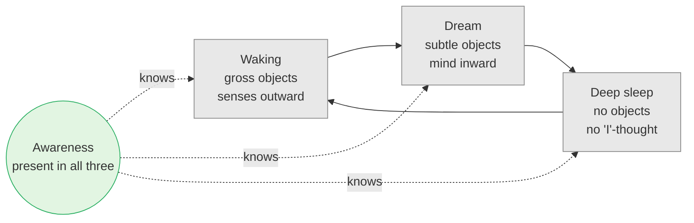

# Day 8 — Three States, One Witness (*Avasthā-Traya*)

> **Today's one idea:** Waking, dream and deep sleep come and go; the awareness in which they come and go does not. What persists while everything else varies is not one of the things that vary.
> **Reading time:** ~40 min · **Prereqs:** [Day 6](./day-06-seer-and-seen.md), [Day 7](./day-07-the-five-sheaths.md)
> **Primary source for today:** Māṇḍūkya Upaniṣad, mantras 3–5, with Shankara's commentary — Swami Gambhirananda (trans.), *Eight Upaniṣads*, Vol. 2, Advaita Ashrama, 1958; and Chāndogya Upaniṣad 8.7–8.12 — Swami Gambhirananda (trans.), Advaita Ashrama, 1983.
> **Before you start:** Without looking — *name the five sheaths in order, and say why the bliss sheath is still a sheath. What is "the tail, the support"?*

---

## The hook (4 min)

The gods and the demons both hear a rumour: the creator, Prajāpati, has spoken of a Self that is free from evil, old age, death, grief, hunger and thirst — and whoever finds and understands it gains all worlds and all desires (Chāndogya 8.7.1). Each side sends its best. Indra comes from the gods, Virocana from the demons. They arrive, fuel-sticks in hand, the traditional sign of students, and live with Prajāpati for thirty-two years.

Then Prajāpati gives his first teaching: *"The person you see in the eye — that is the Self."* Look into a pan of water, he says. They dress in their finest clothes, look into the water, see themselves adorned. *"That is the Self,"* he says. Both leave satisfied.

Virocana goes home and teaches the demons: *the body is the Self — serve it, adorn it.* Indra, halfway home, stops. *If the body is adorned, the Self is adorned. If the body is blind, the Self is blind. If the body is maimed, the Self is maimed. When the body dies, the Self dies. I see nothing good in this.* He walks back.

Thirty-two more years. Second teaching: *the one who moves about happily in dreams — that is the Self.* Indra leaves; stops again. *In dreams one is chased, struck, one weeps. I see nothing good in this.* Back again.

Thirty-two more years. Third teaching: *when one is fast asleep, composed, serene, knowing no dream — that is the Self.* Indra leaves; stops again. *But then one does not know oneself as "I am this", nor anything else. It is as if one has gone to annihilation. I see nothing good in this.*

Back a fourth time. Five more years — a hundred and one in total — and Prajāpati finally teaches the Self that the body, the dreamer and the sleeper were all pointing at (8.12).

Today you do Indra's hundred and one years in forty minutes.

---

## Building the intuition (12 min)

### Three rooms

Every twenty-four hours, you live in three different worlds:

- **Waking.** A world of shared objects — tables, people, traffic — reached through the senses. You have a body here, a name, a history.
- **Dream.** A different world, just as convincing while it lasts. Different places, sometimes a different body, a different age, people who don't exist. Its objects are made of mind, but you don't know that while you're in it.
- **Deep sleep.** No world at all. No objects, no body, no "I". Nothing — and yet, on waking, you say "I slept well."

Notice how complete the differences are. The waking world does not exist in the dream (your waking bedroom is nowhere in a dream of a beach). The dream world does not exist in waking (you can't return to the dream beach). Neither exists in deep sleep. Each state *cancels* the other two.

### The thread through the beads

Now ask what is *common*. Not the objects — they're entirely different. Not the body — the dream body isn't the waking body, and in deep sleep there's no body-sense at all. Not the personality — dream-you may act in ways waking-you never would. Not even the sense of "I" as a particular person — it vanishes in deep sleep.

What's left? Only this: **each state was experienced.** The waking world was known. The dream world was known. Even the deep sleep was, in some sense, known — otherwise how would you report it?

Picture a necklace: three very different beads — one wooden, one glass, one stone. Remove any bead and the others are still on the necklace. What runs through all three, and isn't any of them, is the thread.

That is Day 6's rule extended across time: *the seer is constant, the seen changes* — and now "the seen" includes entire worlds.

---

## The formal picture (14 min)

### The Māṇḍūkya's three quarters

The Māṇḍūkya Upaniṣad (mantras 3–5) names the self in each state:

| State | Name of the experiencer | Mantra's description | What is experienced |
| --- | --- | --- | --- |
| Waking (*jāgrat*) | *Vaiśvānara* (also called *viśva*) | Outward-cognising (*bahiṣ-prajña*), enjoyer of the gross (*sthūla-bhuk*) | The physical world through senses |
| Dream (*svapna*) | *Taijasa*, "the luminous one" | Inward-cognising (*antaḥ-prajña*), enjoyer of the subtle (*pravivikta-bhuk*) | Mental images made of past impressions |
| Deep sleep (*suṣupti*) | *Prājña*, "the knower" | Unified (*ekībhūta*), a mass of consciousness (*prajñāna-ghana*), made of bliss (*ānandamaya*), enjoyer of bliss (*ānanda-bhuk*), whose only door is awareness (*ceto-mukha*) | No objects; undifferentiated rest |

Mantra 5's description of deep sleep is precise: it is the state where *the sleeper desires no desire and sees no dream*. Notice the word *ānandamaya* — the same "made of bliss" from yesterday's fifth sheath. Deep sleep is where the bliss sheath is most purely on show: no objects, no wanting, the gap of [Day 1](../../01-shubheccha/days/day-01-the-itch-objects-cant-scratch.md) temporarily closed.

These are the first three "quarters" (*pāda*) of the Self. Mantra 7 describes a fourth — but that is Day 10, and it is deliberately *not* a fourth state. Hold the question.

### The method: continuity and discontinuity (*anvaya–vyatireka*)

The tradition's reasoning here has a name: ***anvaya–vyatireka*** — "presence-together and absence-apart". It's the logic you use to find a faulty component:

- If the fault is present whenever component A is present (*anvaya*), and absent whenever A is absent (*vyatireka*), A is implicated.
- Conversely: if X is present when Y is absent, X is not Y.

Applied to the three states:

| | Waking | Dream | Deep sleep |
| --- | --- | --- | --- |
| Waking world and waking body | present | absent | absent |
| Dream world and dream body | absent | present | absent |
| Thoughts, "I"-sense, personality | present | present (altered) | absent |
| Awareness of what is present | present | present | present (of absence) |

Every row varies except the last. So: **awareness is not the waking body, not the dream body, not the mind or the "I"-thought** — because each of those is absent in some state where awareness is not. Vidyāraṇya opens the Pañcadaśī with exactly this argument: the objects of waking differ from one another, but the consciousness of them, being uniform, does not; the same holds in dream; and in deep sleep the absence is known (Pañcadaśī 1.3–1.7).

### How do we know about deep sleep?

The weakest-looking row is the last cell: "awareness present (of absence)". How can anyone claim awareness is there when nothing is experienced? The tradition's argument is from memory. On waking, you say:

> *sukham aham asvāpsam, na kiñcid avediṣam* — "I slept happily; I knew nothing."

The argument runs:

1. This report is a *memory*, not a guess — it has the immediate, first-person feel of recollection.
2. Memory requires prior experience: you can only remember what was experienced.
3. ∴ Something experienced the happiness and the not-knowing during sleep.
4. That "something" can't have been the mind or the "I"-thought, which were not functioning.
5. ∴ It was the witness — awareness present without objects.

This is the strongest form of the argument; it should also be met with its strongest objections.

**Objection 1 (classical — the Nyāya school):** The report is not a memory but an *inference*. On waking, I find a gap with no memories, I feel rested, and I *conclude* "I must have slept soundly and known nothing." No experience during sleep is required. Advaitins reply that the report doesn't feel inferential and that the felt "happily" is a positive content, not a mere gap — but the dispute is genuine and old.

**Objection 2 (logical):** Can you remember an *absence*? To remember "I knew nothing" you'd seem to need an experience of nothingness, which is odd. The Advaitin answer is that the experience was of ignorance itself — a positive "blank" — not a non-experience. You may or may not find that convincing; notice what it costs.

**Objection 3 (scientific):** Sleep research distinguishes stages; people woken from non-REM sleep often report *some* thought-like mentation, so "dreamless sleep" as a physiological category and "deep sleep" as the Upaniṣad's experiential category don't map neatly. Evan Thompson's *Waking, Dreaming, Being* (2015) takes all three objections seriously — he discusses the old Indian debate about whether the sleep report is memory or inference, and looks at meditators who report remaining aware through sleep — and ends sympathetic to the question while unpersuaded that the memory argument alone settles it (ch. 8, "Sleeping: Are We Conscious in Deep Sleep?").

Here's what matters for this course: **the main conclusion does not rest on the deep-sleep argument alone.** The waking–dream comparison already shows that awareness is not the waking body or the waking world. And you need no argument at all to notice that, right now, the contents of experience change while their being-known does not. The deep-sleep row strengthens the case; it doesn't carry it.

### Prajāpati's final teaching

When Indra returns the fourth time, Prajāpati says (8.12): this body is mortal, gripped by death — but it is the dwelling of the deathless, bodiless Self. And then a line that is pure Day 6: *the one who knows "let me smell this" — that is the Self; the nose is only the instrument for smelling. The one who knows "let me say this" — that is the Self; speech is only the instrument* (8.12.4–5). The body-self, the dream-self, and the sleep-self were each *seen*. The Self is the one that knows all three.

---

## Where it breaks / what it is not (4 min)

**"So deep sleep is liberation — I'm the Self every night."** In a sense you *are* the Self every night — and every day. But deep sleep is not liberation, because it is not *knowledge*. Ignorance is present in seed form and the old identifications return intact on waking. Indra's third complaint is exactly right: in deep sleep there's no "I know I am this." Liberation, as [Day 4](../../01-shubheccha/days/day-04-the-tenth-man.md) said, is the end of ignorance — and ignorance does not end by switching off.

**"The witness is a fourth thing hovering above the three states."** It is not a thing, and it is not hovering. It is not a fourth state alongside the other three. That's Day 10's correction; for now, notice that you never *experience* the witness as an object in any state — you only notice it is what each state is known by.

**"Dreams are unreal and waking is real."** Today's argument doesn't need a ranking. It only needs that each state's contents are absent in the others, while awareness is not. (Whether waking is "more real" than dream is a later question — Days 13 and 18.)

**"This is a claim about brains."** It is a claim about *experience* and what persists in it. Thompson's work shows the two can be put in respectful conversation, but the Upaniṣad's argument stands or falls on first-person evidence, not on EEG.

---

## Try it yourself (10 min)

### 1. Retrieval first

Close the page. From memory: (a) give the Māṇḍūkya name for the experiencer in each of the three states and one word for what each enjoys; (b) state the *anvaya–vyatireka* argument in two sentences; (c) give one objection to the deep-sleep memory argument.

Hint

V… / T… / P… — gross, subtle, bliss. And: what is present when others are absent?

Model answer

(a) Waking: <em>vaiśvānara</em> (or <em>viśva</em>), enjoyer of the gross; dream: <em>taijasa</em>, enjoyer of the subtle; deep sleep: <em>prājña</em>, enjoyer of bliss. (b) Whatever is present while something else is absent cannot be that something. Awareness is present in waking, dream and sleep, while each state's world, body, and even the "I"-thought is absent in at least one — so awareness is none of them. (c) Any of: the Nyāya view that "I slept well, I knew nothing" is an inference from the gap, not a memory; the puzzle of remembering an absence; sleep science's finding that "dreamless" sleep often contains mentation.

### 2. Direct application — tonight and tomorrow morning

**Tonight**, just before sleep, notice the last thing you are aware of — a thought, the pillow, the sound of the room. Say silently: *"seen."* **Tomorrow morning**, in the first seconds of waking, before you reach for your phone, notice: (i) the world is reassembling — room, body, name, plans; (ii) was there a moment *before* the "I" with its plans came back? Then write three lines: what came back first; whether you could notice the world "arriving"; what was constant across falling asleep and waking.

Hint

Don't try to stay conscious through sleep. The exercise is only in the transitions, which are the seams where the beads meet the thread.

What to look for

Typical reports: the body-sense comes back first, then location ("I'm in my room"), then the name and the day's worries — in that order, within a few seconds. Many people notice a brief moment of plain awareness before the personal story re-installs itself. That sequence is the Māṇḍūkya made visible: the waking world and the "I" <em>arrive</em> — which means they are seen. If you noticed nothing of the sort, that's fine; you still noticed the world arriving, which is enough. What was constant: not the world (it disappeared and returned), not the thoughts (they stopped and restarted) — only the fact that whatever was present was known. A mistake to avoid: concluding "I was conscious all night" from this. The exercise doesn't show that; it shows what comes and goes.

### 3. Stretch — Virocana's error, Indra's virtue

Explain, using Day 6's three properties (one/many, constant/changing, never an object), exactly what Indra noticed at each of his three returns — i.e. which property each proposed Self failed. Then say why Virocana didn't notice.

Hint

Body: blind, maimed, dies. Dream-self: chased, weeps. Sleep-self: doesn't know itself.

Worked answer

<strong>Body-self:</strong> it changes with the body (adorned, blind, maimed, dead) — fails <em>constant</em>; and it is perceived, so it fails <em>never an object</em>. <strong>Dream-self:</strong> it suffers and changes with dream contents — fails <em>constant</em>; and it is known on waking as having been chased and weeping — seen. <strong>Sleep-self:</strong> Indra's objection is subtler: a self that "does not know itself as I am this, nor these beings" seems like annihilation. Prajāpati's final answer is that the Self is not the sleep-state either but the knower in all three — so the sleep-self as a <em>state</em> fails <em>constant</em> too (it comes and goes). Virocana didn't notice because he never examined — he took the first, most pleasant answer (the adorned body) and went home: <em>preyas</em> without <em>samparītya</em>. The difference between the two students is not intelligence; it is discrimination.

### 4. Spaced callback — Indra's qualifications

On [Day 3](../../01-shubheccha/days/day-03-the-four-qualifications.md) you learned the four qualifications (*viveka*, *vairāgya*, the six disciplines, *mumukṣutva*). Find evidence of each in Indra's story, and name which ones Virocana lacked.

Hint

What did Indra give up to spend 101 years as a student? What made him turn back on the road? What kept him returning?

Worked answer

<strong>Viveka:</strong> each time, Indra examined the answer and saw its flaw ("I see nothing good in this") — discrimination between the lasting and the passing. <strong>Vairāgya:</strong> he was king of the gods and left heaven's enjoyments for over a century of study. <strong>Six disciplines:</strong> <em>titikṣā</em> (enduring 101 years of student life), <em>śraddhā</em> (returning to the same teacher after three insufficient answers — provisional trust pending verification, not blind acceptance), <em>samādhāna</em> (the goal never wavered). <strong>Mumukṣutva:</strong> nothing else would satisfy him. Virocana lacked <em>viveka</em> above all — he accepted the body-self without examination — and with it <em>mumukṣutva</em>: his desire was satisfied by the first pleasant answer. Prajāpati gave both students the same words; as Day 3's hook predicted, the result depended on the listener.

**Transfer — apply it:**

> Pick one thing you are sure is "really you" — your profession, a core opinion, your nationality, a temperament. Write one sentence: *the input* (the identity), *what today's idea does to it* (asks: is it present in dream? in deep sleep?), and *the output* (whether it passes the "present in all three states" test, and what that implies about holding it more lightly). If nothing comes to mind in 60 seconds, re-read the hook and try again.

---

## Connect it back

Yesterday you ran the seer/seen rule through *space* — five sheaths of the person — and found each one known. Today you ran it through *time*: waking, dream and deep sleep each cancel the others, and only the awareness of them persists. Indra walked back three times because each proposed Self failed exactly the test Day 6 set. Tomorrow is the first drill: no new theory, only eight live exercises that make you do the discrimination on real experience until it bites.

**Sharp question:** *If awareness is present in deep sleep, why don't you know it there — and what would it mean to know it now?*

---

## Suggested readings for today

**Required if you have 15 extra minutes:** Chāndogya Upaniṣad **8.7–8.12** in Gambhirananda's translation — Indra and Virocana in full. It reads like a short story. Note the 32 + 32 + 32 + 5 years, and read 8.12 slowly.

**If you want the deep version:**
- Māṇḍūkya Upaniṣad **mantras 2–5** with Shankara's commentary, in Gambhirananda's *Eight Upaniṣads*, Vol. 2 — notice how Shankara explains why deep sleep is called *prājña* even though nothing is known in it.
- Evan Thompson, *Waking, Dreaming, Being* (Columbia, 2015), **ch. 8, "Sleeping: Are We Conscious in Deep Sleep?"** — the most careful modern treatment of whether deep sleep is a state of consciousness, engaging the Indian debate and sleep science side by side.
- Swami Sarvapriyananda, ***Māṇḍūkya Upaniṣad*** lecture series (Vedanta Society of New York) — the early sessions on mantras 3–5; the clearest taught version of the three states.

---

## Navigation

← **Previous:** [Day 7 — The Five Sheaths](./day-07-the-five-sheaths.md)
→ **Next:** [Day 9 — DRILL I: Seer from Seen](./day-09-drill-seer-from-seen.md)
