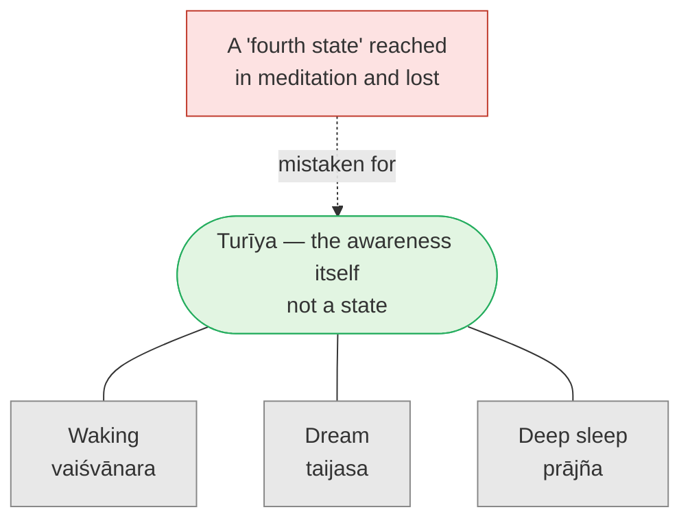

# Day 10 — *Turīya*: The Fourth That Isn't a Fourth

> **Today's one idea:** *Turīya* ("the fourth") is not a fourth state to be reached alongside waking, dream and deep sleep; it is the awareness in which all three appear — present in each, limited by none.
> **Reading time:** ~40 min · **Prereqs:** [Day 8](./day-08-three-states-one-witness.md)
> **Primary source for today:** Māṇḍūkya Upaniṣad mantra 7, and Gauḍapāda's *Kārikā* ch. 1 (*Āgama Prakaraṇa*), vv. 10–16, with Shankara's commentary — Swami Gambhirananda (trans.), *Eight Upaniṣads*, Vol. 2, Advaita Ashrama, 1958.
> **Before you start:** Without looking — *in Drill 8 yesterday, why was the search for the witness guaranteed to fail? And from Day 8: name the Māṇḍūkya's experiencer of each of the three states.*

---

## The hook (3 min)

A friend comes back from a meditation retreat, glowing. *"I got to turīya,"* she says. *"On day six. It lasted about forty minutes. Total stillness — beyond waking, beyond dreaming, beyond sleep. Then it faded and I've been trying to get back there ever since."*

Hear that sentence with Day 8 in mind. A state that began on day six, lasted forty minutes and faded. Something she reached, lost, and wants to reach again.

Now read what the Māṇḍūkya says of *turīya* in mantra 7: it is "unseen", "ungraspable", "beyond thought", "in which the world has come to rest" — and then, quietly: ***sa ātmā*** — *"that is the Self."*

The Self is not something you visit on day six of a retreat. Whatever she visited, it wasn't the Self *as a place she went to*. Today is about the single most common misreading of the three states — and why the Upaniṣad's "fourth" is the one thing that cannot be a fourth thing.

---

## Building the intuition (12 min)

### Three films, one screen

You're in a cinema watching three films in a row: an action film (bright, loud, crowded), a surreal art-house film (dreamlike, shifting, strange), and then — a long stretch of black, nothing on screen, the projector running on an empty reel.

Somebody asks: *"How many things did you see?"* You might say four: three films and the black stretch. Or three: action, art-house, darkness.

But there was something on view the whole time that you didn't count. The **screen**. It was in the action film — every explosion was screen. It was in the art-house film — every melting clock was screen. It was in the dark stretch — the darkness was *on* the screen; without the screen you couldn't even have seen darkness.

Was the screen a fourth film? No. You can't watch the screen "next" after the three films, as item number four. It's not on the programme. It's *what the programme is shown on*. To call it "the fourth" only makes sense as a way of saying "not one of the three — that in which the three are."

Map it:

| Cinema | Māṇḍūkya |
| --- | --- |
| Action film | Waking — *vaiśvānara*, the gross world |
| Art-house film | Dream — *taijasa*, the subtle world |
| Black reel | Deep sleep — *prājña*, no objects |
| The screen | *Turīya* — present in all, none of them |

### Why the black reel is the tempting one

Notice which film is most easily confused with the screen: the black reel. It's empty, still, featureless — it *looks* like "just the screen". That's exactly why people mistake deep sleep, or a thought-free meditative blank, for *turīya*. But the black stretch is still a film. It begins and ends. It is *on* the screen. The screen was equally present in the loud action scene.

That is the retreat friend's error. Forty minutes of stillness is the black reel: deeply restful, valuable, and still a film. *Turīya* was equally present on the drive home in traffic.

---

## The formal picture (14 min)

### Mantra 7 — the description by negation

After describing the three quarters (mantras 3–5, Day 8) and a cosmic note (mantra 6), the Māṇḍūkya describes the fourth (mantra 7):

> नान्तःप्रज्ञं न बहिष्प्रज्ञं नोभयतःप्रज्ञं न प्रज्ञानघनं न प्रज्ञं नाप्रज्ञम्
> अदृष्टमव्यवहार्यमग्राह्यमलक्षणमचिन्त्यमव्यपदेश्यम्
> एकात्मप्रत्ययसारं प्रपञ्चोपशमं शान्तं शिवमद्वैतं चतुर्थं मन्यन्ते — स आत्मा, स विज्ञेयः

In paraphrase:

> Not inwardly cognising (that negates dream), not outwardly cognising (waking), not both; not a mass of cognition (deep sleep); not cognising, not non-cognising. Unseen, beyond dealings, ungraspable, without marks, unthinkable, indescribable. Its essence is the one consistent awareness of Self; in it the world comes to rest (*prapañcopaśama*); peaceful, auspicious, non-dual. This, they consider, is the fourth. **That is the Self; that is to be known.**

Read the structure, not just the words:

1. **The first line negates each state's defining feature.** "Not inward" removes the dreamer; "not outward" removes the waker; "not a mass of cognition" removes the sleeper. So *turīya* is not *characterised* by any state.
2. **The second line negates objecthood.** Unseen, ungraspable, without marks, unthinkable — Day 6's *never an object*, said six ways.
3. **The third line points positively** — but only with words that describe the *absence* of division: one, at rest, peaceful, non-dual.
4. **The last line identifies it:** *sa ātmā* — it's not a place, it's you.

### "Fourth" — a word that undoes itself

Shankara explains the word *pāda* ("quarter") with a careful image (commentary on mantra 2): the Self's "quarters" are not like the four legs of a cow — four separate parts side by side — but like the quarters of a coin, where the smaller units are absorbed into the larger. The first three are taken up into the fourth, which is *what they were all along*. "Fourth" is a counting word used to stop the counting — it names what can't be numbered among the three.

### Gauḍapāda's sharpening

Gauḍapāda, the earliest Advaita teacher whose work survives (traditionally Shankara's teacher's teacher), wrote verses (*Kārikā*) on the Māṇḍūkya. In chapter 1 he sets out exactly how *turīya* differs from the states — especially from deep sleep, the black reel:

| Gauḍapāda (ch. 1) | The point | In the cinema |
| --- | --- | --- |
| v. 11 | The waker and dreamer are bound by both cause and effect; the sleeper by cause alone; *turīya* by neither | Every film depends on a reel; the screen doesn't |
| v. 12 | The sleeper knows nothing — neither self nor others, neither true nor false; *turīya* is "ever all-seeing" (*sarva-dṛk sadā*) | The black reel shows nothing; the screen is what shows everything, including black |
| v. 13 | Non-perception of duality is common to sleep and *turīya*; but sleep has the "seed-sleep" (ignorance) and *turīya* does not | Both the black reel and the screen lack images; only the black reel is a film |
| v. 15 | Dream is *misperceiving* reality; sleep is *not perceiving* it; when both errors end, one reaches the fourth | Watching a film as real; not watching at all; vs knowing the screen |
| v. 16 | When the individual, asleep in beginningless *māyā*, awakes, it knows the unborn, sleepless, dreamless non-dual | Not leaving the cinema — recognising the screen |

The decisive verse is the one on deep sleep (v. 13): sleep and *turīya* look alike — no duality perceived in either — but sleep still contains the *seed* of ignorance, which is why the world and the old "me" sprout back on waking (Day 8's warning). *Turīya* contains no seed because it is not a state at all; it is the awareness in which the seed, the sprouting and the sleeping all show up.

Note the word *māyā* in v. 16. It is used here only in its plain sense — the beginningless "sleep" of not knowing. Its full technical meaning waits for Day 15.

### So what is *known* when *turīya* is known?

Not a new experience. The mantra's last words — *sa vijñeyaḥ*, "that is to be known" — echo [Day 4](../../01-shubheccha/days/day-04-the-tenth-man.md): what ends is ignorance, and nothing new is gained. Knowing *turīya* is recognising that the awareness you already are in waking, dream and sleep was never *in* those states as one of their contents. The tenth man doesn't go anywhere to become the tenth.

---

## Where it breaks / what it is not (4 min)

**"*Turīya* is a special meditative state."** The central error. Any state you enter and leave is one of the three (or a variation of them — a waking state of deep calm, a dreamlike vision, a sleep-like absorption). A meditative stillness can be a very good *occasion* for noticing the screen, because the film is quiet. But the screen is not the quietness.

**"Then meditation is useless."** No — Day 3's telescope still applies. Calm states steady the instrument. Day 23 makes the distinction precise: meditation steadies; knowledge liberates.

**"*Turīya* is a fourth level above the other three."** Levels and above are spatial pictures; the screen is not above the film. The mantra's first line negates every state's feature; it doesn't place *turīya* higher on the same ladder.

**"If it's present in waking, I should be able to notice it as something."** Back to Drill 8. It is present as what is *noticing*, not as what is noticed. "Unseen, ungraspable" is not a statement about its being hidden — it is a statement about its not being an object.

**A scientific counterpoint.** Evan Thompson (*Waking, Dreaming, Being*, 2015) takes the idea of a witnessing awareness seriously, but is wary of describing it as something outside time and the brain; he reads it more as a mode or feature of consciousness that can be cultivated and studied (see esp. ch. 3, "Being: What Is Pure Awareness?", and ch. 5, "Witnessing: Is This a Dream?"). The convergence is worth noting: Thompson also refuses to treat it as one more mental *content*. Where he and Advaita differ is on its ultimate status — a question the course takes up from Day 11 onward, not settled here.

---

## Try it yourself (10 min)

### 1. Retrieval first

Close the page. From memory: (a) give the Māṇḍūkya mantra 7 description in your own words — what does its first line negate, its second line negate, and how does it end? (b) Using the cinema analogy, explain why deep sleep is the state most easily mistaken for *turīya*, and what Gauḍapāda says distinguishes them.

Hint

Inward / outward / mass of cognition. Then: unseen, ungraspable… Then: <em>sa ātmā</em>. And: the black reel; the "seed".

Model answer

(a) The first line negates the features of each state: not inward-cognising (dream), not outward (waking), not a mass of cognition (sleep), nor cognising nor non-cognising. The second line negates objecthood: unseen, ungraspable, without marks, unthinkable, indescribable. It ends by pointing — one, peaceful, non-dual, the world at rest in it — and identifying: "that is the Self; that is to be known." (b) Deep sleep is the black reel: empty and still, so it looks like the bare screen. But it's still a film — it begins and ends. Gauḍapāda says both lack perception of duality, but sleep contains the seed of ignorance (from which waking and dream sprout again), while <em>turīya</em> does not — it isn't a state at all.

### 2. Direct application — find the screen in a busy scene

Choose the *busiest* ten minutes of your day tomorrow — not a quiet one. At some point during it, pause for three breaths and notice: (i) the "film" — sounds, sights, thoughts, the sense of hurry; (ii) that all of it is *being known*, right now, without effort; (iii) whether the knowing is any less present here than it would be in a quiet meditation. Write two lines afterwards.

Hint

Don't try to make the scene quieter. The exercise is specifically to notice the screen during the action film.

What to look for

Most people find that, during the three breaths, the busy contents are fully present <em>and</em> fully known, and the knowing is not noisier because the contents are noisy. That's the point: the screen isn't hotter during an explosion. If you noticed a wish to escape into quiet in order to "find" awareness, notice that the wish is the retreat friend's error in miniature — looking for the screen in the black reel. If the whole thing felt like nothing special, good: <em>turīya</em> is not special in the sense of being a peak experience; it is what every experience, including an unspecial one, appears in.

### 3. Stretch — answer the retreat friend

Your friend from the hook says: *"I know what I experienced. It was beyond waking, dream and sleep. Don't tell me it wasn't turīya."* Write a kind, accurate reply (4–6 sentences) using mantra 7, Gauḍapāda's sleep verse, and Day 6's rule.

Hint

Affirm the value of what she experienced. Then ask: did it begin and end? Was it known?

Worked answer

"I don't doubt for a second that it was real and valuable — that kind of stillness is rare, and it probably made something clearer. The only question is about the label. You say it began on day six and faded after forty minutes; and you're describing it to me, which means it was known. By the rule we've been using, anything that begins, ends and is known is on the 'seen' side — a state. The Māṇḍūkya describes <em>turīya</em> as unseen and ungraspable and then says 'that is the Self' — so it can't be something you got to and lost; it has to be what was aware of the stillness, and what is aware of this conversation now. In a way that's better news: you don't have to get back there. What made the retreat valuable was that the film went quiet enough to notice the screen — and the screen is still here." 
Check your answer for: (a) not dismissing her experience; (b) using "began/ended/known" — the seen tests; (c) relocating <em>turīya</em> from the past retreat to the present conversation.

### 4. Spaced callback — the light that lights the dream

On [Day 5](../../01-shubheccha/days/day-05-who-is-asking.md), Janaka asked Yājñavalkya what the light of a person is when sun, moon, fire and speech have gone out, and the answer was "the Self is his light." The same Upaniṣad continues into dream and says that there "the person becomes self-luminous" (*svayaṃ-jyotiḥ*, Bṛhadāraṇyaka 4.3.9, 4.3.14). Connect this to today: (a) in which state does the Self most obviously serve as its own light, and why? (b) How does Yājñavalkya's "light" map onto the cinema analogy and onto *turīya*?

Hint

In a dream there is no sun, no lamp, yet dream-scenes are vividly lit. By what?

Worked answer

(a) Dream. In a dream there is no external sun, moon or fire, yet whole landscapes are seen; the only light available is awareness itself. Yājñavalkya uses dream to show that the Self's light doesn't depend on external lights — they were only ever <em>occasions</em>. (b) Sun, moon, fire and speech are like the particular films — they light particular scenes. The Self as "light" is the screen and projector-light together: what every scene, waking or dreamt, is lit by. Day 5 found the light by subtracting lights; Day 8 found the witness by subtracting states; today names that same light <em>turīya</em> and adds one correction — it isn't a fourth item left over after subtraction but what was lighting the other items all along. "Whatever is lit is not the light" (Day 5) is the same sentence as "no state is <em>turīya</em>."

**Transfer — apply it:**

> Pick one place where you hold an "arrival" picture of spiritual life — waiting for a breakthrough, a peak experience, a quiet period "when I can finally practise properly". Write one sentence: *the input* (the awaited state), *what today's idea does to it* (identifies it as a film — a state that begins and ends — and relocates *turīya* to the awareness already present now), and *the output* (what you would practise differently today if you stopped waiting for the black reel). If nothing comes to mind in 60 seconds, re-read the hook and try again.

---

## Connect it back

Day 8 showed that awareness persists through waking, dream and deep sleep while their contents do not; yesterday's drill showed that this awareness can't be found as an object however hard you look. Today names it with the Māṇḍūkya's word *turīya* and corrects the misreading that word invites: it is not a fourth state to be reached but the screen on which the three films play — "that is the Self." Tomorrow asks how words can say anything at all about what is unseen, ungraspable and indescribable: the answer is that Brahman is *indicated*, not described, by *sat-cit-ānanda*.

**Sharp question:** *If turīya is present in all three states equally, what exactly is missing in waking life that makes us not know it?*

---

## Suggested readings for today

**Required if you have 15 extra minutes:** Māṇḍūkya Upaniṣad **mantra 7** with Shankara's commentary, in Gambhirananda's *Eight Upaniṣads*, Vol. 2 — read the mantra three times, then Shankara on why each negation is needed.

**If you want the deep version:**
- Gauḍapāda, *Māṇḍūkya Kārikā* **1.10–1.16** with Shankara's commentary (same volume) — the sharpest classical statement of how *turīya* differs from deep sleep.
- Swami Sarvapriyananda, ***Māṇḍūkya Upaniṣad*** lecture series (Vedanta Society of New York) — the sessions on mantra 7; the "turīya is not a fourth state" point is made with great care.
- Evan Thompson, *Waking, Dreaming, Being* (Columbia, 2015), **the Introduction and ch. 5, "Witnessing: Is This a Dream?"** — a respectful scientific reading of the four "quarters".

---

## Navigation

← **Previous:** [Day 9 — DRILL I: Seer from Seen](./day-09-drill-seer-from-seen.md)
→ **Next:** [Day 11 — Sat-Cit-Ānanda](./day-11-sat-cit-ananda.md)
