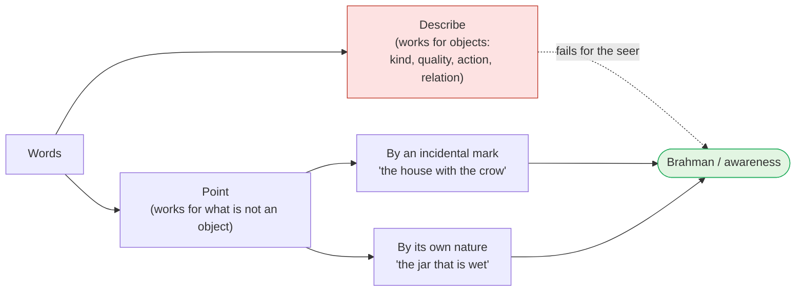

# Day 11 — Sat-Cit-Ānanda: How Words Point (*Lakṣaṇa*)

> **Today's one idea:** Brahman cannot be *described* — words only describe objects — but it can be *indicated* (*lakṣaṇa*): words like "existence, consciousness, limitlessness" point the attention, as a branch points to the moon, at what was never an object.
> **Reading time:** ~35 min · **Prereqs:** [Day 6](./day-06-seer-and-seen.md), [Day 10](./day-10-turiya.md)
> **Primary source for today:** Taittirīya Upaniṣad 2.1 and 3.1–3.6, with Shankara's commentary — Swami Gambhirananda (trans.), *Eight Upaniṣads*, Vol. 1, Advaita Ashrama, 1957.
> **Before you start:** Without looking — *why is turīya not a fourth state? Answer using the screen and the films, and say what Māṇḍūkya 7 does with words like "not inward-knowing, not outward-knowing".*

---

## The hook (3 min)

It is the evening after the new moon. The crescent is a hair-thin line, low in the sky, and a child cannot find it. "Where? Where?" The father kneels, points, and says: *"See that tree? The highest branch? The moon is just at the tip of it."*

The child looks along the branch — and there it is.

Notice what just happened. Everything the father said was, strictly, false. The moon is not *on* the branch; it is nearly 400,000 km behind it. The branch tells you nothing about the moon's size, material or distance. And yet the sentence worked perfectly, because it was never meant to *describe* the moon. It was meant to *aim the eye*. Once the eye lands, the branch is dropped.

Now hold the problem this page has to solve. For five days you have been building one rule: whatever is an object cannot be the awareness that knows it ([Day 6](./day-06-seer-and-seen.md)). Words name objects. So the Taittirīya Upaniṣad seems to contradict itself: in 2.4.1 it says Brahman is that *"from which words turn back, together with the mind, not having reached it"* — and three sections earlier, in 2.1, it has already given a three-word definition: ***satyaṃ jñānam anantaṃ brahma***, "Brahman is existence, consciousness, limitlessness."

Either the Upaniṣad is confused, or it is doing to you what the father did to the child.

---

## Building the intuition (12 min)

### Thought experiment 1 — what words can grab

Try to describe *anything* — a cup on your desk. You will find you have only four kinds of handle:

| Handle | Example | What it needs |
| --- | --- | --- |
| Kind (genus) | "It's a cup" | a class it belongs to among other members |
| Quality | "It's blue, warm" | a property it has and other things lack |
| Action | "It's steaming, it holds tea" | something it does, which starts and stops |
| Relation | "It's mine, it's next to the laptop" | a second thing to stand in relation to |

Shankara uses almost exactly this list — *jāti, guṇa, kriyā, sambandha* — when he explains why Brahman cannot be directly expressed (Gītā-bhāṣya 13.12 — numbered 13.13 in editions that count Arjuna's opening question as 13.1). Now run it on the seer of [Day 6](./day-06-seer-and-seen.md). Is awareness one member of a class of awarenesses? Does it have a colour? Does it start and stop ([Day 8](./day-08-three-states-one-witness.md))? Does it stand beside a second thing — or is every "second thing" something appearing *in* it ([Day 10](./day-10-turiya.md))? Every handle slips. Words can't *grab* it.

But words can still do what the father's branch did.

### Thought experiment 2 — the crow on the roof

You are looking for Devadatta's house in a row of identical cottages. A neighbour says: *"It's the one with the crow on the roof."* You look, see the crow, and walk to the right door.

The crow is not part of the house. In an hour it will fly away. But for the purpose of *finding* the house, it was perfect. This is the second kind of pointer: an **incidental mark** — true of the thing for now, from a certain angle, though not what the thing *is*.

### Thought experiment 3 — "it's the one that is wet"

Compare a different instruction: someone hands you three unlabelled jars — sand, salt, water — and says *"the water is the one that's wet."* Wetness is not perched on water like a crow on a roof; you cannot remove it and still have water. This is a **pointer by nature**: it indicates the thing through what it essentially is. Even so, "wet" does not *give* you water — you still have to put your hand in.

Hold onto the three images — branch, crow, wetness. The formal picture just gives them Sanskrit names.

---

## The formal picture (12 min)

### *Lakṣaṇa* — the indicator

A ***lakṣaṇa*** is a mark that singles a thing out from everything else. Shankara, commenting on Taittirīya 2.1, draws a precise contrast: an ordinary qualifier (*viśeṣaṇa*) distinguishes a thing from others *of its own kind* — "the *blue* lotus" sorts one lotus from red ones. A *lakṣaṇa* instead distinguishes its target from *everything*, without placing it in a kind at all. Brahman has no fellow members; so the three words of 2.1 are *lakṣaṇas*, not adjectives. They do not add properties to a thing. They direct attention to it.

The tradition recognises two kinds:

| | ***Taṭastha-lakṣaṇa*** (incidental indicator) | ***Svarūpa-lakṣaṇa*** (indicator by nature) |
| --- | --- | --- |
| Image | The crow on the roof | Wetness of water |
| True of the target… | from one standpoint, for a while | always, as what it is |
| Scriptural example | Taittirīya 3.1: "that from which these beings are born, by which they live, into which they return" | Taittirīya 2.1: *satyaṃ jñānam anantam* |
| Points at Brahman as… | cause of the world (needs a world to point from) | itself |

### The incidental pointer — Bhṛgu's question

In Taittirīya 3.1, Bhṛgu asks his father Varuṇa, *"Sir, teach me Brahman."* Varuṇa does not define it. He says, in substance: *that from which these beings are born, by which, once born, they live, and into which they go back and merge — seek to know that; that is Brahman.* Then he sends Bhṛgu off to contemplate.

This is a crow on the roof. "Cause of the world" is true of Brahman only *relative to* a world — and as Day 13 will show, the world's status is peculiar. But as a starting point it is ideal, because it starts from what you already see. Bhṛgu goes through food, breath, mind, intellect (3.2–3.5) — you will recognise the layers of [Day 7](./day-07-the-five-sheaths.md) — and finally (3.6) *"he knew: ānanda is Brahman."*

### The pointer by nature — *satyaṃ jñānam anantam*

Shankara's commentary on 2.1 treats each word as doing two jobs: pointing, and *cancelling a wrong reading the other words might invite*.

| Word | Points to | Cancels | Wrong reading it would allow on its own |
| --- | --- | --- | --- |
| ***Satyam*** (existence, *sat*) | That which never departs from what it is | Everything that changes, everything produced | "Some unchanging stuff — like insentient clay" |
| ***Jñānam*** (consciousness, *cit*) | Consciousness itself — not a *knower* who does acts of knowing | Insentience; also the idea of an agent | "A mind that knows things — and minds are many and finite" |
| ***Anantam*** (limitlessness) | Not limited by space, time or any other thing | Every boundary | "Something big" — answered by the other two: not a big object, but existence-consciousness without edges |

Notice the careful move on *jñānam*. Shankara insists it means knowing as such, not a knower. A knower would be an agent; an agent changes from act to act; a changing thing is not *satyam*. So the words lean on each other until only one target fits.

Later Advaita compresses this into the formula ***sat-cit-ānanda*** — existence, consciousness, fullness. (The compound itself is more common in post-Shankara texts; Shankara anchors on Taittirīya 2.1 and on Bṛhadāraṇyaka 3.9.28's *vijñānam ānandaṃ brahma*, "Brahman is consciousness, bliss".)

### Why consciousness is not an attribute

Here [Day 6](./day-06-seer-and-seen.md) does the heavy lifting. An attribute is something you could, in principle, notice in its target — present here, absent there. Blue in the cup. But every noticing *is* consciousness. You can never catch consciousness as one feature among a thing's features, because the catching is done *by* it. Whatever has attributes is seen; consciousness is the seeing. So *cit* cannot be a property Brahman *has* — it is what Brahman *is*. Same for *sat*: you never meet "existence" as an extra feature beside a cup's blueness; the cup's *is* is the ground on which its blueness is noticed at all.

### Why *ānanda* = *ananta*

Taittirīya 2.1 says *anantam*; Bhṛgu's final insight (3.6) is *ānanda*. They are the same pointer read from two sides. Recall [Day 1](../../01-shubheccha/days/day-01-the-itch-objects-cant-scratch.md): *"the infinite (bhūmā) alone is happiness; there is no happiness in the small."* Happiness was what the *absence of the gap* felt like. Limitlessness *is* the absence of every gap. So *ānanda* here is not a pleasant feeling Brahman enjoys — it is *ananta*, fullness, recognised from the side of the one who was hunting for it.

---

## Where it breaks / what it is not (4 min)

**"Sat-cit-ānanda are three properties of God."** No — they are three pointers at one target, each cancelling the others' misreadings. Three branches, one moon.

**"So Brahman is a blissful experience I'll have in meditation."** An experience comes and goes; it would be on the *seen* side. *Ānanda* as *ananta* is not an experience but the limitlessness of the seer. Pleasant meditative states can *reflect* it (as Day 1's satisfied desire did) but are not it.

**"If words can't describe it, scripture is useless."** The opposite. Words fail to *describe*; they succeed in *pointing*. The Tenth Man ([Day 4](../../01-shubheccha/days/day-04-the-tenth-man.md)) wasn't given a description of himself — "you are the tenth" pointed him back at what he'd left out of the count. That is exactly the job a *lakṣaṇa* does.

**"Cit means cognition — what the brain does."** Cognitions (thoughts, perceptions) are modifications of the mind; they are *seen* ([Day 6](./day-06-seer-and-seen.md)). *Cit* is what they are seen *by*. Confusing the two is precisely the mistake Day 12 names.

**Don't confuse *lakṣaṇa* with *lakṣaṇā*.** Today's word, *lakṣaṇa* (short final *a*), is an *indicator* or definition. Its near-twin *lakṣaṇā* (long final *ā*) is a technical device of secondary meaning — how a sentence like *tat tvam asi* drops incompatible parts of its words. That arrives on Day 16.

---

## Try it yourself (8 min)

### 1. Retrieval first

Close this page. From memory: *why can't Brahman be described, and what are the two kinds of indicator? Give one scriptural example and one everyday image for each.*

Hint

Four handles words use. A crow, and wetness. Bhṛgu and Varuṇa.

Model answer

Words describe through kind, quality, action or relation; the seer has none of these (it is not one of a class, has no features, does not start or stop, has no second thing beside it). So Brahman can only be <em>indicated</em>. A <em>taṭastha-lakṣaṇa</em> points via an incidental mark true from one standpoint — the crow on the roof; Taittirīya 3.1, "that from which beings are born, by which they live, into which they return." A <em>svarūpa-lakṣaṇa</em> points via the thing's own nature — wetness of water; Taittirīya 2.1, <em>satyaṃ jñānam anantam</em>. If you also said the three words mutually cancel each other's misreadings, excellent.

### 2. Direct application — following the branch (contemplative, 6 minutes)

Sit with three ordinary things in view — say a cup, a plant, the sound of traffic.

1. Name each one's description: kind, a quality, an action. Notice how different they are.
2. Now drop the descriptions. Notice that each one *is*. Is the "is" of the cup different from the "is" of the traffic sound? Spend a full minute here.
3. Notice that each is *known*. Is the knowing of the cup blue? Is the knowing of the traffic loud?
4. Finally ask: is the "is" and the "knowing" two things, or one thing seen from two sides?

Write three lines on what you found.

Hint

In step 3, keep separating the object (blue, loud — seen) from the knowing of it. Day 6's rule: if you can find a quality, you've found something seen.

What to look for

Most people report: the descriptions differ completely; the "is" does not differ at all — there is no "louder is" for the traffic; and the knowing carries none of the objects' qualities (the knowing of blue isn't blue). Step 4 usually produces a pause: you can't find a gap between "the cup is" and "the cup is known" — the cup's existence is only ever met as known-existence. That pause is the target of <em>sat</em> and <em>cit</em> as pointers: one nature, two branches. If instead you found yourself <em>imagining</em> a vast glowing "Being", you turned the pointer into an object — drop the image and return to step 3.

### 3. Stretch — Māṇḍūkya's negations

Māṇḍūkya 7 indicates *turīya* almost entirely through negation: not inward-knowing, not outward-knowing, not a mass of knowing, unseen, ungraspable… Taittirīya 2.1 uses positive words. Are these two different methods, or the same one? Explain using today's distinction between describing and pointing.

Hint

What job does each positive word in 2.1 do <em>besides</em> pointing? Look at the "Cancels" column.

Worked answer

Same method from two directions. Each positive word in 2.1 already works by cancelling — <em>satyam</em> cancels the changing, <em>jñānam</em> the insentient, <em>anantam</em> the bounded. Māṇḍūkya simply makes the cancelling explicit. Neither gives you a description; both clear away wrong targets until attention rests on what cannot be cleared away — the seer. The positive form has one advantage: it stops you concluding that what remains is a blank nothing (<em>satyam</em>: it <em>is</em>; <em>jñānam</em>: it is <em>aware</em>). The negative form has one advantage: it stops you building a mental picture. A good student uses both. (Day 17, <em>neti neti</em>, turns the negative form into a full method.)

### 4. Spaced callback — Day 6

Without looking: state [Day 6](./day-06-seer-and-seen.md)'s rule in one sentence and name the four links of the *Dṛg-Dṛśya-Viveka* v.1 chain. Then use that rule — and nothing else — to prove that consciousness cannot be an *attribute* of Brahman.

Hint

Where does every attribute you have ever met sit — on the seer side or the seen side?

Model answer

Rule: whatever is an object of awareness cannot be that awareness. Chain: form is seen by the eye; the eye by the mind; the mind and its states by the witness (<em>sākṣī</em>); the witness is seen by none. Proof: every attribute is something that can be noticed in its bearer, so every attribute is on the <em>seen</em> side. If consciousness were an attribute, it would be noticeable — an object — and so, by the rule, not consciousness. Therefore consciousness is not a property anything has; it is the nature of the seer, which is what <em>jñānam</em> in Taittirīya 2.1 points to. If you only recited the chain without making the argument, redo the second half — the argument is the skill.

**Transfer — apply it:**

> Think of something in your work that can't be specified directly and is usually pointed at instead — "good taste" in design, "clean" code, a team's culture. Write one sentence: *the input* (the thing people try and fail to define), *what today's idea does to it* (sorts the pointers people use into incidental marks vs. pointers by nature), and *the output* (one pointer-by-nature you could give a new colleague that aims their attention rather than describing). If nothing comes to mind in 60 seconds, re-read the hook and try again.

---

## Connect it back

Yesterday, *turīya* turned out to be not a fourth thing alongside waking, dream and sleep, but the awareness they appear in — and Māṇḍūkya could only point at it by negation. Today explained why every Upaniṣad has to talk this way: words grab objects, and the seer isn't one, so scripture works like the father's branch — aim, then drop. *Satyaṃ jñānam anantam* points at the seer from its own nature; Varuṇa's "that from which beings are born" points from the world. Tomorrow asks the obvious next question: if the seer is limitless existence-consciousness, why does it feel like a tired body with a mortgage? The answer is a single mechanism — superimposition.

**Sharp question:** *If "consciousness" is a branch and not the moon, what exactly do you have to do with your attention after hearing the word?*

---

## Suggested readings for today

**Required if you have 15 extra minutes:** Taittirīya Upaniṣad **2.1** with Shankara's commentary (Gambhirananda, *Eight Upaniṣads*, Vol. 1). Read his treatment of each of *satyam*, *jñānam*, *anantam* — especially the argument that *jñānam* cannot mean "knower". It is the cleanest example in all of Shankara of words used as pointers.

**If you want the deep version:**
- Taittirīya Upaniṣad **3.1–3.6** (Bhṛgu Vallī) — Bhṛgu's five rounds of contemplation, each ending in "this is Brahman" until the last. Read it as a demonstration of an incidental pointer becoming a pointer by nature.
- Shankara, *Gītā-bhāṣya* on **13.12** (13.13 in editions that number Arjuna's opening question as 13.1; Gambhirananda trans.) — where he explains why Brahman cannot be called "being" or "non-being" in the ordinary sense, using the four handles of language: genus, action, quality, relation.
- Swami Swahananda (trans.), *Pañcadaśī*, **chapter 3** (*Pañcakośa-viveka*), **vv. 22–37** — with the five sheaths set aside, Vidyāraṇya argues that the witness which remains cannot be denied (existence, from v. 23), is self-revealing, and is limitless in space, time and object — and sums it up as Taittirīya 2.1's existence, consciousness, infinity (vv. 34–37); it links today directly to Day 7.

---

## Navigation

← **Previous:** [Day 10 — Turīya](./day-10-turiya.md)
→ **Next:** [Day 12 — Adhyāsa](./day-12-adhyasa.md)
