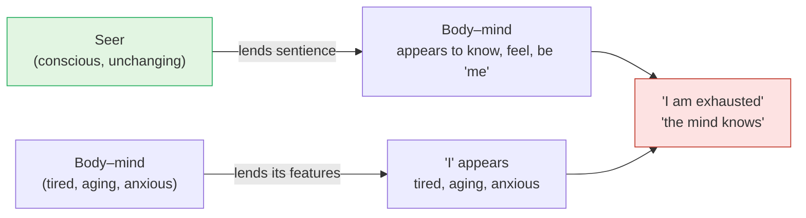

# Day 12 — Adhyāsa: The Rope and the Snake

> **Today's one idea:** Bondage is not a real union of the Self with body and mind — it is *superimposition* (*adhyāsa*): the seer's nature and the seen's features are mistaken for each other, so only knowledge, not any action, can undo it.
> **Reading time:** ~35 min · **Prereqs:** [Day 6](./day-06-seer-and-seen.md), [Day 7](./day-07-the-five-sheaths.md)
> **Primary source for today:** Shankara, *Adhyāsa Bhāṣya* (the preamble to the *Brahma-Sūtra-Bhāṣya*) — Swami Gambhirananda (trans.), *Brahma-Sūtra-Bhāṣya of Śrī Śaṅkarācārya*, Advaita Ashrama, 1965.
> **Before you start:** Without looking — *what is the difference between a svarūpa-lakṣaṇa and a taṭastha-lakṣaṇa, and why does Brahman have to be indicated rather than described?*

---

## The hook (3 min)

Your phone buzzes: *battery 5%*. You say to a friend, "Sorry, I'm about to die."

Pause on that. You are not about to die. Your *phone* is. Yet the sentence came out naturally, with no sense of exaggeration, and your friend understood it perfectly. A moment later you say, "I'm parked round the corner" — you are not parked anywhere; your car is. "I'm almost out of petrol." "I've been hacked."

Nobody is fooled by these sentences. But now try these: *"I'm exhausted." "I'm forty-three." "I'm anxious." "I'm not very clever."* These feel completely different — not like figures of speech at all, but like plain facts about *me*.

Here is the question this page asks. After Days 6–10, you know that the body, the energy, the mind and its moods are all *seen* — known by an awareness that is none of them ([Day 7](./day-07-the-five-sheaths.md)). Then "I am exhausted" should be exactly like "I'm about to die" said of a phone. Why does one feel like a joke and the other like the truth?

---

## Building the intuition (12 min)

### The rope at dusk

You walk home through a garden at dusk. On the path lies something long and coiled. Your heart jumps: *snake!* You freeze, sweat, step back. Someone shines a torch. It's a rope.

Slow the event down. Three ingredients made the snake:

1. **Something really there** — the rope. You *did* see "a long, coiled thing on the path." That part was correct.
2. **Something not seen** — the rope's specific features: its fibres, its knot. In the half-light these were hidden.
3. **Something supplied from memory** — "snake," a form you'd seen before (in a zoo, a film), projected onto the long coiled thing.

Result: *"This is a snake."* The **"this"** comes from the rope. The **"snake"** comes from memory. The mistake is welding them into one judgment.

And notice what the snake does *not* do. The rope gets no venom. When the torch comes on, nobody has to kill the snake, remove it or reform it; it simply turns out never to have been there. What ends is the *not-knowing* — and with it, the fear.

### Silver in the sand

A second classical example: walking on a beach you see a glint and think *"silver!"* — it's mother-of-pearl, shiny inside a shell. Same structure: a real "this" (the shell's gleam), a hidden specific (its being shell), and "silver" remembered from elsewhere. Your greed, like your fear on the path, is entirely real — and entirely about something that isn't there.

### The red-hot iron ball

Now a harder image, for the *two-way* mix-up. Put an iron ball in a forge until it glows. Now it burns, and it is round. Ask: *what* burns? The fire. *What* is round? The iron. But look at it and you see "a round thing that burns" — the iron seems to burn, the fire seems round. Each lends its property to the other. Neither has actually become the other; take the ball out, let it cool, and the iron is cold and the fire is shapeless.

Now return to the hook. "I'm exhausted" = the "I" (from the seer) welded to "exhausted" (from the body). The phone sentence is the same structure *recognised as a figure of speech*. The body sentence is the same structure *not recognised*. That non-recognition is the whole of bondage.

---

## The formal picture (12 min)

### Shankara's definition

The *Brahma-Sūtra-Bhāṣya* opens not with God or the world but with this error. Shankara defines it in four words:

> ***smṛti-rūpaḥ paratra pūrva-dṛṣṭāvabhāsaḥ***
> "the appearance, in the form of memory, of something previously seen, in something else."

Map it onto the rope:

| Phrase | Meaning | Rope–snake | "I am exhausted" |
| --- | --- | --- | --- |
| *avabhāsaḥ* | an appearance — not a real event | the snake *appears* | exhaustion *appears* to belong to me |
| *pūrva-dṛṣṭa* | of something previously seen | "snake" from past experience | "exhausted" — a state of the body, previously known |
| *smṛti-rūpaḥ* | in the form of memory, not fresh perception | snake isn't perceived; it's recalled | the identification isn't perceived; it's habit |
| *paratra* | elsewhere — on a substrate other than itself | on the rope | on the Self |

The pieces have names. The **substrate** on which the error appears is the ***adhiṣṭhāna*** (the rope). What is projected is the *adhyasta* (the snake). And the error happens when the substrate's general nature is seen ("this," "I") while its specific nature is missed.

### Mutual superimposition

Shankara opens the preamble with a paradox. Subject and object — what he calls the "I"-notion and the "you"-notion — are as opposed as *light and darkness*. They cannot be identified. And yet it is *natural* (*naisargika*) for everyone to say *"I am this"* and *"this is mine,"* mixing them up. He calls it ***itaretarādhyāsa*** — superimposition of each onto the other — and gives a graded list of examples, roughly:

| Level superimposed onto the Self | Sentence you say |
| --- | --- |
| External things | "If my family is well, I am well; if they suffer, I suffer" |
| Body | "I am fat, thin, fair; I stand, I walk" |
| Senses | "I am deaf, I am one-eyed" |
| Mind | "I want, I doubt, I've decided" |

And then the reverse: the witness — the Self, which illumines all of these — is superimposed back onto the mind and body, so that *they* seem to be conscious. That is the iron seeming to burn. "My brain is aware." "The mind knows." "This body is alive and feels." The sentience is borrowed.

### Why this changes everything

If the Self were *really* joined to the body — like milk mixed into water — freeing it would need a real operation: some practice, some action, some separating machine. But the four results of action from [Day 4](../../01-shubheccha/days/day-04-the-tenth-man.md) (produce, reach, modify, purify) don't touch an error. The snake isn't removed by producing a mongoose. **Because bondage is superimposition, the remedy is knowledge of the substrate** — the torch, not a weapon. Shankara says so directly: this superimposition, thus defined, the wise call *avidyā*; and the ascertaining of the real by discriminating it from what is superimposed they call *vidyā*, knowledge.

### Can you superimpose onto what isn't an object?

An objector presses: superimposition needs a substrate *in front of you*, like the rope. The Self is never an object ([Day 6](./day-06-seer-and-seen.md)). So how can anything be superimposed on it? Shankara's answer has two parts. First, the Self isn't totally unknown — it is immediately present as the "I" in every experience; that general "I" is the "this" of the error. Second, superimposition doesn't need a sensory object: the unknowing (*bālāḥ*, "children") see the sky — which has no surface — as having a surface and a dark colour, like an upturned blue bowl.

### Whose is the ignorance?

If there is only Brahman, *whose* ignorance is this? Brahman's? Then Brahman is ignorant. The individual's? But the individual is itself a product of the error. Daniel Ingalls (1953) argued that Shankara deliberately refuses both answers. When an objector asks whose ignorance it is, Shankara replies, in effect, *"yours — the one asking"* (BSBh 4.1.3: *yas tvaṃ pṛcchasi tasya ta iti vadāmaḥ*, "we say it is yours, who ask"). The question is asked from inside the error; outside it, there's no one ignorant to ask. You may recognise the Tenth Man here — the counter asking "who is missing?" is the missing one.

Later Advaita built a large theory of *avidyā* as a beginningless, quasi-material power. Swami Satchidanandendra (*The Method of the Vedanta*) argued that for Shankara himself *avidyā* simply *is* adhyāsa — the mistake, nothing more. For this course, the two readings converge where it matters: both say the error is beginningless, that only knowledge removes it, and that it never touches the substrate. The difference is in how much theory one builds around the mistake, not in what one does about it.

---

## Where it breaks / what it is not (4 min)

**"So the body is unreal and I should ignore it."** The rope is fine; the *snake* is the error. The body is fine; the error is "the body is what I am." Feed it, rest it, take it to the doctor. (Its exact status — not unreal, not ultimately real — is tomorrow's topic.)

**"I must stop saying 'I'm tired'."** No. Shankara's whole point is that ordinary life runs on this mixture and works. A knower may say "I'm tired" just as you say "I'm almost out of petrol" — the sentence stays; its *weight* changes.

**"The Self is stained by the body's suffering."** The rope gets no venom. The iron's roundness never changes the fire. Superimposition by definition leaves the substrate untouched — that's what makes liberation possible at all.

**"Adhyāsa happened at some point — I can find when."** Shankara calls it beginningless and natural. You don't need its start date to switch on the torch, any more than the man on the path needs to know when the snake began.

**"Adhyāsa is a mood of confusion I can feel."** It usually feels like nothing — like plain fact. That's why "I am anxious" doesn't sound like a figure of speech. The error is invisible from inside; it shows up only under discrimination.

---

## Try it yourself (8 min)

### 1. Retrieval first

Close the page. From memory: *give Shankara's definition of adhyāsa (in English or Sanskrit), map it onto the rope–snake, and state both directions of mutual superimposition with one example each.*

Hint

Four parts: appearance, of the previously seen, in the form of memory, elsewhere. And the iron ball.

Model answer

<em>Smṛti-rūpaḥ paratra pūrva-dṛṣṭāvabhāsaḥ</em>: the appearance, in the form of memory, of something previously seen, on something else. Rope = substrate (<em>adhiṣṭhāna</em>), seen generally as "this" but not specifically as rope; snake = remembered form projected onto it. Direction 1: features of body/mind put onto the Self — "I am tired / old / anxious." Direction 2: the Self's sentience put onto body/mind — "the mind knows," "my brain is aware." Bonus: because it is superimposition, not union, only knowledge removes it.

### 2. Direct application — catching the weld (one day, then 5 minutes)

For one day, collect **ten "I am…" sentences** you actually say or think (aloud or silently). In the evening, write each one in two columns: **"I" — from the seer** | **predicate — from the seen**. Mark which sheath ([Day 7](./day-07-the-five-sheaths.md)) each predicate comes from. Then find **two sentences of the *reverse* kind** — where you credited awareness to the mind, brain or body.

Hint

Reverse examples hide in phrases like "my mind noticed," "my brain registered," "my eyes saw it." Ask: was it the eyes that were aware?

What to look for

A typical list: "I'm hungry" (food sheath), "I'm drained" (vital), "I'm irritated" (mind), "I'm sure" (intellect), "I'm content" (bliss sheath). The skill is noticing that the "I" column is <em>identical</em> in all ten — no tired I, no irritated I, just the bare "I" lent to each — while the predicate column keeps changing. That asymmetry is Day 6's rule (seer one and constant, seen many and changing) caught in grammar. For reverse cases: "my mind went blank and then I noticed" — the noticing of the blankness was not done by the blank mind. If you could find only forward cases, that's normal; the reverse direction is subtler, and Drill II (Day 19) works on it.

### 3. Stretch — the sky and the Tenth Man

A friend objects: *"Superimposition needs something you can see — a rope in front of you. You've told me for a week the Self is never an object. So your theory refutes itself."* Answer using Shankara's two-part reply, and then show how the Tenth Man story ([Day 4](../../01-shubheccha/days/day-04-the-tenth-man.md)) is itself a case of superimposition on the non-object.

Hint

Was the counter ever absent from his own experience? What did he superimpose on himself?

Worked answer

(1) The Self is not wholly unknown — it is present as the "I" in every experience; that general "I" is the "this" onto which features are projected, just as the rope's "long coiled this" was seen. (2) Superimposition doesn't require a sensory object: the sky has no surface, yet children see a blue dome. The Tenth Man: the counter was never absent to himself — he was the one doing the counting — yet he superimposed "not here, missing, perhaps drowned" onto the very one who was most present. The general fact (someone is counting) was seen; the specific fact (the counter is one of the ten) was missed; "missing" was supplied. The remedy was not finding a new man but a sentence that removed the error — knowledge, exactly as Shankara says.

### 4. Spaced callback — Day 7

Without looking: name the five sheaths of [Day 7](./day-07-the-five-sheaths.md) in order with their Sanskrit names, and give the one argument that shows none of them is the knower. Then explain, in two sentences, *why the sheath teaching was needed at all* if the Self was never really wrapped in anything.

Hint

Today's answer to "why" is in the page title. A sheath (<em>kośa</em>) is a word for a scabbard — does the sword become the scabbard?

Model answer

<em>Annamaya</em> (body), <em>prāṇamaya</em> (vitality), <em>manomaya</em> (mind), <em>vijñānamaya</em> (intellect), <em>ānandamaya</em> (bliss) — Taittirīya 2.2–2.5. Argument: each is known — it appears, changes, can be observed — so none is the knower. Why needed: the Self is never actually wrapped, but adhyāsa makes it <em>seem</em> wrapped five times over, and each sheath is a separate place where "I am ___" gets welded on. The sheath teaching is a systematic torch, layer by layer, for five layers of one superimposition — Days 6–8 were needed because adhyāsa is the disease.

**Transfer — apply it:**

> Pick a recurring frustration at work that you describe in "I am" language — "I'm behind," "I'm bad at presentations," "I'm the bottleneck." Write one sentence: *the input* (the sentence), *what today's idea does to it* (splits it into the "I" and the predicate, and names which seen thing the predicate really belongs to — a schedule, a skill, a role), and *the output* (how you would talk about and act on the problem once it's located in the seen rather than in you). If nothing comes to mind in 60 seconds, re-read the hook and try again.

---

## Connect it back

Yesterday, words became pointers: *satyaṃ jñānam anantam* aims at the seer as limitless existence-consciousness. Today explained why that pointing is needed at all — the seer is constantly mistaken for what it sees, and what it sees is constantly credited with its awareness. Days 6–8 were the torch, shone layer by layer; today named the snake. Tomorrow asks the question the rope–snake leaves hanging: if the body and the world are "superimposed," are they *unreal*? The answer — *mithyā* — is neither yes nor no.

**Sharp question:** *If the snake was never there, what exactly was removed when the torch came on — and what was not?*

---

## Suggested readings for today

**Required if you have 15 extra minutes:** Shankara's ***Adhyāsa Bhāṣya*** — the preamble to the *Brahma-Sūtra-Bhāṣya*, before sūtra 1.1.1 (Gambhirananda trans., about four pages). Read it twice. Find the definition, the light/darkness opening, the sky example, the list of "I am fat… I am deaf… I desire," and the sentence equating adhyāsa with *avidyā*.

**If you want the deep version:**
- Daniel H. H. Ingalls, "Śaṃkara on the Question: Whose is Avidyā?", *Philosophy East and West* 3(1), 1953, pp. 69–72 — four pages showing why Shankara refuses to give ignorance an owner.
- Swami Satchidanandendra Saraswati, *The Method of the Vedanta* (trans. Alston, 1989), the sections on Shankara's own doctrine of *avidyā* **[VERIFY: chapter/section numbers not confirmed online — check the table of contents of the Shanti Sadan edition]** — the case that for Shankara ignorance is nothing but superimposition.
- D. Venkataramiah (trans.), *The Pañcapādikā of Padmapāda* (1948), opening section on the *Adhyāsa Bhāṣya* — the first sub-commentary; see how quickly the analysis of a four-page preamble becomes a whole philosophy.

---

## Navigation

← **Previous:** [Day 11 — Sat-Cit-Ānanda](./day-11-sat-cit-ananda.md)
→ **Next:** [Day 13 — Mithyā](./day-13-mithya.md)
