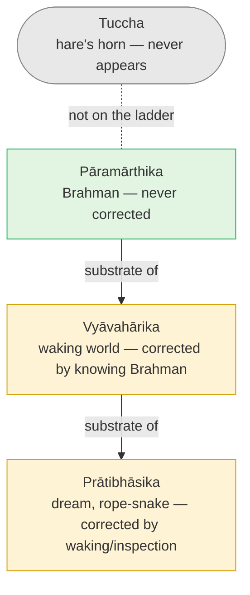

# Day 13 — Mithyā: Neither Real Nor Unreal

> **Today's one idea:** The world is *mithyā* — not real (*sat*), because it has no being of its own and is corrected by knowledge of its substrate; not unreal (*asat*), because it is genuinely experienced and works — exactly as a pot is "only clay" and still holds water.
> **Reading time:** ~35 min · **Prereqs:** [Day 12](./day-12-adhyasa.md)
> **Primary source for today:** Chāndogya Upaniṣad 6.1.1–6.1.6, with Shankara's commentary — Swami Gambhirananda (trans.), *Chāndogya Upaniṣad*, Advaita Ashrama, 1983.
> **Before you start:** Without looking — *state Shankara's definition of adhyāsa, and give one example of each direction of mutual superimposition. What does the rope get from the snake?*

---

## The hook (3 min)

Śvetaketu comes home at twenty-four after twelve years of study, "conceited, thinking himself learned, arrogant." His father Uddālaka asks him one question (Chāndogya 6.1.3): *"Did you ask for that teaching by which the unheard becomes heard, the unthought becomes thought, the unknown becomes known?"*

Śvetaketu has no idea what this could mean. How could knowing *one* thing make you know *everything*?

Uddālaka answers with a lump of clay (6.1.4):

> यथा सोम्यैकेन मृत्पिण्डेन सर्वं मृन्मयं विज्ञातं स्याद् — वाचारम्भणं विकारो नामधेयं, मृत्तिकेत्येव सत्यम् ।
> *"Just as, my dear, by one lump of clay all that is made of clay becomes known — the modification is only a name, arising from speech; the truth is: it is just clay."*

Yesterday left you with a worry. If the body and world are "superimposed" like a snake on a rope, are they simply *unreal*? Should you stop caring about them? Uddālaka's lump of clay is the tradition's answer — and it's neither "yes" nor "no."

---

## Building the intuition (12 min)

### Thought experiment 1 — the potter's shelf

A potter's shelf holds a jar, a cup, a plate, a lamp and a pot. How many things are on the shelf?

You'll want to say "five." Now pick up the cup and ask: *what is it, apart from the clay?* Take away the clay and — what's left? A shape with nothing to be a shape *of*. A name, "cup," with nothing to name. The cup has no stuff of its own. Every bit of it, examined, is clay.

So is the answer "one"? Not quite either — you can't drink from "clay in general." The cup *really* holds tea; the plate *really* doesn't. The forms are useful, distinct, functional.

The honest answer: **five, by name and form; one, by substance.** And the two answers are not equal partners. The clay doesn't need the cup to exist; the cup cannot exist for a moment without the clay. The dependence runs one way.

### Thought experiment 2 — the wave

Can you point to a wave without pointing to water? Can you bottle a wave and take it home? The wave is perfectly real *as a wave* — it can knock you over. But it has no being apart from the water, and when it subsides, nothing has been lost from the ocean. Water without waves is fine. Waves without water are impossible.

### Thought experiment 3 — the dream river

Recall last night's dream ([Day 8](./day-08-three-states-one-witness.md)). Suppose you dreamt of crossing a river and got soaked. Inside the dream, the water was fully real: it was cold, it wet you, you shivered. On waking, the river is *corrected* — you realise it was never there — but you don't then say "I experienced nothing." Something was experienced; it just didn't have the status it seemed to have.

### The pattern

| Example | Depends on (substrate) | Really functions? | Has being of its own? |
| --- | --- | --- | --- |
| Pot | Clay | Yes — holds water | No |
| Wave | Water | Yes — knocks you over | No |
| Ornament | Gold | Yes — worn, admired | No |
| Dream river | Dreamer's mind | Yes — within the dream | No |
| Snake on rope | Rope | Yes — produces real fear | No |

Every row has the same shape. It *is* experienced and it *does* work — so it is not nothing. It has no being apart from its substrate — so it is not independently real. There is a word for exactly this.

---

## The formal picture (12 min)

### Reading 6.1.4

***Vācārambhaṇaṃ vikāro nāmadheyam*** — "the modification is a name, a handle (*ārambhaṇa*) for speech." "Pot" is a way of *talking about* clay in a certain shape so you can ask for it, sell it, use it. ***Mṛttiketyeva satyam*** — "*clay* — just that — is the truth." The Upaniṣad then repeats the point with gold (6.1.5) and iron (6.1.6). Its target, revealed later in the chapter, is that the whole world stands to *sat* (existence, 6.2.1) as pots stand to clay. Know the substrate, and you've known all its modifications — which is how one teaching can make the unknown known.

### *Mithyā* defined

| | ***Sat*** (real) | ***Mithyā*** (dependently real) | ***Asat*** / ***tuccha*** (non-existent) |
| --- | --- | --- | --- |
| Is it experienced? | — (is the experiencing itself) | Yes | Never |
| Does it depend on another? | No | Yes, on its substrate | — |
| Can it be negated by knowledge? | No | Yes — corrected (*bādha*) | Nothing to negate |
| Example | Clay vis-à-vis pot; Brahman | Pot; wave; the world | A hare's horn, a barren woman's son |

*Mithyā* is defined by double exclusion: ***sad-asad-vilakṣaṇa***, "different from both the real and the non-existent." Not *sat*, because it is corrected when its substrate is known. Not *asat*, because a hare's horn never appears to anyone, while the world is appearing right now.

The key word is ***bādha***, sublation — correction by a later, truer knowledge. Sublation is *not* destruction. When you learn that the mirage is heat-shimmer, the shimmer doesn't vanish; you just stop walking toward it with a bucket. When you know the cup is clay, it still holds tea. Knowledge changes the *status* you assign to the appearance, not the appearance.

### Shankara's "is"

Shankara's commentary on Gītā 2.16 (*"the unreal has no being; the real never ceases to be"*) makes the same point with ordinary cognition. In "the pot *is*," "the cloth *is*," "the flower *is*," the *pot-*, *cloth-*, *flower-*cognitions come and go; the cognition "*is*" never fails. What changes and goes is dependent; what is present in every case is the substrate. This is Day 11's *sat* pointer applied to the world.

### Three orders of reality

Later Advaita systematises the picture into three orders (Shankara mainly uses the two-way contrast *paramārtha* / *vyavahāra*; the three-level vocabulary is a later refinement):

| Order | Name | Corrected by | Example |
| --- | --- | --- | --- |
| Absolute | ***Pāramārthika*** | Nothing — never sublated | Brahman, the seer |
| Empirical | ***Vyāvahārika*** | Knowledge of Brahman | The waking world: bodies, cups, physics, your bank balance |
| Apparent | ***Prātibhāsika*** | Waking up / simple inspection | Dream rivers; rope-snakes; mirages |
| (Non-existent) | ***Tuccha*** | — never appears | A hare's horn |

The rule: **each order is real on its own level and corrected only by the order above.** Dream water quenches dream thirst. Waking water quenches waking thirst. Neither is corrected by the one beside it; each is corrected only by what's more fundamental. Vidyāraṇya puts it neatly: the same *māyā* looks like nothing (*tuccha*) from the standpoint of scripture, inexplicable (*anirvacanīya*) to reason, and solidly real (*vāstava*) to ordinary experience (Pañcadaśī 6.130).

---

## Where it breaks / what it is not (4 min)

### Trap 1 — nihilism: "So nothing exists."

The opposite. *Mithyā* is defined *by dependence on something real*. A wave implies water; a snake-appearance implies a rope. The Buddhist-sounding slogan "it's all empty, there's nothing at all" collapses *mithyā* into *tuccha* — and then has nothing for the appearance to be the appearance *of*. Gītā 2.16: the real never ceases to be. Advaita negates the world's *independence*, never its *ground*. (For a reader with a Buddhist background: Madhyamaka's "emptiness of inherent existence" overlaps strongly with "not *sat*"; the divergence is whether a non-dependent ground is affirmed. Advaita affirms it.)

### Trap 2 — subjective idealism: "So it's all in my head."

No. Shankara explicitly rejects the view that external objects are just ideas in an individual mind (BSBh 2.2.28, *nābhāva upalabdheḥ* — "not non-existent, because they are perceived"), and he refuses to equate waking with dream (2.2.29). The reason is today's ladder: your *mind* is itself part of the *vyāvahārika* world — it is *seen* ([Day 6](./day-06-seer-and-seen.md)), dependent, changing. A *mithyā* thing can't be the substrate of other *mithyā* things at the same level. The world is not in your head; your head is in the world; and both appear in the seer, which is nobody's private property. (Some later Advaitins taught a "perception is creation" view, *dṛṣṭi-sṛṣṭi-vāda*, as a contemplative entry point. It is best read as a pointer toward Day 18's highest standpoint — not as a licence to treat other people as your dream.)

### Trap 3 — "*Mithyā* means it doesn't matter."

Within the *vyāvahārika* order, everything binds: causes have effects, cruelty hurts, promises count. A dream-fire burns the dream-hand. Knowing the cup is clay doesn't license smashing it on someone's head.

### Trap 4 — "Then I, too, am *mithyā*."

The *ego* — the "I"-with-predicates of yesterday — is *mithyā*. The seer is not: it is the substrate, the clay. Getting this backwards (calling awareness unreal and the ego real) is adhyāsa all over again.

---

## Try it yourself (8 min)

### 1. Retrieval first

Close the page. From memory: *define mithyā by double exclusion, give the four-row table (three orders plus tuccha) with one example each, and say what sublation does and doesn't do.*

Hint

Clay, cup, dream river, hare's horn. And the mirage you keep seeing after you know.

Model answer

<em>Mithyā</em> = neither <em>sat</em> (it has no being of its own and is corrected when its substrate is known) nor <em>asat</em> (it is genuinely experienced and functions). Orders: <em>pāramārthika</em> — Brahman, never corrected; <em>vyāvahārika</em> — the waking world, corrected by knowledge of Brahman; <em>prātibhāsika</em> — dream, rope-snake, corrected by waking or inspection; <em>tuccha</em> — hare's horn, never appears at all. Sublation (<em>bādha</em>) changes the status assigned to an appearance; it does not make the appearance disappear (the mirage still shimmers; the cup still holds tea).

### 2. Direct application — the clay test, then the deeper clay (contemplative, 6 minutes)

Pick up an object near you — a mug, a pen, your phone.

1. **Clay test.** Say what it is "apart from" its material. Note that "mug" names a shape-and-use of ceramic; you can't find mug-stuff.
2. **Go one level down.** The ceramic itself — try the same test on it. It names a shape-and-arrangement of something else. Notice the regress of names.
3. **Now shift to the knowing.** Look at the mug. Where is its colour, its edge, its weight, *found*? Not in the abstract — right now, in experience. Is there any of the mug's appearance that is found *outside* being seen ([Day 6](./day-06-seer-and-seen.md))?
4. Ask: in this experience, what plays the role of the clay — what is the mug-appearance never without?

Write three lines.

Hint

Don't argue in step 3 — look. You are not asked whether the mug exists when you leave the room; only what its appearance is found in, now.

What to look for

Steps 1–2 show that names-and-forms keep dissolving into further names-and-forms — every level is a "handle for speech." Step 3 is the live move: every feature of the mug you can point to is found <em>as seen</em>; you never meet a mug-appearance outside awareness. Step 4: awareness (and its "is-ness", Day 11's <em>sat</em>) is what the appearance is never without — the deeper clay. Caution: this does <em>not</em> mean "the mug is in my mind" (Trap 2). Your mind is just another appearance in the same awareness, on the same footing as the mug. If you caught yourself thinking "it's all my thoughts," go back to step 3 and notice that the thoughts, too, are seen.

### 3. Stretch — the nihilist and the idealist at one table

Two friends challenge you at dinner. One says: *"Mithyā is just a polite word for illusion — so nothing's real."* The other says: *"If the world depends on consciousness, then it depends on* my *consciousness — it's my projection."* Answer both in under 150 words, using one image for each.

Hint

For the first: what does a wave require? For the second: is the mind on the seer side or the seen side?

Worked answer

To the nihilist: a wave has no being apart from water, but that's a fact <em>about water</em>, not proof that nothing exists. <em>Mithyā</em> means "dependent on a real substrate" — it is the opposite of nihilism, because it requires the substrate. Nothing-at-all (<em>tuccha</em>), like a hare's horn, never even appears; the world appears constantly. To the idealist: your mind is not the substrate — it is one of the waves. It's seen (it changes, you observe its moods), so it sits on the same side as tables and other people. The world doesn't depend on <em>your</em> mind; your mind and the world both depend on awareness, which is not personal property. Shankara rejects your view explicitly (BSBh 2.2.28: objects aren't non-existent, because they are perceived as external).

### 4. Spaced callback — Day 8

Without looking: what were [Day 8](./day-08-three-states-one-witness.md)'s three states and the one thing present in all of them? Then use the three states to *demonstrate* the difference between *prātibhāsika* and *vyāvahārika* — and say what, by analogy, plays the role of "waking up" for the *vyāvahārika* world.

Hint

What corrects the dream? Does the dream ever correct the waking world? What corrects the waking world?

Model answer

Waking, dream, deep sleep come and go; the awareness of them is present throughout (the Māṇḍūkya's three states; Indra's lessons from Prajāpati in Chāndogya 8.7–12). Demonstration: dream objects are fully real while dreaming and are corrected on waking — that's <em>prātibhāsika</em>, corrected by the next order up. Waking objects are not corrected by dreaming or by inspection; they hold up across the whole waking order — that's <em>vyāvahārika</em>. Analogy: the waking world is corrected only by "waking up" to the substrate of all three states — knowledge of the awareness that Day 8 found present in all of them. Note what doesn't change: just as the dreamer remains after the dream is corrected, the witness remains through every correction. The witness is the only thing on the list never corrected — <em>pāramārthika</em>.

**Transfer — apply it:**

> Pick an abstraction your work treats as solid — "the market," "the org chart," "the codebase," "the brand." Write one sentence: *the input* (the abstraction), *what today's idea does to it* (identifies it as name-and-form, fully functional at its own level, but dependent on a substrate — people, transactions, files — and asks what that substrate is), and *the output* (one decision that changes when you stop treating the abstraction as having being of its own, without treating it as nothing). If nothing comes to mind in 60 seconds, re-read the hook and try again.

---

## Connect it back

Yesterday's rope–snake explained the *mechanism* of bondage; today's clay pot gives the *status* of everything superimposed. The body, the mind, the world: experienced and functional, so not nothing; dependent and correctable, so not independently real. *Mithyā* closes both doors that seekers fall through — "nothing exists" and "it's all in my head" — and it is the second face of this course's bottleneck skill. Tomorrow you'll rest and rebuild Days 1–13 from memory; then Day 15 asks the question *mithyā* leaves open: if the world is an appearance on Brahman, *why* is there an orderly appearance at all?

**Sharp question:** *If knowing the cup is clay doesn't make the cup disappear, what does knowing the world is mithyā actually change?*

---

## Suggested readings for today

**Required if you have 15 extra minutes:** Chāndogya Upaniṣad **6.1.1–6.1.6** with Shankara's commentary (Gambhirananda, 1983). Read Uddālaka's three examples (clay, gold, iron) and Shankara's gloss on *vācārambhaṇa* — the modification as a mere handle of speech.

**If you want the deep version:**
- Shankara, *Brahma-Sūtra-Bhāṣya* **2.1.14** (the *ārambhaṇa* section; Gambhirananda trans.) — his full argument, built on 6.1.4, that effect is non-different from cause.
- Shankara, *Brahma-Sūtra-Bhāṣya* **2.2.28–2.2.29** — the refutation of "objects are only ideas"; read it to close Trap 2 in Shankara's own words.
- Swami Swahananda (trans.), *Pañcadaśī*, **6.130** and the verses on either side of it — Vidyāraṇya's three views of the same appearance (nothing / inexplicable / real), a compact map of today's table.

---

## Navigation

← **Previous:** [Day 12 — Adhyāsa](./day-12-adhyasa.md)
→ **Next:** [Day 14 — Rest & Synthesize I](./day-14-rest-and-synthesize-1.md)
