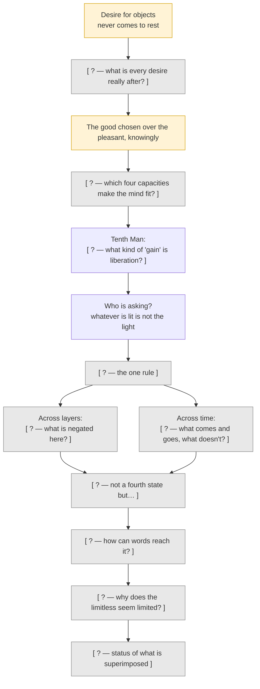
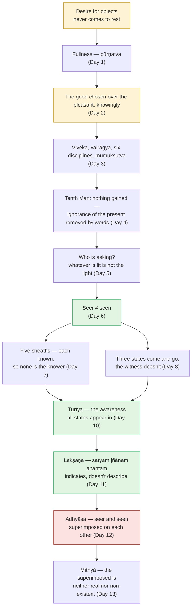

# Day 14 — Rest & Synthesize I

> **Today:** No new concepts. Only consolidation of the foundations arc — from the itch of desire to the status of the world.
> **Format:** Re-state → Re-derive → Full run → Quiz
> **Reading time:** ~35 min (longer if gaps surface — that's the point)
> **Prereqs:** [Days 1–13](../../../README.md)

Thirteen days have built one continuous argument — from "why does wanting never rest?" to "what is the world's status?" — and today you find out whether you own it or have only read it.

Close all previous pages. Work from memory first.

---

## Step 1 — Re-state the 12 foundation ideas (5 min)

> **Why this table is not in day order:** Recalling Day 6 first, then Day 7 lets you use sequence as a cue — which is how you memorised it, not how you'll use it. When a real moment of anger or fear arrives, it won't come labelled "Day 12." The scrambled order below forces you to retrieve each concept on its own merits. This discomfort is the point.

Write one sentence for each — what it *claims*, not what it's called. (Day 9 was a drill, so it has no row; its skill appears in Step 3.)

| Concept (Day) | Your sentence |
| --- | --- |
| The five sheaths (Day 7) | |
| *Pūrṇatva* — fullness (Day 1) | |
| *Adhyāsa* — superimposition (Day 12) | |
| The Tenth Man (Day 4) | |
| *Turīya* (Day 10) | |
| *Preyas* vs *śreyas* (Day 2) | |
| *Mithyā* (Day 13) | |
| Who is asking? — the light (Day 5) | |
| *Lakṣaṇa* — indication (Day 11) | |
| The four qualifications (Day 3) | |
| Three states, one witness (Day 8) | |
| Seer and seen (Day 6) | |

Compare to these

1. **Five sheaths (Day 7):** Body, vitality, mind, intellect and bliss (*annamaya … ānandamaya*, Taittirīya 2.2–2.5) are all known, so none of them is the knower.
2. **Pūrṇatva (Day 1):** Every desire is a disguised desire for fullness, which no finite object can permanently supply — the joy of a satisfied desire is the brief stilling of the wanting.
3. **Adhyāsa (Day 12):** Bondage is the mutual superimposition of seer and seen — the body's features put on the Self ("I am tired") and the Self's sentience put on the mind ("the mind knows") — not a real union, so only knowledge removes it.
4. **Tenth Man (Day 4):** Liberation gains nothing new; it ends ignorance of what was already present, and only a means of knowledge (*pramāṇa*, here the teaching's words) can do that.
5. **Turīya (Day 10):** Not a fourth state alongside waking, dream and sleep, but the awareness all three appear in — the screen, not another film.
6. **Preyas vs śreyas (Day 2):** The pleasant and the good diverge; maturity is choosing the good knowingly, because whatever action produces, ends.
7. **Mithyā (Day 13):** The world is neither real (it has no being of its own and is corrected by knowing its substrate) nor non-existent (it is experienced and functions) — like a pot, which is only clay and still holds water.
8. **Who is asking (Day 5):** The one thing never examined is the examiner; whatever is lit is not the light (Bṛhadāraṇyaka 4.3: "the Self is his light").
9. **Lakṣaṇa (Day 11):** Brahman can't be described, only indicated — *satyaṃ jñānam anantam* points by its nature, "that from which beings are born" points incidentally — like a branch pointing to the moon.
10. **Four qualifications (Day 3):** Discrimination, dispassion, the six disciplines and longing tune the mind as an instrument of knowing; they don't produce the goal.
11. **Three states (Day 8):** Waking, dream and deep sleep come and go; the awareness of them does not.
12. **Seer and seen (Day 6):** Whatever is an object of awareness cannot be that awareness — the seen is many and changing, the seer one, constant, never an object.

If any sentence of yours named the concept but didn't state a *claim* ("Day 13 is about mithyā"), mark it — that's a gap, not a pass.

---

## Step 2 — Re-derive the end-to-end flow (10 min)

Fill in every bracket on paper before opening the solution.

Filled version

**Mechanism questions** — answer each in two or three sentences.

1. Why must Day 4 come *before* Day 6? What would go wrong if you learned "seer is not seen" without first knowing that liberation is a matter of knowledge?
2. Days 7 and 8 both apply Day 6's rule. What different *dimension* does each apply it across, and why are both needed?
3. Day 12 says only knowledge removes bondage. Which earlier day already proved that no *action* can, and by what argument?
4. Why would Day 13 be dangerous *without* Day 12 — what would a student likely conclude about the world if told it was *mithyā* before understanding superimposition?

Answers

1. Without Day 4, "seer is not seen" becomes a project — something to *achieve* by producing a special experience of pure awareness. Day 4 frames the whole enquiry as removing ignorance about what is already present, so Day 6's rule is used as a *means of knowing* (look and recognise), not a technique for producing a state.
2. Day 7 applies it across *layers* at one moment (body, vitality, mind, intellect, bliss — each known). Day 8 applies it across *time* (waking, dream, sleep — each passes). Both are needed because identification hides in both places: in the deepest layer present now ("surely I am at least the intellect"), and in continuity over time ("surely I am the one who goes through the states").
3. Day 4 (via BSBh 1.1.4): action yields only production, reaching, modification or purification. The Self is none of these kinds of result, so liberation can't be one. Day 12 adds *why* that fits: the problem is an error, and errors are corrected by knowledge, not by acts — no one kills the rope-snake.
4. Without superimposition, "the world is *mithyā*" sounds like "the world is fake" — leading to nihilism or contempt for ordinary life. Day 12 shows the appearance is *on* a real substrate, as the snake is on a real rope — which is exactly what makes the world neither real nor nothing.

---

## Step 3 — Run it (10 min)

### Written reconstruction (5 min)

A thoughtful colleague who has never studied Vedānta asks: *"In plain terms, what does Advaita claim — and why should I believe any of it?"* Write **200 words**, no notes, covering the arc from desire to *mithyā*. Then open the comparison.

Compare to this

Everything you want, you want because you think it'll make you feel complete — but each success only stills the wanting for a moment, then a new lack appears. Advaita says that's because the lack is a mistake about who you are, not a shortage of things. So the fix isn't another achievement; it's knowledge, like the man who counted nine friends and forgot to count himself — nothing was missing except his own recognition.  
How do you check? Notice that anything you can observe — your body, energy, thoughts, moods, even the sense of "me" — is observed, so it can't be the observer. Waking, dreaming and dreamless sleep come and go; the awareness of them doesn't. That awareness can't be described, only pointed to: existence, consciousness, without limit.  
Why does it feel limited? Because we constantly mix up the observer and the observed — "I'm tired" welds the "I" onto the body's fatigue. And the world? Not an illusion, not ultimately independent either — like pots made of clay: fully usable, but with no being apart from what they're made of.  
<strong>Check:</strong> did yours include (a) knowledge not action, (b) the seer/seen test, (c) superimposition as the mechanism, and (d) <em>mithyā</em> without sliding into "it's all illusion"? Those four are the spine.

### Live check-list (5 min)

Do each, with eyes open, in order. Tick only what you could *actually do*, not what you could describe.

1. **Find the itch.** Name one thing you're wanting right now and trace it, in three "why"s, to a condition of yourself (Day 1).
2. **Run the chain.** Pick a sound in the room. Sound → hearing → the mind's registering → what knows the registering. Stop at the last and do not make it an object (Days 5–6).
3. **Strip one layer.** Notice a bodily sensation, then a mood. Say silently: "known — so not the knower" (Day 7).
4. **Catch a weld.** Find one "I am ___" thought from the last hour and split it into "I" (seer) and "___" (seen) (Day 12).
5. **Clay test.** Look at an object; separate name-and-form from substrate, without concluding "it's nothing" or "it's in my head" (Day 13).
6. **Rest as the screen.** For thirty seconds, notice that whatever appears — thought, sound, sensation — appears *in* awareness, which itself doesn't appear and disappear (Days 8, 10).

If any step fails or you go blank, that's your diagnostic: return to that day's "Try it yourself" before Day 15. Step 2 or step 4 failing means re-doing [Drill I](./day-09-drill-seer-from-seen.md).

---

## Step 4 — Quiz (5 min)

> **Why the questions jump around:** Answering about Day 13 and then Day 5 breaks any rhythm you built while reading. In real enquiry, the question that arises — "is this anxiety me?" — doesn't announce which day it belongs to. Retrieval that survives a jump is retrieval you can use.

**Q1.** A friend says: "If the world is *mithyā*, then my career and my family don't really matter." Diagnose the error in one sentence using the three orders of reality.

**Q2.** In Bṛhadāraṇyaka 4.3, after sun, moon, fire and speech have gone out, what is left as a person's light — and what general principle does the passage establish?

**Q3.** "My brain is aware of the screen." Which direction of mutual superimposition is this, and what is the corrected version?

**Q4.** Someone says: "If I'm already free, the four qualifications are pointless." Answer in two sentences.

**Q5. Cross-concept.** Show how Day 8's evidence from deep sleep and Day 1's analysis of fullness *jointly* support Day 11's claim that *ānanda* is the limitlessness (*ananta*) of the Self — not a pleasant experience.

Answers

**Q1.** *Mithyā* rules out independent reality, not empirical reality: careers and families are *vyāvahārika* — fully binding at their own level, as dream water quenches dream thirst — and are corrected only by knowledge of Brahman, which changes their status, not their claims on you.

**Q2.** The Self — "the Self is his light." Principle: whatever is lit (sun, objects, even thoughts) is not the light; the illuminator is never one of the illuminated — Day 5's intuition, which Day 6 formalised.

**Q3.** The reverse direction: the Self's sentience superimposed on the body–mind (the iron seeming to burn). Corrected: "The brain-state and the screen are both *known*; the knowing is not a property of either."

**Q4.** Freedom is a fact about what you are; knowing it happens in a mind, and a misaimed, agitated, uninterested mind fails to know even what is present. The qualifications tune the instrument — the telescope, not the star.

**Q5.** Day 8: in deep sleep there are no objects, yet on waking everyone reports "I slept happily" — so happiness was present with no object delivering it. Day 1: the joy of a satisfied desire coincided with the *absence of the gap* — no second thing needed. Put together: happiness shows up exactly where limitation and division drop away, with or without objects. That is what Taittirīya 2.1's *anantam* and Bhṛgu's *ānanda* (3.6) point at: not a feeling the Self has, but its limitlessness, recognised as fullness. (Caveat from Day 8: deep sleep isn't liberation, because the ignorance remains in seed form and returns on waking.)

---

## What's ahead

| Day | Topic | What you'll decide or build |
| --- | --- | --- |
| 15 | [Māyā and Īśvara](./day-15-maya-and-ishvara.md) | Answer "where does the world come from?" without creating a second reality — appearance (*vivarta*) vs. real change (*pariṇāma*) |
| 16 | [Tat Tvam Asi](./day-16-tat-tvam-asi.md) | Run the great equation yourself, dropping incompatible features from "that" and "you" until the essences match |
| 17 | [Neti Neti](./day-17-neti-neti.md) | Use negation as a method: remove what you are not until only the un-negatable remains |

The foundations are laid: you know what the seer is, how it's pointed to, why it's missed, and what status everything else has — the next arc turns these into methods you can run.

---

## Connect it back

Day 13 closed the diagnosis: the world is *mithyā*, the seer is its substrate, and the error is superimposition. Today you checked whether that whole chain — from Nārada's sorrow to Uddālaka's clay — holds in your head without the pages. Wherever it broke, you now know where to return. Tomorrow opens the next arc with the question every student eventually asks: if all this is appearance on Brahman, why is the appearance so ordered, and who — if anyone — is running it?

---

← [Day 13 — Mithyā](./day-13-mithya.md) &nbsp;|&nbsp; [Day 15 — Māyā and Īśvara →](./day-15-maya-and-ishvara.md)
