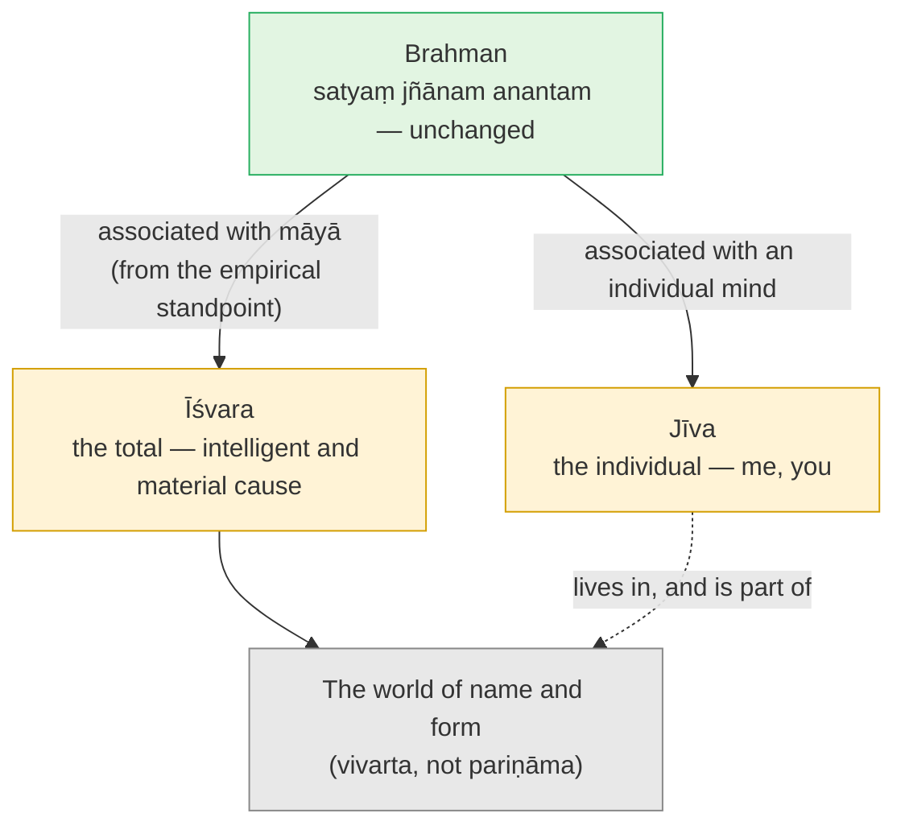

# Day 15 — Māyā and Īśvara: Where Does the World Come From?

> **Today's one idea:** From the empirical standpoint the world has an intelligent cause — Īśvara, Brahman associated with *māyā* — but the world is an *appearance* of Brahman (*vivarta*), not a real transformation of it (*pariṇāma*); and since *māyā* is itself *mithyā*, non-duality is never compromised.
> **Reading time:** ~35 min · **Prereqs:** [Day 13](./day-13-mithya.md)
> **Primary source for today:** Shankara, *Brahma-Sūtra-Bhāṣya* 1.1.2 (*janmādy asya yataḥ*) — Swami Gambhirananda (trans.), *Brahma-Sūtra-Bhāṣya of Śrī Śaṅkarācārya*, Advaita Ashrama, 1965.
> **Before you start:** Without looking — *why is a pot neither sat nor asat? Name the three orders of reality and say what corrects each.*

---

## The hook (3 min)

Last night you dreamt you were in a city. It had streets that led somewhere, traffic that obeyed lights, a café where the coffee cost what coffee costs, people with faces you had never seen, who answered your questions in sentences you didn't predict. Gravity worked. Doors opened when pushed.

Who designed all that?

Not the dream-you — the dream-you was as surprised by the café as by everything else. Yet there was no one else around. The architect, the bricks, the citizens and the confused tourist were all *you* — the dreamer — and you didn't know it until you woke.

The last three days left a real question. If the world is *mithyā* — an appearance on Brahman, like a snake on a rope — then why is it so *orderly*? A rope-snake is random. The world has physics, ecosystems, mathematics that works. Something in the picture seems to be doing an enormous amount of intelligent work. Advaita doesn't dodge this. It answers it — and the dream is half the answer.

---

## Building the intuition (12 min)

### Two kinds of "coming from"

Compare two everyday changes:

- **Milk → curd.** Leave milk with a starter and it becomes curd. The milk is *really* changed — you can't get it back. Making curd uses up the milk.
- **Rope → snake.** At dusk the rope "becomes" a snake. Nothing in the rope changes. When the torch comes on, there it is, exactly as before. The "snake" cost the rope nothing.

| | Milk → curd | Rope → snake |
| --- | --- | --- |
| Is the cause changed? | Yes, really | No — only appears otherwise |
| Can you get the cause back as it was? | No | It never left |
| Is the cause diminished? | Yes, used up | Not at all |
| Name in the tradition | ***Pariṇāma*** — real transformation | ***Vivarta*** — apparent transformation |

If the world came from Brahman like curd from milk, Brahman would be changed, used up, divided — a finite, changing thing (and Day 11's *satyam* would be false). If the world comes from Brahman like a snake from a rope, Brahman stays exactly what it is. Advaita says: *vivarta*.

### But a rope doesn't design snakes

Here is where the rope analogy runs out. A rope-snake is a private, random error. The world is shared and lawful. So Advaita adds a second analogy for the *order*: the dreamer.

In the dream, your mind is two kinds of cause at once:

- **The material** — every dream-street and dream-person is made of nothing but your mind.
- **The intelligence** — the coherence, the laws, the fitting-together all come from your mind's knowledge and memory.

A potter is only the intelligent cause of a pot; the clay is a separate material cause. The dreamer is both. The tradition says the same about the world's cause: one cause, both material and intelligent. (Muṇḍaka 1.1.7 gives a third picture: the spider that spins its web out of itself and draws it back in.)

### Two standpoints, one reality

Now put the analogies together. From *inside* the dream, it is true and important that the dream-world is coherent and has a single source of its order. From the *waking* standpoint, there was no city at all — only the dreamer. Both statements are correct *at their own level* ([Day 13](./day-13-mithya.md)'s orders of reality). Advaita's account of creation is just this, done carefully.

---

## The formal picture (12 min)

### *Janmādy asya yataḥ* — BSBh 1.1.2

The second sūtra of the Brahma Sūtras is four words: ***janmādy asya yataḥ***, "[Brahman is that] from which the birth etc. of this [world proceeds]." "Etc." covers sustenance and dissolution. You've met it before — it compresses Varuṇa's answer to Bhṛgu (Taittirīya 3.1), the *incidental* indicator from [Day 11](./day-11-sat-cit-ananda.md): "that from which beings are born, by which they live, into which they return."

Shankara's commentary draws out what the sūtra implies: a world so vast and ordered, of names and forms, with agents and enjoyers, each with its place, time and causes — "which cannot even be conceived by the mind" — must come from a cause that is omniscient and all-powerful. That is the empirical answer: the world has an *intelligent* source.

And it is *taṭastha* — true of Brahman *relative to a world*, like the crow on the roof. Remove the world from the picture and "cause of the world" no longer applies; Brahman's own nature (*svarūpa*) is untouched.

### *Māyā* and *Īśvara*

Call the power by which the one appears as the many ***māyā***. Brahman, considered as associated with that power — as the source and ruler of the whole appearance — is called ***Īśvara***, the Lord.

- The Gītā has Kṛṣṇa say: *"this divine māyā of mine, made of the guṇas, is hard to cross"* (7.14), and *"with me as overseer, nature (prakṛti) brings forth the moving and the unmoving"* (9.10).
- The Śvetāśvatara Upaniṣad (4.10): *"know māyā to be prakṛti, and the wielder of māyā to be the great Lord."*
- And BSBh 1.4.23 argues that Brahman is both the material and the intelligent cause of the world (*abhinna-nimitta-upādāna-kāraṇa*) — the dreamer, not the potter.

### Total and individual

The same consciousness, considered with different limiting conditions (*upādhi*), receives different names:

| | Īśvara | Jīva |
| --- | --- | --- |
| Associated with | *Māyā* — the total causal power | One individual mind–body |
| Scope | The whole (*samaṣṭi*) | One part (*vyaṣṭi*) |
| Relation to the appearance | Wields it, isn't deceived by it | Lives inside it, is deceived by it (*avidyā*, [Day 12](./day-12-adhyasa.md)) |
| Dream analogy | The dreamer's mind as a whole | The dream-character you took yourself to be |
| Pure consciousness in it | Brahman | Brahman |

That last row is the bridge to tomorrow. Strip away the limiting condition on both sides and what remains is identical — which is all *tat tvam asi* will say.

### Why non-duality survives

Doesn't this introduce two things — Brahman *and* māyā? No, for exactly [Day 13](./day-13-mithya.md)'s reason. *Māyā* is *mithyā*: experienced, functional, dependent, correctable — not a second *sat*. Adding a snake to a rope doesn't make two things on the path. Adding a dream-city to a dreamer doesn't make the dreamer two. So "Brahman with māyā" is still one reality with an appearance, not two realities in partnership.

### Why create at all?

If Brahman is full, it lacks nothing — so why would it create? BSBh 2.1.33 (*lokavat tu līlā-kaivalyam*) answers: as in the world, it is mere play — like the effortless breathing of a man at ease, which serves no purpose. Not a purpose, because a purpose would imply a lack.

### A note on terminology

Paul Hacker (1950) argued that Shankara's own vocabulary is less systematic than later Advaita's: he relies on *avidyā* and "unmanifest name-and-form" (*nāma-rūpa*) far more than on *māyā* as a technical term, and uses *Īśvara* (*parameśvara*) and *Brahman* largely interchangeably, without the sharp distinction later writers draw. Likewise, the explicit *vivarta* vs *pariṇāma* contrast is drawn sharply by later Advaitins (the Vedāntasāra quotes a classic verse defining the two — §138 in Nikhilananda's numbering); Shankara sometimes speaks in transformation language provisionally, e.g. in the *ārambhaṇa* discussion (BSBh 2.1.14). The convergence: all of them hold that the cause is not really changed, and that the account of creation is offered from the empirical standpoint as a stepping stone — to be taken up and then let go (a method the tradition calls *adhyāropa–apavāda*, "superimpose, then retract").

---

## Where it breaks / what it is not (4 min)

**"Īśvara is a person-god sitting somewhere outside the world."** Īśvara is not one being among others; Īśvara is the *total* — the intelligence of the whole order, and its material. Every law of nature you depend on is, in this language, Īśvara.

**"Since it's all māyā, Īśvara is a fiction to be discarded on day one."** Īśvara is exactly as real as the world — and far more real than your ego, which is a *part* of that world. At the *vyāvahārika* level, Īśvara is the most real thing there is. This is why devotion has a place inside Advaita (Day 22).

**"Māyā means Brahman is deceiving us."** The magician isn't deceived by his own trick; the audience is. Īśvara wields *māyā* without confusion; the jīva, identified with a part, mistakes the appearance. The "deception" is on the side of the individual's superimposition (Day 12), not a cosmic con.

**"Vivarta means the world is a hallucination."** Back to Day 13: *mithyā* is not *tuccha*. The world is a shared, lawful appearance — *vyāvahārika*, not *prātibhāsika*. Your private rope-snake is *prātibhāsika*; the rope is *vyāvahārika*.

**"The world is a real transformation of a part of Brahman."** That's *pariṇāma* — which would make Brahman divisible and changing. Other Vedānta schools hold versions of it; Advaita doesn't. Brahman has no parts to transform.

---

## Try it yourself (8 min)

### 1. Retrieval first

Close the page. From memory: *distinguish vivarta from pariṇāma with one example each; define Īśvara and jīva in terms of Brahman; and give the one-sentence reason non-duality survives.*

Hint

Milk and rope. Total and individual. What status did Day 13 give the snake?

Model answer

<em>Pariṇāma</em>: real transformation — milk becomes curd and is used up. <em>Vivarta</em>: apparent transformation — rope appears as snake and is untouched. The world is Brahman's <em>vivarta</em>. Īśvara = Brahman associated with <em>māyā</em>, the total, the intelligent and material cause of the whole appearance, not deceived by it. Jīva = Brahman associated with one individual mind–body, deceived by its own superimposition. Non-duality survives because <em>māyā</em> is <em>mithyā</em> — dependent and correctable, not a second reality; a snake on a rope doesn't make two things.

### 2. Direct application — what you don't do (contemplative, 6 minutes)

Sit quietly for a few minutes and list, from direct observation, **five things happening in your body–mind right now that "you" are not doing**: e.g. digestion, the heartbeat, the next thought arriving, the meaning of these words appearing, the colour of the wall being red.

Then, for each, ask two questions:
1. *Who or what is doing it?* (Answer in today's language: the total order — Īśvara.)
2. *Is it seen?* — that is, is this process itself something known?

Finally ask: *is the knowing of these five things one more process in the order, or what the whole order appears to?*

Hint

You didn't decide your next thought. You didn't design your liver. And yet you know both. Keep Day 6's rule in hand for the last question.

What to look for

The first question usually produces a quiet shock: almost nothing you call "my" life is actually operated by the "me" that claims it — the doing belongs to the total order. That is the practical meaning of Īśvara, and it loosens the doer-sense. The second question returns you to the bottleneck skill: every one of those processes — even "Īśvara's order" — is <em>seen</em>. Last question: the knowing is not a sixth process alongside digestion and thoughts; it is what all five appear to. Careful: don't conclude "so I am Īśvara the controller." The point is the reverse — the controlling belongs to the total, and the "I" that knows it is the awareness both total and individual appear in. That move is tomorrow's.

### 3. Stretch — is māyā just adhyāsa writ large?

Using [Day 12](./day-12-adhyasa.md), compare *māyā* and the individual's *avidyā*/*adhyāsa*. What do they share? What is the crucial difference? (Use the magician and the dreamer.)

Hint

Both produce appearances on a substrate. Who is fooled in each case?

Worked answer

Shared: both are appearances on a real substrate, both are <em>mithyā</em>, both leave the substrate untouched, both are corrected by knowledge of the substrate. Difference: <em>māyā</em> as Īśvara's power produces the shared, lawful world and does not deceive its wielder — the magician sees through his own trick, the dreamer's mind as a whole contains the dream. Individual <em>avidyā</em>/<em>adhyāsa</em> is the jīva's mistaking itself for one part of that appearance — the dream-character believing he is only the dream-character. So liberation does not require the world to vanish (Īśvara's <em>māyā</em> keeps running, as the cup kept holding tea on Day 13); it requires the jīva's <em>adhyāsa</em> to end. Note: later Advaitins differ on how far to separate <em>māyā</em> and <em>avidyā</em> — some treat them as one power seen from two sides. Both readings agree on the remedy.

### 4. Spaced callback — Days 10 and 1

Two parts, without looking.

(a) Māṇḍūkya 6 describes the deep-sleep self, *prājña*, in remarkable terms: *"this is the lord of all, the knower of all, the inner controller, the source of all — the origin and dissolution of beings."* Using [Day 10](./day-10-turiya.md)'s screen-and-films picture, explain why the Upaniṣad then goes on to mantra 7 rather than stopping here — i.e. why Īśvara-as-cause is still not the final word.

(b) The famous invocation of the Bṛhadāraṇyaka (5.1.1) runs: *"That is full; this is full; from the full, the full comes forth; taking the full from the full, the full alone remains."* Using [Day 1](../../01-shubheccha/days/day-01-the-itch-objects-cant-scratch.md)'s *pūrṇatva* and today's distinction, say which kind of "coming forth" this must be — and why.

Hint

(a) Is "cause of all" a <em>svarūpa</em> or a <em>taṭastha</em> indicator? (b) Does milk remain full after the curd is taken?

Model answer

(a) Mantra 6 indicates Brahman <em>as cause</em> — Īśvara, linked to the causal, seed state from which the world unfolds. That is a <em>taṭastha</em> description: true relative to a world. Day 10's point was that <em>turīya</em> isn't another state or film but the screen they all appear on — and mantra 7 points to that screen: not inward-knowing, not outward-knowing, the peaceful, the non-dual. So the Upaniṣad moves from Brahman-as-Lord-of-the-films to Brahman-as-screen. Īśvara is real at the empirical level and the right next step up from the jīva; <em>turīya</em> is what both Īśvara and jīva are, with the limiting conditions dropped.  
(b) It must be <em>vivarta</em>. In <em>pariṇāma</em>, taking curd from milk leaves less milk. Here, the full is "taken" from the full and the full remains — the cause is not diminished at all, which is only possible if the world is an appearance on Brahman, not a portion carved from it. And this links back to Day 1: the fullness every desire was hunting for is not something that can be diminished by the world's coming and going — which is why no object could add to it, and why losing objects never subtracts from it.

**Transfer — apply it:**

> Think of a system at work that you are tempted to experience as either "my doing" or "nobody's doing" — a product's success, a team's culture, a project's failure. Write one sentence: *the input* (the outcome), *what today's idea does to it* (sees it as produced by a total order of causes far larger than you, in which your action is one strand — the "Īśvara view" of the outcome), and *the output* (how your sense of credit, blame or anxiety shifts when you hold the outcome that way, while still doing your part fully). If nothing comes to mind in 60 seconds, re-read the hook and try again.

---

## Connect it back

[Day 13](./day-13-mithya.md) said the world is *mithyā* — neither real nor nothing — and yesterday you rebuilt the whole foundation from memory. Today answered the question *mithyā* leaves open: the world's order comes from Brahman associated with *māyā* — Īśvara, the dreamer of the whole — while Brahman itself is untouched, because the world is *vivarta*, not *pariṇāma*, and *māyā* is itself *mithyā*. You now have both terms of the great equation defined: Īśvara-with-the-total on one side, the jīva-with-one-mind on the other. Tomorrow you set them side by side — *tat tvam asi* — and see what remains when the limiting conditions are dropped.

**Sharp question:** *If Īśvara and the jīva differ only in their limiting conditions, what exactly is left on each side when those are set aside?*

---

## Suggested readings for today

**Required if you have 15 extra minutes:** Shankara, *Brahma-Sūtra-Bhāṣya* on **1.1.2** (Gambhirananda trans.) — read his argument from the world's order to an omniscient cause, and notice how he immediately says Brahman is ultimately known through scripture, not by inference alone.

**If you want the deep version:**
- Swami Swahananda (trans.), *Pañcadaśī*, **chapter 6** (*Citra-dīpa*), opening verses — Vidyāraṇya's painted-canvas analogy: the canvas as it is, starched, outlined, coloured, mapped onto Brahman, Īśvara and the cosmos. The hardest chapter of the book; the first twenty verses are enough.
- Paul Hacker, "Eigentümlichkeiten der Lehre und Terminologie Śaṅkaras: Avidyā, Nāmarūpa, Māyā, Īśvara", *ZDMG* 100, 1950, pp. 246–286 (German; reprinted in his *Kleine Schriften*, 1978) — the study that showed how Shankara's own use of these words differs from later Advaita. If you don't read German, read Mayeda's Introduction to *A Thousand Teachings*, which draws on Hacker's terminological criteria.
- Swami Vivekananda, *Jnana Yoga* (Complete Works, Vol. 2), lectures **"Maya and Illusion"** and **"Maya and the Evolution of the Conception of God"** — a vivid modern treatment insisting that *māyā* is a statement of facts, not a theory of illusion.

---

## Navigation

← **Previous:** [Day 14 — Rest & Synthesize I](./day-14-rest-and-synthesize-1.md)
→ **Next:** [Day 16 — Tat Tvam Asi](./day-16-tat-tvam-asi.md)
