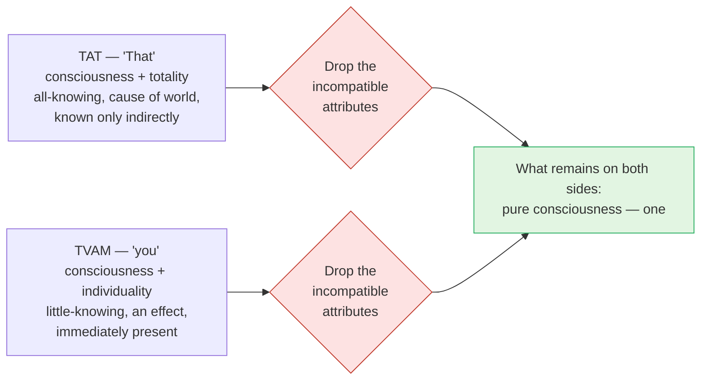

# Day 16 — *Tat Tvam Asi*: The Equation

> **Today's one idea:** "You are That" identifies two *essences*, not two packages — it works by dropping the incompatible attributes on each side (*bhāga-tyāga lakṣaṇā*) and keeping what is common: consciousness.
> **Reading time:** ~35 min · **Prereqs:** [Day 11](./day-11-sat-cit-ananda.md), [Day 15](./day-15-maya-and-ishvara.md)
> **Primary source for today:** Chāndogya Upaniṣad 6.8–6.16, with Shankara's commentary — Swami Gambhirananda (trans.), *Chāndogya Upaniṣad*, Advaita Ashrama, 1983; Vidyāraṇya, *Pañcadaśī* ch. 5 (*Mahāvākya-viveka*) — Swami Swahananda (trans.), 1967.
> **Before you start:** Without looking — *what is the difference between* vivarta *and* pariṇāma*, and how did Day 15 distinguish Īśvara from the jīva? Which one is "the total" and which "the individual"?*

---

## The hook (3 min)

A young man named Śvetaketu comes home after twelve years of study, aged twenty-four, "conceited, thinking himself learned, and proud" (Chāndogya 6.1.2). His father, Uddālaka, asks him one question: *did you ask for the teaching by which the unheard becomes heard, the unthought becomes thought, the unknown becomes known?* Śvetaketu hasn't heard of any such thing. (You met this teaching's opening move on [Day 13](./day-13-mithya.md): know the clay and you know every pot.)

Later, his father gives him a lump of salt. *"Put this in a cup of water and come back in the morning."* In the morning: *"Bring me the salt."* Śvetaketu looks. It is gone — dissolved.

*"Sip from the top. How is it?"* — "Salty." *"From the middle?"* — "Salty." *"From the bottom?"* — "Salty."

*"In the same way,"* says Uddālaka (6.13.2–3, paraphrased), *"you do not perceive Being here — yet it is here. That subtle essence is the self of this whole world. That is the real. That is the Self.* ***Tat tvam asi*** *— you are That, Śvetaketu."*

The salt is invisible to the eye that looks for a lump, and undeniable to the tongue that tastes any sip. Notice which faculty fails and which succeeds. Today's sentence works the same way: it fails if you look for a thing called "That" and a thing called "you" and try to bolt them together. It succeeds when you taste what is present in every sip.

---

## Building the intuition (12 min)

### "This is that Devadatta"

Twenty years ago, at a railway station in Varanasi, you met a thin young student called Devadatta. Today, at an airport in Bengaluru, a grey-haired, heavy-set man in a suit walks up and you realise: *"This is that Devadatta!"* — Sanskrit: ***so 'yaṃ devadattaḥ***.

Look carefully at what this sentence claims. It does **not** claim:

- that *then* = *now* (twenty years ago is not today),
- that *there* = *here* (Varanasi is not Bengaluru),
- that the thin student's body = the heavy man's body (almost every cell has changed).

If you insisted on matching *every* attribute, the sentence would be false — or nonsense. Yet it is obviously, usefully true. How?

Your mind silently performs an operation: it **drops** the attributes that conflict (then/there, now/here, thin/heavy), and **keeps** the one thing the two descriptions share — the person. The sentence identifies the *person*, and the conflicting attributes are left on the cutting-room floor. Nobody has to teach you this; you do it every time you recognise an old friend.

### Why the operation is safe

Two features make it work:

1. **The conflicting attributes are incidental.** Time, place and body-shape *belong to* Devadatta's appearances; they are not what "Devadatta" refers to. Dropping them loses nothing essential.
2. **Something survives the drop.** If you dropped *everything* — person included — the sentence would identify nothing with nothing. If you dropped *nothing*, it would identify a contradiction. The useful zone is the middle: drop *part*, keep *part*.

The Sanskrit name for this middle operation is ***bhāga-tyāga lakṣaṇā*** — "indication by abandoning a part" — also called ***jahad-ajahal-lakṣaṇā***, "indication that both lets go and does not let go."

### Now run it on the great sentence

The red diamonds are not "errors" in the sentence — they mark where the *superimposed* attributes are let go. What survives is green.

---

## The formal picture (12 min)

### The two words, defined by Day 15

On [Day 15](./day-15-maya-and-ishvara.md) you defined both sides of the equation:

| | **Tat** ("That") | **Tvam** ("you") |
| --- | --- | --- |
| Literal meaning (*vācyārtha*) | Consciousness qualified by the total — *Īśvara*, Brahman with *māyā* | Consciousness qualified by an individual body-mind — the *jīva* |
| Incompatible attributes | All-knowing, all-powerful, cause of the world, *remote* (known only through scripture — *parokṣa*) | Little-knowing, limited in power, an effect, *immediate* (never absent — *aparokṣa*) |
| Implied meaning (*lakṣyārtha*) | Pure consciousness | Pure consciousness |

Take the literal meanings, and "you are That" is plainly false: a little-knower cannot be the all-knower, an effect cannot be its own total cause. That falsity is the signal — just as with Devadatta — that the sentence is not asserting identity of *packages*. It is pointing (recall [Day 11](./day-11-sat-cit-ananda.md): *words point, they do not describe*) at what the packages share.

### Three relations between the words

Sadānanda's *Vedāntasāra* (§§148–169 in Nikhilananda's numbering) lists three relations, each illustrated by *so 'yaṃ devadattaḥ*. You only need them lightly:

1. ***Sāmānādhikaraṇya*** — *co-reference*: two words in the same grammatical case refer to one thing ("this" and "that" both point at Devadatta; "tat" and "tvam" both point at one consciousness).
2. ***Viśeṣaṇa-viśeṣya-bhāva*** — *mutual qualification*: each word narrows the other ("that" rules out a merely present stranger; "this" rules out a merely remembered figure).
3. ***Lakṣya-lakṣaṇa-sambandha*** — *indicated and indicator*: after the incompatible parts are dropped, the words together *indicate* the bare referent.

The third is the load-bearing one. And the *Vedāntasāra* is precise about which kind of indication is needed by ruling out the other two:

| Kind of *lakṣaṇā* | Classic example | Why it fails for *tat tvam asi* |
| --- | --- | --- |
| ***Jahal-lakṣaṇā*** — drop the whole literal meaning | "a village *on* the Ganges" = on the bank, not on the water | Drops consciousness too — the sentence would identify nothing |
| ***Ajahal-lakṣaṇā*** — keep the whole literal meaning and add | "the red is running" = the red horse is running | Keeps all-knowing *and* little-knowing — the contradiction stays |
| ***Jahad-ajahal* / *bhāga-tyāga*** — drop part, keep part | *so 'yaṃ devadattaḥ* | Drops the conflicting *upādhis*, keeps consciousness — works |

(*Upādhi* = a limiting adjunct: something that lends its features to what it's near without changing it, like a red flower behind a clear crystal.)

### Why both words are needed

Here is the elegant part. Each side contributes what the other lacks:

- *Tvam* contributes **immediacy**. Whatever "That" is, it is not far away: it is what you are, here, now, never absent. This blocks the reading "Brahman is a remote God."
- *Tat* contributes **limitlessness**. Whatever "you" are, you are not small: you are what Taittirīya 2.1 called *satyaṃ jñānam anantam* (Day 11). This blocks the reading "the Self is a little inner spark."

Put together: **the limitless is not remote, and the immediate is not small.** That is the whole content of the sentence — and it is exactly what the [Tenth Man](../../01-shubheccha/days/day-04-the-tenth-man.md) heard: the missing one (sought as remote) is the counter himself (immediate).

### The four great sentences

The tradition gathers four *mahāvākyas*, one from each Veda, and Pañcadaśī ch. 5 (*Mahāvākya-viveka*, only eight verses) explains each in turn:

| *Mahāvākya* | Source | Rough role |
| --- | --- | --- |
| *Prajñānaṃ brahma* — "Consciousness is Brahman" | Aitareya Upaniṣad 3.1.3 (often cited as 3.3) | Defines Brahman |
| *Tat tvam asi* — "You are That" | Chāndogya 6.8.7 (refrain repeated through 6.16) | The teaching, as given by a teacher |
| *Ayam ātmā brahma* — "This Self is Brahman" | Māṇḍūkya 2 | The teaching, as contemplated |
| *Aham brahmāsmi* — "I am Brahman" | Bṛhadāraṇyaka 1.4.10 | The teaching, as owned |

All four run on the same operation you learned today. The course's target sentence, *aham brahmāsmi*, is *tat tvam asi* said in the first person.

### Why the refrain is repeated nine times

Uddālaka says *tat tvam asi* at the end of nine illustrations (6.8.7, 6.9.4, … 6.16.3): sleep, rivers merging in the ocean, the tree that lives while sap flows, the banyan seed, the salt, the blindfolded man led home, and others. Shankara reads the repetition as pedagogy, not padding: Śvetaketu keeps raising doubts, and each story removes one. The sentence is the same; the *listener* changes. Hold that thought for Day 20.

> **Convergence — Sufi & Bhakti voices**
>
> In Baghdad the Sufi al-Ḥallāj cried *Anā al-Ḥaqq* — "I am the Real" (*al-Ḥaqq*, the Real or Truth, is a name of God) — and was executed in 922 after a long trial (Massignon, *The Passion of al-Hallaj*). Earlier, Bāyazīd Basṭāmī had exclaimed in ecstasy, "Glory be to me! How great is my majesty!" (Schimmel, *Mystical Dimensions of Islam*). Rūmī read *Anā al-Ḥaqq* as the greater humility: "I am God's servant" asserts two existences, while "I am the Real" means, in paraphrase, *I am nothing; He is all* (*Discourses of Rumi*, trans. Arberry, Discourse 11 **[VERIFY: discourse number]**). Mapped to *bhāga-tyāga*: will, name and separate existence are dropped; what remains to say "I" is the one Real.
>
> Bulleh Shah's Hīr repeats "Ranjha, Ranjha" until she has become Ranjha herself and asks to be called by his name (Shackle, *Bulleh Shah: Sufi Lyrics*) — the lover's incompatible "I" let go, the beloved kept.
>
> *Where they differ:* for most Sufi readers the "I" that speaks is God speaking through a servant annihilated in *fanāʾ* (the passing-away of the self), not the individual's own essence equated with God — and orthodox suspicion of such ecstatic sayings, up to Ḥallāj's execution, shows how firmly Islam guards that line, where Advaita says the essence was never other.

---

## Where it breaks / what it is not (4 min)

**"So my ego is God."** This is the commonest misreading, and it is precisely backwards. The equation *drops* the jīva's individuality before identifying anything; it equally drops Īśvara's omniscience. Your personality does not become all-powerful. What is identified is the consciousness in which the personality appears — which was never personal to begin with.

**"The jīva will merge into Brahman later."** The verb is *asi* — "you *are*", present tense. Not "you will become". Recall [Day 2](../../01-shubheccha/days/day-02-nachiketas-choice.md): the uncreated is not gained by the created. If identity were produced by merging, it would be a result, and would end.

**"It's a metaphor, like 'Achilles is a lion'."** A metaphor keeps two different things and transfers a quality. Bhāga-tyāga keeps one thing and removes the qualities that made it look like two. (Note: other Vedānta schools read the sentence differently — Madhva, for instance, divides it as स आत्मा अतत्त्वमसि, "you are *not* That". The convergence point: every school agrees the sentence is about the relation of the individual to the source, and every school agrees the individual depends entirely on that source. Advaita's claim is that the dependence, followed to its end, is identity of essence.)

**"I must have an experience of being everything."** The sentence is a means of knowledge (Day 4's *śabda-pramāṇa*), not a recipe for an experience. Devadatta's identity is not *felt* in a special way; it is *recognised*.

**From your Buddhist background:** this is where Advaita and most Buddhist schools part company in vocabulary. A Buddhist might say the analysis removes everything and finds no self. Advaita says the analysis removes everything *objective* and finds the one that was never an object. The convergence: both agree the *packaged* self — body, role, story — does not survive the analysis.

---

## Try it yourself (8 min)

### 1. Retrieval first

Close the page. From memory: (a) what does *so 'yaṃ devadattaḥ* drop and what does it keep? (b) What are the literal meanings of *tat* and *tvam*? (c) Name the two rejected kinds of *lakṣaṇā* and say in one phrase why each fails.

Hint

Airport, twenty years later. For (c): one drops too much, one drops too little.

Model answer

(a) Drops then/there and now/here (and changed body); keeps the person. (b) <em>Tat</em> = consciousness qualified by the total (Īśvara): all-knowing, cause, remote. <em>Tvam</em> = consciousness qualified by the individual (jīva): little-knowing, effect, immediate. (c) <em>Jahal-lakṣaṇā</em> drops the whole literal meaning, including consciousness, so nothing is identified; <em>ajahal-lakṣaṇā</em> keeps the whole literal meaning, so the contradiction (all-knowing = little-knowing) stays. Only <em>jahad-ajahal</em> / <em>bhāga-tyāga</em> — drop part, keep part — works.

### 2. Direct application — run the equation on yourself (contemplative, 5 min)

Sit for five minutes. Then do this slowly, step by step:

1. Say inwardly: *"I"* — and list what comes with it: this body, this name, this job, this mood, this limited knowledge.
2. For each item, ask Day 6's question: *is this seen, or the seer?* Set aside each one that is seen.
3. Now consider "That": the source of the whole world, all-knowing, everywhere. Set aside the attributes that belong to the *total* — all-knowing, cause, everywhere — as you set aside the individual's.
4. Notice what you could *not* set aside in step 2: the awareness that was doing the noticing.
5. Ask: is there anything in "the awareness the universe appears to" that differs from "the awareness this body appears to", *once the bodies and universes are removed from both*?

Write down what you found in step 4 and your answer to step 5.

Hint

In step 5, try to name a feature of awareness itself — not of its contents — that could tell one awareness from another. Size? Location? Colour?

What to look for

Step 4: you should find that the noticing itself never appeared on the list — every item was <em>something noticed</em>. Step 5: every candidate difference (here vs everywhere, small vs large, mine vs the world's) turns out to belong to the <em>contents</em> or the <em>upādhi</em>, not to awareness. Awareness minus its contents has no feature by which to count it as two. That is the <em>lakṣyārtha</em>. If instead you found yourself picturing a vast glowing space and calling it "That", notice that the picture was <em>seen</em> — drop it too. The point is recognition, not imagery.

### 3. Stretch — explain it to a sceptical friend

A friend who is a software engineer says: *"'You are That' is a type error. You can't assert equality between an instance and the whole class."* Reply in under 150 words, using an analogy from her world.

Hint

What if the equality is not between instance and class, but between something both of them are <em>made of</em>?

Worked answer

"You're right that <code>myObject == EntireHeap</code> is a type error — and Vedānta agrees: the jīva-package is not the Īśvara-package. But the sentence isn't comparing packages. Strip off the wrapper types on both sides and compare what they're made of: one particular object's bytes are memory; the whole heap is memory. 'This object is memory' and 'the heap is memory' — the <em>memory</em> is not two things. The sentence drops the incompatible wrappers (one object vs all objects) and identifies the substrate. In Sanskrit that's <em>bhāga-tyāga lakṣaṇā</em>: drop part, keep part. The analogy limps in one place — memory is an object you can inspect, whereas consciousness is the one doing the inspecting — but the logic of the identity is the same." (Any analogy where incompatible containers share one substrate works: waves/ocean, pots/clay — Day 13.)

### 4. Spaced callback — Days 11 and 2

(a) From [Day 11](./day-11-sat-cit-ananda.md): what is the difference between a *svarūpa-lakṣaṇa* and a *taṭastha-lakṣaṇa*? In Chāndogya 6, Uddālaka first introduces Being (*sat*) as the cause of everything ("in the beginning this was Being alone, one without a second", 6.2.1). Which kind of indication is that, and which kind does *tat tvam asi* finally deliver?
(b) From [Day 2](../../01-shubheccha/days/day-02-nachiketas-choice.md): Śvetaketu, like Nārada on Day 1, returns with twelve years of learning and still lacks "the one thing". Using the Muṇḍaka principle from Day 2, explain why no amount of further study *as accumulation* could have given him what the sentence gives.

Hint

(a) Branch and moon: does "cause of the world" describe Brahman's own nature or something it is related to? (b) <em>Nāsty akṛtaḥ kṛtena</em>.

Model answer

(a) <em>Svarūpa lakṣaṇa</em> indicates a thing by its own nature (Taittirīya 2.1: <em>satyaṃ jñānam anantam</em>); <em>taṭastha-lakṣaṇa</em> indicates it by an incidental relation, like "the house with the crow on the roof" (Taittirīya 3.1: that from which beings are born). "Being, the cause of all" is <em>taṭastha</em> — it is exactly the "That" side, with its upādhi of causehood. <em>Tat tvam asi</em>, by dropping causehood (on the <em>tat</em> side) and individuality (on the <em>tvam</em> side), delivers the <em>svarūpa</em>: pure consciousness-existence. The Upaniṣad uses the branch to reach the moon. 
(b) The uncreated is not gained by the created. Twelve years of accumulated knowledge is a product; the Self is not a product but the one to whom all products appear. What Śvetaketu lacked was not more information but the removal of one misidentification — and that is what a <em>pramāṇa</em> (the sentence, heard by a prepared mind) does. Like the Tenth Man, he needed one sentence about himself, not more counting of others.

**Transfer — apply it:**

> Pick one identity statement you make about yourself every day — "I am anxious", "I am a manager", "I am a father". Write one sentence: *the input* (the statement), *what today's idea does to it* (separates the incompatible, incidental attributes from the "I" that is co-referred in every such statement), and *the output* (what "I" refers to once the attribute is dropped, and how that changes how tightly you hold the statement). If nothing comes to mind in 60 seconds, re-read the hook and try again.

---

## Connect it back

Day 15 gave the two terms of the equation: Īśvara, consciousness with the total *māyā* as its upādhi, and the jīva, consciousness with one body-mind as its upādhi. Today showed how a single sentence identifies them without absurdity: by dropping both upādhis and keeping the consciousness they share — the same operation you perform at an airport when you recognise an old friend. The sentence works positively, by identification. Tomorrow you meet its companion method, which works negatively: strip away, one by one, everything you are not.

**Sharp question:** *If* tvam *contributes immediacy and* tat *contributes limitlessness, which of the two do you most habitually doubt about yourself — and what would that doubt sound like as a sentence?*

---

## Suggested readings for today

**Required if you have 15 extra minutes:** Vidyāraṇya, *Pañcadaśī* **chapter 5, *Mahāvākya-viveka*** (Swahananda trans.) — all eight verses. It is the shortest chapter in the book and treats the four great sentences in two verses each; notice how it defines "That" and "you" before identifying them.

**If you want the deep version:**
- Chāndogya Upaniṣad **6.8–6.16** in full (Gambhirananda trans.), with Shankara's commentary — read all nine illustrations and watch Śvetaketu's doubts change from story to story.
- Sadānanda, *Vedāntasāra*, the sections on the three relations and on *jahad-ajahal-lakṣaṇā* — §§148–169 — Swami Nikhilananda (trans.), *Vedāntasāra of Sadānanda*, Advaita Ashrama, 1931 — the textbook statement of today's operation.
- A. J. Alston (trans.), *The Realization of the Absolute: The "Naiṣkarmya Siddhi" of Śrī Sureśvara*, **Book 3** (its extended analysis of *tat tvam asi*) — Sureśvara's rigorous argument that the sentence itself, understood, is liberating knowledge, with no further act required.
- Louis Massignon, *The Passion of al-Hallaj: Mystic and Martyr of Islam*, trans. Herbert Mason, 4 vols., Princeton University Press, 1982, **vol. 1, *The Life of al-Hallaj*** (the trial and execution) — the classic study of what *Anā al-Ḥaqq* meant and why it was judged; read beside today's "my ego is God" misreading.

---

## Navigation

← **Previous:** [Day 15 — Māyā and Īśvara](./day-15-maya-and-ishvara.md)
→ **Next:** [Day 17 — Neti Neti](./day-17-neti-neti.md)
