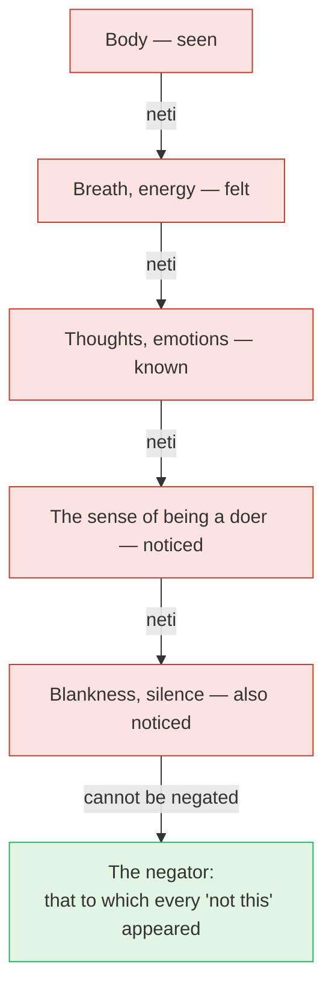

# Day 17 — *Neti Neti*: Not This, Not This

> **Today's one idea:** The knower can never be made an object, so the Upaniṣad teaches it by negation — remove everything you are not, and what remains is the one thing that cannot be removed: the remover.
> **Reading time:** ~35 min · **Prereqs:** [Day 6](./day-06-seer-and-seen.md), [Day 16](./day-16-tat-tvam-asi.md)
> **Primary source for today:** Bṛhadāraṇyaka Upaniṣad 2.3.6, 3.4.2 and 2.4.14, with Shankara's commentary — Swami Madhavananda (trans.), Advaita Ashrama, 1934.
> **Before you start:** Without looking — *in* so 'yaṃ devadattaḥ*, what is dropped and what is kept? And what does* tat *contribute to the equation that* tvam *does not?*

---

## The hook (3 min)

A sculptor is asked how she carved an elephant out of a block of granite. *"Simple,"* she says. *"I removed everything that didn't look like an elephant."*

The joke works because she added nothing. The elephant was not built; it was *uncovered*. Every blow of the chisel was a negation — not this chip, not this chip — and the negations stopped exactly where the elephant began.

Now change one thing. Suppose the sculptor is trying to uncover *herself* in the stone. She chips and chips: not this, not this. She removes every shape. And she finds, at the end, that she is still there — holding the chisel. The thing she was looking for was never in the block. It was the one doing the chipping.

That is today's teaching in a picture, and it is perhaps the most famous two words in the Upaniṣads: ***neti neti*** — "not this, not this."

---

## Building the intuition (12 min)

### Why not just describe it?

Yesterday's method was *positive*: the sentence "you are That" identifies two essences. But a positive sentence has a weakness. Every word you hear gets turned by the mind into an *image* — "consciousness" becomes a soft light, "limitless" becomes a big space, "That" becomes a presence somewhere. And every image is an object. It is *seen*. So it cannot be the seer ([Day 6](./day-06-seer-and-seen.md)).

The Bṛhadāraṇyaka knows this. In 3.4.2 the sage Uṣasta pushes Yājñavalkya: *"Show me the Brahman that is immediate and direct, the Self within all — show it to me like pointing at a cow."* Yājñavalkya replies, in substance:

> *"You cannot see the seer of seeing. You cannot hear the hearer of hearing. You cannot think the thinker of thinking. You cannot know the knower of knowing. This is your Self, which is within all. Everything other than this is perishable."*

And to his wife Maitreyī (2.4.14): ***vijñātāram are kena vijānīyāt*** — *"By what, my dear, would one know the knower?"*

These are not mystical riddles. They are a statement about geometry. The flashlight cannot illuminate itself by pointing; the eye cannot see itself without a mirror — and even then sees an image, not the seeing. Whatever you hold up as "the knower" has already become a *known*.

### So: point by subtraction

If you cannot point *at* the knower, you can still remove everything the knower is not. Then there is nothing left to mistake it for.

Try it now, slowly, on anything in your experience:

- This hand — seen. *Not this.*
- The feeling of sitting — sensed. *Not this.*
- The thought "I am doing this exercise" — known. *Not this.*
- A vague sense of "me-ness" behind the eyes — also noticed. *Not this.*

Each "not this" is not a claim that the hand, the feeling or the thought doesn't exist. It is a claim that **none of them is what "I" ultimately refers to**, because each appeared to something.

The red boxes are not bad things. They are what was *superimposed* on the Self. The arrow out of the last red box is different from the others: it is not one more removal, because there is no one else left to remove it.

### Why this isn't a slide into nothing

Here is the obvious worry. *If I negate everything, surely I end with nothing — a void.*

Try to negate the negator. Say: "the one who has been saying 'not this' — not this either." Who said that? Who noticed the negation? Something was present to it. You cannot get behind the one who is present to every negation, because getting behind it would require it.

Shankara makes the point in his commentary on the Brahma Sūtras (BSBh 2.3.7): the Self cannot be denied, because *the very one who denies it is its nature* (य एव हि निराकर्ता तदेव तस्य स्वरूपम्). A void is something you could notice — "it's all blank". The noticer of the blank is not blank.

---

## The formal picture (12 min)

### The text

Bṛhadāraṇyaka 2.3 describes Brahman under two forms — the gross (*mūrta*: earth, water, fire, the body) and the subtle (*amūrta*: air, space, the vital breath). Then, having laid out everything, it says (2.3.6):

> **अथात आदेशो नेति नेति, न ह्येतस्मादिति नेत्यन्यत्परमस्ति**
> "Now, therefore, the teaching: *not this, not this* — for there is nothing higher than this 'not this'."

Notice the order. **First** the Upaniṣad builds an elaborate description; **then** it takes the whole description back. *Neti neti* recurs in the same Upaniṣad (3.9.26, 4.2.4, 4.4.22, 4.5.15) with a fuller formula: the Self is "not this, not this — ungraspable, for it is never grasped; undecaying, for it never decays; unattached, for it never attaches" (स एष नेति नेत्यात्मा, अगृह्यो न हि गृह्यते…).

### *Adhyāropa–apavāda*: the whole teaching method

That sequence — first attribute, then retract — is not peculiar to one verse. It is the method of the entire Upaniṣadic teaching, and the tradition names it ***adhyāropa–apavāda***: "provisional attribution, then retraction." Shankara quotes the traditional maxim (Gītā Bhāṣya 13.13 — 13.14 in editions that count Arjuna's opening question as 13.1): अध्यारोपापवादाभ्यां निष्प्रपञ्चं प्रपञ्च्यते — "that which has no elaboration is elaborated by attribution and negation."

You have been taught this way for sixteen days without the name:

| Stage | Attribution (*adhyāropa*) | Retraction (*apavāda*) |
| --- | --- | --- |
| Day 7 | You are the innermost of five sheaths | Each sheath is known — not this |
| Day 8 | You are the witness of three states | "Witness" is relative to states; the states come and go |
| Day 11 | Brahman is *sat-cit-ānanda* | The words point; they do not describe |
| Day 15 | Īśvara is the cause of the world | Causehood is an upādhi (dropped on Day 16) |
| Day 16 | You are That | Drop both upādhis |

Even "witness" (*sākṣī*) is an *adhyāropa*: it is a role awareness has only *relative to* something witnessed. Remove the witnessed, and "witness" has nothing to be a witness of — awareness remains, without the title.

A ladder is the right image. You need every rung on the way up, and you need to step off the ladder at the top. Someone who refuses the rungs ("all descriptions are false, so I'll skip them") never climbs; someone who refuses to step off ("but the Self *is* a cosmic witness-light") stays on the ladder forever.

### What exactly is negated

Connect this to [Day 12](./day-12-adhyasa.md). Bondage is *adhyāsa*: the attributes of the seen (mortal, changing, small) are superimposed on the seer, and the seer's sentience is superimposed on the seen. *Neti neti* is the precise reversal of that operation:

- It negates the **superimposition**, not the **substrate**. In the rope–snake, "not a snake" removes the snake; it does not remove the rope. In fact the negation *only makes sense* with something left over — you can't say "not a snake" about empty air.
- It negates the **identification**, not the **object**. The body still exists after "I am not the body"; what goes is the claim that the body is what "I" means.

So *neti neti* is not destruction. It is correction.

### The two methods together

| | *Tat tvam asi* (Day 16) | *Neti neti* (today) |
| --- | --- | --- |
| Mode | Positive — identify | Negative — remove |
| Operates on | Two literal meanings, dropping upādhis | Everything objectifiable, one layer at a time |
| Risk if used alone | Turning "That" into an image | Ending in a felt blank and calling it the Self |
| What protects against the risk | *Neti neti* (the image is seen — not this) | The equation (what remains is not nothing — it is *sat-cit*, "That") |

They are two hands of one teacher.

---

## Where it breaks / what it is not (4 min)

**"Neti neti means the world doesn't exist."** No — it means the world is not *you*. The body, the tree, the thought remain as appearances; what is negated is the confusion that you are any of them. (Tomorrow's Gauḍapāda will push the world's status further; even there, the negation is of *ultimate reality*, not of *appearance*.)

**"The end point is an empty, blank state."** A blank state is an experience — it begins, it ends, it is *noticed*. So it is one more "not this". The tell-tale sign that you've confused a state with the Self: you can *lose* it.

**"I should keep negating forever."** The negation stops at the one that cannot be negated — not by willpower, but because there is nothing further to negate. Negating "the negator" just generates one more thought, which is itself noticed.

**"This is the same as the Buddhist analysis of the aggregates."** Much is shared. The Buddhist *anattā* analysis also says of form, feeling, perception, formations and consciousness: "this is not mine, this I am not, this is not my self." The method converges almost word for word with *neti neti* applied to the sheaths (Day 7). The difference is at the end: Advaita says the negating awareness is not one more aggregate but the un-negatable substrate; most Buddhist schools decline to posit it. You can do the practice identically in both frames up to that point — and on Day 30 you'll see why the end point is a difference of description more than of looking.

**"The negation is done by thinking."** It *uses* thinking — each "not this" is a thought — but it works by *noticing*. If you only repeat the words, the snake is never actually seen to be a rope.

---

## Try it yourself (8 min)

### 1. Retrieval first

Close the page. From memory: (a) what does Bṛhadāraṇyaka 3.4.2 say you cannot see, hear, think or know? (b) Name the overall teaching method and give its two steps in plain English. (c) Why does negation not end in a void?

Hint

(a) The "-er of -ing". (b) Ladder. (c) Try negating the one who negates.

Model answer

(a) You cannot see the seer of seeing, hear the hearer of hearing, think the thinker of thinking, know the knower of knowing — that is your Self within all. (b) <em>Adhyāropa–apavāda</em>: first provisionally attribute features to the Self/Brahman so the mind can grasp the direction, then retract them. (c) Every negation presupposes the one to whom it appears; negating that one would require it to be present. What is removed is superimposition, never the substrate. A void would be something noticed — and the noticer is not void.

### 2. Direct application — a ten-minute *neti neti* sit

Sit comfortably. Set a timer for ten minutes. Then:

1. Rest attention on the body as a whole. When it is clearly felt, say inwardly: *"This is known. Not this."* Let it be — don't push it away.
2. Do the same with the breath, then with sounds, then with whatever thought or mood is present.
3. When a sense of "me, the meditator" arises, treat it the same way: *noticed. Not this.*
4. If a blank or peaceful stillness appears, treat it the same way: *noticed. Not this.*
5. In the last two minutes, stop negating. Simply ask: *what has been present to every one of these?* Don't answer in words; look.

Afterwards, write three lines: what was easiest to negate, what was hardest, and what you noticed in step 5.

Hint

The hardest is usually the subtlest: the sense of being the one who meditates, or a pleasant silence. Those are exactly the ones worth catching.

What to look for

<strong>Easiest:</strong> usually the body or sounds — they feel "out there". <strong>Hardest:</strong> almost always (a) the sense of being the doer of the practice, or (b) a pleasant quiet that feels like "it". Both are objects: one is a thought-feeling, the other a state. If you caught them, you did the practice correctly. <strong>Step 5:</strong> you should find you can't produce an object in answer — and yet the question is not met with nothing. Something was there throughout, noticing. If you found an image ("a vast space"), you added a rung instead of stepping off — negate it and look again. The exercise is a live run of Day 6's seer/seen discrimination, with the subtlest "seen" items included.

### 3. Stretch — the student who stops too early

A student reports: *"I did neti neti and ended in a beautiful, silent, spacious emptiness. I've realised that's my true Self."* Using today's page and the two-methods table, write a short, kind reply that tells them what they found, what they missed, and which method protects against their mistake.

Hint

Can the emptiness be lost? Who noticed it was beautiful?

Worked answer

"That silence is real and worth having — it shows your mind has quietened enough to look. But notice: you can describe it ('beautiful, spacious'), which means it was <em>noticed</em>, and tomorrow it may be gone, which means it <em>comes and goes</em>. Both are marks of the seen. So it too is 'not this'. What you are is the one to whom the silence appeared — present before it arrived and after it leaves. Here the positive method helps: <em>tat tvam asi</em> tells you that what remains after negation is not a blank but <em>sat-cit</em> — existence that is aware. Negation removes the snake; the equation tells you the rope is there." (Key point: the student negated the content and then superimposed the Self on a <em>state</em> — a fresh adhyāsa.)

### 4. Spaced callback — Days 12 and 3

(a) From [Day 12](./day-12-adhyasa.md): state *adhyāsa* in one sentence and explain why it is *mutual*. Then: which half of the mutual superimposition does *neti neti* undo most directly, and which half does it leave for the positive method?
(b) From [Day 3](../../01-shubheccha/days/day-03-the-four-qualifications.md): *neti neti* is a practice of one of the four qualifications in its sharpest form. Which one? And which *other* qualification does it depend on to keep you from stopping at a pleasant state?

Hint

(a) Seer→seen and seen→seer. "I am mortal" vs "the body knows". (b) Lasting vs passing; and the one about results here and hereafter.

Model answer

(a) <em>Adhyāsa</em> is the appearance of one thing's attributes in another, as of a snake in a rope (Shankara's Adhyāsa Bhāṣya). It is mutual: the seen's attributes (mortal, small, changing) are put on the Self — "I am fat, I am sad" — and the Self's sentience is put on the seen — "the mind knows, the body feels". <em>Neti neti</em> most directly undoes the first half: it removes the seen's attributes from "I". The second half — the sense that consciousness is a property of the body-mind — is undone more fully by the positive teaching that consciousness is <em>That</em>, limitless and not a product of any sheath. 
(b) <em>Viveka</em>, discrimination of the lasting from the passing: each "not this" is a judgement that this appears and disappears, so is not the Self. It depends on <em>vairāgya</em>, dispassion: without it, a blissful quiet is a "result" you will grab and call the goal — <em>preyas</em> in spiritual clothing.

**Transfer — apply it:**

> Think of one situation this week where you were deeply identified — a criticism that stung, a plan you clung to, a role you defended. Write one sentence: *the input* (the identification, e.g. "I am the one who got this wrong"), *what today's idea does to it* (applies "not this" — the criticism, the plan, the role and the hurt are all *known*), and *the output* (what remains present when the identification is set down, and how you'd respond from there). If nothing comes to mind in 60 seconds, re-read the hook and try again.

---

## Connect it back

Yesterday's equation identified the essence of "you" and "That" by dropping their upādhis. Today's method does the same work from the other side: it drops everything objectifiable, one layer at a time, until only the un-negatable knower remains — and the equation then tells you that this remainder is not a blank but limitless *sat-cit*. Together they reverse Day 12's *adhyāsa* from both directions. Tomorrow, Gauḍapāda takes *apavāda* to its logical end and asks: if the superimposition was never real, did anything — creation, bondage, liberation — ever actually happen?

**Sharp question:** *When you say "not this" to a thought, who is it that is not the thought — and could that one ever have been bound by it?*

---

## Suggested readings for today

**Required if you have 15 extra minutes:** Bṛhadāraṇyaka Upaniṣad **3.4.1–2** (Uṣasta's question) and **2.3.6** (*neti neti*), with Shankara's commentary on 2.3.6 in Madhavananda's translation — notice his explanation of why the double "not this" is used: to remove every possible kind of description.

**If you want the deep version:**
- Sengaku Mayeda (trans.), *A Thousand Teachings (Upadeśasāhasrī)*, **prose part, chapter 1** ("How to Enlighten the Pupil") — Shankara's model teacher–student dialogue, where the student is led to see that he is not the body by exactly this method of discrimination.
- Michael Comans, *The Method of Early Advaita Vedānta*, the discussion of *adhyāropa–apavāda* and negation (see also its "Postscript on Method") **[VERIFY: chapter number not confirmed — the online table of contents is incomplete]** — shows how the early teachers used attribution-then-retraction as *the* teaching structure, not a side technique.
- Shankara, *Brahma-Sūtra-Bhāṣya* **3.2.22** (Gambhirananda trans.) — his discussion of what *neti neti* negates: the forms just described, not Brahman itself.

---

## Navigation

← **Previous:** [Day 16 — Tat Tvam Asi](./day-16-tat-tvam-asi.md)
→ **Next:** [Day 18 — Ajātivāda](./day-18-ajativada.md)
