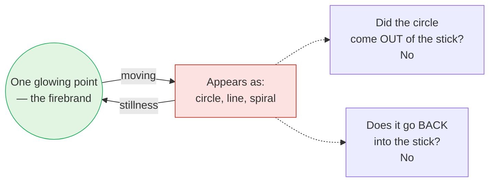

# Day 18 — *Ajātivāda*: Nothing Was Ever Born

> **Today's one idea:** From the highest standpoint (*pāramārthika*), creation, bondage and liberation never occurred — and seeing this from the right standpoint does not make practice pointless, because practice is what lets you stand there.
> **Reading time:** ~35 min · **Prereqs:** [Day 13](./day-13-mithya.md), [Day 15](./day-15-maya-and-ishvara.md)
> **Primary source for today:** Gauḍapāda, *Māṇḍūkya Kārikā* 2.32, 3.48 and ch. 4 (*Alātaśānti*), with Shankara's commentary — Swami Gambhirananda (trans.), *Eight Upaniṣads*, Vol. 2, Advaita Ashrama, 1958.
> **Before you start:** Without looking — *what does* adhyāropa–apavāda *mean, and why can the negator not be negated?*

---

## The hook (3 min)

It is Diwali night. A child grabs a glowing stick from the fire and whirls it. In the dark, a perfect circle of fire hangs in the air. She whirls it the other way — a figure of eight. Up and down — a line. Faster — a spiral.

Ask yourself three questions.

*Where did the circle come from?* Not out of the stick — nothing left the stick.
*When she stops, where does the circle go?* Not back into the stick — nothing enters it.
*Was there ever a circle at all?* There was a *seen* circle — vivid, nameable, even beautiful. But at no moment was there anything other than one glowing point, moving.

Gauḍapāda, the earliest Advaita teacher whose systematic work survives, put this picture at the centre of the last chapter of his *Kārikā* and drew from it the most radical sentence in the tradition:

> ***na nirodho na cotpattir na baddho na ca sādhakaḥ / na mumukṣur na vai mukta ity eṣā paramārthatā*** (*Māṇḍūkya Kārikā* 2.32)
>
> "There is no dissolution, no origination; no one bound, no one striving; no one seeking liberation, no one liberated. This is the highest truth."

Read that last line again. *No one seeking liberation.* That includes you, on Day 18 of a course on liberation. Today is about why that is not a joke at your expense.

---

## Building the intuition (12 min)

### The dream tiger

Last night you dreamed a tiger was chasing you through a market. Your heart pounded. You hid in a shop; the tiger found you; you woke, sweating.

Now, awake, answer some questions about the dream *from where you are now*:

- Was a tiger born last night? — No.
- Did it die when you woke? — No; it can't die, it never lived.
- Were you in danger? — The dream-you felt it. *You* weren't.
- Were you rescued by waking? — From the dream-you's side, yes. From your side, you were never in the market.

Notice: all four answers are "no" *from the waking standpoint*, and every one of them would be "yes" from inside the dream. Neither set of answers is a lie. They are answers from two different places.

Gauḍapāda's second chapter (*Vaitathya*, "unreality") builds on exactly this: what appears in waking has the same structure as what appears in dream — it is *seen*, it comes and goes, it depends on the seer. And the Upaniṣads' highest standpoint relates to waking as waking relates to dream.

### The tenth man, revisited

You know the story from [Day 4](../../01-shubheccha/days/day-04-the-tenth-man.md). Ten men cross a river, count, get nine, and grieve for the drowned tenth until a traveller says: *"You are the tenth."*

Ask the dream questions of this story, from the standpoint of the fact:

- Was the tenth man ever lost? — No. He was on the bank, counting, the whole time.
- Was he found? — No — you can't find what was never lost.
- Was there a real search? — There was searching, and real tears. But nothing in the *fact* was missing.

So the story already contains *ajāti*: from the standpoint of what actually is, there was no loss, no search, and no finding — only ignorance and its removal. And note: from inside the grief, the traveller's sentence was urgently needed. Both are true. That is the whole lesson of today.

### The firebrand, carefully

In chapter 4 (*Alātaśānti*, "the quenching of the firebrand", verses 4.47–52) Gauḍapāda says: as the moving firebrand appears as straight lines and circles, so consciousness, "vibrating", appears as perceiver and perceived; as the shapes do not come out of the firebrand or enter it, so the world does not come out of consciousness or go back into it. The appearances are never anything *other than* the firebrand — and the firebrand never *became* them.

This is [Day 15](./day-15-maya-and-ishvara.md)'s *vivarta* pushed to its limit: an appearance without any real transformation of the substrate.

---

## The formal picture (12 min)

### Who and what

**Gauḍapāda** is traditionally the teacher of Govinda, who was Shankara's teacher. His *Māṇḍūkya Kārikā* (also called *Āgama-śāstra*) has four chapters: *Āgama* (on the Upaniṣad's three states and *turīya* — Day 10), *Vaitathya* (the unreality of the seen, via dream), *Advaita* (non-duality, argued), and *Alātaśānti* (the firebrand). Shankara wrote a full commentary on it — a sign of how central it was for him.

***Ajātivāda*** = *a* (non-) + *jāti* (birth, origination) + *vāda* (doctrine): **the doctrine of non-origination.** The key verse after 2.32 is 3.48:

> "No jīva is ever born; there is no cause for its birth. This is the highest truth — that in which nothing whatever is born." (*Māṇḍūkya Kārikā* 3.48, paraphrased)

### The argument, in outline

Gauḍapāda doesn't just assert non-origination; he argues for it (see especially 3.27–28 and 4.3–5). In simplified form:

1. If something is born, it is born either from what *exists* or from what *does not exist*.
2. What exists doesn't need to be born — it already is.
3. What doesn't exist can't produce anything — a barren woman's son has no son.
4. ∴ Nothing is really born. Birth is an *appearance* (like the dream tiger), not an event in reality.

He adds a nice twist: the rival schools of his day argued with each other — one said the existent is born, another that the non-existent is born — and each refuted the other. "Arguing thus with one another, they together proclaim non-origination" (4.4, paraphrased; 4.5 adds that he approves the non-origination they proclaim).

### Standpoints — Day 13's tool, now essential

You can only read 2.32 correctly with [Day 13](./day-13-mithya.md)'s three orders of reality:

| Standpoint | Status of the world | Is anyone bound? | Is practice meaningful? |
| --- | --- | --- | --- |
| *Prātibhāsika* (dream, rope-snake) | Private appearance | The dream-self feels bound | Within the dream |
| *Vyāvahārika* (waking transaction) | *Mithyā* — real for use, dependent on substrate | Yes — the jīva experiences bondage | Yes, fully |
| *Pāramārthika* (absolute) | Never originated — only Brahman | No one — 2.32 | No one to practise; nothing to gain |

The mistake is to mix columns: to speak *from* the bottom row while standing in the middle row. "There is no bondage, so I needn't study" is a jīva in the middle row borrowing a sentence from the bottom row — like a dreaming man saying "this tiger is unreal" while still running.

### Then why teach creation at all?

Gauḍapāda answers this himself. The Upaniṣads describe creation in many ways — clay and pots, sparks from a fire, iron and its forms. **These are *means* to lead the mind in** (*upāyaḥ so 'vatārāya*, 3.15), not claims that creation is ultimately real. And he says (3.16) that the graded teachings exist out of compassion for students of lower, middle and higher understanding.

This is [Day 17](./day-17-neti-neti.md)'s *adhyāropa–apavāda* at full scale. Creation (Day 15) is the *adhyāropa*; *ajāti* is the *apavāda*. Īśvara as cause was a rung; *ajāti* is stepping off.

### The question of Buddhist influence

You will notice that Gauḍapāda sounds Buddhist. He uses Mahāyāna vocabulary (*saṃvṛti*, conventional truth; *ajāti*; the firebrand image itself has Buddhist parallels), and chapter 4 engages Buddhist positions closely. Scholars have argued this for a century: some (e.g. Vidhushekhara Bhattacharya) emphasised Buddhist influence; others (e.g. T. M. P. Mahadevan) emphasised continuity with the Upaniṣads; Richard King's *Early Advaita Vedānta and Buddhism* (SUNY, 1995) maps the whole debate.

The convergence reading this course takes: Gauḍapāda and the Madhyamaka/Yogācāra thinkers share a *method* — dismantling the reality of origination by analysis and by the dream analogy — and a *conclusion* about the world's ultimate status. Gauḍapāda himself marks the difference in 4.99: "this was not spoken by the Buddha" — meaning, on Shankara's reading, that the unborn, non-dual *consciousness* that remains is the Upaniṣadic Self. Same dismantling; different name for what remains. For you, with a Buddhist background, this is a bridge rather than a border.

---

## Where it breaks / what it is not (4 min)

**"Then practice is pointless — I'm already free, so I'll do nothing."** This is a standpoint error (see the table). From the absolute standpoint there is no one to be lazy either. The person concluding "I needn't practise" is precisely the jīva still standing in *vyavahāra*, still feeling bound — so the conclusion is self-refuting. *Ajāti* is the **content** of the knowledge practice delivers, not a **shortcut** around it.

**"*Ajāti* means the world doesn't exist and my suffering is fake."** *Mithyā* is not "unreal" (Day 13). The dream tiger was really *experienced*; your suffering is really *experienced*. What *ajāti* denies is that either has independent, originated reality apart from consciousness. Compassion for suffering is exactly appropriate in *vyavahāra*.

**"Gauḍapāda contradicts Day 15."** Day 15 said the world has an intelligent cause — from the empirical standpoint. *Ajāti* says nothing was caused — from the absolute standpoint. Gauḍapāda *uses* the first to reach the second (3.15). They are two rungs, not two rival claims.

**"Saying 'no one is liberated' sounds bleak."** Re-read the tenth man. "No one was ever lost" is not bleak news to the grieving men; it is the best news possible.

**"This is the highest truth, so I should repeat it to myself."** Repeating 2.32 as a mantra without the discrimination underneath is the Day 34 trap in advance: the radical texts *state* the end; they test understanding, they don't replace it.

---

## Try it yourself (8 min)

### 1. Retrieval first

Close the page. From memory: (a) paraphrase *Māṇḍūkya Kārikā* 2.32 — all six negations; (b) say what the firebrand image shows about where the appearances come from and where they go; (c) explain in two sentences why *ajāti* does not make practice pointless.

Hint

(a) Two about the world, four about the seeker. (c) Which standpoint is the person asking "why practise?" standing in?

Model answer

(a) No dissolution, no origination; no one bound, no aspirant (no one practising), no seeker of liberation, no one liberated — this is the highest truth. (b) The shapes neither come out of the firebrand nor go back into it; there was never anything but the moving point. Likewise the world neither issues from nor returns into consciousness — it is consciousness appearing, with no real transformation (<em>vivarta</em>). (c) <em>Ajāti</em> is true from the <em>pāramārthika</em> standpoint, where there is no one to practise or not practise. The one who asks "why practise?" still experiences bondage in <em>vyavahāra</em>, so practice is meaningful for them — it is what removes the ignorance that makes 2.32 seem false.

### 2. Direct application — the three-standpoint review of a bad day

Pick a genuinely difficult event from the past week (an argument, a failure, a fear). Write three short paragraphs about it:

1. **From inside** (*prātibhāsika*-like): how it felt while it was happening — the "dream" view.
2. **From *vyavahāra***: what actually happened, what needs doing, who you owe an apology or an action.
3. **From *ajāti***: was the awareness in which it appeared born with it, harmed by it, or ended by it?

Then read the three together and notice which one you were standing in when you felt worst.

Hint

Paragraph 2 is not optional — <em>ajāti</em> is not permission to skip the apology.

What to look for

Paragraph 1 usually fuses the event with "me" — <em>adhyāsa</em> in action ("I am humiliated"). Paragraph 2 should be practical and ethical; if it's thin, you're using the highest standpoint to avoid responsibility (the commonest misuse of <em>ajāti</em>). Paragraph 3 should find that the awareness in which the event appeared did not begin when it began, was not damaged, and is still present — while the event, like the firebrand's circle, came and went without the point ever becoming it. Most people find they suffered most in paragraph 1, and that paragraph 3 makes paragraph 2 <em>easier</em>, not unnecessary. That is the right relationship between the standpoints. (Seer/seen: the event, the feeling and the story are all seen; paragraph 3 is the seer noticed as such.)

### 3. Stretch — the Buddhist friend's challenge

A friend who practises Madhyamaka says: *"Gauḍapāda just copied Nāgārjuna's 'no arising' and slapped the word 'ātman' on what's left."* Write a fair reply in under 150 words, using the convergence framing.

Hint

Grant what is shared. Then name the difference precisely — at what point does it appear? Is it a difference in what is negated or in what is said to remain?

Worked answer

"The overlap is real: both use the dream analogy, both argue that nothing truly arises from itself or from another, both distinguish conventional from ultimate truth — and scholars still debate how much Gauḍapāda borrowed. But notice where the difference sits. Both negate the reality of arising objects. Madhyamaka declines to posit anything that remains, because any posit would be one more 'view'. Gauḍapāda says the negation is <em>known</em> — and the knowing is not one more arising thing; his own 4.99 says 'this was not taught by the Buddha', pointing to the unborn consciousness of the Upaniṣads. So it's not a label stuck on emptiness: it's a claim about the one in whom the emptiness of things is seen. Up to that point, the practice can be identical."

### 4. Spaced callback — Days 13 and 4

(a) From [Day 13](./day-13-mithya.md): define *mithyā* in one sentence using the clay and the pot. Then explain why *ajāti* is what *mithyā* looks like when viewed from the substrate's side rather than the pot's.
(b) From [Day 4](../../01-shubheccha/days/day-04-the-tenth-man.md): what kind of *pramāṇa* was "you are the tenth", and why couldn't more counting have worked? Connect this to Gauḍapāda's statement that there is "no one liberated".

Hint

(a) From the clay's side, was a pot ever <em>born</em>? (b) What did the sentence add to the tenth man? What did it remove?

Model answer

(a) <em>Mithyā</em>: neither real nor unreal — the pot is experienced and useful, but has no being of its own apart from clay; it is clay in a name-and-form (Chāndogya 6.1.4). From the pot's side, a pot was "made". From the clay's side, nothing new came into being — there is only clay, before, during and after. <em>Ajāti</em> is that clay's-eye view applied to the whole world and to the jīva: nothing other than Brahman was ever born. 
(b) <em>Śabda-pramāṇa</em> — knowledge through words — removing ignorance about something immediately present (<em>aparokṣa</em>). Counting couldn't work because the counter was the missing item, and the instrument kept leaving itself out. The sentence added nothing to the tenth man — he gained no new existence — it only removed the ignorance. So "no one liberated" is exactly right: no one was ever lost; what ended was only the not-knowing. Liberation is not an event in the life of the liberated.

**Transfer — apply it:**

> Pick one recurring worry that feels like a real threat to *you* — a health fear, a reputation fear, a fear of failing. Write one sentence: *the input* (the worry, as you'd say it), *what today's idea does to it* (sorts it by standpoint: what is to be done in *vyavahāra*, and whether the awareness in which the worry appears was ever born or could be harmed), and *the output* (one practical action you'll take, and one thing you'll stop treating as a threat to what you are). If nothing comes to mind in 60 seconds, re-read the hook and try again.

---

## Connect it back

Yesterday, *neti neti* removed everything superimposed on the Self, layer by layer — the *apavāda* half of the teaching. Today Gauḍapāda applied *apavāda* to the largest *adhyāropa* of all, creation itself: from the highest standpoint nothing was born, no one was bound, and no one is freed — as the tenth man was never lost. Held with Day 13's standpoints, this is not nihilism or a licence to stop; it is the content of what the enquiry finally knows. Tomorrow is a drill: you will dismantle superimposition and apply *mithyā* yourself, live, on seven increasingly intimate targets — ending with the seeker.

**Sharp question:** *If no one is bound, who is it that suffers when you suffer — and from which standpoint is that question being asked?*

---

## Suggested readings for today

**Required if you have 15 extra minutes:** *Māṇḍūkya Kārikā* **2.31–2.32** and **3.46–3.48**, with Shankara's commentary (Gambhirananda, *Eight Upaniṣads* Vol. 2). Notice how Shankara explains 2.32 — the six negations follow from the unreality of duality, not from a decree.

**If you want the deep version:**
- *Māṇḍūkya Kārikā* **chapter 4 (*Alātaśānti*)**, especially the firebrand verses (**4.47–4.52**) and the closing verses **4.97–4.100** — the hardest chapter in the Kārikā, and the one with the Buddhist dialogue.
- Swami Sarvapriyananda, *Māṇḍūkya Upaniṣad* lecture series (Vedanta Society of New York), the talks on the *Kārikā* chapters 2–4 **[VERIFY: episode numbers not confirmed — search the VSNY YouTube playlist by chapter]** — the clearest spoken unpacking of *ajāti* and the standpoint distinction.
- Richard King, *Early Advaita Vedānta and Buddhism: The Mahāyāna Context of the Gauḍapādīya-kārikā* (Albany: SUNY Press, 1995) — a balanced scholarly map of the influence debate, for your Buddhist side.

---

## Navigation

← **Previous:** [Day 17 — Neti Neti](./day-17-neti-neti.md)
→ **Next:** [Day 19 — DRILL II](./day-19-drill-mithya-adhyasa.md)
