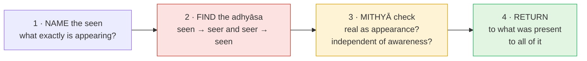

# Day 19 — DRILL II: Dismantling Superimposition

> **Today's one idea (the drill target):** Take any experience — from a passing emotion to "the seeker" itself — and, live, (1) separate what is seen from what sees, (2) find the superimposition running in *both* directions, and (3) give the seen its correct status: *mithyā*, real as appearance, dependent on the awareness it appears in.
> **Reading time:** ~45 min (do the drills, don't read them) · **Prereqs:** [Day 12](./day-12-adhyasa.md), [Day 13](./day-13-mithya.md), [Day 17](./day-17-neti-neti.md)
> **Primary source for today:** Shankara, *Adhyāsa Bhāṣya* (preamble to the *Brahma-Sūtra-Bhāṣya*) — Swami Gambhirananda (trans.), Advaita Ashrama, 1965; Chāndogya Upaniṣad 6.1.4 (clay) — Gambhirananda (trans.), 1983.
> **Before you start:** Without looking — *paraphrase* Māṇḍūkya Kārikā *2.32, and say from which standpoint it is true and why that doesn't make today's drill pointless.*

---

## How to use this drill

This page is a gym, not a library. Each drill names a target and gives you a task; **do the task, in writing or in a sit, before you open anything.** The hints are for when you are stuck after a real attempt; the worked solutions are for checking, not for reading first. The drills get harder because the targets get closer: an emotion is easy to see as "seen"; the seeker is not. If a drill feels uncomfortable — if you notice a part of you saying "yes, but *this* one really is me" — that discomfort is the signal that you've found a live superimposition. Stay with it. That's the rep that counts.

### The protocol you'll run each time

Every drill uses the same four moves. Learn them now; by Drill 4 you should be running them without looking.

Move 2 always has two halves, because *adhyāsa* is mutual ([Day 12](./day-12-adhyasa.md)): the seen's attributes put on the Self ("*I* am angry"), and the Self's sentience put on the seen ("the *mind* knows it's angry"). Move 3 always has two halves, because *mithyā* is "neither real nor unreal" ([Day 13](./day-13-mithya.md)): don't deny the appearance, and don't grant it independence.

---

### Drill 1 — An emotion

Recall (or wait for) a mild irritation from today — a delay, a remark, a notification. Bring it back vividly enough that some of the feeling returns. Now run the four moves in writing, one line each.

Hint

For move 2, write the sentence you'd naturally use ("I'm annoyed") and underline the word that commits the superimposition. For the reverse direction, ask: what am I treating as the thing that <em>knows</em> the annoyance?

Worked solution

<strong>1 · Name:</strong> a tightening in the chest, heat in the face, a replaying thought "he always does this". 
<strong>2 · Adhyāsa:</strong> seen→seer: "<u>I</u> am irritated" — the emotion's quality is put on "I", as if the awareness itself became hot. Seer→seen: "the mind knows it's irritated" — knowing is credited to the mind, as if the emotion were self-aware. 
<strong>3 · Mithyā:</strong> Real as appearance? Yes — it's genuinely felt; denying it would be suppression, not discrimination. Independent? No — there is no irritation that is not <em>known</em>; its whole being is its appearing. It came, it will go; the knowing of it did not arrive with it. 
<strong>4 · Return:</strong> the awareness in which the tightening appeared — not tight, not hot, not irritated, and not opposed to the irritation either. 
<em>Common error:</em> using move 3 to make the emotion vanish ("it's unreal, so it's gone"). If it's still there, fine — the drill isn't to remove it but to see its status. Often it loosens anyway, because adhyāsa was feeding it.

---

### Drill 2 — A role or identity

Pick the role that feels most like "who you are" professionally or socially — "I'm an engineer", "I'm a parent", "I'm the reliable one". Run the protocol. Then add one line: *what would be lost if this role ended tomorrow, and what would not?*

Hint

A role is a cluster: a word, some memories, some expectations (yours and others'), a self-image. Name each part in move 1. Then ask Day 16's question: what is co-referred by "I" in "I am an engineer" <em>and</em> "I am a parent"?

Worked solution

<strong>1 · Name:</strong> "engineer" = a job title, a skill-set, a set of memories of building things, an image of myself as competent, others' expectations. 
<strong>2 · Adhyāsa:</strong> seen→seer: the role's attributes (competent, valued, at risk of being made redundant) are felt as attributes of <em>me</em> — which is why a criticism of my code stings like a criticism of my being. Seer→seen: the self-image seems to <em>be</em> the one who is aware — "I-the-engineer am noticing this". 
<strong>3 · Mithyā:</strong> Real as appearance: entirely — it pays the rent, it has duties (<em>vyavahāra</em>). Independent: no — every part of it is an idea, memory or expectation <em>appearing</em>. It was absent in deep sleep last night, and you didn't miss it. 
<strong>4 · Return:</strong> the "I" common to "I am an engineer" and "I am a parent" is not either role — exactly Day 16's <em>bhāga-tyāga</em>: drop the incompatible roles, keep what both refer to. 
<strong>Lost / not lost:</strong> the job, status and routine would be lost. The awareness in which the role appeared would not — it was there before the role, and is there now, unemployed by it.

---

### Drill 3 — A memory (with a callback to Day 13)

Bring up a vivid memory from childhood — a specific room, a specific day. Let the details come. Run the protocol. Then answer: **in Day 13's three orders of reality, which order does the *memory-image* belong to, and which does the *original event* belong to?** Is either one independent of awareness?

Hint

Notice <em>when</em> the memory is happening. Not then — now. The child's room is appearing <em>now</em>, in present awareness.

Worked solution

<strong>1 · Name:</strong> an image of a kitchen, yellow light, a smell of cooking, a feeling of being small, and the thought "that was me". 
<strong>2 · Adhyāsa:</strong> seen→seer: "I was that child" — the child's smallness, age and fear are carried forward as features of the present "I". Seer→seen: the remembered child seems to have been <em>the knower</em> then, a separate awareness that has since grown up. 
<strong>3 · Mithyā & orders:</strong> the memory-image now is like the <em>prātibhāsika</em> — a private appearance, existing only while it's being imaged. The original event was <em>vyāvahārika</em> — shared, transactional, with real effects. Neither is independent of awareness: the event appeared to awareness then; the image appears to awareness now. <strong>Key observation:</strong> the awareness then and the awareness now cannot be told apart — the child changed completely; that in which the child appeared shows no age. 
<strong>4 · Return:</strong> the present awareness in which the past is appearing. It is not "in" the past; the past is in it, right now. 
(Callback Day 13: <em>mithyā</em> = experienced, dependent on its substrate, neither real like the substrate nor non-existent like a hare's horn.)

---

### Drill 4 — The body (with a callback to Day 12)

Sit still for three minutes and attend to the body as felt from inside — pressure, warmth, tingling, the outline. Then run the protocol. Before opening the solution, also write out **Shankara's definition of *adhyāsa*** from [Day 12](./day-12-adhyasa.md) in your own words and show precisely where it applies to "I am this body."

Hint

Is "the body" one object, or a collection of sensations that a thought labels "my body"? Where does the felt body end — and where is the awareness of it?

Worked solution

<strong>Definition (Day 12):</strong> <em>adhyāsa</em> is the appearance, in the form of memory, of something previously seen in something else — the attributes of one thing apparently present in another, like a snake appearing in a rope. 
<strong>1 · Name:</strong> a field of sensations — pressure at the seat, warmth in the hands, a pulse — plus a visual image and the label "my body". 
<strong>2 · Adhyāsa:</strong> seen→seer: "I am sitting, I am 40, I am tired" — the body's location, age and fatigue are superimposed on "I" (the snake on the rope). Seer→seen: "the body is aware" — the body appears sentient because consciousness is superimposed on it; the sensations seem to know themselves. 
<strong>3 · Mithyā:</strong> real as appearance — it must be fed and cared for. Independent — no: each sensation is only ever known; between sensations, "the body" is a concept. It was absent as felt body in deep sleep (Day 8). 
<strong>4 · Return:</strong> the sensations appear <em>in</em> awareness; awareness is not located at any of them. Test: is awareness to the left of the left hand, or does the left hand appear in it? 
<em>Common error:</em> concluding "so the body doesn't matter". The body is <em>mithyā</em>, not <em>tuccha</em> (non-existent): care for it as one cares for a valuable instrument that is not oneself.

---

### Drill 5 — An object in the room

Choose a physical object within sight — a cup, a chair, a plant. Look at it for one minute. Run the protocol, and then do Chāndogya 6.1.4's clay test on it: **what is the "clay" of this object, all the way down?**

Hint

Peel it: the cup → ceramic → minerals → molecules → … Each level is the "clay" of the one above. Now ask: in your experience right now, what is the cup — as appearing — <em>made of</em>? What is the one thing never absent from any level of it?

Worked solution

<strong>1 · Name:</strong> colour, shape, a glint, the word "cup", a memory of its weight. 
<strong>2 · Adhyāsa:</strong> seen→seer is weak here (you don't think "I am the cup") — but look: "I am <em>here</em>, the cup is <em>there</em>" puts spatial location on the seer. Seer→seen: the cup seems to exist "on its own", carrying its being as if self-established; existence (<em>sat</em>) is lent to it and then credited to it. 
<strong>3 · Mithyā / clay test:</strong> as a pot is clay with a name and form, the cup is ceramic with a name and form; ceramic is minerals with a name and form; and so on. Every level is "name and form on something". In <em>experience</em>, the cup as known is made of seeing — colour, shape — and those are never found apart from awareness. Real as appearance: yes, you can drink from it. Independent: no — "is" is the one thing that shows up at every level, and that "is" is never given by the cup. 
<strong>4 · Return:</strong> the "is-ness" and the knowing in which the cup appears. Day 11's <em>sat</em> and <em>cit</em> are not two extra properties of the cup; they are what the cup is appearing <em>in</em>. 
<em>Caution:</em> this is not idealism ("the cup is just my idea"). Day 13 closed that trap: the cup is not <em>your private</em> mental image; it is a public, shared appearance in <em>vyavahāra</em>, depending on consciousness as such, not on your mind.

---

### Drill 6 — The world

Take "the world" — everything, including other people, history, galaxies. Run the protocol. Then answer: **from which standpoint does the world have a cause (Day 15), and from which was it never born (Day 18)? Can both be held without contradiction?**

Hint

How does "the world" ever show up for you? Not as a totality you've seen — as a concept, plus whatever is currently being perceived. Move 1 needs to be honest about that.

Worked solution

<strong>1 · Name:</strong> the world, as experienced, is never seen whole: it's the current perception (this room, these sounds) plus a vast concept ("everything else out there") built from memory and inference. 
<strong>2 · Adhyāsa:</strong> seen→seer: "I am <em>in</em> the world, a small thing among many" — the world's vastness makes the seer feel tiny, located, a part. Seer→seen: the world seems to stand on its own, self-existent, prior to any knowing. 
<strong>3 · Mithyā:</strong> real as appearance — fully; it is shared, lawful, consequential. Independent — no: every bit of it that ever shows up, shows up as known. Standpoints: in <em>vyavahāra</em>, the world has an intelligent cause — Īśvara, Brahman with māyā, the total (Day 15) — and that's why it's orderly. From the <em>pāramārthika</em> standpoint nothing was born (Day 18). No contradiction: creation is the <em>adhyāropa</em>, non-origination the <em>apavāda</em> (Day 17). 
<strong>4 · Return:</strong> the reversal: you are not a small thing in the world; the world, as ever experienced, appears in what you are. That's not ego inflation — the ego is on the "world" side of the line, too.

---

### Drill 7 — The seeker (with a callback to Day 5)

The hardest target. Take *the one who has been doing these drills* — the one who wants liberation, who has been taking this course, who will check the scoring note in a minute. Run the protocol on **that**. Before you open the solution, answer Day 5's question: [*who is asking?*](../../01-shubheccha/days/day-05-who-is-asking.md) — and recall the Bṛhadāraṇyaka 4.3 sequence of lights.

Hint

The seeker shows up as something: a sense of effort, a hope, a self-image of "a serious practitioner", a thought "am I getting it?". Is any of that the one to whom it shows up? Then remember Janaka's questions: when the sun, moon, fire and speech are all gone, what light remains?

Worked solution

<strong>Day 5 callback:</strong> Janaka asks Yājñavalkya what serves as a person's light. The sun; when the sun has set, the moon; then fire; then speech; and when all those are gone — the Self is his light (Bṛh. 4.3.2–6). What is lit is never the light. The examiner is the one thing never examined — until now. 
<strong>1 · Name:</strong> a sense of effort behind the eyes; a hope ("maybe I'll see it today"); a self-image ("I'm on Day 19, I'm doing well / badly"); a subtle sense of lack ("not yet"). 
<strong>2 · Adhyāsa:</strong> seen→seer: the seeker's incompleteness — "not yet free" — is put on the Self. This is the original superimposition the whole course is about: the sense of lack from Day 1, now in spiritual clothing. Seer→seen: the seeker seems to be the one who is aware and who will one day "see" the Self, as if awareness belonged to the seeker. 
<strong>3 · Mithyā:</strong> real as appearance — yes; the seeker's effort is useful and right in <em>vyavahāra</em> (Day 18: practice is meaningful where bondage is felt). Independent — no: the seeker is <em>known</em>. It appears when you sit to practise and is absent in deep sleep. It is one more piece of content. 
<strong>4 · Return:</strong> the awareness in which the seeker appears was never seeking. It is the sought — the tenth man, doing the counting (<a href="../../01-shubheccha/days/day-04-the-tenth-man.md">Day 4</a>). This is Kārikā 2.32's "no seeker of liberation" seen from inside, not borrowed as a slogan. 
<em>Common error:</em> turning the result into a new seeker's trophy ("I've seen through the seeker!"). Who is pleased? Run the protocol on that one too. It ends not by a final victory but by noticing that the one who never needed the victory was there throughout.

---

**Transfer — apply it:**

> Tomorrow, choose one moment that would normally hook you — an email that stings, a craving, a worry at 3 a.m. Write one sentence afterwards: *the input* (the moment), *what today's protocol did to it* (name the seen / find the two-way adhyāsa / mithyā check / return), and *the output* (what changed in how you responded, even slightly). If nothing comes to mind in 60 seconds, re-read Drill 1 and try again.

---

## Scoring yourself

Give yourself one point per drill where you found **both** directions of *adhyāsa* without opening the hint, and one more where your move 3 neither denied the appearance nor granted it independence. 12–14: the bottleneck skill is live. 8–11: redo Drills 4 and 7 tomorrow before Day 20. Under 8: revisit [Day 12](./day-12-adhyasa.md) and [Day 13](./day-13-mithya.md), then rerun the drill in a week — this is normal, not failure.

---

## Suggested readings for today

**Required if you have 15 extra minutes:** Shankara's ***Adhyāsa Bhāṣya*** (Gambhirananda trans., the preamble to the *Brahma-Sūtra-Bhāṣya*), the passage near the end listing examples — "I am fat, I am thin", "I am dumb, I am blind", "I desire, I doubt" — superimposing the attributes of body, senses and mind on the Self. You have just drilled every one of his categories.

**If you want the deep version:**
- Swami Nikhilananda (trans.), *Dṛg-Dṛśya-Viveka*, **verses 1–5** — the seer/seen chain behind move 4, in the most compact form in the tradition.
- Vidyāraṇya, *Pañcadaśī* **chapter 6 (*Citra-dīpa*)**, the opening image of the painted canvas, **vv. 1–9** — one canvas, four stages of preparation, a world of painted figures: the clearest classical picture of *mithyā* across every level of Drill 1–6.
- D. Venkataramiah (trans.), *The Pañcapādikā of Padmapāda*, the opening discussion of *adhyāsa* — the first commentary on Shankara's preamble, for those who want the definition argued in full.

---

## Navigation

← **Previous:** [Day 18 — Ajātivāda](./day-18-ajativada.md)
→ **Next:** [Day 20 — Hearing, Reflecting, Dwelling](./day-20-shravana-manana-nididhyasana.md)
