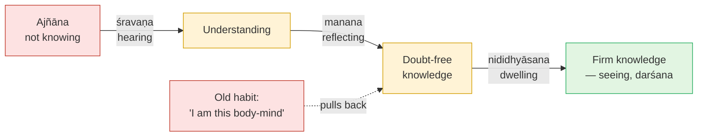

# Day 20 — Hearing, Reflecting, Dwelling (*Śravaṇa–Manana–Nididhyāsana*)

> **Today's one idea:** Understanding becomes firm knowledge in three movements, each removing a different obstacle — hearing removes ignorance, reflecting removes doubt, dwelling removes the contrary habit.
> **Reading time:** ~35 min · **Prereqs:** [Day 4](../../01-shubheccha/days/day-04-the-tenth-man.md), [Day 16](./day-16-tat-tvam-asi.md)
> **Primary source for today:** Bṛhadāraṇyaka Upaniṣad 2.4.1–5 (Yājñavalkya and Maitreyī), with Shankara's commentary — Swami Madhavananda (trans.), Advaita Ashrama, 1934.
> **Before you start:** Without looking — *name the four moves of yesterday's drill protocol, and say which drill was hardest for you and why.*

---

## The hook (3 min)

The sage Yājñavalkya is about to leave home for the forest. He calls his wife Maitreyī and says: *"I'm going. Let me settle my property between you and Kātyāyanī."*

Maitreyī asks one question (Bṛhadāraṇyaka 2.4.2–3, paraphrased): *"Sir, if this whole earth, full of wealth, were mine — would I become immortal by it?"*

*"No,"* he says. *"Your life would be like the life of the rich. There is no hope of immortality through wealth."*

*"Then what would I do with what won't make me immortal? Tell me, sir, what you know."*

You have heard this before — it is Nachiketas refusing Yama's horses ([Day 2](../../01-shubheccha/days/day-02-nachiketas-choice.md)), Nārada confessing his sorrow ([Day 1](../../01-shubheccha/days/day-01-the-itch-objects-cant-scratch.md)). Yājñavalkya, delighted, teaches her: it is not for the sake of the husband that the husband is dear, nor the wife, nor wealth — all are dear *for the sake of the Self*. And then he gives the sentence this whole page is about (2.4.5):

> ***ātmā vā are draṣṭavyaḥ śrotavyo mantavyo nididhyāsitavyaḥ***
> "The Self, my dear, is to be *seen* — to be *heard about*, *reflected on*, and *dwelt upon*."

One goal, three means. For nineteen days you have been doing the first two without the names. Today you find out why there is a third — and why this is the hinge into the next module.

---

## Building the intuition (12 min)

### Moving house

Six months ago you moved to a new flat across town. Consider three ways you could still fail to "know" this.

**Failure 1 — you were never told.** Imagine you'd been away and someone else moved your things. Until someone *tells* you the new address, you simply don't know it. No amount of thinking will produce it. *Remedy: hear it.*

**Failure 2 — you were told, but you doubt it.** "Are you sure? The lease was signed? My furniture's really there?" The information arrived, but it doesn't sit — every time you think of home, a question-mark comes up. *Remedy: check, reason, answer every doubt until none is left.*

**Failure 3 — you know, without doubt, and yet…** For weeks, at the end of a tiring day, your feet carry you to the old bus stop. You catch yourself writing the old postcode on a form. You don't *believe* you live there. The knowledge is complete and certain. But *habit* still runs the old address. *Remedy: live in the new knowledge, keep returning to it, until the old groove fades.*

Three failures, three remedies — and notice: **each remedy is useless against the other two failures.** Repeating the address to someone who doubts it won't remove the doubt. Answering every doubt won't stop your feet walking to the old bus stop. And dwelling on "I live in the new flat" does nothing if you were never told where it is.

### The same three, for the Self

- You were never told what "I" refers to → **hearing** the teaching: *tat tvam asi* (Day 16), with its supporting illustrations.
- You were told but it doesn't sit — "can words really reveal the Self? Isn't the world obviously real? Isn't consciousness produced by the brain?" → **reflecting**: Days 6–18 have been almost entirely this.
- You know, but at the end of a tiring day your mind walks straight back to "I am this tired body, this worried person" → **dwelling**.

The dashed red arrow is the reason a third step exists at all.

---

## The formal picture (12 min)

### Reading the sentence

In 2.4.5, *draṣṭavya* — "to be seen" — is the **goal**, not a fourth step. Shankara reads the three that follow as the **means** to that seeing: hearing from a teacher and scripture, then reflecting by reasoning, then dwelling on it with certainty (श्रोतव्यः पूर्वमाचार्यत आगमतश्च, पश्चान्मन्तव्यस्तर्कतः, ततो निदिध्यासितव्यो निश्चयेन ध्यातव्यः). The sentence recurs, almost word for word, in the second telling of the same dialogue at 4.5.6.

### Three steps, three obstacles

The later tradition (systematised in manuals like Sadānanda's *Vedāntasāra* and in Vidyāraṇya's works) pairs each step with the obstacle (*pratibandha*) it removes:

| Step | What it is | Obstacle removed | Moving-house version |
| --- | --- | --- | --- |
| ***Śravaṇa*** — hearing | Consistent, sustained study of the teaching under a teacher, to grasp what the Upaniṣads actually intend | ***Ajñāna*** — ignorance of the Self | Being told the new address |
| ***Manana*** — reflecting | Reasoning through every doubt — about the teaching as a means of knowledge, and about its content — until none remains | ***Saṃśaya*** — doubt | Checking the lease |
| ***Nididhyāsana*** — dwelling | Keeping the mind on the meaning of the teaching, so the contrary habit thins | ***Viparīta-bhāvanā*** — habitual contrary conviction | Walking to the new bus stop until it's automatic |

**Śravaṇa is not just "listening".** It is the determination of what the text *means* — its purport (*tātparya*). The *Vedāntasāra* gives six signs (*liṅgas*) for finding it (§§182–190 in Nikhilananda's numbering): what the teaching **begins and ends** with (Chāndogya 6 opens and closes on Being, *sat*); **repetition** (the nine-fold *tat tvam asi*, Day 16); **novelty** — what no other means of knowledge could give (Day 4: only *śabda* can reveal the tenth); the **result** promised; **praise**; and **illustration and reasoning** (clay, salt, banyan). This is why Day 16 noticed the refrain: repetition is itself evidence of what the text is *about*.

**Manana** has two targets. Doubts about the *means* — "can words give knowledge of what isn't an object?" (Day 11: words *point*). And doubts about the *object* — "isn't the world real? Isn't consciousness produced by the body?" (Days 6–8, 12–13, 15, 18). Reasoning here is not a rival authority to the teaching; it is the teaching's *bodyguard*, clearing objections so the sentence can do its work.

**Nididhyāsana** is the subtlest, because nothing new is being learned. You already know and do not doubt. What remains is ***viparīta-bhāvanā*** — literally "contrary conditioning": the deep, habitual conviction that "I am this body-mind", built by a lifetime of acting from it. Yesterday's drill showed it plainly: you can know the seeker is *seen* and still feel, ten minutes later, like a seeker.

### How early Advaita understood *nididhyāsana*

Here traditions say different things, and the convergence matters.

One later school (associated with the *Bhāmatī* of Vācaspati Miśra) treated *nididhyāsana* — sustained meditation — as the principal means, with hearing and reflection as preparations. Another (the *Vivaraṇa* school) treated *śravaṇa* as principal: the sentence gives the knowledge; reflection and dwelling remove what blocks it.

Michael Comans (*The Method of Early Advaita Vedānta*) looks at Shankara and Sureśvara themselves and finds a clear position: knowledge arises from the teaching, understood; *nididhyāsana* is **sustained contemplation of the teaching's meaning**, not a separate yogic technique of producing a special state, and *samādhi* is not presented as an extra requirement for liberation (argued most compactly in his 1993 article, listed below). Shankara's own discussion of repetition (BSBh 4.1.1–2) fits this: the teaching is to be repeated for those in whom one hearing does not yield firm knowledge — the repetition serves the *knowing*, it doesn't replace it.

The convergence: every reading agrees there are three movements, that the goal is knowledge (not a state), and that a mind full of contrary habit doesn't hold the knowledge steadily. They differ on emphasis — which movement does the decisive work. Day 23 will separate meditation and knowledge sharply; for now, hold this: ***nididhyāsana* is dwelling *in* what you have understood, not trying to *produce* what you haven't.**

### The hinge into the next module

Look at the third row of the table again. *Viparīta-bhāvanā* is not removed by more information. It is fed by *rāga* and *dveṣa* (attraction and aversion), by unexamined habits (*vāsanās*), by a restless mind. Thinning those — making the mind *tanu*, "thin", transparent to what it already knows — is exactly the work of the third *bhūmikā*, ***Tanumānasā***. That is why the course turns there tomorrow.

*Vicāraṇā* (enquiry) gave you *śravaṇa* and *manana*. *Tanumānasā* (thinning) is where *nididhyāsana* lives.

---

## Where it breaks / what it is not (4 min)

**"Hearing is the beginner's step; real practitioners meditate."** Inverts the logic. Without *śravaṇa*, *nididhyāsana* has no content to dwell on — it becomes concentration on a feeling. The tenth man was freed by a sentence, not by sitting quietly with his grief.

**"Manana means I should doubt everything forever."** Reflection aims at *ending* doubt, not cultivating it. A doubt answered should stay answered; if the same doubt keeps coming back, it's usually not a doubt at all but *viparīta-bhāvanā* disguised as one — a habit, not a question.

**"Nididhyāsana means repeating 'I am Brahman' as a mantra."** Repetition without understanding is just a thought. Dwelling is returning, again and again, to what you've *seen* is so — the seer is not the seen — especially in the moments when the old habit grabs.

**"The three are strictly sequential: finish hearing, then reflect, then dwell."** In practice they interweave. You'll hear something new on Day 26 that answers a Day 13 doubt. The order is logical, not a calendar.

**"If I need *nididhyāsana*, my knowledge must be incomplete."** Not necessarily. On Day 4, the tenth man knew "I am the tenth" the instant he heard it — but if he'd spent years in grief, he might still flinch at the riverbank. The knowledge is complete; the flinch is habit. *Nididhyāsana* is for the flinch.

---

## Try it yourself (8 min)

### 1. Retrieval first

Close the page. From memory: (a) the three steps, each with the obstacle it removes; (b) what *draṣṭavya* is, and why it isn't a fourth step; (c) according to Comans, what *nididhyāsana* is in early Advaita, and what it is not.

Hint

Moving house: not told / not sure / feet still walk the old way.

Model answer

(a) <em>Śravaṇa</em> (hearing — consistent study of the teaching's purport) removes <em>ajñāna</em> (ignorance); <em>manana</em> (reflecting — reasoning through doubts about the means and the content) removes <em>saṃśaya</em> (doubt); <em>nididhyāsana</em> (dwelling on the meaning) removes <em>viparīta-bhāvanā</em> (habitual contrary conviction). (b) <em>Draṣṭavya</em>, "to be seen", names the goal — direct knowledge — which the three means serve. (c) Sustained contemplation of the meaning of the teaching, so that the knowledge becomes steady; not a separate yogic technique for producing a special state, and <em>samādhi</em> is not an extra requirement for liberation.

### 2. Direct application — diagnose your own obstacles

Take three statements from this module that you'd say you "accept": (i) "I am not the body" (Day 6–7), (ii) "the world is *mithyā*" (Day 13), (iii) "you are That" (Day 16). For each, honestly mark which obstacle is still active: **not understood** (*ajñāna*), **understood but doubted** (*saṃśaya*), or **not doubted but not lived** (*viparīta-bhāvanā*). For each one, name the specific remedy you'll use this week.

Hint

Test for <em>saṃśaya</em>: can you state the strongest objection and answer it? Test for <em>viparīta-bhāvanā</em>: when did you last act, in a stressful moment, as if the statement were false?

What a good answer looks like

<em>(i) "I am not the body" — not doubted, but at the dentist yesterday I was entirely the body. → viparīta-bhāvanā. Remedy: three times a day, run Day 19 Drill 4 (the body) for one minute, especially in discomfort.</em> 
<em>(ii) "The world is mithyā" — I still half-think it means "unreal", and the "then why act ethically?" doubt keeps coming. → saṃśaya. Remedy: re-read Day 13's three orders and Day 18's standpoint table; write my own answer to the ethics objection.</em> 
<em>(iii) "You are That" — I can recite bhāga-tyāga but I'm not sure what "That" means without picturing a cosmic space. → partly ajñāna. Remedy: re-read Pañcadaśī ch. 5 slowly.</em> 
Good answers are specific and mixed — most learners find different obstacles on different statements. If you marked everything as "fully lived", test it against the last time you were criticised.

### 3. Stretch — the meditator's objection

A friend with a long meditation practice says: *"Listening to scripture is just collecting concepts. Only deep samādhi reveals the Self. Your three steps put the cart before the horse."* Reply using today's page, Day 4's tenth man, and the convergence framing — in under 150 words.

Hint

What does <em>samādhi</em> remove, and what does it leave in place? What does the tenth man need — calm, or a sentence?

Worked answer

"A quiet mind is a huge help — it's what <em>nididhyāsana</em> and the next stage cultivate. But a quiet mind isn't knowledge. The tenth man, grieving on the riverbank, needed calm enough to listen; what freed him was 'you are the tenth' — a sentence about something already present that no amount of calm counting would reveal. Samādhi is a state; it ends, and when it ends the old identification is there unless something has been <em>understood</em>. So the tradition's order is: hear what you are, clear the doubts, and then dwell — and your meditation is exactly the right soil for that dwelling. We don't disagree about the value of stillness; only about whether stillness alone tells you who is still." (Day 23 develops this.)

### 4. Spaced callback — Days 15 and 6

(a) From [Day 15](./day-15-maya-and-ishvara.md): distinguish *vivarta* from *pariṇāma*, and define Īśvara and the jīva in one line each. Then: a student says, "If Īśvara created the world, the world must be as real as Īśvara." Is this a problem for *śravaṇa*, *manana*, or *nididhyāsana* — and how would you answer it?
(b) From [Day 6](./day-06-seer-and-seen.md): state the seer/seen rule and *Dṛg-Dṛśya-Viveka* v.1's chain. Then design a one-minute *nididhyāsana* practice built on that chain, to use at a moment of stress.

Hint

(a) Is the student missing information, or raising an objection? (b) Form → eye → mind → witness; the witness is never seen.

Model answer

(a) <em>Pariṇāma</em>: real transformation (milk into curd — the cause actually changes). <em>Vivarta</em>: apparent transformation (rope appearing as snake — the substrate doesn't change). Īśvara = consciousness with the total <em>māyā</em> as upādhi, the intelligent cause of the world; jīva = consciousness identified with one body-mind. The student's statement is a <em>saṃśaya</em> — an objection — so it belongs to <em>manana</em>. Answer: Īśvara's causation is <em>vivarta</em>, not <em>pariṇāma</em>; Īśvara is Brahman <em>with</em> māyā, and the world is the appearance of that māyā. The world is as real as Īśvara <em>qua</em> cause — empirically real — but neither has independent reality apart from Brahman. That is Day 13's <em>mithyā</em> and Day 18's standpoints. 
(b) Rule: whatever is an object of awareness cannot be that awareness. Chain (DDV v.1): form is seen, the eye is the seer; the eye is seen, the mind is the seer; the mind and its modifications are seen, the witness is the seer — and the witness is never seen. Practice (example): when stress hits, (1) name the trigger as "seen" — the email, the sound; (2) notice the reaction in the body as "seen"; (3) notice the anxious thought as "seen"; (4) rest one breath as that to which all three appeared. That is <em>nididhyāsana</em>: not learning anything new, but dwelling in what Day 6 already showed, exactly where the old habit grabs.

**Transfer — apply it:**

> Pick one skill or fact from your working life that you *know* but that habit still overrides — a new tool you understand but don't reach for, a correct principle you still violate under pressure. Write one sentence: *the input* (the knowledge and the habit that overrides it), *what today's idea does to it* (diagnoses which of the three obstacles is active), and *the output* (the matching remedy — more hearing, answering a specific doubt, or deliberate repetition at the moments the habit fires). If nothing comes to mind in 60 seconds, re-read the hook and try again.

---

## Connect it back

Yesterday's drill showed something uncomfortable: you can run the protocol cleanly, see the seeker as *seen*, and still feel like a seeker ten minutes later. Today named why. Hearing removed the ignorance; reflecting — most of Days 6 to 18 — removed doubts; but the contrary habit (*viparīta-bhāvanā*) is untouched by more information, and needs dwelling. This closes *Vicāraṇā*: the concepts are now a method. Tomorrow, the course turns to the stage that thins the mind so that dwelling can take hold — beginning with the most ordinary practice of all: how you act.

**Sharp question:** *Of ignorance, doubt and habit, which one is actually standing between you and "aham brahmāsmi" right now — and how do you know?*

---

## Suggested readings for today

**Required if you have 15 extra minutes:** Bṛhadāraṇyaka Upaniṣad **2.4.1–2.4.6** (Madhavananda trans.) with Shankara's commentary on **2.4.5** — read Maitreyī's question and Yājñavalkya's "for the sake of the Self" passage; notice that the famous instruction comes as the answer to a question about immortality, not as a meditation technique.

**If you want the deep version:**
- Michael Comans, *The Method of Early Advaita Vedānta*, the chapter "The Means (*sādhana*), the End (*sādhya*) and their Relation" **[VERIFY: chapter title seen in the online table of contents; that it holds the *nididhyāsana*/*samādhi* discussion is not confirmed]** — and his article "The Question of the Importance of Samādhi in Modern and Classical Advaita Vedānta", *Philosophy East and West* 43(1), 1993, pp. 19–38 — the clearest scholarly account of how Shankara and Sureśvara understood the three steps.
- Shankara, *Brahma-Sūtra-Bhāṣya* **4.1.1–2** (Gambhirananda trans.) — on repetition (*āvṛtti*): why the teaching is repeated for some students and not for others.
- Swami Dayananda Saraswati, *Introduction to Vedanta* (Vision Books, 1989), the chapters on Vedānta as a means of knowledge — a modern teacher's account of why *śravaṇa* is primary and what *nididhyāsana* is for.

---

## Navigation

← **Previous:** [Day 19 — DRILL II](./day-19-drill-mithya-adhyasa.md)
→ **Next:** [Day 21 — Karma Yoga](../../03-tanumanasa/days/day-21-karma-yoga.md)
