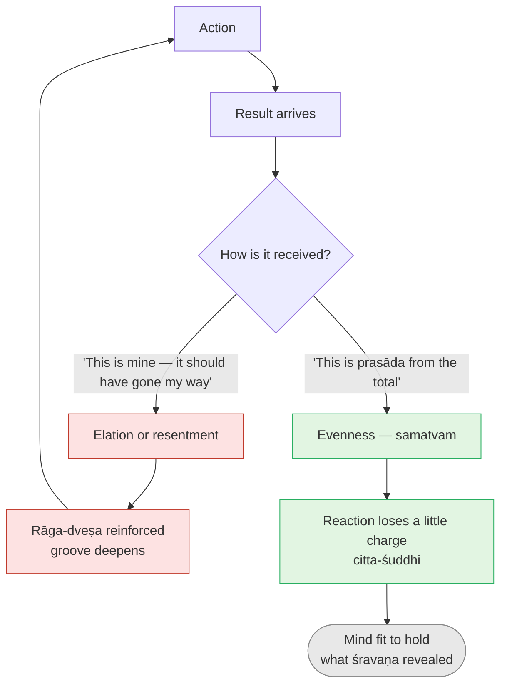

# Day 21 — Karma Yoga: Action as Offering

> **Today's one idea:** Doing your work as an offering (*Īśvara-arpaṇa-buddhi*) and taking its results as a gift from the total order (*prasāda-buddhi*) wears down likes and dislikes (*rāga-dveṣa*) — it purifies the mind for knowledge; it does not itself give knowledge.
> **Reading time:** ~35 min · **Prereqs:** [Day 3](../../01-shubheccha/days/day-03-the-four-qualifications.md), [Day 20](../../02-vicharana/days/day-20-shravana-manana-nididhyasana.md)
> **Primary source for today:** Bhagavad Gītā 2.47–2.48, 3.9, 5.10–5.11, with Shankara's commentary — Swami Gambhirananda (trans.), *Bhagavad Gītā with the Commentary of Śaṅkarācārya*, Advaita Ashrama, 1984.
> **Before you start:** Without looking — *Day 20 named three things that stand between hearing "you are Brahman" and owning it. Which obstacle does each of śravaṇa, manana and nididhyāsana remove — and which of the three is a matter of habit rather than of information?*

---

## The hook (3 min)

You have spent three weeks on the hardest ideas in the tradition. You can say why the seer is not the seen, why the world is *mithyā*, how *tat tvam asi* works by dropping incompatible attributes. Then on Monday morning your manager rewrites your proposal without asking, credits a colleague in the all-hands, and by 10:40 you are drafting the reply in your head for the fourth time.

Where did the witness go?

Day 20 predicted exactly this. Hearing removes ignorance; reflecting removes doubt; but there is a third obstacle — *viparīta-bhāvanā*, contrary habit — that neither information nor argument touches. The mind has grooves, and under pressure it runs down them.

So the tradition's next move is surprising. It does not send you to a cave. It sends you **back to work** — and changes not *what* you do there, but the attitude with which you do it and the attitude with which you receive what comes back. The Gītā is a teaching given on a battlefield, to a man who wanted to walk away from his job. Kṛṣṇa's answer was not "leave"; it was "act — differently."

---

## Building the intuition (12 min)

### The archer

An archer controls four things: which arrow, how she stands, how far she draws, when she releases. Once the arrow leaves the string she controls nothing. The wind, a bird, a twitch of the target — all of it belongs to a larger order she did not make and cannot command.

Now watch two archers. The first stands at the line already living in the result: *if I hit, I'm good; if I miss, I'm a failure.* Her hands shake. When she misses she replays it all evening; when she hits she needs to hit again tomorrow to stay "good." The second archer gives the draw her full attention and lets the arrow go *as* an arrow — her contribution, finished. When the result arrives she looks at it, learns what there is to learn, and draws again.

The second archer is not indifferent. She cares enough to give her complete skill to the part that is hers. What she has dropped is the extra demand that the part which is *not* hers should prop up her sense of self.

### The temple sweet

In Indian temples a small sweet is handed out after worship — *prasāda*, "grace." Nobody holds it up and says, *"This is too small; I asked for a bigger one."* Whatever size it is, it is received as coming from the altar. The receiving attitude is fixed before you see the sweet.

Now imagine meeting every result — the promotion that didn't come, the deal that did, the rewritten proposal — the way you meet that sweet. Not passively (you can still ask for a different outcome next time) but without the inner verdict *"this should not have happened to me."*

### Put them together

| The archer's moment | Ordinary attitude | Karma-yoga attitude | Tradition's name |
| --- | --- | --- | --- |
| Before and during the draw | "This is for *me* — my standing rides on it" | "This is my offering to the whole" | *Īśvara-arpaṇa-buddhi* — the attitude of offering |
| When the result lands | "This is good/bad *for me*" → elation or resentment | "This comes from the total order; I receive it" | *Prasāda-buddhi* — the attitude of receiving as grace |
| Afterwards | Grooves deepened: craving for the hit, aversion to the miss | Grooves not fed; reactions gradually lose charge | *Citta-śuddhi* — purification of mind |

Notice that nothing in the work itself changed. Same desk, same manager, same spreadsheet. The change is in the two hinges at either end of the action — what you put in it and what you take out of it.

---

## The formal picture (12 min)

### The four verses

**Gītā 2.47** — *karmaṇy evādhikāras te mā phaleṣu kadācana*: "Your right is to action alone, never to its fruits. Do not let the fruit be your motive; nor be attached to inaction." The archer's line, word for word. Note the last clause: this is not permission to stop acting.

**Gītā 2.48** — *yogasthaḥ kuru karmāṇi saṅgaṃ tyaktvā… siddhy-asiddhyoḥ samo bhūtvā samatvaṃ yoga ucyate*: "Established in yoga, act, giving up attachment, the same in success and failure. **Evenness (*samatvam*) is called yoga.**" Here "yoga" has nothing to do with posture. It is defined as an attitude: evenness toward results.

**Gītā 3.9** — "This world is bound by action, except action done as *yajña* (sacrifice, offering). Do your work for that sake, free from attachment." *Yajña* originally meant the Vedic fire-ritual, where one offers into the fire and receives back what the gods return. The Gītā widens it: any action done as a contribution to the whole, rather than as extraction for the self, is *yajña*. That is the root of *Īśvara-arpaṇa-buddhi*.

**Gītā 5.10** — *brahmaṇy ādhāya karmāṇi… lipyate na sa pāpena padmapatram ivāmbhasā*: "One who acts placing actions in Brahman, giving up attachment, is not stained by sin, **as a lotus leaf is not wetted by water.**" The lotus leaf sits *in* the pond. It is not dry because it avoids water; it is dry because water does not cling to it. Then **5.11** states the purpose plainly: *yoginaḥ karma kurvanti saṅgaṃ tyaktvātma-śuddhaye* — yogis act, giving up attachment, **for the purification of the mind**.

### Why "Īśvara" is the right word here

*Prasāda-buddhi* would be sentimental if it meant "a person in the sky picked this result for me." It doesn't. [(Recall Day 15)](../../02-vicharana/days/day-15-maya-and-ishvara.md): Īśvara is Brahman with *māyā* — the **total**: every law, every causal chain, every other person's free action, the whole intelligent order within which any result is produced. Your contribution is one input. The result is what the total returns.

So *prasāda-buddhi* is not wishful thinking; it is *accuracy*. The result really did come from the whole and not from you alone. Resentment ("this should not have happened") is, strictly, a refusal to accept the factual situation — as if your one input should have overridden all the others. Seeing results as *prasāda* is seeing them correctly.

### The mechanism: wearing down *rāga-dveṣa*

Gītā 3.34 says that likes and dislikes (*rāga-dveṣa*) sit in relation to every sense object, and that one should not come under their sway, "for they are one's enemies on the path." *Rāga* is pull toward; *dveṣa* is push away. Neither is the problem in itself — preferences are part of having a mind. The problem is when they **run** you: when a dislike dictates the email you send.

Every reaction you feed deepens its groove; every reaction you meet with evenness gets a little shallower. Over months, the pressure that drove your 10:40 mental email simply weakens. That is the "thinning" in *tanumānasā* — this module's stage.

### Shankara's line: prepares, does not liberate

Shankara reads the Gītā with one firm rule: **only knowledge liberates; action purifies the mind so knowledge can arise and stay.** Gītā 4.33 says all action "culminates in knowledge"; 4.38 says "there is no purifier equal to knowledge." In his introduction to the Gītā commentary and throughout chapters 3 and 5, Shankara insists karma yoga is a means to *citta-śuddhi* and thereby to fitness for knowledge — never a substitute for it.

The logic is Day 2's and Day 4's. Liberation is the end of ignorance about what is already the case ([recall the tenth man](../../01-shubheccha/days/day-04-the-tenth-man.md)). Action, however selfless, produces results; it cannot produce the knowledge "I am the tenth." What it *can* do is steady the counter — the panicking man who, calmer, can finally hear "you are the tenth" and let it land.

In telescope terms ([Day 3](../../01-shubheccha/days/day-03-the-four-qualifications.md)): karma yoga is the practical workshop where *vairāgya*, *śama* and *titikṣā* are actually built — not in theory, in Monday mornings.

### How Dayananda taught it

Swami Dayananda Saraswati, whose lineage carries much of this teaching into English, was characteristically unromantic. Karma yoga, in his presentation, is not doing charity work or doing nothing for yourself. It is **any** action, including earning a living, done with *Īśvara-arpaṇa-buddhi* and met with *prasāda-buddhi*. You may — should — want good outcomes and work hard for them. The yoga is entirely in the two attitudes. He was also clear that karma yoga presupposes some understanding of Īśvara as the total order; without that, "accept results as *prasāda*" collapses into mere stoicism or resignation.

---

## Where it breaks / what it is not (4 min)

**"Karma yoga means not caring about results."** No. The archer aims. 2.47 forbids making the fruit your *motive* in the sense of the self riding on it; it doesn't forbid wanting the arrow to hit. A surgeon who didn't care about outcomes would be a bad surgeon and a bad karma yogi.

**"*Prasāda-buddhi* means accepting injustice."** Receiving a result as given by the total means not resenting the fact that it happened. It does not mean not acting next. The rewritten proposal is *prasāda*; your calm, clear conversation with the manager tomorrow is your next offering.

**"Karma yoga is volunteering / unpaid service."** Selfless service can be karma yoga, but so can a paid job, parenting, filing taxes. The criterion is attitude, not the type of work.

**"If I do enough karma yoga I will be liberated."** Shankara's whole reading of the Gītā rejects this. Karma yoga prepares the mind; knowledge, through *śravaṇa–manana–nididhyāsana*, is what removes ignorance. A clean window doesn't make the sun.

**"It's just stoicism."** There's a real convergence with the Stoic "dichotomy of control." The difference is the frame: for the Stoic the outside is fate or Nature; here it is Īśvara — the same total that, on Day 16, turned out to be non-different in essence from you. That changes what "accepting" eventually means (see Exercise 4).

---

## Try it yourself (8 min)

### 1. Retrieval first

Close the page. From memory: (a) name the two attitudes of karma yoga and what each applies to (the action or the result); (b) state what karma yoga produces and what, according to Shankara, it does *not* produce.

Hint

The archer has two moments — the draw and the landing. And: a clean window versus the sun.

Model answer

(a) <em>Īśvara-arpaṇa-buddhi</em> — doing the action as an offering to the total (applies to the action, its motive); <em>prasāda-buddhi</em> — receiving whatever result comes as given by the total order, without resentment or elation (applies to the result). (b) It produces <em>citta-śuddhi</em>, a purified mind, by wearing down <em>rāga-dveṣa</em> (evenness, <em>samatvam</em>, Gītā 2.48). It does <strong>not</strong> produce liberation: liberation is knowledge removing ignorance (Day 4), and action can only make the mind fit for that knowledge (Gītā 4.33, 4.38; Shankara). If you also cited 2.47 ("your right is to action alone"), good.

### 2. Direct application — one working day as yajña

Choose **tomorrow's workday** (or, if you're not working, the most demanding day this week). Do three things:

1. **Before** your first significant task, say silently: *"This is my contribution to the whole. I'll give it my best."* Note any resistance — a sense of "but it's *mine*."
2. **At the first result** that lands — an email reply, a code review, a meeting outcome — pause for one breath before reacting and say: *"This came from the total order."* Then note: was there *rāga* (pull) or *dveṣa* (push), and how strong (0–5)?
3. **In the evening**, write down one reaction that was weaker than usual, and one that ran you completely.

Hint

Don't aim for a perfect day. The exercise is to make the two hinges visible. Most people find the first hinge (offering) easier than the second (receiving).

What to look for

Typical log: <em>"Offering felt artificial at first, then oddly freeing — I stopped rehearsing how the deck would make me look. Result: client asked for big changes. Dveṣa 4. The breath-pause helped: I replied with questions instead of a defence. Ran me completely: a Slack message at 6pm — I'd stopped practising by then."</em> 
Three signs it's working: (a) you notice <em>rāga-dveṣa</em> as events with a strength, rather than as "the truth about the situation"; (b) the pause occasionally changes what you do next; (c) you can see that the "should" in "this shouldn't have happened" is an extra layer added to the bare result. If none of this happened, don't conclude it doesn't work — conclude the grooves are deep, which is precisely why this is a <em>daily</em> practice.

### 3. Stretch — whose action is it? (seer and seen)

During one action tomorrow, look for the **doer**. There is a thought, "I am doing this." Is that thought itself *seen*? Then answer in writing: if the sense of doership is an object of awareness, what does that imply about who, ultimately, is "offering" the action in karma yoga — and why does karma yoga still begin with "I am offering"?

Hint

Day 6: whatever is an object of awareness cannot be that awareness. Day 7: which sheath does "I am the doer" belong to?

Worked answer

"I am doing this" appears, is noticed, and passes — so it is seen, and by Day 6 it is not the seer. It belongs to the intellect-sheath, <em>vijñānamaya</em> (Day 7), the "doer" function. The awareness in which it appears neither acts nor offers. So at the level of truth there is no offerer at all — Gītā 5.8–9 has the knower think "I do nothing at all; the senses move among their objects." Karma yoga still <em>begins</em> with "I offer" because it is a practice for a mind that still takes itself to be the doer. It works within the superimposition ([Day 12's adhyāsa](../../02-vicharana/days/day-12-adhyasa.md)) to loosen it: the offering attitude already weakens the doer's ownership ("not mine, the whole's"), and knowledge later shows there was never an owner. A ladder used from inside the house of doership to climb out of it.

### 4. Spaced callback — Days 16 and 7

(a) **Day 16:** state how *bhāga-tyāga lakṣaṇā* resolves *tat tvam asi* ("this is that Devadatta"). Then: karma yoga is a relationship between *jīva* (you, the small doer) and Īśvara (the total). At which level does this relationship live — the attributes that the equation drops, or the essence it identifies? What follows? (b) **Day 7:** which two sheaths does karma yoga work on most directly?

Hint

In "this is that Devadatta," what is thrown away — the person or the then/there, here/now?

Model answer

(a) <a href="../../02-vicharana/days/day-16-tat-tvam-asi.md">Day 16</a>: in "this is that Devadatta," the incompatible attributes (then/there vs now/here) are dropped and the person identified; in <em>tat tvam asi</em>, Īśvara's omniscience and the jīva's limited knowledge are dropped (both are upādhis) and the essence — consciousness — is identified. Karma yoga's offerer/receiver relationship lives entirely at the level of the <strong>dropped attributes</strong>: small doer, great total. That's why it is preparation, not liberation — it operates where the difference is real for practical purposes. But it points the right way: by relating to the total rather than defending the small, the mind stops clinging to exactly the attributes the equation will ask you to let go. (b) <a href="../../02-vicharana/days/day-07-the-five-sheaths.md">Day 7</a>: <em>manomaya</em> (the emotional mind, where <em>rāga-dveṣa</em> are felt) and <em>vijñānamaya</em> (the intellect, the sense "I am the doer/owner"). Both are known — neither is the knower, which is why purifying them is useful but never the goal.

**Transfer — apply it:**

> Pick one recurring work situation that reliably triggers you — a type of meeting, a particular reviewer, a metric you're judged on. Write one sentence: *the input* (the situation and your usual reaction), *what today's idea does to it* (names the action you'll offer and the result you'll receive as *prasāda*), and *the output* (the specific different response you'll try next time). If nothing comes to mind in 60 seconds, re-read the hook and try again.

---

## Connect it back

Day 20 turned the concepts into a method and named the obstacle that outlasts understanding: contrary habit. Today gave the first answer to it — and it is a humble one. Not a special meditation, but the ordinary working day, with two attitudes added at the hinges: offer the action, receive the result. These wear down the *rāga-dveṣa* that keep the mind shaking, so that what you heard can settle. Tomorrow takes the second hinge — the relationship to Īśvara — and asks what happens when it becomes love: devotion, inside a non-dual teaching.

**Sharp question:** *If Īśvara is the total and, in essence, not different from you, to whom exactly are you offering your work?*

---

## Suggested readings for today

**Required if you have 15 extra minutes:** Bhagavad Gītā **2.47–2.50** and **3.1–3.9** with Shankara's commentary (Gambhirananda, 1984). Watch how Shankara handles Arjuna's question in 3.1 ("if knowledge is superior, why urge me to action?") — his answer is the whole prepares-not-liberates position in miniature.

**If you want the deep version:**
- Swami Dayananda Saraswati, ***Bhagavad Gita Home Study Course***, the volumes covering **chapters 2–3** — the fullest modern exposition of *Īśvara-arpaṇa-buddhi* and *prasāda-buddhi*, with many workplace examples.
- Bhagavad Gītā **5.7–5.12** with Shankara (Gambhirananda) — the lotus leaf (5.10), "for purification of the self" (5.11), and the knower who sees "I do nothing" (5.8–9); the bridge from karma yoga to Day 23's question.
- Swami Vivekananda, ***Karma Yoga*** (*Complete Works*, Vol. 1), ch. 3, **"The Secret of Work"** — a rhetorical, modern restatement of 2.47 for a Western audience.

---

## Navigation

← **Previous:** [Day 20 — Hearing, Reflecting, Dwelling](../../02-vicharana/days/day-20-shravana-manana-nididhyasana.md)
→ **Next:** [Day 22 — Bhakti Inside Advaita](./day-22-bhakti-inside-advaita.md)
