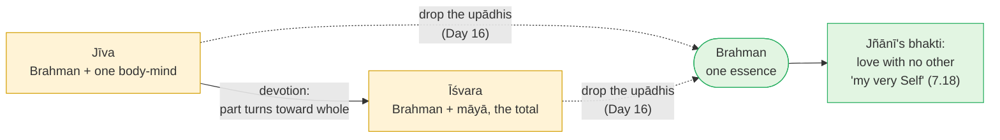

# Day 22 — Bhakti Inside Advaita

> **Today's one idea:** Devotion to Īśvara — the total — purifies the mind like nothing else, and in the knower it does not disappear but matures: the highest devotee is the one who sees no difference from what they love (Gītā 7.17–18).
> **Reading time:** ~35 min · **Prereqs:** [Day 15](../../02-vicharana/days/day-15-maya-and-ishvara.md), [Day 21](./day-21-karma-yoga.md)
> **Primary source for today:** Bhagavad Gītā 7.16–7.19, with Shankara's commentary and Madhusūdana Sarasvatī's *Gūḍhārtha-dīpikā* — Swami Gambhirananda (trans.), Advaita Ashrama, 1984 and 1998.
> **Before you start:** Without looking — *Day 21's karma yoga rests on two attitudes at the two hinges of an action. Name them, and say why "Īśvara" in prasāda-buddhi means the total order, not a person handing out results.*

---

## The hook (3 min)

There is a verse the tradition puts in the mouth of Hanumān, the monkey-devotee of the *Rāmāyaṇa*, when Rāma asks him how he regards him. It is not in Vālmīki's text; it is a verse traditionally attributed to Hanumān (देहबुद्ध्या तु दासोऽहम्…), cited from late anthologies and devotional works whose exact source is disputed, and repeated by teachers for centuries. Paraphrased:

> *When I take myself to be the body, I am your servant. When I take myself to be the individual soul, I am a part of you. When I know myself as the Self, I am you.*

Three answers, and none of them is wrong. The same love runs through all three; only the understanding of "I" changes. The servant does not stop loving when he becomes "a part"; the part does not stop loving when it sees it is the whole.

You came to this course with a Buddhist background and an Advaita reading list. You may have filed devotion under "dualistic stuff for beginners" — prayers to a God who, Advaita says, isn't ultimately separate. Hanumān's three lines suggest something more interesting: that devotion is not a stage you leave behind, but something that keeps the same shape as your understanding deepens, until it becomes indistinguishable from knowledge.

---

## Building the intuition (12 min)

### The wave that loves the ocean

Imagine a wave that becomes aware of the ocean. At first the ocean is vast, other, overwhelming — the wave feels small and wants the ocean's protection (*please don't let me crash*). Later it wants things from the ocean — a bigger crest, a longer run. Later still it becomes curious: *what is this ocean, and what am I in relation to it?* And finally it notices what it is made of.

Notice what does **not** happen at that last step. The wave does not conclude "there is no ocean, so love was a mistake." It sees that what it loved was what it always was. The love isn't refuted; its *object* turns out to be its *own nature*. Love that was reaching *toward* becomes love that is simply *being*.

Ramakrishna told a parable of a salt doll that went to measure the depth of the ocean. It waded in, and dissolved; there was no one left to come back and report the depth. That is the same wave, told from the end.

### Why devotion purifies so fast

Yesterday's karma yoga had two hinges: offering the action, receiving the result. Both were attitudes toward **the total**. Bhakti is what happens when that attitude stops being a discipline and becomes a *relationship* — when you offer not because you've been told to, but because you love what you're offering to.

Love does something no technique does. It moves the centre of gravity out of the small self *without effort*. Every parent knows this: the 3 a.m. feed is not experienced as self-sacrifice requiring willpower; the self that would object simply isn't the main character any more. Devotion does this toward the whole. It is the most efficient eroder of *rāga-dveṣa* there is, because the *rāga* has been redirected toward the one object that doesn't bind.

| Stage of the wave | What it wants from the ocean | Gītā 7.16 name |
| --- | --- | --- |
| Frightened, small | Rescue from distress | *Ārta* — the distressed |
| Ambitious | Things — a bigger crest | *Arthārthī* — seeker of gain |
| Curious | To understand what the ocean is | *Jijñāsu* — seeker of knowledge |
| Awake | Nothing — it sees it is water | *Jñānī* — the knower |

---

## The formal picture (12 min)

### The four devotees — Gītā 7.16–7.19

**7.16:** "Four kinds of virtuous people worship me, Arjuna: the distressed (*ārta*), the seeker of knowledge (*jijñāsu*), the seeker of wealth (*arthārthī*), and the knower (*jñānī*)."

**7.17:** "Of these the knower, ever steadfast, devoted to the One (*eka-bhakti*), excels. For I am exceedingly dear to the knower, and he is dear to me."

**7.18:** *udārāḥ sarva evaite jñānī tv ātmaiva me matam* — "All these are noble, **but the knower I regard as my very Self.**"

**7.19:** "At the end of many births the knower takes refuge in me, seeing 'Vāsudeva is all' — such a great soul is very rare."

Three details carry the whole Advaita reading:

1. **"All these are noble" (7.18).** The Gītā does not sneer at the devotee who prays for rescue or for wealth. Turning toward the total at all — even for gain — is already turning away from the isolated ego. The tradition's generosity here matches its generosity toward *preyas* on [Day 2](../../01-shubheccha/days/day-02-nachiketas-choice.md): finite, not evil.
2. ***Eka-bhakti* — devotion to the One.** Shankara glosses this, roughly, as: the knower's devotion is single because he finds no other to be devoted to. Not "one deity rather than many" — rather, nothing *other* at all.
3. **"My very Self" (*ātmaiva*).** Kṛṣṇa, speaking as Īśvara, does not say the knower is his best servant. He says the knower *is* him. This is *tat tvam asi* ([Day 16](../../02-vicharana/days/day-16-tat-tvam-asi.md)) stated from the other side of the equation.

### Why this is coherent inside non-duality

The objection writes itself: *Advaita says there is only Brahman. Devotion needs two — a lover and a beloved. So devotion must be a concession to the confused.*

The answer comes from [Day 15](../../02-vicharana/days/day-15-maya-and-ishvara.md). Īśvara is not a second being alongside Brahman. Īśvara is Brahman **as the total** — Brahman considered with *māyā*, the intelligent cause and the whole order of the appearance. The jīva is Brahman considered with one body-mind. So the devotional relationship is a relationship between **the part-as-appearing and the whole-as-appearing**. Both are *mithyā* ([Day 13](../../02-vicharana/days/day-13-mithya.md)) — empirically real, not ultimately separate.

Map that against the course's machinery:

At the level of upādhis (the amber boxes), there really are two, and devotion is the most fitting relationship the small can have with the total — exactly because the total *is* greater, wiser, the source of all results. At the level of essence (green), there is one, and devotion does not vanish: it becomes the jñānī's *eka-bhakti*, love that has no other. That is Hanumān's three lines in a diagram.

### Madhusūdana Sarasvatī's synthesis

Madhusūdana Sarasvatī (sixteenth century) is a test case that kills the "Advaitins can't really be devotees" assumption. He wrote the *Advaita-siddhi*, one of the most rigorous logical defences of non-duality ever composed — and, alongside it, the *Bhakti-rasāyana*, a treatise on devotion as the highest aesthetic experience, and the *Gūḍhārtha-dīpikā* on the Gītā, in which devotion to Kṛṣṇa saturates a strictly Advaitic reading.

Two features of the *Gūḍhārtha-dīpikā* matter for us:

- **The three sixes.** In his introduction Madhusūdana reads the Gītā's eighteen chapters as three groups of six, parallel to the Veda's three sections: chapters 1–6 centred on action (*karma*), 7–12 on devotion/worship (*bhakti*, *upāsanā*), 13–18 on knowledge (*jñāna*). This course's Days 21–23 follow the same order — and Madhusūdana places devotion in the *middle*, as the bridge from purified action to knowledge.
- **Devotion before and after knowledge.** Before knowledge, bhakti purifies and steadies the mind — doing yesterday's work more powerfully. After knowledge, it remains as the natural expression of the knower: the *jñānī* of 7.17. A much-quoted verse of Madhusūdana's, which also appears in the *Gūḍhārtha-dīpikā*, ends कृष्णात्परं किमपि तत्त्वमहं न जाने — "I know no reality higher than Kṛṣṇa" — from the author of the *Advaita-siddhi*, this is not a retreat from non-duality but a non-dualist's love for the form in which he recognised it.

### Vivekananda's harmony of yogas

Swami Vivekananda, who brought Advaita to Western audiences in the 1890s, wrote separate books on *Karma Yoga*, *Bhakti Yoga*, *Rāja Yoga* and *Jñāna Yoga*, and presented them as four approaches suited to four temperaments — the active, the emotional, the meditative, the philosophical — which can and should be combined. Read through this course's lens, the four are not rivals for the same job: action and devotion thin the mind (*tanumānasā*), meditation steadies it (tomorrow), and knowledge removes ignorance. The *convergence* is that each, carried far enough, removes the same thing — the small self's claim to be a separate owner.

> **Convergence — Sufi & Bhakti voices**
>
> Madhusūdana is not alone. Jñāneśvar, the thirteenth-century Marathi saint who wrote the *Jñāneśvarī* on the Gītā, ends his *Amṛtānubhava* with "natural devotion": in paraphrase, as a temple, its deity and its worshipper can all be carved from one rock, so devotion goes on within non-duality (ch. 9; Bahirat, *The Philosophy of Jñānadeva*). His Vārkarī heir Tukārām sings in the same key, and Lal Ded of Kashmir — revered by Hindus as Lalleshwari and by Kashmiri Muslims as Lalla ʿĀrifa, "Lalla the knower" — sings a Śiva sought outside and found as her own Self (Hoskote, *I, Lalla*). This is the *jñānī*'s *eka-bhakti* of 7.17, in village song.
>
> The honest counterpoint comes from Ramakrishna himself, the teller of the salt doll: echoing the poet Rāmprasād, he said in paraphrase, *I want to taste sugar, not to become sugar* (Nikhilananda, *The Gospel of Sri Ramakrishna*) **[VERIFY: exact wording and page]**. Much bhakti — Mīrābāī's longing for Kṛṣṇa among it — wants the relation kept.
>
> *Where they differ:* Rāmānuja's and Caitanya's traditions reject Advaita's identity outright, holding the self eternally distinct within or beside God, so for them the loving relation is the goal rather than a stage that matures into non-difference.

---

## Where it breaks / what it is not (4 min)

**"Bhakti in Advaita is pretend — a teaching device for the simple."** Madhusūdana disproves this as a historical claim, and 7.17–18 disproves it as a textual one: the *knower* is called the best devotee. What is true is that the *understanding* of devotion changes — from love of another to love with no other.

**"Īśvara is *mithyā*, so worship is worship of an illusion."** Day 13 closed this trap: *mithyā* is not "unreal." Īśvara is as real as the world you live in — and is, in essence, Brahman. Worshipping the total is no more an illusion than working for your employer; and what you worship, stripped of upādhis, is your own Self.

**"Devotion is just emotion."** It involves feeling, but its function is cognitive: it shifts the centre of identity away from the defended self. A purely emotional devotion that inflates the ego ("I am the great devotee") has missed its own point.

**"Then pick a deity and you're done."** Devotion purifies and prepares; liberation is still knowledge. Gītā 18.55 says it precisely: "by devotion he *knows* me as I am" — devotion ends in knowing.

**Buddhist cross-reference.** Mahāyāna has its own devotional streams (Pure Land; devotion to bodhisattvas). Convergence: devotion as a way of decentring the self. The difference is one of entry point — Advaita's devotion is to the total that turns out to be one's own essence.

---

## Try it yourself (8 min)

### 1. Retrieval first

Close the page. From memory: (a) list the four devotees of Gītā 7.16; (b) say what 7.18 calls the knower; (c) in two sentences, explain why devotion to Īśvara does not contradict non-duality.

Hint

The wave's four stages. And Day 15: what is Īśvara?

Model answer

(a) <em>Ārta</em> (distressed), <em>jijñāsu</em> (seeker of knowledge), <em>arthārthī</em> (seeker of gain), <em>jñānī</em> (knower). (b) "My very Self" — <em>ātmaiva me matam</em>; all four are noble, but the knower is Īśvara's own Self. (c) Īśvara is Brahman as the total (with <em>māyā</em>) and the jīva is Brahman with one body-mind; devotion is the fitting relationship between them at the level of upādhis, where the difference is empirically real. At the level of essence there is one, and devotion matures into the knower's love with no other (<em>eka-bhakti</em>) rather than being refuted.

### 2. Direct application — a week of one devotional act

For seven days, choose **one** small daily act of devotion directed at the total — not at a picture of a god unless that is natural for you. Options: before eating, a silent "this comes from the whole"; at the end of the day, three things you received that you did not earn alone; a few minutes of chanting or listening to devotional music. **Log each day:** did it soften one *rāga* or *dveṣa* that day? Which one?

Hint

Choose something you'll actually do. A Buddhist-trained reader may find gratitude practice (cf. <em>mettā</em>) the most natural door.

What to look for

Most people notice (a) that gratitude toward the total makes it harder to sustain resentment toward a part of it — you can't fully thank the whole and fully curse your colleague at the same time; (b) a subtle shift in "who is the main character" during the act. If the act starts to feel like an achievement ("I did my devotion"), notice that: the ego has quietly taken the offering back. That noticing is itself the practice working.

### 3. Stretch — whose love? (seer and seen)

During your devotional act, turn the attention once: **the feeling of love or gratitude is itself appearing.** Is it seen? Then: the awareness in which the devotion appears — is it the devotee? Write three sentences on how Hanumān's three lines map onto what you just looked at.

Hint

Day 6: whatever is lit is not the light. Body → servant; individual → part; Self → ?

Worked answer

The warmth of devotion is an object — it arises, has intensity, fades — so it is seen, a modification of <em>manomaya</em>. The one who feels "I am the devotee" is also an appearing thought. The awareness in which both appear is neither devotee nor deity; it is what both are lit by. Mapping: identified with the body, I am a servant (the feeling of devotion toward something great); identified with the jīva, I am a part (the sense of relation); recognising myself as the awareness, "I am you" — not because the feeling has been abolished, but because what the devotion was aimed at is what was seeing it all along. That last line is the jñānī of 7.18, glimpsed.

### 4. Spaced callback — Days 17 and 8

(a) **Day 17:** state the method of *neti neti* and why it is needed (one sentence each). Then compare: *neti neti* removes "what I am not" by negation; devotion removes the separate self by surrender. What is the same target of both? (b) **Day 8:** in deep sleep, is there a devotee and a deity? What does that show about the status of the devotee/deity distinction, and about what remains?

Hint

For (a): what is the one thing both methods refuse to leave standing? For (b): recall what was present in deep sleep and what was absent.

Model answer

(a) <a href="../../02-vicharana/days/day-17-neti-neti.md">Day 17</a>: the knower cannot be made an object, so one negates every object one takes oneself to be ("not this, not this," Bṛh. 2.3.6) until only the un-negatable remains; it's needed because any positive description would make the Self an object. Same target: both dismantle the separate owner — <em>neti neti</em> by seeing "this is not me," bhakti by giving "this is not mine." One is the intellect's door, the other the heart's; they converge on the same absence. (b) <a href="../../02-vicharana/days/day-08-three-states-one-witness.md">Day 8</a>: in deep sleep there is neither devotee nor deity as experienced objects — the whole subject–object structure has resolved — yet you existed (you wake and say "I slept"). So the devotee/deity distinction belongs to the waking (and dream) appearance; it comes and goes. What remains through all three states is the witness — the very Self the Gītā calls the knower's identity with Īśvara.

**Transfer — apply it:**

> Name one relationship or commitment in your life where you already give yourself without calculation — a child, a craft, a cause, a friend. Write one sentence: *the input* (that relationship), *what today's idea does to it* (sees it as a small-scale model of devotion — the centre of gravity moving out of the defended self), and *the output* (one way to widen that same attitude toward the total this week). If nothing comes to mind in 60 seconds, re-read the hook and try again.

---

## Connect it back

Yesterday's karma yoga related the small doer to the total through two attitudes. Today showed what happens when that relationship becomes love: the purification accelerates, because love moves the centre of gravity without effort — and the relationship survives into knowledge, where the Gītā calls the knower Īśvara's very Self. Day 15's Īśvara is what keeps this coherent: devotion is the part turning toward the whole, both of which are, in essence, one. Tomorrow draws the sharpest line in this module — between meditation, which you can do, and knowledge, which you cannot "do" at all.

**Sharp question:** *If devotion matures into seeing non-difference, what is the difference between the jñānī's love and simply knowing?*

---

## Suggested readings for today

**Required if you have 15 extra minutes:** Bhagavad Gītā **7.16–7.19** with Shankara's commentary (Gambhirananda, 1984). Read slowly what Shankara says about *eka-bhakti* and *ātmaiva* — notice how he refuses to make the jñānī's devotion a lesser thing than the devotee's.

**If you want the deep version:**
- Madhusūdana Sarasvatī, ***Gūḍhārtha-dīpikā***, the **introduction** and comments on **7.16–7.18** (Gambhirananda trans., 1998) — the three-sixes structure and the Advaitin's devotion at full strength.
- Bhagavad Gītā **12.13–12.20** with Shankara — the qualities of the devotee "dear to me" (*adveṣṭā sarva-bhūtānām*, "without hatred for any being"); compare with Day 21's evenness and you'll see bhakti and karma yoga produce the same mind.
- Swami Vivekananda, ***Bhakti-Yoga*** (*Complete Works*, Vol. 3) — the modern statement of devotion maturing into non-dual love; read it with the companion text in the same volume, *Para-Bhakti or Supreme Devotion*.
- Ranjit Hoskote (trans.), *I, Lalla: The Poems of Lal Dĕd*, Penguin Classics, 2011, **the translator's introduction** — how one fourteenth-century Kashmiri woman's non-dual devotion came to be claimed by both Hindu and Muslim Kashmir.

---

## Navigation

← **Previous:** [Day 21 — Karma Yoga](./day-21-karma-yoga.md)
→ **Next:** [Day 23 — Meditation vs Knowledge](./day-23-meditation-vs-knowledge.md)
