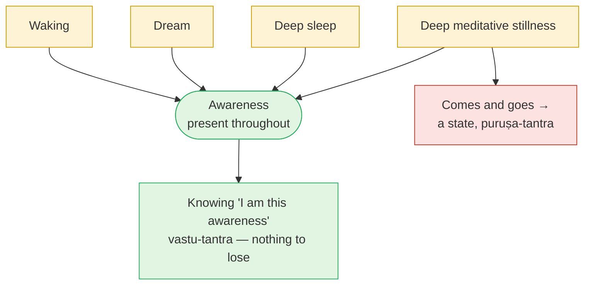

# Day 23 — Meditation vs Knowledge

> **Today's one idea:** Meditation is something you *do*, so it depends on you (*puruṣa-tantra*); knowledge depends only on what is there (*vastu-tantra*) — so meditation can steady the mind superbly, but only knowledge of what is already the case liberates.
> **Reading time:** ~35 min · **Prereqs:** [Day 4](../../01-shubheccha/days/day-04-the-tenth-man.md), [Day 20](../../02-vicharana/days/day-20-shravana-manana-nididhyasana.md)
> **Primary source for today:** Shankara, *Brahma-Sūtra-Bhāṣya* 1.1.4 — Swami Gambhirananda (trans.), Advaita Ashrama, 1965; and Bhagavad Gītā ch. 6 (Gambhirananda, 1984).
> **Before you start:** Without looking — *Day 22 called the knower Īśvara's "very Self." Which Gītā verse says so, and why does devotion, in Advaita, mature rather than disappear once non-difference is seen?*

---

## The hook (3 min)

A friend comes back from a ten-day silent retreat. On day seven, she tells you, something opened. Thought stopped. There was no one sitting — just vast, luminous stillness, and a certainty that this was what she *is*. She cried. She has never been so sure of anything.

Three weeks later, back at work, she says quietly: *"I've lost it."*

Hold onto that sentence. Everything today turns on it.

You've met this already. On [Day 2](../../01-shubheccha/days/day-02-nachiketas-choice.md), the stretch exercise asked whether Nachiketas should accept a blissful, thought-free state lasting ten thousand years in exchange for not asking about the Self. The answer was no: a state that begins, ends — it is *preyas*, however refined. Your friend's opening lasted an afternoon rather than ten thousand years. The logic is the same, and it is not an insult to her experience. It is a question about what kind of thing she lost — and whether the thing the Upaniṣads point to is the kind of thing that *can* be lost.

---

## Building the intuition (12 min)

### Two things you cannot and can do

Try this now. **Imagine a blue triangle.** Done? Now imagine it red. Now don't imagine it at all. Easy — you can do it, not do it, or do it differently. It's up to you.

Now look at the nearest wall. **See it as not there.** Not "imagine it gone" — actually *know* there is no wall. You can't. Whether there is a wall is not up to you. You can close your eyes, think of something else, even meditate on the wall being absent; when you open your eyes and look, the knowledge "wall" arises on its own, governed entirely by the wall.

That is the whole of today in two experiments:

| | Imagining / meditating | Knowing |
| --- | --- | --- |
| Depends on | You — your will, effort, skill | The thing itself |
| Can you do it, not do it, do it otherwise? | Yes | No — it is either correct or mistaken |
| When it stops | The result stops | Knowledge doesn't need maintaining; it stays known |
| Sanskrit | *Puruṣa-tantra* — depends on the person | *Vastu-tantra* — depends on the object |

### The lake and the moon

A full moon shines over a lake. When wind ruffles the water, the moon's reflection breaks into a thousand glittering pieces; you can't make out its shape. When the wind drops, the reflection becomes clear and whole.

Meditation is the wind dropping. It is genuinely valuable: in a still mind, things become clear that were invisible in a choppy one. But two things are true:

- **The stillness does not make the moon.** The moon was there in full the whole time.
- **The stillness is itself a condition of the water.** It comes and goes with the weather. If you think the stillness *is* the moon, then every gust of wind is a catastrophe — "I've lost it."

Your friend's retreat produced extraordinary stillness, and in it she glimpsed something. What she lost was the stillness. Whether she lost what she glimpsed depends on what she glimpsed — and that is a question of knowledge, not of weather.

---

## The formal picture (12 min)

### Shankara, BSBh 1.1.4 — the key distinction

In his commentary on *Brahma-Sūtra* 1.1.4, Shankara addresses a rival claim: that the Upaniṣads don't simply *tell* you about Brahman, they *command* you to meditate on it, so that liberation is the result of an action called meditation. His reply is the most important single argument for this module.

**Action, including mental action like meditation (*upāsanā*), is *puruṣa-tantra*.** It can be done, not done, or done otherwise (कर्तुमकर्तुमन्यथा वा कर्तुं शक्यम्). The scriptures can enjoin it: "meditate on X as Y." Its results, like all results of action, are produced — and what is produced, ends (Day 2's rule).

**Knowledge is *vastu-tantra*.** It depends on the object and the means of knowledge, not on anyone's will. No one can be commanded to know a fire as cold. When a valid means of knowledge meets its object, knowledge simply arises — or, if blocked, fails to.

Then the decisive step: **liberation is not a result to be produced, because Brahman is already what you are.** If liberation were produced by meditation, it would be impermanent; what is impermanent isn't liberation. So liberation can only be the removal of ignorance about what already is — which is the job of knowledge, not action. This is [Day 4's tenth man](../../01-shubheccha/days/day-04-the-tenth-man.md) in technical dress: no amount of concentrating makes the counter the tenth; one correct sentence, rightly heard, reveals that he always was.

### Upāsanā vs nididhyāsana

This raises an obvious question: isn't [Day 20's *nididhyāsana*](../../02-vicharana/days/day-20-shravana-manana-nididhyasana.md) — "dwelling" on the teaching — just meditation by another name?

| | *Upāsanā* (meditation / worship) | *Nididhyāsana* (contemplative dwelling) |
| --- | --- | --- |
| Content | "Treat X as Y" — e.g. regard the sun as Brahman, the mind as Brahman | What has already been known through *śravaṇa* and confirmed by *manana*: "I am the awareness" |
| Truth status | Superimposition by choice — useful, deliberate, *puruṣa-tantra* | Dwelling on a fact — *vastu-tantra* in content |
| Aim | A result: purity, focus, a higher state or world | Removing *viparīta-bhāvanā* — the contrary habit |
| Ends when | You stop | The habit no longer contradicts the knowledge |

So the line is not "sitting still vs not sitting still." You may sit still for both. The line is: **are you trying to produce something, or are you letting the mind settle into what is already true?**

### Gītā chapter 6 — meditation as steadying

The Gītā is not anti-meditation. Its whole sixth chapter, *Dhyāna Yoga*, gives instructions: a clean, steady seat (6.11), body, head and neck held erect, gaze steady (6.13), the mind gathered on the Self (6.10, 6.25). Verse 6.25 is the heart of it: "gradually, gradually, let him withdraw, with an intellect held by steadiness; making the mind abide in the Self, let him think of nothing else." Verse 6.26: "wherever the restless mind wanders, from there bring it back." And when Arjuna objects that the mind is as hard to control as the wind (6.34), Kṛṣṇa agrees, and gives the two-part answer: practice (*abhyāsa*) and dispassion (*vairāgya*) (6.35).

Read with Shankara, chapter 6 is about making the mind *fit* — the steady telescope mount of [Day 3](../../01-shubheccha/days/day-03-the-four-qualifications.md). It is preparation for, and a field for, knowledge.

### Shankara and yoga-samādhi

Michael Comans, in *The Method of Early Advaita Vedānta* (and in "The Question of the Importance of *Samādhi* in Modern and Classical Advaita Vedānta," *Philosophy East and West* 43.1, 1993, pp. 19–38), examines how often Shankara actually makes a yogic thought-free absorption (*nirvikalpa samādhi*) a requirement for liberation. His conclusion: hardly at all. Shankara refutes the dualist metaphysics of the Yoga school (BSBh 2.1.3: एतेन योगः प्रत्युक्तः, "by this, the Yoga [system] is refuted") while accepting its practices as aids where they don't contradict the Upaniṣads. For Shankara, the decisive event is knowledge arising from the teaching in a prepared mind — not the attainment of a special state. Later Advaita texts and many modern teachers give *samādhi* a much larger role; Comans's work is the clearest map of that shift. (Convergence note: both camps agree that the mind must be quiet enough for the teaching to land. They differ on how much quiet, and of what kind — a difference of emphasis, not of goal.)

### Why a state that comes and goes is not liberation

Put [Day 8](../../02-vicharana/days/day-08-three-states-one-witness.md) next to BSBh 1.1.4:

A meditative absorption is one more state, alongside waking, dream and sleep. It is lit by the same awareness. If you take *the state* to be the Self, you've made a seen thing into the seer — the precise error of [Day 12](../../02-vicharana/days/day-12-adhyasa.md), just in a very refined costume. If you recognise *that in which the state appeared* as yourself, nothing was lost when the state ended — because that is also what is reading this sentence.

### A respectful convergence with the Buddhist path

You will know the Theravāda pairing of *samatha* (calm) and *vipassanā* (insight). The structure is strikingly parallel. In the *Ariyapariyesanā Sutta* (Majjhima Nikāya 26), the Bodhisatta masters the meditative attainments taught by Āḷāra Kālāma and Uddaka Rāmaputta — the "base of nothingness" and the "base of neither-perception-nor-non-perception" — and leaves both teachers because these states, however exalted, did not lead to awakening. Throughout the tradition, calm is a superb support; it is *insight* — a seeing — that liberates.

That is BSBh 1.1.4 in another language: absorption is *puruṣa-tantra*; liberation hinges on seeing what is so. The traditions differ on *what* insight sees (no-self vs the Self as awareness) — a difference of entry point that this course will meet again — but on the relation between calm and seeing they converge almost exactly.

---

## Where it breaks / what it is not (4 min)

**"So meditation is useless for Advaita."** The opposite. Shankara's own Gītā commentary treats chapter 6 as essential preparation; Vidyāraṇya's *Pañcadaśī* ch. 9 (*Dhyāna-dīpa*) gives meditation a whole chapter. It steadies the instrument and is the natural field for *nididhyāsana*. It just doesn't *produce* the Self.

**"Knowledge means intellectual knowledge — an idea."** Day 4 already ruled this out: the tenth man's knowledge was immediate (*aparokṣa*), not a theory about someone missing. Knowledge here means recognising what is directly present, by means of the teaching.

**"My meditation experience was real, so it must be it."** It was real — as an experience. The question is not whether it happened but what it was. Experiences of vastness, light and stillness are among the most valuable things a human mind can have. They are seen.

**"If knowledge is *vastu-tantra*, why can't I just know it now?"** Because a fact being available doesn't mean the instrument is ready (Day 3), or that doubt and habit are cleared (Day 20). The *knowledge* depends on the object; the *readiness* to receive it depends on you. That's where meditation earns its place.

**"The one who meditates becomes Brahman."** Nothing becomes Brahman. Whatever *becomes* is a product. The Upaniṣads say *you are*; they never say *you will become*.

---

## Try it yourself (8 min)

### 1. Retrieval first

Close the page. From memory: (a) define *puruṣa-tantra* and *vastu-tantra* with one everyday example each; (b) give Shankara's argument (BSBh 1.1.4) in three steps for why meditation cannot produce liberation.

Hint

Blue triangle; wall. Then: produced → ? → so liberation must be ?

Model answer

(a) <em>Puruṣa-tantra</em>: depends on the doer's will — can be done, not done, or done otherwise (imagining a triangle red or blue; meditating on the sun as Brahman). <em>Vastu-tantra</em>: depends on the object — knowledge arises when a valid means meets its object, regardless of will (seeing the wall; knowing fire is hot). (b) (1) Meditation is an action, so its results are produced. (2) What is produced is impermanent; an impermanent result cannot be liberation. (3) Brahman is already what you are; so liberation can only be the removal of ignorance — the work of knowledge, which is <em>vastu-tantra</em>. Meditation prepares the mind for this knowledge but cannot replace it.

### 2. Direct application — sit, and watch the stillness

In your next meditation session (any method you already practise is fine), do this in the last five minutes:

1. Let the mind settle as it usually does.
2. When some quietness is present, **notice the quietness as an object** — it has a quality, a depth, an edge.
3. Ask, without answering in words: *what is this quietness appearing to?*
4. Let a thought arise deliberately ("tree"). Notice: did the *awareness* change when the quietness was disturbed — or only the quietness?
5. Afterwards, write two lines on what changed and what didn't.

Hint

Don't chase a special state for step 3. You are looking at something extremely ordinary: that the quietness is known.

What to look for

Most people find: the quietness is clearly seen (step 2 is easy once pointed out); the thought "tree" disturbs the quietness but the knowing of the disturbance is as present as the knowing of the quiet was. That is the whole lesson of the lake and the moon, done live. If you found yourself trying to get back the quietness after step 4, you caught the "I've lost it" reflex in miniature — the instinct to treat a state as the Self. If the session was noisy and step 2 never came, use the noise instead: noise is equally an object, equally known.

### 3. Stretch — answer your friend

Write a short, kind reply (100–150 words) to the friend in the hook who says "I've lost it." Use *puruṣa-tantra / vastu-tantra* and the seer–seen distinction without technical vocabulary. Don't dismiss her experience.

Hint

Separate three things: the stillness (a state), what she glimpsed in it, and what was aware of both the stillness and its ending.

Worked answer

<em>"What you had on day seven sounds precious, and I wouldn't call it nothing. But notice what's gone: the stillness — a condition of your mind, like calm weather. Stillness comes and goes; that's its nature, and no retreat can make it stay. What were you, though, when it was there? Something was aware of the stillness. Something is aware, right now, of its absence and of missing it. That hasn't gone anywhere. Maybe what you glimpsed wasn't the stillness but what the stillness let you notice — and that doesn't depend on weather. The retreat cleaned the window. The light was never the window's."</em> 
Check yours for: respect for the experience; the state named as a state; attention turned to what knows both its presence and absence; no promise that she'll "get it back."

### 4. Spaced callback — Days 18 and 8

(a) **Day 18:** state Gauḍapāda's *ajāti* in one sentence, quoting the idea of Kārikā 2.32. Then: if, from the highest standpoint, there was never bondage and never liberation, what does that do to the idea that meditation *produces* liberation? (b) **Day 8:** why is deep sleep not liberation, even though it is peaceful and free of the ego? Apply the same reasoning to deep meditative absorption.

Hint

(a) Can you produce the end of something that never began? (b) What returns on waking?

Model answer

(a) <a href="../../02-vicharana/days/day-18-ajativada.md">Day 18</a>: from the highest standpoint nothing was ever born — Kārikā 2.32: there is no dissolution, no origination, no one bound, no seeker, no one liberated; this is the ultimate truth. If bondage never truly occurred, liberation cannot be an event that a practice brings about; it can only be the recognition that nothing needed changing. That is <em>vastu-tantra</em> at its most radical. Meditation operates within the appearance (useful there) but cannot produce the end of what never began. (b) <a href="../../02-vicharana/days/day-08-three-states-one-witness.md">Day 8</a>: deep sleep is peaceful because the subject–object split is absent, but ignorance is only dormant — on waking, "I am this body, I lack" returns intact, because nothing was <em>known</em>. A thought-free absorption is the same: ignorance is quiet, not removed. When the state ends, the old identity returns unless, in or around it, knowledge has done its work. The witness of sleep, dream, waking and absorption is what knowledge reveals — the same in all four.

**Transfer — apply it:**

> Name one practice you currently do — meditation, journaling, breathwork, a retreat you're planning. Write one sentence: *the input* (the practice and what you hope it delivers), *what today's idea does to it* (sorts its benefits into steadying the instrument vs knowing what is already so), and *the output* (how you'll practise it differently — e.g. ending each session by noticing what knows the state). If nothing comes to mind in 60 seconds, re-read the hook and try again.

---

## Connect it back

Days 21 and 22 gave two ways to thin the mind — offering action and loving the total. Today drew the line that keeps all of this module honest: whatever you *do*, including the deepest meditation, is *puruṣa-tantra* and produces states that come and go; liberation is *vastu-tantra* — knowing what was always the case, which cannot be lost because it was never produced. Meditation steadies the instrument and gives *nididhyāsana* its field. Tomorrow asks why, if knowledge is what liberates, Vidyāraṇya insists it must grow together with two other practices — and returns to the self-audit you wrote on Day 3.

**Sharp question:** *If knowledge cannot be lost, why do people who clearly understood the teaching still get dragged back into old reactions?*

---

## Suggested readings for today

**Required if you have 15 extra minutes:** Shankara's *Brahma-Sūtra-Bhāṣya* **1.1.4** (Gambhirananda, 1965) — read the passage distinguishing knowledge from injunctions to meditate, including the phrase "can be done, not done, or done otherwise." It is one of the most cited passages in all of Advaita, and it is short.

**If you want the deep version:**
- Michael Comans, *The Method of Early Advaita Vedānta* (2000), **the three chapters on Shankara** **[VERIFY: exact chapter that treats yoga / samādhi — not confirmed from an online table of contents]** — the clearest scholarly account of how much (and how little) Shankara relies on meditative absorption. If you can't get the book, his 1993 *Philosophy East and West* article (above) makes the same case in twenty pages.
- Bhagavad Gītā **6.10–6.35** with Shankara (Gambhirananda, 1984) — the practical meditation instructions and the *abhyāsa–vairāgya* answer to the wind-like mind.
- *Majjhima Nikāya* 26, ***Ariyapariyesanā Sutta*** ("The Noble Search"), in Bhikkhu Ñāṇamoli & Bhikkhu Bodhi (trans.), *The Middle Length Discourses of the Buddha* (Wisdom, 1995) — the Bodhisatta leaving the formless attainments; read alongside BSBh 1.1.4 for the convergence.

---

## Navigation

← **Previous:** [Day 22 — Bhakti Inside Advaita](./day-22-bhakti-inside-advaita.md)
→ **Next:** [Day 24 — Vāsanās and the Three Practices](./day-24-vasanas-three-practices.md)
