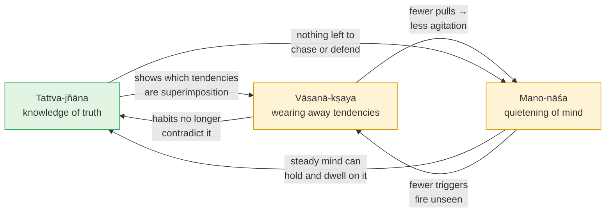

# Day 24 — Vāsanās and the Three Practices

> **Today's one idea:** Knowledge of the truth (*tattva-jñāna*), the quietening of the mind (*mano-nāśa*) and the wearing-away of latent tendencies (*vāsanā-kṣaya*) depend on one another, so they must be practised together — any one alone stalls.
> **Reading time:** ~35 min · **Prereqs:** [Day 21](./day-21-karma-yoga.md), [Day 23](./day-23-meditation-vs-knowledge.md)
> **Primary source for today:** Vidyāraṇya, *Jīvanmukti-viveka* — Swami Moksadananda (trans.), Advaita Ashrama.
> **Before you start:** Without looking — *Day 23 split everything into puruṣa-tantra and vastu-tantra. Which side is meditation on, which side is knowledge, and why does that make a meditative state that comes and goes not liberation?*

---

## The hook (3 min)

Yesterday ended with a sharp question: *if knowledge cannot be lost, why do people who clearly understood the teaching still get dragged back into old reactions?*

You probably have an example of your own. You *know* the criticism in the meeting is a passing appearance in awareness. You could explain *adhyāsa* to a colleague. And still, when the comment comes, there is the hot face, the tightening, the three days of rehearsed comebacks.

Before going further, find the sheet you wrote on [Day 3](../../01-shubheccha/days/day-03-the-four-qualifications.md) — the 0–5 self-audit of *viveka*, *vairāgya*, the six disciplines and *mumukṣutva*, with a concrete piece of evidence for each and the single weakest capacity. The model answer told you to keep it, because you'd revisit it today. Put it next to this page. Today is about why some of those numbers have moved and some haven't — and what that tells you.

---

## Building the intuition (12 min)

### The groove in the road

Picture a dirt road that carts have used for years. The wheels have cut two deep ruts. A new driver arrives who knows perfectly well the road goes left at the fork — she has the map, she's read it, she's certain. But the moment she relaxes her grip, the wheels drop into the old ruts and the cart drifts right.

Her *knowledge* is not wrong. The map is correct. But the road has a shape cut by years of other journeys, and the shape pulls.

That shape is a ***vāsanā*** — a latent tendency, the residue that past action, thought and feeling leave behind, which then shapes what happens next. Every time you reacted to criticism with defensiveness, the rut got a little deeper. The tradition's word suggests something that *lingers* — like a scent that stays in a cloth after the flower is gone. (If you know Yogācāra Buddhism, you've met the same word for the "perfuming" of the mind by past action.)

### The coiled spring

Here's a second picture, for a different aspect. A spring has been wound tight for years. You finally see that winding it was pointless and you stop. The spring doesn't instantly go slack — it keeps unwinding for a while under its own stored tension, jerking and twitching.

Stopping the winding is necessary. It is not instantly sufficient. Some tension is already stored.

### Three things the driver needs

Put the driver back in her cart. To get where she's going, she needs:

| What she needs | Without it… | Practice |
| --- | --- | --- |
| The **map**, correctly understood | She doesn't know where left is; even smooth roads lead nowhere | ***Tattva-jñāna*** — knowledge of the truth |
| **Calm hands** on the reins | Panic and distraction make her jerk the cart into the ruts | ***Mano-nāśa*** — quietening of the restless mind |
| The **ruts filled in**, a little each journey | The road keeps pulling her right, however clear the map | ***Vāsanā-kṣaya*** — wearing away of latent tendencies |

And notice how they depend on each other. A clear map tells her which ruts to fill. Calm hands let her read the map and resist the pull. Every rut filled makes calm hands easier. Pull any one out and the other two degrade.

---

## The formal picture (12 min)

### The text

Vidyāraṇya (fourteenth century; the same author as the *Pañcadaśī* you met on Days 4, 7 and 16) wrote the *Jīvanmukti-viveka*, "the discrimination of liberation while living." It is a practical treatise for people who have heard the teaching and want it to become the way they actually live. Its central doctrine is the **three practices** (the means are set out in the text's ch. 2, on *vāsanā-kṣaya*, and ch. 3, on *mano-nāśa*, of its five chapters):

1. ***Tattva-jñāna*** — knowledge of the truth: that you are the non-dual awareness. Its means is exactly [Day 20's *śravaṇa–manana–nididhyāsana*](../../02-vicharana/days/day-20-shravana-manana-nididhyasana.md).
2. ***Mano-nāśa*** — literally "destruction of the mind," but meaning the end of its compulsive, restless activity — the mind becoming quiet and transparent. Its means is the practice of [Day 23](./day-23-meditation-vs-knowledge.md): meditation and steadying.
3. ***Vāsanā-kṣaya*** — the wearing away (*kṣaya*) of latent tendencies (*vāsanā*). Its means include [Day 21's karma yoga](./day-21-karma-yoga.md), [Day 22's devotion](./day-22-bhakti-inside-advaita.md), and the deliberate cultivation of their opposites.

Vidyāraṇya opens ch. 2 by citing the *Yoga Vāsiṣṭha* (from the close of its *Upaśama-prakaraṇa*, the book "on calming") for the key claim: these three are **causes of one another**, and so are hard to accomplish separately; practised one after another they bear no fruit — they must be practised **together**, over a long time.

### Why each needs the other two

Now run the failure cases:

| Only this practice… | What happens | Course link |
| --- | --- | --- |
| *Tattva-jñāna* alone | Clear understanding, constantly overridden by habit: the driver with the map, drifting into ruts | Day 20's *viparīta-bhāvanā* |
| *Mano-nāśa* alone | Beautiful stillness that ends when the session does; the old ego returns intact | Day 23's "I've lost it" |
| *Vāsanā-kṣaya* alone | A nicer personality, still convinced it is a limited person — a better-behaved jīva | Day 21: prepares, does not liberate |
| All three together | Knowledge removes the error; quiet lets it settle; worn tendencies stop contradicting it | *Tanumānasā* — the thinning |

This answers yesterday's sharp question. Knowledge, once it has removed ignorance, is not lost. But knowledge that has not yet been *assimilated* — that lives alongside strong *vāsanās* — is constantly outshouted. The person hasn't forgotten. The ruts are just deeper than the map is loud.

### Pure and impure tendencies

Vidyāraṇya, drawing on the *Yoga Vāsiṣṭha*, distinguishes **impure** (*malina*) *vāsanās* — those that bind: greed, resentment, vanity, the craving to be seen as right — from **pure** (*śuddha*) ones: tendencies that loosen binding, such as friendliness, compassion and calm.

The method is not to fight an impure tendency head-on, but to **cultivate its opposite** until the opposite becomes the default groove — and then, finally, not to cling even to the pure one. For the cultivation, Vidyāraṇya draws on a list a Buddhist-trained reader will recognise immediately: friendliness toward the happy, compassion toward the suffering, gladness toward the virtuous, equanimity toward the wicked (Yoga Sūtra 1.33, which he quotes and expounds in ch. 2). This is very close to the four *brahmavihāras* — *mettā*, *karuṇā*, *muditā*, *upekkhā*. A real convergence: both traditions wear down binding tendencies by deliberately cutting new, wider grooves.

### Vāsanās and adhyāsa

Why is this so stubborn? Because a *vāsanā* is, at bottom, a **habit of superimposition**. [Day 12](../../02-vicharana/days/day-12-adhyasa.md) called *adhyāsa* "natural" and beginningless — not a single mistake made once, but a groove: the reflex of taking the seen (body, emotion, role) for the seer, and the seer's reality for the seen. Each particular *vāsanā* — "I must be respected," "I am someone who fails at this" — is that general reflex cut into a specific shape. Knowledge shows the snake was a rope. *Vāsanā-kṣaya* is getting the hand to stop flinching when you walk past that corner.

---

## Where it breaks / what it is not (4 min)

**"Mano-nāśa means killing the mind — becoming blank."** No. The knower still thinks, plans and teaches. *Mano-nāśa* means the end of the mind's *compulsive* agitation and of its being taken for the Self. A transparent window, not a smashed one.

**"I have to wipe out every vāsanā before I can be liberated."** That would postpone liberation forever — and contradict Day 23: liberation is knowledge, not the completion of a project. The three practices make knowledge *firm* and *fruitful in living*; that is why the text is about *jīvanmukti*, liberation-while-living, and its enjoyment.

**"Knowledge comes first; the others are optional extras."** Logically, only knowledge removes ignorance. Practically, Vidyāraṇya says, knowledge without the other two stays unassimilated. Both are true — they answer different questions.

**"Pure vāsanās are the goal."** They are the medicine, not health. A deep groove of "being a good person" is still a groove around a person. The final step is non-attachment even to that.

**"A vāsanā firing means I haven't understood."** Not necessarily. The spring can still be unwinding after the winding has stopped. What matters is the relation: is the reaction taken as *me*, or *seen*? (Day 37 returns to this, under the name *prārabdha*.)

---

## Try it yourself (8 min)

### 1. Retrieval first

Close the page. From memory: (a) name and define the three practices; (b) say which day of this module each draws its means from; (c) state the *Yoga Vāsiṣṭha* claim that Vidyāraṇya relies on, and what it implies for practice.

Hint

Map, calm hands, filled ruts.

Model answer

(a) <em>Tattva-jñāna</em> — knowledge that one is non-dual awareness; <em>mano-nāśa</em> — quietening of the restless mind (end of compulsive activity, not of thinking); <em>vāsanā-kṣaya</em> — wearing away of latent tendencies left by past action and thought. (b) <em>Tattva-jñāna</em> ← Day 20's <em>śravaṇa–manana–nididhyāsana</em>; <em>mano-nāśa</em> ← Day 23's meditation/steadying; <em>vāsanā-kṣaya</em> ← Day 21's karma yoga and Day 22's devotion, plus cultivating opposites. (c) The three are causes of one another, so they are hard to achieve separately; they must be practised together, over a long time.

### 2. Direct application — the Day 3 audit, revisited

Take your Day 3 sheet. For each capacity:

1. **Re-rate it 0–5 now**, with one new concrete piece of evidence from the past two weeks.
2. Mark it **↑**, **→** or **↓**.
3. For every capacity that has *not* moved, name the specific *vāsanā* — the groove — that you think is holding it in place (e.g. "the need to have the last word" holding *titikṣā* at 2).
4. Assign that groove to whichever of the three practices addresses it most directly, and choose one action for the next ten days.

Hint

Be suspicious of any jump of more than 2 points. Evidence, not impressions — just as on Day 3.

What a good answer looks like

<em>"Viveka 3 → 4 ↑: I caught the 'new laptop' loop twice this fortnight and let it pass. Vairāgya 2 → 3 ↑. Titikṣā 2 → 2 →: still snapped at my partner last Wednesday. Groove: 'I must not be seen as wrong.' Practice: vāsanā-kṣaya — cultivate the opposite: when corrected, say 'good point' first and mean it; plus Day 21's prasāda-buddhi on the correction itself. Mumukṣutva 4 → 4 →."</em> 
Two things to notice. (a) The capacities that moved are usually the ones closest to <em>tattva-jñāna</em> (seeing clearly — <em>viveka</em>); the ones that stall are usually <em>vāsanā</em>-bound (<em>titikṣā</em>, <em>śama</em>). That is exactly Vidyāraṇya's point: understanding moves faster than grooves. (b) If <em>everything</em> stalled, ask whether you've been doing only one of the three practices. Keep this sheet; it is a useful baseline when Day 37 returns to leftover habits and *prārabdha*.

### 3. Stretch — catch a vāsanā firing (seer and seen)

The next time one of your named grooves activates (the defensive heat, the urge to check the phone, the comeback forming), do this in real time:

1. Name it silently: *"the groove."*
2. Notice it has a **shape**: where in the body, what thought-script, what urge.
3. Notice: **it is being seen.** The groove is moving; what is seeing it is not moving with it.
4. Don't suppress the urge — just don't feed it with a story for ten seconds.

Afterwards, write: which of the three practices was each step?

Hint

Step 3 is the Day 6 discrimination. Step 4 is about the ruts.

Worked answer

Step 1–2 are a small <em>mano-nāśa</em>: the mind stops being swept along and becomes an object of calm attention. Step 3 is <em>tattva-jñāna</em> applied live: the <em>vāsanā</em> is an object — seen, therefore not the seer (Day 6) — and taking it as "me" is precisely <em>adhyāsa</em> (Day 12). Step 4 is <em>vāsanā-kṣaya</em>: a groove not fed this time is a groove made fractionally shallower. All three in ten seconds — which is Vidyāraṇya's "practise them together" at its smallest scale. If the urge won and you acted on it anyway, the exercise still worked if you <em>saw</em> it happen; the spring is still unwinding.

### 4. Spaced callback — Days 3 and 12

(a) **Day 3:** what did the telescope analogy say the four qualifications do, and what do they not do? How do the three practices relate to the four qualifications? (b) **Day 12:** define *adhyāsa* in one sentence with the rope–snake example, and explain why a *vāsanā* can outlive the moment you see the rope.

Hint

(a) Instrument vs star. (b) What happens to your heart rate the second after you see it's a rope?

Model answer

(a) <a href="../../01-shubheccha/days/day-03-the-four-qualifications.md">Day 3</a>: the qualifications tune the instrument (the mind) so the teaching can land; they don't make the "star" (the Self), which is already present. The three practices are the same telescope work at a later stage: <em>mano-nāśa</em> is the steady mount (<em>śama</em>, <em>samādhāna</em>), <em>vāsanā-kṣaya</em> is the stable aim that no longer swings toward bright objects (<em>vairāgya</em>, <em>titikṣā</em>), and <em>tattva-jñāna</em> is now the seeing itself, which <em>viveka</em> was preparing. Same loop as Day 3's diagram, one level up. (b) <a href="../../02-vicharana/days/day-12-adhyasa.md">Day 12</a>: <em>adhyāsa</em> is the appearance of one thing's attributes on another — seeing a snake on a rope; in bondage, the seer's and seen's attributes are mixed ("I am tired," "the body is conscious"). Seeing the rope removes the snake at once — but your pounding heart and the urge to step back continue for a while. Those are the conditioned responses built by the error; they run on stored momentum (the spring). <em>Vāsanā-kṣaya</em> is letting them settle by not re-feeding them.

**Transfer — apply it:**

> Pick one groove that shows up at work — over-preparing, needing to be first to reply, avoiding conflict, defending your code in review. Write one sentence: *the input* (the trigger and the groove it runs down), *what today's idea does to it* (assigns it to the three practices — what to see, how to steady, what opposite to cultivate), and *the output* (the one behaviour you'll practise for ten days). If nothing comes to mind in 60 seconds, re-read the hook and try again.

---

## Connect it back

Day 21's karma yoga and Day 22's devotion wear down binding tendencies; Day 23's meditation steadies the mind; Day 20's method yields knowledge. Today Vidyāraṇya tied the module together: these are not alternatives but three strands of one rope — knowledge of the truth, quietening of the mind, wearing away of *vāsanās* — each strengthening the others. Your Day 3 audit probably showed the same pattern: seeing moves faster than grooves. Tomorrow you consolidate Days 15–24 from memory before the modern doors open on Day 26.

**Sharp question:** *If a vāsanā is a habit of superimposition, can it be worn away without at least some knowledge of what it superimposes on?*

---

## Suggested readings for today

**Required if you have 15 extra minutes:** Vidyāraṇya, *Jīvanmukti-viveka* (Moksadananda trans.), the opening of ch. 2, on ***vāsanā-kṣaya*** — read his definition of *vāsanā*, the pure/impure distinction, and the passage on practising the three together.

**If you want the deep version:**
- Vidyāraṇya, *Jīvanmukti-viveka*, ch. 3, on ***mano-nāśa*** — how "destruction of the mind" is meant, and its relation to meditation; read it next to Day 23.
- Swami Swahananda (trans.), *Pañcadaśī*, **ch. 7 (*Tṛpti-dīpa*)** — Vidyāraṇya's other treatment of what happens after knowledge, using the tenth man; useful for seeing knowledge and its assimilation as distinct.
- Patañjali, *Yoga Sūtra* **1.33** (any reliable translation) — the four attitudes for clarifying the mind; compare them with the Buddhist *brahmavihāras* you know.

---

## Navigation

← **Previous:** [Day 23 — Meditation vs Knowledge](./day-23-meditation-vs-knowledge.md)
→ **Next:** [Day 25 — REST & SYNTHESIZE II](./day-25-rest-and-synthesize-2.md)
