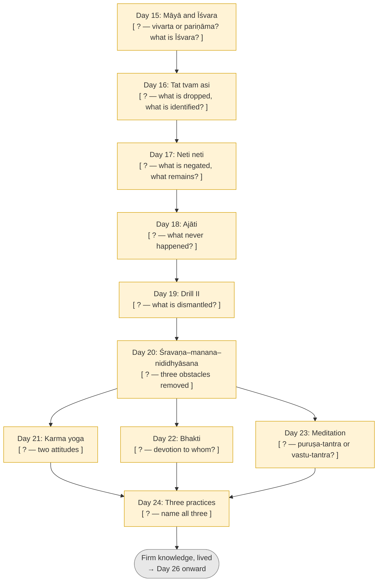
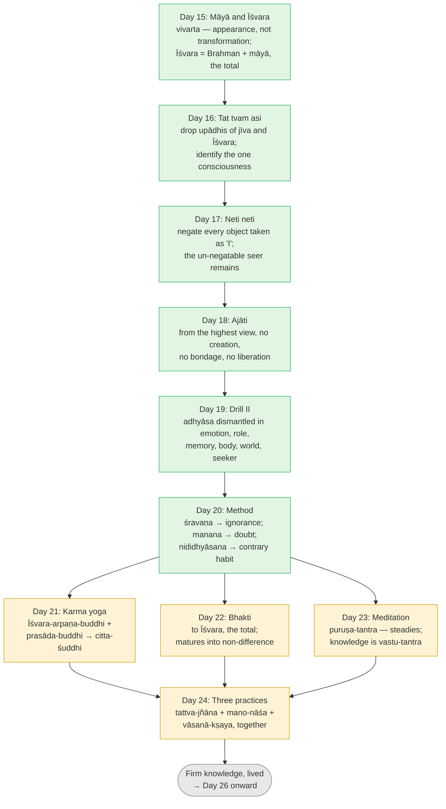

# Day 25 — Rest & Synthesize II

> **Today:** No new concepts. Only consolidation of the arc from Māyā and Īśvara to the three practices.
> **Format:** Re-state → Re-derive → Full run → Quiz
> **Reading time:** ~35 min (longer if gaps surface — that's the point)
> **Prereqs:** [Days 15–24](../../../README.md)

Days 15–24 took you from "where does the world come from?" to the two great methods of knowing, and then to the practices that let that knowing hold in a real life — today you check that the whole chain stands up from memory.

Close all previous pages. Work from memory first.

---

## Step 1 — Re-state the 10 ideas (5 min)

> **Why this table is not in day order:** Recalling Day 15 first, then Day 16 lets you use sequence as a cue — which is how you memorised it, not how you'll use it. The scrambled order below forces you to retrieve each concept on its own merits. This discomfort is the point.

Write one sentence per row. Name the load-bearing idea and, where you can, the text or analogy that carries it.

| Concept (Day) | Your sentence |
| --- | --- |
| Karma yoga — action as offering (Day 21) | |
| Māyā and Īśvara (Day 15) | |
| Ajātivāda (Day 18) | |
| Meditation vs knowledge (Day 23) | |
| Tat tvam asi (Day 16) | |
| Śravaṇa–manana–nididhyāsana (Day 20) | |
| Neti neti (Day 17) | |
| Vāsanās and the three practices (Day 24) | |
| Drill II — dismantling superimposition (Day 19) | |
| Bhakti inside Advaita (Day 22) | |

Compare to these

1. **Day 21 — Karma yoga:** Doing work as an offering to the total (*Īśvara-arpaṇa-buddhi*) and receiving its results as *prasāda* wears down *rāga-dveṣa* and purifies the mind (*citta-śuddhi*); it prepares for knowledge but does not liberate (Gītā 2.47–48, 3.9, 5.10–11).
2. **Day 15 — Māyā and Īśvara:** The world is an appearance (*vivarta*) on Brahman, not a transformation (*pariṇāma*) of it; empirically it has an intelligent cause — Īśvara, Brahman with *māyā*, the total — without compromising non-duality.
3. **Day 18 — Ajātivāda:** From the highest standpoint nothing was ever born — no creation, no bondage, no liberation (Kārikā 2.32, 3.48); the world is like the "circle" traced by a whirling firebrand.
4. **Day 23 — Meditation vs knowledge:** Meditation is *puruṣa-tantra* (depends on the doer) and produces states that come and go; knowledge is *vastu-tantra* (depends on the object); liberation is knowledge of what already is (BSBh 1.1.4).
5. **Day 16 — Tat tvam asi:** The equation identifies the essence of "you" and "That" by dropping their incompatible attributes (*bhāga-tyāga lakṣaṇā*), as in "this is that Devadatta" (Chāndogya 6.8.7).
6. **Day 20 — Śravaṇa–manana–nididhyāsana:** Hearing removes ignorance, reflecting removes doubt, dwelling removes contrary habit (Bṛh. 2.4.5) — this takes understanding to firm knowledge.
7. **Day 17 — Neti neti:** The knower can't be made an object, so negate everything you take yourself to be until only the un-negatable remains (Bṛh. 2.3.6, 3.4.2); method of *adhyāropa–apavāda*.
8. **Day 24 — Three practices:** *Tattva-jñāna*, *mano-nāśa* and *vāsanā-kṣaya* cause one another and must be practised together (Vidyāraṇya, *Jīvanmukti-viveka*).
9. **Day 19 — Drill II:** Superimposition can be taken apart live in every domain — emotion, role, memory, body, objects, world, even "the seeker" — by separating what is seen from what sees and recognising the seen as *mithyā*.
10. **Day 22 — Bhakti:** Devotion to Īśvara purifies powerfully; it does not vanish in knowledge but matures — the knower is the highest devotee, "my very Self" (Gītā 7.16–18).

**Scoring:** a row counts only if your sentence contains the *mechanism* (why it works), not just the label. Any row you left blank or got only as a label: reopen that day's "formal picture" section after finishing Step 4.

---

## Step 2 — Re-derive the end-to-end flow (10 min)

Fill each `?` from memory before opening the completed version.

Filled version

### Mechanism questions

1. Why does Day 16's equation need Day 15 first? What would "tat" refer to without it?
2. *Tat tvam asi* and *neti neti* are called companion methods. What does each do that the other can't?
3. Day 18 says liberation never happened. Day 20 gives a three-step method for reaching it. Contradiction?
4. Days 21–23 are said to "prepare" and Day 20's method to "know." Using Day 23's vocabulary, state exactly what separates them.
5. Day 24 says knowledge needs *vāsanā-kṣaya*. Day 23 said knowledge can't be lost. Reconcile these.

Answers

1. *Tat* ("That") is the cause of the world — Īśvara, Brahman with *māyā*. Without Day 15, "That" would be either undefined or a creator outside you, and the equation would claim a part equals a separate whole. Day 15 defines *tat* so that Day 16 can drop its upādhis (omniscience, total causality) just as it drops the jīva's (limited body-mind), leaving one consciousness.
2. *Tat tvam asi* identifies positively — "you are That" — but risks being heard as one object equalling another. *Neti neti* removes every object you might take yourself to be, guarding against that, but on its own could sound like it ends in nothing. Together: negate all that is seen (Day 17), and recognise what remains as the very reality the world depends on (Day 16).
3. No — two standpoints. From the highest (*pāramārthika*) view, bondage never occurred (Day 18). From within the appearance, where a person still takes the seen for the seer, ignorance is the problem, and the method removes it (Day 20). Day 18 is, in fact, what the method finally reveals: nothing needed to change. Recall [Day 13's three orders of reality](../../02-vicharana/days/day-13-mithya.md).
4. Karma yoga, bhakti and meditation are *puruṣa-tantra*: actions you can do, not do, or do otherwise; their results (a purer, steadier mind) are produced and can fade. *Śravaṇa–manana–nididhyāsana* serves knowledge, which is *vastu-tantra*: it depends on what is so. The first group prepares the instrument; the second lets the instrument see.
5. Knowledge that has removed ignorance isn't lost. But knowledge can be present and unassimilated — repeatedly overridden by habit (Day 20's *viparīta-bhāvanā*). *Vāsanā-kṣaya* doesn't create the knowledge; it stops the grooves from outshouting it. Map vs ruts.

---

## Step 3 — Run / apply it (10 min)

### Written reconstruction

A thoughtful colleague who has read some Buddhism asks: *"How does Advaita go from 'the world comes from God' to 'just do your job and meditate'? Isn't that two different religions?"* Explain the arc of Days 15–24 to them in **200 words**. Don't look back. Then compare with the model.

Model reconstruction

"It's one line of reasoning. First: the world is real enough to live in but depends on something — like a pot depends on clay. Its intelligent cause, Īśvara, is that one reality seen as the total. Second: the teaching says *you are That*. Not your body equals the universe — strip away what's incompatible on both sides (my small body-mind, the total's omniscience) and what remains is the same awareness. Third: since awareness can't be an object, you test this by negating everything you can observe — 'not this, not this' — until only the observer is left. From the highest view nothing was ever born or bound. Fourth: hearing, reflecting and dwelling turn that from idea into knowledge. Fifth — and this is your 'just do your job' — habits keep overriding the knowledge. So you work as an offering and accept results as given by the total, which wears down likes and dislikes; you love the total, which loosens the ego; you meditate, which steadies the mind. None of these produce freedom — that's knowledge — but they let it hold. Vidyāraṇya's summary: knowledge, a quiet mind, and worn-down habits, together."

Check: did you include (a) Īśvara as the total, not a separate creator; (b) *bhāga-tyāga*; (c) negation; (d) the two standpoints; (e) prepares vs knows; (f) the three together? Each missing item is a gap to revisit.

### Live contemplative check-list

Do each of these now, in order. If any step fails or you go blank, that's your diagnostic.

1. **Seer/seen, one breath (Days 17, 19):** notice a sensation, a thought, and the sense "I am reading." Say of each, silently: *seen — not this.* What remains when you stop naming?
2. **Mithyā check (Days 15, 18):** look at the object nearest your hand. Name its substrate. Is it unreal? Is it independently real? Say what it is.
3. **The equation (Day 16):** say "I am That" aloud, then name one attribute you must drop from "I" and one from "That" for it to be true.
4. **Two hinges (Day 21):** recall one result that landed on you today. Receive it now as *prasāda*. Note the *rāga* or *dveṣa* (0–5) before and after.
5. **State vs knowing (Day 23):** close your eyes for 30 seconds of quiet. Then open them. Ask: what changed — the quiet, or the awareness of it?
6. **Groove (Day 24):** name the one *vāsanā* from your Day 24 re-audit and which of the three practices you've done for it since.

---

## Step 4 — Quiz (5 min)

> **Why the questions jump around:** In real life no one hands you problems labelled "Day 17 question." Mixing topics makes you identify *which* idea applies before using it — the skill that actually transfers.

**Q1.** A meditation teacher says: "Sit long enough and you will *become* one with Brahman." Using one Sanskrit pair from this arc, say precisely what is wrong with the sentence and what is right about the practice.

**Q2.** Why can't the Self be found by looking for it as an object — and what method does the Upaniṣad use instead? Give one verse location.

**Q3.** Your friend has heard the teaching twice and argued through all her doubts. She still flies into a rage when her sister criticises her. Which of the three obstacles from Day 20 is at work, and which stage of the method addresses it?

**Q4.** "If nothing was ever born, then the world doesn't exist and ethics doesn't matter." Answer this in three sentences using Day 18 and the idea of standpoints.

**Q5 — Cross-concept.** Advaita says there is only one reality. Yet Day 21 asks you to receive results as *prasāda* from Īśvara, and Day 22 asks you to love Īśvara. Using Day 15, explain why neither practice contradicts non-duality — and what happens to each when knowledge is firm.

Answers

**A1.** Meditation is *puruṣa-tantra* — something you do, producing states that come and go; liberation is *vastu-tantra* — knowledge of what you already are (BSBh 1.1.4). Nothing "becomes" Brahman; whatever becomes is produced and ends. What's right: meditation steadies the mind (Gītā ch. 6), supports *mano-nāśa* and gives *nididhyāsana* its field (Days 23–24).

**A2.** Whatever is an object is seen, and the Self is the seer — "you cannot see the seer of seeing" (Bṛh. 3.4.2). So the Upaniṣad negates: *neti neti*, "not this, not this" (Bṛh. 2.3.6), removing each superimposed object until only the un-negatable remains — the method of *adhyāropa–apavāda* (Day 17).

**A3.** Contrary habit (*viparīta-bhāvanā*) — not ignorance (she's heard) or doubt (she's reflected). It is addressed by *nididhyāsana* (Day 20), supported by Day 24's *vāsanā-kṣaya* (and karma yoga / bhakti to wear down the groove).

**A4.** *Ajāti* is the highest standpoint: from there, there's no birth, no bondage, no world as a second thing. But the world is not thereby unreal; it is *mithyā* — empirically real, dependent on its substrate (Day 13) — and at the empirical level actions have results and ethics fully applies. Confusing the standpoints is exactly the error Day 18 warned against; and a mind that uses *ajāti* to excuse harm is showing the *vāsanās* it hasn't worn down.

**A5.** Day 15: Īśvara is Brahman with *māyā* — the total, the intelligent order of the appearance — and the jīva is Brahman with one body-mind; both are *mithyā* appearances of one reality. *Prasāda-buddhi* is simply accurate at that level: results really do come from the whole, not from your one input (Day 21). Bhakti is the fitting relationship of part to whole (Day 22). Neither posits a second reality; both relate two appearances of the one. When knowledge is firm, *prasāda-buddhi* becomes effortless evenness — there's no separate owner to resent results — and bhakti becomes the jñānī's *eka-bhakti*, love with no other ("my very Self," Gītā 7.18). The practices don't get refuted; they get completed.

---

## What's ahead

| Day | Topic | What the reader will decide or build |
| --- | --- | --- |
| 26 | Ramana: "Who Am I?" | Trace the I-thought to its source and see it as Day 12's *adhyāsa* undone from inside; decide how self-enquiry fits with *nididhyāsana* |
| 27 | Nisargadatta: "I Am" | Use the bare sense of being as Day 11's *sat* pointer, lived; compare it with Ramana's door |
| 28 | Krishnamurti | Test "the observer is the observed" against Day 6's seer/seen — convergence from a teacher who rejected tradition |

From here the classical machinery is in place; the next three days are three living doors into the same room.

---

## Connect it back

Days 15–24 had two halves. The first (15–20) completed the knowing: the world's status and cause, the equation, the negation, the highest standpoint, the drill, and the method. The second (21–24) asked why knowing doesn't instantly change a life — and answered with practices that thin the mind without pretending to replace knowledge. If Step 1 or Step 2 went blank anywhere, that day is your homework before Day 26: Ramana's enquiry assumes you can already separate seer from seen and know why a state is not the Self.

---

← [Day 24 — Vāsanās and the Three Practices](./day-24-vasanas-three-practices.md) &nbsp;|&nbsp; [Day 26 — Ramana: "Who Am I?" →](./day-26-ramana-who-am-i.md)
