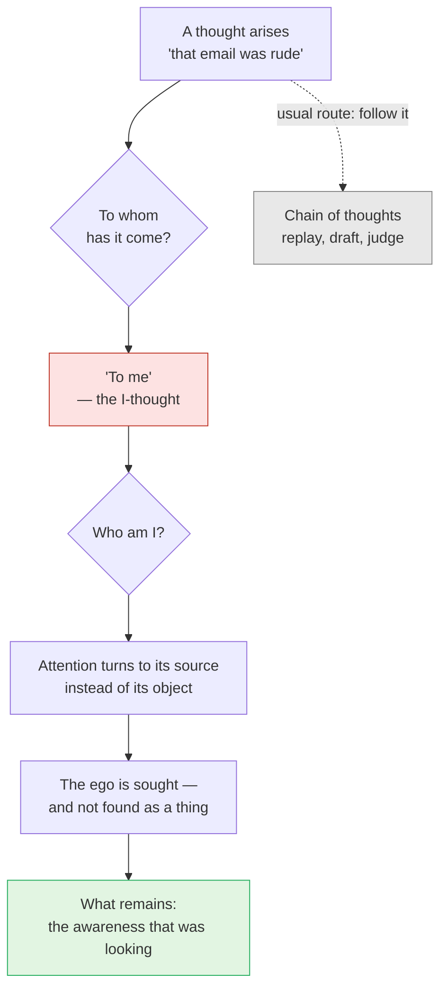
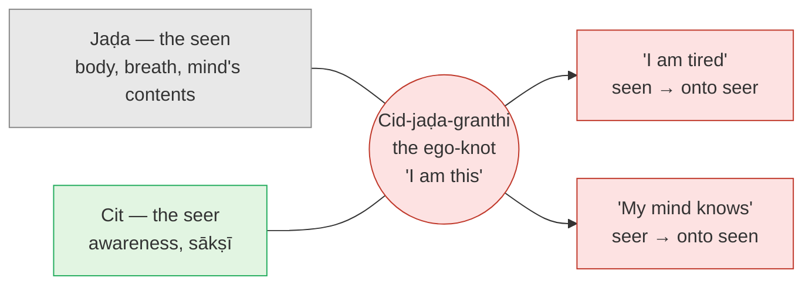

# Day 26 — Ramana: "Who Am I?"

> **Today's one idea:** Tracing the I-thought back to its source is *adhyāsa* undone from the inside — the knot between seer and seen, looked for, is not found.
> **Reading time:** ~35 min · **Prereqs:** [Day 12](../../02-vicharana/days/day-12-adhyasa.md), [Day 17](../../02-vicharana/days/day-17-neti-neti.md), [Day 23](./day-23-meditation-vs-knowledge.md)
> **Primary source for today:** Ramana Maharshi, *Who Am I? (Nān Yār?)*, Sri Ramanasramam (any edition — read the whole booklet; it is a few pages). Supporting: Munagala Venkataramiah (recorder), *Talks with Sri Ramana Maharshi*, Sri Ramanasramam, 1955.
> **Before you start:** Without looking — *Day 23 said knowledge is* vastu-tantra, *not* puruṣa-tantra. *What do those two words mean, and why does that rule out "a deep state I reached in meditation" as liberation?*

---

## The hook (3 min)

Madurai, the summer of 1896. A sixteen-year-old schoolboy named Venkataraman is sitting alone in an upstairs room of his uncle's house. He is healthy. Nothing is wrong. And suddenly he is gripped by an overwhelming fear that he is about to die.

He doesn't call for help. He decides to *meet* it. He lies down, stiffens his limbs like a corpse, holds his breath, and asks (his later account, paraphrased): *death has come — what is it that dies? This body will be burned to ashes. With the body's death, am I dead? Is the body "I"?*

What he reported afterwards: the body lay still, yet the sense of "I" shone in full force, untouched by it. The fear vanished and never returned. Weeks later he left home for the hill of Aruṇācala at Tiruvannamalai, where he lived for the rest of his life as Ramana Maharshi.

Notice the shape of that afternoon. No scripture, no teacher, no technique. Just one question, asked with total seriousness, pointed not at the world but at the *one asking*. Day 5 said the one thing never examined is the examiner. A teenager examined it, and fifty years of teaching followed from it.

---

## Building the intuition (12 min)

### The string under the beads

Picture a necklace of beads: *I'm hungry. I'm late. I wonder what she meant. I'm bored of this page.* Each bead is a thought. Look at how they're strung: every one hangs from the same word — **I**. "I'm hungry", "I wonder", "I'm bored". You never have a thought that belongs to *no one*; each thought arrives already owned.

Ramana's observation is that this "I" is not just one bead among others. It is the **first** thought — the thread that every other thought hangs on. In *Nān Yār?* he says that of all the thoughts that arise in the mind, the "I"-thought is the first; only after it rises do the others rise (paraphrase). Pull the thread, and the beads go with it.

The Sanskrit-derived term his tradition uses for it is ***aham-vṛtti*** — the "I"-modification of the mind, the I-thought.

### The question that eats the others

Now try something. A thought comes up — say, irritation about an email. The ordinary move is to follow it: replay the email, draft a reply, judge the sender. Ramana's move is different. You ask:

1. *To whom has this thought come?* — The honest answer: *to me.*
2. *And who am I?*

At that point the irritation has nowhere to go. You have stopped feeding it and turned toward the one it was arriving to. Ramana compares the question to the stick used to stir a funeral pyre: it pokes the other thoughts into the fire, and in the end it burns up too (*Nān Yār?*, paraphrase). The enquiry is not one more thought competing with the others; it is a thought that turns attention back on its own root.

### The ghost

What do you find when you turn toward "me"? Here's an analogy Ramana's tradition uses: a ghost in a dark house. It is there as long as no one looks; bring a lamp and look for it directly, and there's nothing to find. The ego, Ramana says, *seizes on forms* — a body, a mood, a role — and lives only by holding them; looked for in itself, it takes flight (*Ulladu Nārpadu* v. 25, paraphrase **[VERIFY verse]**).

That is the whole practice in one picture. **You don't fight the ego; you look for it.** And what is left when the looked-for "I" fails to show up as a thing is not nothing — it is the very looking, the awareness you never managed to make into an object.

The red box is red for a reason you already know — the formal picture below just names it.

---

## The formal picture (12 min)

### The ego is the knot

In *Ulladu Nārpadu* ("Forty Verses on Reality"), Ramana states the anatomy of the ego in one verse (v. 24 **[VERIFY]**), which runs roughly like this:

> The inert body does not say "I". Pure being-awareness does not rise or set. Between the two, an "I" of the body's size springs up. This is the knot of the sentient and the insentient (*cid-jaḍa-granthi*); it is also called bondage, the subtle body, the ego, *saṃsāra*, the mind.

Put Day 12 beside it. Shankara's *Adhyāsa Bhāṣya* said bondage is a **mutual** superimposition:

- the properties of the seen are placed on the seer — *"I am tired"* puts the body's tiredness on the Self;
- the sentience of the seer is placed on the seen — *"the mind knows"* gives the mind a light it doesn't have.

Ramana's "knot" is exactly that two-way tangle, given a single name. The body alone can't say "I" (it's *jaḍa*, insentient — Day 6's seen). Awareness alone doesn't say "I am this body" (it's *cit*, the seer). The "I" that says "I am tired, I am [your name], I am meditating badly today" exists only *in the overlap*. **The ego is not a third thing. It is the superimposition itself, mistaken for a person.**

### Why looking unties it

A knot of rope exists independently of your attention. This knot doesn't. Adhyāsa, Day 12 showed, is born of non-discrimination — the snake exists only while the rope is unexamined. So the remedy cannot be *removing* the ego by force (that would require a real ego to remove, and a second ego to do the removing). The remedy is *examination*: bring the lamp to the rope.

"Who am I?" is that lamp turned on the knot. When you hunt for the "I" that owns the thought, you look on the seen side and find only objects — sensations, images, a feeling of "here-ness" — each of which is seen, therefore not the seer (Day 6). You look for a seer you can hold, and it can't be held. What you can't find is the *knot*; what you can't lose is the *awareness*.

### Enquiry and surrender — two routes to one place

Ramana repeatedly told visitors that there are two ways: ask "Who am I?" until the ego is found to be unreal, or surrender completely to God or the Self (*śaraṇāgati*) until the ego has nothing left to claim. *Nān Yār?* itself praises the one who gives himself up to the Self that is God as the best devotee (paraphrase), and *Talks* returns to this pair often.

Why would those converge? Because both remove the *same* thing: the claimant at the centre. Enquiry dissolves it by looking; surrender dissolves it by giving away everything it would claim. You have met the second route already: Day 21's *Īśvara-arpaṇa* and *prasāda-buddhi* hand over the doer's claim to action and result. Total surrender is karma yoga carried to its end — nothing left for "me" to own.

### A word on *sahaja*

Ramana distinguished a temporary absorption in which the ego subsides but returns (*kevala nirvikalpa samādhi*) from the natural state in which it doesn't rise as owner even in activity (*sahaja*) (*Talks* **[VERIFY talk numbers]**). That is Day 23's rule in his vocabulary: a state that comes and goes isn't the goal. *Sahaja* belongs to stages beyond this course; use the word only to keep yourself honest when a quiet session tempts you to call it "it".

### Maps to

| Ramana's term | Classical counterpart | Day |
| --- | --- | --- |
| "Who am I?" — turning to the one to whom thoughts come | Examining the examiner; the witness | [Day 5](../../01-shubheccha/days/day-05-who-is-asking.md) |
| The ego looked for is not found as an object | Whatever is seen is not the seer | [Day 6](../../02-vicharana/days/day-06-seer-and-seen.md) |
| *Cid-jaḍa-granthi* (the ego-knot) | Mutual superimposition of seer and seen (*adhyāsa*) | [Day 12](../../02-vicharana/days/day-12-adhyasa.md) |
| Rejecting "I am the body", "I am the mind" in *Nān Yār?* | *Neti neti* | [Day 17](../../02-vicharana/days/day-17-neti-neti.md) |
| Holding attention on the "I"-source | *Nididhyāsana* | [Day 20](../../02-vicharana/days/day-20-shravana-manana-nididhyasana.md) |
| Surrender (*śaraṇāgati*) | *Īśvara-arpaṇa* carried to completion | [Day 21](./day-21-karma-yoga.md) |
| *Kevala* vs *sahaja* | A state that comes and goes is not liberation | [Day 23](./day-23-meditation-vs-knowledge.md) |

**The one difference:** classical Advaita enters through the scriptural sentence (*śravaṇa* first, enquiry after); Ramana enters through the enquiry and lets the sentence confirm it — a difference of entry point, not destination.

---

## Where it breaks / what it is not (4 min)

**"'Who am I?' is a mantra to repeat."** Ramana explicitly rejected mechanical repetition. The words are only a handle; the work is the *turning* of attention to the felt sense of "I". Repeating "who am I, who am I" while attention stays on the words is just a new bead on the string.

**"I should answer the question."** Any answer — "I am awareness", "I am Brahman" — is a thought, which means it is seen, which means (Day 6) it isn't what you're looking for. The enquiry ends not in an answer but in the falling away of the questioner as a separate thing. Notice how close this is to *neti neti*: every candidate answer is negated.

**"The point is to have no thoughts."** Thoughtless quiet is a *state*, and Day 23 already told you states come and go. Ramana valued a quiet mind as fit ground, but the point is to see that the I-thought is not what you are — which can be seen with thoughts present.

**"This is a Hindu version of 'Who is hearing?'"** Your Buddhist background will hear echoes of Chan/Zen *huatou* practice ("Who is it that recites the Buddha's name?"). The method is strikingly similar: an unanswerable question that turns attention back on its source. The conclusion is framed differently (the Buddhist reading: no self is found; the Advaitic reading: no *ego* is found, and what remains is the Self). Day 30 will show how much of that difference is vocabulary.

**"If the ego is unreal I can stop caring about ethics."** The ego is *mithyā* (Day 13), not non-existent; it still acts and still leaves *vāsanās* (Day 24). Seeing through the owner of actions doesn't license careless actions.

---

## Try it yourself (10 min)

### 1. Retrieval first

Close the page. From memory: (a) what does Ramana mean by calling the "I"-thought the *first* thought? (b) What two things does the *cid-jaḍa-granthi* tie together, and which Day 12 concept is it? (c) Why does *looking for* the ego undo it, rather than fighting it?

Hint

Necklace. Rope. Lamp.

Model answer

(a) Every other thought arrives already owned by "I" ("I'm hungry", "I wonder") — the I-thought is the thread on which they hang, so it rises first and if it subsides they subside. (b) It ties <em>cit</em> (the sentient seer, awareness) and <em>jaḍa</em> (the insentient seen — body, mind's contents). It is Day 12's mutual superimposition: seen-properties onto the seer ("I am tired") and the seer's sentience onto the seen ("the mind knows"). (c) Because adhyāsa exists only through non-examination, like the rope-snake. Fighting the ego presupposes a real ego (and a second ego doing the fighting); looking for it shows that every candidate "I" is a seen object and that the seer can't be grasped — the knot isn't found. If you wrote "because the ego is bad", go back to "Why looking unties it".

### 2. Direct application — a self-enquiry session (15–20 min, done today)

Sit as you normally sit for meditation. Then follow this protocol exactly:

1. **Settle (2 min).** Let the body be still. Don't use your usual breath-object; just let things settle.
2. **Find the "I" (1 min).** Say silently, "I am." Notice the felt sense the words point to — not the words. Most people feel it somewhere vaguely "here", behind the eyes or in the chest.
3. **Rest attention there.** Not on breath, not on sound — on that bare sense of being the one who's here.
4. **When a thought arrives, don't follow it.** Ask once, gently: *"To whom has this come?"* Let the answer be felt: *to me.* Then: *"Who am I?"* — and turn attention back toward that "me", not toward any answer.
5. **When a candidate shows up** ("I am this tension in the forehead", "I am this witness-feeling"), notice: *that is seen.* Let it go as an answer, and return to the one seeing it.
6. **Repeat for 10–15 minutes.** Don't count thoughts; count *returns*.
7. **Afterwards, write three lines:** what candidate "I"s turned up; what happened when you looked directly for the owner; one moment you clearly saw *"that's seen, so that's not me"*.

Hint

If the session turns into breath meditation or into chasing a nice quiet state, that's the most common drift. The test: is attention turned toward <em>objects</em> (calm, breath, quiet) or toward <em>the one experiencing them</em>?

What to look for

Typical candidates: a tension behind the eyes; a feeling of "presence" in the chest; a mental image of yourself sitting; a subtle "watcher" feeling. Each, looked at, turns out to be <em>seen</em> — a sensation or image appearing to you. That is the seer/seen discrimination done live, which is the point. 
What usually happens when you look directly for the owner: a brief gap — the search finds nothing to grab, and there is a moment of open, unlocated awareness before the next thought. Don't inflate that moment into an "experience of the Self"; note it accurately: "looked for the owner; found no object; awareness was still there." 
If you found nothing at all and got bored: fine. Boredom is a thought; ask to whom it came. If you got anxious ("is something wrong if I can't find me?"): that's the ego's hold on form, exactly as Ramana described it — note it as seen. If the session became pleasant and still and you stayed there: that's <em>kevala</em>-type quiet — pleasant, valuable, and not the target (Day 23).

### 3. Stretch — the question that eats itself

Ramana says the enquiry is like the stick that stirs a funeral pyre and is finally burned too. But "Who am I?" is itself a thought — the I-thought asking about itself. How can a thought end the very thing that is asking it? Using Day 12 and Day 6, explain why this isn't a paradox.

Hint

Is the ego a real entity that the question must destroy, or a mistake that the question must expose?

Worked answer

It would be a paradox if the ego were a real thing and the question had to kill it — something can't destroy the very thing it depends on. But the ego is adhyāsa: a confusion of seer and seen (Day 12). A confusion doesn't need to be destroyed; it needs to be <em>seen through</em>, and once seen through it isn't replaced by anything. The question does one job: it turns attention from objects to the "I" and so exposes that every graspable "I" is an object (Day 6). Once that is seen, the question has nothing more to do — it lapses, like the stick burned with the pyre. What doesn't lapse is awareness, which was never an object for the question to burn. Day 31 will give this pattern its classical name.

### 4. Spaced callback — Days 12 and 21

(a) From memory, state [Day 12's](../../02-vicharana/days/day-12-adhyasa.md) two directions of mutual superimposition, each with its example sentence. (b) From [Day 21](./day-21-karma-yoga.md): what are *Īśvara-arpaṇa* and *prasāda-buddhi*? (c) Now explain, in three sentences, why Ramana could treat surrender and self-enquiry as two routes to the same end.

Hint

For (c): what single thing does each route remove?

Model answer

(a) The seen's properties onto the seer — "I am tired" (body's fatigue on the Self); the seer's sentience onto the seen — "the mind knows" (awareness credited to the mind). (b) <em>Īśvara-arpaṇa</em>: doing action as an offering to the order of the whole (Īśvara); <em>prasāda-buddhi</em>: receiving whatever result comes as a gift, not as personal win or loss — together they wear down <em>rāga-dveṣa</em>. (c) Both routes target the ego — the claimant at the knot. Surrender removes its claims (no action or result left for "me" to own) until it has nothing to stand on; enquiry looks for the claimant directly and finds no object there. Either way the knot is loosened and what remains is the same awareness. If your answer to (c) said "surrender is easier", that may be true for you, but it isn't why they converge.

**Transfer — apply it:**

> Pick one recurring thought-loop in your work week — a worry about a review, a replay of a tense meeting, a "they don't respect me" story. Write one sentence: *the input* (the loop as it starts), *what today's idea does to it* (asks "to whom does this come?" and turns attention to the owner instead of the content), and *the output* (what changes in how long the loop runs, or how much it grips). Then try it once, live, the next time the loop starts. If nothing comes to mind in 60 seconds, re-read the hook and try again.

---

## Connect it back

Day 25 consolidated the preparation arc — karma yoga, bhakti, meditation, and the line Day 23 drew between steadying the mind and knowing the Self. Today walked through the first modern door and found it opens onto Module 2's room: Ramana's ego-knot *is* Day 12's adhyāsa, his enquiry *is* Day 17's negation done from the inside, and his warning about passing absorptions *is* Day 23's rule. Tomorrow, a Bombay shopkeeper is told by his guru to do something even simpler: just hold on to the sense "I am".

**Sharp question:** *When you look for the "I" and find no object, what — exactly — is doing the looking?*

---

## Suggested readings for today

**Required if you have 15 extra minutes:** Ramana Maharshi, ***Nān Yār? (Who Am I?)***, Sri Ramanasramam — the whole booklet, in the essay version. Read slowly; notice how often the instruction is "don't pursue the thought; ask to whom it arose". It is the shortest primary source in the course and one of the most practical.

**If you want the deep version:**
- Munagala Venkataramiah (rec.), ***Talks with Sri Ramana Maharshi***, Sri Ramanasramam, 1955 — dip in anywhere and look for the questions on surrender vs enquiry and on *kevala* vs *sahaja* **[VERIFY talk numbers in your edition]**. Shows how he adapted one method to many temperaments.
- Ramana Maharshi, ***Ulladu Nārpadu (Forty Verses on Reality)***, **vv. 23–26** **[VERIFY]**, in *The Collected Works of Ramana Maharshi*, ed. Arthur Osborne, Sri Ramanasramam — the ego-knot and the "ghost" ego in Ramana's own verse.
- Shankara, ***Adhyāsa Bhāṣya*** (preamble to the *Brahma-Sūtra-Bhāṣya*, Gambhirananda trans.) — re-read the paragraph on mutual superimposition with Ramana's knot beside it; they are describing the same structure.

---

## Navigation

← **Previous:** [Day 25 — Rest & Synthesize II](./day-25-rest-and-synthesize-2.md)
→ **Next:** [Day 27 — Nisargadatta: "I Am"](./day-27-nisargadatta-i-am.md)
