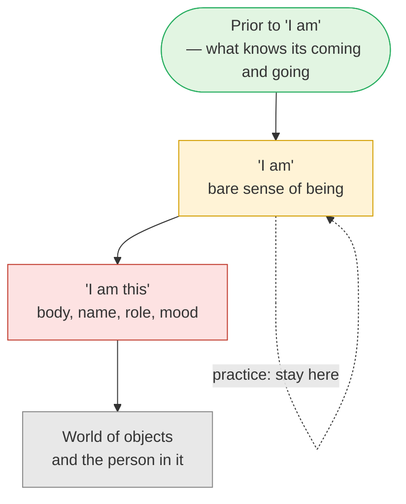
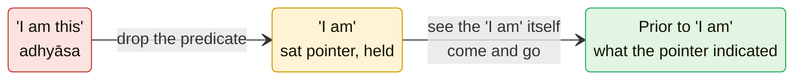

# Day 27 — Nisargadatta: "I Am"

> **Today's one idea:** The bare sense of being — "I am", before "I am this" — is Day 11's *sat* pointer, lived; dwell there, and even the pointer is finally let go.
> **Reading time:** ~35 min · **Prereqs:** [Day 11](../../02-vicharana/days/day-11-sat-cit-ananda.md), [Day 26](./day-26-ramana-who-am-i.md)
> **Primary source for today:** Nisargadatta Maharaj, *I Am That*, trans. Maurice Frydman, ed. Sudhakar S. Dikshit, Chetana, 1973 (dialogues; read any five).
> **Before you start:** Without looking — *what two things does Ramana's* cid-jaḍa-granthi *tie together, and what are the two questions you ask when a thought arises during self-enquiry?*

---

## The hook (3 min)

Bombay, 1933. Maruti Kambli is in his mid-thirties and runs a small shop selling *bīḍīs* — hand-rolled cigarettes — in a crowded lane. He is married, has children, has no particular education in philosophy. A friend takes him to hear a teacher named Siddharameshwar Maharaj.

The instruction he receives, as he later told it, is almost insultingly simple. *You are not what you take yourself to be. Find out what you are. Hold on to the sense "I am" and stay with it — nothing else.* (Paraphrased from his own retellings in *I Am That*.)

He takes it literally. Between customers, rolling *bīḍīs*, walking home, he keeps returning attention to the bare fact of being. He reports that within about three years the matter was settled. He went on running the shop. Decades later, in a small loft above it, visitors from every continent climbed a ladder to sit with the man now called Nisargadatta Maharaj; one of them, Maurice Frydman — who had earlier spent time with both Ramana and Krishnamurti — recorded the conversations that became *I Am That*.

Yesterday's method needed a question. Today's needs even less. Not "Who am I?" — just *"I am."* Full stop. What's left when you stop the sentence there?

---

## Building the intuition (12 min)

### The hotel-room second

You wake up in an unfamiliar hotel room after a long flight. For one or two seconds you don't know where you are. You don't know what day it is. You may not even have your name loaded yet. And yet — in that second — do you doubt that you *are*?

No. Something is unmistakably here, present, being. Then the story loads: *Berlin. Tuesday. Meeting at ten. I'm the one presenting.* In a heartbeat you're a person with a location, a job and a worry.

That first second is what Nisargadatta calls the **"I am"**. The loading is **"I am this"**: I am this body, in this city, with this role. Normally the two arrive glued together so fast you never see the gap. The hotel room pries them apart for a moment.

### Drop the predicate

Try it right now with sentences you actually live by:

| What you'd say | Drop everything after "am" |
| --- | --- |
| I am tired | I am |
| I am a meditator who's not progressing | I am |
| I am anxious about the review | I am |
| I am forty-one | I am |

Look at the left column: every entry has changed — or will change — many times in your life. Look at the right: it hasn't changed once. Tired-you and rested-you, seven-year-old-you and forty-one-year-old-you, all shared one thing that never needed updating.

Nisargadatta's practice is to **stay on the right-hand column.** Not to think about it, not to repeat it, but to keep the attention resting on the felt sense of being that the words point at — and to let whatever is in the left column come and go without signing up for it.

### The screen and the films

Picture a cinema screen. A war film plays, then a comedy, then static. The screen is in none of them, yet none of them could appear without it. Nisargadatta talks this way constantly: the world, the body, the person are appearances *in* consciousness; you are not inside the world, the world is inside you (paraphrase of a recurring theme in *I Am That*). The "I am" is the screen as you can feel it; "I am this" is the moment you mistake yourself for a character in the film.

The colours matter. The "I am" is amber, not green — a doorway, not the destination. Hold that until the formal picture.

---

## The formal picture (12 min)

### "I am" is the *sat* pointer

Day 11 said Brahman can't be *described* — it isn't an object with properties — but it can be *indicated* (*lakṣaṇa*). One of the three indicators was ***sat***, existence: the "is-ness" common to every experience. The pot *is*, the thought *is*, the pain *is*; the predicates differ, the "is" doesn't.

Nisargadatta takes that pointer and turns it from the world to the subject. Not "the pot is" but **"I am"**. The structure is the same — remove the varying predicate, attend to the invariant "is" — but now the invariant is felt from the inside, as one's own being. That's why this is the *sat* pointer *lived*: you are no longer noting existence as a feature of objects; you are resting as it.

### "I am this" is adhyāsa

The moment the predicate is added — *I am this body, I am this mood* — you have Day 12 exactly: a seen object's features placed on the seer. "I am anxious" puts the mind's state on the one who is aware of the mind. Nisargadatta's whole diagnosis of suffering is this one move: the "I am" identifying with something it perceives. His remedy is not to argue with each identification but to refuse to finish the sentence.

That's also why the practice is a cousin of [Day 17's *neti neti*](../../02-vicharana/days/day-17-neti-neti.md). Neti neti negates candidates one at a time — *not this body, not this mind*. Nisargadatta's version is lazier and sharper at once: *don't add any candidate in the first place*.

### Continuity across states

Day 8 showed that waking, dream and deep sleep come and go while the awareness of them does not. The "I am" practice leans on that continuity: the sense of being runs under every waking change — the hotel-room second, the left-hand column — and so it is the closest thing in experience to the unchanging.

### And yet: the "I am" goes too

Here Nisargadatta says something that surprises most readers, especially in his later talks. The felt "I am" — he calls it consciousness, the sense of presence — is **not the final truth**. It appears on waking, it is absent in deep sleep, it is bound up with the body and with time. What *knows* its appearing and disappearing is prior to it — he calls that the Absolute (*parabrahman*). The "I am" is to be held firmly until it is understood, and then it is outgrown (this is the emphasis of the later talks collected in *Prior to Consciousness*, from 1980–81; it is present but less central in *I Am That*).

Map this onto what you already have:

- **Day 11:** a *lakṣaṇa* points; it isn't the thing pointed at. Lean on the finger long enough to look where it points, then don't keep worshipping the finger. The felt "I am" is the pointer.
- **[Day 10](../../02-vicharana/days/day-10-turiya.md) and [Day 8](../../02-vicharana/days/day-08-three-states-one-witness.md):** what is aware of the "I am" arising on waking and going in sleep is not one more state — it's what the states appear in. That is the "prior to I am".

So the apparent contradiction ("hold the I am" / "the I am goes") is just a door and a room. Hold the door handle; walk through; don't take the handle with you.

### Maps to

| Nisargadatta's term | Classical counterpart | Day |
| --- | --- | --- |
| "I am" — the bare sense of being | *Sat*, the existence-pointer (*lakṣaṇa*) | [Day 11](../../02-vicharana/days/day-11-sat-cit-ananda.md) |
| "I am" running under every change | The one awareness through the three states | [Day 8](../../02-vicharana/days/day-08-three-states-one-witness.md) |
| "I am this / that" | *Adhyāsa* — the seen superimposed on the seer | [Day 12](../../02-vicharana/days/day-12-adhyasa.md) |
| The world appears in me | *Mithyā* — appearance dependent on its substrate | [Day 13](../../02-vicharana/days/day-13-mithya.md) |
| "You are not what you take yourself to be" | *Neti neti* | [Day 17](../../02-vicharana/days/day-17-neti-neti.md) |
| Staying with "I am" all day | *Nididhyāsana* | [Day 20](../../02-vicharana/days/day-20-shravana-manana-nididhyasana.md) |
| The Absolute, prior to "I am" | *Turīya* — not a state, that in which states appear | [Day 10](../../02-vicharana/days/day-10-turiya.md) |

**The one difference:** Ramana enters through the *I-thought's source*, the Upaniṣad through the *sentence*, Nisargadatta through the *felt sense of being* — three entry points to the same discrimination.

---

## Where it breaks / what it is not (4 min)

**"'I am' is a feeling I should try to produce."** You don't produce it — you already are, before any effort. If you find yourself straining to generate a "presence feeling", you've made the "I am" into an object and are chasing a state (Day 23). Relax the effort and notice what was there before you tried.

**"'I am' is the ego, so this is ego-worship."** The ego is "I am *this*" — the knot of yesterday's page. The bare "I am" has no content to be proud of, defend or improve. Your Buddhist training rightly treats the conceit "I am" (*asmi-māna*) as a fetter; notice that Nisargadatta *also* says the "I am" must finally go. What both traditions refuse is the "I am" taken as a possession. What Advaita adds is that what *sees* the "I am" come and go is not nothing.

**"Since the 'I am' isn't final, I can skip it and go straight to the Absolute."** Every attempt to "go to" the Absolute makes it an object you're heading toward. Nisargadatta's own sequence was: hold the "I am" until it is thoroughly understood; then its limits show themselves. Skip the door and you're just theorising about the room.

**"This is quietism — sit and do nothing."** Nisargadatta ran a shop, raised a family and argued vigorously with visitors. The practice is done *in* activity — exactly as Maruti did between customers.

---

## Try it yourself (10 min)

### 1. Retrieval first

Close the page. From memory: (a) what is the difference between "I am" and "I am this", and which Day 12 concept is the second? (b) Which Day 11 pointer is the "I am", and why is it called a pointer? (c) Why does Nisargadatta say even the "I am" must be transcended?

Hint

Hotel room. Finger and moon. Deep sleep.

Model answer

(a) "I am" is the bare sense of being before any predicate; "I am this" adds an identification with something perceived — body, mood, role. The second is adhyāsa: a seen object's features superimposed on the seer. (b) <em>Sat</em>, existence — the "is" common to every experience; it's a <em>lakṣaṇa</em>, an indicator, because Brahman can't be described as an object, only pointed at. (c) Because the felt "I am" is itself an appearance — present on waking, absent in deep sleep, tied to body and time. What knows its coming and going is prior to it. The "I am" is the door, not the room. If you said "because the 'I am' is the ego", revisit "Where it breaks": the ego is "I am <em>this</em>".

### 2. Direct application — a day of "I am"

**Sitting (10 min):**

1. Sit. Say once, silently, "I am." Let the words fall away; keep the sense they pointed at.
2. When a predicate arrives — *I am bored, I am doing this wrong, I am tight in the shoulders* — notice it as a predicate. Don't push it away. Just don't finish the sentence with it: let it go back to "I am".
3. Twice in the session, check: *is the "I am" I'm attending to an object — a sensation, a location, a picture?* If yes, that's seen (Day 6). Let it be seen, and rest as what's seeing.

**Daily life (three moments):** set three reminders. At each, notice the current predicate ("I am rushing", "I am annoyed"), say it, then drop everything after "am" for ten seconds. Write one line each time: *predicate → what remained.*

Hint

Keep it light. Ten honest seconds beat ten strained minutes.

What to look for

In the sitting: the most common discovery is that "I am" keeps sliding into a location — a point behind the eyes, a warmth in the chest. Each time you notice that, you've done the live discrimination: that location is <em>felt</em>, so it's on the seen side. What does the feeling? Don't answer; rest there. 
In daily life: typical log — <em>"I am late → I am. The lateness was still there as a fact, but the 'I' wasn't made of it."</em> That is the target. If instead you wrote "I tried to feel 'I am' and felt nothing special", good: there was nothing special to feel. Being isn't an experience among others; it's what every experience already has. If all three daily moments got skipped, that's useful data about <em>uparati</em> (Day 3) — and it's exactly what Maruti had to overcome between customers.

### 3. Stretch — "I am" vs the witness

Day 8 says the awareness of the three states never comes and goes. Nisargadatta says the "I am" is absent in deep sleep. A friend says: "So either Day 8 is wrong or Nisargadatta is." Resolve it in a paragraph.

Hint

Is Nisargadatta's "I am" the same thing as Day 8's witness, or a feeling that appears <em>to</em> it?

Worked answer

They're talking about two different things, so there's no conflict. Nisargadatta's "I am" is the <em>felt sense</em> of presence — something that appears in waking and dream as "I'm here", and is absent in deep sleep. Day 8's witness is what is aware of waking, dream and the absence-of-everything in deep sleep — on waking you report "I knew nothing". Nisargadatta's "Absolute prior to 'I am'" is exactly that witness: it knows the "I am" appearing and disappearing. So the felt "I am" corresponds to the <em>sat</em> pointer showing up in the mind; the witness/<em>turīya</em> (Day 10) is what it points to. Both pages agree: what comes and goes is not what you are, and the felt "I am" comes and goes.

### 4. Spaced callback — Days 13 and 22

(a) From memory, state [Day 13's](../../02-vicharana/days/day-13-mithya.md) clay–pot argument for *mithyā* in three sentences. (b) Use it to explain Nisargadatta's claim that "the world is in you, not you in the world". (c) From [Day 22](./day-22-bhakti-inside-advaita.md): what does the Gītā (7.17–18) say about the knower as devotee? Nisargadatta sang devotional songs to his guru every day until his death — is that a contradiction for a non-dualist?

Hint

(b): which is the clay, which the pot? (c): who is the "highest devotee"?

Model answer

(a) The pot has no existence apart from the clay — remove the clay and no pot remains — yet "pot" is a real name and form that you can use. So the pot is neither independently real nor simply unreal: it is <em>mithyā</em>, dependent on its substrate. Only the clay is <em>satya</em> relative to it. (b) The world (and the body-mind in it) is the pot; being-awareness — the "I am" pointing to its source — is the clay. The world appears in consciousness and has no existence apart from it; consciousness isn't a thing located inside the world. That isn't idealism making the world "unreal"; it is Day 13's dependence relation. (c) The Gītā calls the knower the dearest devotee, "my very Self" (Day 22). Devotion purifies before knowledge and continues as gratitude after it, with nobody separate left to gain from it. Nisargadatta's bhajans fit Day 22 exactly: love for the guru as the expression of non-separation, not a rival path. Not a contradiction.

**Transfer — apply it:**

> Name one identity you carry into work that tightens you — "I am the one who has to fix this", "I am behind", "I am the junior in the room". Write one sentence: *the input* (the identity as you live it), *what today's idea does to it* (drops the predicate and rests in "I am"), and *the output* (what you do in that meeting or task when you aren't made of the predicate). If nothing comes to mind in 60 seconds, re-read the hook and try again.

---

## Connect it back

Yesterday, Ramana's door was a question: trace the I-thought to its source and the knot of seer and seen isn't found. Today's door is quieter — don't ask, just *be*, and refuse to finish the sentence — and it lands on Day 11's *sat* pointer instead of Day 12's knot. Same room, different entrance. Tomorrow's teacher rejected every door: no guru, no scripture, no method. And yet he arrives at a statement — "the observer is the observed" — that you'll find you already understand.

**Sharp question:** *If the "I am" is only the door, how will you know you have stopped clinging to the door handle?*

---

## Suggested readings for today

**Required if you have 15 extra minutes:** Nisargadatta Maharaj, ***I Am That*** (Frydman trans., Chetana, 1973) — read the **opening dialogue** and then any two others, looking only for passages where he describes his own practice under Siddharameshwar and where he distinguishes "I am" from "I am this". The dialogues are numbered and titled; there is no systematic order, so skimming is fine.

**If you want the deep version:**
- Nisargadatta Maharaj, ***Prior to Consciousness***, ed. Jean Dunn, Acorn Press, 1985 — the late talks where the "I am" is treated as something to be transcended; read after you've practised with it for a while.
- Taittirīya Upaniṣad **2.1** (सत्यं ज्ञानमनन्तं ब्रह्म) with Shankara's commentary (Gambhirananda, *Eight Upaniṣads*, Vol. 1) — the classical source of the existence-pointer Nisargadatta turns inward.

---

## Navigation

← **Previous:** [Day 26 — Ramana: "Who Am I?"](./day-26-ramana-who-am-i.md)
→ **Next:** [Day 28 — Krishnamurti: The Observer Is the Observed](./day-28-krishnamurti-observer-observed.md)
