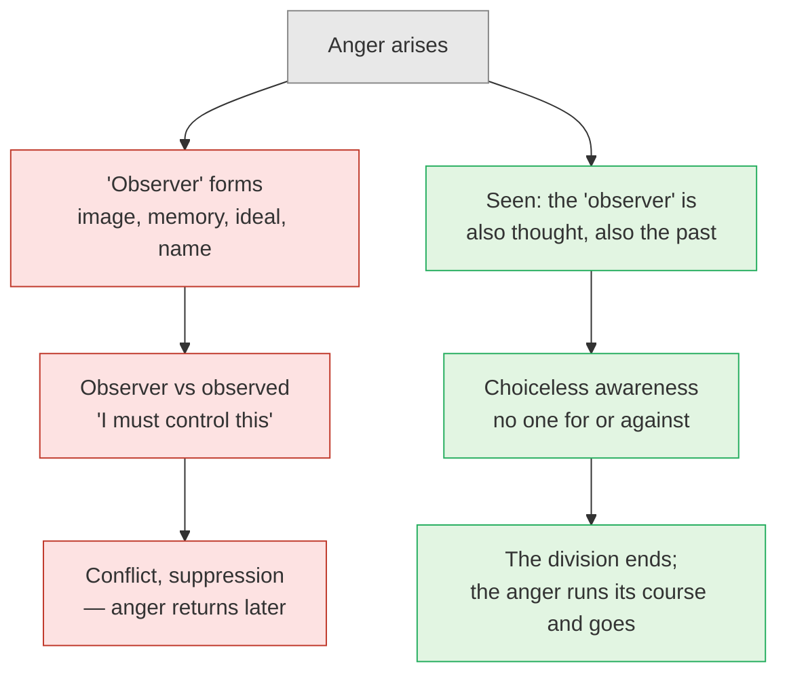

# Day 28 — Krishnamurti: The Observer Is the Observed

> **Today's one idea:** Krishnamurti's "observer" — the centre that judges and tries to change what it sees — is itself observed content, made of memory; seeing this is Day 6's discrimination arrived at with no Vedantic vocabulary at all.
> **Reading time:** ~35 min · **Prereqs:** [Day 6](../../02-vicharana/days/day-06-seer-and-seen.md), [Day 26](./day-26-ramana-who-am-i.md), [Day 27](./day-27-nisargadatta-i-am.md)
> **Primary source for today:** J. Krishnamurti, *The First and Last Freedom*, Harper & Row, 1954 — especially the chapter "The Thinker and the Thought" **[VERIFY chapter title/number]**. Supporting: J. Krishnamurti & David Bohm, *The Ending of Time*, Harper & Row, 1985.
> **Before you start:** Without looking — *what is the difference between Nisargadatta's "I am" and "I am this", and why was the "I am" coloured amber rather than green on yesterday's page?*

---

## The hook (3 min)

Ommen, the Netherlands, 3 August 1929. Thousands of people have gathered at a camp of the Order of the Star in the East, an organisation built — with property, publications and members across the world — around one young man. Jiddu Krishnamurti, born in Madanapalle in 1895, had been picked out as a boy on a beach at Adyar by leaders of the Theosophical Society and raised to be the coming "World Teacher".

Now, at thirty-four, the World Teacher stands up and dissolves the Order.

His reason, given in that talk, became his signature: **"Truth is a pathless land."** No organisation, no creed, no guru can lead anyone to it. He didn't want followers; followers, he said, would only imitate. For nearly six more decades he travelled and spoke, insisting every time that he was not an authority and that the listener must see for themselves.

So here is a test of this module's claim. The last two days showed modern teachers converging on Module 2's discrimination — but Ramana and Nisargadatta both stood within Indian traditions of guru and lineage. Krishnamurti rejected all of it: scripture, teachers, methods, Vedānta itself. If he still ends up at the same place, the convergence is not a family resemblance. It's the territory.

---

## Building the intuition (12 min)

### The angry referee

You're in a meeting and someone dismisses your idea. Anger rises — heat in the face, a sharp reply forming. Then a second movement happens, almost instantly: *"I shouldn't be angry. I'm a meditator. I need to stay calm."* Now there are two things: the anger, and an "I" standing a little way off, judging it, trying to control it.

Krishnamurti asks you to look at that second "I" very carefully. What is it made of?

- An *image* of yourself as calm, spiritual, in control.
- A *memory* of past angers and their consequences.
- A *standard* you've absorbed from teachers and books.
- A *name* — "anger" — which itself comes from memory and already carries a verdict.

Every one of those is the past. The "controller" is not some neutral judge standing outside the game. It is a **referee who is secretly one of the players** — built out of the same thought that produced the anger, now pulling in a different direction. So the effort to control anger is just thought fighting thought, and the fight itself is more conflict. That's why, Krishnamurti says, the struggle to change ourselves so rarely changes anything (*The First and Last Freedom*, paraphrase).

### When the division is seen

His claim is: **the observer is the observed.** The one who stands apart from anger, judging it, is not separate from anger; both are movements of the same conditioned thinking. And — this is the striking part — when this is actually *seen*, not as an idea but in the moment, the division stops. There is no longer someone fighting the anger. There is just the anger, fully seen, with no one choosing for or against it. He calls that ***choiceless awareness***: attention that doesn't condemn, justify or identify.

What happens to the anger then? In his descriptions, it burns out without a residue, because nothing is feeding it — neither indulgence nor resistance.

### A familiar move, in strange clothes

If you've done much noting practice, you may already have caught this: the "noter" can harden into a subtle watcher who is pleased with good notes and irritated by bad ones. That watcher is the observer Krishnamurti means. It is not the awareness in which the noting happens; it's one more formation inside it.

---

## The formal picture (12 min)

### Which "observer"? The crucial disambiguation

There is an easy mistake to make here, and making it would wreck the convergence. Advaita has spent twenty days teaching you that the **seer** (*sākṣī*) can never be seen. Krishnamurti says the **observer** is observed. Are they contradicting each other?

No — because they are using "observer" for different things.

| | Krishnamurti's "observer" | Advaita's *sākṣī* |
| --- | --- | --- |
| Made of | Memory, images, ideals — the past | Nothing; not made of anything |
| Does what | Judges, names, compares, tries to change | Illumines; does nothing |
| Can it be seen? | Yes — that's his whole point | No — whatever is seen is not it (Day 6) |
| Advaita's name for it | *Ahaṅkāra*, the ego — the "I-maker" | *Sākṣī*, the witness |

Krishnamurti's observer is the *ahaṅkāra*: the "I"-function in the mind, the one who claims "I am angry", "I must improve". In Day 26's terms it is the *cid-jaḍa-granthi*, the ego-knot; in Day 27's, it's "I am *this*". And the moment it can be watched, judged and dissected, Day 6's rule applies: **it is on the seen side**. "The observer is the observed" is Day 6's discrimination applied to the most intimate object of all — the one that usually poses as the seer.

What then is the "observation" left when the observer is seen through? Krishnamurti preferred not to name it — naming, for him, was where thought sneaks back in. But structurally it is attention without a centre: seeing that isn't anyone's. Advaita would say that's the *sākṣī* no longer overlaid by the *ahaṅkāra* — Day 12's superimposition loosened.

### Why he refused method

Krishnamurti rejected meditation techniques, practices and spiritual effort. That can sound like the opposite of a course with daily exercises. But look at his reason: **every method is run by the observer.** The one who practises in order to become calm is the same centre-made-of-the-past, now with a project. Effort to become strengthens the one who wants to become. In the Bohm dialogues of *The Ending of Time* he calls this "psychological time": the movement of *becoming* — I am this now, I will be better later — and he locates the root of conflict there.

Hold that beside Day 23. Liberation is *vastu-tantra*: knowledge depends on the thing known, not on what the knower does. No effort *produces* the fact that you are not the ego, any more than effort produces the rope under the snake. Effort can quieten the mind (Day 23's legitimate role for meditation); it cannot manufacture the seeing. And beside Day 4: the tenth man doesn't become the tenth by trying harder. Krishnamurti's "you cannot get there through time" and the Tenth Man's "there was nothing to gain" are the same refusal, from opposite directions.

### What about the scriptures he rejected?

This is the one place where the difference is real. Advaita says the Self, being the knower, can't be found as an object by perception or inference; so it needs *śabda-pramāṇa* — the teaching sentence, from a teacher — to point it out (Day 4, Day 20). Krishnamurti says any authority, scripture included, conditions the mind and so blocks the seeing. That is a disagreement about the *means*, not about what is seen. And even here, notice: he spent nearly six decades speaking — giving sentences that pointed people's attention back at the observer. Functionally, his talks did for his listeners what *śravaṇa* does.

### Maps to

| Krishnamurti's term | Classical counterpart | Day |
| --- | --- | --- |
| The observer (the centre, made of the past) | *Ahaṅkāra* — a seen object, not the seer | [Day 6](../../02-vicharana/days/day-06-seer-and-seen.md) |
| Observer/observed division | Mutual superimposition, seer and seen confused | [Day 12](../../02-vicharana/days/day-12-adhyasa.md) |
| The observer is real as thought, not as a separate entity | *Mithyā* — dependent, not independent | [Day 13](../../02-vicharana/days/day-13-mithya.md) |
| Choiceless awareness | Witnessing without the ego's claim; *nididhyāsana* without a "doer" | [Day 20](../../02-vicharana/days/day-20-shravana-manana-nididhyasana.md) |
| No method; effort strengthens the self | Knowledge is *vastu-tantra*, not produced by effort | [Day 23](./day-23-meditation-vs-knowledge.md) |
| "Truth cannot be reached through time" | Nothing to gain; the tenth man was always there | [Day 4](../../01-shubheccha/days/day-04-the-tenth-man.md) |
| Observation without the observer | The ego-knot sought and not found | [Day 26](./day-26-ramana-who-am-i.md) |

**The one difference:** Krishnamurti rejects *śabda-pramāṇa* and the teacher's role, entering by bare observation; Advaita uses the sentence and the teacher as the entry — different doors, same discrimination.

---

## Where it breaks / what it is not (4 min)

**"Krishnamurti denies the witness."** He denies the *observer* — the judging, naming centre. That's the ego, which Advaita also says is seen. Mixing up the two makes him sound like a materialist or a nihilist; he was neither.

**"So I should never use memory or judgement."** He drove cars, ran schools and corrected manuscripts. Practical memory — how to get home, how to write a report — is fine. His target is *psychological* memory: the image of "me" that the past builds and defends. The same line as Day 13: the ego functions, but isn't what you are.

**"Choiceless awareness is just a meditation technique with a new name."** If you turn it into a technique — "now I will be choicelessly aware" — the observer has taken it over, and he would say you've missed it. The same point as Day 26: "Who am I?" is not a mantra.

**"He rejected Vedānta, so this page misuses him."** Convergence doesn't claim he secretly agreed with Shankara. It claims that what he pointed at, looked at carefully, is the same structure Module 2 described — and that's checkable in your own experience, which is exactly where he'd want you to check it.

---

## Try it yourself (10 min)

### 1. Retrieval first

Close the page. From memory: (a) what is Krishnamurti's "observer" made of? (b) Why is it *not* the same as Advaita's *sākṣī*? (c) Why, on his account, does effort to change yourself fail?

Hint

The angry referee. The table of two "observers". Psychological time.

Model answer

(a) The past: memories, images of oneself, ideals, and names ("anger") that carry built-in verdicts. (b) Because it can be watched and analysed — so by Day 6 it's on the seen side; it's the <em>ahaṅkāra</em>/ego. The <em>sākṣī</em> is precisely what can't be seen, isn't made of anything, and does nothing. (c) Because the one making the effort is the same thought-made centre that is the problem; effort to "become better" strengthens that centre and adds conflict (thought fighting thought). Cf. Day 23: liberating knowledge isn't produced by effort. If your (b) said "because K didn't believe in a witness", re-read the disambiguation table.

### 2. Direct application — catch the referee (live, over the next 48 hours)

The next time a strong reaction arises — irritation, anxiety, envy, defensiveness:

1. **Notice the split.** There will usually be the reaction *and* a voice about it ("I shouldn't feel this", "this is their fault", "breathe, be mindful").
2. **Turn to the voice.** What is it made of? List what you find: an image of yourself? a rule from somewhere? a name like "anger"?
3. **Check it against Day 6.** Is this "observer" something you can see? If yes — it's seen. Say inwardly: *that too*.
4. **Don't choose.** Neither indulge the reaction nor suppress it. Just let both the reaction and the referee be seen together, as one movement.
5. **Watch what happens to the division** for 30–60 seconds. Then write three lines: what the referee was made of; what happened when it was seen as observed; what happened to the original reaction.

Hint

Start with a small reaction if a big one doesn't come. Waiting in a queue works.

What to look for

A typical log: <em>"Referee = image of myself as patient + mum's voice saying 'don't make a scene' + the word 'impatient'. When I saw the referee was also just thought, the tug-of-war stopped for a moment. The impatience was still there but had nowhere to push against; it faded within a minute."</em> 
Two errors to check for. (1) A new referee forms: "good, I'm doing choiceless awareness now" — that's the observer again, now proud of itself. Notice it as observed too; that's the practice continuing, not failing. (2) You concluded "so there's nothing here at all". Check: what was aware of the referee, the reaction, and the moment the division stopped? That awareness was never one of the items on your list. That is Day 6's seer — and you've just done the discrimination live.

### 3. Stretch — method or no method?

Krishnamurti says every method strengthens the observer. Day 20 prescribes *śravaṇa–manana–nididhyāsana*, and Day 26 gave you a step-by-step protocol. Are they incompatible? Write a paragraph using Days 4, 20 and 23.

Hint

What does Advaita say the method <em>does</em> — produce the Self, or remove a mistake?

Worked answer

They're compatible once you ask what the method is for. If a method claimed to <em>produce</em> liberation — to build a better self or a special state — Krishnamurti's objection would hit it, and so would Day 23's: liberation is <em>vastu-tantra</em>, not produced by any doing. But Advaita's method claims nothing of the sort. <em>Śravaṇa</em> points out a fact, <em>manana</em> removes doubts, <em>nididhyāsana</em> removes the habit of forgetting (Day 20) — all three work on ignorance, like counting again in the Tenth Man story (Day 4), where nothing is gained and only a mistake is dropped. Krishnamurti's own talks did the same job: sentences that turned attention back on the observer. The real risk he names is genuine, though: a method can be hijacked by the ego as a project of becoming. The protection is to keep remembering what the method is for.

### 4. Spaced callback — Days 13 and 23

(a) From memory, give [Day 13's](../../02-vicharana/days/day-13-mithya.md) definition of *mithyā* and say why it is neither "real" nor "unreal". (b) Is Krishnamurti's observer *mithyā*, unreal, or real? (c) From [Day 23](./day-23-meditation-vs-knowledge.md): what do *vastu-tantra* and *puruṣa-tantra* mean, and which side does choiceless awareness fall on?

Hint

(b): does the observer function? Does it exist independently of thought? (c): is choiceless awareness something you do?

Model answer

(a) <em>Mithyā</em>: what has no existence independent of its substrate — like a pot apart from clay — yet is experienced and usable. Not real (it has no independent being), not unreal (it appears and functions, unlike a barren woman's son). (b) <em>Mithyā</em>. The observer really operates — it judges, it produces conflict — so it isn't a fiction like a hare's horn. But it has no being apart from thought and the awareness thought appears in; seen, it doesn't stand as a separate entity. That's exactly Krishnamurti's claim that "the observer is the observed". (c) <em>Puruṣa-tantra</em>: dependent on the doer (actions, meditations, which can be done, not done or done differently). <em>Vastu-tantra</em>: dependent on the thing (knowledge, which must conform to what is). Choiceless awareness, in Krishnamurti's sense, is not a doing — the moment it becomes a doing, the observer is back. It is closer to the <em>vastu-tantra</em> side: seeing what is the case. A practice that prepares for it (sitting quietly) is <em>puruṣa-tantra</em>; the seeing itself is not.

**Transfer — apply it:**

> Pick one area at work where you're actively trying to "fix yourself" — be less defensive in code reviews, less anxious before presenting, more patient with a colleague. Write one sentence: *the input* (the self-improvement project as you run it), *what today's idea does to it* (shows the one doing the fixing is itself made of the same images and ideals), and *the output* (what you'd do instead of fighting it — e.g. fully see the defensiveness the next time it comes, without a verdict). If nothing comes to mind in 60 seconds, re-read the hook and try again.

---

## Connect it back

Ramana found the ego-knot by asking for its owner; Nisargadatta dissolved "I am this" by refusing to add the predicate. Today a man who rejected every tradition looked at the judging centre in the mind and found it was just more of the content — Day 6's seer/seen discrimination, with Day 23's refusal of effort-made liberation built in. Three doors, one room: the ego is seen, so it is not the seer. Tomorrow opens Module 4 with a fourth door — the direct path — which examines perception itself and finds experience made only of knowing.

**Sharp question:** *If the observer is the observed, what is aware of that fact?*

---

## Suggested readings for today

**Required if you have 15 extra minutes:** J. Krishnamurti, ***The First and Last Freedom*** (Harper & Row, 1954) — the chapter **"The Thinker and the Thought"** **[VERIFY chapter title/number]**, and if there's time the chapter on **"Self-Knowledge"**. Short, plain, and the clearest single statement of "the observer is the observed". Read Aldous Huxley's foreword too if you want context.

**If you want the deep version:**
- J. Krishnamurti & David Bohm, ***The Ending of Time*** (Harper & Row, 1985) — the opening dialogues on psychological time and "becoming" **[VERIFY dialogue numbers]**. A physicist presses Krishnamurti hard; the resulting precision makes the convergence with Day 23 easy to see.
- J. Krishnamurti & David Bohm, **Brockwood Park dialogues, 1980** (J. Krishnamurti official YouTube channel) — the same conversations on video; watch for how he handles Bohm's questions about the "observer".
- Michael Comans, ***The Method of Early Advaita Vedānta*** (Motilal Banarsidass, 2000) — the chapters on the role of scripture and meditation, for the classical side of today's one real disagreement (*śabda-pramāṇa*).

---

## Navigation

← **Previous:** [Day 27 — Nisargadatta: "I Am"](./day-27-nisargadatta-i-am.md)
→ **Next:** [Day 29 — The Direct Path](../../04-sattvapatti/days/day-29-direct-path.md)
