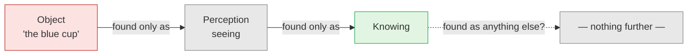

# Day 29 — The Direct Path (Atmananda, Spira, Lucille)

> **Today's one idea:** Examine any perception honestly and you never find an object apart from the seeing of it, nor a seeing apart from knowing — so experience is made only of knowing. This is Day 6's discrimination pushed down into the senses themselves.
> **Reading time:** ~35 min · **Prereqs:** [Day 6](../../02-vicharana/days/day-06-seer-and-seen.md), [Day 26](../../03-tanumanasa/days/day-26-ramana-who-am-i.md)
> **Primary source for today:** Nitya Tripta (recorder), *Notes on Spiritual Discourses of Shri Atmananda*, 1963; reprinted Non-Duality Press, 2009. Supporting: Rupert Spira, *The Nature of Consciousness*, Sahaja / New Harbinger, 2017.
> **Before you start:** Without looking — *what is Krishnamurti's "observer" made of, and why is it not the same thing as Advaita's* sākṣī*? Which of the two can be seen?*

---

## The hook (3 min)

Put a cup on the table in front of you and look at it.

Now do something odd. Try to find the cup's **colour** without seeing. Not imagining that you aren't seeing — actually find the colour, as it is right now, in a way that doesn't involve seeing.

You can't. Every time you go to the colour, you go by way of seeing. "It's still there when I close my eyes" is a thought — a different experience from the colour.

Trivandrum, the 1950s. A lawyer and former police officer, Krishna Menon — known as Shri Atmananda (1883–1959) **[VERIFY biographical details]** — ran exactly this experiment with his visitors, over and over, until they saw where it led. He called his way of teaching **the direct path**. Spira and Lucille teach the same thing in English today. Today you run it yourself.

---

## Building the intuition (10 min)

### Two steps down

The experiment above had a first step: **the object is found only as perception.** The colour is only ever met as seeing; the sound only as hearing; the hardness of the table only as touching. You never meet a colour that isn't being seen.

Now take a second step. Try to find the **seeing** without knowing it. Is there any seeing going on that you are not aware of, right now? Can you find a seeing that isn't known?

Again, no. Seeing is found only as **knowing**. And the same holds for hearing, touching, smelling, tasting — and thinking. A thought you don't know isn't, for you, a thought at all.

Put the two steps together:

So: **in experience, there is no stuff called "object" alongside the knowing of it. Experience is made only of knowing.** The cup still holds tea. What goes is the belief that you ever met it as something *other* than knowing.

If you've practised noting ("seeing, seeing"), you've done the first step already. The direct path doesn't stop at the sense-contacts; it asks what they are *made* of, as experienced.

### Why "direct"?

Atmananda contrasted two routes **[VERIFY: his terms "direct" vs "cosmological" in the *Notes*]**:

- **The cosmological (or progressive) path** starts from the world. It accepts the world as given, explains where it came from, traces it to its cause, and — over a long time, through practice — brings the seeker round to the Self.
- **The direct path** starts from *you*: your own experience, now. It never builds a cosmology. It examines what is actually present and finds that everything present is knowing.

---

## The formal picture (12 min)

### It is Day 6, turned around

[Day 6's](../../02-vicharana/days/day-06-seer-and-seen.md) *Dṛg-Dṛśya-Viveka* v. 1 runs **upward**: form is seen by the eye, the eye by the mind, the mind's modifications by the witness, which is never seen. Each object is pushed away from the subject until the subject stands alone.

The direct path runs the same chain **downward**: the form is not found apart from the seeing; the seeing is not found apart from the knowing. Instead of separating each object from awareness, it dissolves each object *into* awareness.

| | Day 6 (upward) | Direct path (downward) |
| --- | --- | --- |
| Question | What sees this? | What is this made of, as experienced? |
| Result | The seen is not the seer | The seen is not found apart from knowing |
| Stopping point | The witness, unseen | Knowing alone, with nothing outside it |

The two are not rivals: the first separates, the second dissolves what was separated (Exercise 3 shows how).

The Upaniṣad has a version of the downward move. Yājñavalkya tells Maitreyī that when a drum is beaten you can't catch the sounds on their own, but you catch them by catching the drum or the drummer (Bṛhadāraṇyaka 2.4.7) **[VERIFY verse]**. Shankara reads it as: particulars are not grasped apart from the general consciousness in which they occur. Grasp the knowing, and every particular is already held.

### Two stages: the witness, then no witness

Atmananda didn't jump straight to "everything is knowing". He taught in two moves **[VERIFY: his account of the witness as an intermediate step in the *Notes*]**:

1. **Take your stand as the witness.** You are not the body, the senses or the mind; you are the consciousness that witnesses them. (This is Day 6 exactly.)
2. **Then examine the witnessed.** The objects the witness was witnessing turn out to be nothing but knowing. With no separate objects left, "witness" has nothing to be a witness *of*. The title falls away; consciousness remains.

You've seen this shape before. [Day 17](../../02-vicharana/days/day-17-neti-neti.md) called it ***adhyāropa–apavāda***: attribute, then retract — and it said explicitly that even "witness" is an *adhyāropa*, a role awareness has only relative to the witnessed. Atmananda's two stages are that ladder, with the top rung named. The rung was needed. Without it you'd go straight from "I am the body" to "everything is consciousness" — and the "consciousness" would be a thought the body-mind believes.

### The contemporary language

Rupert Spira, who learned this approach through Francis Lucille, writes in this lineage. Lucille's own main teacher was Jean Klein, whose teaching shows Atmananda's influence **[VERIFY lineage details]**. Spira's recurring formulations include "experience is made only of knowing" **[VERIFY phrasing]**; Lucille stresses that consciousness is never absent from any experience **[VERIFY phrasing]**. No Sanskrit, no scripture; you check every step yourself.

### Maps to

| Direct-path term | Classical counterpart | Day |
| --- | --- | --- |
| "I am the witness of body, senses, mind" | *Dṛg-dṛśya-viveka*; the *sākṣī* | [Day 6](../../02-vicharana/days/day-06-seer-and-seen.md) |
| Objects found only as perception, perception only as knowing | *Cit* as what all experience is made of; the clay in every pot | [Day 11](../../02-vicharana/days/day-11-sat-cit-ananda.md), [Day 13](../../02-vicharana/days/day-13-mithya.md) |
| The belief in objects outside knowing | *Adhyāsa* — the seen given independent reality | [Day 12](../../02-vicharana/days/day-12-adhyasa.md) |
| Witness taken up, then dropped | *Adhyāropa–apavāda* | [Day 17](../../02-vicharana/days/day-17-neti-neti.md) |
| Skipping the cosmology | Īśvara-and-creation as a provisional teaching | [Day 15](../../02-vicharana/days/day-15-maya-and-ishvara.md) |
| Looking for the separate self and not finding it | The ego-knot sought and not found | [Day 26](../../03-tanumanasa/days/day-26-ramana-who-am-i.md) |

**The one difference:** Advaita enters by the scriptural sentence; the direct path enters by analysing perception — a different door into the same seer/seen discrimination.

---

## Where it breaks / what it is not (4 min)

**"So the world is just my thoughts."** That is subjective idealism, and [Day 13's Trap 2](../../02-vicharana/days/day-13-mithya.md) closed it: Shankara rejects "objects are only ideas in a mind" (BSBh 2.2.28). The "knowing" the direct path finds is not *your mind's* cognition — your mind is itself one of the things known. It is knowing as such, *cit*. The cup isn't inside your head; your head and the cup both appear in knowing.

**"So objects don't exist."** They exist exactly as Day 13 said: *mithyā*. The cup functions, is shared, holds tea. What's denied is that it has a being of its own apart from the consciousness it is known in.

**"This is Yogācāra."** The method resembles Buddhist "mind-only" analysis, but it ends not in a stream of cognitions but in one unchanging knowing they are made of.

**"Then I can skip preparation."** Atmananda taught people who were already mature seekers **[VERIFY]**. The analysis takes five minutes to *follow*; making it the way you live takes the work of Day 24.

---

## Try it yourself (11 min)

### 1. Retrieval first

Close the page. (a) State the two steps of the perception analysis. (b) What is the difference between the cosmological path and the direct path? (c) Why does Atmananda teach the witness first and then drop it — and which Day 17 method is that?

Hint

The cup's colour. Where each path starts. The ladder.

Model answer

(a) An object is found only as perception (colour only as seeing, sound only as hearing); perception is found only as knowing. So experience is made only of knowing. (b) The cosmological/progressive path starts from the world, explains its origin and leads gradually back to the Self; the direct path starts from your present experience and examines what it is made of. (c) The witness stance separates you from body, senses and mind (Day 6); once the witnessed is seen to be only knowing, "witness" has nothing to witness and the role falls away. That is <em>adhyāropa–apavāda</em>: the witness was a provisional attribution, now retracted. If your (a) said "objects are only in my mind", re-read the first point under "Where it breaks".

### 2. Direct application — the five-sense run (live, 10 minutes, eyes open)

1. **Sight.** Look at one object. Ask: *can I find this colour other than as seeing?* Wait for the honest answer from experience, not from the theory.
2. **Seeing.** Ask: *can I find this seeing other than as knowing?* Wait.
3. **Sound.** Repeat both questions with the nearest sound.
4. **Touch.** Repeat with the pressure of your body on the chair. This is usually the hardest — the body feels most "solid".
5. **Thought.** Let a thought come ("what's for dinner?"). Is it found other than as knowing?
6. **The knower.** Finally: is the knowing itself found as an object anywhere — with a location, colour or edge?
7. Write three lines: which sense resisted most, what you actually found, and what was present through all six steps.

Hint

Don't argue with the step; look. "But the chair is really there" is a thought — run step 5 on it.

What to look for

A typical log: <em>"Touch resisted — the pressure felt like 'body against chair', solid and outside. Looking closely, I found only sensation, and the sensation only as known. Step 6: no edge to the knowing; it wasn't 'here' as opposed to 'there'."</em> 
Three things to check. (1) Did you slip into idealism — "so it's all in my head"? Your head is one of the things found as knowing; it can't be the container. (2) Did step 6 produce an <em>image</em> of knowing — a glow, a space, a field? That image is seen; apply Day 6 to it: not this. (3) If what stayed through all six steps was "the knowing that never moved", you have just done the discrimination live — seer from seen, and then the seen into the seer.

### 3. Stretch — upward and downward

Day 6 separates the seen from the seer; today dissolves the seen into the seer. Using [Day 13's](../../02-vicharana/days/day-13-mithya.md) pot and clay, explain why these are not contradictory but two halves of one teaching — and what goes wrong if you do only the second.

Hint

"The pot is not clay" and "the pot is only clay" — in what sense is each true?

Worked answer

As a <em>form</em>, the pot is not the clay: the clay was there before it and stays after it is smashed; you can't identify clay with "pot". That is the upward move — the seen is not the seer. As <em>substance</em>, the pot is nothing but clay: look for pot-stuff apart from clay and there is none. That is the downward move — the seen is not found apart from knowing. Together: the world is <em>mithyā</em>, dependent on its substrate. Do only the downward move without the upward one and "everything is consciousness" gets said by the unexamined ego: the body-mind proclaims itself the whole, which is <em>adhyāsa</em> in spiritual clothes. That's why Atmananda insisted on the witness stage first.

### 4. Spaced callback — Days 15 and 24

(a) From memory, state [Day 15's](../../02-vicharana/days/day-15-maya-and-ishvara.md) distinction between *vivarta* and *pariṇāma*, and say why Īśvara-as-cause doesn't compromise non-duality. Why can the direct path skip that whole teaching — and does skipping it make the teaching false? (b) From [Day 24](../../03-tanumanasa/days/day-24-vasanas-three-practices.md): name the three practices. If experience is only knowing, why would anyone still need two of them?

Hint

(a) Which side of <em>adhyāropa–apavāda</em> is "Īśvara creates the world" on? (b) Seeing it once vs living from it.

Model answer

(a) <em>Pariṇāma</em>: real transformation, the cause changed (milk → curd). <em>Vivarta</em>: apparent transformation, the cause unchanged (rope → snake). The world is a <em>vivarta</em> of Brahman, and <em>māyā</em> is itself <em>mithyā</em>, so no second reality appears. Creation-talk answers "where does the world come from?" for someone who takes the world as given; it is an <em>adhyāropa</em>, later retracted (Day 17's table). The direct path never asks the question, because it never grants the world an existence outside knowing. That doesn't make Day 15 false; it's a different rung, needed by people whose doubts run through cosmology. (b) <em>Tattva-jñāna</em>, <em>mano-nāśa</em>, <em>vāsanā-kṣaya</em>. The perception analysis gives understanding — a form of <em>tattva-jñāna</em>. But a restless mind and deep grooves will keep replaying "the world is out there, I am in here" a minute later. Atmananda's students were asked to return to the understanding again and again; that return, plus a quiet mind and thinned tendencies, is what turns a five-minute seeing into a settled one.

**Transfer — apply it:**

> Pick one object that pulls at you at work — the unread-messages badge, a sharp email, the dashboard metric you check compulsively. *Input:* the object, felt as "out there, pressing on me". *What today's idea does:* run the two steps on it — it is found only as seeing; the seeing only as knowing. *Output:* one sentence on what changed in its grip when you met it as knowing rather than as an outside thing. If nothing comes to mind in 60 seconds, re-read the hook and try again.

---

## Connect it back

Krishnamurti found that the observer is just more of the observed. Today's door goes further down: it finds the observed itself is not found apart from knowing. Ramana traced the subject back to its source; the direct path traces the object back to its substance. They arrive at the same place. Four doors are now open — the scriptural sentence, Ramana's question, Nisargadatta's "I am", and this one. Tomorrow sets them side by side and names the four things every one of them shares.

**Sharp question:** *If the cup is made only of knowing, what is the knowing made of?*

---

## Suggested readings for today

**Required if you have 15 extra minutes:** Rupert Spira, ***The Nature of Consciousness*** (2017) — any essay on the "knowing" of experience; the opening essays suffice **[VERIFY essay titles]**. Spira writes slowly and invites you to check each step in your own experience, so read it with the cup in front of you.

**If you want the deep version:**
- Nitya Tripta (rec.), ***Notes on Spiritual Discourses of Shri Atmananda*** (Non-Duality Press, 2009) — dip in for the notes on sense perception, the witness, and the "direct" vs "cosmological" approach **[VERIFY note numbers]**. Atmananda's own idiom, compressed.
- Francis Lucille, ***Eternity Now*** **[VERIFY publisher/year]** — dialogues; useful for seeing how the method answers live objections.
- *Bṛhadāraṇyaka Upaniṣad* **2.4.7–9** with Shankara's commentary (Madhavananda trans.) — the drum, conch and lute images; the classical root of the downward move **[VERIFY verse range]**.

---

## Navigation

← **Previous:** [Day 28 — Krishnamurti: The Observer Is the Observed](../../03-tanumanasa/days/day-28-krishnamurti-observer-observed.md)
→ **Next:** [Day 30 — Where the Paths Converge](./day-30-where-the-paths-converge.md)
