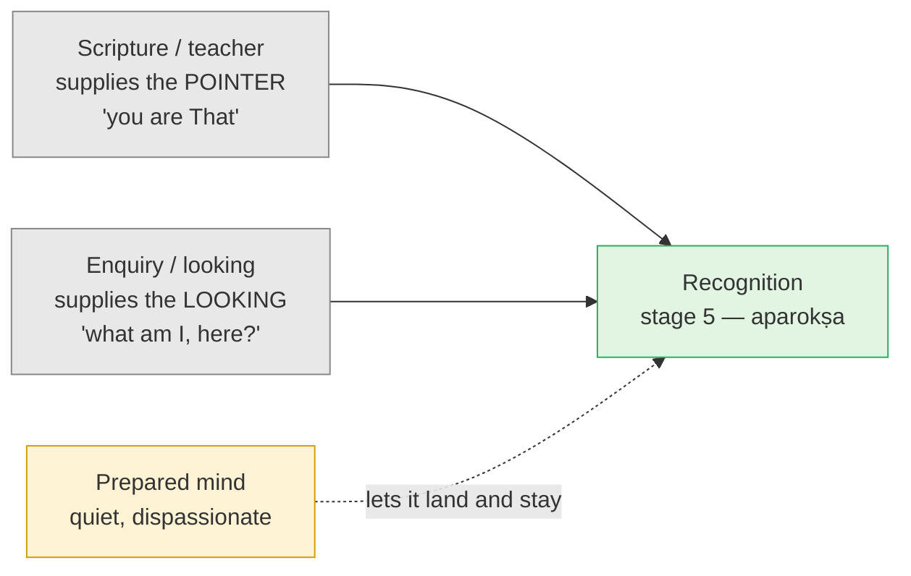

# Day 30 — Where the Paths Converge

> **Today's one idea:** Every source in this course shares four invariants — you already are what you seek; the obstacle is misidentification, not absence; the shift is recognition, not acquisition; and a prepared mind is needed. Scripture supplies the pointer and enquiry supplies the looking; they are two halves of one act.
> **Reading time:** ~35 min · **Prereqs:** [Day 4](../../01-shubheccha/days/day-04-the-tenth-man.md), [Day 20](../../02-vicharana/days/day-20-shravana-manana-nididhyasana.md), [Day 23](../../03-tanumanasa/days/day-23-meditation-vs-knowledge.md), [Days 26–28](../../03-tanumanasa/days/day-26-ramana-who-am-i.md), [Day 29](./day-29-direct-path.md)
> **Primary source for today:** Wilhelm Halbfass, "The Concept of Experience in the Encounter between India and the West", in *India and Europe*, SUNY Press, 1988; Anantanand Rambachan, *Accomplishing the Accomplished*, University of Hawaii Press, 1991.
> **Before you start:** Without looking — *yesterday's perception analysis had two steps. What is an object found only as, and what is that found only as? Why did Atmananda teach the witness first and then drop it?*

---

## The hook (3 min)

Two people get into an argument online. You've probably seen it.

The first, a student of traditional Vedānta, says: *"Liberation is knowledge, not experience. Experiences come and go. Chasing them is the trap."*

The second, a student of a modern teacher, says: *"Knowledge is just more concepts. You have to see it directly, in your own experience. Scripture is a map, not the territory."*

Over the last four days you've studied teachers on both sides, and every one pointed you at the same discrimination. So either the course has been fooling you, or the argument is about a word. It's about a word.

---

## Building the intuition (10 min)

### Ask the tenth man

Go back to the riverbank ([Day 4](../../01-shubheccha/days/day-04-the-tenth-man.md)). The traveller says, "You are the tenth," and taps the leader on the chest. At that moment, did the leader *experience* being the tenth, or did he *know* it?

The question has no good answer, because it splits one event in two. He heard the sentence and looked at himself in the same instant. He didn't have a special sensation of tenth-ness that he then had to interpret. Nor did he acquire a belief he could only take on trust. He **saw** and **knew** at once, because the thing pointed to was himself, fully present.

- Call it "knowledge", and you stress that nothing new appeared — only an error ended.
- Call it "direct experience", and you stress that it wasn't hearsay — he didn't need to take anyone's word for it afterwards.

Both descriptions are true of stage 5, *aparokṣa jñāna*. The argument in the hook is two people describing the same moment and each fearing a different mistake.

### Two mistakes everyone is guarding against

| Mistake | What it looks like | Who warns loudest |
| --- | --- | --- |
| **Hearsay** | "Brahman exists, the books say so" — Day 4's stage 4, *parokṣa*; still searching | Modern teachers: "don't believe — look" |
| **A state** | "I had it in the retreat and lost it" — Day 23's state that comes and goes | Traditional teachers: "not an experience — knowledge" |

Everyone in this course rejects **both**. They just shout about different ones, depending on which mistake their students were making.

---

## The formal picture (14 min)

### The four invariants

Strip each source down to what it claims about the seeker and the shift. Four things are the same every time:

1. **You already are what you seek.** Nothing is missing that has to be added.
2. **The obstacle is misidentification, not absence.** The Self is not hidden somewhere; it is taken to be something it isn't.
3. **The shift is recognition, not acquisition.** Nothing is produced, reached, changed or purified (Day 4's four results of action).
4. **A prepared mind is needed.** Not as a cause of the Self, but so the recognition can land and stay.

### The convergence matrix

| Source | 1 · Already what you seek | 2 · Misidentification, not absence | 3 · Recognition, not acquisition | 4 · Prepared mind |
| --- | --- | --- | --- | --- |
| **Upaniṣads / Shankara** | *Tat tvam asi* (Chānd. 6.8.7); *aham brahmāsmi* (Bṛh. 1.4.10) | *Adhyāsa* — seer and seen confused (*Adhyāsa Bhāṣya*, Day 12) | Not produced, reached, modified or purified (BSBh 1.1.4) | The four qualifications implied by *atha* (BSBh 1.1.1, Day 3) |
| **Gauḍapāda** | Nothing was ever born; no one is bound (MK 2.32, 3.48) | The rope imagined as a snake (MK 2.17–18) | No liberation to gain, as there was no bondage (MK 2.32) | Patient mastery of the mind, like emptying the ocean drop by drop (MK 3.41) |
| **Vidyāraṇya** | The tenth was present all along (Pañcadaśī 7) | Concealment and projection, stages 2–3 (Day 4) | Stage 5: same words, the pointer turned round | The three practices (*Jīvanmukti-viveka*, Day 24) |
| **Ramana** | Happiness is the Self's own nature (*Nān Yār?*, paraphrase) | The I-thought, the knot of sentient and insentient (Day 26) | The ego looked for is not found; nothing new is attained | Ripeness; surrender for those not drawn to enquiry |
| **Nisargadatta** | "I Am That" — the book's very title | "I am *this*" — the predicate added (Day 27) | Stop taking yourself to be what you are not | Earnestness, his constant word in *I Am That* |
| **Krishnamurti** | Implicit: truth is not at the end of time; no becoming (Day 28) | The observer — the past — taken as the self | Seeing, not becoming | Implicit: seriousness, attention, order in daily life — never a "method" |
| **Atmananda / Spira** | You are the knowing all experience is made of (Day 29) | Belief in a body-self and objects outside knowing | Examining experience, not producing a state | A "tolerably sincere and earnest" seeker, who then keeps returning to what was seen (*Notes*, no. 1359) |
| **Swartz / Dayananda** | You are the whole; the problem is a sense of limitation | Self-ignorance | Knowledge, not experience (Swartz's central theme) | Qualifications and karma yoga as preparation |

Two honest notes. Krishnamurti's row is the thinnest: he never said "you already are That" and refused to prescribe preparation, so the matrix marks his cells as implicit. And convergence covers these four structural claims, not everything. Gauḍapāda's "nothing was born" and the Īśvara teaching of Day 15 still speak from different standpoints (Day 18).

### Why they *sound* opposed: one word

Wilhelm Halbfass (1988) traced how "experience" became central to modern Hindu self-description. From Vivekananda onward, partly in answer to Western critics and Western ideas of religion, Indian teachers began presenting Vedānta as grounded in **religious experience**: a verifiable inner event, like a scientific observation. Classical Advaita used the word *anubhava*, but differently. Shankara does say knowledge of Brahman culminates in *anubhava* (*anubhavāvasāna*, BSBh 1.1.2). There, *anubhava* means the knowledge becoming immediate. It does not mean a special state that authorises the scripture.

Robert Sharf (1995) found the same shift in Buddhism. Modern Buddhist reformers recast meditation as the pursuit of special "experiences", while the older texts were far more concerned with doctrine, conduct and practice. If your own Buddhist background taught you to value "direct experience" over "mere concepts", that framing is itself partly modern. That doesn't make it wrong. It means the word has a history.

So when Rambachan (*Accomplishing the Accomplished*) insists that for Shankara the Upaniṣad is the *pramāṇa*, not a record of mystical experience, he is attacking "experience" in its modern sense: a state. When Spira says "check it in your experience", he means the plain sense: here, immediately, not on trust. Comans ("The Question of the Importance of *Samādhi* in Modern and Classical Advaita Vedānta", 1993) shows that the early teachers did not make *samādhi* a requirement. That removes the last reason to think "knowledge" and "seeing" name different goals.

### Pointer and looking

The two camps also differ on *entry*. Each supplies something the other relies on:

Without the pointer, looking can stop at a pleasant blank or a subtle object and call it the Self (Day 17's risk). Without the looking, the pointer stays stage 4: true, believed, and somewhere else. The traveller spoke and the leader looked. Ramana's enquiry still needs the Upaniṣads' sentence to confirm what it finds; Shankara's sentence still needs the listener to turn toward himself.

---

## Where it breaks / what it is not (4 min)

**"So all teachings are the same."** No. They share four structural claims about the seeker and the shift. They differ on scripture, on whether a teacher is required, on cosmology, on method. Convergence says *where they meet*; it doesn't erase where they part.

**"Then I can mix methods freely."** Use one door as your main practice and the others as cross-checks. Switching doors whenever one gets hard is the restless mind of invariant 4 at work.

**"Knowledge means intellectual understanding."** Not in this course's sense. *Aparokṣa jñāna* is knowledge whose object is immediately present: you. A correct paragraph about Brahman is stage 4.

**"The experiential teachers are wrong, then."** No. They guard against hearsay, a real danger; "experience" misleads only when heard as "a state to reach".

---

## Try it yourself (11 min)

### 1. Retrieval first

Close the page. (a) State the four invariants. (b) What two mistakes are the two camps guarding against? (c) In one sentence each, what did Halbfass and Sharf show?

Hint

Already / misidentification / recognition / prepared. Hearsay and state. One word with a history.

Model answer

(a) You already are what you seek; the obstacle is misidentification, not absence; the shift is recognition, not acquisition; a prepared mind is needed. (b) Hearsay (stage-4 belief, still searching) and a state (an experience that comes and goes). Modern teachers warn loudest about the first, traditional teachers about the second, and both reject both. (c) Halbfass: "experience" became central to modern Hindu self-presentation from Vivekananda onward, partly in dialogue with the West, and it differs from classical <em>anubhava</em>. Sharf: Buddhist modernism did the same, recasting meditation as the pursuit of special experiences. If your (b) named only one mistake, re-read the tenth-man section: stage 5 is neither.

### 2. Direct application — answer your friend, then check yourself

**Part A.** A friend from your meditation group says: *"Vedānta is too intellectual. Words can't do it — you need direct experience."* Write a reply of no more than 120 words that (i) agrees with what is right in it, (ii) shows them the tenth man, and (iii) names the second mistake they may be walking into.

**Part B (live, 3 minutes).** Sit quietly. Notice the one who wants "the experience" or "the knowledge" — the seeker. Ask: *is this seeker seen?* If it is, apply Day 6. Then ask: *what is aware of the seeker, and has it been missing?*

Hint

Part A: hearsay vs immediacy; then "a state that comes and goes". Part B: invariant 2 in one minute.

What to look for

Part A, a sample: <em>"You're right that believing a book isn't enough — that's like knowing a tenth man exists somewhere. But when the traveller told the leader 'you are the tenth', the words didn't give him a concept; they pointed at something fully present, and he saw it at once. Good teaching words work like that. The other risk is chasing an experience: if what you're after comes in a sitting and goes after it, it isn't what you already are."</em> Check you didn't simply take Vedānta's side; (i) matters. 
Part B: the seeker is a thought-pattern with a feeling of lack — seen, so not the seer. What is aware of it hasn't been missing for a moment. You have just watched invariant 2 directly: nothing absent, only a misidentification. If you felt a let-down ("is that all?"), notice that the let-down is seen too.

### 3. Stretch — test a ninth source

Take the Buddhist teaching you know best (Theravāda, Zen, Tibetan) and run it against the four invariants. Where does it fit, and where does it honestly differ?

Hint

Invariant 2 fits almost every Buddhist school. Invariant 1 is where language diverges.

Worked answer

Invariant 2 fits closely. Theravāda names the root fetter as identity-view (<em>sakkāya-diṭṭhi</em>), taking the aggregates as "self". That is a misidentification, close to Day 12. Invariant 3 fits well in Zen and Dzogchen ("original face", recognition of the nature of mind). Theravāda more often uses the language of a path and of gradual purification. Invariant 4 fits everywhere (<em>sīla</em> and <em>samādhi</em> before <em>paññā</em>). Invariant 1 is the real difference: Theravāda does not affirm a Self you already are; it says what you take as self is not-self. Even there, the structure (remove a false identification, don't add anything) is close, and Day 18 showed how near Gauḍapāda comes to Madhyamaka. The honest summary: strong convergence on 2–4, a real difference on how to word 1.

### 4. Spaced callback — Days 16 and 21

(a) From [Day 16](../../02-vicharana/days/day-16-tat-tvam-asi.md): what does *tvam* contribute to *tat tvam asi*, and what does *tat* contribute? Map each onto today's "looking" and "pointer". (b) From [Day 21](../../03-tanumanasa/days/day-21-karma-yoga.md): which two attitudes define karma yoga, and which invariant do they serve? Why does karma yoga not *produce* recognition?

Hint

(a) Immediacy and limitlessness. (b) Offering and gift; Day 4's fourth result of action.

Model answer

(a) <em>Tvam</em> contributes immediacy: whatever That is, it is not remote. <em>Tat</em> contributes limitlessness: whatever you are, you are not small. Enquiry supplies the immediacy: it looks <em>here</em>, at the "I". The scripture supplies the limitlessness: no amount of looking at your experience could tell you on its own that this is <em>anantam</em>, the cause of everything. The equation needs both, and so does recognition. (b) <em>Īśvara-arpaṇa-buddhi</em> (action as offering) and <em>prasāda-buddhi</em> (results as gift). They wear down <em>rāga-dveṣa</em>, which is invariant 4, the prepared mind. Karma yoga is <em>saṃskāra</em>: it purifies the <em>instrument</em> (Day 4's table). Recognition is <em>vastu-tantra</em>, dependent on what is, not on what you do (Day 23).

**Transfer — apply it:**

> Think of a disagreement at work that has gone in circles — "we need more process" vs "we need more autonomy", say. *Input:* the two positions. *What today's idea does:* ask what mistake each side is guarding against, and whether they're using one key word in two senses. *Output:* one sentence naming the shared goal and the two different fears. If nothing comes to mind in 60 seconds, re-read the hook and try again.

---

## Connect it back

Yesterday's direct path was the fourth door. Today laid the four doors side by side, with the classical texts behind them, and found four invariants under all of them. The noisiest disagreement turned out to be one word with two senses, and the tenth man settles it: he saw and knew in the same instant. Tomorrow asks what exactly happens in that instant. How can one thought remove ignorance, and why doesn't that thought need to stay?

**Sharp question:** *If knowledge and seeing are one event, what would it mean to have "understood it but not seen it"?*

---

## Suggested readings for today

**Required if you have 15 extra minutes:** Wilhelm Halbfass, **"The Concept of Experience in the Encounter between India and the West"**, in *India and Europe* (SUNY Press, 1988). It is a single chapter, and after reading it you won't hear the word "experience" in spiritual talk the same way again.

**If you want the deep version:**
- Robert H. Sharf, **"Buddhist Modernism and the Rhetoric of Meditative Experience"**, *Numen* 42(3), 1995, pp. 228–283. The Buddhist parallel; read it with your own practice history in mind.
- Anantanand Rambachan, ***Accomplishing the Accomplished*** (1991), **the Introduction**, a review of how scholars have read *śruti* and *anubhava* in Shankara. The strongest case that Shankara's "experience" is the scripture's knowledge become immediate.
- Michael Comans, **"The Question of the Importance of *Samādhi* in Modern and Classical Advaita Vedānta"**, *Philosophy East and West* 43(1), 1993 (its argument is developed further in his *The Method of Early Advaita Vedānta*, 2000); and Swami Satchidanandendra, ***The Method of the Vedanta*** (1989). Two strict readings of Shankara that leave no room for a gap between "knowing" and "seeing".

---

## Navigation

← **Previous:** [Day 29 — The Direct Path](./day-29-direct-path.md)
→ **Next:** [Day 31 — The Thought That Ends Itself](./day-31-the-thought-that-ends-itself.md)
