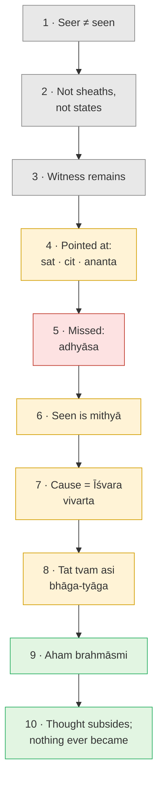

# Day 32 — DRILL III: Reconstructing "I Am Brahman"

> **Today's one idea (the drill target):** Rebuild the whole argument for *aham brahmāsmi* from a blank page, find the link that is weakest *for you*, defend the conclusion against three serious opponents without claiming more than it claims, and run it live through two doors until you see them land in the same place.
> **Reading time:** ~50 min (do the drills, don't read them) · **Prereqs:** [Days 6–18](../../02-vicharana/days/day-06-seer-and-seen.md), [Day 31](./day-31-the-thought-that-ends-itself.md)
> **Primary source for today:** Bṛhadāraṇyaka Upaniṣad 1.4.10, with Shankara's commentary — Swami Madhavananda (trans.), Advaita Ashrama, 1934.
> **Before you start:** Without looking — *what does the* akhaṇḍākāra vṛtti *remove, what happens to that thought once it has done its work, and what does the kataka nut do in muddy water?*

---

## How to use this drill

The last and hardest gym session. Days 9 and 19 drilled the bottleneck on single objects; today you drill it on the *whole argument*, under pressure. **Write or sit each exercise before opening anything.** "I can't remember what comes next" is a gap in the chain — Drill 2 catches it. "The opponent has a point" is good: each opponent is right about something; find what.

Bṛhadāraṇyaka 1.4.10, paraphrased: *in the beginning this was Brahman; it knew itself as "I am Brahman" (**aham brahmāsmi**), and so it became all. Whoever among gods, sages or humans awoke to this became That. But one who worships another, thinking "he is one and I am another", does not know.* That last line matters in Drill 4.

---

### Drill 1 — Rebuild the chain cold (15 min)

On a blank page, write the argument for *aham brahmāsmi* as a **numbered chain of 9–10 links**: one claim, one reason, and the day that earned it. No link may use a concept that a later link introduces. Where you go blank, write "???" and keep going — the blanks are the result.

Hint

Three movements. <strong>Find</strong> the seer (start from what you can check now: what is seen). <strong>Name</strong> it and explain why it's missed. <strong>Identify</strong> it: define both sides of an equation, solve it, say it in the first person.

Worked solution

1. **Seer ≠ seen** ([Day 6](../../02-vicharana/days/day-06-seer-and-seen.md)). Whatever is an object of awareness is not that awareness: form seen by eye, eye by mind, mind by witness, witness by nothing further (*Dṛg-Dṛśya-Viveka* 1).
2. **Not the sheaths, not the states** ([Days 7](../../02-vicharana/days/day-07-the-five-sheaths.md), [8](../../02-vicharana/days/day-08-three-states-one-witness.md), [10](../../02-vicharana/days/day-10-turiya.md)). All five sheaths are known; waking, dream and sleep come and go while their knowing doesn't. *Turīya* is what the three appear in.
3. **The witness remains** ([Days 5](../../01-shubheccha/days/day-05-who-is-asking.md), [17](../../02-vicharana/days/day-17-neti-neti.md)). Negate everything objectifiable and the negator remains — the *sākṣī*, un-negatable because it does the negating.
4. **Indicated, not described** ([Day 11](../../02-vicharana/days/day-11-sat-cit-ananda.md)). *Sat*, *cit*, *ananta* point at it — and Taittirīya 2.1 uses exactly these pointers for Brahman: *satyaṃ jñānam anantaṃ brahma*.
5. **Missed because of *adhyāsa*** ([Day 12](../../02-vicharana/days/day-12-adhyasa.md)). Seer and seen are superimposed both ways. Bondage is a mistake, so only knowledge undoes it.
6. **The seen is *mithyā*** ([Day 13](../../02-vicharana/days/day-13-mithya.md)). Real as appearance, with no being apart from its substrate. Non-duality never requires denying the world.
7. **Its cause is Īśvara** ([Day 15](../../02-vicharana/days/day-15-maya-and-ishvara.md)). Brahman with *māyā*; *vivarta*, not *pariṇāma*; *māyā* is itself *mithyā*, so a cause makes no second reality.
8. **The equation** ([Day 16](../../02-vicharana/days/day-16-tat-tvam-asi.md)). *Tat* (Īśvara) and *tvam* (jīva) contradict as packages; drop the incompatible parts (*bhāga-tyāga*), keep what both share: one consciousness.
9. **Therefore *aham brahmāsmi*** (Bṛh. 1.4.10). The identity owned in the first person: not "this body-mind is God", but "what 'I' refers to is the limitless".
10. **How it settles** ([Days 18](../../02-vicharana/days/day-18-ajativada.md), [31](./day-31-the-thought-that-ends-itself.md)). The sentence's thought-form removes ignorance and subsides; and from the highest standpoint no jīva ever turned into Brahman.

<strong>Common errors.</strong> (a) Jumping from 3 to 9 — "I'm the witness, so I'm Brahman." Without 6–8 it sounds like solipsism: <em>my</em> mind contains the universe. (b) Putting 8 before 7: you can't solve the equation before <em>tat</em> is defined. (c) Writing 9 as an experience ("then you feel oneness"). It is recognition of what was already so — the Tenth Man counting himself (<a href="../../01-shubheccha/days/day-04-the-tenth-man.md">Day 4</a>).

---

### Drill 2 — Find your weakest link

Rate each link of your chain 1–3: *could I defend this, out loud, to a sharp friend who doesn't want to believe it?* For the lowest, write (a) the strongest objection in one sentence, (b) the day that repairs it, (c) the repair in three sentences.

Hint

It's usually where you notice "I just accept this". For most people: the jump from <em>my</em> witness to <em>the</em> limitless.

Worked solution

| Link | Typical objection | Repair |
| --- | --- | --- |
| 3 → 4 | "I'm the witness of *my* mind. Why is my witness the same as yours, let alone limitless?" | What would make two witnesses two? A distinguishing feature — location, content, history — and every one is on the seen side (Day 6). Number belongs to the *upādhis* (Day 16). Note what Advaita does **not** claim: that logic alone proves the identity. The sentence (*śabda*) gives it; reasoning shows nothing blocks it ([Day 20](../../02-vicharana/days/day-20-shravana-manana-nididhyasana.md): *manana* as bodyguard). |
| 6 | "So the world is in my head — idealism." | The world depends on consciousness, not on *your mind*; your mind is itself seen (Day 13). |
| 8 | "Drop enough differences and anything equals anything." | *Bhāga-tyāga* is licensed only when the literal reading contradicts what is known *and* the text's purport is identity (Day 20's six signs). What remains isn't arbitrary: it's what both packages need in order to be known at all. |

Weak link elsewhere? Re-read the day that earned it and re-run this drill on that link.

---

### Drill 3 — The Buddhist objection (*anātman*)

A friend with twenty years of Theravāda practice says: *"Looking for the self, I find only arising and passing — sensations, perceptions, moments of consciousness, each conditioned and gone. There's no witness, only knowing-events. Your* sākṣī *is the old self smuggled back in."*

Reply in four parts: (a) where you agree, (b) the exact point of difference, (c) your argument there, (d) what you concede.

Hint

Days 5 and 6 named the convergence: no self <em>on the list</em>. Is "a moment of consciousness" on the list?

Worked solution

<strong>(a) Agree.</strong> No self on the list: body, feeling, perception, formations and every individual cognition are seen, impermanent, not-self. <em>Neti neti</em> (Day 17) negates the same items; Ramana looked for the ego and didn't find it (<a href="../../03-tanumanasa/days/day-26-ramana-who-am-i.md">Day 26</a>). The <em>sākṣī</em> has no qualities, no will, owns nothing — it isn't the self the Buddha refuted. 
<strong>(b) Difference:</strong> the status of awareness. In Abhidharma, consciousness (<em>viññāṇa</em>) is itself an aggregate, momentary and conditioned. For Advaita the momentary cognitions are <em>vṛttis</em> — seen, impermanent, agreed — but the knowing in which they come and go isn't one more moment. 
<strong>(c) Argument.</strong> To know a <em>succession</em> — "this arose after that", "I saw it then and recall it now" — something must be present at both ends. A string of moments, each gone before the next, can't by itself know it is a string. Shankara presses this against momentariness from memory and recognition (BSBh 2.2.25 <strong>[VERIFY]</strong>). The friend's own report — "I watched arising and passing" — was made from somewhere that didn't pass. 
<strong>(d) Concede.</strong> Some Buddhist traditions describe an unconditioned awareness in very similar terms (and see Albahari, <em>Analytical Buddhism</em>, 2006 — contested). And a "witness" held as a cherished inner thing <em>is</em> a smuggled self — which is why Day 29's second stage drops even the title "witness". 
<strong>One line:</strong> same non-finding; you differ on whether it shows there is no knower, or a knower that can't be found as an object.

---

### Drill 4 — The Dvaitin objection (with a callback to Day 18)

A follower of Madhva says: *"Jīva and God are eternally distinct — one finite and dependent, the other infinite and independent. Even* tat tvam asi *can be read* sa ātmā atat tvam asi*, 'you are* not *That'. Liberation is eternal blissful service, never identity. A creature saying 'I am God' is the height of arrogance."*

Reply in the same four parts. **Before opening the solution**, retrieve [Day 18](../../02-vicharana/days/day-18-ajativada.md): what does *Kārikā* 3.48 say about the jīva's birth, and how does that change the question "does the jīva become God?"

Hint

Which column of Day 16's table is the Dvaitin describing? Re-read the last line of Bṛh. 1.4.10.

Worked solution

<strong>(a) Agree.</strong> As packages, the Dvaitin is simply right — Day 16 said so: a little-knower isn't the all-knower. Advaita affirms the difference in <em>vyavahāra</em>, which is why worship and surrender stay meaningful (<a href="../../03-tanumanasa/days/day-22-bhakti-inside-advaita.md">Day 22</a>: the knower is the highest devotee, Gītā 7.17–18). 
<strong>(b) Difference:</strong> is the distinction in the nature of the two, or due to the <em>upādhis</em>? 
<strong>(c) Arguments.</strong> (i) <em>Purport.</em> Chāndogya 6 opens with "that by knowing which everything is known" and closes on identity, repeated nine times with illustrations (clay, salt in water) of non-difference of substance (Day 20's signs). The negative split (<strong>[VERIFY]</strong> as the standard Dvaita reading of 6.8.7) must survive all nine and those illustrations. And Bṛh. 1.4.10 calls "he is one and I am another" not-knowing. (ii) <em>Liberation.</em> A blissful state that a finite being enters is produced, and the produced ends (Days 4, 23). (iii) <em>What makes the jīva finite?</em> Limited knowledge, power, location — all seen, so they belong to the <em>upādhi</em>. 
<strong>Day 18 callback.</strong> <em>Kārikā</em> 3.48: no jīva is ever born; there is no cause for its birth. So Advaita does <strong>not</strong> say a creature becomes the Creator. Nothing becomes anything; what you are was never the jīva-package. The Dvaitin's horror is aimed at a claim Advaita rejects as firmly as he does. 
<strong>(d) Concede.</strong> Dvaita guards humility against a real failure: the ego swallowing the sentence ("I, this person, am God"). Day 33 names it. 
<strong>One line:</strong> the Dvaitin enters by devotion to the Other, Advaita by enquiry into the self — and Advaita keeps the devotion.

---

### Drill 5 — The physicalist objection

A neuroscientist says: *"Consciousness is brain activity. Anaesthesia switches it off; damage alters it; we map its correlates every year. Your 'witness' is a neural process with a Sanskrit name."*

Reply carefully: (a) what she gets right, (b) what the seer/seen structure shows — and doesn't, (c) where Albahari places the debate, (d) what you must **not** claim.

Hint

Day 6's exercise with the neuroscientist friend; Day 11: <em>cit</em> is not cognition. For Advaita, the mind itself belongs to the seen.

Worked solution

<strong>(a) Right.</strong> Every mental content tracks brain states. Advaita has no quarrel: it puts the mind and all its modifications on the <em>seen</em> side, as subtle matter (Days 6–7). Thoughts and moods changing with the brain is what it predicts. 
<strong>(b) What the structure shows.</strong> Every piece of evidence for the brain arrives as something <em>known</em>; "the knower is the brain" puts the knower on the list of the known. That doesn't refute physicalism. It shows it is a theory built from the seen, and leaves open whether it can explain the being-known of anything — the "hard problem". Whether anaesthesia ends awareness or only content and memory is Day 8's deep-sleep question again. 
<strong>(c) Albahari.</strong> "Perennial Idealism" (<em>Philosophers' Imprint</em> 19(44), 2019) argues that a view drawn from contemplative traditions — reality grounded in an unconditioned consciousness, with conditioned minds and matter as its manifestations — belongs among the live solutions to the mind–body problem: it avoids physicalism's hard problem and panpsychism's combination problem, while owing an account of how many conditioned minds arise from one ground <strong>[VERIFY: her exact framing of the problems]</strong>. She offers it as a rival hypothesis, not a proof. 
<strong>(d) Do not claim</strong> that neuroscience is wrong, that Advaita is empirically demonstrated, or that the witness can be detected or shown to survive the body. Claim only: the physicalist's knower is an object, so it's on the seen side; correlations never show awareness <em>is</em> an object; Advaita is a coherent reading of the same data. 
<strong>One line:</strong> physicalist and Advaitin agree about the whole seen side; they differ on the status of the seer.

---

### Drill 6 — One recognition, two doors (with a callback to Day 27)

**Door A — Shankara's equation (10 min).** Sit. Say "I" and list what it carries: this body, this mood, this history. Set aside everything seen; keep the knowing it all appeared to. Call up "That": the ground of everything. Set aside "all-knowing", "creator", "remote"; keep what that, too, would need in order to be known. Bring the remainders together: *is there anything to tell them apart by?*

**Door B — Ramana's enquiry (10 min).** Run [Day 26](../../03-tanumanasa/days/day-26-ramana-who-am-i.md)'s protocol: to whom does this thought arise? To me. Who am I? Turn toward the "me"; let each candidate be seen; return.

Write four lines: where each door started, what it removed, where it landed, where they met. **Callback, before opening:** from [Day 27](../../03-tanumanasa/days/day-27-nisargadatta-i-am.md), what separates "I am" from "I am this", and where would Nisargadatta's door sit beside these two?

Hint

Day 16: what does <em>tvam</em> contribute that <em>tat</em> lacks, and vice versa?

Worked solution

| | Door A — the equation | Door B — enquiry |
| --- | --- | --- |
| Starts from | A sentence heard from outside | The I-thought, felt from inside |
| Strength | **Limitlessness** — you are not small | **Immediacy** — you are not far away |
| Typical failure | Stays conceptual: you agree but don't look | Lands on a quiet state and calls it the Self |
| Lands in | One knowing, nothing to tell "here" from "there" | The knowing that seeks its owner and finds no object |

<strong>Where they meet:</strong> both strip away the seen and end at what can't be stepped out of to be examined. Their strengths are Day 16's two words — <em>tvam</em> gives immediacy, <em>tat</em> limitlessness — so each door is strong where the other is weak. Hence Day 30: scripture the pointer, enquiry the looking. 
<strong>Day 27 callback.</strong> "I am" is bare being before any predicate — the <em>sat</em> pointer, felt; "I am this" is <em>adhyāsa</em>. Nisargadatta's is a third door, through felt being, landing in the same place once the felt "I am" is itself seen as appearing. (The direct path, <a href="./day-29-direct-path.md">Day 29</a>, is a fourth: through perception.) 
<strong>In yourself:</strong> if both ended in one quiet recognition — <em>this knowing is not one thing among others</em> — notice it needed no maintaining: Day 31's kataka nut. If Door B ended in pleasant stillness, ask who is enjoying it.

---

**Transfer — apply it:**

> This week, catch one real moment where *aham brahmāsmi* — or "it's all one", "we are consciousness" — comes up: a friend, a podcast, a forum thread. Write one sentence: *the input* (the claim or objection as made), *what today's drill does to it* (which link of your chain it attacks or skips), and *the output* (your one-line, convergence-first reply). If nothing comes to mind in 60 seconds, re-read Drill 1's common errors and try again.

---

## Scoring yourself

One point per Drill 1 link produced cold in the right order (10). One point each for Drills 3–5 if your reply **began with agreement** and named the difference in one line (3). Two for Drill 6 if you located the meeting point from your own notes (2). 13–15: ready for Day 33. 9–12: redo Drills 1–2 in three days. Under 9: re-read Days 12, 13 and 16, then rebuild — the chain is the course.

---

## Suggested readings for today

**Required if you have 15 extra minutes:** Bṛhadāraṇyaka Upaniṣad **1.4.10** with Shankara's commentary (Madhavananda trans., 1934) — the source sentence of the whole course. Watch how Shankara reads "it became all" as the end of ignorance, not a change in Brahman, and how he handles "he is one, I am another".

**If you want the deep version:**
- Miri Albahari, **"Perennial Idealism: A Mystical Solution to the Mind-Body Problem"**, *Philosophers' Imprint* 19(44), 2019 — the strongest analytic case for Drill 5's position, written for unsympathetic philosophers. Note what she does *not* claim.
- Miri Albahari, ***Analytical Buddhism: The Two-Tiered Illusion of Self*** (Palgrave Macmillan, 2006) — argues the Buddhist denial of self leaves room for an unconditioned witness-consciousness. Contested; the best partner for Drill 3.
- Shankara, *Brahma-Sūtra-Bhāṣya* **2.2.18–32** (Gambhirananda trans.) — the critique of Buddhist momentariness, including the argument from memory **[VERIFY sūtra range]**. *Manana* in action.

---

## Navigation

← **Previous:** [Day 31 — The Thought That Ends Itself](./day-31-the-thought-that-ends-itself.md)
→ **Next:** [Day 33 — Obstacles: Doubt, Habit, Bypass](./day-33-obstacles.md)
